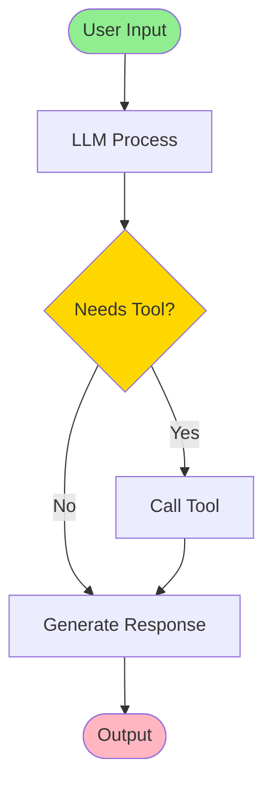
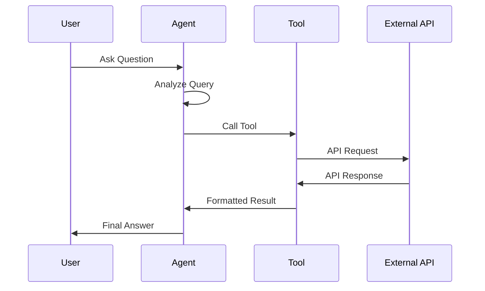
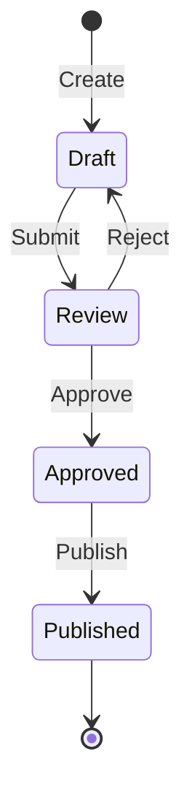
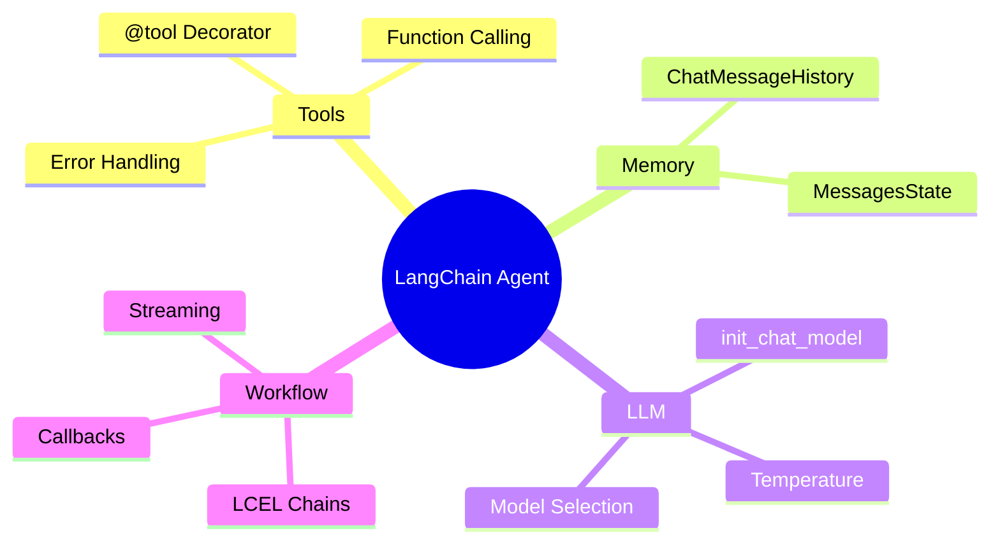
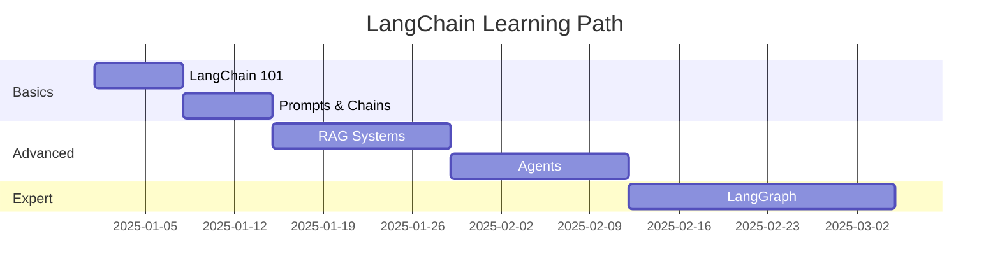
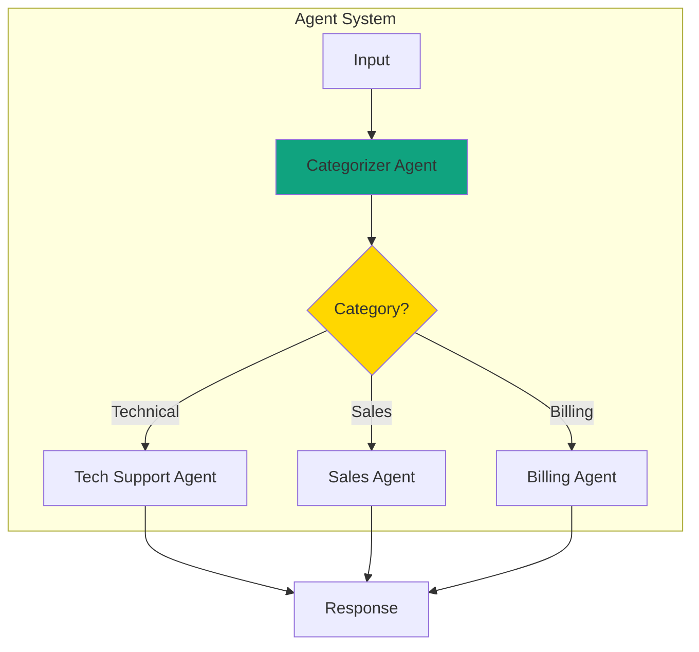
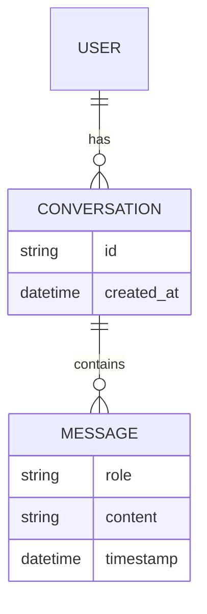
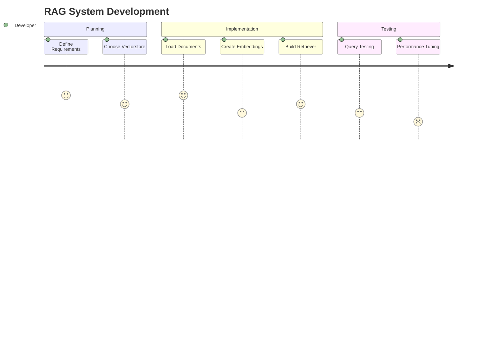

# Notebook Template Guide - Agenten Kurs

> **Best Practices für konsistente Jupyter Notebooks**

Dieses Dokument beschreibt die standardisierte Struktur und Patterns für alle Notebooks im Agenten-Kurs, basierend auf der Analyse der bestehenden M00-M18 Module.

---

## 📋 Quick Template

### Minimal-Template für neues Notebook

```markdown


<p><font size="5" color='grey'> <b>
[Modul-Titel]
</b></font> </br></p>

---
```

```python
#@title 🔧 Umgebung einrichten{ display-mode: "form" }
!uv pip install --system -q git+https://github.com/ralf-42/Agenten.git#subdirectory=04_modul
from genai_lib.utilities import check_environment, get_ipinfo, setup_api_keys, mprint, install_packages
setup_api_keys(['OPENAI_API_KEY', 'HF_TOKEN'], create_globals=False)
print()
check_environment()
print()
get_ipinfo()
```

```markdown
# 1 | Übersicht
---

[Einführungstext]

# 2 | [Hauptkonzept]
---

# 3 | Hands-On
---

# A | Aufgabe
---
```

---

## 🏗️ Standard-Struktur (ausführlich)

### 1️⃣ Header-Section (Zellen 0-2)

#### Zelle 0: Banner (Markdown)
```markdown

```

#### Zelle 1: Titel (Markdown)
```html
<p><font size="5" color='grey'> <b>
[Modul-Titel]
</b></font> </br></p>

---
```

**Beispiele:**
- `Retrieval Augmented Generation`
- `Agenten`
- `Chat Memory`

---

### 2️⃣ Setup-Section (Zellen 2-4)

#### Zelle 2: 🔧 Umgebung einrichten (Code, PFLICHT)

```python
#@title 🔧 Umgebung einrichten{ display-mode: "form" }
!uv pip install --system -q git+https://github.com/ralf-42/Agenten.git#subdirectory=04_modul
from genai_lib.utilities import check_environment, get_ipinfo, setup_api_keys, mprint, install_packages
setup_api_keys(['OPENAI_API_KEY', 'HF_TOKEN'], create_globals=False)
print()
check_environment()
print()
get_ipinfo()
```

**Wichtig:**
- `#@title ... { display-mode: "form" }` - collapsed by default
- `!uv pip install --system -q` - schneller als pip
- `setup_api_keys()` mit `create_globals=False`
- `check_environment()` und `get_ipinfo()` für Debugging

#### Zelle 3: 🛠️ Installationen (Code, OPTIONAL)

```python
#@title 🛠️ Installationen { display-mode: "form" }
install_packages([
    'langchain_huggingface',
    ('markitdown[all]', 'markitdown'),
    ('unstructured[all-docs]>=0.11.2', 'unstructured'),
])
```

**Wann verwenden:**
- Nur wenn zusätzliche Pakete außerhalb von genai_lib nötig
- Format: `('pip-name', 'import-name')` für unterschiedliche Namen

#### Zelle 4: 📂 Daten laden (Code, OPTIONAL)

```python
#@title 📂 Dokumente, Bilder { display-mode: "form" }
!rm -rf files
!mkdir files
!curl -L https://raw.githubusercontent.com/ralf-42/GenAI/main/02_daten/01_text/file.txt -o files/file.txt
```

**Wann verwenden:**
- Nur wenn externe Dateien benötigt werden
- Immer mit `rm -rf` und `mkdir` für Sauberkeit

---

### 3️⃣ Content-Section (Hauptkapitel)

#### Kapitel-Nummerierung

```markdown
# 1 | Übersicht
---

# 2 | [Hauptkonzept]
---

# 3 | Hands-On
---

# 4 | Deep Dive: [Thema]
---

# A | Aufgabe
---
```

**Regeln:**
- Hauptkapitel: `# [Nummer] | [Titel]`
- Immer `---` nach der Überschrift
- Letzte Aufgabe: `# A | Aufgabe`
- Optionale Zusatzthemen: `# B | [Titel]`

#### Unterkapitel

```markdown
## 2.1 | [Unterkapitel]

<p><font color='black' size="5">
[Überschrift ohne Nummer]
</font></p>

### [Kleinere Überschrift]
```

---

## 🎨 Styling & Formatierung

### Emoji-Konventionen

| Emoji | Verwendung | Beispiel |
|-------|------------|----------|
| 🔧 | Setup/Konfiguration | `#@title 🔧 Umgebung einrichten` |
| 🛠️ | Installationen | `#@title 🛠️ Installationen` |
| 📂 | Dateien/Daten | `#@title 📂 Dokumente, Bilder` |
| 🤖 | KI-Ausgabe | `mprint("## 🤖 KI:")` |
| 🧑 | User-Input | `mprint("## 🧑 Mensch:")` |
| ✅ | Best Practice | `# ✅ NEU (PFLICHT)` |
| ❌ | Deprecated/Vermeiden | `# ❌ ALT (nicht mehr verwenden)` |
| ⚠️ | Warnung | `⚠️ Debug-Hinweis` |
| 💡 | Tipp/Lösung | `💡 Lösung anzeigen` |
| 🎯 | Fazit/Ziel | `**🎯 FAZIT:**` |
| 🔍 | Suche/Ergebnisse | `mprint("## 🔍 Gefundene Dokumente")` |

### Farbige HTML-Überschriften

```html
<p><font color='black' size="5">
[Hauptüberschrift]
</font></p>

<p><font color='darkblue' size="4">
✨ <b>Empfehlung:</b>
</font></p>

<p><font color='darkblue' size="4">
ℹ️ <b>Information</b>
</font></p>

<p><font color='darkblue' size="4">
❗<b>Hinweis:</b>
</font></p>
```

### Markdown-Ausgaben mit mprint()

```python
mprint("## 🤖 KI-Agent:")
mprint("---")
mprint(f"**Antwort:** {response}")
mprint(f"**Zeit:** {time:.2f}s")
```

**Vorteile von mprint():**
- Konsistente Formatierung
- Unterstützt Markdown (Bold, Listen, etc.)
- Besser lesbar als print()

---

## 📝 Code-Patterns

### Import-Struktur (Standard-Reihenfolge)

```python
# 1. Standardbibliotheken
import re
from datetime import date
from pathlib import Path

# 2. LangChain Community
from langchain_community.document_loaders import TextLoader
from langchain_community.vectorstores import Chroma

# 3. LangChain OpenAI
from langchain_openai import OpenAIEmbeddings

# 4. LangChain Core - Moderne LCEL Imports
from langchain_core.prompts import ChatPromptTemplate
from langchain_core.runnables import RunnablePassthrough
from langchain_core.output_parsers import StrOutputParser
from langchain_core.tools import tool

# 5. LangChain (top-level)
from langchain.chat_models import init_chat_model
from langchain.agents import create_agent

# 6. Weitere Bibliotheken
from IPython.display import Image, display
import numpy as np
```

### LLM-Initialisierung (LangChain 1.0+ PFLICHT)

```python
# ✅ LangChain 1.0+: init_chat_model()
from langchain.chat_models import init_chat_model

model_provider = "openai"
model_name = "gpt-4o-mini"
temperature = 0.0

llm = init_chat_model(model_name, model_provider=model_provider, temperature=temperature)
```

**Separate Variablen verwenden für:**
- Bessere Konfigurierbarkeit
- Einfacheres Testen verschiedener Modelle
- Dokumentation der Parameter

### Tool-Definition (@tool Decorator)

```python
from langchain_core.tools import tool

@tool
def tool_name(param: str) -> str:
    """🔧 TOOL-NAME - Kurzbeschreibung (was LLM NICHT kann)

    Args:
        param: Beschreibung des Parameters

    Returns:
        Beschreibung des Rückgabewerts
    """
    try:
        # Tool-Logik
        result = do_something(param)
        return f"Ergebnis: {result}"
    except Exception as e:
        return f"Fehler: {e}"
```

**Best Practices:**
- Emoji im Docstring für visuelle Identifikation
- Betone was das LLM NICHT kann (z.B. "Aktuelle Daten", "Präzise Berechnungen")
- Try-Except für robuste Fehlerbehandlung
- Aussagekräftige Fehlermeldungen

### Agent-Erstellung (LangChain 1.0+ PFLICHT)

```python
from langchain.agents import create_agent

agent = create_agent(
    model=llm,
    tools=[tool1, tool2, tool3],
    system_prompt="Du bist ein hilfreicher Agent. Nutze Tools für aktuelle Daten.",
    # debug=True  # ⚠️ Kann in Colab zu OutStream-Fehler führen
)

# Agent aufrufen
response = agent.invoke({
    "messages": [{"role": "user", "content": "Deine Frage"}]
})
```

### LCEL Chains (LangChain 1.0+ PFLICHT)

```python
from langchain_core.output_parsers import StrOutputParser
from langchain_core.runnables import RunnablePassthrough

# ✅ Moderne LCEL Chain mit Pipe-Operator
chain = (
    {
        "context": retriever | format_documents,
        "question": RunnablePassthrough()
    }
    | prompt
    | llm
    | StrOutputParser()
)

# Aufruf
result = chain.invoke("Deine Frage")
```

---

## 🎓 Didaktische Patterns

### Typischer Notebook-Ablauf

```
1. Banner & Titel
   ↓
2. Setup (🔧 Umgebung + optional 🛠️ + 📂)
   ↓
3. Übersicht (Kapitel 1)
   - Was ist [Konzept]?
   - Warum ist es wichtig?
   ↓
4. Konzepte & Theorie (Kapitel 2-3)
   - Erklärungen
   - Diagramme/Visualisierungen
   - Tabellen
   ↓
5. Vergleiche (optional)
   - "LLM only" vs "Agent with Tools"
   - Tabellen mit ✅/❌
   ↓
6. Hands-On (Kapitel 4-5)
   - Schritt-für-Schritt Code
   - mprint() für Ausgaben
   ↓
7. Deep Dive (optional)
   - Erweiterte Themen
   - Details zu Implementierung
   ↓
8. Aufgaben (Kapitel A)
   - 2-3 Aufgabenstellungen
   - Schwierigkeitsgrade
```

### Vergleichstabellen (Standard-Pattern)

```markdown
| Aspekt | Methode A | Methode B |
|--------|-----------|-----------|
| **Vorteil 1** | ✅ Beschreibung | ❌ Beschreibung |
| **Vorteil 2** | ❌ Beschreibung | ✅ Beschreibung |
| **Performance** | ⚠️ Mittel | ✅ Schnell |
| **Komplexität** | ✅ Einfach | ❌ Komplex |

**🎯 FAZIT:**
- Verwende Methode A wenn: [Bedingung]
- Verwende Methode B wenn: [Bedingung]
```

### Code-Vergleiche (Alt vs. Neu)

```python
# ❌ ALT (nicht mehr verwenden)
old_code = "deprecated pattern"

# ✅ NEU (LangChain 1.0+ PFLICHT)
new_code = "modern pattern"
```

**Konsistente Marker:**
- `# ❌ ALT` - Deprecated Code
- `# ✅ NEU` - Moderne Best Practice
- `# ⚠️ WICHTIG` - Kritische Hinweise

### Expandable Details (für Lösungen/Hinweise)

```html
<details>
<summary>💡 Lösung anzeigen</summary>

```python
# Lösung hier
def solution():
    return "Antwort"
```

</details>
```

---

## 🖼️ Visualisierungen & Diagramme

### ⭐ EMPFOHLEN: Mermaid-Diagramme (PFLICHT für neue Notebooks!)

**Warum Mermaid?**
- ✅ Direkt im Markdown ohne externe Dateien
- ✅ Versionskontrolliert (Text statt Bilder)
- ✅ Konsistente Formatierung
- ✅ Einfach editierbar
- ✅ In GitHub, Jupyter (mit Extension) und Docs-Seiten unterstützt

#### 1. Flowcharts (Ablaufdiagramme)

**Verwendung:** Workflows, Prozesse, Entscheidungsbäume

```markdown

```

**Best Practices:**
- `TB` = Top-to-Bottom, `LR` = Left-to-Right
- `([...])` für Start/End (Pillen-Form)
- `{...}` für Decisions (Raute)
- `[...]` für Prozesse (Rechteck)
- Styles für wichtige Nodes

#### 2. Sequenz-Diagramme

**Verwendung:** API-Calls, Interaktionen zwischen Komponenten

```markdown

```

#### 3. State-Diagramme

**Verwendung:** LangGraph StateGraph, Workflow-Zustände

```markdown

```

#### 4. Mindmaps

**Verwendung:** Konzept-Übersichten, Feature-Maps

```markdown

```

#### 5. Gantt-Charts (Timeline)

**Verwendung:** Learning Paths, Projekt-Phasen

```markdown

```

#### 6. Graph-Diagramme (Nodes & Edges)

**Verwendung:** LangGraph Architecture, Multi-Agent Systems

```markdown

```

#### 7. ER-Diagramme (Entity-Relationship)

**Verwendung:** Datenmodelle, Schema-Designs

```markdown

```

#### 8. Journey-Maps

**Verwendung:** User Flows, Learning Paths

```markdown

```

### Mermaid Best Practices

**Standard-Farbschema:**
```markdown
style NODE1 fill:#10a37f    # Grün für Success/Start
style NODE2 fill:#FFD700    # Gelb für Decisions/Important
style NODE3 fill:#ff6b6b    # Rot für Errors/End
style NODE4 fill:#87CEEB    # Blau für Processing
style NODE5 fill:#FFA500    # Orange für Warnings
```

**Wann welcher Diagramm-Typ?**

| Anwendungsfall | Diagramm-Typ | Beispiel |
|----------------|--------------|----------|
| Workflow/Prozess | Flowchart | Agent Decision Flow |
| API-Interaktionen | Sequence | Tool Call Sequence |
| State-Management | State Diagram | LangGraph States |
| Konzept-Übersicht | Mindmap | LangChain Components |
| Zeitplan/Roadmap | Gantt | Learning Path |
| Architektur | Graph | Multi-Agent System |
| Datenmodell | ER-Diagram | Database Schema |
| User Experience | Journey | Workflow Development |

### Statische Bilder einbinden (nur wenn Mermaid nicht möglich)

```markdown

```

**Standard-Breiten:**
- Diagramme: `width="600"`
- Screenshots: `width="800"`
- Icons: `width="200"`

**Wann statische Bilder statt Mermaid?**
- Screenshots von UIs
- Fotografien
- Komplexe custom Grafiken
- Logos und Icons

### Externe Tools verlinken

**Häufig verwendete Tools:**
```markdown
[OpenAI Tokenizer](https://platform.openai.com/tokenizer)
[ChunkViz](https://chunkviz.up.railway.app/)
[RAG-Visualizer](https://editor.p5js.org/ralf.bendig.rb/full/RrfB3nCwK)
[Embedding Projector](https://projector.tensorflow.org/?hl=de)
[LangChain Docs](https://python.langchain.com/)
[Mermaid Live Editor](https://mermaid.live/)
```

### Interaktive Visualisierungen (p5.js)

Eigene Visualisierungen werden auf p5.js gehostet:
```markdown
[Fahrzeug 2D](https://editor.p5js.org/ralf.bendig.rb/full/LPjLkzWbE)
[Fahrzeug 3D](https://editor.p5js.org/ralf.bendig.rb/full/gFBwB2E8n)
```

---

## 📝 Aufgaben-Section

### Standard-Struktur

```markdown
# A | Aufgabe
---

Die Aufgabestellungen unten bieten Anregungen, Sie können aber auch gerne eine andere Herausforderung angehen.

<p><font color='black' size="5">
[Aufgabentitel]
</font></p>

[Aufgabenbeschreibung]

**[Optionale Teilaufgaben]:**
- Teilaufgabe 1
- Teilaufgabe 2
```

### Aufgaben-Typen

#### 1. Hands-On Übungen
```markdown
<p><font color='black' size="5">
Kalkulation
</font></p>

Gegeben ist eine Datei mit Gleichungen.
Verwende einen Agenten mit Tools, um jede Gleichung zu berechnen.
```

#### 2. Vergleichsaufgaben
```markdown
<p><font color='black' size="5">
RAG-Evaluation
</font></p>

Vergleiche verschiedene Chunk-Größen und evaluiere die Antwortqualität.
```

#### 3. Erweiterungs-Challenges
```markdown
<p><font color='black' size="5">
Multi-Agent System
</font></p>

Erweitere den Agenten zu einem Multi-Agent-System mit Supervisor-Pattern.
```

---

## ✅ Checkliste für neues Notebook

### Struktur
- [ ] Banner-Bild vorhanden (`genai-banner-2.jpg`)
- [ ] Titel im HTML-Format mit grauer Schrift (`<font size="5" color='grey'>`)
- [ ] `---` Separator nach Titel
- [ ] `🔧 Umgebung einrichten` Zelle (collapsed)
- [ ] Hauptkapitel mit `# [Nummer] | [Titel]` und `---`
- [ ] Aufgaben-Section `# A | Aufgabe` am Ende

### Code-Qualität (LangChain 1.0+)
- [ ] `init_chat_model()` statt direktem `ChatOpenAI()`
- [ ] `@tool` Decorator für Tools
- [ ] `create_agent()` für Agents
- [ ] LCEL `|` Chains
- [ ] Moderne Imports (`langchain_core`, `langchain.chat_models`)

### Didaktik
- [ ] Einführung/Übersicht vorhanden
- [ ] Code-Beispiele mit Erklärungen
- [ ] Vergleichstabellen mit ✅/❌
- [ ] `mprint()` für formatierte Ausgaben
- [ ] Emojis konsistent verwendet

### Visualisierung
- [ ] **Mermaid-Diagramme** für Workflows/Prozesse (PFLICHT!)
- [ ] Flowcharts für Agent-Abläufe
- [ ] Sequenz-Diagramme für API-Interaktionen
- [ ] State-Diagramme für LangGraph StateGraph
- [ ] Statische Bilder nur wenn Mermaid nicht möglich
- [ ] Links zu externen Tools (inkl. Mermaid Live Editor)
- [ ] Tabellen gut formatiert
- [ ] Farbige Überschriften für wichtige Sections
- [ ] Konsistentes Farbschema in Mermaid (Grün/Gelb/Rot/Blau)

### Dokumentation
- [ ] Docstrings für alle Tools
- [ ] Kommentare für komplexen Code
- [ ] Hinweise auf Best Practices
- [ ] Warnings bei bekannten Issues (z.B. Colab `debug=True`)

---

## 📊 Notebook-Typen & Anpassungen

### M00-M02: Einführungs-Module
**Charakteristik:**
- ~70% Markdown, 30% Code
- Viele Tabellen und Links
- Setup-Anleitungen
- Übersichtsdiagramme

**Template-Anpassung:**
- Mehr Text-Sections
- Weniger Code-Beispiele
- Links zu externen Ressourcen prominent

### M04a/M04b: Tutorial-Module
**Charakteristik:**
- ~50% Markdown, 50% Code
- Schritt-für-Schritt Erklärungen
- Viele Vergleiche (Alt vs. Neu)
- Best Practices hervorgehoben

**Template-Anpassung:**
- Detaillierte Code-Erklärungen
- Vergleichstabellen
- "Was das Notebook RICHTIG macht" Boxen

### M08-M14: Hands-On Module
**Charakteristik:**
- ~40% Markdown, 60% Code
- Prozess-Diagramme
- Deep Dive Sections
- Praktische Beispiele

**Template-Anpassung:**
- Mehr Code-Zellen
- `mprint()` für Output-Formatierung
- Visualisierungen des Workflows

### X-Reihe: Experimentelle Notebooks
**Charakteristik:**
- ~30% Markdown, 70% Code
- Fokus auf spezifische Use Cases
- Weniger Struktur-Overhead
- Direktere Implementierungen

**Template-Anpassung:**
- Minimales Setup
- Weniger didaktische Erklärungen
- Mehr Experimentier-Code

---

## 🎯 Best Practices Zusammenfassung

### Do's ✅
1. **Konsistente Struktur:** Banner → Setup → Kapitel → Aufgabe
2. **LangChain 1.0+:** Nur moderne Patterns verwenden
3. **Mermaid-Diagramme:** Für alle Workflows, Prozesse, Architekturen (PFLICHT!)
4. **mprint():** Für alle formatierte Ausgaben
5. **Emojis:** Konsistent und sinnvoll einsetzen
6. **Vergleichstabellen:** Alt vs. Neu, Vor- und Nachteile
7. **Externe Links:** Tools und Visualisierungen verlinken (inkl. Mermaid Live Editor)
8. **Setup collapsed:** `#@title ... { display-mode: "form" }`
9. **Separate Variablen:** model_name, temperature, etc.
10. **Farbschema:** Konsistente Farben in Mermaid (Grün/Gelb/Rot/Blau/Orange)

### Don'ts ❌
1. **Keine deprecated Patterns:** initialize_agent, Tool(), etc.
2. **Keine statischen Bilder für Diagramme:** Verwende Mermaid statt PNG/JPG!
3. **Kein direktes print():** Verwende mprint()
4. **Keine inkonsistenten Überschriften:** Immer `# [Nr] | [Titel]`
5. **Keine hartcodierten Werte:** Verwende Variablen
6. **Keine fehlenden Docstrings:** Alle Tools dokumentieren
7. **Kein Code ohne Erklärung:** Besonders bei komplexen Patterns
8. **Keine fehlenden Aufgaben:** Immer `# A | Aufgabe` Section
9. **Keine ungenutzten Imports:** Cleanup durchführen
10. **Keine inkonsistenten Farben:** Nutze Standard-Farbschema

---

## 📚 Referenz-Notebooks

**Best Practice Beispiele:**

| Notebook | Empfohlen für | Highlights |
|----------|---------------|------------|
| **M04a_LangChain101** | LangChain Basics | Alle 7 Must-Have Features perfekt umgesetzt |
| **M04b_LangGraph101** | LangGraph Workflows | StateGraph, Checkpointing, Streaming |
| **M10_Agenten_LangChain** | Agent-Implementierung | create_agent(), @tool, moderne Patterns |
| **M08_RAG_LangChain** | RAG-Systeme | LCEL Chains, Retriever, Vectorstores |
| **M06_Chat_Memory** | Memory Management | LangGraph MessagesState, MemorySaver |

**Verwende diese Notebooks als Template-Vorlage!**

---

**Version:** 2.0
**Letzte Aktualisierung:** November 2025
**Autor:** Agenten Projekt Team

**Changelog v2.0:**
- ✅ **Mermaid-Diagramme** als PFLICHT-Standard hinzugefügt
- ✅ 8 Mermaid-Diagramm-Typen mit Beispielen dokumentiert
- ✅ Standard-Farbschema für konsistente Visualisierungen definiert
- ✅ Entscheidungshilfe: Wann welcher Diagramm-Typ?
- ✅ Checkliste um Mermaid-Anforderungen erweitert
- ✅ Best Practices um Visualisierungs-Richtlinien erweitert
- ✅ Link zum Mermaid Live Editor hinzugefügt

---

> 💡 **Tipp:** Beginne neue Notebooks immer mit dem Quick Template und nutze **Mermaid-Diagramme** für alle Visualisierungen statt statischer Bilder!
