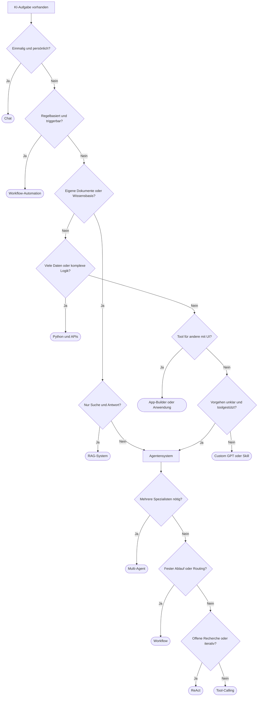

# Aufgaben & Lösungswege
{: .no_toc }

> **Erst den Lösungsweg wählen, dann die Agentenarchitektur.**

---

# Inhaltsverzeichnis
{: .no_toc .text-delta }

1. TOC
{:toc}

---

## Worum es in dieser Entscheidungshilfe geht

Viele Teams bauen schneller ein Agentensystem, als die Aufgabe es wirklich braucht. Das sieht dann zwar nach „modern“ aus, macht das Projekt aber oft unnötig kompliziert. In anderen Fällen passiert das Gegenteil: Man denkt das Problem zu klein und übersieht, dass mehrere Schritte, Werkzeugnutzung und Fehlerbehandlung eigentlich genau nach so einem System verlangen. Zwischen diesen beiden Extremen liegt der richtige Einstieg.

Diese Entscheidung läuft in zwei Stufen. Zuerst klärst du, welcher Lösungsweg überhaupt sinnvoll ist. Nicht jede Aufgabe braucht einen Agenten. Wenn das geklärt ist, kommt erst die zweite Frage: Welche Agentenarchitektur passt dazu?

Typischer Stolperstein: Erst über ReAct, Multi-Agent oder LangGraph reden, bevor klar ist, ob Chat, Workflow, RAG oder klassischer Code nicht schon reichen.

## Die erste Frage: Braucht die Aufgabe überhaupt einen Agenten?

Für Entwickler ist das die wichtigste Weichenstellung im ganzen Kurs. Ein Agent lohnt sich erst dann, wenn der Ablauf nicht vollständig im Voraus festgelegt werden kann und trotzdem eigenständig auf Daten, Tools oder Zwischenergebnisse reagieren muss. Wenn dagegen alles gut planbar ist, ist ein einfacherer Lösungsweg meistens robuster, günstiger und lässt sich besser testen.

Ein einmaliger persönlicher Textentwurf ist in der Regel eine Chat-Aufgabe. Ein wiederkehrender Prozess mit Triggern passt eher zu Workflow-Automation. Wenn es um Fragen über eine eigene Wissensbasis geht, ist oft ein RAG-System der naheliegende Weg. Sehr datenintensive Verarbeitung ist meist eher etwas für Python und APIs. Ein Werkzeug für andere Nutzer mit Oberfläche ist typischerweise ein App-Builder oder eine gezielte Anwendung. Erst wenn das Vorgehen explorativ wird, mehrere Schritte zu koordinieren sind und Werkzeuge aktiv genutzt werden, wird ein Agentensystem wirklich plausibel.

## Eine grobe Schnellentscheidung

| Wenn die Aufgabe so aussieht | Naheliegender Startpunkt |
|---|---|
| Einmalig, ad hoc, persönlich | Chat-Anwendung |
| Wiederkehrender Prozess mit Triggern | Workflow-Automation |
| Fragen über eigene Dokumente oder Wissensbasis | RAG-System |
| Sehr viele Daten oder komplexe Berechnungen | Python und APIs |
| Werkzeug für andere Nutzer mit UI | KI-App-Builder oder Anwendung |
| Wiederkehrende persönliche Unterstützung | Custom GPT oder Skill |
| Vorgehen unklar, mehrstufig, toolgestützt | Agentensystem |

Wer tiefer in die allgemeine GenAI-Perspektive einsteigen will, findet die ausführlichere Schwesterseite hier: [Aufgabenklassen & Lösungswege](https://ralf-42.github.io/GenAI/concepts/02-orientierung-entscheidung/aufgabenklassen-und-loesungswege.html).

## Woran sich ein echter Agentenfall erkennen lässt

Ein Agentensystem macht vor allem dann Sinn, wenn mehrere Punkte zusammenkommen. Dazu gehört, dass der Ablauf nicht vollständig vordefiniert werden kann. Außerdem müssen Werkzeuge oder externe Systeme eingebunden werden. Und spätere Schritte hängen tatsächlich von früheren Ergebnissen ab.

Oft kommt noch hinzu, dass das System nicht nur Fehler anzeigt, sondern selbstständig darauf reagiert oder einen alternativen Weg wählt.

Ein guter Praxistest: Würde ein fester Ablauf mit klaren Regeln dieselbe Aufgabe zuverlässig lösen? Wenn ja, spricht meist mehr für Workflow oder Code als für einen Agenten.

Grenze: Auch eine offene Formulierung in natürlicher Sprache bedeutet nicht automatisch „Agent“. Viele Anfragen, die sich so anfühlen, lassen sich am Ende trotzdem mit klaren Pipelines lösen.

## Warnsignale gegen Agentensysteme

Wenn eine Aufgabe immer denselben festen Ablauf hat, ist Workflow-Automation meist die bessere Wahl. Wenn nur eigene Dokumente durchsucht und zusammengefasst werden sollen, reicht oft ein RAG-System. Wenn es keine echten Entscheidungspunkte gibt, genügt meist ein Skript oder eine API-Anwendung.

Viele unterschätzen, was ein Agent zusätzlich kostet: Testaufwand, Fehlerdiagnose und laufende Komplexität. Ein Agent ist kein Qualitätsversprechen, sondern ein Werkzeug für einen bestimmten Aufgabentyp.

## Die zweite Frage: Welche Agentenarchitektur passt dann?

Wenn du in Stufe 1 sicher bist, dass ein Agent wirklich nötig ist, kommt die Architekturentscheidung. Auch hier gilt: Am Ende gewinnt meist die einfachste Struktur, die die Aufgabe zuverlässig löst.

Für viele erste Projekte passt ein Tool-Calling-Agent gut. Wenn es um offene Recherche oder Problemlösung mit unbekanntem Weg geht, wird eher ReAct sinnvoll. Feste Schritte, Routing oder Qualitätsgates sprechen eher für einen Workflow. Mehrere Spezialrollen lohnen sich erst dann, wenn die Arbeitsteilung wirklich einen spürbaren Mehrwert bringt. Ein RAG-Agent ist im Kern ein Wissenszugriff mit zusätzlicher Agentenlogik und sollte nur gewählt werden, wenn Retrieval und eigenständige Weiterverarbeitung zusammen gebraucht werden.

## Eine grobe Schnellentscheidung für die Architektur

| Wenn das Agentensystem so aussieht | Naheliegende Architektur |
|---|---|
| Definierte Tools, klarer Auftrag, begrenzte Freiheit | Tool-Calling-Agent |
| Offene Recherche, unbekannter Lösungsweg, iterative Schleifen | ReAct-Agent |
| Mehrstufiger Prozess mit Reihenfolge, Routing oder Freigaben | Workflow |
| Mehrere Spezialisten mit klarer Arbeitsteilung | Multi-Agent-System |
| Wissenszugriff plus autonome Weiterverarbeitung | RAG-Agent |

## Tool-Calling: oft der beste Einstieg

Beim Tool-Calling wählt das Modell aus einer definierten Liste von Werkzeugen und ruft sie mit konkreten Parametern auf. Das funktioniert gut, wenn deine „echten Aktionen“ klar in kontrollierten Tools landen, zum Beispiel Kalenderzugriff, CRM-Abfragen oder E-Mail-Versand. Das Modell kann dabei flexibel formulieren – die eigentliche Aktion bleibt kontrollierbar.

In der Praxis relevant, wenn: Werkzeuge klar benannt sind, der Auftrag begrenzt bleibt und kein komplexer mehrstufiger Plan nötig ist.

## ReAct: wenn der Weg zur Lösung noch offen ist

ReAct arbeitet in einem Zyklus aus Denken, Handeln und Beobachten. Der Agent prüft eine Lage, führt eine Aktion aus und reagiert anschließend auf das Ergebnis. Das Muster passt besonders gut zu Recherche, Debugging oder offenen Problemlösungen – also überall dort, wo der nächste Schritt erst nach Sichtung der bisherigen Ergebnisse feststeht.

Grenze: ReAct kann bei unklaren Aufgaben teuer und langsam werden. Ohne Begrenzung von Iterationen oder Budget verliert das System schnell die Kontrolle.

## Workflow: wenn die Reihenfolge wichtiger ist als Freiheit

Workflow-basierte Agentensysteme passen gut, wenn es klare Stufen gibt. Dazu zählen Routing, Qualitätsprüfungen, Freigaben oder feste Verarbeitungsketten. Der Vorteil liegt in der Vorhersagbarkeit. Ein Workflow lässt sich meist leichter testen und überwachen als ein frei planender Agent.

Nicht geeignet, wenn: die Aufgabe stark explorativ ist und der Lösungsweg sich erst während der Bearbeitung ergibt.

## Multi-Agent: nur wenn Arbeitsteilung wirklich hilft

Ein Multi-Agent-System verteilt Aufgaben auf spezialisierte Rollen wie Recherche, Schreiben, Review oder Code. Das kann sinnvoll sein, wenn die Teilaufgaben fachlich so unterschiedlich sind, dass ein einzelner Agent an Grenzen stößt oder parallele Arbeit tatsächlich Nutzen bringt.

Typischer Fehler: Multi-Agent zu wählen, weil es eindrucksvoll klingt. Häufig löst ein einzelner Workflow mit guten Knoten dieselbe Aufgabe einfacher. 

## RAG-Agent: wenn Wissen und Handeln zusammenkommen

Ein RAG-Agent verbindet Wissenszugriff mit weiterer Agentenlogik. Das ist mehr als nur Suche oder eine Antwortmaschine. Das System liest Informationen aus einer Wissensbasis, bewertet sie im Kontext der Aufgabe und leitet daraus weitere Schritte ab.

Ein Beispiel: Ein interner Support-Agent, der nicht nur eine Richtlinie zitiert, sondern daraus eine passende Maßnahme vorbereitet oder einen Folgeprozess startet. Genau dort liegt der Mehrwert gegenüber einem reinen RAG-System.

## Ein vollständiger Entscheidungsbaum



## Praxisbeispiele für Ebene 1

Eine E-Mail besser formulieren ist meistens eine Chat-Aufgabe. Rechnungen automatisch zu erfassen spricht für Workflow-Automation. Fragen über interne Handbücher passen häufig zu RAG. Eine Auswertung von 50.000 Kundenbewertungen gehört meist eher in Python und APIs als in einen frei laufenden Agenten. Ein interner HR-Assistent mit Oberfläche deutet eher auf eine Anwendung mit UI hin. Ein persönlicher Schreibassistent mit festem Stil kann dagegen gut als Custom GPT oder Skill funktionieren.

## Praxisbeispiele für Ebene 2

| Aufgabe | Warum diese Wahl plausibel ist | Architektur |
|---|---|---|
| Informationen zu einem Thema im Web finden | offener, iterativer Rechercheweg | ReAct-Agent |
| Kundenanfragen per Kalender und CRM beantworten | klar definierte Tools, begrenzter Auftrag | Tool-Calling-Agent |
| Code analysieren, Refactoring vorschlagen und Umsetzung prüfen | feste Reihenfolge mit klaren Schritten | Workflow |
| Marktanalyse mit Recherche, Text und Visualisierung erzeugen | klare Spezialrollen und Arbeitsteilung | Multi-Agent-System |
| Fragen über interne Dokumente beantworten und Maßnahmen ableiten | Wissenszugriff plus eigenständige Weiterverarbeitung | RAG-Agent |

## Häufige Fehlentscheidungen

Agenten für triviale Aufgaben sind einer der häufigsten Gründe, warum Projekte unnötig schwer werden. Wenn der Ablauf immer gleich bleibt, ist ein Workflow günstiger und besser testbar. Fast genauso häufig wird Multi-Agent zu früh gewählt, obwohl ein einzelner Workflow mit Routing genügt.

ReAct ohne Kostenkontrolle ist ein weiteres Risiko. Wenn es keine Iterationsgrenzen und Budgets gibt, kann die Schleife schnell ausufern. Ebenso problematisch: feste Schrittfolgen als Tool-Calling-Agent bauen. Dann landet ein frei entscheidendes System dort, wo eigentlich ein deterministischer Ablauf passender wäre.

Datenschutz und Human-in-the-Loop werden ebenfalls oft zu spät berücksichtigt. Sobald sensible Daten, E-Mail-Versand, Löschaktionen oder Buchungen ins Spiel kommen, reicht eine gute Modellantwort nicht mehr aus. Dann braucht die Lösung klare Kontrollpunkte.

## Checkliste vor dem Agentenbau

Am Anfang steht der Lösungsweg. Kläre zuerst: Reichen Chat, Workflow, RAG oder klassischer Code aus? Ist das Vorgehen wirklich nicht vollständig definierbar? Werden Tools oder Autonomie tatsächlich gebraucht?

Danach folgt die Architekturfrage. Wurde die Struktur bewusst gewählt oder nur aus Begeisterung für Multi-Agent? Passt die Komplexität zum Anwendungsfall? Und gibt es einen Plan für Fehlerbehandlung, Fallbacks und Eskalation?

Zum Schluss zählt der Betrieb. Iterationsgrenzen, Kostenkontrolle, Human-in-the-Loop, Datenschutzentscheidungen und Monitoring gehören nicht „irgendwann danach“ dazu. Sie sind Teil der Architekturentscheidung.

```text
Kurzcheck:
- Reicht ein einfacherer Lösungsweg?
- Falls nein: Welche Agentenarchitektur löst das Problem mit der geringsten zusätzlichen Komplexität?
- Sind Kosten, Datenschutz und kritische Aktionen von Anfang an mitgedacht?
```

## Abgrenzung zu verwandten Dokumenten

| Dokument | Frage |
|---|---|
| [Agenten-Architekturen]({{ '/04-agenten-implementierung/entwurf/agent-architekturen.html' | relative_url }}) | Wie unterscheiden sich ReAct, Tool-Calling, Workflow und Multi-Agent im Detail? |
| [Multi-Agent-Systeme]({{ '/06-multi-agent-erweiterungen/multi-agent-systeme.html' | relative_url }}) | Wann lohnt sich echte Arbeitsteilung zwischen mehreren Agenten? |
| [Human-in-the-Loop]({{ '/04-agenten-implementierung/ablauf-zustand/human-in-the-loop.html' | relative_url }}) | An welchen Stellen müssen Menschen zur Kontrolle oder Freigabe eingebunden werden? |
| [Modellauswahl]({{ '/03-modelle-provider-anpassung/modellauswahl.html' | relative_url }}) | Welches Modell passt zu welcher Rolle im gewählten System? |

---

**Version:** 1.1<br>
**Stand:** Mai 2026<br>
**Kurs:** KI-Agenten. Planen. Handeln. Prüfen.