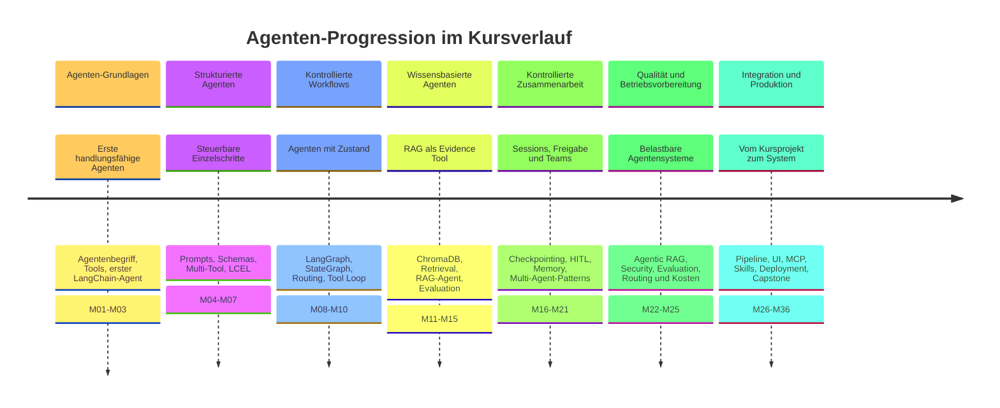

# Kursüberblick
{: .no_toc }

> **KI-Agenten. Planen. Handeln. Prüfen.**

---

## Inhaltsverzeichnis
{: .no_toc .text-delta }

1. TOC
{:toc}

---

## Worum es in diesem Kurs geht

Der Kurs zeigt, wie aus einzelnen KI-Funktionen kontrollierte Agentensysteme werden. Im Mittelpunkt stehen Anwendungen, die Aufgaben nicht nur beantworten, sondern planen, Werkzeuge nutzen, Zwischenergebnisse prüfen und bei Bedarf Menschen einbeziehen.

Der rote Faden ist ein **Meeting- & Research-Briefing-Agent**. Er arbeitet mit einem kuratierten Projektkorpus, sucht relevante Quellen, erstellt belegbare Antworten, erkennt Grenzen des Wissens und macht kritische Entscheidungen prüfbar.

Der Fokus liegt auf praktischer Umsetzung mit Python, LangChain, LangGraph, LangSmith und ChromaDB. Theoretische Konzepte werden so weit erklärt, wie sie für Entwurf, Implementierung und Bewertung eines Agentensystems nötig sind.

## Zielgruppe

Der Kurs passt besonders für:

- Entwicklerinnen und Entwickler mit Python-Grundlagen,
- IT-Fachkräfte, die KI-Agenten in Arbeitsprozesse einordnen möchten,
- fortgeschrittene GenAI-Anwenderinnen und -Anwender, die von Prompts und Chains zu kontrollierten Workflows wechseln wollen.

Hilfreich sind sichere Grundlagen in Python, Jupyter/Colab und API-Nutzung.

Der Kurs baut sinnvoll auf dem GenAI-Kurs auf. Wer Prompting, Modellaufrufe, Chains, RAG und strukturierte Ausgaben bereits kennt, kann sich hier auf die nächste Stufe konzentrieren: kontrollierte Handlung, Zustand, Tool-Auswahl, Freigabe und Evaluation.

## Was Sie mitnehmen

Nach dem Kurs sollten Sie in der Lage sein:

- Agenten von Chatbots, Chains und klassischen Workflows abzugrenzen,
- Tools, Prompts, State und Routing gezielt zu kombinieren,
- RAG als Evidence Tool in Agenten einzubinden,
- LangGraph für kontrollierte mehrstufige Abläufe zu nutzen,
- Human-in-the-Loop, Evaluation, Security und Budgetkontrolle einzuplanen,
- einen Meeting- & Research-Briefing-Agenten als eigenes Capstone-Projekt weiterzuentwickeln.

## Kursstruktur

Die Module führen von ersten Agentenbegriffen über Tool Use, LangGraph, RAG und Multi-Agent-Patterns bis zu Evaluation, Betrieb und Capstone.

| Bereich | Inhalte |
|---|---|
| **Agenten-Grundlagen** | Agentenbegriff, ReAct/TAO, Tool Use, erster LangChain-Agent |
| **Struktur und Steuerung** | Prompt Engineering, Structured Output, Multi-Tool-Agenten, LCEL |
| **Kontrollierte Workflows** | LangGraph, StateGraph, Conditional Routing, Tool Loop |
| **Wissen und Kontext** | RAG, ChromaDB, Retrieval als Tool, LangSmith-Evaluation |
| **Kontrolle und Zusammenarbeit** | Sessions, HITL, Memory, Multi-Agent-Patterns |
| **Qualität und Betrieb** | Security, Evaluation, Routing, Kostenkontrolle, Integration, Deployment |

Weitere Themen sind Agentic RAG, Model Context Protocol, DeepAgents, Skill-Design, Production Deployment und Governance-Fragen für reale Agentensysteme.

## Kursprogression

## Modulübersicht

Die Nummerierung reicht von M01 bis M36. M29 ist derzeit nicht belegt; M30 liegt in zwei Varianten vor: lokal und HuggingFace-basiert. M10, M26, M32 und M35 liegen je in zwei aufeinander aufbauenden Teil-Notebooks (a/b) vor.

| Modul | Block | Inhalt | Schwerpunkt |
|:---:|---|---|---|
| M01 | Agenten-Grundlagen | Was sind KI-Agenten? | Agentenbegriff, ReAct/TAO, Kurszielbild |
| M02 | Agenten-Grundlagen | Tool Use & Function Calling | Werkzeuge als kontrollierte Handlungsebene |
| M03 | Agenten-Grundlagen | Erste Agenten mit LangChain | `create_agent()`, Tool-Auswahl, erster Briefing-Agent |
| M04 | Strukturierte Agenten | Prompt Engineering | Rollen, Grenzen, Tool-Regeln |
| M05 | Strukturierte Agenten | Structured Output | Antwortschema, Quellenpflicht, Prüfbarkeit |
| M06 | Strukturierte Agenten | Multi-Tool Agents | Mehrere Tools, Fehlerbehandlung, Auswahl |
| M07 | Strukturierte Agenten | LCEL Chains | Kontrollierte Teilketten und Übergang zu LangGraph |
| M08 | Kontrollierte Workflows | Warum LangGraph? | Grenzen einfacher Agents, expliziter State |
| M09 | Kontrollierte Workflows | StateGraph Basics | Nodes, Edges, State und Verbesserungsschleifen |
| M10a | Kontrollierte Workflows | Conditional Routing & Qualitäts-Gate | Routing, Qualitäts-Gate, Security-Basics |
| M10b | Kontrollierte Workflows | Tool-Loop | Tool-Loop, Tool-Steuerung im Graph |
| M11 | Wissensbasierte Agenten | RAG-Konzepte & Embeddings | Korpus, Embeddings, Chunking |
| M12 | Wissensbasierte Agenten | ChromaDB Indexing | Vektordatenbank, Indexierung, Abfrage |
| M13 | Wissensbasierte Agenten | RAG Chain mit LangChain | Retriever, Quellenbindung, Antwortkette |
| M14 | Wissensbasierte Agenten | RAG-Agent | Retrieval als Agenten-Tool |
| M15 | Wissensbasierte Agenten | LangSmith Evaluations Basics | Eval-Set, Retrieval-Score, Regression |
| M16 | Kontrollierte Zusammenarbeit | Checkpointing & Sessions | Sitzung, Thread-ID, Fortsetzen |
| M17 | Kontrollierte Zusammenarbeit | Human-in-the-Loop | Review, Freigabe, Unterbrechung |
| M18 | Kontrollierte Zusammenarbeit | Memory-Systeme | Kurzzeit- und Langzeitgedächtnis |
| M19 | Kontrollierte Zusammenarbeit | Multi-Agent Patterns | Supervisor, Hierarchie, Pipeline |
| M20 | Kontrollierte Zusammenarbeit | Supervisor Pattern | Worker, Supervisor, Guardrails |
| M21 | Kontrollierte Zusammenarbeit | Hierarchical Pattern | Teams, Rollen, Delegation |
| M22 | Qualität und Betriebsvorbereitung | Agentic RAG | Retrieval-Budget, Grounding, OOC-Stopp |
| M23 | Qualität und Betriebsvorbereitung | Agent Security Best Practices | Prompt Injection, Tool-Gating, Audit |
| M24 | Qualität und Betriebsvorbereitung | Agent Evaluation & Testing | Tests, Regression, RAGAS-Live-Lauf |
| M25 | Qualität und Betriebsvorbereitung | Model Routing & Cost Control | Fallback, Circuit Breaker, Budget Gate |
| M26a | Integration und Produktion | Integration Pipeline | Meeting- & Research-Briefing-System als E2E-Pipeline |
| M26b | Integration und Produktion | Projekt-Templates & MVP | Eigene Templates A/B/C, MVP-Definition |
| M27 | Integration und Produktion | Advanced RAG Pipeline Patterns | Self-RAG, Reranking, CRAG |
| M28 | Integration und Produktion | Gradio UI für Agenten | Chat UI, Streaming, HITL-UI |
| M30 | Integration und Produktion | MCP Local / HuggingFace | Standardisierte Tool-Integration |
| M31 | Integration und Produktion | Agent Skill Compliance | Skill-Struktur, Guardrails, Mixed Models |
| M32a | Integration und Produktion | DeepAgents Harness | Planning, Tools, Sub-Agenten (Kern) |
| M32b | Integration und Produktion | DeepAgents: Parameter & Einordnung | Weitere Parameter, Sandbox, Vergleich zu LangGraph |
| M33 | Integration und Produktion | DeepAgents Skill Meeting Briefing | Meeting-Briefing als Skill |
| M34 | Integration und Produktion | DeepAgent Multi-Skill | Multi-Skill-Routing und Progressive Disclosure |
| M35a | Integration und Produktion | Production Deployment | Notebook → Production, Modell-Konfig, Docker |
| M35b | Integration und Produktion | Production: API & Monitoring | FastAPI, Monitoring, Kursrückblick |
| M36 | Integration und Produktion | Capstone | Eigenes Agentensystem als Abschlussprojekt |

## Vorbereitung

Für die praktischen Übungen werden typischerweise benötigt:

- ein Google-Account für Google Colab und Google Drive,
- ein OpenAI-Account mit API-Key und kleinem API-Guthaben,
- ein LangSmith-Account für Tracing, Debugging und Evaluation,
- ein Gerät, auf dem Browser, Notebook-Umgebung und Kursmaterial zuverlässig funktionieren,
- Grundverständnis von Python-Funktionen, Decorators, Type Hints, Dictionaries und Fehlerbehandlung.

Bei Business-Laptops sollte vorab geprüft werden, ob Cloud-Dienste, API-Zugriffe, GitHub, Google Colab und LangSmith durch die IT-Richtlinien erlaubt sind.

Nützliche Einstiege:

- [OpenAI Platform](https://platform.openai.com/)
- [LangSmith](https://smith.langchain.com/)
- [Google Colab](https://colab.research.google.com/)

## Arbeitsweise

Der Kurs ist als Werkstatt aufgebaut. Die Notebooks sind nicht nur Lesematerial, sondern sollen ausgeführt, verändert und kritisch geprüft werden. Jede größere Technik wird am Meeting- & Research-Briefing-Agenten eingeordnet: Was plant der Agent, welche Handlung führt er aus, und wie wird das Ergebnis geprüft?

Sinnvoll ist es, eigene Fragen oder kleine Prozessideen mitzubringen. Dadurch wird schneller sichtbar, wann ein Agent wirklich hilft und wann ein klassischer Workflow, eine einfache Chain oder ein RAG-System ohne Agent ausreicht.

## Lernen mit KI

Generative KI darf im Kurs als Lern- und Entwicklungshilfe genutzt werden. Bei Fehlermeldungen, Verständnisfragen oder Varianten kann ein Modell helfen, Teilschritte zu erklären oder alternative Implementierungen vorzuschlagen.

Die Grenze bleibt wichtig: Die KI ersetzt nicht das eigene Verständnis. Der Schwerpunkt liegt darauf, Agentensysteme selbst zu entwerfen, auszuführen, zu beobachten und zu bewerten.

## Kompetenzillusion vermeiden

Agenten-Demos können schnell überzeugend wirken, obwohl wichtige Kontrollpunkte fehlen. Gerade bei mehrstufigen Systemen entsteht leicht der Eindruck, der Agent habe verstanden, geplant und geprüft, obwohl er nur plausibel formuliert.

Deshalb gehören im Kurs immer drei Prüfbewegungen dazu:

- Tool-Aufrufe und Zwischenschritte sichtbar machen,
- Quellen, State und Entscheidungen nachvollziehen,
- Ergebnisse mit Tests, Human-in-the-Loop oder Evaluation prüfen.

## Nächste Schritte

| Dokument | Frage |
|---|---|
| [Lohnt es sich?](./lohnt-es-sich.html) | Ist ein Agent für diese Aufgabe überhaupt sinnvoll? |
| [Aufgabenklassen & Lösungswege](./aufgabenklassen-und-loesungswege.html) | Welche Lösungsklasse passt zur Aufgabe? |
| [Meeting- & Research-Briefing-Agent](./meeting-research-briefing-leitaufgabe.html) | Welches Kursprojekt verbindet die Module? |
| [Lernpfad](../lernpfad.html) | Welche Dokumente passen zu meinem Lernziel? |

---

**Version:** 1.0 
**Stand:** Juli 2026 
**Kurs:** KI-Agenten. Planen. Handeln. Prüfen.
