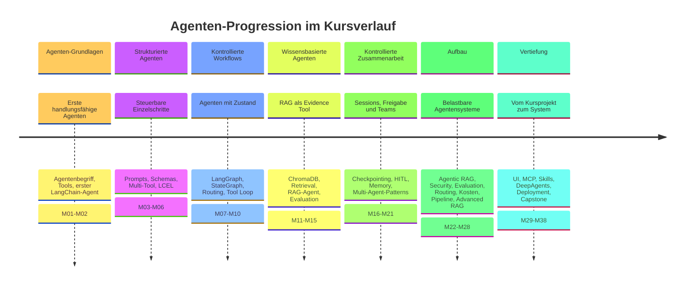

# Kursüberblick
{: .no_toc }

> **KI-Agenten. Planen. Handeln. Prüfen.**

---

## Inhaltsverzeichnis
{: .no_toc .text-delta }

1. TOC
{:toc}

---

## Worum es in diesem Kurs geht

Der Kurs zeigt, wie aus einzelnen KI-Funktionen kontrollierte Agentensysteme werden: Anwendungen, die planen, Werkzeuge nutzen, Zwischenergebnisse prüfen und bei Bedarf Menschen einbeziehen.

Der rote Faden ist ein **Meeting- & Briefing-Agent**. Er arbeitet mit einem kuratierten Projektkorpus, sucht relevante Quellen, erstellt belegbare Antworten, erkennt Grenzen des Wissens und macht kritische Entscheidungen prüfbar.

Der Fokus liegt auf praktischer Umsetzung mit Python, LangChain, LangGraph, LangSmith und ChromaDB. Theorie wird so weit erklärt, wie sie für Entwurf, Implementierung und Bewertung nötig ist.

## Zielgruppe

Der Kurs passt besonders für:

- Entwicklerinnen und Entwickler mit Python-Grundlagen,
- IT-Fachkräfte, die KI-Agenten in Arbeitsprozesse einordnen möchten,
- fortgeschrittene GenAI-Anwenderinnen und -Anwender, die von Prompts und Chains zu kontrollierten Workflows wechseln wollen.

Hilfreich sind sichere Grundlagen in Python, Jupyter/Colab und API-Nutzung.

Der Kurs baut auf dem GenAI-Kurs auf. Wer Prompting, Modellaufrufe, Chains, RAG und strukturierte Ausgaben kennt, kann sich hier auf kontrollierte Handlung, Zustand, Tool-Auswahl, Freigabe und Evaluation konzentrieren.

## Was der Kurs vermittelt

Nach dem Kurs ist es möglich:

- Agenten von Chatbots, Chains und klassischen Workflows abzugrenzen,
- Tools, Prompts, State und Routing gezielt zu kombinieren,
- sichtbare Planungs-, Tool- und Prüf-Artefakte statt versteckter Gedankengänge zu nutzen,
- RAG als Evidence Tool in Agenten einzubinden,
- LangGraph für kontrollierte mehrstufige Abläufe zu nutzen,
- Human-in-the-Loop im Grundlagenpfad umzusetzen und Evaluation, Security und Budgetkontrolle über die Aufbaumodule einzuplanen,
- einen Meeting- & Briefing-Agenten als eigenes Capstone-Projekt weiterzuentwickeln.

Das praktische Ergebnis ist kein loses Beispielset, sondern ein wachsendes Zielsystem: ein Agent, der Projektmaterial durchsucht, relevante Evidenz sammelt, Entscheidungen sichtbar macht, menschliche Freigaben einbezieht und am Ende als überprüfbarer Prototyp weitergeführt werden kann.

## Kursstruktur

Die Module führen von ersten Agentenbegriffen über Tool Use, LangGraph, RAG und Multi-Agent-Patterns bis zu Evaluation, Betrieb und Capstone.

| Bereich | Inhalte |
|---|---|
| **Agenten-Grundlagen** | Agentenbegriff, ReAct/TAO als sichtbarer Tool-Zyklus, Tool Use, erster LangChain-Agent |
| **Strukturierte Agenten** | Prompt Engineering, Structured Output, Multi-Tool-Agenten, LCEL |
| **Kontrollierte Workflows** | LangGraph, StateGraph, Conditional Routing, Planning-Patterns, Tool Loop |
| **Wissensbasierte Agenten** | RAG, ChromaDB, Retrieval als Tool, LangSmith-Evaluation |
| **Kontrollierte Zusammenarbeit** | Sessions, HITL, Memory, Multi-Agent-Patterns |
| **Aufbau: Qualität und Integration** | Agentic RAG, Security, Evaluation, Routing, Kostenkontrolle, Pipeline, Projekt-Templates, Advanced RAG |
| **Vertiefung: Skills und Produktion** | UI, MCP, Skill-Design, DeepAgents, Deployment, Capstone |

Der Grundlagenpfad M01–M21 ist auf fünf Kurstage mit je vier 90-Minuten-Blöcken (09:00–16:30 Uhr) verteilt. Die Aufbaumodule M22–M28 und die Vertiefungsmodule M29–M38 erweitern einzelne Blöcke gezielt oder dienen als Material nach dem Kurs. Welche Zusatzmodule im Kurs eingesetzt werden, hängt von Tempo und Vorkenntnissen ab.

Ergänzend geht es um Governance-Fragen. Wer den Kurs nur überblicken möchte, liest zuerst Kursprogression und Modulübersicht. Wer entscheiden möchte, ob der Kurs passt, beginnt mit Zielgruppe, Vorbereitung und den nächsten Schritten am Ende dieser Seite.

## Kursprogression

```mermaid
%%{init: {
  'theme': 'base',
  'themeVariables': {
    'timelineLineColor': '#2e7d32',
    'sectionBkgColor': '#c8e6c9',
    'sectionTextColor': '#1b5e20',
    'containerBkgColor': '#f9f9f9',
    'taskBkgColor': '#e8f5e9',
    'taskTextColor': '#1b5e20'
  }
}}%%
timeline
    title Agenten-Progression im Kursverlauf
    section Agenten-Grundlagen
        Erste handlungsfähige Agenten : Agentenbegriff, Tools, erster LangChain-Agent
                                     : M01-M02
    section Strukturierte Agenten
        Steuerbare Einzelschritte     : Prompts, Schemas, Multi-Tool, LCEL
                                     : M03-M06
    section Kontrollierte Workflows
        Agenten mit Zustand           : LangGraph, StateGraph, Routing, Tool Loop
                                     : M07-M10
    section Wissensbasierte Agenten
        RAG als Evidence Tool         : ChromaDB, Retrieval, RAG-Agent, Evaluation
                                     : M11-M15
    section Kontrollierte Zusammenarbeit
        Sessions, Freigabe und Teams  : Checkpointing, HITL, Memory, Multi-Agent-Patterns
                                     : M16-M21
    section Aufbau
        Belastbare Agentensysteme     : Agentic RAG, Security, Evaluation, Routing, Kosten, Pipeline, Advanced RAG
                                     : M22-M28
    section Vertiefung
        Vom Kursprojekt zum System    : UI, MCP, Skills, DeepAgents, Deployment, Capstone
                                     : M29-M38
```

## Maturity Model als Overlay

Die Kursprogression lässt sich auch als Reifegradmodell lesen. Es ist keine zweite Kursstruktur und keine Rangliste. Es zeigt, welche Fähigkeiten hinzukommen und welche Kontrollpunkte dadurch nötig werden.

| Reifegrad | Kurzbeschreibung | Kursbezug | Einordnung |
|---|---|---|---|
| **Level 1: Reactive** | Reagiert auf Eingaben und ruft kontrolliert Tools auf. | M01-M05, M30 | Der Agent nutzt Werkzeuge und lernt standardisierte Schnittstellen wie MCP kennen. |
| **Level 2: Assisted** | Wird durch Harness, State und menschliche Freigaben steuerbar. | M03-M10, M16-M18 | Prompts, Schemas, Routing, Checkpointing und Human-in-the-Loop machen Verhalten kontrollierbarer. |
| **Level 3: Supervised** | Wird koordiniert, evaluiert und abgesichert. | M15, M19-M24 | Multi-Agent-Muster, Supervisor, Evaluation, Regression, Security und Guardrails machen Ergebnisse prüfbar. |
| **Level 4: Autonomous** | Bearbeitet längere Aufgaben mit Memory, Betriebskontrolle und Kostenlimits. | M18, M22-M37 | Memory, Kostenkontrolle, Deployment, Monitoring und produktionsnahe Schleifen schaffen Betriebsfähigkeit. |
| **Level 5: Self-Improving** | Nutzt Feedback und Evaluation zur Verbesserung, bleibt aber beaufsichtigt. | M24, M37-M38 | Der Kurs zeigt Verbesserungszyklen, aber kein vollautomatisches selbstlernendes Agentensystem. |

Wichtig ist die Lesart: Die Module folgen keiner starren Level-Treppe. Das Modell hilft beim Einordnen: Welche zusätzliche Freiheit bekommt der Agent, und welche Kontrolle muss dadurch sichtbar werden? Bausteine wie Memory oder Evaluation erscheinen dort, wo sie didaktisch gebraucht werden. Level 5 bleibt bewusst als Grenze markiert: Reale Systeme können durch Feedback besser geprüft werden, verbessern sich aber nicht unbegrenzt und unbeaufsichtigt selbst.

## Modulübersicht

| Modul | Block                             | Inhalt                               | Schwerpunkt                                            |
| :---: | --------------------------------- | ------------------------------------ | ------------------------------------------------------ |
|  M01  | Agenten-Grundlagen                | KI-Agenten und Tool Use              | Agentenbegriff, ReAct/TAO, Kurszielbild, erste Werkzeuge |
|  M02  | Agenten-Grundlagen                | Erste Agenten mit LangChain          | `create_agent()`, Tool-Auswahl, erster Briefing-Agent  |
|  M03  | Strukturierte Agenten             | Prompt Engineering                   | Rollen, Grenzen, Tool-Regeln, sichtbare Reasoning-Artefakte |
|  M04  | Strukturierte Agenten             | Structured Output                    | Antwortschema, Quellenpflicht, Prüfbarkeit             |
|  M05  | Strukturierte Agenten             | Multi-Tool Agents                    | Mehrere Tools, Fehlerbehandlung, Auswahl               |
|  M06  | Strukturierte Agenten             | LCEL Chains                          | Kontrollierte Teilketten und Übergang zu LangGraph     |
|  M07  | Kontrollierte Workflows           | Warum LangGraph?                     | Grenzen einfacher Agents, expliziter State             |
|  M08  | Kontrollierte Workflows           | StateGraph Basics                    | Nodes, Edges, State und Verbesserungsschleifen         |
|  M09  | Kontrollierte Workflows           | Conditional Routing & Qualitäts-Gate | Routing, Qualitäts-Gate, Security-Basics, Planning-Patterns |
|  M10  | Kontrollierte Workflows           | Tool-Loop                            | Tool-Loop, Tool-Steuerung im Graph                     |
|  M11  | Wissensbasierte Agenten           | RAG-Konzepte & Embeddings            | Korpus, Embeddings, Chunking                           |
|  M12  | Wissensbasierte Agenten           | ChromaDB Indexing                    | Vektordatenbank, Indexierung, Abfrage                  |
|  M13  | Wissensbasierte Agenten           | RAG Chain mit LangChain              | Retriever, Quellenbindung, Antwortkette                |
|  M14  | Wissensbasierte Agenten           | RAG-Agent                            | Retrieval als Agenten-Tool                             |
|  M15  | Wissensbasierte Agenten           | LangSmith Evaluations Basics         | Eval-Set, Retrieval-Score, Regression                  |
|  M16  | Kontrollierte Zusammenarbeit      | Checkpointing & Sessions             | Sitzung, Thread-ID, Fortsetzen                         |
|  M17  | Kontrollierte Zusammenarbeit      | Human-in-the-Loop                    | Review, Freigabe, Unterbrechung                        |
|  M18  | Kontrollierte Zusammenarbeit      | Memory-Systeme                       | Kurzzeit- und Langzeitgedächtnis                       |
|  M19  | Kontrollierte Zusammenarbeit      | Multi-Agent Patterns                 | Supervisor, Hierarchie, Pipeline                       |
|  M20  | Kontrollierte Zusammenarbeit      | Supervisor Pattern                   | Worker, Supervisor, Guardrails                         |
|  M21  | Kontrollierte Zusammenarbeit      | Hierarchical Pattern                 | Teams, Rollen, Delegation                              |
|  M22  | Aufbau: Qualität und Integration  | Agentic RAG                          | Retrieval-Budget, Grounding, Out-of-Context-Stopp      |
|  M23  | Aufbau: Qualität und Integration  | Agent Security Best Practices        | Prompt Injection, Tool-Gating, Audit                   |
|  M24  | Aufbau: Qualität und Integration  | Agent Evaluation & Testing           | Tests, Regression, Tool-Choice-Scoring, Adversarial Benchmarks |
|  M25  | Aufbau: Qualität und Integration  | Model Routing & Cost Control         | Fallback, Circuit Breaker, Budget Gate                 |
|  M26  | Aufbau: Qualität und Integration  | Integration Pipeline                 | Meeting- & Briefing-System als E2E-Pipeline   |
|  M27  | Aufbau: Qualität und Integration  | Projekt-Templates & MVP              | Eigene Templates A/B/C, MVP-Definition                 |
|  M28  | Aufbau: Qualität und Integration  | Advanced RAG Pipeline Patterns       | Self-RAG, Reranking, CRAG                              |
|  M29  | Vertiefung: Skills und Produktion | Gradio UI für Agenten                | Chat UI, Streaming, HITL-UI                            |
|  M30  | Vertiefung: Skills und Produktion | MCP Local                            | Lokale MCP-Server und standardisierte Tool-Integration |
|  M31  | Vertiefung: Skills und Produktion | Agent Skill Compliance               | Skill-Struktur, Guardrails, Mixed Models               |
|  M32  | Vertiefung: Skills und Produktion | DeepAgents Harness                   | Planning, Tools, Sub-Agenten (Kern)                    |
|  M33  | Vertiefung: Skills und Produktion | DeepAgents: Parameter & Einordnung   | Weitere Parameter, Sandbox, Vergleich zu LangGraph     |
|  M34  | Vertiefung: Skills und Produktion | DeepAgents Skill Meeting Briefing    | Meeting-Briefing als Skill                             |
|  M35  | Vertiefung: Skills und Produktion | DeepAgent Multi-Skill                | Multi-Skill-Routing und Progressive Disclosure         |
|  M36  | Vertiefung: Skills und Produktion | Production Deployment                | Notebook → Production, Modell-Konfig, Docker           |
|  M37  | Vertiefung: Skills und Produktion | Production: API & Monitoring         | FastAPI, Monitoring, Kursrückblick                     |
|  M38  | Vertiefung: Skills und Produktion | Capstone                             | Eigenes Agentensystem mit Architekturcheck und Smoke-Test |

In der Modulübersicht steht der fachliche Schwerpunkt im Vordergrund. Der Beitrag zum Leitprojekt bleibt durchgehend derselbe: Jeder Block erweitert den Meeting- & Briefing-Agenten um eine neue Fähigkeit oder einen neuen Kontrollpunkt.

| Kursblock | Ausbau am Meeting- & Briefing-Agenten |
|---|---|
| **M01-M02: Agenten-Grundlagen** | Der Agent bekommt ein Zielbild, erste Tools und einen einfachen LangChain-Harness. |
| **M03-M06: Strukturierte Agenten** | Prompts, Schemas und Teilketten machen Aufgaben, Grenzen und Antwortformate kontrollierbar. |
| **M07-M10: Kontrollierte Workflows** | LangGraph ergänzt expliziten State, Routing, Qualitäts-Gates und Tool-Loops. |
| **M11-M15: Wissensbasierte Agenten** | Der Agent nutzt einen Projektkorpus, Retrieval, Quellenbindung und erste Evaluationen. |
| **M16-M21: Kontrollierte Zusammenarbeit** | Sessions, Human-in-the-Loop, Memory und Multi-Agent-Muster machen längere Abläufe steuerbar. |
| **M22-M28: Aufbau: Qualität und Integration** | Agentic RAG, Security, Tests, Regression, Modellrouting und Kostenkontrolle sichern den Agenten ab; Pipeline, Projekt-Templates und Advanced RAG führen die Bausteine zusammen. |
| **M29-M38: Vertiefung: Skills und Produktion** | UI, MCP-Integration, Skills, DeepAgents, Deployment und Capstone bringen den Agenten in einen betriebsnahen Zustand. |

Einige Begriffe sind bewusst knapp gehalten. **Evidence Tool** meint ein Retrieval-Werkzeug, das Antworten mit Quellenmaterial verbindet. **Out-of-Context-Stopp** bedeutet, dass der Agent anhält, wenn die vorhandenen Quellen keine belastbare Antwort tragen. **Circuit Breaker** bezeichnet eine Schutzschaltung, die Abläufe bei Fehlern, Kosten- oder Qualitätsgrenzen stoppt.

## Vorbereitung

Für die praktischen Übungen werden typischerweise benötigt:

- ein Google-Account für Google Colab und Google Drive,
- ein OpenAI-Account mit API-Key und kleinem API-Guthaben,
- ein LangSmith-Account für Tracing, Debugging und Evaluation,
- ein Gerät, auf dem Browser, Notebook-Umgebung und Kursmaterial zuverlässig funktionieren,
- Grundverständnis von Python-Funktionen, Decorators, Type Hints, Dictionaries und Fehlerbehandlung.

Google Colab und Google Drive sind vor allem für den gemeinsamen Kursbetrieb praktisch. Wer lokal arbeitet, braucht stattdessen eine funktionierende Python-Umgebung mit Zugriff auf die Kursnotebooks. LangSmith wird für Beobachtung und Evaluation empfohlen; einzelne Grundlagen lassen sich auch ohne LangSmith nachvollziehen, verlieren dann aber den Trace- und Bewertungsblick.

Bei Business-Laptops sollte vorab geprüft werden, ob Cloud-Dienste, API-Zugriffe, GitHub, Google Colab und LangSmith durch die IT-Richtlinien erlaubt sind.

Nützliche Einstiege:

- [OpenAI Platform](https://platform.openai.com/)
- [LangSmith](https://smith.langchain.com/)
- [Google Colab](https://colab.research.google.com/)

## Arbeitsweise

Der Kurs ist als Werkstatt aufgebaut. Die Notebooks sind nicht nur Lesematerial, sondern sollen ausgeführt, verändert und kritisch geprüft werden. Jede größere Technik wird am Meeting- & Briefing-Agenten eingeordnet: Was plant der Agent, welche Handlung führt er aus, und wie wird das Ergebnis geprüft?

Sinnvoll ist es, eigene Fragen oder kleine Prozessideen mitzubringen. Dadurch wird schneller sichtbar, wann ein Agent wirklich hilft und wann ein klassischer Workflow, eine einfache Chain oder ein RAG-System ohne Agent ausreicht.

## Lernen mit KI

Generative KI darf im Kurs als Lern- und Entwicklungshilfe genutzt werden. Bei Fehlermeldungen, Verständnisfragen oder Varianten kann ein Modell Teilschritte erklären oder alternative Implementierungen vorschlagen.

Die Grenze bleibt wichtig: KI ersetzt nicht das eigene Verständnis. Der Schwerpunkt liegt darauf, Agentensysteme selbst zu entwerfen, auszuführen, zu beobachten und zu bewerten.

## Kompetenzillusion vermeiden

Agenten-Demos können überzeugend wirken, obwohl wichtige Kontrollpunkte fehlen. Gerade bei mehrstufigen Systemen entsteht leicht der Eindruck, der Agent habe verstanden, geplant und geprüft, obwohl er nur plausibel formuliert.

<small>KI-generiertes Bild</small>

Deshalb gehören im Kurs immer drei Prüfbewegungen dazu:

- Tool-Aufrufe und Zwischenschritte sichtbar machen,
- Quellen, State und Entscheidungen nachvollziehen,
- Ergebnisse mit Tests, Human-in-the-Loop oder Evaluation prüfen.

## Aufgaben nach Vorkenntnissen und Lerntempo bearbeiten

Die Aufgaben je Modul sind in **Grundlagen**, **Aufbau** und **Vertiefung** unterteilt. Die Auswahl richtet sich nach **Vorkenntnissen** und **Lerntempo**: Grundlagen sichern das zentrale Verständnis, Aufbau-Aufgaben vertiefen die Anwendung, und Vertiefungsaufgaben bieten zusätzliche Übung, Varianten oder Transferfragen.

Einige Module enthalten außerdem den Unterabschnitt **Praxis-Transfer: Meeting- & Briefing-Agent**. Diesen Abschnitt sollten sich möglichst alle ansehen, weil er die jeweilige Technik mit dem durchgehenden Kursprojekt verbindet.

## Zeitfenster für Aufgaben

Für Übungsaufgaben hat sich ein kurzer Arbeitsrhythmus bewährt: etwa **10 Minuten Bearbeitungszeit**, ein kurzer **Zwischenstopp** und anschließend weitere **10 Minuten oder mehr**. Die erste Phase ist lang genug für den Einstieg und kurz genug, damit Blockaden früh sichtbar werden.

Der Zwischenstopp sollte niedrigschwellig sein. Statt nur zu fragen „Gibt es Fragen?“, hilft ein aktiver Check: zum Beispiel Daumen hoch/seitlich/runter oder eine kurze Zahl im Chat für den eigenen Fortschritt.

Der Check ist keine harte Pflicht-Unterbrechung für alle. Wer gut im Flow ist, kann weiterarbeiten; wer festhängt, bekommt früh Gelegenheit zur Klärung. Bei unterschiedlichem Tempo bleibt der Takt flexibel: Schnellere bearbeiten Aufbau- oder Vertiefungsaufgaben, langsamere sichern zunächst die Grundlagen.

Auch während der Übungszeit stehen Fragen jederzeit offen. Wer lieber ungestört im eigenen Flow bleiben möchte, schaltet dafür einfach den eigenen Lautsprecher **stumm**.

Statt der gestellten Aufgaben lässt sich bei Bedarf auch eine **eigene** Problemstellung bearbeiten. Unterstützung dafür gibt es, soweit es der Rahmen zulässt.

Fehler gehören zum Lernprozess dazu und sind kein Rückschlag: Eine Fehlermeldung zeigt oft genauer, wie ein System tatsächlich funktioniert, als ein Durchlauf ohne Probleme, und trägt damit direkt zum Lernerfolg bei.

## Nächste Schritte

| Dokument | Frage |
|---|---|
| [Lohnt es sich?](./lohnt-es-sich.html) | Ist ein Agent für diese Aufgabe überhaupt sinnvoll? |
| [Aufgabenklassen & Lösungswege](./aufgabenklassen-und-loesungswege.html) | Welche Lösungsklasse passt zur Aufgabe? |
| [Meeting- & Briefing-Agent](./meeting-research-briefing-leitaufgabe.html) | Welches Kursprojekt verbindet die Module? |
| [Lernpfad](../lernpfad.html) | Welche Dokumente passen zu meinem Lernziel? |

---

**Version:** 1.2 
**Stand:** Oktober 2026 
**Fachstand:** Oktober 2026; Versionsnummern sind dokumentbezogen. 
**Kurs:** KI-Agenten. Planen. Handeln. Prüfen.
