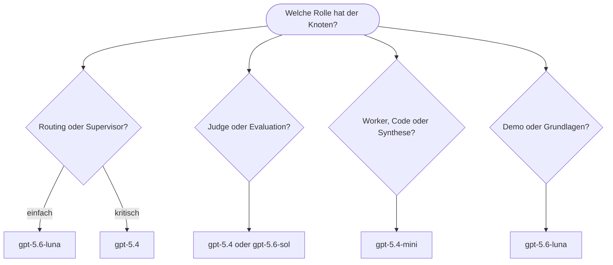
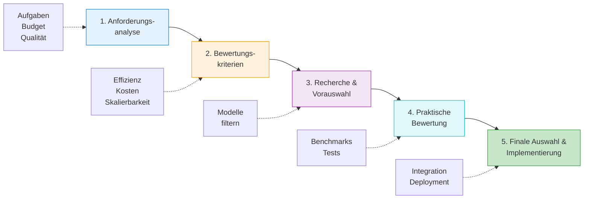

# Modellauswahl
{: .no_toc }

> [!NOTE] Kernfrage 
> Welches Modell passt zur Aufgabe, zum Risiko, zum Budget und zur Latenzanforderung?

---

# Inhaltsverzeichnis
{: .no_toc .text-delta }

1. TOC
{:toc}

---

## Modellrollen im Kurs
Modellauswahl ist keine Rangliste. Ein Modell ist passend, wenn Qualität, Latenz, Kosten, Kontextfenster, Tool-Unterstützung und Modalität zur Aufgabe passen. Im Kurs wird deshalb nicht überall ein einzelnes Modell fest eingetragen, sondern eine Rolle verwendet: Baseline, Router, Worker, Planner, Judge, Coding, Frontier oder Embedding.

Diese Rollen stehen in `genai_lib.model_config.py`. Die Datei ist der technische Kursstandard. Wer ein Notebook liest, soll nicht zuerst konkrete Produktnamen interpretieren müssen, sondern erkennen, welche Aufgabe ein Modell im Agentensystem übernimmt.

Typischer Fehler: Das stärkste verfügbare Modell wird als Standard gewählt. Für viele Agentenschritte sind Kosten, Latenz, Tool-Zuverlässigkeit oder strukturierte Ausgabe wichtiger als maximale Benchmark-Leistung.

| Kursrolle | Konstante | Modell | Einsatz |
|---|---|---|---|
| Baseline / Demo | `BASELINE` | `openai:gpt-5.6-luna` | einfache Beispiele, erste Läufe, Kostenkontrolle |
| Router / leichter Reasoner | `ROUTER` | `openai:gpt-5.6-luna` | klare Auswahlentscheidungen mit wenigen Wegen |
| Worker / Synthese | `WORKER` | `openai:gpt-5.4-mini` | RAG-Synthese, strukturierte Ausgaben, Standard-Worker |
| Coding-Worker | `CODING` | `openai:gpt-5.4-mini` | Codegenerierung, Refactoring, technische Agenten |
| Judge / starker Reasoner | `JUDGE` | `openai:gpt-5.4` | Bewertung, Evaluation, Supervisor, Compliance |
| Planner | `PLANNER` | `openai:gpt-5.4` | Aufgabenzerlegung, Schrittplanung, Agentic RAG |
| Hochwertiger Worker | `WORKER_PREMIUM` | `openai:gpt-5.6-terra` | komplexe Synthese, finale Reports |
| Frontier / maximale Qualität | `FRONTIER` | `openai:gpt-5.6-sol` | schwierige Coding-, Judge- und Agenten-Aufgaben |
| Bildgenerierung | `IMAGE_GENERATION` | `gpt-image-2` | Bildgenerierung über die OpenAI Images API |
| Audio-Transkription | `TRANSCRIPTION`, `TRANSCRIPTION_SEGMENTS` | `gpt-4o-mini-transcribe`, `whisper-1` | Transkription, mit Segmenten bei Bedarf Zeitstempel |
| Embeddings | `EMBEDDINGS` | `text-embedding-3-small` | Retrieval, Chunk-Suche, Vektorindizes |

Diese Rollen machen Modellwahl im Kurs überprüfbar. Entwickler vergleichen nicht beliebige Modellnamen, sondern entscheiden, ob ein Schritt Baseline, Router, Worker, Planner oder Judge ist. Die konkreten Modell-IDs sind Kurskonfiguration, nicht allgemeine Marktberatung. Vor produktiven Projekten muss die aktuelle Provider-Dokumentation geprüft werden, weil Modellverfügbarkeit, Preise und API-Parameter regelmäßig wechseln.

> [!IMPORTANT] Standard vor Produktname 
> In Notebooks werden nach Möglichkeit Rollen aus `model_config.py` verwendet. Harte Modellnamen stehen nur dort direkt im Notebook, wo ein bestimmter Endpunkt oder ein bewusstes Vergleichsexperiment gezeigt wird.

> [!IMPORTANT] GPT-5.x-Konfiguration 
> Modelle der GPT-5.x-Serie werden in den Kursmaterialien nicht pauschal mit `temperature` konfiguriert. Qualitätssteuerung erfolgt über präzise Prompts sowie bei Bedarf über `reasoning.effort` und `text.verbosity`.

## Modelsteckbrief - Beispiel

 

KI-generiertes Bild

**Modellübersichten:**      
+ [Models.dev]([Models.dev — An open-source database of AI models](https://models.dev/))
+ [LiteLLM Modelle]([LiteLLM-Anbieter & Modelle](https://models.litellm.ai/))      

## OpenAI-Default und Designregeln

Der Kurs nutzt konkrete OpenAI-Modelle, aber die Entscheidung dahinter bleibt rollenbasiert. Wichtig ist nicht zuerst der Produktname, sondern die Aufgabe des Knotens.

| Situation | Kurs-Default | Begründung |
|---|---|---|
| Grundlagen, Demos, einfache Klassifikation | `gpt-5.6-luna` | schnell, günstig, ausreichend für klare Aufgaben |
| einfaches Routing | `gpt-5.6-luna` | gute Kosten-/Latenz-Balance bei wenigen Routen |
| Worker, Synthese, strukturierte Ausgabe | `gpt-5.4-mini` | Standardmodell für produktivere Arbeitsschritte |
| Coding-Worker | `gpt-5.4-mini` | geeignet für Code, Refactoring und technische Aufgaben |
| Supervisor, Judge, Planner | `gpt-5.4` | stärkeres Reasoning für Entscheidungen mit Folgewirkung |
| hochwertige Synthese oder finale Reports | `gpt-5.6-terra` | Premium-Worker bei hohem Qualitätsanspruch |
| schwierige Agenten-, Coding- oder Judge-Aufgaben | `gpt-5.6-sol` | Frontier-Option bei hohen Qualitäts- oder Sicherheitsanforderungen |

### Entscheidungsregeln

1. **Baseline zuerst:** Mit einem günstigen Standardmodell starten und erst bei messbarem Bedarf upgraden.
2. **Rolle vor Modell:** Erst klären, ob ein Knoten Router, Worker, Judge oder Planner ist.
3. **Fehlerkosten beachten:** Je teurer eine Fehlentscheidung wird, desto eher lohnt sich ein stärkeres Modell.
4. **Tool- und JSON-Verhalten prüfen:** Für Agenten zählt nicht nur Textqualität, sondern auch stabiler Tool Use und strukturierte Ausgabe.
5. **Kosten und Latenz sichtbar machen:** Modellwahl ist Teil der Architektur, nicht nur Qualitätsoptimierung.

## Entscheidungsbaum

## Provider-Mapping

Für providerneutrale Architekturentscheidungen bleibt die Rollenlogik erhalten. Der Providerwechsel ist dann eine Zuordnung von Rollen auf passende Modellfamilien.

| Rolle | OpenAI | Mistral | Gemini | Anthropic |
|---|---|---|---|---|
| Baseline / Demo | `gpt-5.6-luna` | `mistral-small-latest` | `gemini-3-flash-preview` | `claude-haiku-4-5` |
| Router / leichter Reasoner | `gpt-5.6-luna` | `mistral-small-latest` | `gemini-3-flash-preview` | `claude-haiku-4-5` |
| Judge / starker Reasoner | `gpt-5.4` | `magistral-medium-latest` oder `mistral-large-latest` | `gemini-3.1-pro-preview` | `claude-opus-4-7` |
| Worker / Synthese | `gpt-5.4-mini` | `mistral-medium-latest` oder `mistral-large-latest` | `gemini-3.1-pro-preview` | `claude-sonnet-4-6` |
| Coding-Worker | `gpt-5.4-mini` | `devstral-latest` oder `codestral-latest` | `gemini-3.1-pro-preview` | `claude-sonnet-4-6` |
| Frontier / maximale Qualität | `gpt-5.6-sol` | `mistral-large-latest` | `gemini-3.1-pro-preview` | `claude-opus-4-7` |
| Embeddings | `text-embedding-3-small` | `mistral-embed` | `gemini-embedding-2-preview` | externer Provider nötig |

> [!NOTE] Provider-Mapping ist Planung, keine automatische Migration 
> Ein anderes Chat-Modell ersetzt nicht automatisch Embeddings, Logging, Kostenmodell oder API-spezifische Parameter.

## Modellauswahlprozess: Schritt für Schritt
Die Auswahl des optimalen KI-Modells erfordert einen strukturierten Prozess:

### Anforderungsanalyse
- **Definition der Aufgaben**: Festlegen, welche spezifischen Funktionen das Modell erfüllen soll (z. B. Textgenerierung, Fragebeantwortung).
- **Qualitätskriterien**: Bestimmen, welche Qualitätsstandards (Kohärenz, Genauigkeit) erfüllt werden müssen.
- **Domänenkenntnisse**: Identifizieren, welches Fachwissen für die Aufgabe notwendig ist.
- **Antwortgeschwindigkeit**: Definieren, welche Reaktionszeit akzeptabel ist.
- **Budget**: Einen finanziellen Rahmen für die KI-Lösung setzen.

### Bewertungskriterien
- **Verständlichkeit**: Wie klar und nachvollziehbar sind die Modellausgaben?
- **Effizienz**: Wie schnell verarbeitet das Modell Eingaben und liefert Ausgaben?
- **Skalierbarkeit**: Kann das Modell mit steigenden Anforderungen mitwachsen?
- **Kosten**: Wie hoch sind die Betriebs- und Nutzungskosten des Modells?

### Recherche und Vorauswahl
- Verfügbare Modelle anhand der festgelegten Kriterien analysieren und eine Vorauswahl geeigneter Kandidaten bilden.

### Praktische Modellbewertung
- **Quantitative Methoden**: Benchmarks und Metriken verwenden, um die Leistung objektiv zu messen.
- **Qualitative Verfahren**: Nutzerfeedback zur praktischen Verwendbarkeit sammeln.
- **Testphase**: Die Modelle in einer realistischen Umgebung erproben.

### Finale Auswahl und Implementierung
- Eine begründete Entscheidung für das am besten geeignete Modell treffen und es in die eigenen Systeme integrieren.

[Interaktive Modellauswahl](https://editor.p5js.org/ralf.bendig.rb/full/8BbTi8Ico)

## Modellkaskade: Mehrere Modelle klug kombinieren
Die Modellkaskade kombiniert mehrere KI-Modelle, um ihre jeweiligen Stärken zu nutzen und Schwächen auszugleichen:

### Beispiel für eine Modellkaskade
1. **Datenanalyse mit pandas**: Analysiert große Datensätze und erstellt statistische Zusammenfassungen
2. **Planung mit `PLANNER`**: Strukturiert die Ergebnisse und erstellt eine logische Gliederung
3. **Synthese mit `WORKER` oder `WORKER_PREMIUM`**: Verfasst den Ergebnistext auf Basis der Struktur
4. **Multimodale Präsentation**: Ergänzt den Text mit visuellen Elementen

### Vorteile einer Modellkaskade
1. **Effizienzsteigerung**: Jedes Modell wird für seine Stärken optimal eingesetzt
2. **Kostenoptimierung**: Ressourcenschonende Modelle für einfache Aufgaben, teurere nur wo nötig
3. **Flexibilität**: Bearbeitung unterschiedlichster Anforderungen durch spezialisierte Modelle

## Bewertungsmethoden für KI-Modelle
### Benchmarks richtig einordnen

Öffentliche Benchmarks wie MMLU können eine erste Orientierung geben, ersetzen aber keine Kursevaluation. Für Agentensysteme ist entscheidend, ob ein Modell die konkrete Rolle zuverlässig erfüllt: Routing, Tool-Aufruf, Planung, Synthese oder Bewertung. Ein hoher allgemeiner Benchmark-Wert hilft wenig, wenn strukturierte Ausgabe instabil ist oder ein Router zu teuer und zu langsam wird.

Grenze: Statische Benchmark-Tabellen altern schnell. In Kursunterlagen werden deshalb keine konkreten Ranglisten gepflegt; die praktische Bewertung erfolgt anhand der Rollen aus `model_config.py`.

### Bewertungsdimensionen

Die Bewertung von KI-Modellen umfasst verschiedene Aspekte:

1. **Rollenqualität**: Erfüllt das Modell die konkrete Aufgabe, etwa Routing, Planung, Synthese oder Bewertung?
2. **Werkzeugverhalten**: Nutzt das Modell externe Tools zuverlässig und mit stabilen Argumenten?
3. **Ausgabeformat**: Hält das Modell JSON, Tabellen, Checklisten oder andere Strukturvorgaben ein?
4. **Sicherheit**: Bleibt das Modell bei Störungen, Injection-Versuchen und unklaren Anforderungen kontrollierbar?
5. **Kosten und Latenz**: Passt das Modell zur erwarteten Nutzungshäufigkeit?

### Konkrete Bewertungsmethoden

#### Automatisierte Metriken
- **BLEU**: Misst die Übereinstimmung zwischen generiertem und Referenztext durch Vergleich von Wortgruppen.
- **ROUGE**: Bewertet die Qualität von Zusammenfassungen durch Analyse übereinstimmender Wortsequenzen.

#### Menschliche Bewertung
- Bewertung nach Kriterien wie Grammatik, Zusammenhang, Lesbarkeit und Relevanz
- Elo-System für den direkten Vergleich verschiedener Modelle (ähnlich wie bei Schach-Ratings)

#### KI-basierte Bewertung
- Einsatz von `JUDGE` zur Bewertung anderer Modellrollen
- Automatische Erkennung von Fehlinformationen in KI-Antworten

## Praktische Anwendungsbereiche
Die Modellevaluierung und -auswahl findet in verschiedenen Szenarien Anwendung:

### Kundenservice-Chatbots
- Auswahl einer schnellen Baseline- oder Worker-Rolle mit guter Verständlichkeit und Mehrsprachigkeit
- Bewertung nach Kundenzufriedenheit und Lösungsrate

### Content-Erstellung
- Nutzung einer passenden Worker-Rolle für Marketing, Social Media und Blogbeiträge
- Bewertung nach Originalität, Engagement und Konversionsraten

### Technische Assistenz
- Einsatz von `CODING`, `PLANNER` oder `JUDGE` für Programmierung, Planung und Fehlerbewertung
- Bewertung nach Codequalität und Lösungsgeschwindigkeit

## Was für Entwickler zuerst wichtig ist

Modellauswahl ist keine Rangliste, sondern eine Architekturentscheidung. Ein günstiges Modell kann für Routing, Klassifikation oder einfache Tool-Auswahl besser passen als ein großes Reasoning-Modell; ein stärkeres Modell lohnt sich vor allem dort, wo Fehler teuer sind oder mehrere Teilschritte wirklich verstanden werden müssen.

In der Praxis relevant, wenn: Ein Agent mehrere Rollen kombiniert. Dann sollte nicht ein einziges Modell alles erledigen, sondern jede Rolle nach Qualitätsbedarf, Kosten und Latenz bewertet werden.

## Abgrenzung zu verwandten Dokumenten

| Dokument | Frage |
|---|---|
| [Fine-Tuning]({{ '/03-modelle-provider-anpassung/fine-tuning.html' | relative_url }}) | Wann reicht Modellwahl nicht mehr und Training wird notwendig? |
| [Context Engineering]({{ '/04-agenten-implementierung/kontext-wissen/context-engineering.html' | relative_url }}) | Welche Kontextstrategie entscheidet mit darüber, ob ein Modell genügt? |
| [Qualität und Sicherheit]({{ '/07-qualitaet-sicherheit/' | relative_url }}) | Wie werden Modellqualität, Tracing und Evaluation sichtbar gemacht? |

---

**Version:** 1.5 
**Stand:** Juli 2026 
**Kurs:** KI-Agenten. Planen. Handeln. Prüfen.

