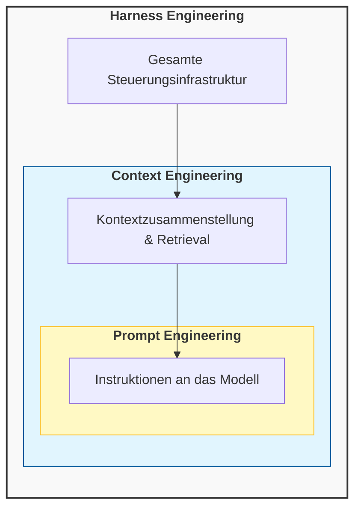
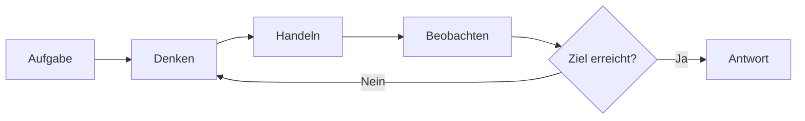
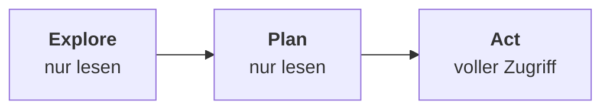
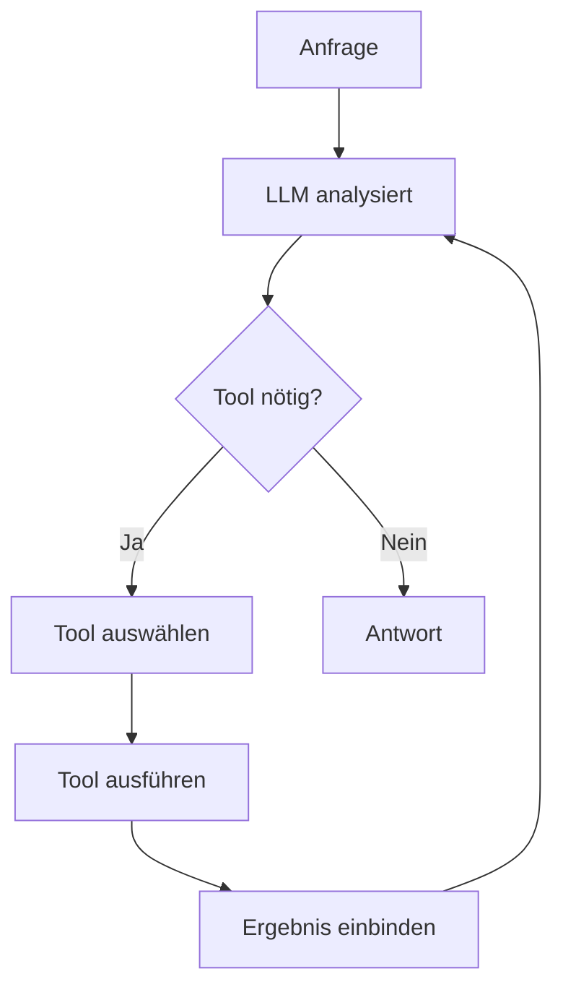
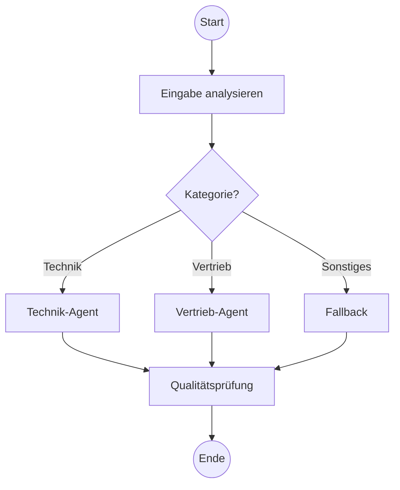
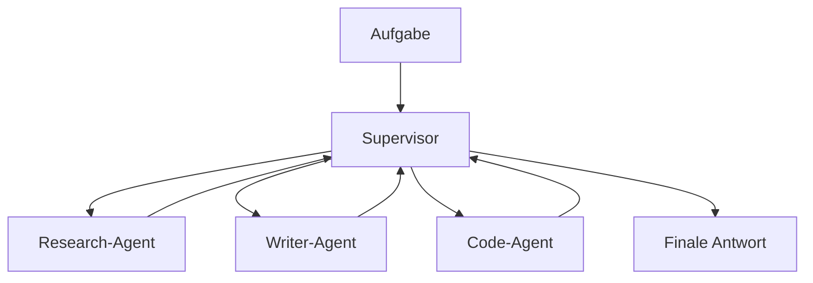
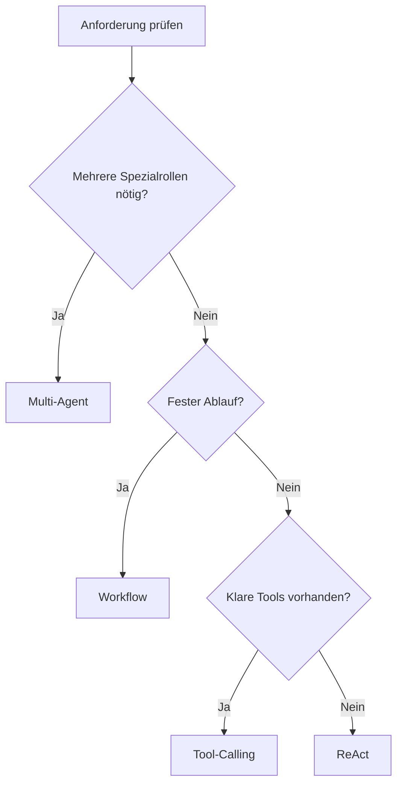

# Agenten-Architekturen
{: .no_toc }

> **Die Architektur entscheidet, wie ein Agent denkt, handelt, Grenzen einhält und mit Fehlern umgeht.**

---

# Inhaltsverzeichnis
{: .no_toc .text-delta }

1. TOC
{:toc}

---

## Warum die Architekturfrage früh geklärt werden muss

Viele Agentenprojekte scheitern nicht am Modell, sondern an einer unpassenden Grundstruktur. Ein Agent soll vielleicht nur ein Werkzeug aufrufen, wird aber als komplexes Multi-Agent-System gebaut. Oder ein eigentlich mehrstufiger Prozess wird als freier ReAct-Loop modelliert und verliert dadurch Kontrolle, Nachvollziehbarkeit und Kostenstabilität.

Architektur meint in diesem Zusammenhang nicht zuerst Framework oder Programmiersprache. Gemeint ist die Entscheidung, wie ein Agent Aufgaben zerlegt, wie viel Entscheidungsfreiheit er erhält und an welchen Stellen deterministische Logik wichtiger ist als modellbasierte Flexibilität. Für einen Einsteigerkurs ist genau diese Unterscheidung zentral, weil sie viele spätere Probleme bereits vorwegnimmt.

Typischer Fehler: Zu früh die technisch eindrucksvollste Architektur zu wählen. In der Praxis ist die einfachste Struktur oft die robusteste.

## Ein einfaches Beispiel

Ein Support-System soll drei Arten von Anfragen bearbeiten: Lieferstatus nennen, Rechnung erneut senden und komplexe Sonderfälle an einen Menschen weiterleiten. Schon dieses kleine Beispiel zeigt, dass Architektur keine akademische Zusatzfrage ist. Für den Lieferstatus reicht meist ein gezielter Tool-Aufruf. Für die Rechnung braucht es eventuell mehrere Schritte. Für Sonderfälle wird eine sichere Eskalation benötigt.

Aus genau solchen Anforderungen ergibt sich die Architektur. Nicht jede Aufgabe braucht einen denkenden, frei planenden Agenten. Häufig genügt ein klarer Workflow oder ein Tool-Calling-Muster mit wenigen kontrollierten Entscheidungen.

## Zwei Blickrichtungen auf Agenten

Agenten lassen sich aus zwei Blickrichtungen beschreiben. Die erste fragt, wie ein Agent grundsätzlich zu einer Entscheidung kommt. Die zweite fragt, wie diese Logik technisch organisiert wird. Für Entwickler ist diese Trennung hilfreich, weil sie erklärt, warum ein System nach außen klug wirken kann, intern aber sehr unterschiedlich gebaut sein kann.

Die Intelligenzperspektive beschreibt das Entscheidungsprinzip. Handelt ein System streng regelbasiert, zustandsbasiert, zielorientiert oder nutzenmaximierend? Die Architekturperspektive beschreibt dagegen das praktische Baumuster, etwa ReAct, Tool-Calling, Workflow oder Multi-Agent. Beide Ebenen hängen zusammen, sind aber nicht identisch.

## Harness Engineering: die Steuerungsschicht um das Modell

Viele Agentenprobleme entstehen nicht, weil das Modell zu schwach ist, sondern weil die Steuerungsschicht um das Modell herum fehlt oder schlecht gestaltet ist. Dieses Konzept trägt den Namen **Harness Engineering**.

Harness Engineering bezeichnet die Praxis, die Kontroll- und Steuerungsschicht rund um ein LLM zu gestalten — also alles, was zwischen der Rohmodellausgabe und einer realen Aktion liegt. Eine Dreiteilung hilft beim Einordnen:



**Prompt Engineering** ist die innerste Schicht: Instruktionen, Rollenbeschreibungen, Beispiele — was dem Modell gesagt wird.

**Context Engineering** bestimmt, was überhaupt in den Kontext fließt und wann: Retrieval, Kompression, Zusammensetzung.

**Harness Engineering** umfasst alles darüber hinaus: Werkzeugorchestrierung, Speichersysteme, Berechtigungsgrenzen, Fehlerbehandlung und Wiederherstellungslogik.

Die wichtigste Erkenntnis: Selbst das beste Modell scheitert ohne eine durchdachte Steuerungsschicht. Der häufige Fehler besteht darin, immer bessere Prompts zu schreiben, statt das System um das Modell herum zu verbessern. Instabilität, Halluzinationen oder Endlosschleifen werden dann dem Modell zugeschrieben — meistens liegt das Problem aber in einem unstrukturierten Kontext, inkonsistentem Speicher oder fehlender Fehlerbehandlung.

Typischer Fehler: Eine besondere Gefahr in länger laufenden Agenten ist der sogenannte **Execution Drift** — ein stilles Versagen, das keinen Fehler wirft und deshalb schwer zu erkennen ist. Das Modell interpretiert ein Tool-Ergebnis geringfügig falsch, setzt aber selbstsicher auf dieser falschen Grundlage fort. Nach mehreren solchen Schritten ist der Agent weit vom ursprünglichen Ziel entfernt, ohne dass eine Ausnahme oder Fehlermeldung aufgetreten ist. Harness Engineering begegnet diesem Problem durch strukturierte Ausgaben, die maschinell überprüfbar sind, durch Validierungsschritte zwischen Werkzeugaufrufen und durch explizite Kontrollpunkte, an denen der Planstand gegen die ursprüngliche Aufgabe geprüft wird.

## Welche Entscheidungslogik hinter einem Agenten steckt

Eine einfache Regelarchitektur reagiert auf klar definierte Muster. Das entspricht einem Simple-Reflex-Agenten: Wenn Bedingung A erfüllt ist, folgt Aktion B. Solche Systeme sind schnell und gut kontrollierbar, brechen aber bei unerwarteten Situationen schnell an ihre Grenzen.

Ein zustandsbasierter Agent berücksichtigt zusätzlich, was bereits bekannt ist, auch wenn diese Information nicht direkt in der aktuellen Eingabe steht. Diese Form ist nützlich, wenn ein Verlauf oder ein interner Status mitgeführt werden muss. Ein Beispiel wäre ein Agent, der weiß, dass eine Identitätsprüfung bereits erfolgt ist und deshalb im nächsten Schritt andere Optionen freischaltet.

Zielorientierte Agenten bewerten, welche Aktion dem gewünschten Ergebnis näherkommt. ReAct-Systeme verhalten sich oft so: Sie planen nicht vollständig im Voraus, sondern nähern sich dem Ziel iterativ. Utility-basierte Agenten gehen noch einen Schritt weiter und vergleichen Optionen nach einem Präferenzwert, etwa Kosten, Risiko oder Erfolgswahrscheinlichkeit. Adaptive Agenten wiederum verändern ihr Verhalten auf Basis früherer Rückmeldungen, spielen im Entwicklerkontext aber meist noch keine Hauptrolle.

Grenze: Diese Einteilung hilft beim Denken, ersetzt aber keine Architekturentscheidung. Ein zielorientierter Agent kann technisch als ReAct-System, als Workflow mit Verzweigungen oder als Mischform gebaut sein.

## ReAct: wenn der Lösungsweg noch nicht feststeht

ReAct kombiniert Nachdenken, Handeln und Beobachten in einem wiederholten Zyklus. Der Agent prüft den aktuellen Stand, führt eine Aktion aus, liest das Ergebnis und entscheidet anschließend über den nächsten Schritt. Dieses Muster eignet sich vor allem dann, wenn der Lösungsweg vorab nicht vollständig bekannt ist.



Ein typisches Beispiel ist eine Rechercheaufgabe. Der Agent beginnt mit einer Hypothese, ruft ein Suchwerkzeug auf, liest die Ergebnisse, präzisiert die Suche und erzeugt erst dann eine Antwort. Der Vorteil liegt in der Flexibilität. Der Nachteil liegt in den Schleifen: Ohne gute Begrenzung wachsen Kosten, Latenz und Fehlersuche schnell an.

In der Praxis relevant, wenn: Die Aufgabe offen ist, mehrere Zwischenschritte nötig sind und vorab nicht feststeht, welche Aktion als Nächstes sinnvoll ist.

## Explore → Plan → Act: ReAct für den Produktionseinsatz

ReAct ist flexibel, aber für den Produktionseinsatz oft zu unstrukturiert. Produktive Agenten unterteilen ihre Arbeit deshalb in **drei klar getrennte Phasen** mit unterschiedlichen Berechtigungen:



**Explore** — der Agent liest, sucht und sammelt Informationen, ohne etwas zu verändern. Erlaubt: Dateien lesen, Suchen, Strukturen analysieren.

**Plan** — der Agent entscheidet, welche Schritte notwendig sind, und skizziert die Änderungen. Noch kein Schreiben, kein Ausführen.

**Act** — erst jetzt darf der Agent verändernd eingreifen: Dateien schreiben, APIs aufrufen, Daten speichern. Voller Werkzeugzugriff.

Beispiel beim Bearbeiten von Code: Explore liest relevante Dateien und versteht die Struktur. Plan skizziert die Änderungen und prüft Auswirkungen. Act schreibt den Code und führt Tests aus.

Diese Phasentrennung reduziert destruktive Fehler erheblich, weil ein Agent nicht im selben Schritt erkunden und gleichzeitig schreiben kann.

In der Praxis relevant, wenn: Aktionen schwer umkehrbar sind, mehrere Dateien oder Systeme betroffen sind oder der Lösungsweg vor der Ausführung abgesichert sein muss.

## Tool-Calling: wenn das Modell Werkzeuge steuern soll

Beim Tool-Calling entscheidet das Modell, welches Werkzeug mit welchen Parametern aufgerufen werden soll. Dieses Muster ist oft der sinnvollste Einstieg, weil die Freiheitsgrade begrenzt bleiben und die Architektur trotzdem bereits deutlich mehr kann als ein reiner Chatbot.



Ein Support-Agent kann etwa das Tool `track_order` für den Lieferstatus oder `send_invoice` für Rechnungen aufrufen. Die Stärke liegt darin, dass das Modell flexibel formulieren kann, während die eigentliche Aktion in deterministischem Code oder in einer externen API stattfindet.

```python
tools = [
    {"name": "track_order", "description": "Liefert den aktuellen Sendungsstatus"},
    {"name": "send_invoice", "description": "Versendet eine Rechnung erneut per E-Mail"},
]

response = agent.invoke({
    "messages": [{"role": "user", "content": "Bitte sende mir die Rechnung erneut."}]
})
```

Typischer Fehler: Ein einziges Tool für zu viele unterschiedliche Aufgaben zu bauen. Dann verliert das Modell die Klarheit, welches Werkzeug in welcher Situation gemeint ist.

## Workflow-basierte Architektur: wenn der Ablauf kontrolliert sein muss

Workflow-basierte Architekturen modellieren einen klaren Ablauf aus Knoten und Verzweigungen. Das System entscheidet nicht in jeder Runde frei über den nächsten Schritt, sondern bewegt sich entlang eines vorgegebenen Prozesses. Genau dadurch werden Genehmigungen, Qualitätsprüfungen und sichere Übergaben deutlich leichter beherrschbar.



Ein Kursbeispiel wäre ein Beschwerdeprozess. Zuerst wird die Anfrage kategorisiert, dann folgt je nach Kategorie eine passende Bearbeitung, anschließend eine Qualitätsprüfung und schließlich entweder eine Antwort oder eine menschliche Freigabe. Diese Struktur ist weniger flexibel als ReAct, dafür aber meist robuster und erklärbarer.

Nicht geeignet, wenn: Die Aufgabe stark explorativ ist und der Lösungsweg erst während der Bearbeitung entsteht.

## Multi-Agent: wenn Arbeitsteilung wirklich einen Mehrwert bringt

In Multi-Agent-Architekturen arbeiten mehrere spezialisierte Agenten zusammen. Ein Supervisor kann Aufgaben verteilen, oder die Agenten tauschen Ergebnisse direkt untereinander aus. Dieses Muster klingt oft attraktiv, ist aber nur dann sinnvoll, wenn echte Spezialisierung einen erkennbaren Gewinn bringt.



Ein Beispiel ist eine Content-Pipeline: Ein Recherche-Agent sammelt Quellen, ein Schreib-Agent formuliert, ein Prüf-Agent bewertet Qualität und Konsistenz. Solch eine Trennung kann sinnvoll sein, wenn die Teilaufgaben fachlich oder technisch wirklich unterschiedlich sind. Ohne klare Zuständigkeiten entsteht allerdings schnell mehr Koordinationsaufwand als Nutzen.

Entwickler unterschätzen oft, wie viel zusätzlicher Abstimmungsbedarf mit jedem weiteren Agenten entsteht. Multi-Agent ist deshalb selten der beste Einstieg.

## Welche Architektur meist zuerst gewählt werden sollte

Für viele Entwicklerprojekte genügt bereits eine einfache Entscheidungslogik. Wenn eine Anfrage auf klar definierte Werkzeuge abgebildet werden kann, ist Tool-Calling meist der beste Startpunkt. Wenn ein Prozess feste Schritte und Freigaben hat, ist ein Workflow meist sinnvoller. ReAct eignet sich eher für offene Aufgaben. Multi-Agent lohnt sich erst, wenn Arbeitsteilung messbar bessere Ergebnisse liefert.



| Situation | Naheliegende Wahl |
|---|---|
| FAQ plus Datenbankzugriff | Tool-Calling |
| Mehrstufiger Genehmigungsprozess | Workflow |
| Offene Rechercheaufgabe | ReAct |
| Arbeitsteilige Content-Erstellung | Multi-Agent |

## Welche Design-Prinzipien immer gelten

Unabhängig vom Muster bleibt gute Agentenarchitektur an einige wenige Grundprinzipien gebunden. Komponenten sollten eine klar abgegrenzte Verantwortung haben. Kritische Aktionen sollten nicht ohne Kontrolle ausgelöst werden. Fehlerpfade müssen mitgedacht werden. Entscheidungen sollten nachvollziehbar bleiben, damit sich Probleme später nicht nur beobachten, sondern auch beheben lassen.

Diese Prinzipien klingen allgemein, werden aber in Agentensystemen schnell konkret. Ein Tool, das gleichzeitig sucht, entscheidet und schreibt, ist schwer zu testen. Ein Agent, der ohne Freigabe E-Mails versendet oder Zahlungen auslöst, wird im Betrieb riskant. Ein System ohne Traces ist im Fehlerfall kaum noch zu verstehen.

## Deterministische Eskalation statt Modellgefühl

Bei kritischen Entscheidungen sollte die Eskalation nicht von einem gefühlten Konfidenzwert des Modells abhängen. Modelle schätzen Unsicherheit inkonsistent ein. Verlässlicher sind explizite Flags, die aus Regeln, Tools oder Vorverarbeitung stammen.

```python
ESCALATION_FLAGS = {
    "compliance_trigger": True,
    "amount_exceeds_limit": True,
    "pii_detected": False,
}

def route_response(state: AgentState) -> str:
    flags = state.get("flags", {})
    if flags.get("compliance_trigger") or flags.get("amount_exceeds_limit"):
        return "human_review"
    return "continue"
```

Dieses Muster ist für Entwickler besonders wichtig, weil es eine grundlegende Grenze moderner Modelle zeigt: Sprachliche Plausibilität ist kein Ersatz für verbindliche Geschäftsregeln.

## Geschäftsregeln gehören in Code

Wenn Freigabegrenzen, Erstattungsbeträge oder Compliance-Vorgaben gelten, gehören diese Regeln in deterministischen Code und nicht in den System-Prompt. Ein Prompt kann beschrieben werden. Eine Regel im Code kann geprüft, getestet und garantiert eingehalten werden.

```python
class PolicyEngine:
    _REFUND_LIMITS = {
        "basic": 100.0,
        "premium": 500.0,
        "vip": 5000.0,
    }

    def check_policy(self, tier: str, requested_amount: float) -> dict:
        limit = self._REFUND_LIMITS[tier]
        return {
            "approved": requested_amount <= limit,
            "limit": limit,
        }
```

Typischer Fehler: Geschäftslogik als schöne Formulierung im Prompt zu verstecken. Im Betrieb führt das zu Abweichungen, die schwer nachvollziehbar sind.

## Kontext darf nicht unbegrenzt wachsen

Je länger eine Session dauert, desto größer wird der aktive Kontext. Ohne Begrenzung steigen Token-Verbrauch, Latenz und Fehlerrisiko. Deshalb braucht ein Agent ab einer gewissen Laufzeit eine Strategie, um ältere Inhalte zu verdichten und nur das Wesentliche aktiv mitzuschleppen.

```python
TOKEN_BUDGET = 4000

def compact_context(state: AgentState) -> AgentState:
    if state["context"].token_count > TOKEN_BUDGET:
        older_messages = state["messages"][:-5]
        state["context"] = summarize_to_budget(older_messages)
        state["messages"] = state["messages"][-5:]
    return state
```

In der Praxis relevant, wenn: ReAct-Loops viele Iterationen durchlaufen, Sitzungen lange offen bleiben oder große RAG-Kontexte wiederholt eingebunden werden.

## Caching und Tests sind Architekturthemen

Bestimmte Optimierungen wirken auf den ersten Blick wie Betriebsdetails, gehören aber in Wahrheit zur Architektur. Wenn in jeder Session dasselbe Regelwerk mitgeschickt wird, kann Prompt Caching die Kosten stark senken. Wenn ein Agent angeblich eine Aktion ausgeführt hat, sollte nicht nur die Modellantwort geprüft werden, sondern der persistente Zustand des Systems.

```python
system = [
    {"type": "text", "text": agent_instructions},
    {"type": "text", "text": POLICY_DOCUMENT,
     "cache_control": {"type": "ephemeral"}},
]
```

```python
assert financial_system.get_transaction(customer_id) is not None
assert escalation_queue.contains(session_id)
```

Der gemeinsame Punkt ist einfach: Gute Agentenarchitektur endet nicht bei der Promptlogik. Sie umfasst auch Kostenverhalten, Prüfbarkeit und Betriebssicherheit.

## Wie mehrere Muster kombiniert werden

Die vorgestellten Architekturen schließen sich nicht gegenseitig aus. Ein Workflow kann Tool-Calling-Knoten enthalten. Ein Multi-Agent-System kann intern ReAct-Worker verwenden. Ein Support-Agent kann in einfachen Fällen direkt mit Tool-Calling arbeiten und in kritischen Fällen in einen festen Eskalationsworkflow wechseln.

Gerade deshalb ist die Architekturfrage keine Entweder-oder-Entscheidung, sondern eine Frage nach sinnvollen Grenzen. Nicht jede Flexibilität ist ein Gewinn. Oft entsteht die beste Lösung dort, wo freie Modellentscheidungen nur an den Stellen erlaubt werden, an denen sie echten Mehrwert bringen.

## Was in Entwicklerprojekten zuerst wichtig ist

Für einen ersten Kursagenten reicht meist eine begrenzte Kombination aus Tool-Calling, klaren Geschäftsregeln und einem kleinen Workflow für Sonderfälle. Diese Struktur ist einfacher zu erklären, leichter zu debuggen und robuster zu testen als ein frei planendes Multi-Agent-System.

Entwickler profitieren vor allem dann von Architekturwissen, wenn es nicht als vollständige Taxonomie vermittelt wird, sondern als Auswahlhilfe. Die praktische Kernfrage lautet nicht, wie viele Muster existieren, sondern welches Muster das aktuelle Problem mit möglichst wenig Komplexität löst.

## Abgrenzung zu verwandten Dokumenten

| Dokument                                                                          | Frage            |                                                                                |
| --------------------------------------------------------------------------------- | ---------------- | ------------------------------------------------------------------------------ |
| [Aufgaben & Lösungswege]({{ '/02-orientierung-entscheidung/aufgabenklassen-und-loesungswege.html' | relative_url }}) | Wann ist ein Agent sinnvoll und wann eher Workflow, RAG oder klassischer Code? |
| [Tool Use & Function Calling]({{ '/04-agenten-implementierung/tool-use-function-calling.html'  | relative_url }}) | Wie werden Werkzeuge technisch beschrieben, aufgerufen und abgesichert?        |
| [Multi-Agent-Systeme]({{ '/06-multi-agent-erweiterungen/multi-agent-systeme.html'                  | relative_url }}) | Wie arbeiten mehrere Agenten koordiniert zusammen?                             |
| [State Management]({{ '/04-agenten-implementierung/state-management.html'                     | relative_url }}) | Wie wird Zustand über mehrere Schritte und Knoten hinweg verwaltet?            |

---

**Version:** 1.6<br>
**Stand:** April 2026<br>
**Kurs:** KI-Agenten. Verstehen. Anwenden. Gestalten.


