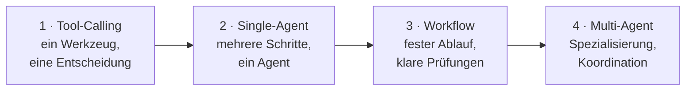
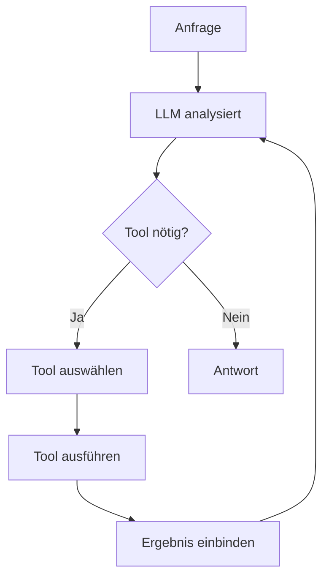
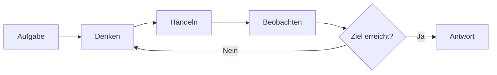
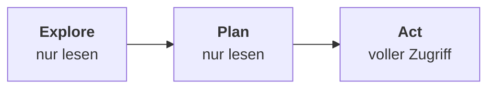
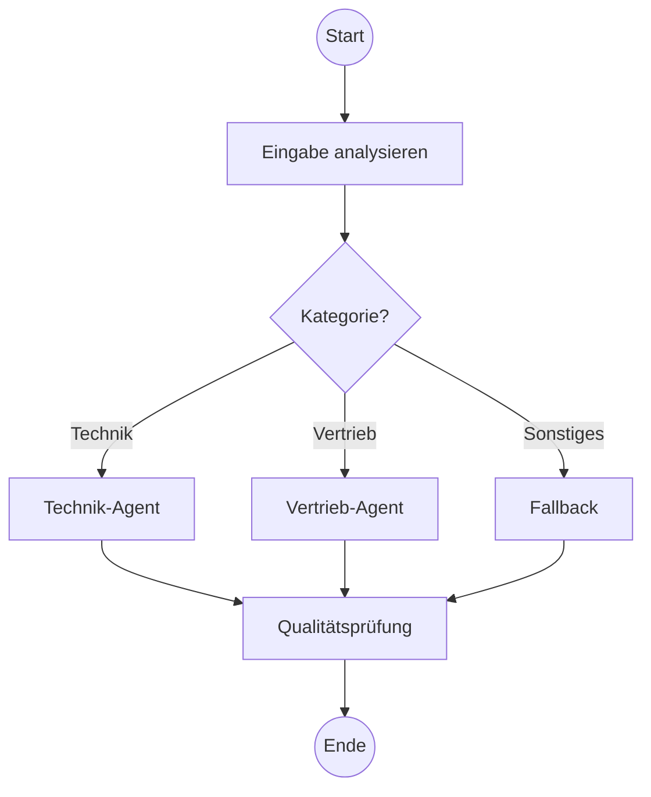
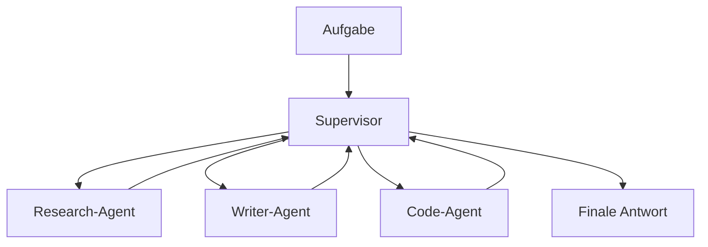
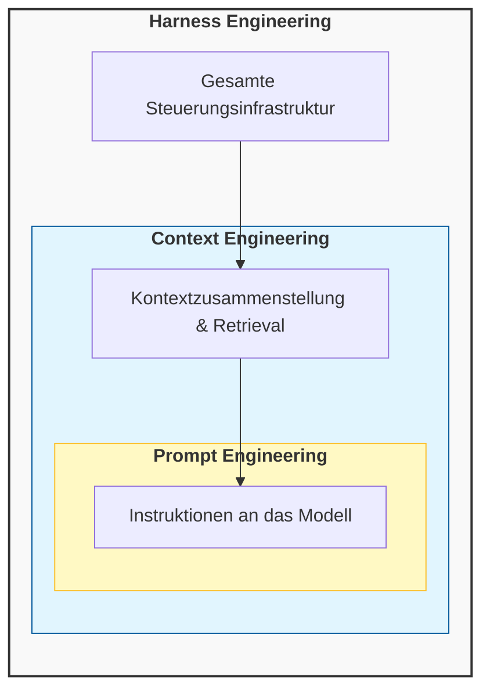

# Agenten-Architekturen
{: .no_toc }

> **Die Architektur entscheidet, wie ein Agent denkt, handelt, Grenzen einhält und mit Fehlern umgeht.**

Dieses Dokument erklärt die wichtigsten Architekturmuster für KI-Agenten und hilft bei der Entscheidung, welches Muster zu welchem Problem passt.

---

# Inhaltsverzeichnis
{: .no_toc .text-delta }

1. TOC
{:toc}

---

## Warum die Architekturfrage früh geklärt werden muss

Viele Agentenprojekte scheitern nicht am Modell, sondern an einer unpassenden Grundstruktur. Ein Agent soll vielleicht nur ein Werkzeug aufrufen, wird aber als komplexes Multi-Agent-System gebaut. Oder ein eigentlich mehrstufiger Prozess wird als freier ReAct-Loop modelliert und verliert dadurch Kontrolle, Nachvollziehbarkeit und Kostenstabilität.

Architektur meint in diesem Zusammenhang nicht zuerst Framework oder Programmiersprache. Gemeint ist die Entscheidung, wie ein Agent Aufgaben zerlegt, wie viel Entscheidungsfreiheit er erhält und an welchen Stellen deterministische Logik wichtiger ist als modellbasierte Flexibilität. Für einen Einsteigerkurs ist genau diese Unterscheidung zentral, weil sie viele spätere Probleme bereits vorwegnimmt.

Typischer Fehler: Zu früh die technisch eindrucksvollste Architektur zu wählen. In der Praxis ist die einfachste Struktur oft die robusteste.

## Ein einfaches Beispiel

Ein Support-System soll drei Arten von Anfragen bearbeiten: Lieferstatus nennen, Rechnung erneut senden und komplexe Sonderfälle an einen Menschen weiterleiten. Schon dieses kleine Beispiel zeigt, dass Architektur keine akademische Zusatzfrage ist. Für den Lieferstatus reicht meist ein gezielter Tool-Aufruf. Für die Rechnung braucht es eventuell mehrere Schritte. Für Sonderfälle wird eine sichere Eskalation benötigt.

Aus genau solchen Anforderungen ergibt sich die Architektur. Nicht jede Aufgabe braucht einen denkenden, frei planenden Agenten. Häufig genügt ein klarer Workflow oder ein Tool-Calling-Muster mit wenigen kontrollierten Entscheidungen.

## Mini-Glossar für dieses Kapitel

Einige Begriffe tauchen in Agenten-Architekturen immer wieder auf. Für dieses Dokument reichen diese Arbeitsdefinitionen:

| Begriff | Einfache Bedeutung |
|---|---|
| **Agent** | Ein System, das mit einem Modell Entscheidungen trifft und bei Bedarf Werkzeuge nutzt. |
| **Tool** | Eine klar beschriebene Funktion, die der Agent aufrufen darf, zum Beispiel Datenbankabfrage oder E-Mail-Versand. |
| **State** | Der aktuelle Arbeitsstand: Nachrichten, Zwischenergebnisse, Entscheidungen oder offene Schritte. |
| **Workflow** | Ein vorgegebener Ablauf aus Schritten, Verzweigungen und Prüfungen. |
| **Tracing** | Protokollierung, was das Modell entschieden und welche Tools es aufgerufen hat. |
| **Harness** | Die Steuerungsschicht um das Modell: Tools, Regeln, Speicher, Fehlerbehandlung und Freigaben. |

## Überblick

Die Architekturen in diesem Dokument bauen aufeinander auf. Jede Stufe erhöht die Flexibilität, aber auch den Koordinationsaufwand:



| Stufe | Muster | Wann sinnvoll |
|---:|---|---|
| 1 | Tool-Calling | Ein klares Ziel, ein kontrollierter Werkzeugaufruf |
| 2 | Single-Agent | Offene Aufgabe, Zwischenschritte noch nicht bekannt |
| 3 | Workflow | Fachlicher Ablauf ist vorgegeben oder auditierbar |
| 4 | Multi-Agent | Spezialisierung ist wirklich nötig und Teilaufgaben sind trennbar |

Die folgenden Abschnitte behandeln die vier Stufen in genau dieser Reihenfolge.

Für Einsteiger ist vor allem diese erste Achse wichtig. Die späteren Abschnitte zu Harness Engineering, Entscheidungslogik, Reasoning-Sichtbarkeit und Produktionsreife sind als Vertiefung gedacht. Sie helfen beim Architekturreview, müssen aber nicht vor der ersten Architekturentscheidung vollständig beherrscht werden.

## Schneller Entscheidungsleitfaden

Diese Fragen helfen bei der Auswahl:

1. **Gibt es nur eine klar begrenzte Aktion?**  
   Dann reicht meist **Tool-Calling**.

2. **Ist der Lösungsweg offen und muss der Agent selbst Zwischenschritte wählen?**  
   Dann passt ein **Single-Agent**, häufig mit ReAct-artigem Ablauf.

3. **Ist der Ablauf fachlich klar vorgegeben oder muss er auditierbar sein?**  
   Dann ist ein deterministischer **Workflow** die bessere Wahl.

4. **Sind die Teilaufgaben wirklich unterschiedlich genug, dass Spezialisierung hilft?**  
   Erst dann lohnt sich **Multi-Agent**.

5. **Gibt es schreibende oder riskante Aktionen?**  
   Dann braucht jede Architektur zusätzliche Kontrolle: Validierung, Human-in-the-Loop oder feste Berechtigungen.

Merksatz: **Erst Tool-Calling prüfen, dann Single-Agent oder Workflow, erst zuletzt Multi-Agent.**

Typische Situationen lassen sich damit schnell einordnen:

| Situation | Naheliegende Wahl |
|---|---|
| FAQ plus Datenbankzugriff | Tool-Calling |
| Mehrstufiger Genehmigungsprozess | Workflow |
| Offene Rechercheaufgabe | ReAct |
| Arbeitsteilige Content-Erstellung | Multi-Agent |
| Wissen aus Dokumenten mit Quellenpflicht | Tool-Calling oder Workflow mit RAG-Tool |
| Riskante oder schreibende Aktion | Workflow mit Kontrolle |

Im Capstone dient diese Auswahl als Architektur-Check: Die gewählte Lösung sollte begründen, warum sie Tool-Calling, Single-Agent, Workflow, Multi-Agent oder eine Kombination daraus nutzt und welche Kontrollpunkte sie ergänzt.

## Tool-Calling: wenn das Modell Werkzeuge steuern soll

Beim Tool-Calling entscheidet das Modell, welches Werkzeug mit welchen Parametern aufgerufen werden soll. Dieses Muster ist oft der sinnvollste Einstieg, weil die Freiheitsgrade begrenzt bleiben und die Architektur trotzdem bereits deutlich mehr kann als ein reiner Chatbot.



Ein Support-Agent kann etwa das Tool `track_order` für den Lieferstatus oder `send_invoice` für Rechnungen aufrufen. Die Stärke liegt darin, dass das Modell flexibel formulieren kann, während die eigentliche Aktion in deterministischem Code oder in einer externen API stattfindet.

```python
tools = [
    {"name": "track_order", "description": "Liefert den aktuellen Sendungsstatus"},
    {"name": "send_invoice", "description": "Versendet eine Rechnung erneut per E-Mail"},
]

response = agent.invoke({
    "messages": [{"role": "human", "content": "Bitte sende mir die Rechnung erneut."}]
})
```

Typischer Fehler: Ein einziges Tool für zu viele unterschiedliche Aufgaben zu bauen. Dann verliert das Modell die Klarheit, welches Werkzeug in welcher Situation gemeint ist.

## Single-Agent-Architektur: mehrere Schritte, eine Rolle

Ein einzelner Agent übernimmt die vollständige Bearbeitung einer Aufgabe. Er kann ein Ziel in Zwischenschritte zerlegen, Tools nutzen, Ergebnisse auswerten und den nächsten Schritt wählen. Das ist mehr als ein einzelner Tool-Aufruf, aber noch kein Agententeam.

Dieses Muster passt, wenn eine Aufgabe mehrere Schritte braucht, aber weiterhin von einer einzigen Rolle sinnvoll bearbeitet werden kann. Ein Meeting-Briefing-Agent kann zum Beispiel Dokumente lesen, offene Fragen sammeln, Action-Items extrahieren und ein Briefing formulieren. Solange diese Arbeit nicht in getrennte Fachrollen aufgeteilt werden muss, bleibt ein Single-Agent oft die einfachste robuste Lösung.

**Vorteile:**

- keine Koordination zwischen mehreren Agenten
- geringerer Token-Verbrauch als bei Multi-Agent-Systemen
- leichter zu erklären, zu testen und zu debuggen

**Nachteile:**

- ein einzelner Agent wird schnell überladen, wenn zu viele Rollen zusammenfallen
- lange Aufgaben brauchen klare Grenzen für Kontext, Tools und Iterationen
- falsche Tool-Auswahl oder fehlerhafte Zwischenergebnisse verschieben den gesamten Pfad

Sobald getrennte Fachrollen, eigene Kontexte oder unabhängige Prüfungen nötig werden, sollte die Architektur anders geschnitten werden.

## ReAct: wenn der Lösungsweg noch nicht feststeht

ReAct kombiniert Nachdenken, Handeln und Beobachten in einem wiederholten Zyklus. Der Agent prüft den aktuellen Stand, führt eine Aktion aus, liest das Ergebnis und entscheidet anschließend über den nächsten Schritt. Dieses Muster eignet sich vor allem dann, wenn der Lösungsweg vorab nicht vollständig bekannt ist — es verfeinert damit den Single-Agent aus dem vorigen Abschnitt um einen konkreten Ablaufzyklus.



Ein typisches Beispiel ist eine Rechercheaufgabe. Der Agent beginnt mit einer Hypothese, ruft ein Suchwerkzeug auf, liest die Ergebnisse, präzisiert die Suche und erzeugt erst dann eine Antwort. Der Vorteil liegt in der Flexibilität. Der Nachteil liegt in den Schleifen: Ohne gute Begrenzung wachsen Kosten, Latenz und Fehlersuche schnell an.

In der Praxis relevant, wenn: Die Aufgabe offen ist, mehrere Zwischenschritte nötig sind und vorab nicht feststeht, welche Aktion als Nächstes sinnvoll ist.

### Produktionsvariante: Explore → Plan → Act

ReAct ist flexibel, aber für den Produktionseinsatz oft zu unstrukturiert. Produktive Agenten unterteilen ihre Arbeit deshalb in **drei klar getrennte Phasen** mit unterschiedlichen Berechtigungen:



**Explore** — der Agent liest, sucht und sammelt Informationen, ohne etwas zu verändern. Erlaubt: Dateien lesen, Suchen, Strukturen analysieren.

**Plan** — der Agent entscheidet, welche Schritte notwendig sind, und skizziert die Änderungen. Noch kein Schreiben, kein Ausführen.

**Act** — erst jetzt darf der Agent verändernd eingreifen: Dateien schreiben, APIs aufrufen, Daten speichern. Voller Werkzeugzugriff.

Beispiel beim Bearbeiten von Code: Explore liest relevante Dateien und versteht die Struktur. Plan skizziert die Änderungen und prüft Auswirkungen. Act schreibt den Code und führt Tests aus.

Diese Phasentrennung reduziert destruktive Fehler erheblich, weil ein Agent nicht im selben Schritt erkunden und gleichzeitig schreiben kann.

In der Praxis relevant, wenn: Aktionen schwer umkehrbar sind, mehrere Dateien oder Systeme betroffen sind oder der Lösungsweg vor der Ausführung abgesichert sein muss.

## Workflow-basierte Architektur: wenn der Ablauf kontrolliert sein muss

Workflow-basierte Architekturen modellieren einen klaren Ablauf aus Knoten und Verzweigungen. Das System entscheidet nicht in jeder Runde frei über den nächsten Schritt, sondern bewegt sich entlang eines vorgegebenen Prozesses. Genau dadurch werden Genehmigungen, Qualitätsprüfungen und sichere Übergaben deutlich leichter beherrschbar.



Ein Kursbeispiel wäre ein Beschwerdeprozess. Zuerst wird die Anfrage kategorisiert, dann folgt je nach Kategorie eine passende Bearbeitung, anschließend eine Qualitätsprüfung und schließlich entweder eine Antwort oder eine menschliche Freigabe. Diese Struktur ist weniger flexibel als ReAct, dafür aber meist robuster und erklärbarer.

Nicht geeignet, wenn: Die Aufgabe stark explorativ ist und der Lösungsweg erst während der Bearbeitung entsteht.

## Multi-Agent: wenn Arbeitsteilung wirklich einen Mehrwert bringt

In Multi-Agent-Architekturen arbeiten mehrere spezialisierte Agenten zusammen. Ein Supervisor kann Aufgaben verteilen, oder die Agenten tauschen Ergebnisse direkt untereinander aus. Dieses Muster klingt oft attraktiv, ist aber nur dann sinnvoll, wenn echte Spezialisierung einen erkennbaren Gewinn bringt.

Die Detailentscheidung zwischen Supervisor, Pipeline, Handoff, Skill-Loading oder kollaborativen Mustern gehört in das Vertiefungskapitel zu Multi-Agent-Systemen. An dieser Stelle reicht die Architekturentscheidung: Braucht das Problem wirklich mehrere spezialisierte Rollen, oder genügen Tool-Calling, Workflow oder ein einzelner Agent?

Die wichtigsten Koordinationsmuster werden dort ausführlich behandelt:

| Muster | Kurzentscheidung |
|---|---|
| Supervisor | Eine zentrale Rolle muss Aufgaben verteilen und Ergebnisse zusammenführen. |
| Pipeline | Die Reihenfolge ist fachlich stabil und gut testbar. |
| Handoff | Die Zuständigkeit wird erst während der Bearbeitung klar. |
| Skill-Loading | Ein einzelner Agent bleibt verantwortlich, lädt aber zeitweise Spezialwissen. |
| Review-Schleife | Qualität entsteht durch Gegenlesen, Kritik oder Freigabe. |



Ein Beispiel ist eine Content-Pipeline: Ein Recherche-Agent sammelt Quellen, ein Schreib-Agent formuliert, ein Prüf-Agent bewertet Qualität und Konsistenz. Solch eine Trennung kann sinnvoll sein, wenn die Teilaufgaben fachlich oder technisch wirklich unterschiedlich sind. Ohne klare Zuständigkeiten entsteht allerdings schnell mehr Koordinationsaufwand als Nutzen.

Entwickler unterschätzen oft, wie viel zusätzlicher Abstimmungsbedarf mit jedem weiteren Agenten entsteht. Multi-Agent ist deshalb selten der beste Einstieg.

## Vertiefung: drei zusätzliche Perspektiven

Die vier Architekturstufen aus dem Überblick bleiben die wichtigste Entscheidungshilfe. Die folgenden drei Perspektiven sind Ergänzungen für das Architekturreview. Sie beantworten nicht „Welche Stufe wähle ich?“, sondern helfen, eine gewählte Architektur besser zu prüfen:

| Perspektive | Prüffrage |
|---|---|
| Harness Engineering | Ist die Steuerungsschicht um das Modell robust genug? |
| Entscheidungslogik | Trifft das System regelbasiert, zustandsbasiert oder zielorientiert Entscheidungen? |
| Sichtbare Reasoning-Artefakte | Welche Plan-, Tool- und Prüfschritte sind für Debugging und Evaluation sichtbar? |

### Harness Engineering: die Steuerungsschicht um das Modell

Viele Agentenprobleme entstehen nicht, weil das Modell zu schwach ist, sondern weil die Steuerungsschicht um das Modell herum fehlt oder schlecht gestaltet ist. Dieses Konzept trägt den Namen **Harness Engineering**.

Harness Engineering bezeichnet die Praxis, die Kontroll- und Steuerungsschicht rund um ein LLM zu gestalten — also alles, was zwischen der Rohmodellausgabe und einer realen Aktion liegt. Eine Dreiteilung hilft beim Einordnen:



**Prompt Engineering** ist die innerste Schicht: Instruktionen, Rollenbeschreibungen, Beispiele — was dem Modell gesagt wird.

**Context Engineering** bestimmt, was überhaupt in den Kontext fließt und wann: Retrieval, Kompression, Zusammensetzung.

**Harness Engineering** umfasst alles darüber hinaus: Werkzeugorchestrierung, Speichersysteme, Berechtigungsgrenzen, Fehlerbehandlung und Wiederherstellungslogik.

Die wichtigste Erkenntnis: Selbst das beste Modell scheitert ohne eine durchdachte Steuerungsschicht. Der häufige Fehler besteht darin, immer bessere Prompts zu schreiben, statt das System um das Modell herum zu verbessern. Instabilität, Halluzinationen oder Endlosschleifen werden dann dem Modell zugeschrieben — meistens liegt das Problem aber in einem unstrukturierten Kontext, inkonsistentem Speicher oder fehlender Fehlerbehandlung.

Typischer Fehler: Eine besondere Gefahr in länger laufenden Agenten ist der sogenannte **Execution Drift** — ein stilles Versagen, das keinen Fehler wirft und deshalb schwer zu erkennen ist. Das Modell interpretiert ein Tool-Ergebnis geringfügig falsch, setzt aber selbstsicher auf dieser falschen Grundlage fort. Nach mehreren solchen Schritten ist der Agent weit vom ursprünglichen Ziel entfernt, ohne dass eine Ausnahme oder Fehlermeldung aufgetreten ist. Harness Engineering begegnet diesem Problem durch strukturierte Ausgaben, die maschinell überprüfbar sind, durch Validierungsschritte zwischen Werkzeugaufrufen und durch explizite Kontrollpunkte, an denen der Planstand gegen die ursprüngliche Aufgabe geprüft wird.

### Entscheidungslogik: drei einfache Grundformen

Für den Einstieg reichen drei Grundformen:

| Form | Einfache Idee | Beispiel |
|---|---|---|
| **Regelbasiert** | Wenn Bedingung A erfüllt ist, folgt Aktion B. | Betrag über Limit → Human Review |
| **Zustandsbasiert** | Der bisherige Verlauf verändert die nächste Entscheidung. | Identität wurde geprüft → nächste Option freischalten |
| **Zielorientiert** | Das System wählt den nächsten Schritt, der dem Ziel näherkommt. | ReAct-Recherche verfeinert die Suche nach jeder Observation |

Utility-basierte oder adaptive Agenten sind mögliche Vertiefungen, aber für die erste Architekturwahl meist nicht nötig. Wichtiger ist die Frage, welche Entscheidungen fest in Code gehören und welche Entscheidungen das Modell flexibel treffen darf.

Grenze: Diese Einteilung ersetzt keine Architekturentscheidung. Ein zielorientierter Agent kann technisch als ReAct-System, als Workflow mit Verzweigungen oder als Mischform gebaut sein.

### Verbreitete Ansätze im Vergleich: sichtbare Reasoning-Artefakte

Eine dritte Perspektive fragt, welche Artefakte ein Agent nach außen sichtbar macht: Plan, Tool-Wahl, Observation, Quellenstatus, Prüfergebnis oder Gate-Entscheidung. Gemeint ist nicht die versteckte interne Gedankenkette des Modells. Diese Dimension entscheidet mit, wie gut sich ein System debuggen, prüfen und in regulierten Kontexten begründen lässt.

| Ansatz | Kernidee | Sichtbares Artefakt |
|---|---|---|
| **Tool-Calling ohne Zwischenschritt** | Werkzeugaufruf wird direkt aus der Anfrage abgeleitet | kaum sichtbar |
| **ReAct** | Aktion und Beobachtung wechseln sich ab | sichtbar über Tool-Aufrufe und Observations |
| **Plan-and-Execute** | Erst Plan, dann Ausführung | Plan sichtbar, Einzelschritte je nach Umsetzung |
| **Reflexion / Self-Critique** | Ergebnis wird geprüft und ggf. korrigiert | Prüfschritt sichtbar |

Diese Tabelle ist unabhängig von den vier Architekturstufen. Ein Single-Agent kann etwa als ReAct-System gebaut sein, ein Workflow kann Reflexions- oder Prüfknoten enthalten, und ein Multi-Agent-System kann intern wiederum Tool-Calling nutzen.

Plan-and-Execute und Reflexion sind deshalb keine eigenen Stufen. Sie schneiden quer durch die Architektur und beschreiben, wie Arbeit sichtbar gemacht oder geprüft wird.

Grenze: Sichtbare Artefakte sind kein Garant für Korrektheit. Ein Agent kann einen plausiblen Plan ausgeben und trotzdem ein falsches Tool wählen. Sichtbare Artefakte helfen beim Debuggen, ersetzen aber keine Validierung.

## Welche Design-Prinzipien immer gelten

Unabhängig vom Muster bleibt gute Agentenarchitektur an einige wenige Grundprinzipien gebunden. Komponenten sollten eine klar abgegrenzte Verantwortung haben. Kritische Aktionen sollten nicht ohne Kontrolle ausgelöst werden. Fehlerpfade müssen mitgedacht werden. Entscheidungen sollten nachvollziehbar bleiben, damit sich Probleme später nicht nur beobachten, sondern auch beheben lassen.

Diese Prinzipien klingen allgemein, werden aber in Agentensystemen schnell konkret. Ein Tool, das gleichzeitig sucht, entscheidet und schreibt, ist schwer zu testen. Ein Agent, der ohne Freigabe E-Mails versendet oder Zahlungen auslöst, wird im Betrieb riskant. Ein System ohne Traces ist im Fehlerfall kaum noch zu verstehen.

## Von der Architektur zur Produktionsreife

Die bisherigen Abschnitte klären, welches Muster zu einer Aufgabe passt. Dieser Abschnitt ist der spätere Betriebscheck: Er wird wichtig, sobald ein Agent nicht mehr nur demonstriert, sondern mit echten Daten, echten Nutzern oder verändernden Aktionen eingesetzt wird.

Vier Fragen reichen als Einstieg:

| Betriebsfrage | Worauf achten? |
|---|---|
| Wann muss ein Mensch übernehmen? | deterministische Eskalation |
| Welche Regeln dürfen nie verletzt werden? | Geschäftsregeln in Code |
| Wie groß darf der Kontext werden? | Memory, Zusammenfassung, Token-Budget |
| Wie wird Verhalten geprüft? | Tests, Tracing, persistenter Zustand |

Die folgenden Beispiele sind bewusst Architekturprinzipien, keine vollständigen Produktionsvorlagen.

### Deterministische Eskalation statt Modellgefühl

Bei kritischen Entscheidungen sollte die Eskalation nicht von einem gefühlten Konfidenzwert des Modells abhängen. Modelle schätzen Unsicherheit inkonsistent ein. Verlässlicher sind explizite Flags, die aus Regeln, Tools oder Vorverarbeitung stammen.

```python
ESCALATION_FLAGS = {
    "compliance_trigger": True,
    "amount_exceeds_limit": True,
    "pii_detected": False,
}

def route_response(state: AgentState) -> str:
    flags = state.get("flags", {})
    if flags.get("compliance_trigger") or flags.get("amount_exceeds_limit"):
        return "human_review"
    return "continue"
```

Dieses Muster ist für Entwickler besonders wichtig, weil es eine grundlegende Grenze moderner Modelle zeigt: Sprachliche Plausibilität ist kein Ersatz für verbindliche Geschäftsregeln.

### Geschäftsregeln gehören in Code

Wenn Freigabegrenzen, Erstattungsbeträge oder Compliance-Vorgaben gelten, gehören diese Regeln in deterministischen Code und nicht in den System-Prompt. Ein Prompt kann beschrieben werden. Eine Regel im Code kann geprüft, getestet und garantiert eingehalten werden.

```python
class PolicyEngine:
    _REFUND_LIMITS = {
        "basic": 100.0,
        "premium": 500.0,
        "vip": 5000.0,
    }

    def check_policy(self, tier: str, requested_amount: float) -> dict:
        limit = self._REFUND_LIMITS[tier]
        return {
            "approved": requested_amount <= limit,
            "limit": limit,
        }
```

Typischer Fehler: Geschäftslogik als schöne Formulierung im Prompt zu verstecken. Im Betrieb führt das zu Abweichungen, die schwer nachvollziehbar sind.

### Kontext darf nicht unbegrenzt wachsen

Je länger eine Session dauert, desto größer wird der aktive Kontext. Ohne Begrenzung steigen Token-Verbrauch, Latenz und Fehlerrisiko. Deshalb braucht ein Agent ab einer gewissen Laufzeit eine Strategie, um ältere Inhalte zu verdichten und nur das Wesentliche aktiv mitzuschleppen.

```python
TOKEN_BUDGET = 4000

def compact_context(state: AgentState) -> AgentState:
    if state["context"].token_count > TOKEN_BUDGET:
        older_messages = state["messages"][:-5]
        state["context"] = summarize_to_budget(older_messages)
        state["messages"] = state["messages"][-5:]
    return state
```

In der Praxis relevant, wenn: ReAct-Loops viele Iterationen durchlaufen, Sitzungen lange offen bleiben oder große RAG-Kontexte wiederholt eingebunden werden.

### Caching und Tests sind Architekturthemen

Bestimmte Optimierungen wirken auf den ersten Blick wie Betriebsdetails, gehören aber in Wahrheit zur Architektur. Wenn in jeder Session dasselbe Regelwerk mitgeschickt wird, kann Prompt Caching die Kosten stark senken. Wenn ein Agent angeblich eine Aktion ausgeführt hat, sollte nicht nur die Modellantwort geprüft werden, sondern der persistente Zustand des Systems.

```python
system = [
    {"type": "text", "text": agent_instructions},
    {"type": "text", "text": POLICY_DOCUMENT,
     "cache_control": {"type": "ephemeral"}},
]
```

```python
assert financial_system.get_transaction(customer_id) is not None
assert escalation_queue.contains(session_id)
```

Der gemeinsame Punkt ist einfach: Gute Agentenarchitektur endet nicht bei der Promptlogik. Sie umfasst auch Kostenverhalten, Prüfbarkeit und Betriebssicherheit.

## Wie mehrere Muster kombiniert werden

Die vorgestellten Architekturen schließen sich nicht gegenseitig aus. Ein Workflow kann Tool-Calling-Knoten enthalten. Ein Multi-Agent-System kann intern ReAct-Worker verwenden. Ein Support-Agent kann in einfachen Fällen direkt mit Tool-Calling arbeiten und in kritischen Fällen in einen festen Eskalationsworkflow wechseln.

Gerade deshalb ist die Architekturfrage keine Entweder-oder-Entscheidung, sondern eine Frage nach sinnvollen Grenzen. Nicht jede Flexibilität ist ein Gewinn. Oft entsteht die beste Lösung dort, wo freie Modellentscheidungen nur an den Stellen erlaubt werden, an denen sie echten Mehrwert bringen.

## Was in Entwicklerprojekten zuerst wichtig ist

Für einen ersten Kursagenten reicht meist eine begrenzte Kombination aus Tool-Calling, klaren Geschäftsregeln und einem kleinen Workflow für Sonderfälle. Diese Struktur ist einfacher zu erklären, leichter zu debuggen und robuster zu testen als ein frei planendes Multi-Agent-System.

Entwickler profitieren vor allem dann von Architekturwissen, wenn es nicht als vollständige Taxonomie vermittelt wird, sondern als Auswahlhilfe. Die praktische Kernfrage lautet nicht, wie viele Muster existieren, sondern welches Muster das aktuelle Problem mit möglichst wenig Komplexität löst.

## Abgrenzung zu verwandten Dokumenten

| Dokument                                                                          | Frage            |                                                                                |
| --------------------------------------------------------------------------------- | ---------------- | ------------------------------------------------------------------------------ |
| [Aufgaben & Lösungswege]({{ '/02-orientierung-entscheidung/aufgabenklassen-und-loesungswege.html' | relative_url }}) | Wann ist ein Agent sinnvoll und wann eher Workflow, RAG oder klassischer Code? |
| [Tool Use & Function Calling]({{ '/04-agenten-implementierung/entwurf/tool-use-function-calling.html'  | relative_url }}) | Wie werden Werkzeuge technisch beschrieben, aufgerufen und abgesichert?        |
| [Multi-Agent-Systeme]({{ '/06-multi-agent-erweiterungen/multi-agent-systeme.html'                  | relative_url }}) | Wie arbeiten mehrere Agenten koordiniert zusammen?                             |
| [State Management]({{ '/04-agenten-implementierung/ablauf-zustand/state-management.html'                     | relative_url }}) | Wie wird Zustand über mehrere Schritte und Knoten hinweg verwaltet?            |

## Kurs-Navigation

Die Architekturfragen aus diesem Kapitel tauchen im Kurs immer wieder auf. Diese Tabelle ist als Orientierung gedacht, nicht als Ersatz für den Kursüberblick.

| Modulphase | Architekturfrage |
|---|---|
| M01-M02 | Wie werden Tools so beschrieben, getestet und genutzt, dass ein einzelner Agent kontrolliert handeln kann? |
| M03-M04 | Wie werden Eingaben und Ausgaben so strukturiert, dass ein Agent verlässlich damit arbeiten kann? |
| M06 | Wann reicht eine lineare Chain nicht mehr, und wann wird ein Graph sinnvoll? |
| M07-M10 | Wie werden State, Routing, Schleifen und Abbruchbedingungen kontrollierbar modelliert? |
| M11-M14, M22, M28 | Wird Wissen als einfaches RAG-Tool, als Workflow-Schritt oder als agentische Recherchefähigkeit eingebunden? |
| M15, M23-M25 | Wie werden Qualität, Sicherheit, Kosten und Risiko messbar statt nur gehofft? |
| M16-M18 | Welche Informationen gehören in den kurzfristigen Zustand, welche in Memory und welche gar nicht in den Kontext? |
| M19-M21 | Braucht das Problem wirklich mehrere spezialisierte Agenten, oder genügt ein einzelner Agent mit guten Tools? |
| M31-M35 | Was ist fachliche Fähigkeit, was ist Skill-Paket, und was gehört in den Harness um das Modell? |
| M36-M38 | Kann die gewählte Architektur betrieben, beobachtet und im Capstone begründet werden? |

---

**Version:** 1.16<br>
**Stand:** August 2026<br>
**Kurs:** KI-Agenten. Planen. Handeln. Prüfen.
