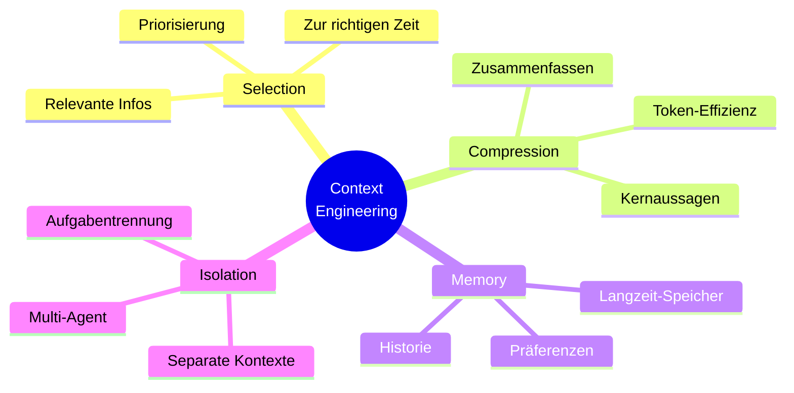

---
layout: default
title: Context Engineering
parent: Kontext & Wissen
grand_parent: Agenten-Implementierung
nav_order: 5
description: "Kontextmanagement für Agenten: Auswahl, Struktur, Memory, RAG und Tool-Ausgaben"
has_toc: true
---

# Context Engineering
{: .no_toc }

> [!NOTE] Kernfrage<br>
> Welche Informationen braucht das Modell, in welcher Form und zu welchem Zeitpunkt?

---

# Inhaltsverzeichnis
{: .no_toc .text-delta }

1. TOC
{:toc}

---

## Was ist Context Engineering?
**Context Engineering** sorgt dafür, dass ein KI-System zur richtigen Zeit die passenden Informationen bekommt. In einfachen Demos fällt das oft kaum auf. In Anwendungen mit längeren Abläufen, mehreren Datenquellen oder wiederkehrenden Anfragen bestimmt der Kontext aber oft stärker die Qualität als der eigentliche Prompt.

In der Praxis wird schnell sichtbar: Viele vermeintliche Modellfehler sind Kontextfehler. Es fehlen Daten, unwichtige Informationen verdrängen die wichtigen, oder alte Angaben landen zusammen mit neuen Informationen im Prompt. Context Engineering kümmert sich genau um diese Ebene.

Ein häufiger Fehler: Mehr Kontext wird mit besserem Kontext verwechselt. In vielen Agentensystemen sinkt die Antwortqualität, wenn relevante Signale in langen Historien, unpriorisierten Tool-Ausgaben und veralteten Informationen untergehen.

> [!NOTE] Kernidee<br>
> Nicht der "perfekte Prompt" allein entscheidet, sondern die Qualität und Struktur des gesamten Kontexts.

### Der Unterschied zu Prompt Engineering

| Aspekt                 | Prompt Engineering                                                                     | Context Engineering                                                                                    |
| ---------------------- | -------------------------------------------------------------------------------------- | ------------------------------------------------------------------------------------------------------ |
| **Definition**         | Eingabeaufforderungen für KI-Modelle gezielt formulieren <br>und verbessern            | Den gesamten Kontext für KI-Systeme entwerfen, auswählen <br>und verwalten                             |
| **Fokus**              | Einzelnen Prompt verbessern                                                            | Kontext über ein System hinweg steuern                                                                 |
| **Zeitrahmen**         | Kurzfristig, pro Anfrage                                                               | Langfristig, systemweit                                                                                |
| **betroffene Gruppe**  | Endnutzer, Content-Ersteller                                                           | Entwickler, Systemarchitekten                                                                          |
| **Hauptziel**          | Bessere Antworten durch bessere Prompts                                                | Konsistente Antworten durch passenden Kontext                                                          |
| **Techniken**          | - Few-Shot Learning  <br>- Chain-of-Thought  <br>- Role-Playing  <br>- Template-Design | - RAG (Retrieval-Augmented Generation)  <br>- Vektorsuche  <br>- Wissensgraphen  <br>- Kontext-Caching |
| **Eingabeformat**      | Textuelle Anweisungen und Beispiele                                                    | Strukturierte Daten, Dokumente, Metadaten                                                              |
| **Skalierbarkeit**     | Auf einzelne Interaktionen begrenzt                                                    | Für größere Anwendungen besser skalierbar                                                              |
| **Wartung**            | Prompts manuell anpassen                                                               | Kontext automatisch oder regelbasiert verwalten                                                        |
| **Fehlerbehandlung**   | Prompts ausprobieren und nachbessern                                                   | Kontext prüfen, priorisieren und validieren                                                            |
| **Messbarkeit**        | Antworten qualitativ bewerten                                                         | Metriken wie Relevanz und Genauigkeit erfassen                                                         |
| **Kosten**             | Niedrig, solange nur Prompts angepasst werden                                          | Höher durch Infrastruktur und Datenmanagement                                                          |
| **Anwendungsbereich**  | - Chatbots  <br>- Content-Generierung  <br>- Übersetzungen  <br>- Kreative Aufgaben    | - Wissensmanagementsysteme  <br>- Dokumentensuche  <br>- Expertensysteme  <br>- Enterprise-KI          |
| **Herausforderungen**  | - Prompt-Injection  <br>- Schwankende Ergebnisse<br>- Begrenzte Kontextlänge           | - Datenqualität  <br>- Verstreuter Kontext  <br>- Skalierungskosten                                    |
| **Erfolgsfaktoren**    | - Klare Anweisungen  <br>- Gute Beispiele  <br>- Strukturierte Prompts                 | - Gute Datenquellen  <br>- Passende Suche  <br>- Relevanter Kontext                                    |
| **Tools & Frameworks** | - OpenAI Playground  <br>- LangChain PromptTemplates  <br>- Anthropic Console          | - LangChain  <br>- LlamaIndex  <br>- Pinecone  <br>- Weaviate                                          |
| **Zukunftstrend**      | Einbindung in größere Systeme                                                          | Weiterentwicklung zu autonomen Agenten                                                                 |
| **Best Practices**     | - Schrittweise verbessern  <br>- A/B-Testing  <br>- Klare Rollen                       | - Datengovernance  <br>- Monitoring & Logging  <br>- Kontext-Versionierung                             |

### Abgrenzung

**Prompt Engineering** hilft, einzelne Anfragen zu verbessern. **Context Engineering** wird wichtig, sobald Informationen ausgewählt, priorisiert, gespeichert oder über mehrere Schritte hinweg konsistent gehalten werden müssen. Robuste Anwendungen brauchen meistens beides.

### Warum ist das wichtig?

Nicht jeder Qualitätsgewinn entsteht durch bessere Formulierungen im Prompt. Sobald Dokumente, Memory, Tools oder externe Datenquellen beteiligt sind, liegt die eigentliche Arbeit in der Kontextarchitektur. Dort entscheidet sich, welche Informationen überhaupt ins Modell gelangen und in welcher Form sie dort ankommen.

> [!TIP] Startpunkt<br>
> Sinnvoll ist eine kleine, messbare Kontext-Checkliste. Erst wenn Auswahl, Struktur und Aktualität stabil funktionieren, lohnt sich zusätzliche Komplexität.

## Kontextqualität: Zugriff, Bedeutung, Präzision und Governance

In vielen Anwendungen ist nicht das Modell der Engpass, sondern der Kontext, den es bekommt. Ein Modell kann sauber argumentieren und trotzdem falsch liegen, wenn relevante Informationen fehlen, alte Daten im Prompt stehen oder interne Informationen ohne Berechtigung einfließen.

Ein Beispiel: Ein Agent soll ein Kundengespräch vorbereiten. Ohne Kontext entsteht meist eine ordentlich formatierte, aber allgemeine Besprechungsvorlage. Mit gutem Context Engineering erkennt das System den Kunden, berücksichtigt offene Support-Tickets, prüft die Vertragshistorie und beachtet Berechtigungen. Eine interne Preisdiskussion gehört dann nicht in die Ausgabe, wenn die anfragende Rolle keinen Zugriff darauf hat.

| Säule | Aufgabe | Typische Frage |
|---|---|---|
| Connected Access | relevante Quellen erreichbar machen, ohne alle Daten in ein neues System zu kopieren | Wo liegt die Information und darf sie abgefragt werden? |
| Knowledge Layer | Rohdaten mit Bedeutung, Entitäten, Beziehungen und Regeln anreichern | Welche Kunden, Verträge, Tickets oder Produkte hängen zusammen? |
| Precision Retrieval | nur den Kontext liefern, der zur aktuellen Aufgabe passt | Was braucht das Modell wirklich für diese Anfrage? |
| Runtime Governance | Zugriff und Ausgabe zur Laufzeit prüfen | Darf dieser Agent diese Information nutzen oder ausgeben? |

Connected Access verhindert, dass ein Agent nur eine isolierte Datenquelle sieht. In größeren Organisationen liegen relevante Informationen in Datenbanken, Dokumentenspeichern, SaaS-Systemen, APIs, Code-Repositories oder Ticketsystemen. Zero-Copy-Federation kann helfen, Daten dort abzufragen, wo sie liegen, statt sie vollständig in eine neue Wissensbasis zu kopieren.

Der Knowledge Layer gibt diesen Daten Struktur. Er löst Entitäten auf, verbindet Datensätze über Systemgrenzen hinweg und hält fachliche Beziehungen fest. Ein Support-Ticket, ein Vertrag, eine Produktversion und ein Ansprechpartner sind für das Modell erst nützlich, wenn klar ist, wie sie zusammengehören.

Precision Retrieval begrenzt den Kontext auf das, was für die Aufgabe zählt. Mehr Kontext ist nicht automatisch besser. Gute Systeme filtern nach Absicht, Rolle, Zeit, Quelle und Policy. Sie vermeiden, dass ein Modell mit langen, nur lose passenden Dokumenten arbeitet, während die entscheidende Information zwischen Nebensachen verschwindet.

Runtime Governance macht die Kontextbereitstellung überprüfbar. Berechtigungen dürfen nicht nur beim Datenimport gelten, sondern auch beim Abruf und bei der Antworterzeugung. Ein Agent kann eine Quelle technisch erreichen und trotzdem nicht berechtigt sein, ihre Inhalte für diese Anfrage zu verwenden.

### Precision Retrieval im Detail

Standard-RAG sucht meist semantisch ähnliche Chunks und fügt die besten Treffer in den Prompt ein. Das reicht für einfache Nachschlagefragen. Es stößt aber an Grenzen, wenn der Agent erst klären muss, welche Information fehlt, welche Beziehungen wichtig sind oder wie stark ein Treffer verdichtet werden soll.

**Agentic RAG** erweitert Retrieval um Iteration. Der Agent stellt eine erste Suchanfrage, prüft die Treffer und entscheidet, ob weitere Quellen nötig sind. Das hilft, wenn eine Aufgabe mehrere Recherchewege braucht oder eine erste Antwort sichtbar lückenhaft bleibt.

**Graph RAG** nutzt Beziehungen zwischen Entitäten. Statt nur nach ähnlichen Textstellen zu suchen, fragt das System zum Beispiel: Welche Tickets, Verträge und Produktversionen hängen mit diesem Kunden zusammen? Die Vektorsuche liefert dann Details innerhalb eines engeren, fachlich begründeten Suchraums.

**Context Compression** reduziert Rauschen vor dem Modellaufruf. Lange Dokumente werden zusammengefasst, Treffer neu gerankt oder auf die relevanten Abschnitte gekürzt. Das Ziel ist nicht maximale Kürze, sondern ein besseres Signal-Rausch-Verhältnis.

## Die vier Grundstrategien


### Kontext auswählen (Context Selection)
Die richtigen Informationen zur richtigen Zeit bereitstellen.

Selection ist meist der erste Engpass. In vielen Prototypen wird alles in den Prompt gelegt, was verfügbar ist. Das funktioniert kurzzeitig, skaliert aber schlecht. Gute Systeme entscheiden früh, was für die jeweilige Aufgabe relevant ist und was nicht in den aktuellen Lauf gehört.

**Beispiel - Versicherungsberatung:**
```
Kundenkontext:
- Alter: 35 Jahre
- Familie: 2 Kinder
- Beruf: Selbständig
- Ziel: Familienabsicherung

→ KI wählt passende Produktinformationen aus
```

### Kontext komprimieren (Context Compression)
Nur die wichtigsten Informationen behalten.

Kompression ist keine kosmetische Kürzung, sondern eine Qualitätsfrage. Wenn Nebensachen genauso ausführlich erscheinen wie entscheidende Fakten, sinkt die Trennschärfe. Zusammenfassungen müssen deshalb nicht nur kürzer sein, sondern auch priorisieren.

**Beispiel:**
```
Lange Schadenshistorie (50 Seiten)
↓
Zusammenfassung: "3 Kleinschäden in 5 Jahren, 
Gesamtschaden: 2.500€, keine Muster erkennbar"
```

### Kontext speichern (Context Memory)
Wichtige Informationen für später aufbewahren.

Memory ist nützlich, wenn Informationen nicht bei jeder Anfrage neu abgefragt werden sollen. Gleichzeitig entsteht hier schnell technischer und fachlicher Ballast: Was einmal gespeichert wurde, bleibt oft länger im System als sinnvoll. Zu Memory gehört deshalb immer auch eine Regel, wann Kontext verfällt oder überschrieben wird.

**Beispiel:**
```
Kundeninteraktion 1: "Ich bevorzuge niedrige Beiträge"
↓ (gespeichert)
Kundeninteraktion 2: KI erinnert sich an Präferenz
```

### Kontext trennen (Context Isolation)
Verschiedene Aufgaben mit separaten Kontexten bearbeiten.

Isolation wird oft erst wichtig, wenn ein System komplexer wird. Spätestens bei Agenten, Werkzeugnutzung oder sensiblen Daten ist sie zentral. Nicht jede Komponente sollte denselben Kontext sehen. Klare Trennung reduziert Fehler, vereinfacht Debugging und hilft bei Compliance-Fragen.

**Beispiel:**
```
Agent A: Schadensprüfung (hat Zugang zu Schadensdaten)
Agent B: Kundenberatung (hat Zugang zu Produktdaten)
```

## Die drei häufigsten Fehler
> [!WARNING] Typische Ursache für Instabilität<br>
> Instabile KI-Antworten sind oft kein Modellproblem, sondern ein Kontextproblem: zu viel, widersprüchlich oder veraltet.

### Context Overload
**Problem:** Zu viele Informationen verwirren die KI
**Lösung:** Nur relevante Informationen bereitstellen

Overload entsteht nicht nur bei langen Dokumenten. Auch viele kleine, nur teilweise relevante Hinweise können den Fokus verschieben. Typisch ist dann eine Antwort, die formal plausibel wirkt, aber an der eigentlichen Aufgabe vorbeigeht.

### Context Conflict
**Problem:** Widersprüchliche Informationen
**Lösung:** Informationen auf Konsistenz prüfen

Konflikte sind tückisch, weil sie von außen oft wie zufällige Modellschwankungen aussehen. Tatsächlich arbeitet das Modell dann mit mehreren konkurrierenden Quellen. Ohne Priorisierungsregeln oder Versionslogik wird die Antwort instabil.

### Context Staleness
**Problem:** Veraltete Informationen
**Lösung:** Regelmäßige Updates einplanen

Veralteter Kontext fällt in Tests oft nicht auf, weil die Datenbasis dort klein und überschaubar bleibt. Im laufenden Betrieb wird genau das schnell zum Problem: Eine formal saubere Antwort kann fachlich falsch sein, wenn sie auf einem alten Stand beruht.

## Praktische Anwendung
### Kontext analysieren

Vor jeder Optimierung steht die Frage, welche Informationen wirklich nötig sind. Die entscheidende Unterscheidung lautet nicht "vorhanden oder nicht vorhanden", sondern "kritisch, wichtig oder nur ergänzend". Diese Priorisierung reduziert Ballast und macht spätere Entscheidungen nachvollziehbar.

```
Frage: "Welche Versicherung brauche ich?"

Benötigte Kontextinformationen (nach Priorität):
✓ KRITISCH:
  - Alter: 32 Jahre
  - Familienstand: verheiratet, 2 Kinder (3, 7 Jahre)
  - Beruf: Software-Entwickler
  - Einkommen: 65.000€ brutto/Jahr

✓ WICHTIG:
  - Bestehende Absicherungen: KFZ-Haftpflicht, Hausratversicherung
  - Immobilienstatus: Eigenheim (Restschuld 180.000€)
  - Gesundheitsstatus: keine Vorerkrankungen

✓ ERGÄNZEND:
  - Risikobereitschaft: konservativ
  - Finanzielle Ziele: Familienabsicherung, Altersvorsorge
  - Verfügbares Budget: 200€/Monat für Versicherungen
```

### Kontext strukturieren

Struktur hilft nicht nur dem Modell, sondern auch der Entwicklung. Sobald klar benannte Abschnitte für Kundenkontext, Produktkontext und Beratungsziel existieren, lassen sich Fehler schneller finden. Unstrukturierte Kontextblöcke sind dagegen schwer zu pflegen und kaum testbar.

```
PROMPT-STRUKTUR:

=== KUNDENKONTEXT ===
Demografisch:
- Person: 32 Jahre, männlich, verheiratet
- Familie: 2 Kinder (3, 7 Jahre), Hausfrau-Ehefrau
- Wohnort: Eigenheim, Restschuld 180.000€

Finanziell:
- Einkommen: 65.000€ brutto/Jahr (alleinverdienend)
- Budget Versicherungen: 200€/Monat
- Risikobereitschaft: konservativ

=== PRODUKTKONTEXT ===
Bestehende Absicherung:
- KFZ-Haftpflicht: vollständig
- Hausratversicherung: 50.000€ Versicherungssumme
- Keine weitere Absicherung vorhanden

Relevante Produktkategorien:
- Risikolebensversicherung (Familienabsicherung)
- Berufsunfähigkeitsversicherung (Einkommensschutz)
- Private Unfallversicherung
- Rechtsschutzversicherung

=== BERATUNGSKONTEXT ===
Anfrage: "Welche Versicherung brauche ich?"
Beratungsziel: Bedarfsanalyse und Produktempfehlung
Compliance: Versicherungsberatung nach §34d GewO
```

### Kontext optimieren

Optimierung heißt hier nicht, einen Prompt möglichst stark zu kürzen. Ziel ist ein gutes Verhältnis aus Kürze, Klarheit und fachlicher Relevanz. Guter Kontext spart Tokens, ohne die entscheidenden Signale zu verlieren.

```
OPTIMIERUNGSREGELN für KI-Verarbeitung:

1. TOKEN-EFFIZIENZ (Max. 500 Token für Kontext):
   ❌ "Der Kunde ist 32 Jahre alt und arbeitet als Software-Entwickler..."
   ✅ "Kunde: 32J, Software-Dev, 65k€, verheiratet, 2 Kinder"

2. RELEVANZ-FILTERING:
   Für Versicherungsberatung IMMER relevant:
   - Alter, Familienstand, Beruf, Einkommen
   - Bestehende Policen
   - Gesundheitsstatus (wenn abgefragt)
   
   SITUATIV relevant:
   - Hobbys (nur bei Unfallversicherung)
   - Immobilien (nur bei Sachversicherungen)

3. STRUKTURIERUNG für LLM:
```

AUFTRAG: Versicherungsbedarfsanalyse KUNDE: 32J, Soft-Dev, 65k€, verheiratet, 2Ki(3,7J), Eigenheim(180k€ Schuld) BESTAND: KFZ-Haft, Hausrat(50k€) BUDGET: 200€/Monat PRÄFERENZ: konservativ ZIEL: Familien-/Einkommensabsicherung

AUFGABE: Identifiziere Versicherungslücken und empfehle passende Produkte mit Begründung.

### Konsistenz-Checkliste:

> [!SUCCESS] Qualitätsgate<br>
> Diese Checkliste eignet sich als "Definition of Done" vor jedem produktiven Prompt-Update.

```
- [ ] Gleiche Kategorien in allen Abschnitten verwendet
- [ ] Konkrete Beispiele statt Platzhalter
- [ ] Token-Limits definiert und eingehalten  
- [ ] Relevanz-Kriterien spezifiziert
- [ ] Optimierung messbar (Token-Reduktion, Strukturierung)
```

Die Checkliste ist bewusst schlicht. In realen Projekten reicht oft schon eine kleine, konsequent genutzte Qualitätsroutine, um die häufigsten Kontextfehler zu vermeiden. Erst danach lohnt sich feinere Optimierung.

## Einfache Tools und Techniken
### Tool 1: Context-Checkliste
```
☐ Sind alle notwendigen Informationen vorhanden?
☐ Sind die Informationen aktuell?
☐ Gibt es Widersprüche?
☐ Ist der Kontext nicht zu lang?
☐ Ist der Kontext relevant für die Aufgabe?
```

### Tool 2: Kontext-Templates
```
Kundenkontext:
- Alter: 35 Jahre
- Familie: 2 Kinder
- Beruf: Selbständig
- Ziel: Familienabsicherung

→ KI wählt passende Produktinformationen aus
```
### Tool 3: Einfache Kontextregeln
```
Kundenkontext:
- Alter: 35 Jahre
- Familie: 2 Kinder
- Beruf: Selbständig
- Ziel: Familienabsicherung

→ KI wählt passende Produktinformationen aus
```
## Messbare Verbesserungen
### Vorher vs. Nachher

**Ohne Context Engineering:**
- ❌ 45% Fehlerrate bei Empfehlungen
- ❌ 3+ Nachfragen pro Beratung
- ❌ 15 Min. Bearbeitungszeit

**Mit Context Engineering:**
- ✅ 12% Fehlerrate bei Empfehlungen
- ✅ 1 Nachfrage pro Beratung
- ✅ 8 Min. Bearbeitungszeit

### Erfolgs-Metriken

> [!TIP] Wirkung sichtbar machen<br>
> Sinnvoll sind pro Use Case zwei bis drei Metriken, etwa Fehlerrate, Nachfragen oder Bearbeitungszeit. Erst der Vorher-Nachher-Vergleich zeigt, ob eine Kontextänderung tatsächlich wirkt.
```
Kundenkontext:
- Alter: 35 Jahre
- Familie: 2 Kinder
- Beruf: Selbständig
- Ziel: Familienabsicherung

→ KI wählt passende Produktinformationen aus
```
## Sofort umsetzbare Tipps
### Do's
- Mit einfachen Context-Checklisten beginnen
- Feedback systematisch sammeln
- Erfolgreiche Kontextmuster dokumentieren
- Mit den häufigsten Anwendungsfällen starten
- Verbesserungen regelmäßig messen

### Don'ts
- Nicht zu kompliziert beginnen
- Nicht alle Kontextquellen auf einmal ändern
- Nicht ohne Messungen optimieren
- Nicht vergessen, das Team zu schulen
- Nicht auf Feedback verzichten

> [!WARNING] Häufiger Rollout-Fehler<br>
> Unmessbare Änderungen am Kontext erschweren die Ursachenanalyse und führen zu schwer reproduzierbaren Ergebnissen.

---

## Was für Entwickler zuerst wichtig ist

Für erste Agentenprojekte reicht meist ein komplexes Kontextframework nicht. Wichtiger ist eine klare Kontextregel: Welche Informationen sind Pflicht, welche sind optional und welche dürfen nie ungeprüft in den Modellkontext gelangen? Diese Entscheidung reduziert Fehlverhalten oft stärker als ein Modellwechsel.

In der Praxis wird das relevant, wenn ein Agent mehrere Quellen kombiniert, Tool-Ausgaben weiterverarbeitet oder Memory über längere Sitzungen nutzt. Dann wird Kontext nicht nur gelesen, sondern aktiv gestaltet.

> [!NOTE] Skalierungshinweis<br>
> Context Engineering ist keine Spezialdisziplin nur für große Systeme. Schon einfache Techniken verbessern viele Anwendungen spürbar, sofern sie konsequent und messbar eingesetzt werden.

## Abgrenzung zu verwandten Dokumenten

| Dokument | Frage |
|---|---|
| [Prompt Engineering]({{ '/04-agenten-implementierung/entwurf/prompt-engineering.html' | relative_url }}) | Wie wird eine einzelne Anfrage formuliert, statt den Gesamtkontext eines Systems zu gestalten? |
| [RAG-Konzepte]({{ '/04-agenten-implementierung/kontext-wissen/rag-konzepte.html' | relative_url }}) | Wann ist Retrieval nur ein Teil der Kontextstrategie? |
| [Fine-Tuning]({{ '/03-modelle-provider-anpassung/fine-tuning.html' | relative_url }}) | Wann wird Verhalten ins Modell verlagert statt zur Laufzeit organisiert? |

---

**Version:** 1.3<br>
**Stand:** Mai 2026<br>
**Kurs:** KI-Agenten. Planen. Handeln. Prüfen.
