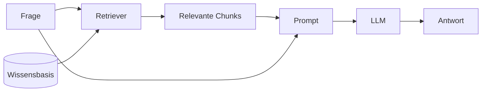
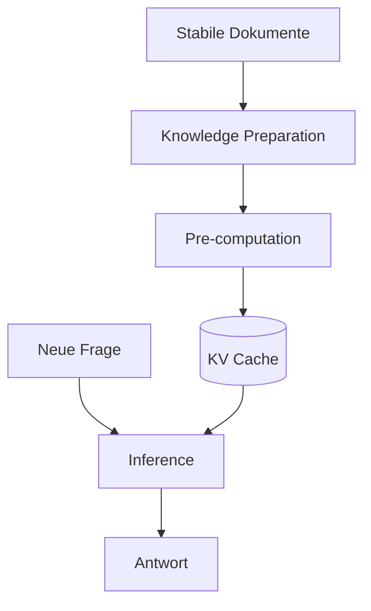

---
layout: default
title: Long Context, RAG und CAG
parent: Kontext & Wissen
grand_parent: Agenten-Implementierung
nav_order: 6
description: "Strategien für externes Wissen: Long Context, Retrieval-Augmented Generation, Cache-Augmented Generation und Prompt Caching"
has_toc: true
---

# Long Context, RAG und CAG
{: .no_toc }

> **Externes Wissen kann gesucht, vollständig geladen oder vorab gecacht werden. Die richtige Strategie hängt von Datenmenge, Änderungsrate und Nutzungsmuster ab.**

---

# Inhaltsverzeichnis
{: .no_toc .text-delta }

1. TOC
{:toc}

---

## Warum Modelle externes Wissen brauchen

Ein Sprachmodell kennt nur das, was in seinen Trainingsdaten und im aktuellen Kontext steht. Wenn ein Agent mit privaten Dokumenten, aktuellen Quartalszahlen, internen Richtlinien oder projektspezifischen Dateien arbeiten soll, muss dieses Wissen zur Laufzeit bereitstehen.

Dafür gibt es mehrere Strategien. Die bekannteste ist **Retrieval Augmented Generation** (RAG): Ein Retriever sucht passende Ausschnitte aus einer Wissensbasis und fügt sie in den Prompt ein. Mit größeren Kontextfenstern und Prompt-Caching kommen zwei weitere Optionen dazu: **Long Context** und **Cache Augmented Generation** (CAG).

Die drei Verfahren ersetzen einander nicht. Sie beantworten dieselbe Grundfrage auf unterschiedliche Weise: Wie kommt externes Wissen zum Modell, ohne Qualität, Kosten oder Latenz unnötig zu verschlechtern?

## Drei Wege zu externem Wissen

| Strategie | Grundidee | Geeignet für | Hauptrisiko |
|---|---|---|---|
| Long Context | alle relevanten Dokumente direkt in den Prompt legen | einmalige Analyse, überschaubare Dokumentmengen | hohe Tokenkosten, Latenz, Lost-in-the-Middle |
| RAG | relevante Ausschnitte suchen und nur Treffer laden | große oder dynamische Wissensbestände | falsche oder fehlende Treffer |
| CAG / Prompt Caching | stabile Wissensbasis einmal verarbeiten und wiederverwenden | wiederholte Fragen zu stabilen Dokumenten | Cache muss bei Änderungen neu aufgebaut werden |

Die Architekturentscheidung lautet daher nicht „RAG oder nicht?", sondern: Wie groß ist die Wissensbasis, wie häufig ändert sie sich und wie oft wird sie abgefragt?

## Long Context: alles in den Kontext legen

Long Context ist die direkteste Strategie. Alle relevanten Dokumente kommen zusammen mit der Frage in das Kontextfenster. Das Modell liest alles und erzeugt daraus die Antwort.

Das spart Infrastruktur: kein Retriever, keine Embeddings, keine Vektordatenbank, kein Risiko, dass ein Retrieval-Schritt das falsche Dokument zurückgibt. Für einmalige Aufgaben ist das eine sinnvolle Wahl — etwa wenn ein einzelner Vertrag, ein Bericht oder ein kleines Dossier analysiert werden soll.

Architektonisch bedeutet das: Long Context entfernt mehrere bewegliche Teile aus dem System — keine Chunking-Strategie, kein Embedding-Modell, keine Vektordatenbank, kein Reranking, keine Synchronisierung zwischen Quelle und Index. Für kleine oder klar begrenzte Datenbestände ist diese No-Stack-Variante oft robuster als eine schlecht gewartete Retrieval-Pipeline.

Ein zweiter Vorteil: Long Context vermeidet die **Retrieval-Lotterie**. Bei RAG kann die relevante Information in der Wissensbasis vorhanden sein, aber trotzdem nicht im Prompt landen, weil die Suche den falschen Chunk zurückgibt. Dieser Fehler ist besonders gefährlich, weil er oft still passiert: Das Modell antwortet plausibel, hat aber die entscheidende Quelle nie gesehen.

Ein dritter Vorteil betrifft **Whole-Book-Fragen**. Manche Aufgaben verlangen keinen einzelnen passenden Ausschnitt, sondern einen Vergleich über ganze Dokumente hinweg. Beispiel: Welche Sicherheitsanforderungen aus einem Lastenheft fehlen in den Release Notes? Ein Retriever kann Anforderungen und Release-Notizen getrennt finden, aber die eigentliche Lücke zeigt sich erst im Vergleich beider vollständiger Dokumente. Long Context passt hier besser, weil das Modell das Gesamtbild sieht.

Große Kontexte kosten bei API-Modellen mehr, erhöhen die Latenz und können die Modellqualität verschlechtern. Besonders bekannt ist der **Lost-in-the-Middle-Effekt**: Informationen am Anfang und Ende eines langen Kontextes nutzt das Modell zuverlässiger als solche, die in der Mitte stehen.

Hinzu kommt der **Rereading Tax**: Ein 250.000-Token-Handbuch muss das Modell bei jeder Anfrage neu verarbeiten. Prompt Caching reduziert das für stabile Präfixe. Ohne Cache oder bei häufig geänderten Inhalten bleibt Long Context teuer.

Typischer Fehler: Long Context als Ersatz für jede Wissensanbindung zu behandeln. Nur weil etwas technisch in das Kontextfenster passt, heißt das nicht, dass es billig, schnell oder zuverlässig verarbeitet wird.

## RAG: relevantes Wissen suchen

RAG löst das Kontextproblem anders. Die Frage sucht relevante Ausschnitte; das System lädt nur diese in den Prompt.

RAG lohnt sich besonders, wenn die Wissensbasis groß, dynamisch oder nicht vollständig in den Kontext ladbar ist. Der Preis ist zusätzliche Infrastruktur: Dokumente müssen vorbereitet, gechunked, eingebettet, gesucht und oft gerankt werden.

Das Hauptrisiko liegt im Retrieval. Wenn die relevanten Informationen nicht gefunden werden, kann das Modell sie auch nicht nutzen. RAG verbessert also nicht automatisch die Antwortqualität — es verschiebt einen Teil des Problems auf Suche, Chunking, Embeddings und Ranking.

Diese Schwäche hat einen Namen: **Silent Failure**. Die Antwort steht in den Daten, aber der Retriever liefert sie nicht. Für Nutzer ist dieser Fehler schwer zu erkennen, weil das Modell trotzdem eine flüssige Antwort erzeugt.

Für große Systeme ist RAG die pragmatischere Wahl. Ein Kontextfenster mit Millionen Tokens klingt groß, ist im Vergleich zu Enterprise-Datenbeständen aber klein. Interne Wikis, Tickets, Code-Repositories, Logs und Dokumentenarchive passen nicht vollständig in einen Prompt. RAG wirkt als Filterebene: Es reduziert einen sehr großen Datenraum auf die wenigen Ausschnitte, die in den Modellkontext passen.

RAG fokussiert außerdem die Aufmerksamkeit des Modells. Long Context gibt alles rein und hofft, dass das Modell die relevante Stelle findet. RAG entfernt im Idealfall den größten Teil des Rauschens und legt nur die wahrscheinlich relevanten Chunks vor. Bei Needle-in-the-Haystack-Fragen ist das oft zuverlässiger als ein langer, unstrukturierter Kontext.

## CAG: Wissen einmal lesen, Cache wiederverwenden

**Cache Augmented Generation** setzt an einem anderen Punkt an: Wenn dieselbe stabile Wissensbasis wiederholt abgefragt wird, ist es ineffizient, sie bei jeder Anfrage neu zu verarbeiten.

Beim Verarbeiten eines langen Prompts berechnet ein Transformer interne **Key-Value-Caches** — verarbeitete Zustände des Kontextes, die spätere Tokens nicht neu berechnen müssen. CAG nutzt das: Die Wissensbasis wird einmal verarbeitet, der Cache gespeichert und für spätere Anfragen wiederverwendet.

CAG besteht typischerweise aus drei Phasen:

| Phase | Aufgabe |
|---|---|
| Knowledge Preparation | Dokumente auswählen, strukturieren und so formatieren, dass sie in den Kontext passen |
| Pre-computation | Modell verarbeitet die Dokumente und erzeugt einen wiederverwendbaren KV-Cache |
| Inference | Neue Fragen nutzen den vorberechneten Cache, statt die Dokumente vollständig neu zu lesen |

Der Vorteil zeigt sich erst bei Wiederholung. Die erste Verarbeitung kostet ähnlich viel wie Long Context. Ab der zweiten Anfrage spart CAG Latenz und Kosten — bei der hundertsten deutlich.

## Prompt Caching als praktische Variante

Entwickler müssen den KV-Cache meist nicht selbst verwalten. Viele Modellanbieter bieten **Prompt Caching**: Wenn mehrere Requests denselben langen Prompt-Präfix teilen, verwertet der Anbieter diesen Teil intern. Für Entwickler ist das ein normaler API-Aufruf; ein Teil der Vorverarbeitung wird übersprungen oder günstiger abgerechnet.

Das ist besonders nützlich für stabile Systemprompts, Richtlinien oder Produktdokumentation, die in vielen Anfragen gleich bleiben.

Typischer Fehler: Prompt Caching mit dauerhaftem Agenten-Memory zu verwechseln. Prompt Caching merkt sich keinen neuen Nutzerfakt und keine Erfahrung aus einer Sitzung. Es beschleunigt nur die Wiederverwendung eines gleichen oder sehr ähnlichen Kontextpräfixes.

## Entscheidungshilfe

| Situation | Passende Strategie | Warum |
|---|---|---|
| Ein einzelnes Dokument soll einmal analysiert werden | Long Context | direkte Umsetzung, kein Retrieval nötig |
| Mehrere begrenzte Dokumente müssen vollständig verglichen werden | Long Context | globale Zusammenhänge und Lücken bleiben sichtbar |
| Viele Dokumente, aber nur wenige Ausschnitte sind je Anfrage relevant | RAG | Kontext bleibt klein und gezielt |
| Stabile Wissensbasis wird sehr oft abgefragt | CAG / Prompt Caching | Vorverarbeitung amortisiert sich |
| Wissensbasis ändert sich häufig | RAG | Cache-Neuberechnung wäre zu teuer |
| Vollständigkeit wichtiger als Kosten | Long Context oder CAG | weniger Risiko, dass Retrieval etwas übersieht |
| Sehr große Wissensbasis | RAG | alles Laden ist nicht realistisch |
| Einzelne relevante Stelle in sehr viel Text finden | RAG oder gezieltes Context Engineering | weniger Rauschen im Modellkontext |

In der Praxis kombinieren Architekturen diese Strategien. Beispiel: Ein Agent nutzt RAG, um relevante Dokumentbereiche zu finden, lädt ausgewählte Dateien in den Kontext und nutzt Prompt Caching für stabile Systemanweisungen.

## Long Context vs. RAG: typische Entscheidungsfragen

| Frage | Wenn ja ... | Wenn nein ... |
|---|---|---|
| Passt der relevante Datenbestand vollständig in das Kontextfenster? | Long Context ist möglich | RAG oder Tools sind nötig |
| Muss das Modell über das gesamte Dokument hinweg vergleichen? | Long Context bevorzugen | RAG kann reichen |
| Wird dieselbe Wissensbasis häufig abgefragt? | Prompt Caching oder CAG prüfen | Long Context kann für Einmalaufgaben reichen |
| Ändert sich die Wissensbasis ständig? | RAG bevorzugen | Cache-Strategien werden attraktiver |
| Ist Retrieval-Fehler besonders riskant? | Long Context oder hybride Strategie prüfen | RAG ist oft effizienter |
| Ist der Datenbestand praktisch unbegrenzt? | RAG als Filterebene nötig | Long Context bleibt eine Option |

## Abgrenzung zu Memory-Systemen

Long Context, RAG und CAG sind Strategien, um Wissen **in den Modellkontext zu bringen**. Memory-Systeme beantworten eine andere Frage: Welche Informationen soll ein Agent über Sitzungen, Nutzer, Aufgaben und frühere Erfahrungen hinweg behalten?

Die beiden Ebenen greifen zusammen. Ein Memory Store kann Fakten, Workflows oder Episoden speichern. Long Context, RAG oder CAG entscheiden dann, wie diese gespeicherten Informationen zur Laufzeit wieder in den Kontext gelangen.

| Ebene | Kernfrage |
|---|---|
| Memory-System | Was soll dauerhaft behalten werden? |
| Kontextstrategie | Was davon soll jetzt in den Modellkontext? |
| Retrieval/Cache-Strategie | Wie wird es effizient und zuverlässig bereitgestellt? |

## Was für Entwickler zuerst wichtig ist

Als erste Orientierung reicht eine knappe Faustregel:

| Wenn ... | dann ... |
|---|---|
| die Daten klein und einmalig sind | Long Context verwenden |
| die Daten groß oder dynamisch sind | RAG verwenden |
| die Daten stabil und häufig abgefragt sind | Prompt Caching oder CAG prüfen |

Nicht das richtige Schlagwort entscheidet. Die Architektur muss zur Änderungsrate der Daten und zum Nutzungsmuster passen.

## Abgrenzung zu verwandten Dokumenten

| Dokument | Frage |
|---|---|
| [Kontext- und Wissensanbindung](./kontext-wissensanbindung.html) | Wie binden Agenten Wissen grundsätzlich ein? |
| [RAG-Konzepte](./rag-konzepte.html) | Wie funktioniert eine Retrieval-Pipeline im Detail? |
| [Context Engineering](./context-engineering.html) | Wie wird Kontext gezielt ausgewählt, strukturiert und begrenzt? |
| [Memory-Systeme]({{ '/04-agenten-implementierung/ablauf-zustand/memory-systeme.html' | relative_url }}) | Was soll ein Agent über Sitzungen hinweg behalten? |

---

**Version:** 2.0 
**Stand:** Juni 2026 
**Kurs:** KI-Agenten. Verstehen. Anwenden. Gestalten.
