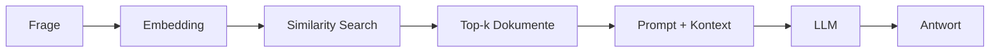

# RAG-Konzepte
{: .no_toc }

> **Retrieval Augmented Generation im Detail – Architektur, Strategien und Best Practices**

---

# Inhaltsverzeichnis
{: .no_toc .text-delta }

1. TOC
{:toc}

---

## Überblick: Was ist RAG?

Large Language Models stoßen in der Praxis an drei typische Grenzen: Wissen ist nicht aktuell genug, internes Fachwissen fehlt und längere Dokumentbestände lassen sich nicht vollständig in einen einzelnen Prompt legen. Genau an dieser Stelle beginnt RAG seinen Nutzen zu zeigen. Nicht als magische Lösung, sondern als technische Antwort auf ein klar umrissenes Problem: relevantes Wissen zur Laufzeit in den Antwortprozess einzuspeisen.

Die folgende Tabelle bündelt diese Ausgangslage, ersetzt aber nicht die eigentliche Entscheidung. RAG lohnt sich nur dann, wenn fehlendes oder externes Wissen wirklich das Problem ist. Wenn die Aufgabe bereits mit vorhandenem Modellwissen sauber lösbar ist, macht Retrieval den Ablauf oft nur langsamer und fehleranfälliger.

| Limitation | Beschreibung |
|------------|--------------|
| **Wissens-Cutoff** | Das Modell kennt nur Informationen bis zum Trainingszeitpunkt |
| **Kein Domänenwissen** | Firmeninterne Dokumente, Fachrichtlinien oder aktuelle Daten fehlen |
| **Halluzination** | Bei Wissenslücken werden plausible, aber falsche Antworten generiert |
| **Kontextlimit** | Nicht alle relevanten Dokumente passen in einen einzelnen Prompt |

Retrieval Augmented Generation ergänzt das Modell also nicht durch neues Training, sondern durch einen zusätzlichen Arbeitsschritt: Zuerst wird gesucht, dann erst formuliert. In Trainings zeigt sich oft, dass genau diese Trennung Missverständnisse aufdeckt. Ist die Suche schlecht, wird auch die Antwort schlecht. RAG verschiebt das Problem deshalb nicht weg, sondern macht sichtbar, wo die eigentliche Schwäche liegt: im Retrieval, im Chunking oder in der Kontextzusammenstellung.

```
Frage → Suche relevante Dokumente → Füge Kontext zum Prompt → LLM generiert Antwort
```

> [!NOTE] Kernidee RAG<br>
> Das LLM erhält genau die Informationen, die es für die aktuelle Frage benötigt – nicht mehr und nicht weniger. Ohne passenden Kontext halluziniert das Modell stattdessen eine Antwort.

---

## Die RAG-Architektur

Ein RAG-System besteht aus zwei Hauptphasen: **Indexierung** und **Retrieval + Generation**. Diese Trennung ist wichtig, weil Fehler in der ersten Phase später oft wie Modellfehler aussehen. Wenn Chunks unsauber gebildet oder Metadaten schlecht gepflegt sind, hilft auch ein starkes Modell kaum noch.

### Indexierungsphase


| Schritt | Beschreibung | Typische Tools |
|---------|--------------|----------------|
| **Laden** | Dokumente aus verschiedenen Quellen einlesen | TextLoader, PyPDFLoader, WebBaseLoader |
| **Chunking** | Große Dokumente in kleinere Teile zerlegen | RecursiveCharacterTextSplitter |
| **Embedding** | Textchunks in Vektoren umwandeln | OpenAIEmbeddings, HuggingFaceEmbeddings |
| **Speichern** | Vektoren in Datenbank ablegen | ChromaDB, FAISS, Pinecone |

### Abfragephase



| Schritt | Beschreibung |
|---------|--------------|
| **Query-Embedding** | Die Frage wird in denselben Vektorraum transformiert |
| **Similarity Search** | Die ähnlichsten Dokumentvektoren werden gefunden |
| **Kontext-Erstellung** | Gefundene Chunks werden zum Prompt hinzugefügt |
| **Generation** | Das LLM generiert eine Antwort basierend auf dem Kontext |

---

## Chunking: Dokumente sinnvoll zerlegen

Chunking ist eine der Stellen, an denen RAG-Projekte am häufigsten an Präzision verlieren. Zu große Chunks verschwenden Kontextfenster und verwässern Treffer. Zu kleine Chunks verlieren fachlichen Zusammenhang. Beides führt dazu, dass das Retrieval formal funktioniert, inhaltlich aber an der falschen Stelle landet.

In Übungen zeigt sich oft ein typischer erster Fehler: Die Chunk-Größe wird einmal festgelegt und dann als technischer Parameter behandelt. Tatsächlich ist sie eine fachliche Entscheidung. Ein Handbuch, ein juristischer Text und API-Dokumentation brauchen nicht dieselbe Granularität.

### Chunking-Strategien

| Strategie | Beschreibung | Anwendungsfall |
|-----------|--------------|----------------|
| **Fixed-Size** | Feste Zeichenanzahl pro Chunk | Einfache Texte ohne Struktur |
| **Recursive** | Hierarchische Trennung (Absatz → Satz → Wort) | Allgemeine Dokumente |
| **Semantic** | Trennung nach Bedeutungseinheiten | Komplexe Fachtexte |
| **Document-based** | Beibehaltung natürlicher Grenzen (Kapitel, Abschnitte) | Strukturierte Dokumente |

### Der RecursiveCharacterTextSplitter

Der am häufigsten verwendete Splitter arbeitet mit einer Hierarchie von Trennzeichen:

```python
from langchain_text_splitters import RecursiveCharacterTextSplitter

splitter = RecursiveCharacterTextSplitter(
    chunk_size=500,      # Maximale Chunk-Größe in Zeichen
    chunk_overlap=100,   # Überlappung zwischen Chunks
    separators=["\n\n", "\n", ". ", " ", ""]  # Trennzeichen-Hierarchie
)
```

**Funktionsweise:**
1. Versuche zuerst, an Doppel-Zeilenumbrüchen zu trennen (Absätze)
2. Falls Chunk zu groß: Trenne an einfachen Zeilenumbrüchen
3. Falls immer noch zu groß: Trenne an Satzenden
4. Letzte Option: Trenne an Leerzeichen oder einzelnen Zeichen

### Overlap: Kontext bewahren

```
Dokument: [AAAA|BBBB|CCCC|DDDD]

Ohne Overlap:
  Chunk 1: [AAAA]
  Chunk 2: [BBBB]
  → Information an Grenzen geht verloren

Mit Overlap (25%):
  Chunk 1: [AAAA|BB]
  Chunk 2: [BB|CCCC]
  → Zusammenhänge bleiben erhalten
```

### Empfehlungen nach Dokumenttyp

| Dokumenttyp | chunk_size | chunk_overlap | Begründung |
|-------------|------------|---------------|------------|
| FAQ / Kurztexte | 200–300 | 50 | Präzise, eigenständige Antworten |
| Handbücher | 500–800 | 100–150 | Kontext zwischen Abschnitten erhalten |
| Rechtsdokumente | 800–1000 | 200 | Vollständige Paragraphen wichtig |
| Code-Dokumentation | 300–500 | 100 | Funktionen zusammenhalten |

Diese Werte sind keine feste Regel. Die Tabelle bildet einen sinnvollen Startpunkt. Entscheidend ist, ob die Treffer später tatsächlich die Antwort tragen. Wenn ein System zwar semantisch ähnliche Chunks findet, aber wiederholt am Absatzrand wichtige Informationen verliert, liegt das Problem oft nicht im Modell, sondern im Zuschnitt der Dokumente.

---

## Embeddings: Text als Vektor

Embeddings machen semantische Suche überhaupt erst möglich. Das Verfahren übersetzt Text in Vektoren, sodass Ähnlichkeit nicht mehr über exakte Worttreffer, sondern über Bedeutungsnähe berechnet werden kann. Das klingt abstrakt, wird aber praktisch sehr schnell greifbar: Ein System kann "Fahrzeug" finden, obwohl in der Frage "Auto" steht.

Gleichzeitig werden Embeddings oft überschätzt. Vektorrepräsentationen lösen nicht automatisch schlechte Dokumentstruktur, unpräzise Queries oder schwache Metadaten. In vielen RAG-Projekten sind sie notwendig, aber nicht hinreichend.

### Konzept

```
"Der Hund spielt im Park"     → [0.12, -0.45, 0.78, ..., 0.33]  (1536 Dim.)
"Die Katze liegt im Garten"   → [0.15, -0.42, 0.71, ..., 0.29]  (ähnlich!)
"Quantenmechanik ist komplex" → [-0.89, 0.23, -0.11, ..., 0.67] (anders!)
```

### Verfügbare Embedding-Modelle

| Modell | Dimensionen | Kosten | Qualität |
|--------|-------------|--------|----------|
| `text-embedding-3-small` (OpenAI) | 1536 | ~$0.02/1M Tokens | ⭐⭐⭐⭐ |
| `text-embedding-3-large` (OpenAI) | 3072 | ~$0.13/1M Tokens | ⭐⭐⭐⭐⭐ |
| `all-MiniLM-L6-v2` (HuggingFace) | 384 | Kostenlos | ⭐⭐⭐ |
| `multilingual-e5-large` (HuggingFace) | 1024 | Kostenlos | ⭐⭐⭐⭐ |

### Ähnlichkeitsmaße

Die Ähnlichkeit zwischen Vektoren wird mathematisch berechnet:

| Maß | Beschreibung | Wertebereich |
|-----|--------------|--------------|
| **Cosine Similarity** | Winkel zwischen Vektoren | -1 bis 1 |
| **Euclidean Distance** | Geometrischer Abstand | 0 bis ∞ |
| **Dot Product** | Skalarprodukt | -∞ bis ∞ |

**Cosine Similarity** ist der Standard, da sie unabhängig von der Vektorlänge nur die "Richtung" (= Bedeutung) vergleicht.

### Beispiel: Embeddings erzeugen


---

## Retrieval: Die richtigen Dokumente finden

Der Retriever ist die eigentliche Arbeitsstelle des Systems. Hier entscheidet sich, ob eine Frage brauchbaren Kontext erhält oder nur ähnlich klingendes Material. Viele frühe RAG-Demos wirken überzeugend, weil die Fragen freundlich gewählt sind. Unter realen Bedingungen zeigt sich dann, ob das Retrieval auch bei unklaren Formulierungen, Synonymen oder Mischanfragen noch trägt.

### Basis-Retrieval: Similarity Search


### Retrieval-Strategien im Vergleich

| Strategie | Beschreibung | Vorteil | Nachteil |
|-----------|--------------|---------|----------|
| **Similarity** | Ähnlichste Vektoren | Schnell, einfach | Keine Qualitätsgarantie |
| **MMR** | Maximum Marginal Relevance | Diversität der Ergebnisse | Etwas langsamer |
| **Threshold** | Nur Ergebnisse über Schwellenwert | Qualitätskontrolle | Kann leer zurückkommen |
| **Hybrid** | Keyword + Semantisch kombiniert | Beste Abdeckung | Komplexer aufzusetzen |

> [!DANGER] Threshold-Retrieval: leerer Kontext<br>
> Gibt der Threshold-Retriever keine Treffer zurück, erhält das LLM leeren Kontext — und halluziniert eine Antwort, anstatt "keine Information" zu melden. Immer ein Fallback definieren, wenn `similarity_score_threshold` verwendet wird.

### Maximum Marginal Relevance (MMR)

MMR balanciert Relevanz und Diversität. Statt nur die ähnlichsten Dokumente zurückzugeben, werden auch unterschiedliche Perspektiven berücksichtigt.


### Score-basiertes Filtering


### Metadaten-Filter


---

## Reranking: Ergebnisse optimieren

Reranking verbessert die Qualität der gefundenen Dokumente durch einen zweiten Bewertungsschritt.

### Warum Reranking?

Die initiale Vektorsuche ist schnell, aber nicht perfekt. Reranking verwendet ein präziseres (aber langsameres) Modell, um die Top-Ergebnisse neu zu ordnen.


### Reranking-Ansätze

| Ansatz | Beschreibung | Performance |
|--------|--------------|-------------|
| **Cross-Encoder** | Betrachtet Query + Dokument gemeinsam | Höchste Qualität, langsam |
| **LLM-based** | LLM bewertet Relevanz | Flexibel, teuer |
| **Lightweight** | Schnelle Heuristiken | Schnell, moderate Qualität |

### Beispiel: Cohere Reranker


---

## Advanced RAG-Techniken

Über die Grundlagen hinaus existieren fortgeschrittene Techniken zur Qualitätsverbesserung.

### Query Transformation

Die ursprüngliche Frage wird umformuliert oder erweitert, um bessere Treffer zu erzielen.

**Multi-Query:** Eine Frage wird in mehrere Varianten umgewandelt:


**HyDE (Hypothetical Document Embedding):** Das LLM generiert eine hypothetische Antwort, die dann für die Suche verwendet wird:


### Self-Query

Das LLM extrahiert strukturierte Filter aus natürlichsprachlichen Fragen:


### Contextual Compression

Gefundene Dokumente werden auf das Wesentliche komprimiert:


### Parent Document Retriever

Kleine Chunks für präzises Retrieval, aber größere Kontextfenster für die Generierung:


---

## RAG-Chain mit LangChain

Die Kombination aller Komponenten zu einer funktionierenden Pipeline.

### Minimales Beispiel


### RAG als Agent-Tool


---

## Evaluierung von RAG-Systemen

Die Qualität eines RAG-Systems muss systematisch gemessen werden, weil eine einzelne gelungene Antwort wenig beweist. RAG kann auf zwei Ebenen scheitern: Der Retriever findet den falschen Kontext, oder das Modell verarbeitet den richtigen Kontext falsch. Deshalb wird nicht nur die finale Antwort bewertet, sondern auch der Weg dorthin.

Für Entwickler reicht zuerst ein kleines, wiederholbares Testset. Nach jeder Änderung an Chunking, Embedding-Modell, Retriever, Prompt oder Quellenbestand wird dasselbe Set erneut ausgeführt. So wird sichtbar, ob eine Änderung wirklich verbessert oder nur andere Fehler erzeugt.

| Ebene | Leitfrage | Einfache Bewertung |
|---|---|---|
| Retrieval | Wurden die passenden Chunks gefunden? | relevant / teilweise / falsch |
| Grounding | Ist die Antwort durch Quellen gedeckt? | belegt / teilweise / nicht belegt |
| Antwort | Wird die Frage fachlich beantwortet? | korrekt / teilweise / falsch |

### Metriken

| Metrik | Misst | Berechnung |
|--------|-------|------------|
| **Retrieval Precision** | Anteil relevanter Dokumente | Relevante / Gefundene |
| **Retrieval Recall** | Abdeckung aller relevanten Dokumente | Gefundene Relevante / Alle Relevanten |
| **Answer Relevance** | Passt Antwort zur Frage? | LLM-Bewertung |
| **Faithfulness** | Ist Antwort durch Kontext gestützt? | LLM-Bewertung |
| **Context Relevance** | Ist der Kontext relevant? | LLM-Bewertung |

### RAGAS Framework

RAGAS (Retrieval Augmented Generation Assessment) bietet standardisierte Metriken:


### Manuelles Testen

Für erste Iterationen ist manuelles Testen effektiver als ein großes Evaluationsframework. Wichtig ist, die Testfragen nicht nachträglich an die Stärken des Systems anzupassen, sondern typische Nutzerfragen, Randfälle und erwartete Quellen festzuhalten.


> [!TIP] Vertiefung<br>
> Die einsteigerfreundliche Einordnung steht in [Evaluation & Observability]({{ '/07-qualitaet-sicherheit/evaluation-observability.html' | relative_url }}). Die technische Umsetzung mit Tracing, Datasets und Monitoring ist in [LangSmith Best Practices]({{ '/05-frameworks/langsmith-best-practices.html' | relative_url }}) beschrieben.

---

## Troubleshooting

Häufige Probleme und deren Lösungen.

### Problem: Keine relevanten Dokumente gefunden

| Ursache | Diagnose | Lösung |
|---------|----------|--------|
| Collection leer | Anzahl Dokumente prüfen | Dokumente indexieren |
| Falsches Embedding-Modell | Dimensionen vergleichen | Gleiches Modell für Index und Query |
| Query zu spezifisch | Mit breiterem Begriff testen | Query umformulieren |
| k zu klein | k erhöhen | `k` erhöhen |

### Problem: Falsche Antworten trotz korrektem Kontext

| Ursache | Lösung |
|---------|--------|
| Prompt unklar | Anweisungen präzisieren |
| Zu viel Kontext | Weniger Chunks, Compression nutzen |
| Widersprüchliche Dokumente | Metadaten-Filter für Aktualität |
| Halluzination | Explizite Anweisung: "Nur basierend auf Kontext" |

### Problem: Langsame Antwortzeiten

| Komponente | Optimierung |
|------------|-------------|
| Embedding | Batch-Verarbeitung, Caching |
| Retrieval | Index optimieren, k reduzieren |
| Reranking | Weniger Kandidaten, leichteres Modell |
| LLM | Streaming aktivieren, schnelleres Modell |

---

## Best Practices

### Indexierung

- **Konsistentes Embedding-Modell:** Dasselbe Modell für Indexierung und Queries verwenden
- **Sinnvolles Chunking:** Dokumenttyp-spezifische Parameter wählen
- **Metadaten anreichern:** Quelle, Datum, Kategorie für späteres Filtern
- **Inkrementelle Updates:** Nur geänderte Dokumente neu indexieren

### Retrieval

- **k sinnvoll wählen:** Zu wenig = fehlender Kontext, zu viel = Rauschen
- **MMR für Diversität:** Bei breiten Themen verschiedene Perspektiven einbeziehen
- **Threshold für Qualität:** Lieber keine Antwort als eine falsche

### Prompt Design

- **Klare Anweisungen:** "Antworte NUR basierend auf dem Kontext"
- **Fallback definieren:** Was tun bei fehlendem Wissen?
- **Quellenangaben:** Antwort mit Dokumentreferenzen anreichern

### Evaluation

- **Test-Dataset erstellen:** Repräsentative Fragen mit erwarteten Antworten
- **Regelmäßig evaluieren:** Nach jedem Update der Wissensbasis
- **Feedback sammeln:** Nutzer-Bewertungen für kontinuierliche Verbesserung
- **Trace prüfen:** Bei falschen Antworten zuerst Retrieval und Prompt-Kontext inspizieren

---

## Zusammenfassung

RAG kombiniert die Stärken von Retrieval-Systemen mit generativen LLMs:

| Komponente | Funktion | Typisches Tool |
|------------|----------|----------------|
| **Document Loader** | Daten einlesen | TextLoader, PyPDFLoader |
| **Text Splitter** | Chunking | RecursiveCharacterTextSplitter |
| **Embedding Model** | Text → Vektor | OpenAIEmbeddings |
| **Vector Store** | Speicherung & Suche | ChromaDB, FAISS |
| **Retriever** | Relevante Chunks finden | as_retriever() |
| **LLM** | Antwort generieren | GPT-4o-mini |

**Der typische Workflow:**

```python
from langchain_text_splitters import RecursiveCharacterTextSplitter

splitter = RecursiveCharacterTextSplitter(
    chunk_size=500,      # Maximale Chunk-Größe in Zeichen
    chunk_overlap=100,   # Überlappung zwischen Chunks
    separators=["\n\n", "\n", ". ", " ", ""]  # Trennzeichen-Hierarchie
)
```
RAG ermöglicht es, LLMs mit aktuellem, domänenspezifischem Wissen auszustatten – ohne teures Fine-Tuning und mit voller Kontrolle über die Wissensbasis.

---

## Abgrenzung zu verwandten Dokumenten

| Dokument | Frage |
|---|---|
| [Tokenizing & Chunking]({{ '/04-agenten-implementierung/tokenizing-chunking.html' | relative_url }}) | Wie beeinflusst die Aufbereitung der Dokumente die Retrieval-Qualität? |
| [Embeddings]({{ '/04-agenten-implementierung/embeddings.html' | relative_url }}) | Wie werden Dokumente und Fragen semantisch vergleichbar gemacht? |
| [Context Engineering]({{ '/04-agenten-implementierung/context-engineering.html' | relative_url }}) | Wie fügt sich Retrieval in die größere Kontextlogik eines Systems ein? |
| [Evaluation & Observability]({{ '/07-qualitaet-sicherheit/evaluation-observability.html' | relative_url }}) | Wie wird geprüft, ob Retrieval und Antwortqualität belastbar sind? |

---

**Version:**    1.1<br>
**Stand:**    April 2026<br>
**Kurs:** KI-Agenten. Verstehen. Anwenden. Gestalten.


