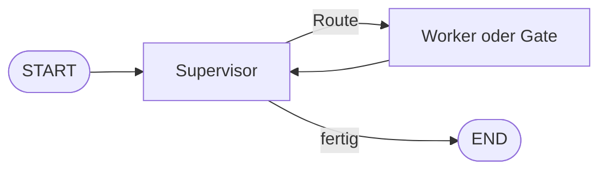

# Graphen aufbauen
{: .no_toc }

> **Kurzleitfaden für den Aufbau verständlicher und robuster StateGraph-Workflows**

Ein LangGraph-Workflow wird nicht primär durch eine große Agentenfunktion
definiert, sondern durch vier sichtbare Bausteine:

- **State** hält den gemeinsamen Arbeitszustand.
- **Nodes** lesen den State und schreiben Teil-Ergebnisse zurück.
- **Edges** verbinden die Nodes.
- **Router** entscheiden bei Conditional Edges über den nächsten Pfad.

## Das Zielbild

Ein Supervisor-Graph hat häufig diese Struktur:



Der Supervisor entscheidet also bedingt. Die Rückkehr vom Worker zum Supervisor
ist dagegen eine feste Kante. Diese Unterscheidung ist der wichtigste Baustein
für eine klare Graph-Definition.

## Der Bauplan in sieben Schritten

### 1. State klein und eindeutig definieren

Der State enthält nur Daten, die mehrere Nodes benötigen oder die für Routing,
Prüfung und Wiederaufnahme relevant sind.

```python
from typing import Literal, TypedDict

from langgraph.graph import END, START, StateGraph


class SupervisorState(TypedDict, total=False):
    query: str
    route: str
    attempts: int
    answer: str
```

### 2. Node-Funktionen fachlich trennen

Eine Node sollte eine erkennbare Verantwortung haben: klassifizieren,
Recherche ausführen, Quellen prüfen, synthetisieren oder kritisieren.

```python
def supervisor_node(state: SupervisorState) -> dict:
    route = "text_worker_node"
    if state.get("attempts", 0) >= 5:
        route = "FINISH"
    return {"route": route, "attempts": state.get("attempts", 0) + 1}


def text_worker_node(state: SupervisorState) -> dict:
    return {"answer": "Antwort aus dem Text-Worker"}
```

### 3. Node-IDs zentral festlegen und registrieren

Die Zeichenketten in `add_node()`, `add_edge()` und
`add_conditional_edges()` müssen exakt übereinstimmen. Ein zentrales Mapping
verhindert, dass Registrierung und Rückkanten auseinanderlaufen:

```python
worker_nodes = {
    "text_worker_node": text_worker_node,
    # weitere Worker und Gates ergänzen
}

supervisor_builder = StateGraph(SupervisorState)
supervisor_builder.add_node("supervisor", supervisor_node)

for node_name, node_function in worker_nodes.items():
    supervisor_builder.add_node(node_name, node_function)
```

Eine reine Liste wie `WORKER_NODES` ist ebenfalls möglich, wenn die Funktionen
bereits separat registriert sind. Das Mapping ist robuster, weil Node-ID und
Funktion gemeinsam gepflegt werden.

### 4. Den Startpunkt explizit verbinden

```python
supervisor_builder.add_edge(START, "supervisor")
```

Ohne diese Kante kennt der Graph den Einstieg in den Supervisor-Workflow nicht.

### 5. Conditional Routing mit expliziter Map definieren

Der Router gibt ausschließlich registrierte Node-IDs oder `END` zurück. Für
Lehrbeispiele wird die erlaubte Route vollständig ausgeschrieben:

```python
def supervisor_router(
    state: SupervisorState,
) -> Literal["text_worker_node", END]:
    return END if state.get("route") == "FINISH" else state["route"]


supervisor_builder.add_conditional_edges(
    "supervisor",
    supervisor_router,
    {
        "text_worker_node": "text_worker_node",
        END: END,
    },
)
```

Die Map ist bei identischen Schlüsseln und Werten technisch nicht zwingend,
wenn der Router direkt Node-Namen zurückgibt. Sie ist trotzdem empfehlenswert:
Sie dokumentiert die erlaubten Pfade und macht sie in der Graph-Visualisierung
eindeutig sichtbar.

Für Produktivcode kann dieselbe Map kompakt abgeleitet werden:

```python
path_map = {name: name for name in worker_nodes} | {END: END}
supervisor_builder.add_conditional_edges(
    "supervisor",
    supervisor_router,
    path_map,
)
```

### 6. Identische Rückwege als feste Kanten bündeln

Wenn alle Worker und Gates nach ihrer Arbeit wieder zum Supervisor zurückkehren,
ist das kein weiteres Routing. Es sind gleichartige feste Kanten und darf daher
per Schleife definiert werden:

```python
for node_name in worker_nodes:
    supervisor_builder.add_edge(node_name, "supervisor")
```

Das gefundene Muster ist also korrekt, sofern jeder Name zuvor mit
`add_node()` registriert wurde.

### 7. Kompilieren, visualisieren und begrenzen

```python
from IPython.display import display

supervisor_agent = supervisor_builder.compile()

result = supervisor_agent.invoke(
    {"query": "Welche Entscheidung wurde getroffen?", "attempts": 0},
    config={"recursion_limit": 15},
)

display(supervisor_agent.get_graph().draw_mermaid_png())
```

Ein State-Zähler wie `attempts` und ein begrenzender `recursion_limit` schützen
zusätzlich vor Endlosschleifen. Beides ersetzt keine korrekte Abbruchroute zu
`END`, sondern ergänzt sie.

## Drei Edge-Arten unterscheiden

| Situation | Geeignetes Muster | Beispiel |
|---|---|---|
| Immer derselbe nächste Schritt | Feste Edge | `add_edge("draft", "review")` |
| Nächster Schritt hängt vom State ab | Conditional Edge | Supervisor → Worker oder `END` |
| Alle Nodes haben denselben Rückweg | Schleife über feste Edges | Worker/Gate → Supervisor |

## `Command` als Alternative

Eine Node kann mit `Command(goto=...)` selbst den nächsten Pfad bestimmen und
gleichzeitig den State aktualisieren. Das ist nützlich, wenn Routing und
State-Update untrennbar zusammengehören.

Für einen zentral entscheidenden Supervisor ist
`add_conditional_edges()` meist verständlicher: Die Routing-Logik bleibt an
einer Stelle sichtbar. Beide Muster sollten nicht ohne bewusste
Architekturentscheidung vermischt werden.

## Häufige Fehler

### Node-Name nicht registriert

```python
builder.add_edge("text_worker", "supervisor")  # falsch, wenn der Node text_worker_node heißt
```

Die Edge muss dieselbe ID verwenden wie `add_node()`.

### `START` oder `END` vergessen

Ein Graph braucht einen expliziten Einstieg und mindestens eine nachvollziehbare
Abbruchroute.

### Implizites Routing im Lehrbeispiel

Ein Router ohne `path_map` kann technisch funktionieren, verschleiert aber die
zulässigen Pfade. Für Lernmaterial und Reviews ist die explizite Map besser.

### Endlosschleifen ohne Schutz

Wenn jeder Worker zum Supervisor zurückkehrt, muss der Supervisor einen
Fortschritt erkennen und bei Erfolg, Fehler oder maximaler Versuchszahl `END`
liefern.

## Kurzregeln

- Verschiedene Routing-Entscheidungen explizit als Conditional Map definieren.
- Identische Rückwege in einer Schleife zusammenfassen.
- Node-IDs zentral und konsistent verwenden.
- `START → supervisor` explizit definieren.
- Router-Rückgaben auf registrierte Node-IDs oder `END` begrenzen.
- State-Zähler und `recursion_limit` gegen Endlosschleifen verwenden.
- Nach `compile()` den Graph visualisieren und die Route-Funktionen separat testen.

## Bezug zu den Kursnotebooks

- [M08 – StateGraph Basics](../../01_notebook/M08_StateGraph_Basics.ipynb)
- [M09 – Conditional Routing](../../01_notebook/M09_Conditional_Routing.ipynb)
- [M19 – Multi-Agent Patterns](../../01_notebook/M19_Multi_Agent_Patterns.ipynb)
- [M20 – Supervisor Pattern](../../01_notebook/M20_Supervisor_Pattern.ipynb)
- [LangGraph Best Practices](./langgraph-best-practices.html)

---

**Stand:** Oktober 2026
