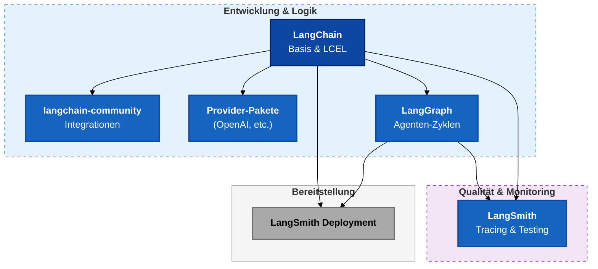

# LangChain-Ökosystem
{: .no_toc }

> **Werkzeuglandkarte für LangChain, LangGraph und LangSmith**

---

## Inhaltsverzeichnis
{: .no_toc .text-delta }

1. TOC
{:toc}

---

## Kurzüberblick

Die Frameworks sind hier zunächst eine Werkzeuglandkarte, damit die spätere Progression im Kurs einordbar bleibt.

Für den Kurs reicht als erste Unterscheidung:

- **LangChain** baut Bausteine: Modellaufrufe, Prompts, Tools, Retriever und einfache Agenten.
- **LangGraph** kontrolliert Abläufe: State, Routing, Schleifen, Unterbrechungen und Wiederaufnahme.
- **LangSmith** macht Verhalten prüfbar: Traces, Evaluation, Regressionen und Qualitätsvergleiche.

Für den Meeting- & Research-Briefing-Agent heißt das: LangChain liefert die Werkzeuge, LangGraph steuert den Arbeitsablauf, LangSmith zeigt, ob Quellen, Tool-Wahl und Eskalation nachvollziehbar funktionieren.

---

## Werkzeuglandkarte

---

## Die Bausteine im Zusammenspiel

| Baustein | Rolle im Ökosystem | Typische Kursfragen |
|---|---|---|
| **LangChain** | Einheitliche Schnittstelle für Modelle, Prompts, Tools, Retriever und einfache Agenten. | Wie rufe ich ein Modell auf? Wie definiere ich Tools? Wie kombiniere ich Schritte mit LCEL? |
| **langchain-community** | Sammlung von Integrationen für Datenquellen, Loader, Vector Stores und externe Dienste. | Wie binde ich ChromaDB, APIs oder Dokumentquellen an? |
| **Provider-Pakete** | Separate Pakete für konkrete Modellanbieter und Dienste, zum Beispiel OpenAI. | Wie wechsle ich Provider, ohne die übrige Logik neu zu schreiben? |
| **LangGraph** | Kontrollschicht für Agenten-Workflows mit State, Routing, Schleifen, Checkpointing und Human-in-the-Loop. | Wann reicht ein einfacher Agent nicht mehr? Wie wird ein Ablauf robust steuerbar? |
| **LangSmith** | Beobachtbarkeit, Debugging, Evaluation und Regressionstests für LLM- und Agenten-Anwendungen. | Warum hat der Agent dieses Tool gewählt? Welche Runs sind besser? Wo entstehen Fehler oder Kosten? |
| **LangSmith Deployment** | Bereitstellung und Betrieb von LangGraph-Anwendungen. | Wie wird aus einem lokalen Graphen eine nutzbare Anwendung? |

---

## Kurslogik

Im Kurs ist LangChain der Einstieg: Erst werden Modellaufrufe, Prompts, strukturierte Ausgaben und Tools verständlich. Danach kommt LangGraph hinzu, sobald ein Agent nicht mehr nur linear reagieren soll, sondern Entscheidungen, Wiederholungen, Memory oder menschliche Freigaben braucht. LangSmith begleitet beide Ebenen, weil Agentenverhalten ohne Traces und Evaluation schwer prüfbar bleibt.

Die praktische Faustregel:

| Wenn du ... | Dann nutze ... |
|---|---|
| ein Modell aufrufst, einen Prompt formatierst oder ein Tool definierst | **LangChain** |
| mehrere Schritte mit State, Routing oder Schleifen kontrollierst | **LangGraph** |
| nachvollziehen willst, was passiert ist und ob es besser wird | **LangSmith** |

---

## Weiterführende Dokumente

- [LangChain]({{ '/05-frameworks/langchain.html' | relative_url }}) für Einstieg und Best Practices zu LangChain.
- [LangGraph]({{ '/05-frameworks/langgraph.html' | relative_url }}) für StateGraph, Routing und robuste Graph-Patterns.
- [LangSmith]({{ '/05-frameworks/langsmith.html' | relative_url }}) für Tracing, Evaluation, Datasets und Monitoring.
- [Cheatsheet]({{ '/05-frameworks/langchain-langgraph-cheatsheet.html' | relative_url }}) als kompakte Arbeitsreferenz.

---

**Stand:** August 2026 
