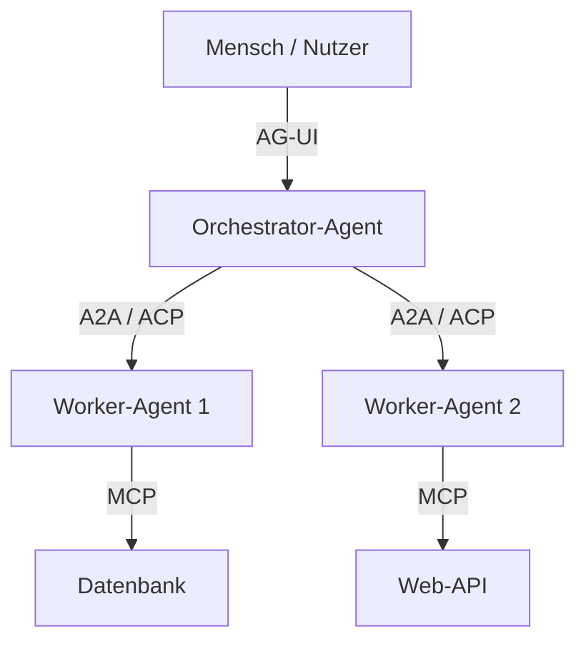
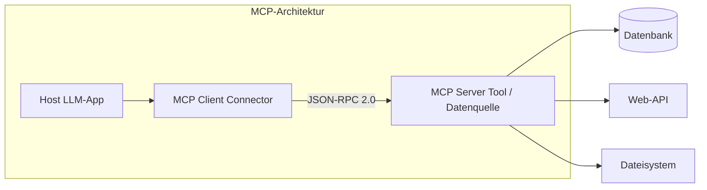
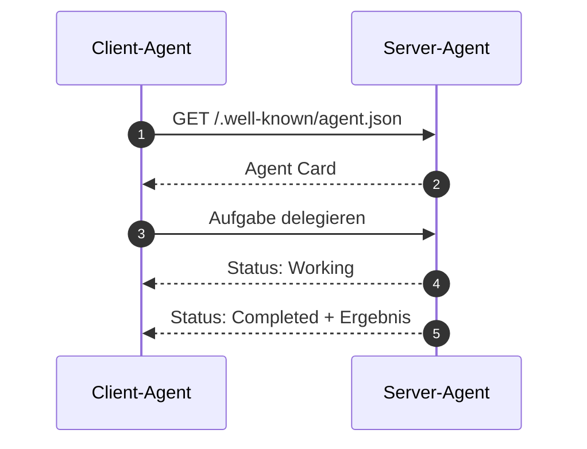
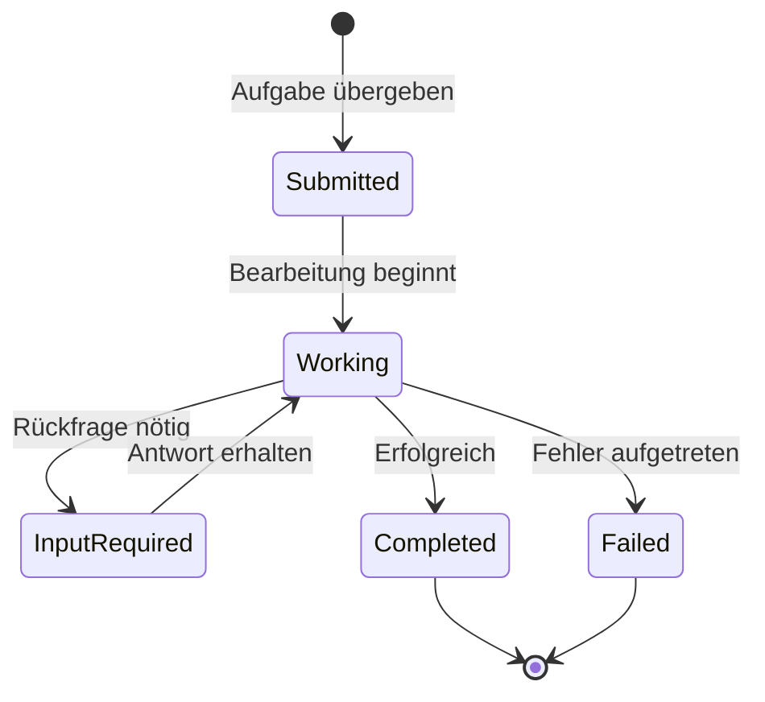
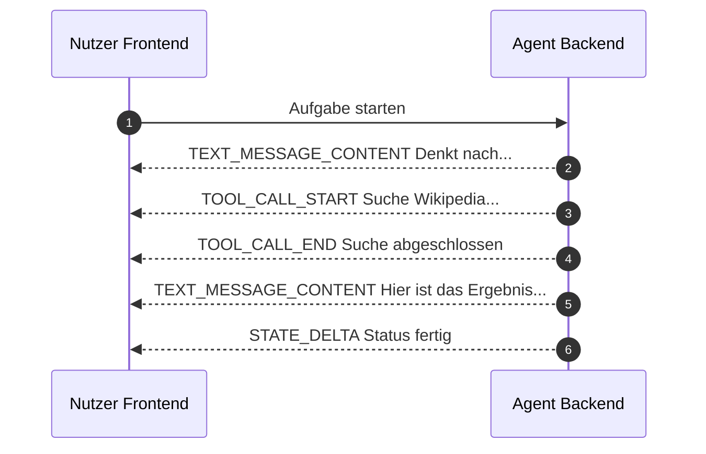
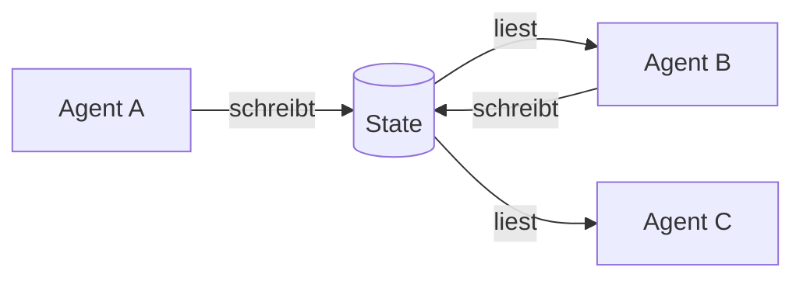
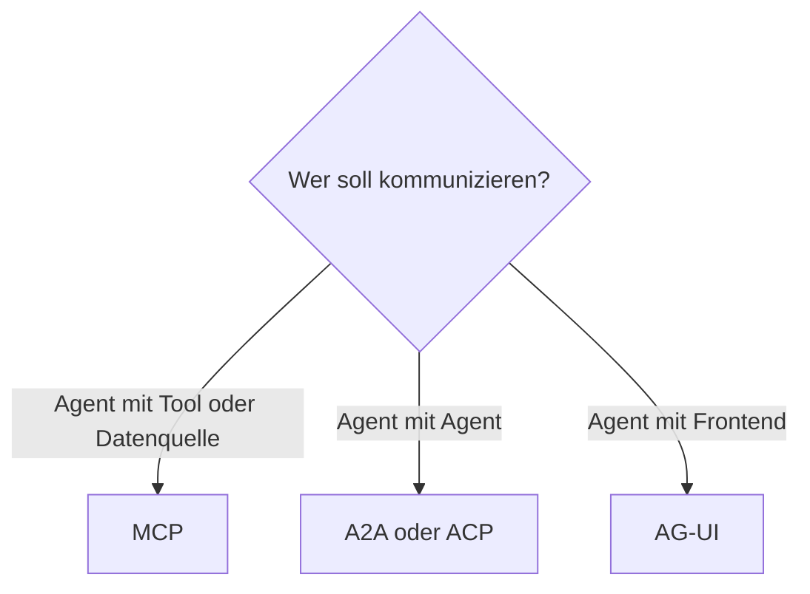
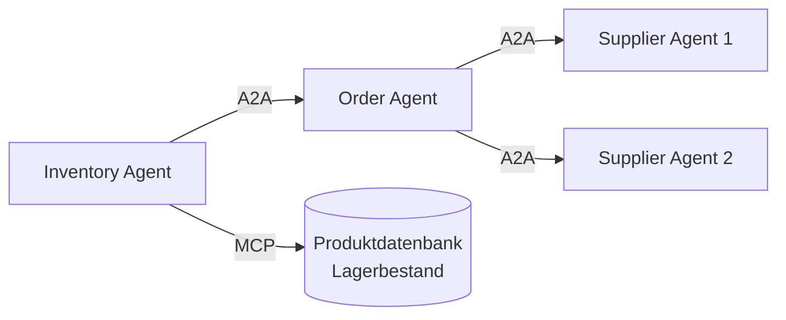
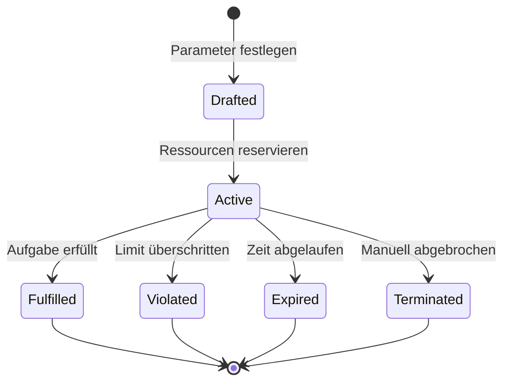

# Kommunikationsprotokolle
{: .no_toc }

> [!NOTE] Kernfrage 
> Wann brauchen Agenten eigene Kommunikationsprotokolle statt direkter Tool-Aufrufe oder gewöhnlicher APIs?

---

# Inhaltsverzeichnis
{: .no_toc .text-delta }

1. TOC
{:toc}

---

## Warum Agenten überhaupt Protokolle brauchen

Ein einzelner Agent kann bereits Texte schreiben, Fragen beantworten oder ein Werkzeug aufrufen. In realen Systemen endet es aber selten bei einem einzigen Modell. Ein Agent holt Daten aus einer Quelle, delegiert Teilaufgaben an andere Agenten und zeigt dem Nutzer parallel den Bearbeitungsstand an. Spätestens dann stellt sich nicht mehr nur die Frage nach dem Prompt, sondern nach einer gemeinsamen Sprache.

Ein Protokoll legt fest, wie Nachrichten aufgebaut sind, welche Bedeutung sie haben und in welcher Reihenfolge sie ausgetauscht werden. Ohne solche Regeln müsste jede Verbindung einzeln entwickelt und gewartet werden. Genau deshalb sind Kommunikationsprotokolle für Agentensysteme kein Spezialthema für fortgeschrittene Teams, sondern eine Grundlage für skalierbare Architektur.

Ein Vergleich mit dem Web hilft: TCP/IP und HTTP haben nicht einzelne Anwendungen intelligent gemacht, sondern ihre Zusammenarbeit verlässlich organisiert. Agentenprotokolle übernehmen heute eine ähnliche Rolle für Systeme, die mit Tools, anderen Agenten und Benutzeroberflächen verbunden werden.

## Ein einfaches Beispiel

Ein Reiseassistent soll eine Anfrage bearbeiten. Ein Agent spricht mit dem Nutzer im Frontend, ein zweiter fragt Flugdaten ab, ein dritter sucht Hotels, und ein Tool greift auf eine Datenbank mit Reiserichtlinien zu. Schon in diesem kleinen Beispiel entstehen mehrere Kommunikationsbeziehungen: Agent mit Mensch, Agent mit Agent und Agent mit Tool.

Genau an diesen Übergängen setzen unterschiedliche Protokolle an. Ein Protokoll wie MCP regelt den Zugriff auf Werkzeuge und Datenquellen. A2A oder ACP regeln die Kommunikation zwischen Agenten. AG-UI beschreibt, wie Fortschritt und Ergebnisse an die Oberfläche zurückfließen. Für Entwickler ist diese Trennung wichtiger als die Detailtiefe einzelner Spezifikationen.

## Drei Kommunikationsebenen

Die Protokoll-Landschaft lässt sich zuerst danach ordnen, wer mit wem spricht. Diese Einteilung ist didaktisch hilfreicher als eine reine Auflistung von Namen, weil sie sofort den praktischen Einsatz sichtbar macht.

| Ebene | Wer kommuniziert? | Typisches Protokoll |
|---|---|---|
| Tool-Integration | Agent mit Werkzeug oder Datenquelle | MCP |
| Agenten-Kooperation | Agent mit Agent | A2A, ACP |
| Nutzer-Interaktion | Agent mit Frontend oder Mensch | AG-UI |

Typischer Fehler: Protokolle als konkurrierende Alternativen zu betrachten. In der Praxis laufen sie meist nebeneinander auf unterschiedlichen Ebenen.

## Ein kurzer historischer Blick

Die Idee einer gemeinsamen Agentensprache ist älter als heutige LLM-Systeme. Bereits in den 1990er Jahren entstanden Protokolle wie KQML und später FIPA-ACL. Beide gingen davon aus, dass Nachrichten mehr sind als rohe Daten. Ein Agent informiert, fragt, delegiert oder fordert etwas an. Das war konzeptionell stark, traf damals aber auf eine Infrastruktur, die für flexible, semantisch reichere Agentensysteme noch nicht bereit war.

Mit großen Sprachmodellen hat sich die Lage verändert. LLMs können strukturierte Nachrichten und Aufgabenbeschreibungen wesentlich robuster interpretieren als frühere regelbasierte Systeme. Deshalb erleben Agentenprotokolle seit 2024 eine neue Relevanz.

| Protokoll | Zeit | Wofür es steht |
|---|---|---|
| KQML | 1990er | Frühe offene Agentensprache |
| FIPA-ACL | ab 1997 | Stärker standardisierte Agentenkommunikation |
| MCP | ab 2024 | Einheitliche Tool- und Datenquellenanbindung |
| A2A | ab 2025 | Offene Agent-zu-Agent-Kommunikation |

## MCP: wenn Agenten mit Tools und Datenquellen sprechen

Das Model Context Protocol dient dazu, Agenten mit externen Werkzeugen, Datenquellen und wiederverwendbaren Prompt-Bausteinen zu verbinden. Der praktische Nutzen liegt weniger in einem einzelnen Tool als in der Vereinheitlichung. Statt jede Integration separat zu bauen, entsteht eine gemeinsame Schnittstelle, über die sehr unterschiedliche Quellen angesprochen werden können.

Für Entwickler reicht zunächst eine einfache Sicht: MCP stellt lesende Zugriffe, ausführbare Aktionen und wiederverwendbare Prompt-Vorlagen bereit. Damit lassen sich viele typische Integrationsfälle sauber abbilden.

| MCP-Typ | Wofür er dient | Beispiel |
|---|---|---|
| Resources | Daten lesen | Dateiinhalt, API-Antwort |
| Tools | Aktionen ausführen | E-Mail senden, Datei schreiben |
| Prompts | Vorlagen wiederverwenden | Analyse- oder Übersetzungsvorlage |

Ein Support-Agent kann etwa ein Tool zur Rechnungserstellung nutzen und zusätzlich eine Resource lesen, die interne Richtlinien enthält. Aus Sicht des Agenten bleibt das Interface gleichförmig, auch wenn intern unterschiedliche Systeme angebunden sind.

## Warum MCP nicht dasselbe ist wie eine REST-API

MCP ersetzt klassische APIs nicht. Viele MCP-Server kapseln intern sogar genau solche APIs. Der Unterschied liegt in der Perspektive. REST ist allgemein für Softwareintegration gedacht. MCP ist darauf ausgelegt, dass ein Agent zur Laufzeit entdecken kann, welche Fähigkeiten verfügbar sind und wie sie genutzt werden.

Dadurch entsteht ein wichtiger Vorteil: Neue Fähigkeiten eines Servers können verfügbar werden, ohne dass auf Agentenseite sofort ein individueller Adapter geschrieben werden muss. Für Agentensysteme ist diese Discovery-Fähigkeit oft wertvoller als die reine Transporttechnik.

In der Praxis relevant, wenn: Viele Tools angebunden werden sollen oder sich Fähigkeiten auf Serverseite ändern, ohne dass der Agent jedes Mal neu entwickelt werden soll.

## Was bei MCP schnell zum Problem wird

Sobald ein Agent Dateisysteme, APIs oder Codeausführung erreichen kann, wird Sicherheit zu einer Architekturfrage. Freigaben, Berechtigungen und Eingabekontrolle sind dann kein Zusatz, sondern Teil des Designs. Besonders heikel wird es, wenn ein Modell über natürliche Sprache dazu gebracht werden soll, auf sensitive Werkzeuge zuzugreifen.

Grenze: Ein einheitliches Protokoll macht Integrationen leichter, aber es macht gefährliche Aktionen nicht automatisch sicher. Explizite Freigaben und klare Tool-Grenzen bleiben notwendig.

## A2A: wenn Agenten mit anderen Agenten sprechen

A2A regelt die Kommunikation zwischen autonomen Agenten. Das zentrale Ziel besteht darin, dass Agenten verschiedener Hersteller oder Frameworks zusammenarbeiten können, ohne dieselbe interne Implementierung zu teilen. Für Entwickler ist vor allem wichtig, dass A2A Aufgabenübergabe strukturiert: Ein Agent beschreibt, was er kann, ein anderer entdeckt diese Fähigkeiten und delegiert dann einen Task.

Eine typische A2A-Interaktion beginnt mit Discovery, setzt Authentifizierung voraus und geht danach in die eigentliche Aufgabenkommunikation über.

| Phase | Was passiert | Wichtiger Baustein |
|---|---|---|
| Discovery | Ein Agent findet den anderen und liest seine Fähigkeiten | Agent Card |
| Authentication | Der anfragende Agent weist sich aus | Security Scheme |
| Communication | Eine Aufgabe wird delegiert und bearbeitet | JSON-RPC über HTTPS |

Ein Reiseagent kann auf diese Weise einen Hotelagenten finden, seine Fähigkeiten lesen und eine klar definierte Aufgabe delegieren, ohne dessen internes Memory, Tooling oder proprietäre Entscheidungslogik zu kennen.

## Agent Cards und Task-Lebenszyklus

Agent Cards sind maschinenlesbare Selbstbeschreibungen. Darin steht, welche Formate unterstützt werden, wie ein Agent erreicht wird und welche Sicherheitsanforderungen gelten. Damit wird ein Agent in gewisser Weise auffindbar und ansprechbar wie ein Web-Service.

Nach der Übergabe einer Aufgabe bleibt die Kommunikation oft asynchron. Das ist wichtig, weil viele Agentenaufgaben nicht in einem einzelnen Request-Response-Schritt enden. Eine Aufgabe kann in Bearbeitung sein, Rückfragen auslösen, scheitern oder erfolgreich ein Ergebnis liefern.

Nicht geeignet, wenn: Die Aufgabe so klein und synchron ist, dass eine einfache API oder ein direkter Tool-Aufruf ausreicht. Dann wäre A2A oft unnötig schwergewichtig.

## Artifacts: warum Ergebnisse mehr sein müssen als Text

Ein wichtiger Gedanke in A2A ist, dass das Ergebnis einer Aufgabe nicht nur ein Textstring sein sollte. Ein Ergebnis kann ein Dokument, strukturierte Daten oder ein Bild sein. Genau deshalb spricht A2A von Artifacts. Diese sind leichter weiterzuverarbeiten, etwa als Eingabe für den nächsten Agenten in einer Kette.

| Artifact-Typ | Beispiel |
|---|---|
| Dokument | Report als Markdown oder PDF |
| Strukturierte Daten | JSON mit Such- oder Analyseergebnissen |
| Bild | Diagramm, Screenshot, Visualisierung |

Für Entwickler ist daran vor allem eines wichtig: Sobald Agenten arbeitsteilig zusammenarbeiten, müssen Ergebnisse nicht nur lesbar, sondern anschlussfähig sein.

## ACP: wenn Agenten über klassisches HTTP sprechen sollen

ACP verfolgt einen pragmatischen Ansatz und nutzt konsequent REST und Standard-HTTP. Dadurch wirkt es für viele Entwickler vertrauter als stärker spezialisierte Agentenprotokolle. Wer bereits mit cURL, Postman oder Web-APIs gearbeitet hat, erkennt viele Muster sofort wieder.

| Merkmal | Bedeutung in der Praxis |
|---|---|
| REST-basiert | Integration mit gewöhnlichen HTTP-Clients |
| Kein SDK-Zwang | Einfache Tests und schnelle Prototypen |
| Multimodal | Nicht nur Text, sondern auch Audio oder Bilder |
| Zustandsbehaftet | Mehrteilige Gespräche über Sessions |

ACP ist deshalb interessant, weil es die Hürde für Agentenkommunikation senkt. Gerade in bestehenden Unternehmenslandschaften kann das ein Vorteil sein, wenn bereits viel Infrastruktur auf klassischem HTTP aufbaut.

## ACP und A2A ergänzen sich

ACP und A2A stehen nicht zwingend in Konkurrenz. A2A betont stärker Discovery, Aufgabensteuerung und standardisierte Agentenrollen. ACP bringt die Nähe zur gewohnten REST-Welt ein. In realen Systemen können genau diese Eigenschaften zusammen sinnvoll sein.

Typischer Fehler: Zu fragen, welches der beiden Protokolle „gewinnt“. Die sinnvollere Frage lautet meist, ob eher offene Agentenkoordination oder eher einfache HTTP-Integration im Vordergrund steht.

## AG-UI: wenn der Nutzer sehen soll, was der Agent gerade tut

AG-UI betrifft nicht die Kommunikation zwischen Agenten, sondern zwischen Agenten-Backend und Benutzeroberfläche. Diese Ebene wird oft unterschätzt. Gerade agentische Aufgaben dauern länger als eine einfache Chatantwort. Nutzer wollen deshalb nicht nur das Endergebnis sehen, sondern auch Fortschritt, Tool-Nutzung oder Zwischenstände.

AG-UI arbeitet dafür mit Ereignissen. Text, Tool-Starts, Tool-Enden und Zustandsänderungen werden gestreamt, statt erst am Ende gesammelt zurückzukehren. Für eine Benutzeroberfläche ist das oft der Unterschied zwischen „System wirkt eingefroren“ und „System wirkt nachvollziehbar“.

| Event | Was im Frontend sichtbar wird |
|---|---|
| `TEXT_MESSAGE_CONTENT` | laufender Text oder Zwischenausgabe |
| `TOOL_CALL_START` | ein Werkzeug wird gerade verwendet |
| `TOOL_CALL_END` | das Werkzeug ist fertig |
| `STATE_DELTA` | der sichtbare Zustand ändert sich |

In der Praxis relevant, wenn: Agenten mehrere Sekunden oder Minuten arbeiten und Nutzer den Bearbeitungsfortschritt verstehen sollen.

## Frameworks lösen Kommunikation teils intern anders

Nicht jedes Framework nutzt für interne Zusammenarbeit sofort ein offenes Protokoll. LangGraph arbeitet häufig mit einem geteilten State, in den Knoten lesen und schreiben. AutoGen kennt eher direkte Nachrichten und Broadcast-Muster. Das ist wichtig, weil offene Protokolle und interne Framework-Mechanismen unterschiedliche Ebenen adressieren.

Ein LangGraph-System kann intern also über State kommunizieren und nach außen trotzdem MCP oder A2A einsetzen. Diese Ebenen widersprechen sich nicht.

## Wann welches Protokoll naheliegt

Für Entwickler hilft eine einfache Auswahlfrage: Geht es um Tool-Zugriff, um Agentenkoordination oder um Nutzeroberflächen? Meist ist damit schon ein Großteil der Auswahl geklärt.

| Protokoll | Wofür es zuerst taugt | Stärke |
|---|---|---|
| MCP | Tool- und Datenquellenanbindung | Einheitliche Agent-Tool-Schnittstelle |
| A2A | verteilte Agentenaufgaben | strukturierte Agentenkooperation |
| ACP | Agentenkommunikation über HTTP | einfache Integration in Web-Infrastruktur |
| AG-UI | Fortschrittsanzeige im Frontend | Streaming und Transparenz |

## Wie MCP und A2A zusammenwirken

MCP und A2A lösen unterschiedliche Probleme und treten deshalb in guten Systemen oft gemeinsam auf. Ein Agent liest etwa per MCP Daten aus einer Datenbank oder ruft ein internes Tool auf. Wenn daraus eine größere Folgeaufgabe entsteht, delegiert er diese per A2A an einen spezialisierten Agenten.

Ein solches Beispiel zeigt die eigentliche Architekturidee: MCP gibt Agenten Zugriff auf Kontext und Werkzeuge. A2A gibt ihnen Kollegen.

## Ressourcensteuerung bleibt auch bei Protokollen wichtig

Sobald Agenten autonom Aufgaben annehmen und weiterreichen, stellt sich eine betriebliche Frage: Wer begrenzt Laufzeit, Budget und Erfolgsbedingungen? Hier setzt die Idee der Agent Contracts an. Gemeint ist ein formaler Rahmen, der Eingaben, Ergebnisse, Zeitgrenzen und Ressourcenlimits festlegt.

Für den Kurs genügt die Grundidee: Offene Kommunikation braucht immer auch Grenzen. Sonst entstehen Endlosschleifen, unklare Verantwortlichkeiten oder ausufernde Kosten.

## Was für Entwickler zuerst wichtig ist

Nicht jedes Projekt braucht sofort alle hier genannten Protokolle. Für viele erste Agentensysteme reicht eine einfache Kombination: MCP für Tools, gegebenenfalls A2A oder ACP für klar abgegrenzte Delegation und AG-UI nur dann, wenn ein eigenes Frontend längere Prozesse sichtbar machen soll.

Entwickler unterschätzen oft, dass Protokolle vor allem dann wertvoll werden, wenn ein System wächst. Solange nur ein Agent lokal mit einem einzigen Tool arbeitet, kann vieles noch implizit bleiben. Sobald mehrere Agenten, externe Dienste und Nutzeroberflächen zusammenspielen, wird ohne klare Kommunikationsregeln jedes neue Element überproportional teuer.

## Abgrenzung zu verwandten Dokumenten

| Dokument | Frage |
|---|---|
| [Multi-Agent-Systeme]({{ '/05-multi-agent-erweiterungen/multi-agent-systeme.html' | relative_url }}) | Wie arbeiten mehrere Agenten organisatorisch zusammen, unabhängig vom konkreten Protokoll? |
| [Agenten-Sicherheit]({{ '/06-qualitaet-sicherheit/agent-security.html' | relative_url }}) | Welche Sicherheitsrisiken entstehen durch offene Schnittstellen, Tool-Zugriffe und externe Agenten? |
| [Skills]({{ '/05-multi-agent-erweiterungen/skills.html' | relative_url }}) | Wann reichen lokale, wiederverwendbare Arbeitsrezepte statt offener Protokollschnittstellen? |

---

**Version:** 1.2 
**Stand:** Mai 2026 
**Kurs:** KI-Agenten. Verstehen. Anwenden. Gestalten.

