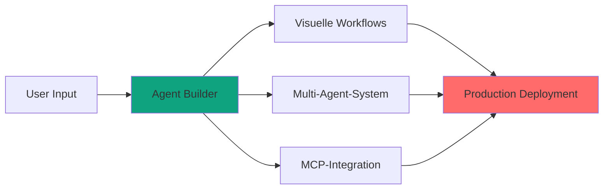
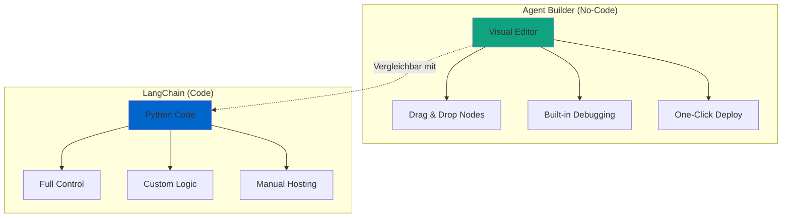
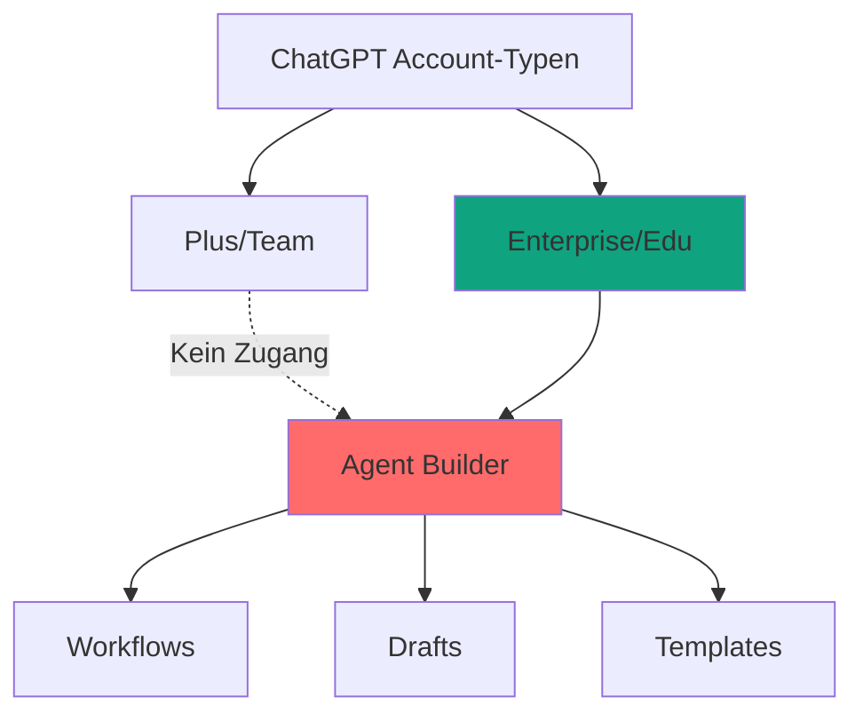
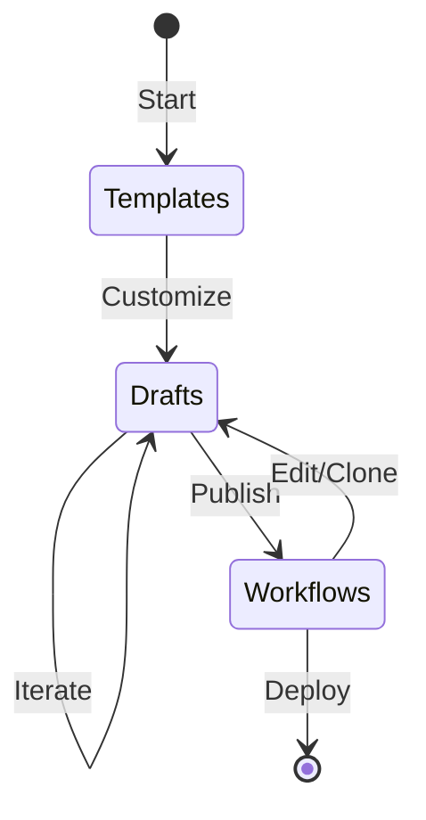
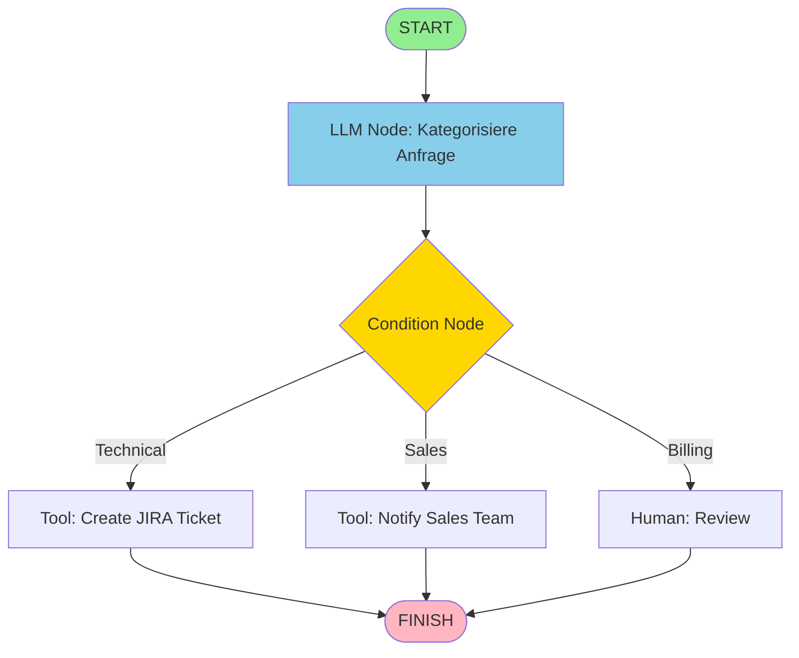
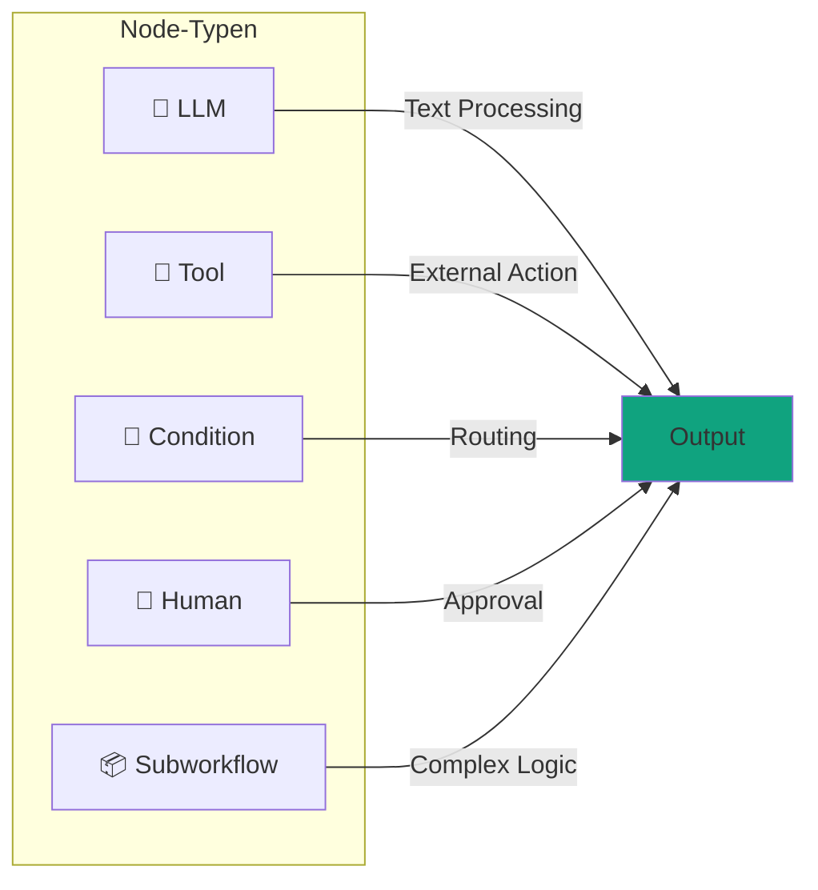
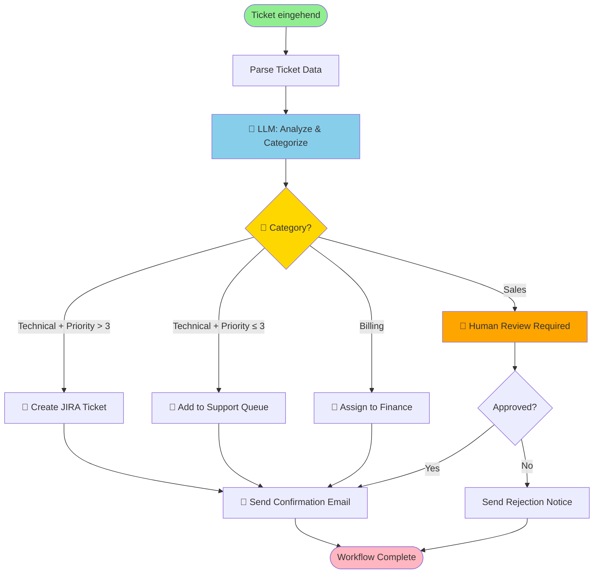

# Agent Builder
{: .no_toc }

> **Agenten ohne Code: Visuelle Workflow-Erstellung mit OpenAI Agent Builder**<br>
---

# Inhaltsverzeichnis
{: .no_toc .text-delta }

1. TOC
{:toc}

---

## Kurzüberblick: Was ist OpenAI Agent Builder?

Während LangChain ein Code-basiertes Framework für KI-Agenten ist, ermöglicht **OpenAI Agent Builder** die No-Code-Erstellung komplexer Agent-Workflows durch eine visuelle Drag-and-Drop-Oberfläche.

> [!NOTE] Einordnung<br>
> Agent Builder ist stark für schnelle Workflow-Entwicklung, ersetzt aber nicht in jedem Fall codebasierte Feinsteuerung.
> **Grenzen:** Nur OpenAI-Modelle, kein On-Premise-Deployment, eingeschränkte Code-Kontrolle (nur Export).

**Zentrale Fragen des Werkzeugs:**

- **Wie erstelle ich komplexe Workflows ohne Programmierung?**
- **Wie orchestriere ich mehrere spezialisierte Agenten?**
- **Wie integriere ich externe Systeme (APIs, Datenbanken) visuell?**
- **Wie deploye ich produktionsreife Agenten mit Versionierung und Monitoring?**



### Kernfunktionen

Der **Agent Builder** (Teil von AgentKit, vorgestellt DevDay 2025) bietet:

- **Visuelle Workflow-Erstellung** – Drag-and-Drop für komplexe Abläufe
- **Bedingte Logik** – "Wenn-Dann"-Verzweigungen zwischen Aktionen
- **Multi-Agent-Koordination** – mehrere spezialisierte Agenten orchestrieren
- **Model Context Protocol (MCP)** – Integration von 100+ Services
- **Versioning & Preview** – Workflow-Versionierung und Test-Läufe
- **Code-Export** – TypeScript/Python-Export für weitere Anpassungen

**Vergleich zu Code-basierten Frameworks:**


---

## Agent Builder: Zugang und Interface

### Voraussetzungen

- **ChatGPT Enterprise** oder **Edu** Account
- Organisation mit Admin Console
- Zugang über [platform.openai.com/agent-builder](https://platform.openai.com/agent-builder)

> [!WARNING] Zugriffsvoraussetzung<br>
> Ohne Enterprise/Edu-Zugang ist der Funktionsumfang im Teamkontext eingeschränkt oder nicht verfügbar. **Plus/Team**-Accounts erhalten keinen Zugriff auf den Agent Builder — nur **Enterprise** und **Edu**-Accounts haben vollen Zugang.



### Interface-Bereiche

Das Agent Builder Interface ist in drei Hauptbereiche unterteilt:

| Bereich | Funktion | Nutzung |
|---------|----------|---------|
| **Workflows** | Veröffentlichte, produktive Agenten | Production-Deployment |
| **Drafts** | Entwürfe in Bearbeitung | Entwicklung & Testing |
| **Templates** | Vorkonfigurierte Beispiele | Schneller Start |



---

## Workflow-Konzept: Nodes und Edges

Agent Builder arbeitet mit einem gerichteten Graphen aus **Nodes** (Aktionen) und **Edges** (Verbindungen).

### Grundlegende Architektur



### Node-Typen im Detail

> [!TIP] Modellierungsregel<br>
> Sinnvoll sind fachlich eng geschnittene Nodes und klar benannte Subworkflows.
> **Anti-Pattern:** Ein einzelner LLM-Node, der Kategorisierung, Priorität, Routing und E-Mail-Text gleichzeitig erzeugt. Das ist schwer zu debuggen und kaum wiederverwendbar.

| Node-Typ | Symbol | Funktion | Beispiel |
|----------|--------|----------|----------|
| **LLM** | 🤖 | Modell-Aufruf mit Prompt | Text-Klassifikation, Zusammenfassung |
| **Tool** | 🔧 | API-Call oder MCP-Server | Datenbank-Query, E-Mail senden |
| **Condition** | 🔀 | Verzweigung basierend auf Daten | "Wenn Priority > 3, dann..." |
| **Human** | 👤 | Human-in-the-Loop Checkpoint | Genehmigung einholen |
| **Subworkflow** | 📦 | Verschachtelung anderer Workflows | Wiederverwendbare Sub-Prozesse |



---

## Praxis-Beispiel: Support-Ticket-Routing

### Szenario

Eingehende Support-Tickets sollen automatisch kategorisiert, priorisiert und an die richtige Abteilung weitergeleitet werden.

**Anforderungen:**
- Automatische Kategorisierung (Technical, Billing, Sales)
- Prioritäts-Bewertung (1-5)
- Bedingte Weiterleitung
- Bestätigungs-E-Mail an Kunden

### Workflow-Diagramm



### Node-Konfiguration

**LLM Node: "Analyze & Categorize"**
```yaml
Node Type: LLM
Model: gpt-4
Temperature: 0.0

System Prompt: |
  Du bist ein Support-Ticket-Klassifizierer.

  Analysiere das Ticket und gib zurück:
  - category: "technical" | "billing" | "sales"
  - priority: 1-5 (1=niedrig, 5=kritisch)
  - summary: Kurze Zusammenfassung in einem Satz

  Bewerte Priority basierend auf:
  - Dringlichkeit der Sprache
  - Business-Impact
  - Ob es einen Blocker ist

Input: {ticket_text}
Output: JSON {category, priority, summary}
```

**Condition Node: "Category Router"**
```yaml
Node Type: Condition

Branches:
  - IF: output.category == "technical" AND output.priority > 3
    THEN: goto "Create JIRA Ticket"

  - IF: output.category == "technical" AND output.priority <= 3
    THEN: goto "Add to Support Queue"

  - IF: output.category == "billing"
    THEN: goto "Assign to Finance"

  - IF: output.category == "sales"
    THEN: goto "Human Review Required"
```

**Tool Node: "Create JIRA Ticket"**

**Tool Node: "Send Confirmation Email"**

### Vorteile dieser Architektur

> [!SUCCESS] Betriebsvorteil       
> Klare Node/Edge-Strukturen verbessern Nachvollziehbarkeit, Übergaben im Team und Debugging in Produktion.

| Vorteil | Beschreibung |
|---------|--------------|
| **Multi-Step-Logik** | Mehrere LLM-Calls orchestrieren |
| **Conditional Branching** | Verschiedene Pfade je nach Kontext |
| **State Management** | Workflow-Status persistent speichern |
| **Error Handling** | Fallback-Strategien für fehlgeschlagene Steps |
| **Human-in-Loop** | Manuelle Review bei unsicheren Fällen |
| **Observability** | Jeder Step wird geloggt und kann debugged werden |

---

## Model Context Protocol (MCP)

MCP verbindet Agent Builder mit 100+ externen Systemen durch standardisierte Server-Integrationen.

> [!TIP] Integrationsstrategie<br>
> Sinnvoll ist ein Start mit ein bis zwei geschäftskritischen MCP-Integrationen. Erst nach stabilen End-to-End-Tests sollte die Fläche erweitert werden.
> **Anti-Pattern:** Alle verfügbaren MCP-Server auf einmal einbinden — jeder Server ist eine potenzielle Fehlerquelle und erhöht die Testfläche erheblich.

### MCP-Architektur


### Verfügbare MCP-Server (Auswahl)

| Kategorie | MCP-Server | Funktionen |
|-----------|------------|------------|
| **Code & Dev** | GitHub, GitLab | Issues, PRs, Code-Suche |
| **Kommunikation** | Slack, Discord | Nachrichten, Channels |
| **Dokumente** | Google Drive, Notion | Dokumente, Datenbanken |
| **Datenbanken** | PostgreSQL, MongoDB | Queries, CRUD-Operationen |
| **CRM** | Salesforce, HubSpot | Leads, Contacts, Deals |
| **Custom** | Your MCP Server | Beliebige APIs |

### Integration in Agent Builder

**Schritt-für-Schritt:**


**Beispiel: GitHub-Integration**


**Nutzung im Workflow:**


### Custom MCP Server erstellen

Falls kein passender MCP-Server existiert, lässt sich ein eigener Server erstellen:


**Integration in Agent Builder:**
1. Deploy MCP Server (z.B. auf Railway, Fly.io)
2. Agent Builder → Connector Registry → Add Custom MCP Server
3. URL + Auth konfigurieren
4. In Workflows als Tool Node nutzen

---

## Entscheidungshilfe: Agent Builder vs. Code-basierte Frameworks

> [!NOTE] Entscheidungsheuristik<br>
> **Agent Builder** → Governance, schnelles Prototyping, kein Coding erforderlich.
> **LangChain** → volle Code-Kontrolle, Multi-Provider-Support, On-Premise-Deployment.

### Vergleichsmatrix


| Anforderung | Agent Builder | LangChain |
|-------------|---------------|-----------|
| **Kein Coding erforderlich** | ✅ | ❌ |
| **Schnelles Prototyping** | ✅ | ⚠️ |
| **Multi-Step-Workflows** | ✅ | ✅ |
| **Conditional Logic** | ✅ | ✅ |
| **Volle Code-Kontrolle** | ⚠️* | ✅ |
| **On-Premise Deployment** | ❌ | ✅ |
| **Multi-Modell (OpenAI + Anthropic)** | ❌ | ✅ |
| **Built-in Versionierung** | ✅ | ❌ |
| **Built-in Monitoring** | ✅ | ⚠️** |
| **MCP-Integration** | ✅ Native | ⚠️ Custom |
| **Kosten (Development)** | Niedrig | Mittel |
| **Learning Curve** | Niedrig | Mittel |

*Code-Export möglich, aber limitiert
**Mit LangSmith möglich

### Use Cases nach Tool

**Agent Builder eignet sich für:**


**LangChain eignet sich für:**

- **Custom Tools** – Spezielle Python-Funktionen als Tools
- **Multi-Provider** – OpenAI + Anthropic + Google
- **On-Premise** – Volle Kontrolle über Deployment
- **RAG-Systeme** – Custom Retriever, Reranking
- **Komplexe Workflows** – Viele bedingte Verzweigungen
- **Multi-Agent-Systeme** – Koordination mehrerer Agents

---

## Code-Export und Migration zu LangChain

Agent Builder erlaubt Export von Workflows als TypeScript oder Python-Code für weitere Anpassungen.

### Export-Workflow


### Wann ist eine Migration zu LangChain sinnvoll?

https://platform.openai.com/agent-builder
**Migrations-Checkliste:**

- ✅ Multi-Provider-Support benötigt? → LangChain
- ✅ On-Premise Deployment erforderlich? → LangChain
- ✅ Custom Python-Tools notwendig? → LangChain
- ❌ Visual Workflows ausreichend? → Agent Builder
- ❌ Team hat keine Coding-Kenntnisse? → Agent Builder
- ❌ Enterprise Governance wichtig? → Agent Builder

---

## Sicherheit und Governance im Agent Builder

> [!WARNING] Produktionsgrenze<br>
> Vor produktivem Einsatz sind Rechte, Datenzugriffe, Auditierbarkeit und Freigabeprozesse verbindlich zu definieren.

### Sicherheits-Architektur

https://platform.openai.com/agent-builder
### Enterprise-Kontrollen

| Feature | Beschreibung | Best Practice |
|---------|--------------|---------------|
| **RBAC** | Wer darf Workflows editieren/ausführen? | Least Privilege Principle |
| **Audit Logs** | Nachvollziehbarkeit aller Ausführungen | Retention Policy definieren |
| **Data Residency** | Wo werden Daten gespeichert? | EU/US-Region wählen |
| **Versioning** | Rollback zu früheren Versionen | Semantic Versioning nutzen |
| **Secrets Management** | API-Keys, Tokens sicher speichern | Nie hardcoded! |
| **Input Validation** | User-Input validieren | Prompt Injection Prevention |

### Best Practices für sichere Workflows

**1. Secrets Management:**

https://platform.openai.com/agent-builder
**2. Input Validation:**

https://platform.openai.com/agent-builder
**3. Least Privilege für MCP-Server:**

https://platform.openai.com/agent-builder
**4. Audit Trail:**

https://platform.openai.com/agent-builder
### Compliance und Datenschutz

**DSGVO-Konforme Workflows:**

https://platform.openai.com/agent-builder
**Data Retention Policy:**

https://platform.openai.com/agent-builder
---

## Debugging und Monitoring

### Built-in Debugging Tools

Agent Builder bietet native Debugging-Features, die Code-basierte Workflows oft manuell implementieren müssen.

https://platform.openai.com/agent-builder
**Debug-Features:**

| Feature | Beschreibung | Nutzung |
|---------|--------------|---------|
| **Step-by-Step** | Workflow Schritt für Schritt ausführen | Fehlersuche in komplexen Workflows |
| **Node Inspection** | Outputs jedes Nodes anzeigen | Daten-Transformation prüfen |
| **Breakpoints** | Execution an bestimmten Nodes pausieren | Zustand vor kritischen Steps prüfen |
| **Replay** | Vergangene Executions wiederholen | Bug-Reproduktion |
| **Logs** | Strukturierte Logs für jeden Step | Post-Mortem-Analyse |

### Monitoring Dashboard

https://platform.openai.com/agent-builder
**Monitoring-Metriken:**


### Error Handling und Fallbacks


**Fallback-Konfiguration:**


---

## Zusammenfassung und Lernpfad

### Agent Builder im Überblick

```mermaid
graph TB
    A[ChatGPT Account-Typen] --> B[Plus/Team]
    A --> C[Enterprise/Edu]
    B -.Kein Zugang.-> D[Agent Builder]
    C --> D
    D --> E[Workflows]
    D --> F[Drafts]
    D --> G[Templates]

    style C fill:#10a37f
    style D fill:#ff6b6b
```
### Kernkonzepte

| Konzept | Beschreibung |
|---------|--------------|
| **Nodes** | Workflow-Bausteine (LLM, Tool, Condition) |
| **Edges** | Verbindungen zwischen Nodes |
| **MCP** | Standardisierte Service-Integration |
| **Workflow** | Kompletter Agent als Graph |
| **Versioning** | Built-in Workflow-Versionierung |

### Wann Agent Builder nutzen?

```mermaid
graph TB
    A[ChatGPT Account-Typen] --> B[Plus/Team]
    A --> C[Enterprise/Edu]
    B -.Kein Zugang.-> D[Agent Builder]
    C --> D
    D --> E[Workflows]
    D --> F[Drafts]
    D --> G[Templates]

    style C fill:#10a37f
    style D fill:#ff6b6b
```
**Entscheidungsbaum:**

- ✅ **Agent Builder nutzen, wenn:**
  - Team hat keine/wenige Coding-Kenntnisse
  - Schnelles Prototyping wichtig
  - Enterprise Governance erforderlich
  - MCP-Server ausreichend für Integration
  - OpenAI-Modelle ausreichend

- ✅ **LangChain nutzen, wenn:**
  - Volle Code-Kontrolle erforderlich
  - Multi-Provider-Support nötig (OpenAI + Anthropic + etc.)
  - On-Premise Deployment erforderlich
  - Custom Python-Tools notwendig

### Nächste Schritte

```mermaid
graph TB
    A[ChatGPT Account-Typen] --> B[Plus/Team]
    A --> C[Enterprise/Edu]
    B -.Kein Zugang.-> D[Agent Builder]
    C --> D
    D --> E[Workflows]
    D --> F[Drafts]
    D --> G[Templates]

    style C fill:#10a37f
    style D fill:#ff6b6b
```
**Ressourcen:**

- **Offizielle Docs:** [Agent Builder Guide](https://platform.openai.com/docs/guides/agent-builder)
- **MCP Registry:** [modelcontextprotocol.io/registry](https://modelcontextprotocol.io/registry)
- **Community:** [OpenAI Developer Forum](https://community.openai.com/)
- **Vergleich:** [AgentKit vs. GPTs Guide](https://platform.openai.com/docs/guides/agent-builder)

## Quellen

- [OpenAI Agent Builder Dokumentation](https://platform.openai.com/docs/guides/agent-builder)
- [OpenAI AgentKit Dokumentation](https://platform.openai.com/docs/agentkit)
- [Model Context Protocol](https://modelcontextprotocol.io/)
- [LangChain Documentation](https://python.langchain.com/docs/)

## Abgrenzung zu verwandten Dokumenten

| Dokument | Frage |
|---|---|
| [Erste Agenten]({{ '/04-agenten-implementierung/' | relative_url }}) | Wo starte ich als Einsteiger mit Agent Builder? |
| [Qualität und Sicherheit]({{ '/07-qualitaet-sicherheit/' | relative_url }}) | Welche Produktionsstandards gelten für Agent Builder? |

---

**Version:**    2.0<br>
**Stand:** Mai 2026<br>
**Kurs:** KI-Agenten. Verstehen. Anwenden. Gestalten.


