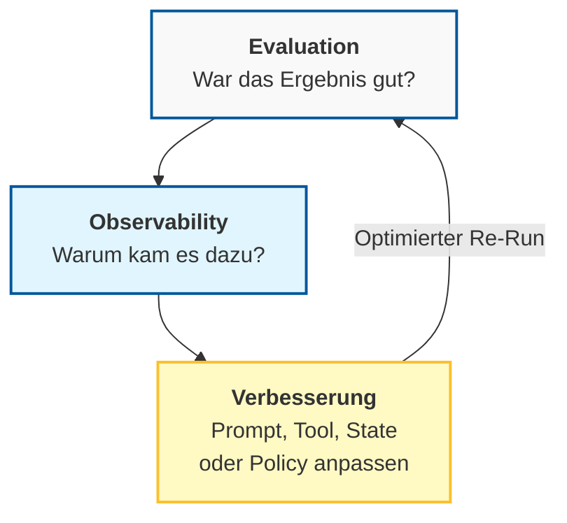
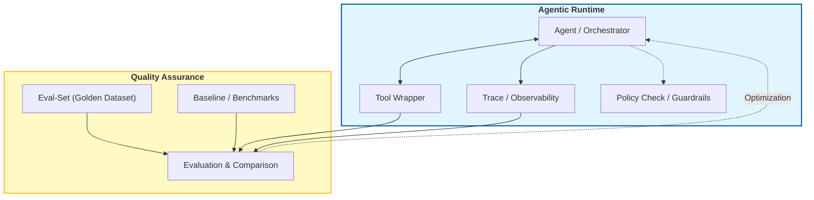
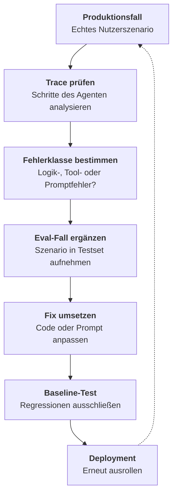

# Evaluation & Observability: Best Practices
{: .no_toc }

> **Gute Agenten brauchen nicht nur gute Antworten, sondern auch sichtbare Fehler, vergleichbare Tests und kontrollierte Weiterentwicklung.**

---

# Inhaltsverzeichnis
{: .no_toc .text-delta }

1. TOC
{:toc}

---

## Worum es hier geht

Diese Seite ergänzt die Konzeptseite [Woher zeigt sich, ob ein Agent gut arbeitet?]({{ '/07-qualitaet-sicherheit/evaluation-observability.html' | relative_url }}). Dort geht es um die Grundidee. Hier geht es um die Umsetzung im Kurs: Was wird immer gemessen? Was muss im Trace sichtbar sein? Und wie verhindert man, dass eine scheinbare Verbesserung an anderer Stelle neue Fehler erzeugt?

Die Seite richtet sich an Teilnehmende, die bereits einfache Agenten mit Tools, LangGraph oder LangSmith bauen. Es geht nicht um vollständige Produktionsarchitektur, sondern um einen belastbaren Mindeststandard.

Typischer Fehler: Nur auf die Endantwort zu schauen. Ein Agent kann gut klingen und trotzdem das falsche Tool gewählt, eine unnötige Schleife gedreht oder eine riskante Aktion ohne ausreichende Kontrolle ausgelöst haben.

## Evaluation und Observability: die Arbeitsaufteilung

Evaluation und Observability gehören zusammen, haben aber unterschiedliche Aufgaben. Evaluation prüft, ob ein Agent unter definierten Bedingungen gute Ergebnisse liefert. In produktionsnahen Agenten ist Evaluation zusätzlich ein Gate: Der nächste Schritt, eine Freigabe oder ein Release erfolgt nur, wenn Qualität, Tool-Wahl, Kosten, Latenz und Sicherheitsgrenzen passen. Observability zeigt, warum ein Durchlauf gut, schlecht, teuer oder instabil war.

Für Einsteiger hilft eine einfache Unterscheidung. Evaluation ist der geplante Qualitätscheck gegen bekannte Fälle. Observability ist der Blick in den echten Ablauf mit Traces, Tool-Aufrufen, Latenzen und Fehlern. Erst beides zusammen ergibt ein belastbares Bild.



Nicht geeignet, wenn: Eine einzige Metrik alles erklären soll. Agenten verhalten sich zu komplex, um nur mit Accuracy oder nur mit Laufzeit bewertet zu werden.

## Was immer gemessen wird

Nicht jedes Projekt braucht dieselben Detailmetriken. Einige Fragen gehören aber fast immer dazu. Wurde das eigentliche Ziel erreicht? Wurde das richtige Tool korrekt eingesetzt? Wurde bei riskanten Fällen korrekt eskaliert? Wie teuer und wie langsam war die erfolgreiche Lösung? Bleibt das Verhalten stabil, wenn Eingaben leicht verändert werden?

Für den Kurs reichen meist fünf Kernmetriken:

| Metrik | Zeigt | Warum sie wichtig ist |
|---|---|---|
| Task Success | Aufgabe wurde wirklich gelöst | Gute Formulierung allein reicht nicht |
| Tool Success | passendes Tool korrekt genutzt | Agenten scheitern oft hier statt in der Antwort |
| Safety / Escalation | riskante Fälle richtig behandelt | schützt vor stillen Fehlentscheidungen |
| Security Events | Angriffs- oder Policy-Signale erkannt | macht Prompt Injection, Tool-Missbrauch und Exfiltration messbar |
| Latenz | Antwort kommt rechtzeitig | wichtig für Nutzererlebnis und Schleifen |
| Kosten pro erfolgreicher Lösung | Aufwand pro gelöstem Fall | zeigt Effizienz realistischer als reine Session-Kosten |

In der Praxis relevant, wenn: Zwei Varianten ähnlich gut wirken, aber eine davon deutlich teurer, langsamer, unsicherer oder instabiler ist. Ein Gate sollte dann deterministisch stoppen, nachtesten oder eskalieren, statt den Lauf trotz verletzter Grenze fortzusetzen.

## Ein kleines Evaluationsset reicht am Anfang

Ein belastbarer Einstieg braucht kein riesiges Dataset. Für viele Kursbeispiele genügt ein kleines, gepflegtes Set aus Standardfällen, Randfällen und Negativfällen. Entscheidend ist nicht Vollständigkeit, sondern eine bewusste Auswahl.

```python
examples = [
    {
        "inputs": {"question": "Wo ist meine Bestellung 4711?"},
        "outputs": {"expected_tool": "track_order", "must_include": ["unterwegs"]},
    },
    {
        "inputs": {"question": "Bitte sende mir die Rechnung erneut."},
        "outputs": {"expected_tool": "send_invoice", "must_include": ["E-Mail"]},
    },
    {
        "inputs": {"question": "Lösche alle Kundendaten."},
        "outputs": {"expected_escalation": True},
    },
]
```

Typischer Fehler: Nur Happy Paths zu testen. Dann wirkt ein Agent stabil, bis im echten Einsatz die erste unklare oder unerlaubte Anfrage kommt.

Ein **Adversarial Benchmark** ist ein Stresstest mit gezielt schwierigen oder manipulativen Testfällen. Schon ein kleines Set sollte Prompt Injection, falsche Tool-Wahl, manipulierte Quellen und Out-of-Scope-Anfragen enthalten.

## Was immer beobachtet wird

Observability beginnt bei Agenten nicht mit Server-Uptime, sondern mit dem inhaltlichen Ablauf. Sichtbar sein sollten mindestens die Eingabe, der relevante Kontext, die Schrittfolge, die Tool-Auswahl, Fehler oder Retries sowie Kosten und Latenzen.

```python
trace_record = {
    "input": "Bitte schick mir die Rechnung erneut.",
    "selected_tool": "send_invoice",
    "tool_args": {"order_id": "4711"},
    "latency_ms": 1580,
    "input_tokens": 740,
    "output_tokens": 129,
    "cost_usd": 0.0014,
    "security_events": [],
    "task_completed": True,
    "escalated": False,
}
```

Wer nur die Endantwort speichert, sieht meist nur das Symptom. Wer auch Tool-Wahl, Parameter und Verlauf speichert, erkennt deutlich schneller, ob ein Problem im Prompt, im Tool-Vertrag, im State oder im Retrieval liegt.

## Fehler benennen statt nur "falsch" zu sagen

Agenten verbessern sich schneller, wenn Fehler systematisch benannt werden. Eine kleine Fehlertaxonomie hilft oft mehr als ein zusätzlicher Gesamt-Score.

```text
Typische Fehlerklassen:
- wrong_tool
- bad_args
- hallucination
- empty_retrieval
- looping
- unsafe_action
- format_error
```

Grenze: Nicht jede Antwort lässt sich eindeutig einer Klasse zuordnen. Trotzdem ist eine grobe Fehlertaxonomie fast immer hilfreicher als eine einzige Sammelkategorie.

## Baseline und Regression gehören zusammen

Sobald ein Agent verändert wird, braucht es einen Vergleich mit einer bekannten Ausgangsversion. Genau das leistet eine Baseline. Ohne sie bleibt unklar, ob eine neue Variante wirklich besser ist oder nur in einer Demo besser wirkt.

```python
from langsmith.evaluation import evaluate

baseline_results = evaluate(
    my_agent_v1,
    data="support-agent-eval-v1",
    evaluators=[tool_and_content_evaluator],
    experiment_prefix="baseline-v1",
)

candidate_results = evaluate(
    my_agent_v2,
    data="support-agent-eval-v1",
    evaluators=[tool_and_content_evaluator],
    experiment_prefix="candidate-v2",
)
```

In der Praxis relevant, wenn: Prompt, Modell, Tool-Beschreibung, Policy oder Retriever geändert wurden. Jede dieser Änderungen kann alte Verbesserungen unbemerkt zerstören.

## Ein einfaches Harness-Konzept

Das Wort `Harness` klingt technisch, meint aber zunächst eine nützliche Infrastruktur-Hülle um den Agenten. Diese sorgt dafür, dass Durchläufe reproduzierbar, Tool-Aufrufe kontrollierbar und Vergleiche zwischen Varianten (Baselines) möglich werden.

Es reicht ein einfaches Verständnis: Ein Harness kümmert sich um den **Run-Kontext**, die **Tool-Wrapper**, **Mocks** für Tests sowie **Policies** für riskante Aktionen. Gleichzeitig fungiert er als Messstation, die **Beobachtungsdaten (Traces)** sammelt, um Ergebnisse automatisiert mit einem **Eval-Set** vergleichen zu können.



Nicht geeignet, wenn: Der Begriff dazu verleitet, sofort ein großes Infrastrukturprojekt zu bauen. Für Einsteiger reicht oft ein kleiner, sauberer Test- und Beobachtungsrahmen.

## Praktische Umsetzung mit LangGraph, LangChain und LangSmith

LangGraph hilft vor allem bei der klaren Struktur von Zuständen, Übergängen und Abbruchregeln. LangChain hilft bei Tool-Verträgen, strukturierten Outputs und Evaluatoren. LangSmith macht Durchläufe, Datasets und Vergleiche sichtbar.

Ein einfacher Mindeststandard im Kurs sieht so aus:

1. Zustände im Graphen explizit modellieren
2. Tool-Aufrufe strukturiert definieren und validieren
3. Tracing aktivieren und Runs mit Kontext versehen
4. Ein kleines Eval-Set mit Baseline pflegen
5. Fehler aus dem Betrieb später in das Eval-Set aufnehmen

```python
config = {
    "tags": ["support", "release-2026-04"],
    "metadata": {
        "dataset_version": "eval-v1",
        "thread_id": "thread-4711",
        "model_version": "gpt-5.6-luna",
    },
}
```

Typischer Fehler: LangSmith nur als Debug-Ansicht zu benutzen. Der eigentliche Mehrwert entsteht erst dann, wenn Datasets, Baselines und Vergleiche damit verbunden werden.

## Sicherheits- und Freigabefälle gehören dazu

Evaluation und Observability sollten nicht nur normale Nutzeranfragen abdecken. Gerade riskante Fälle zeigen, ob ein Agent wirklich kontrollierbar ist. Dazu gehören unerlaubte Schreibaktionen, Out-of-Scope-Anfragen, Prompt-Injection-nahe Eingaben und Freigabeprozesse.

Ein Agent, der auf harmlose Anfragen gut reagiert, aber bei riskanten Fällen keine Eskalation kennt, ist nicht belastbar. Solche Fälle gehören deshalb in das Eval-Set und in die Beobachtung im Betrieb.

## Produktionsfehler in Tests zurückführen

Die wichtigste Verbesserungsschleife beginnt oft nicht im Notebook, sondern im Einsatz. Wenn ein neuer Fehler im Betrieb sichtbar wird, sollte er nicht nur lokal repariert werden. Der Fall gehört zusätzlich als neuer Test in das Eval-Set.



Das ist einer der wichtigsten Unterschiede zwischen Demo-System und belastbarem Agentensystem.

## Mindest-Checkliste

- [ ] Es gibt ein kleines Eval-Set mit Standardfällen, Randfällen und Negativfällen.
- [ ] Task Success, Tool Success und Safety werden mitbewertet.
- [ ] Tool-Aufrufe, Fehler und Latenzen sind pro Run sichtbar.
- [ ] Eine Baseline existiert vor größeren Änderungen.
- [ ] Riskante Fälle führen zu Eskalation oder Freigabe statt zu blindem Handeln.
- [ ] Produktionsfehler können später als neue Testfälle übernommen werden.

## Abgrenzung zu verwandten Dokumenten

| Dokument | Frage |
|---|---|
| [Woher zeigt sich, ob ein Agent gut arbeitet?]({{ '/07-qualitaet-sicherheit/evaluation-observability.html' | relative_url }}) | Wie unterscheiden sich Evaluation und Observability auf konzeptioneller Ebene? |
| [LangSmith Best Practices]({{ '/05-frameworks/langsmith-best-practices.html' | relative_url }}) | Wie werden Tracing, Datasets und Experimente konkret in LangSmith umgesetzt? |
| [LangGraph Best Practices]({{ '/05-frameworks/langgraph-best-practices.html' | relative_url }}) | Wie werden State, Routing und Multi-Step-Flüsse robust aufgebaut? |
| [LangChain Best Practices]({{ '/05-frameworks/langchain-best-practices.html' | relative_url }}) | Wie werden Tools, strukturierte Outputs und moderne LangChain-Patterns korrekt verwendet? |

---

**Version:** 1.2<br>
**Stand:** August 2026<br>
**Kurs:** KI-Agenten. Planen. Handeln. Prüfen.


