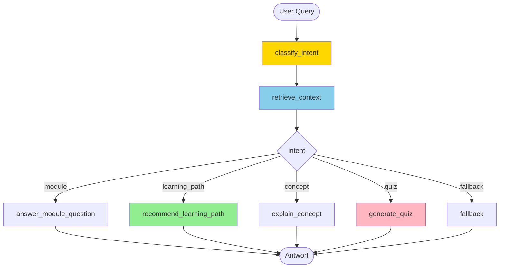
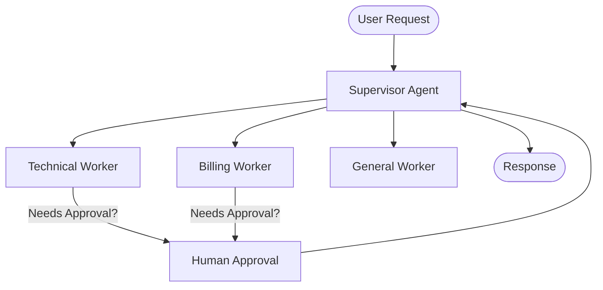
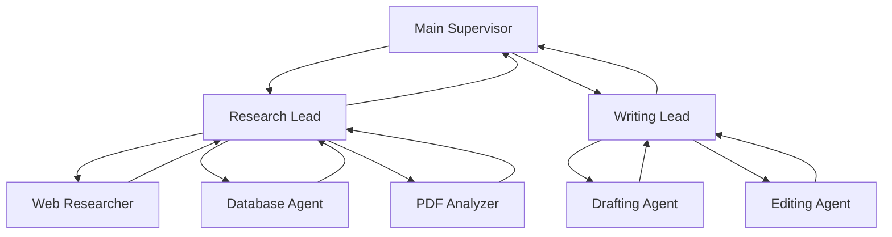
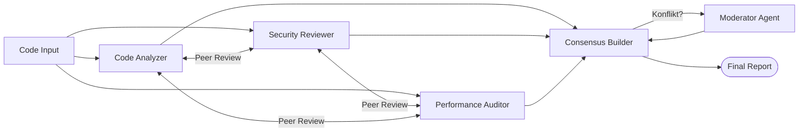
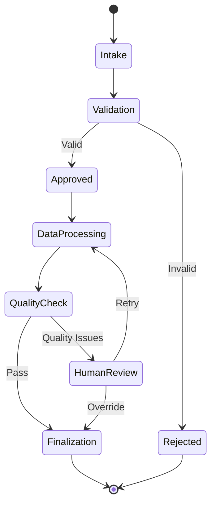
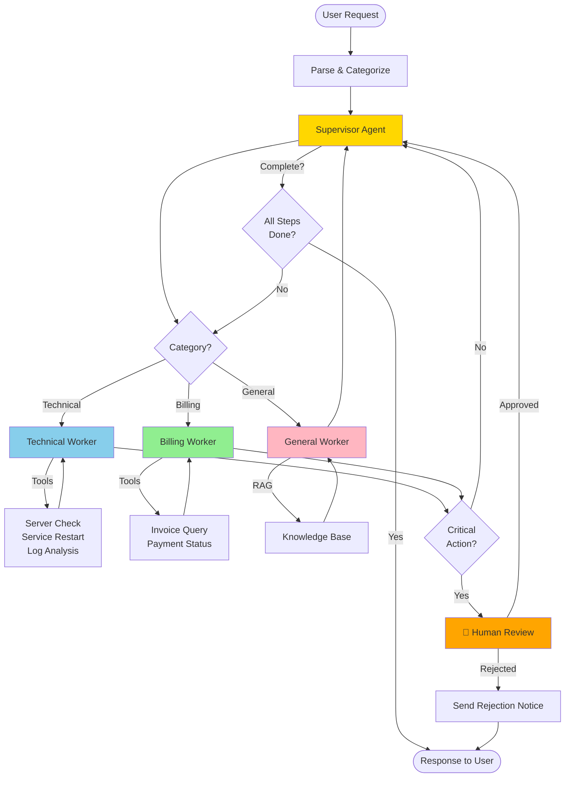

# Research Assistant Workshop
{: .no_toc }

> [!NOTE] Kernfrage<br>
> Wie entsteht schrittweise ein quellengebundener Research Assistant mit Routing, RAG, Sessions und optionaler Oberfläche?

---

# Inhaltsverzeichnis
{: .no_toc .text-delta }

1. TOC
{:toc}

---

## Projektübersicht

In dieser Übungsaufgabe entsteht schrittweise ein **Research Assistant**, der Fragen zu einem Fachartikel-Korpus beantwortet. Der Assistant priorisiert Quellen, fasst zentrale Befunde zusammen, nennt Citation-Hinweise und erzeugt bei Bedarf Kontrollfragen zu Quellen und Aussagen.

Das didaktische Zielbild dieser Aufgabe ist in [Research Assistant als Leitaufgabe]({{ '/02-orientierung-entscheidung/research-assistant-leitaufgabe.html' | relative_url }}) beschrieben.

**Lernziele:**
- LangGraph State Machines von Grund auf verstehen
- Conditional Routing für verschiedene Anfragetypen einsetzen
- Research-Korpuswissen als kleine lokale Wissensbasis strukturieren
- Sessions und Verlauf mit Checkpointing speichern
- eine einfache Gradio-Oberfläche für den Agenten bereitstellen

**Arbeitsumgebung:** Google Colab, Jupyter Notebook oder lokales Python

**Voraussetzung:** Grundkenntnisse aus M01-M10; M16 und M28 hilfreich für Erweiterungen

---

## Notebook-Struktur

Zu erstellen ist **ein Notebook** mit **6 aufbauenden Kapiteln**:

```text
Research_Assistant_Workshop.ipynb
   ├── Kapitel 1: StateGraph Basics
   ├── Kapitel 2: Intent Routing
   ├── Kapitel 3: Wissensbasis & Retrieval-Light
   ├── Kapitel 4: Checkpointing & Sessions
   ├── Kapitel 5: Research-Synthese, Quellen und Selbsttest
   └── Kapitel 6: Gradio UI & Bonus Deployment
```

### Modul-Zuordnung

Jedes Kapitel baut auf den entsprechenden Kursmodulen auf. Das jeweilige Kapitel wird **nach** dem zugehörigen Modul bearbeitet:

| Workshop Kapitel | Kursmodul | Thema |
|-----------------|-----------|-------|
| Kapitel 1: StateGraph Basics | M08, M09 | Warum LangGraph? / StateGraph Basics |
| Kapitel 2: Intent Routing | M10 | Conditional Routing & Tool-Loop |
| Kapitel 3: Wissensbasis | M11–M14 (RAG) oder ab M10 | Research-Korpusdaten strukturieren, Retrieval-light (kein vollständiges RAG erforderlich) |
| Kapitel 4: Checkpointing & Sessions | M16 | Persistente Sitzungen |
| Kapitel 5: Research-Synthese, Quellen und Selbsttest | M04, M05, M24 | Prompting, Struktur, Tests |
| Kapitel 6: Gradio UI & Bonus Deployment | M28, M35 | UI und optional Hugging Face Spaces |

> [!NOTE] Didaktische Einordnung<br>
> Der Workshop startet fachlich ab M11 und verbindet RAG, Routing, Checkpointing, Evaluation und Security zu einem durchgehenden Anwendungsfall.

---

## Vorbereitung: Google Colab oder lokales Setup

### API-Key speichern

Beim Arbeiten mit einem externen Modell den `OPENAI_API_KEY` in Colab Secrets oder lokal in einer `.env` speichern.

### Basis-Pakete installieren

```python
# Installation

!uv pip install --system -q git+https://github.com/ralf-42/Agenten.git#subdirectory=04_modul
!uv pip install --system -q langgraph>=1.0.0 langgraph-checkpoint-sqlite gradio
```

### API-Key laden und Umgebung prüfen

```python
# API-Key Setup

from genai_lib.utilities import setup_api_keys, check_environment

setup_api_keys(['OPENAI_API_KEY'])
check_environment()
```

> [!TIP] Lokales Setup<br>
> API-Key vorab in `.env` oder per `os.environ["OPENAI_API_KEY"] = "sk-..."` setzen. `setup_api_keys()` liest beides automatisch.

---

## Kapitel 1: StateGraph Basics

> [!NOTE] Kursmodul<br>
> M08 – Warum LangGraph? | M09 – StateGraph Basics

**Lernziel:** Einen kleinen Graphen mit TypedDict-State und einfachen Nodes aufbauen

### Szenario

Ein Nutzer stellt eine Anfrage wie:

- "Welche Module brauche ich für RAG?"
- "Erkläre mir Checkpointing."
- "Gib mir eine Selbsttestfrage zu Tool Calling."

Der Graph soll die Anfrage zunächst entgegennehmen und den Typ der Anfrage erkennen.

### Aufgabe 1.1: State definieren

```python
# Kapitel 1: StateGraph Basics

from typing import TypedDict, Literal
from langgraph.graph import StateGraph, START, END

class NavigatorState(TypedDict):
    user_query: str
    intent: Literal["module", "learning_path", "concept", "quiz", "fallback"] | None
    retrieved_context: str
    answer: str
```

### Aufgabe 1.2: Erste Nodes erstellen

```python
from langchain.chat_models import init_chat_model
from genai_lib.model_config import WORKER

llm = init_chat_model(WORKER)

def classify_intent(state: NavigatorState) -> NavigatorState:
    """Erkennt, welche Art von Anfrage vorliegt."""
    query = state["user_query"]
    ...

def fallback_answer(state: NavigatorState) -> NavigatorState:
    """Gibt eine sichere Fallback-Antwort zurück."""
    ...
```

### Aufgabe 1.3: Minimalen Graphen bauen

```python
workflow = StateGraph(NavigatorState)

workflow.add_node("classify_intent", classify_intent)
workflow.add_node("fallback", fallback_answer)

workflow.add_edge(START, "classify_intent")
workflow.add_edge("classify_intent", "fallback")
workflow.add_edge("fallback", END)

graph = workflow.compile()
```

### Aufgabe 1.4: Minimaltest

```python
initial_state = {
    "user_query": "Welche Module brauche ich für RAG?",
    "intent": None,
    "retrieved_context": "",
    "answer": "",
}

result = graph.invoke(initial_state)
print(result["intent"])
print(result["answer"])
```

**Erfolgskriterium:**
- StateGraph läuft fehlerfrei
- State wird korrekt befüllt
- es gibt eine sichere Fallback-Antwort

---

## Kapitel 2: Intent Routing

> [!NOTE] Kursmodul<br>
> M10 – Conditional Routing & Tool-Loop

**Lernziel:** Verschiedene Anfragetypen über Conditional Edges zu spezialisierten Nodes leiten

### Aufgabe 2.1: Router-Funktion definieren

```python
# Kapitel 2: Intent Routing

from typing import Literal

def route_by_intent(state: NavigatorState) -> Literal["module", "learning_path", "concept", "quiz", "fallback"]:
    """Routet zur passenden Verarbeitung basierend auf intent."""
    return state["intent"] or "fallback"
```

### Aufgabe 2.2: Antwort-Nodes anlegen

```python
def answer_module_question(state: NavigatorState) -> NavigatorState:
    """Beantwortet Fragen zu Fachartikeln und Reihenfolge."""
    ...

def recommend_learning_path(state: NavigatorState) -> NavigatorState:
    """Empfiehlt einen Lernpfad passend zum Ziel."""
    ...

def explain_concept(state: NavigatorState) -> NavigatorState:
    """Erklärt einen Begriff aus dem Kurs."""
    ...

def generate_quiz(state: NavigatorState) -> NavigatorState:
    """Erzeugt Kontrollfragen zu Quellen und Aussagen."""
    ...
```

### Aufgabe 2.3: Graph mit Conditional Edge bauen

```python
workflow = StateGraph(NavigatorState)

workflow.add_node("classify_intent", classify_intent)
workflow.add_node("module", answer_module_question)
workflow.add_node("learning_path", recommend_learning_path)
workflow.add_node("concept", explain_concept)
workflow.add_node("quiz", generate_quiz)
workflow.add_node("fallback", fallback_answer)

workflow.add_edge(START, "classify_intent")
workflow.add_conditional_edges(
    "classify_intent",
    route_by_intent,
    {
        "module": "module",
        "learning_path": "learning_path",
        "concept": "concept",
        "quiz": "quiz",
        "fallback": "fallback",
    }
)
...
```

**Erfolgskriterium:**
- Router-Funktion entscheidet korrekt
- verschiedene Nutzerfragen landen in verschiedenen Nodes
- der Graph endet deterministisch

---

## Kapitel 3: Wissensbasis & Retrieval-Light

> [!NOTE] Kursmodul<br>
> M11-M14 oder als vereinfachte Research-Korpusdaten-Aufgabe ab M10

**Lernziel:** Research-Korpuswissen lokal strukturieren und gezielt in den Graphen einbinden

### Aufgabe 3.1: Wissensbasis laden

Eine vollständige Wissensbasis mit allen Kursmodulen (M01–M36) liegt unter `02_daten/05_sonstiges/modules.json` bereit. Diese Datei dient als Ausgangspunkt:

```python
# Kapitel 3: Wissensbasis & Retrieval-Light

import json

with open("../../02_daten/05_sonstiges/modules.json", encoding="utf-8") as f:
    modules = json.load(f)

# Überblick
print(f"{len(modules)} Module geladen")
print(modules[0])
```

Jeder Eintrag enthält: `module`, `title`, `topics`, `level`, `prerequisites`, `summary`.

> [!TIP] Erweiterung<br>
> Einträge können nach Bedarf ergänzt oder korrigiert werden. Die Datei ist ein Startpunkt, keine fertige Lösung.

### Aufgabe 3.2: Kontextsuche implementieren

```python
def retrieve_context(state: NavigatorState) -> NavigatorState:
    """Sucht passende Kursinformationen zur Anfrage."""
    query = state["user_query"].lower()
    ...
```

### Aufgabe 3.3: Retrieval in den Graphen einbauen

```python
workflow.add_node("retrieve_context", retrieve_context)

workflow.add_edge(START, "classify_intent")
workflow.add_edge("classify_intent", "retrieve_context")
workflow.add_conditional_edges(
    "retrieve_context",
    route_by_intent,
    ...
)
```

**Erfolgskriterium:**
- Kontext wird nicht frei erfunden, sondern aus Research-Korpusdaten gezogen
- Modulfragen und Konzeptfragen nutzen die Wissensbasis
- Antworten werden konkreter und nachvollziehbarer

---

## Kapitel 4: Checkpointing & Sessions

> [!NOTE] Kursmodul<br>
> M16 – Checkpointing & Sessions

**Lernziel:** Verlauf und Sitzungen für wiederholte Lernfragen speichern

### Aufgabe 4.1: Checkpointer einrichten

```python
# Kapitel 4: Checkpointing & Sessions

from langgraph.checkpoint.sqlite import SqliteSaver

checkpointer = SqliteSaver.from_conn_string("kursnavigator_sessions.db")
graph = workflow.compile(checkpointer=checkpointer)
```

### Aufgabe 4.2: Session-basierte Interaktion

```python
config = {"configurable": {"thread_id": "user_123"}}

result1 = graph.invoke(
    {
        "user_query": "Ich habe wenig Vorerfahrung. Wo startet der Lernpfad?",
        "intent": None,
        "retrieved_context": "",
        "answer": "",
    },
    config=config,
)

result2 = graph.invoke(
    {
        "user_query": "Und wann sollte ich RAG lernen?",
        "intent": None,
        "retrieved_context": "",
        "answer": "",
    },
    config=config,
)
```

### Aufgabe 4.3: Verlauf inspizieren

```python
def show_session_history(thread_id: str):
    config = {"configurable": {"thread_id": thread_id}}
    history = graph.get_state_history(config)
    ...
```

**Erfolgskriterium:**
- Sitzungen bleiben erhalten
- mehrere Anfragen können derselben Session zugeordnet werden
- Verlauf kann eingesehen oder zurückgesetzt werden

---

## Kapitel 5: Research-Synthese, Quellen und Selbsttest

> [!NOTE] Kursmodul<br>
> M04, M05, M19

**Lernziel:** Antwortqualität strukturieren und mit einfachen Tests absichern

### Aufgabe 5.1: Lernpfad-Logik präzisieren

Mindestens zwei betroffene Gruppen definieren:

- Entwickler mit wenig Vorerfahrung
- erfahrene Entwickler

Und mindestens drei Lernziele:

- Grundlagen
- RAG
- Multi-Agent

### Aufgabe 5.2: Selbsttest-Output strukturieren

```python
def generate_quiz(state: NavigatorState) -> NavigatorState:
    """Erzeugt 2-3 Selbsttestfragen in einem festen Format."""
    # Beispiel-Ausgabe:
    # 1. Frage
    # 2. Frage
    # 3. Frage
    ...
```

### Aufgabe 5.3: Testfragen definieren

Mindestens diese fünf Fragen testen:

- "Welche Module sollte ich für RAG bearbeiten?"
- "Was macht M14?"
- "Erkläre mir Checkpointing in zwei Sätzen."
- "Ich habe wenig Vorerfahrung und will Agenten verstehen. Wo startet der Lernpfad?"
- "Gib mir drei Selbsttestfragen zu Tool Use."

**Erfolgskriterium:**
- Antworten bleiben beim Kurskontext
- Lernpfade sind nachvollziehbar
- Selbsttestfragen passen thematisch
- Testfragen laufen reproduzierbar durch

---

## Kapitel 6: Gradio UI & Bonus Deployment

> [!NOTE] Kursmodul<br>
> M28 – Gradio UI für Agenten | M33 – Production Deployment

**Lernziel:** Den Research Assistant mit einer kleinen Oberfläche nutzbar machen

### Aufgabe 6.1: Chat-Handler schreiben

```python
# Kapitel 6: Gradio UI & Bonus Deployment

def chat_with_navigator(message, history, thread_id):
    """Verarbeitet eine Nutzeranfrage mit dem Research Assistant."""
    config = {"configurable": {"thread_id": thread_id}}
    result = graph.invoke(
        {
            "user_query": message,
            "intent": None,
            "retrieved_context": "",
            "answer": "",
        },
        config=config,
    )
    ...
```

### Aufgabe 6.2: Gradio-Oberfläche aufbauen

```python
import gradio as gr

with gr.Blocks() as demo:
    gr.Markdown("# Research Assistant")

    with gr.Row():
        thread_id = gr.Textbox(label="Session ID", value="user_001")

    chatbot = gr.Chatbot(height=450)
    msg = gr.Textbox(placeholder="Frage zum Kurs stellen ...")

    msg.submit(chat_with_navigator, [msg, chatbot, thread_id], [msg, chatbot])
```

### Aufgabe 6.3: Bonus Deployment

Optional kann die App als **Hugging Face Space** deployt werden. Dafür werden mindestens benötigt:

- `app.py`
- `requirements.txt`
- kleine Wissensbasis (`json` oder `md`)
- gesetzte Secrets für API-Keys

**Erfolgskriterium:**
- lokale UI funktioniert
- Sessions funktionieren auch über die UI
- optional: die App läuft als kleiner Hugging Face Space

### Hugging Face Spaces Deployment (Bonus)

Das Deployment auf **Hugging Face Spaces** ist ein freiwilliger Zusatzschritt. Es zeigt, wie aus der lokalen Übung eine kleine öffentlich oder privat nutzbare Web-App wird.

**Empfohlene Minimalstruktur:**

```text
kursnavigator-space/
  app.py
  requirements.txt
  modules.json
  README.md
```

**Typische Inhalte:**

- `app.py`: Gradio-App mit LangGraph-Workflow
- `requirements.txt`: benötigte Pakete wie `langgraph`, `langchain`, `langchain-openai`, `gradio`
- `modules.json`: kleine Wissensbasis für Module und Konzepte
- `README.md`: kurze Beschreibung und Nutzungshinweise

**Code-Anpassungen für Hugging Face Spaces:**

Hugging Face Spaces stellt Secrets automatisch als Umgebungsvariablen bereit — `setup_api_keys()` funktioniert dort **nicht** (kein Colab-Secret-Manager). Der Setup-Block in `app.py` wird ersetzt durch:

```python
# Hugging Face Spaces: API-Key aus Space Secrets laden
import os

openai_api_key = os.environ.get("OPENAI_API_KEY")
if not openai_api_key:
    raise ValueError("OPENAI_API_KEY nicht gesetzt. Bitte unter Space → Settings → Secrets hinterlegen.")

os.environ["OPENAI_API_KEY"] = openai_api_key
```

> [!NOTE] Space Secrets einrichten<br>
> Option A: im Browser über Space → Settings → Variables and secrets → New secret → Name: `OPENAI_API_KEY`, Value: `sk-...`.
>
> Option B: per Code, zum Beispiel aus einem lokalen Notebook.

```python
from huggingface_hub import HfApi
api = HfApi()
api.add_space_secret(repo_id="username/space-name", key="OPENAI_API_KEY", value="sk-...")
```

**Empfohlener Ablauf:**

1. Einen neuen **Gradio Space** auf Hugging Face erstellen.
2. `app.py`, `requirements.txt` und die Wissensbasis hochladen.
3. API-Keys unter den **Space Secrets** hinterlegen.
4. Den Space starten und Logs auf Import- oder Paketfehler prüfen.
5. Die Anwendung mit denselben Beispielanfragen wie lokal testen.

**Sinnvolle Secrets:**

- `OPENAI_API_KEY`

**Prüffragen nach dem Deployment:**

- Lädt der Space ohne Build-Fehler?
- Funktioniert die Gradio-Oberfläche im Browser?
- Gibt der Research Assistant sinnvolle Antworten wie in der lokalen Version?
- Werden Fehler im UI verständlich angezeigt?

> [!NOTE] Bonus-Deployment<br>
> Das Hugging-Face-Deployment ist ausdrücklich kein Pflichtbestandteil des Workshops. Die Kernleistung bleibt der lokale Research Assistant mit LangGraph.

---

## Bonusaufgaben (Optional)

### Bonus 1: Personalisierte Empfehlungen
- Entwickler mit wenig Vorerfahrung und erfahrene Entwickler getrennt berücksichtigen
- zwischen Interessen wie RAG, Multi-Agent oder Deployment unterscheiden

### Bonus 2: LangSmith Integration
- Graph-Läufe tracken
- mehrere Beispielanfragen vergleichen
- Fehlklassifikationen dokumentieren

### Bonus 3: Erweiterte Wissensbasis
- Inhalte aus `01_notebook/README.md` lesen
- ausgewählte Dateien aus den thematischen Dokumentationsbereichen ergänzen
- eine bessere Kontextsuche bauen

### Bonus 4: Mermaid-Visualisierung
- Graphen visualisieren
- Routing und Antwortpfade dokumentieren

---

## Bewertungskriterien

| Aufgabe | Punkte | Kriterien |
|---------|--------|-----------|
| 1: StateGraph Basics | 15 | TypedDict, State, Nodes, Grundgraph |
| 2: Intent Routing | 20 | Router-Funktion, Conditional Edges |
| 3: Wissensbasis | 20 | Research-Korpusdaten, Kontextsuche, nachvollziehbare Antworten |
| 4: Checkpointing & Sessions | 15 | SQLite-Checkpointer, Verlauf |
| 5: Research-Synthese, Quellen und Selbsttest | 20 | Antwortqualität, Selbsttest, Testfragen |
| 6: Gradio UI & Bonus Deployment | 10 | Nutzbare Oberfläche, optional HF Space |
| **Gesamt** | **100** | |

**Bestanden:** ≥ 60 Punkte

---

## Hilfreiche Ressourcen

**LangGraph Dokumentation:**
- [StateGraph Guide](https://langchain-ai.github.io/langgraph/concepts/low_level/)
- [Checkpointing](https://langchain-ai.github.io/langgraph/how-tos/persistence/)

**Projektinterne Quellen:**
- `Agenten/01_notebook/README.md`
- `Agenten/docs/orientierung/`
- `Agenten/docs/04-agenten-implementierung/`
- `Agenten/docs/04-agenten-implementierung/`

**Weiterführende Dokumente:**
- [Aufgaben & Lösungswege]({{ '/02-orientierung-entscheidung/aufgabenklassen-und-loesungswege.html' | relative_url }})
- [State Management]({{ '/04-agenten-implementierung/state-management.html' | relative_url }})
- [Checkpointing & Persistenz]({{ '/04-agenten-implementierung/checkpointing-persistenz.html' | relative_url }})

---

## Architektur-Übersicht



---

## Abgabe

**Format:**
- **Jupyter Notebook** (`Research_Assistant_Workshop.ipynb`)
  - mit allen 6 Kapiteln ausführbar
  - mit mindestens einer Graph-Visualisierung
  - mit Testfragen und Beispielausgaben
- optional: **SQLite-Datenbank** (`kursnavigator_sessions.db`)
- optional: **Gradio-App** (`app.py`)
- kurzes **README.md** mit:
  - Ziel des Navigators
  - kurzer Architekturübersicht
  - Setup-Anleitung
  - Beispielanfragen

**Deadline:** [Wird vom Dozenten festgelegt]

### Checkliste vor Abgabe
- [ ] Notebook läuft von oben bis unten fehlerfrei durch
- [ ] TypedDict-State ist definiert
- [ ] Intent-Routing funktioniert
- [ ] Wissensbasis ist eingebunden
- [ ] mindestens fünf Testfragen wurden ausgeführt
- [ ] Antworten bleiben beim Kursmaterial
- [ ] Checkpointing funktioniert (Kapitel 4, 15 Punkte)
- [ ] optional: Gradio-UI läuft (Kapitel 6)

---

## FAQ

**Q: Warum LangGraph statt einfachem `create_agent()`?**  
A: Weil der Research Assistant vor allem Routing, State und kontrollierte Antwortpfade zeigen soll. Genau dafür ist LangGraph didaktisch besser geeignet als ein freier Agenten-Loop.

**Q: Muss ich alle Kapitel implementieren?**  
A: Kapitel 1-3 sind Pflicht für eine brauchbare Basisversion. Kapitel 4-6 erweitern das Projekt sinnvoll und bringen die volle Punktzahl.

**Q: Brauche ich echtes RAG?**  
A: Nein. Für diese Übung reicht eine kleine lokale Wissensbasis mit einfacher Kontextsuche. Das Ziel ist Agentensteuerung, nicht ein vollständiges RAG-System.

**Q: Kann ich die Übung auch lokal statt in Colab machen?**  
A: Ja. Lokal reichen Jupyter oder ein Python-Skript plus `.env` für API-Keys.

**Q: Ist Hugging Face Spaces Pflicht?**  
A: Nein. Das Deployment ist ein Bonus. Der Kern der Aufgabe ist der LangGraph-Research Assistant selbst.

**Q: Was ist der Unterschied zur Agenten-Challenge?**  
A:
  - **Research Assistant Workshop**: Fokus auf LangGraph, Routing, RAG, State und Quellenbindung
  - **Agenten Challenge**: größeres End-to-End-Projekt mit höherer technischer Breite

## Abgrenzung zu verwandten Dokumenten

| Dokument | Frage |
|---|---|
| [LangGraph]({{ '/05-frameworks/einsteiger-langgraph.html' | relative_url }}) | Welche LangGraph-Grundlagen braucht der Workshop? |
| [Qualität und Sicherheit]({{ '/07-qualitaet-sicherheit/' | relative_url }}) | Welche Produktionsstandards gelten für Research-Assistant-Projekte? |

---

**Version:** 1.1<br>
**Stand:** Mai 2026<br>
**Kurs:** KI-Agenten. Verstehen. Anwenden. Gestalten.


---


## Research Assistant Challenge
> [!NOTE] Kernfrage<br>
> Wie wird aus dem Research Assistant ein eigenständiges Multi-Agent-Projekt mit Produktionsanforderungen?

---


## Überblick Agenten-Challenge

Die Challenge dient als praktische Anwendung und Integration der in den Kursmodulen M01-M24 erlernten Konzepte. Hauptziel ist ein funktionsfähiger **Research Assistant für Fachartikel**, der **LangGraph State Machines**, **RAG**, **Evaluation**, **Human-in-the-Loop** und **Checkpointing** kombiniert. Die Module M26-M36 sind optionale Transfer- und Produktionsvertiefungen.

## Lernziele

- Integration von LangChain 1.0+ und LangGraph 1.0+ in einem Research-Assistant-System
- Implementierung komplexer Multi-Agent-Architekturen (Supervisor, Hierarchical, Collaborative)
- Praktische Anwendung von State Machines und Conditional Routing
- Human-in-the-Loop Workflows für kritische Entscheidungen
- Deployment mit persistenter Session-Verwaltung
- Präsentation und Dokumentation der eigenen Lösung

## Voraussetzungen

- Abschluss der Module M01-M24; M26-M33 optional für Vertiefung
- Kenntnisse in LangChain 1.0+ und LangGraph 1.0+
- Zugriff auf API-Keys (OpenAI)
- Grundlegende Vertrautheit mit Gradio für UI-Entwicklung
- Verständnis von State Machines und Checkpointing

## Umfang

- **Komplexität:** Production-Ready Multi-Agent-System mit State Management
- **Eigenständigkeit:** Freie Gestaltung innerhalb der gewählten Projektoption

## Praxiseinblick: Von der State Machine zum Production-System

> [!NOTE] Kursanker<br>
> „Ein Agent ist kein Chatbot – der Unterschied ist verstanden." — Modul M01 (Kursplan)

Die Agenten-Challenge bereitet auf realistische Herausforderungen vor, die bei Production-Deployments von KI-Agenten auftreten:

### Was unterscheidet einen einfachen Agent von einem Production-System?

| **Einfacher Agent** | **Production-System (Challenge-Ziel)** |
|---------------------|---------------------------------------|
| `create_agent()` mit Tools | LangGraph State Machine mit Kontrolle |
| Keine Session-Persistenz | Checkpointing (SQLite/PostgreSQL) |
| Keine Fehlerbehandlung | Graceful Error Handling + Retries |
| Linearer Flow | Conditional Routing, Verzweigungen |
| Kein Human-in-the-Loop | Interrupt/Resume für kritische Aktionen |
| Einzelner Agent | Multi-Agent-Koordination (Supervisor) |
| Keine Observability | LangSmith-Tracing + Monitoring |

### Learnings aus der Praxis

**1. State Management ist Critical**
- Production-Agents müssen Sessions über Tage/Wochen persistieren
- **Projektanforderung:** SQLite-Checkpointer für alle Sessions implementieren
- **Takeaway:** State ist die Foundation für Kontrolle

**2. Human-in-the-Loop für kritische Entscheidungen**
- Agenten sollten bei unsicheren Entscheidungen Menschen fragen
- **Projektanforderung:** mindestens einen Interrupt-Point für Approval implementieren
- **Takeaway:** Autonomie ≠ keine menschliche Kontrolle

**3. Multi-Agent = Skalierung**
- Spezialisierte Worker-Agents > ein Generalist-Agent
- **Projektanforderung:** mindestens Supervisor + 2 Worker implementieren
- **Takeaway:** Arbeitsteilung macht Systeme robuster

**4. Observability von Anfang an**
- LangSmith-Tracing ist nicht optional für Production
- **Projektanforderung:** alle Agent-Entscheidungen nachvollziehbar machen
- **Takeaway:** Debugging ohne Traces ist unmöglich

> [!TIP] Vorbereitung<br>
> Der [LangGraph Guide]({{ '/05-frameworks/einsteiger-langgraph.html' | relative_url }}) liefert die nötigen Grundlagen für Production-Best-Practices.

### Konkrete Tipps für die Challenge

**Do's:**
- StateGraph VOR Code zeichnen (Visualisierung hilft!)
- Checkpointing von Anfang an einbauen (nicht nachträglich)
- Klein starten: 2 Worker besser als 5 halbfertige
- LangSmith-Tracing durchgängig nutzen
- Human-in-the-Loop für kritische Pfade

❌ **Don'ts:**
- Nicht `create_agent()` für Hauptlogik (nutze LangGraph!)
- Kein Overengineering: Supervisor-Pattern reicht meist
- Keine Hierarchical/Collaborative-Patterns ohne klaren Bedarf
- Kein Production-Deployment ohne Error-Handling
- Keine Sessions ohne Checkpointing

---

## Projektoptionen

Die Hauptoption ist der Research Assistant. Weitere Optionen dienen als Transfer, wenn derselbe Bauplan auf andere Domänen übertragen werden soll.

## Research Assistant für Fachartikel

**Beschreibung:** Ein Assistant beantwortet Fragen zu einem PDF-Korpus, priorisiert relevante Quellen, erzeugt eine belegte Antwort, erkennt Out-of-Corpus-Fragen und pausiert bei unsicheren oder folgenreichen Aussagen für menschliche Prüfung.

**Architektur:** Supervisor + Retrieval-Worker + Synthese-Worker + Qualitäts-/Security-Gate.

**Pflichtfunktionen:**
- Dokumente laden und indexieren
- Retrieval-Ergebnisse mit Quellenhinweisen ausgeben
- Antwort nur aus belegtem Kontext formulieren
- Out-of-Corpus-Fragen stoppen
- Mindestens ein HITL-Interrupt für kritische Ausgabe
- Regressionstest mit kleinem Eval-Set

**Geeignet nach:** M11-M24.

## Transferoption: Multi-Agent Support-System

**Beschreibung:** Ein Support-System mit Supervisor-Agent, der Kundenanfragen an spezialisierte Worker-Agents delegiert (Technical, Billing, General Support).

**Kernelemente:**
- Supervisor-Agent mit Routing-Logik
- 2-3 spezialisierte Worker-Agents
- Conditional Routing basierend auf Anfragekategorie
- Human-in-the-Loop für Eskalationen
- Session-Management mit Checkpointing

**Erwartete Module:**
- M03 (Erste Agenten)
- M06 (Multi-Tool Agents)
- M09 (StateGraph Basics)
- M10 (Conditional Routing)
- M16 (Checkpointing)
- M17 (Human-in-the-Loop)
- M20 (Supervisor-Pattern)

**Erweiterte Module (optional):**
- M23 (Agent Security & Best Practices)
- M28 (Gradio UI für Agenten)
- M35 (Production Deployment)

**Architektur:**


**Erfolgskriterien:**
- Supervisor routet korrekt zu 2+ Workers
- Sessions werden persistent gespeichert (SQLite)
- Mindestens 1 HITL-Interrupt implementiert
- LangSmith zeigt vollständigen Graph-Trace

---

## Research-Team mit Hierarchical-Pattern

**Beschreibung:** Ein Research-Assistent mit hierarchischer Struktur: Main Supervisor → Research Lead + Writing Lead → Spezialisierte Worker.

**Kernelemente:**
- Hierarchical Multi-Agent-Pattern (3 Ebenen)
- Research-Agents (Web, Database, PDF)
- Writing-Agents (Drafting, Editing, Formatting)
- Subgraphs für Research und Writing
- Streaming für Fortschrittsanzeige

**Erwartete Module:**
- M07 (LCEL Chains)
- M08-M11 (RAG)
- M13-M14 (StateGraph, Routing)
- M21-M22 (Multi-Agent Patterns)

**Erweiterte Module (optional):**
- M26 (Agentic RAG)
- M27 (Advanced RAG – Pipeline-Patterns)
- M24 (Hierarchical Agent Teams)

**Architektur:**


**Erfolgskriterien:**
- 3-Ebenen-Hierarchie funktioniert
- Research + Writing als Subgraphs implementiert
- Streaming zeigt Fortschritt in Echtzeit
- RAG-Integration für Wissensrecherche

---

## Collaborative Code-Review-System

**Beschreibung:** Ein System mit 3 Peer-Agents (Code Analyzer, Security Reviewer, Performance Auditor), die kollaborativ Code reviewen und Konsens finden.

**Kernelemente:**
- Collaborative Multi-Agent-Pattern
- 3 spezialisierte Review-Agents
- Konsens-Mechanismus (Voting, Weighted Scoring)
- Konflikt-Resolution durch Moderator-Agent
- Structured Output für Review-Reports

**Erwartete Module:**
- M03 (Erste Agenten)
- M05 (Structured Output)
- M06 (Multi-Tool Agents)
- M21 (Multi-Agent Patterns - Collaborative)

**Erweiterte Module (optional):**
- M19 (Agent Evaluation & Testing)

**Architektur:**


**Erfolgskriterien:**
- 3 Peer-Agents kommunizieren miteinander
- Konsens-Mechanismus funktioniert
- Moderator löst Konflikte
- Structured Output (Pydantic) für Reports

---

## Workflow-Automation mit Tool-Integration

**Beschreibung:** Ein Workflow-Agent, der komplexe Business-Prozesse automatisiert (z. B. Onboarding, Approval-Workflows, Data Processing).

**Kernelemente:**
- LangGraph State Machine für Workflow-Steps
- Tool-Nodes für externe Integrationen (APIs, Datenbanken)
- Conditional Routing basierend auf Business-Logik
- Human-in-the-Loop für kritische Genehmigungen
- Checkpointing für langlebige Prozesse (Tage/Wochen)

**Erwartete Module:**
- M02 (Tool Use)
- M03 (Erste Agenten)
- M13-M14 (StateGraph, Routing)
- M16-M17 (Checkpointing, HITL)

**Erweiterte Module (optional):**
- M20 (Agent Security & Best Practices)
- M35 (Production Deployment)

**Architektur:**


**Erfolgskriterien:**
- Workflow läuft über mehrere Steps
- Conditional Routing entscheidet Pfade
- HITL-Interrupts für Genehmigungen
- Sessions persistent (können pausiert/resumed werden)

---

## Technische Anforderungen

## PFLICHT-Features (Must-Have)

Jedes Projekt **MUSS** folgende Features implementieren:

### StateGraph mit TypedDict
```python
from typing import TypedDict, Annotated
from langgraph.graph import StateGraph, START, END
from langgraph.graph.message import add_messages

class AgentState(TypedDict):
    """State-Definition (Type-Safe!)"""
    messages: Annotated[list, add_messages]
    current_agent: str | None
    session_id: str
    # Weitere Felder je nach Projekt
```

### Checkpointing (SQLite)
```python
from langgraph.checkpoint.sqlite import SqliteSaver

checkpointer = SqliteSaver.from_conn_string("agent_sessions.db")
graph = workflow.compile(checkpointer=checkpointer)
```

### Human-in-the-Loop (mindestens 1 Interrupt-Point)
```python
graph = workflow.compile(
    checkpointer=checkpointer,
    interrupt_before=["human_approval"]
)
```

### LangSmith-Tracing
```python
import os
os.environ["LANGSMITH_TRACING"] = "true"
os.environ["LANGSMITH_PROJECT"] = "agenten-challenge"
os.environ["LANGSMITH_ENDPOINT"] = "https://eu.api.smith.langchain.com"
```

### Multi-Agent-Architektur
- Minimum: **1 Supervisor + 2 Worker-Agents**
- Supervisor delegiert Aufgaben an Worker
- Workers haben spezialisierte Tools oder Prompts

---

## Empfohlene Features (Should-Have)

### Conditional Routing
```python
def route_by_category(state: AgentState) -> str:
    """Router-Funktion für Verzweigungen."""
    # Logik hier
    return "next_node_name"

workflow.add_conditional_edges(
    "supervisor",
    route_by_category,
    {
        "technical": "technical_worker",
        "billing": "billing_worker"
    }
)
```

### Structured Output mit Pydantic
```python
from pydantic import BaseModel, Field

class AgentDecision(BaseModel):
    reasoning: str = Field(description="Warum diese Entscheidung?")
    next_action: str = Field(description="Nächster Schritt")
    confidence: float = Field(description="Konfidenz 0-1", ge=0, le=1)

structured_llm = llm.with_structured_output(AgentDecision)
```

### Gradio-UI mit Session-Management
```python
import gradio as gr

def chat_handler(message, history, session_id):
    config = {"configurable": {"thread_id": session_id}}
    result = graph.invoke({"messages": [...]}, config=config)
    return result["messages"][-1].content

with gr.Blocks() as demo:
    session_id = gr.Textbox(label="Session ID")
    chatbot = gr.Chatbot()
    # ...
```

---

## Optionale Features (Nice-to-Have)

- **Subgraphs** für modulare Workflows
- **Streaming** für Echtzeit-Fortschritt
- **Custom Middleware** für Logging/Metrics
- **PostgreSQL-Checkpointer** statt SQLite
- **Deployment** auf Hugging Face Spaces
- **Advanced HITL** mit Custom Approval-UI

---

## Projekt-Setup

## Environment Setup

```python
# Installation

!pip install -q langchain>=1.1.0 langchain-openai>=1.0.0 langchain-community
!pip install -q langgraph>=1.0.0 langgraph-checkpoint-sqlite
!pip install -q tiktoken gradio

# Optional: genai_lib installieren
!uv pip install --system -q git+https://github.com/ralf-42/Agenten.git#subdirectory=04_modul
```

## API-Keys Setup

**Wichtig:** LangSmith-Account und LangSmith-API-Key im EU-Workspace anlegen (`https://eu.smith.langchain.com/`) und für `LANGSMITH_ENDPOINT` den EU-API-Endpoint setzen: `https://eu.api.smith.langchain.com`

```python
# API-Keys

import os
from google.colab import userdata

# OpenAI API
os.environ["OPENAI_API_KEY"] = userdata.get('OPENAI_API_KEY')

# LangSmith (Pflicht für Challenge)
os.environ["LANGSMITH_TRACING"] = "true"
os.environ["LANGSMITH_PROJECT"] = "agenten-challenge-your-name"
os.environ["LANGSMITH_API_KEY"] = userdata.get('LANGSMITH_API_KEY')
os.environ["LANGSMITH_ENDPOINT"] = "https://eu.api.smith.langchain.com"
```

## LangGraph Basis-Template

```python
# LangGraph Basis-Setup

from typing import TypedDict, Annotated, Literal
from langgraph.graph import StateGraph, START, END
from langgraph.graph.message import add_messages
from langgraph.checkpoint.sqlite import SqliteSaver
from langchain.chat_models import init_chat_model
from genai_lib.model_config import WORKER

# 1. State definieren
class MultiAgentState(TypedDict):
    messages: Annotated[list, add_messages]
    current_agent: str | None
    session_id: str
    approved: bool

# 2. LLM initialisieren
llm = init_chat_model(WORKER)

# 3. Checkpointer erstellen
checkpointer = SqliteSaver.from_conn_string("challenge_sessions.db")

# 4. StateGraph erstellen
workflow = StateGraph(MultiAgentState)

# 5. Nodes hinzufügen (Beispiel)
def supervisor_node(state: MultiAgentState) -> MultiAgentState:
    """Supervisor entscheidet nächsten Agent."""
    # Projektlogik hier ergänzen
    return state

workflow.add_node("supervisor", supervisor_node)
# ... weitere Nodes

# 6. Graph kompilieren
graph = workflow.compile(
    checkpointer=checkpointer,
    interrupt_before=["human_approval"]  # HITL
)
```

---

## Bewertungskriterien

| Kategorie | Punkte | Kriterien |
|-----------|--------|-----------|
| **Multi-Agent-Architektur** | 25 | Supervisor + 2+ Worker, klare Delegation, Routing-Logik |
| **State Management** | 20 | TypedDict State, Checkpointing, Sessions persistent |
| **Human-in-the-Loop** | 15 | Interrupt/Resume funktioniert, sinnvoller Einsatz |
| **Code-Qualität** | 15 | Sauber, dokumentiert, Error-Handling, Best Practices |
| **Funktionalität** | 10 | End-to-End-Flow funktioniert, Use Case gelöst |
| **Deployment & UI** | 10 | Gradio-UI vorhanden, lauffähig, benutzerfreundlich |
| **Dokumentation** | 5 | README.md, Architektur-Diagramm, Setup-Anleitung |
| **Gesamt** | **100** | |

**Bestanden:** ≥ 60 Punkte

---

## Abgabe

## Abgabeformat

**Pflicht-Dateien:**
- **Jupyter Notebook** (`Agenten_Challenge.ipynb`)
  - Vollständig ausführbar von oben bis unten
  - Kommentierte Code-Zellen
  - Mermaid-Diagramme für Architektur
- **SQLite-Datenbank** (`challenge_sessions.db`) mit Beispiel-Sessions
- **README.md** mit:
  - Kurzbeschreibung des Projekts
  - Architektur-Übersicht (Mermaid-Diagramm)
  - Setup-Anleitung (API-Keys, Dependencies)
  - Screenshot der Gradio-UI
  - LangSmith-Project-Link (public)
- Optional: **Demo-Video** (max. 5 Min.)

**Einreichung:**
- Als **Colab-Link** (öffentlich freigegeben)
- ODER als **ZIP-Archiv** mit .ipynb + DB
- ODER als **Git-Repository-Link** (GitHub/GitLab)

## Checkliste vor Abgabe

### Code & Funktionalität
- [ ] Notebook läuft von oben bis unten fehlerfrei durch
- [ ] Alle API-Keys sind über Colab Secrets eingebunden (nicht hardcodiert!)
- [ ] StateGraph verwendet TypedDict (PFLICHT!)
- [ ] Checkpointing funktioniert (Sessions können geladen werden)
- [ ] Mindestens 1 HITL-Interrupt implementiert
- [ ] Multi-Agent-System funktioniert (Supervisor + 2+ Workers)
- [ ] LangSmith-Tracing aktiviert, Projekt öffentlich

### Dokumentation
- [ ] README.md erklärt Projekt, Architektur und Setup
- [ ] Mermaid-Diagramm der Multi-Agent-Architektur vorhanden
- [ ] Code-Kommentare an kritischen Stellen
- [ ] Error-Handling implementiert

### UI & Deployment
- [ ] Gradio-UI läuft und erstellt share-Link
- [ ] Session-Management in UI funktioniert
- [ ] UI ist benutzerfreundlich (nicht nur technisch)

---

## Hilfreiche Ressourcen

## Dokumentation

**LangGraph:**
- [StateGraph Guide](https://langchain-ai.github.io/langgraph/concepts/low_level/)
- [Multi-Agent Systems](https://langchain-ai.github.io/langgraph/how-tos/multi-agent-network-functional/)
- [Human-in-the-Loop](https://docs.langchain.com/oss/python/langgraph/interrupts)
- [Checkpointing](https://langchain-ai.github.io/langgraph/how-tos/persistence/)

**Projekt-Ressourcen:**
- [LangGraph Guide]({{ '/05-frameworks/einsteiger-langgraph.html' | relative_url }})
- [LangChain Standards]({{ '/10-ressourcen/standards.html' | relative_url }})
- [LangGraph Guide]({{ '/05-frameworks/einsteiger-langgraph.html' | relative_url }})

## Code-Beispiele

**Referenz-Notebooks:**
- `M13_StateGraph_Basics.ipynb` - StateGraph Einführung
- `M14_Conditional_Routing_Tool_Loop.ipynb` - Routing
- `M22_Supervisor_Pattern.ipynb` - Multi-Agent-Beispiel
- `M23_Multi_Agent_Projekt.ipynb` - Vollständiges Projekt

## Troubleshooting

| Problem | Ursache | Lösung |
|---------|---------|--------|
| `END is not defined` | Falscher Import | `from langgraph.graph import END` |
| Sessions nicht persistent | Kein Checkpointer | `checkpointer=SqliteSaver(...)` |
| Graph stoppt nicht bei HITL | Falscher Interrupt | `interrupt_before=["node_name"]` |
| Supervisor routet nicht | Conditional Edge fehlt | `add_conditional_edges()` verwenden |
| LangSmith zeigt nichts | Tracing nicht aktiviert oder falscher Endpoint | `LANGSMITH_TRACING="true"` und `LANGSMITH_ENDPOINT="https://eu.api.smith.langchain.com"` setzen |

---

## FAQ

**Q: Muss ich alle 4 Projektoptionen implementieren?**
A: Nein. Eine Option vollständig zu implementieren ist besser als mehrere halbfertige Varianten. Qualität geht vor Quantität.

**Q: Kann ich create_agent() statt LangGraph verwenden?**
A: **Nein!** LangGraph ist PFLICHT für die Challenge. `create_agent()` reicht nicht für die Bewertungskriterien.

**Q: Wie viele Worker-Agents brauche ich mindestens?**
A: Minimum **2 Worker + 1 Supervisor**. Für Bonuspunkte: 3-4 Worker.

**Q: Muss ich SQLite oder kann ich PostgreSQL nutzen?**
A: SQLite reicht für die Challenge. PostgreSQL ist optional (Bonuspunkte).

**Q: Wie lange sollen Sessions persistent bleiben?**
A: Mindestens über Notebook-Neustart hinweg. Test: Notebook schließen, neu öffnen, Session laden.

**Q: Mein Graph hat Endlos-Loops – was tun?**
A: `recursion_limit=20` bei `compile()` ergänzen. Zusätzlich prüfen, ob der Supervisor-Router immer zu `END` führen kann.

**Q: Brauche ich wirklich eine UI?**
A: Ja! Gradio-UI ist Teil der Bewertung (10 Punkte). Zeigt, dass System nutzbar ist.

**Q: Kann ich die Challenge lokal statt in Colab machen?**
A: Ja. Dann gilt:
  - Lokales Jupyter Notebook/Lab
  - `from dotenv import load_dotenv` für API-Keys
  - SQLite funktioniert identisch

**Q: Unterschied zur RAG_Workshop.md?**
A:
  - **RAG Workshop**: Fokus auf LangChain, RAG, Retrieval, Embeddings
  - **Research Assistant Workshop**: Fokus auf LangGraph, Routing, RAG, State und Quellenbindung
  - **Agenten Challenge**: Production-Ready System mit allen 7 LangGraph Must-Haves

---

## Beispiel-Architektur: Support-System

Hier ein vollständiges Beispiel für Option 2.1 (Multi-Agent Support-System) als Inspiration:



**State-Definition:**
```python
class SupportState(TypedDict):
    messages: Annotated[list, add_messages]
    category: Literal["technical", "billing", "general"] | None
    current_worker: str | None
    requires_approval: bool
    approved: bool
    session_id: str
    tool_results: list[dict]
```

## Abgrenzung zu verwandten Dokumenten

| Dokument | Frage |
|---|---|
| [LangGraph]({{ '/05-frameworks/einsteiger-langgraph.html' | relative_url }}) | Welche LangGraph-Grundlagen braucht die Challenge? |
| [Qualität und Sicherheit]({{ '/07-qualitaet-sicherheit/' | relative_url }}) | Welche Produktionsstandards gelten für Multi-Agent-Projekte? |

---

**Version:** 1.2<br>
**Stand:** Mai 2026<br>
**Kurs:** KI-Agenten. Verstehen. Anwenden. Gestalten.


