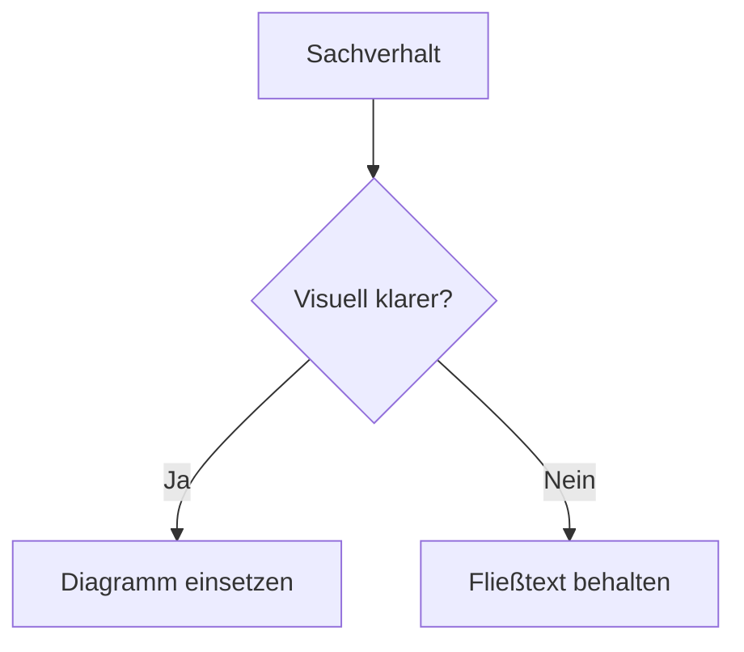

# Markdown Template Guide
{: .no_toc }

> **Vorlage und Regeln für Markdown-Dateien in `docs/` nach dem verbindlichen Doku-Standard**

---

# Inhaltsverzeichnis
{: .no_toc .text-delta }

1. TOC
{:toc}

---

## Ziel und Geltungsbereich

Diese Datei übersetzt den verbindlichen Standard aus [`_docs/Dokument_Standard.md`](../../_docs/Dokument_Standard.md) in eine praktische Arbeitsvorlage für `Agenten/docs/`. Maßgeblich bleibt immer der Standard selbst. Diese Guide-Datei konkretisiert ihn für Jekyll, just-the-docs und die vorhandene Projektstruktur.

---

## Grundprinzip

Für alle Dokumente in `docs/` gilt: **Substanz vor Struktur**. Formatierung hilft beim Lesen, ersetzt aber keinen präzisen Text. Ein sauber formulierter Absatz ist fast immer besser als eine Kette aus Bullet Points.

Aufzählungen werden nur eingesetzt, wenn echte Parallelstruktur vorliegt. Abschnitte mit zusammenhängender Argumentation bleiben Fließtext. Aussagen wie "praxisorientiert", "ganzheitlich" oder "state of the art" werden vermieden, wenn sie nicht durch ein Beispiel oder einen überprüfbaren Beleg gedeckt sind.

Personalpronomen werden vermieden. Statt "Sie prüfen" oder "du findest" werden unpersönliche Formulierungen verwendet, etwa "Vor dem Start wird geprüft" oder "Die Checkliste findet sich weiter unten".

---

## Standard-Template für Inhaltsseiten

Diese Vorlage gilt für inhaltliche Dokumente in `concepts/`, `frameworks/`, `deployment/`, `resources/` und `regulatory/`.

````markdown
---
layout: default
title: Titel des Dokuments
parent: Übergeordnete Seite
nav_order: 1
description: Prägnanter Beschreibungstext für Navigation und SEO
has_toc: true
---

# Titel des Dokuments
{: .no_toc }

> **Prägnanter Beschreibungstext für Navigation und SEO**

---

# Inhaltsverzeichnis
{: .no_toc .text-delta }

1. TOC
{:toc}

---

## Erstes Kapitel

Hier steht zusammenhängender Text. Bullet Points nur dann, wenn mehrere wirklich gleichwertige Punkte nebeneinanderstehen.

---

## Zweites Kapitel

Hier folgt der eigentliche Inhalt.

---

## Abgrenzung zu verwandten Dokumenten

| Dokument | Frage |
|---|---|
| [Verwandtes Dokument](./Verwandtes_Dokument.html) | Worum geht es dort? |

---

**Version:**    1.0
**Stand:**    März 2026
**Kurs:**    KI-Agenten. Verstehen. Anwenden. Gestalten.
````

Die Vorlage ist ein Ausgangspunkt, kein Zwang zur Textaufblähung. Wenn ein Sachverhalt mit zwei starken Absätzen erklärt ist, bleibt es bei zwei starken Absätzen.

---

## Pflichtregeln

### Frontmatter

Jede Inhaltsseite in `docs/` beginnt mit Frontmatter. Pflichtfelder:

```yaml
---
layout: default
title: Titel des Dokuments
parent: Übergeordnete Seite
nav_order: 1
description: Prägnanter Beschreibungstext für Navigation und SEO
has_toc: true
---
```

`nav_order` muss zur Reihenfolge im jeweiligen Index-Dokument passen. `description` bleibt knapp; sie ist kein Teaser-Absatz.

### Titel

Einstiegs- und Orientierungsdokumente verwenden nach Möglichkeit ein W-Frage-Format, etwa `Lohnt es sich überhaupt?` oder `Welches Werkzeug?`. Technische Referenzdokumente behalten präzise technische Titel wie `Checkpointing & Persistenz` oder `Agent Security`.

### Inhaltsverzeichnis

Ein automatisches Inhaltsverzeichnis ist Pflicht, sobald ein Dokument mehr als drei Hauptabschnitte besitzt.

```markdown
# Inhaltsverzeichnis
{: .no_toc .text-delta }

1. TOC
{:toc}
```

Kurze Seiten mit bis zu drei Hauptabschnitten benötigen kein TOC.

### Abgrenzungstabelle für Konzeptdokumente

Jedes Dokument in `docs/concepts/` endet vor dem Versionsblock mit einer Abgrenzungstabelle.

```markdown
## Abgrenzung zu verwandten Dokumenten

| Dokument | Frage |
|---|---|
| [Titel](./Datei.html) | Worum geht es dort? |
```

### Versionierungsblock

Jede Seite endet mit genau diesem Block. Im Markdown-Quelltext stehen nach `**Version:**`, `**Stand:**` und `**Kurs:**` jeweils vier Leerzeichen vor dem Wert.

```markdown
**Version:**    1.0
**Stand:**    März 2026
**Kurs:**    KI-Agenten. Verstehen. Anwenden. Gestalten.
```

---

## Schreibregeln

### Aufzählungen sparsam einsetzen

Aufzählungen passen nur bei echter Parallelstruktur. Was sich als Begründung, Abwägung oder Ablauf erzählen lässt, bleibt Fließtext.

**Nicht geeignet sind zum Beispiel:**
- Gedankengänge mit Ursache und Wirkung
- Sätze, die sich sinnvoll mit "und", "weil" oder "deshalb" verbinden lassen
- Abschnitte, die nur aus Mini-Sätzen unter mehreren Überschriften bestehen

### Mehrwert statt Selbstbeschreibung

Eigenschaften werden nicht behauptet, sondern gezeigt. Statt "praxisorientiertes Training" ist ein Satz wie "Im Modul entsteht ein lauffähiges RAG-System" belastbar.

### Grenzen benennen

Gute Doku beschreibt nicht nur, was funktioniert, sondern auch, wo ein Ansatz scheitert, wann er aufwendig wird und welche Fehlannahmen häufig auftreten.

### Satzvarianz

Gleich lange Sätze hintereinander wirken maschinell. Unterschiedliche Satzlängen, klare Kontraste und gelegentliche Leitfragen machen Texte lesbarer, solange sie echte Orientierung geben.

---

## Strukturregeln

### Keine manuell nummerierten Überschriften

Nummern werden nicht in Überschriften geschrieben.

**Falsch:**

```markdown
## 1 Überblick
### 1.1 Installation
```

**Richtig:**

```markdown
## Überblick
### Installation
```

### Überschriften dienen der Gliederung

Überschriften strukturieren den Text, sie ersetzen ihn nicht. Ein Abschnitt mit nur einem Halbsatz unter einer eigenen H2 ist kein tragfähiger Abschnitt.

### Trennlinien gezielt einsetzen

`---` trennt Hauptabschnitte sichtbar voneinander. Zwischen einzelnen Unterpunkten innerhalb desselben Gedankengangs wird keine zusätzliche Trennlinie eingefügt.

---

## Link-Konventionen

In Index-Dokumenten wie `concepts.md` oder `frameworks.md` werden absolute URLs verwendet:

```markdown
[Digitale Souveränität](https://ralf-42.github.io/Agenten/regulatory/Digitale_Souveraenitat.html)
```

Innerhalb inhaltlicher Dokumente werden relative `.html`-Links verwendet:

```markdown
[Agent-Architekturen](./Agent_Architekturen.html)
[Modell-Auswahl Guide](../frameworks/Modell_Auswahl_Guide.html)
```

Regeln:

- Immer `.html`, nie `.md`
- Dateiname exakt wie auf der Festplatte
- Keine trailing slashes bei Datei-URLs
- Seiten mit eigenem `permalink:` verwenden für interne Verweise besser absolute URLs

---

## Callouts und Mermaid

### Callouts

Im Projekt wird GitHub-Alert-Syntax verwendet. Der Titel nach dem Alert-Typ ist Pflicht.

```markdown
> [!NOTE] Kontext
> Ergänzende Information, die den Haupttext nicht unterbrechen soll.

> [!WARNING] Einschränkung
> Bekannte Fehlerquelle oder wichtige Grenze.
```

Pro Abschnitt höchstens ein Callout. Wenn jeder zweite Absatz hervorgehoben wird, verliert die Hervorhebung ihren Zweck.

### Mermaid

Mermaid wird nur eingesetzt, wenn ein Zusammenhang visuell klarer wird als im Fließtext oder in einer Tabelle. Geeignet sind Entscheidungslogik, Zustandswechsel, Sequenzen und Architekturübersichten. `sequenceDiagram` beginnt immer mit `autonumber`.

````markdown

````

---

## Kategorie-Seiten

Kategorie-Seiten wie `concepts.md` oder `frameworks.md` dienen der Orientierung. Sie verwenden `has_children: true` und bei Bedarf `permalink:`. Die Einträge arbeiten mit absoluten URLs und ergänzen technische Titel durch eine kursive W-Frage.

````markdown
---
layout: default
title: Konzepte
nav_order: 2
has_children: true
description: Theoretische Grundlagen und technische Konzepte für KI-Agenten
---

# Konzepte

Kurze Einordnung des Bereichs in einem Absatz.

## Grundlagen

- **[Checkpointing & Persistenz](https://ralf-42.github.io/Agenten/concepts/Checkpointing_Persistenz.html)** – *Wie werden Sitzungen gespeichert?* Zustandsspeicherung und Session-Persistenz in LangGraph.
- **[Agent Security](https://ralf-42.github.io/Agenten/concepts/Agent_Security.html)** – *Wie wird ein Agent abgesichert?* Sicherheitsrisiken und Schutzprinzipien für KI-Agenten.
````

Listen sind auf Kategorie-Seiten sinnvoll, weil dort tatsächlich eine Sammlung gleichartiger Einträge vorliegt. Auch dort gilt: keine ausufernden Unterlisten ohne Mehrwert.

---

## Häufige Fehler

### Widerspruch zwischen Standard und Vorlage

Wenn diese Guide-Datei und `_docs/Dokument_Standard.md` voneinander abweichen, gilt der Standard. Die Guide-Datei wird dann angepasst.

### Zu viele Bullet Points

Wenn mehr als die Hälfte eines Abschnitts aus Aufzählungen besteht, ist fast immer ein Absatz oder eine Tabelle die bessere Form.

### Falsche Linkziele

Interne Links auf `.md` sind im Projekt falsch. Verwendet werden `.html`-Ziele.

### Fehlender Abschluss

Viele Seiten wirken fertig, brechen aber ohne Abgrenzungstabelle oder Versionsblock ab. Beides gehört zum formalen Abschluss.

### Direkte Ansprache

Formulierungen wie "Sie prüfen", "du findest" oder "Ihr Projekt" werden in neutrale Formulierungen überführt.

---

## Checkliste vor dem Speichern

- Frontmatter vollständig und korrekt
- `nav_order` stimmt mit dem Index-Dokument überein
- Titel passt zum Dokumenttyp
- TOC nur dann, wenn mehr als drei Hauptabschnitte vorhanden sind
- Keine manuell nummerierten Überschriften
- Aufzählungen nur dort, wo echte Parallelstruktur vorliegt
- Interne Links zeigen auf `.html`
- Konzeptdokument enthält Abgrenzungstabelle
- Callouts haben einen Titel
- Versionsblock steht am Ende im vorgeschriebenen Format

---

**Version:**    1.0
**Stand:**    März 2026
**Kurs:**    KI-Agenten. Verstehen. Anwenden. Gestalten.
