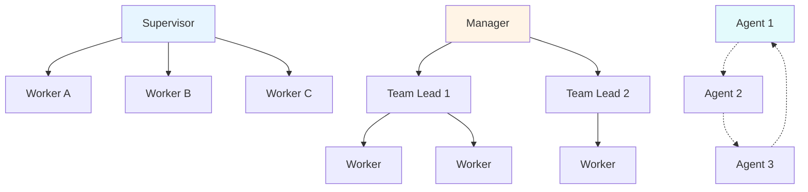
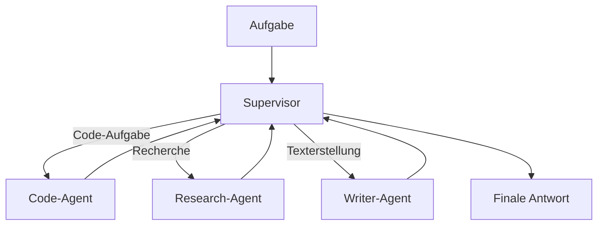
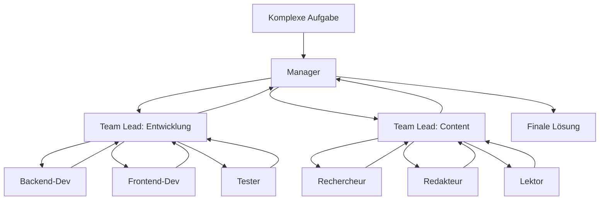
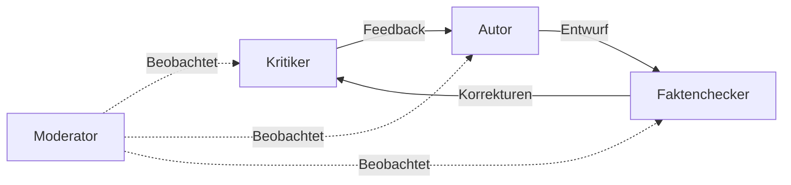
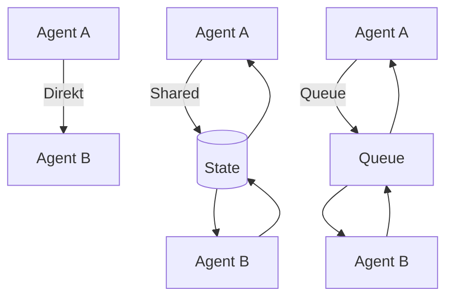
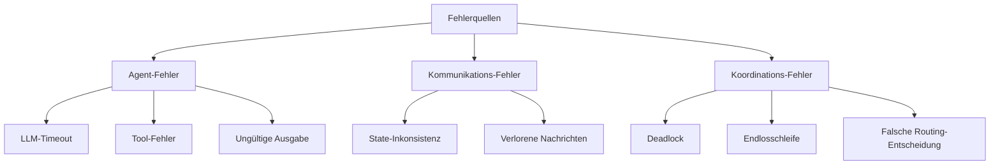
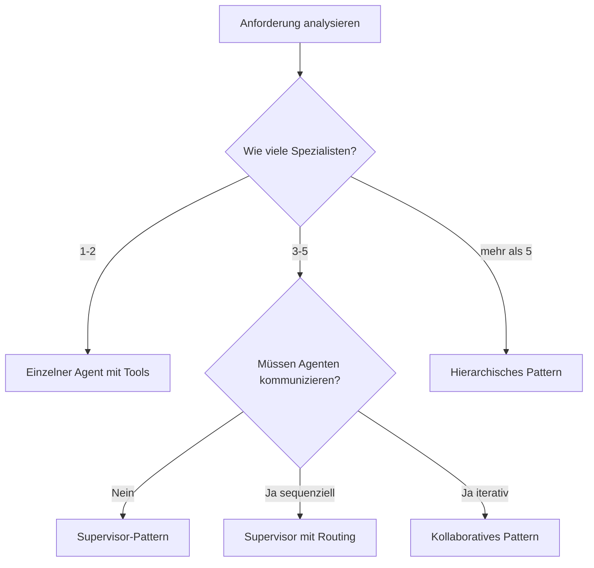

# Mermaid-Diagramme zu SVG konvertieren

## Schritt-für-Schritt Anleitung

### 1. Mermaid Live Editor öffnen
Öffnen Sie: https://mermaid.live/

### 2. Diagramm-Code einfügen
Kopieren Sie den Mermaid-Code aus der jeweiligen Datei und fügen Sie ihn in den Editor ein.

### 3. Als SVG exportieren
1. Klicken Sie auf "Actions" (rechts oben)
2. Wählen Sie "Export SVG"
3. Speichern Sie die Datei mit einem beschreibenden Namen

### 4. SVG in docs/assets/images/diagrams/ speichern

### 5. Markdown aktualisieren
Ersetzen Sie den Mermaid-Block durch:
```markdown

```

---

## Diagramme für Multi_Agent_Systeme.md

### Diagramm 1: Koordinationsmuster
**Dateiname:** `multi-agent-koordination.svg`
**Code:**


### Diagramm 2: Supervisor-Pattern
**Dateiname:** `supervisor-pattern.svg`
**Code:**


### Diagramm 3: Hierarchisches Pattern
**Dateiname:** `hierarchisches-pattern.svg`
**Code:**


### Diagramm 4: Kollaboratives Pattern
**Dateiname:** `kollaboratives-pattern.svg`
**Code:**


### Diagramm 5: Kommunikationsformen
**Dateiname:** `kommunikationsformen.svg`
**Code:**


### Diagramm 6: Fehlerquellen
**Dateiname:** `fehlerquellen.svg`
**Code:**


### Diagramm 7: Entscheidungshilfe
**Dateiname:** `entscheidungshilfe.svg`
**Code:**


---

## Alternative: Kroki.io API (Automatisch)

Statt manuell zu exportieren, können Sie auch die Kroki.io API verwenden:

```markdown

```

Tool zum Kodieren: https://www.base64encode.org/
