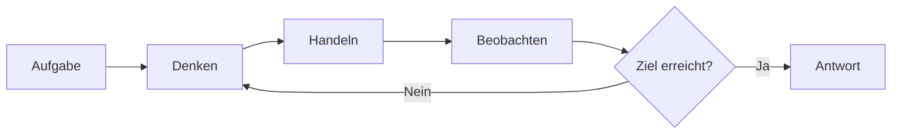
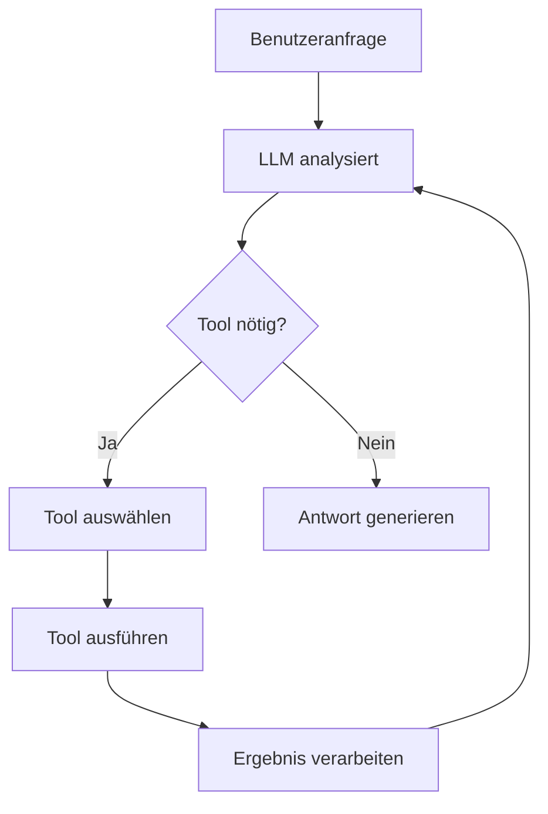
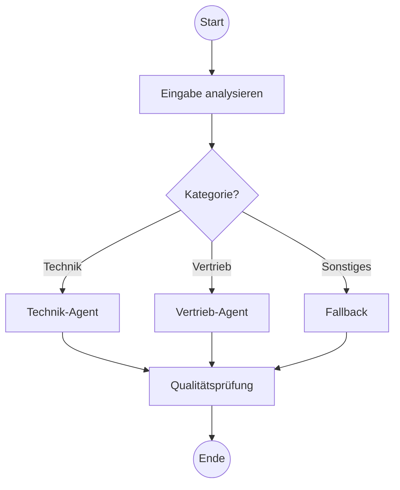
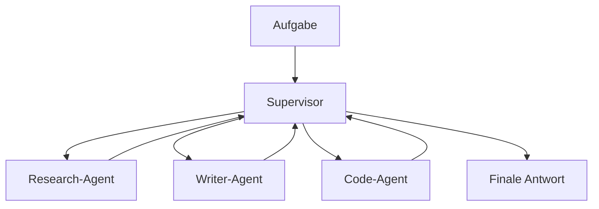
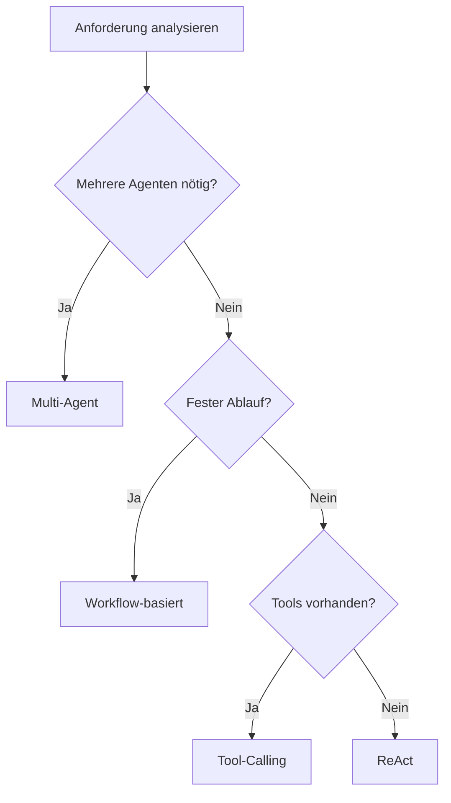

# Agent-Architekturen
{: .no_toc }

> **Verschiedene Architekturmuster und Design-Prinzipien für KI-Agenten**

---
# Inhaltsverzeichnis
{: .no_toc .text-delta }

1. TOC
{:toc}

---

## Überblick

Ein KI-Agent ist mehr als ein einfacher Chatbot. Während ein Chatbot auf Eingaben reagiert und Antworten generiert, kann ein Agent **selbstständig Entscheidungen treffen**, **Werkzeuge nutzen** und **mehrstufige Aufgaben lösen**. Die Wahl der richtigen Architektur bestimmt maßgeblich, wie leistungsfähig, zuverlässig und wartbar ein Agent-System wird.

Agenten lassen sich aus zwei Perspektiven klassifizieren:

| Perspektive | Frage | Abschnitt |
|---|---|---|
| **Intelligenz-Typ** | Wie entscheidet der Agent? | Section 2 |
| **Implementierungsmuster** | Wie ist der Agent aufgebaut? | Sections 3–6 |

Vier grundlegende Implementierungsmuster haben sich in der Praxis etabliert:

| Architektur | Kernidee | Komplexität |
|-------------|----------|-------------|
| **ReAct** | Denken → Handeln → Beobachten | ⭐⭐ |
| **Tool-Calling** | LLM wählt und nutzt Werkzeuge | ⭐⭐ |
| **Workflow-basiert** | Definierte Schritte mit Verzweigungen | ⭐⭐⭐ |
| **Multi-Agent** | Spezialisierte Agenten arbeiten zusammen | ⭐⭐⭐⭐ |

---

## Agenten-Typen nach Intelligenz

Agenten lassen sich nach **Intelligenz und Entscheidungslogik** klassifizieren. Diese Klassifikation beschreibt, wie ein Agent zu Entscheidungen kommt — unabhängig davon, wie er technisch implementiert ist:

| Typ | Entscheidet durch | Stärke | Schwäche | LangChain-Analogie |
|---|---|---|---|---|
| **Simple Reflex** | If/Then-Regeln | Schnell, vorhersagbar | Kein Gedächtnis, keine Anpassung | Regelbasierter Workflow ohne State |
| **Model-Based Reflex** | Internes Weltmodell + State | Reagiert auf nicht-sichtbare Zustände | Plant nicht voraus | LangGraph mit StateGraph |
| **Goal-Based** | Simulation zukünftiger Zustände | Flexibel, zielorientiert | Rechenaufwändig | ReAct-Agent |
| **Utility-Based** | Maximierung eines Präferenz-Scores | Wählt die *beste* Option, nicht nur eine gültige | Braucht präzise Utility-Funktion | Agent mit Judge/Evaluator |
| **Learning Agent** | Lernen aus Erfahrung und Feedback | Verbessert sich über Zeit | Datenhungrig, langsam | Reinforcement Learning (außerhalb LangGraph-Scope) |

**Die Kernfrage je Typ:**

- **Simple Reflex:** *Welche Regel passt zu dieser Situation?* — reagiert, kein Gedächtnis
- **Model-Based:** *Was weiß ich über den Zustand der Welt, auch was ich nicht direkt sehe?* — erinnert sich, plant nicht
- **Goal-Based:** *Was bringt mich meinem Ziel näher?* — zielt, jeder Weg zum Ziel ist akzeptabel
- **Utility-Based:** *Welche Option maximiert meinen Nutzen-Score?* — bewertet, wählt den besten Weg
- **Learning Agent:** *Was hat in der Vergangenheit funktioniert?* — verbessert sich, aber langsam und datenintensiv

**Bezug zu den Implementierungsmustern:**
Ein ReAct-Agent (Section 3) verhält sich wie ein Goal-Based Agent — er simuliert, welche Aktion sein Ziel erreicht.
Ein Workflow-basierter Agent (Section 5) entspricht je nach Komplexität einem Simple-Reflex- oder Model-Based-Agenten.
Ein Agent mit LLM-as-Judge-Komponente (z. B. Qualitäts-Gate) nähert sich dem Utility-Based-Typ.

> **Hinweis:** Learning Agents mit Reinforcement Learning liegen außerhalb des LangChain/LangGraph-Scopes dieses Kurses.

---

## ReAct-Architektur

ReAct (Reasoning + Acting) beschreibt einen iterativen Zyklus: Der Agent **denkt nach** (Reasoning), **führt eine Aktion aus** (Acting) und **beobachtet das Ergebnis**. Dieser Zyklus wiederholt sich, bis die Aufgabe gelöst ist.

**Charakteristik:**
- Transparenter Denkprozess (nachvollziehbar)
- Gut geeignet für explorative Aufgaben
- Kann bei komplexen Problemen viele Iterationen benötigen

**Typischer Einsatz:** Recherche-Aufgaben, Problemlösung mit unbekanntem Lösungsweg

---

## Tool-Calling-Architektur

Bei dieser Architektur entscheidet das LLM, **welches Werkzeug** mit **welchen Parametern** aufgerufen werden soll. Das Ergebnis fließt zurück in den Kontext, und der Agent formuliert die finale Antwort.

**Charakteristik:**
- LLM als "Orchestrator" der Werkzeuge
- Erweiterbar durch neue Tools ohne Architekturänderung
- Abhängig von der Qualität der Tool-Beschreibungen

**Typischer Einsatz:** Assistenten mit definierten Fähigkeiten (Kalender, E-Mail, Datenbank)

---

## Workflow-basierte Architektur

Hier werden Arbeitsschritte als **Graph mit Knoten und Kanten** modelliert. Jeder Knoten repräsentiert eine Verarbeitung, Kanten definieren den Ablauf – einschließlich bedingter Verzweigungen.

**Charakteristik:**
- Vorhersagbarer, kontrollierbarer Ablauf
- Explizite Fehlerbehandlung möglich
- Komplexität steigt mit Anzahl der Verzweigungen

**Typischer Einsatz:** Mehrstufige Prozesse, Genehmigungsworkflows, RAG-Pipelines

---

## Multi-Agent-Architektur

Mehrere spezialisierte Agenten arbeiten zusammen. Ein **Supervisor** koordiniert die Aufgabenverteilung, oder Agenten kommunizieren **kollaborativ** miteinander.

**Varianten:**

| Pattern | Beschreibung |
|---------|-------------|
| **Supervisor** | Ein Agent verteilt Aufgaben an Worker-Agenten |
| **Hierarchisch** | Mehrere Ebenen von Supervisors und Workern |
| **Kollaborativ** | Agenten kommunizieren direkt miteinander |

**Charakteristik:**
- Skalierbar für komplexe Aufgaben
- Jeder Agent kann optimiert werden
- Koordination erfordert sorgfältiges Design

**Typischer Einsatz:** Content-Erstellung, komplexe Analysen, autonome Systeme

---

## Design-Prinzipien

Unabhängig von der gewählten Architektur gelten bewährte Prinzipien:

### Single Responsibility
Jede Komponente hat **eine klar definierte Aufgabe**. Ein Tool berechnet, ein anderes sucht – nicht beides gleichzeitig. Das erleichtert Wartung und Fehlersuche.

### Fail-Safe Design
Agenten müssen mit Fehlern umgehen können:
- Was passiert, wenn ein Tool nicht erreichbar ist?
- Was, wenn das LLM eine ungültige Tool-Auswahl trifft?
- Maximale Iterationen verhindern Endlosschleifen.

### Human-in-the-Loop
Bei kritischen Aktionen (Löschen, Senden, Bezahlen) sollte eine **menschliche Bestätigung** eingeholt werden. Das schafft Vertrauen und verhindert kostspielige Fehler.

### Observability
Jede Entscheidung des Agenten sollte **nachvollziehbar** sein. Logging und Tracing ermöglichen Debugging und kontinuierliche Verbesserung.

---

## Entscheidungshilfe

Die Wahl der Architektur hängt vom Anwendungsfall ab:

| Situation | Empfohlene Architektur |
|-----------|----------------------|
| Einfache Q&A mit Datenbankzugriff | Tool-Calling |
| Mehrstufiger Genehmigungsprozess | Workflow-basiert |
| Recherche mit unbekanntem Umfang | ReAct |
| Content-Pipeline (Research → Write → Review) | Multi-Agent |
| RAG-System mit Nachbearbeitung | Workflow-basiert |

---

## Zusammenfassung

**Intelligenz-Typen (Section 2):**
- **Simple Reflex** reagiert — schnell, aber ohne Gedächtnis
- **Model-Based** erinnert sich — verfolgt Zustand, plant nicht
- **Goal-Based** zielt — simuliert Zukunft, jeder Weg zum Ziel ist akzeptabel
- **Utility-Based** bewertet — maximiert Präferenz-Score, wählt den besten Weg
- **Learning Agent** verbessert sich — lernt aus Erfahrung, außerhalb LangGraph-Scope

**Implementierungsmuster (Sections 3–6):**
- **ReAct** eignet sich für explorative Aufgaben mit transparentem Denkprozess
- **Tool-Calling** macht Agenten durch Werkzeuge erweiterbar
- **Workflow-basiert** bietet Kontrolle über komplexe Abläufe
- **Multi-Agent** skaliert für anspruchsvolle, arbeitsteilige Aufgaben

Die Architekturmuster schließen sich nicht gegenseitig aus. In der Praxis kombinieren viele Systeme mehrere Ansätze: Ein Workflow kann Tool-Calling-Agenten als Knoten enthalten, oder ein Multi-Agent-System nutzt ReAct-Agenten als Worker.

Im weiteren Kursverlauf werden diese Architekturen praktisch mit LangChain und LangGraph umgesetzt.

## Abgrenzung zu verwandten Dokumenten

| Dokument | Inhalt |
|---|---|
| [Welches Werkzeug?](https://ralf-42.github.io/Agenten/concepts/Aufgabenklassen_und_Loesungswege.html) | Entscheidung: wann Agent, wann Workflow, wann RAG? |
| [Tool Use & Function Calling](https://ralf-42.github.io/Agenten/concepts/Tool_Use_Function_Calling.html) | Wie Werkzeuge technisch definiert und eingebunden werden |
| [Multi-Agent-Systeme](https://ralf-42.github.io/Agenten/concepts/Multi_Agent_Systeme.html) | Koordinationsmuster wenn mehrere Architekturen zusammenarbeiten |
| [State Management](https://ralf-42.github.io/Agenten/concepts/State_Management.html) | Wie Graph-Zustand über Architekturebenen hinweg verwaltet wird |

---

**Version:** 1.1    
**Stand:** März 2026    
**Kurs:** KI-Agenten. Verstehen. Anwenden. Gestalten.     
