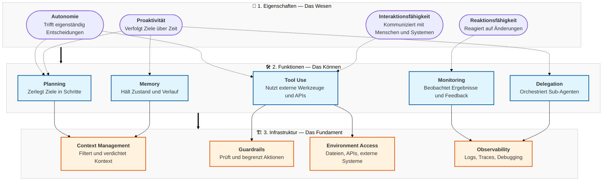

# Agenten-Dimensionen
{: .no_toc }

> **Drei Ebenen, die einen KI-Agenten vollständig beschreiben**       

---

Ein KI-Agent lässt sich entlang von drei Ebenen strukturieren: seinen grundlegenden **Eigenschaften**, den daraus abgeleiteten **Funktionen** und der **Infrastruktur**, die den stabilen Betrieb ermöglicht. Diese Ebenen bauen aufeinander auf — ohne ein solides Fundament können Funktionen nicht zuverlässig ausgeführt werden, und ohne Funktionen bleiben Eigenschaften abstrakt.

---

## Ebene 1 — Eigenschaften

Die Eigenschaften beschreiben das **Wesen** eines Agenten: was ihn von einem einfachen Chatbot oder einer klassischen Anwendung unterscheidet.

| Eigenschaft | Bedeutung |
|-------------|-----------|
| **Autonomie** | Der Agent trifft Entscheidungen ohne explizite Schritt-für-Schritt-Anweisung |
| **Reaktionsfähigkeit** | Er erkennt Veränderungen in seiner Umgebung und passt sein Verhalten an |
| **Proaktivität** | Er verfolgt Ziele aktiv über mehrere Schritte hinweg |
| **Interaktionsfähigkeit** | Er kommuniziert mit Menschen, anderen Agenten und externen Systemen |

## Ebene 2 — Funktionen

Die Funktionen beschreiben das **Können**: konkrete Fähigkeiten, die ein Agent zur Aufgabenerfüllung benötigt.

| Funktion | Bedeutung |
|----------|-----------|
| **Planning** | Aufgaben in Teilschritte zerlegen und priorisieren |
| **Memory** | Zustand, Verlauf und Kontext über Zeit speichern |
| **Tool Use** | Externe Werkzeuge, APIs und Dienste aufrufen |
| **Monitoring** | Eigene Ergebnisse beobachten und auf Feedback reagieren |
| **Delegation** | Teilaufgaben an spezialisierte Sub-Agenten übergeben |

## Ebene 3 — Infrastruktur

Die Infrastruktur beschreibt das **Fundament**: technische Rahmenbedingungen, die zuverlässigen Betrieb ermöglichen.

| Komponente | Bedeutung |
|------------|-----------|
| **Context Management** | Relevante Informationen filtern, verdichten und priorisieren |
| **Guardrails** | Aktionen auf Sicherheit und Korrektheit prüfen, ggf. blockieren |
| **Environment Access** | Kontrollierten Zugriff auf Dateien, APIs und Betriebssystem bereitstellen |
| **Observability** | Logs, Traces und Debugging-Werkzeuge für Transparenz und Nachvollziehbarkeit |
