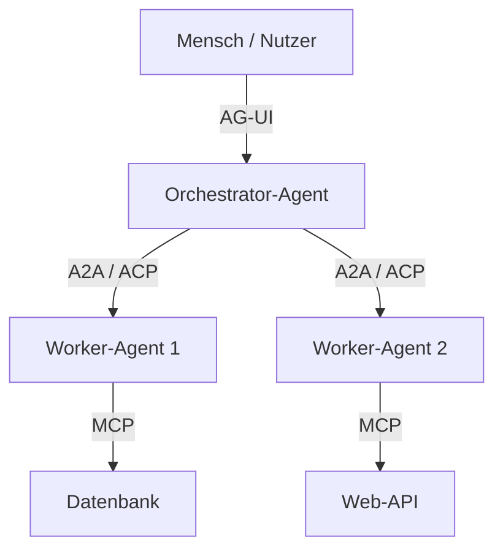
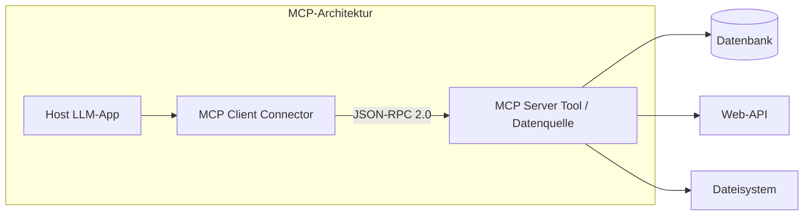
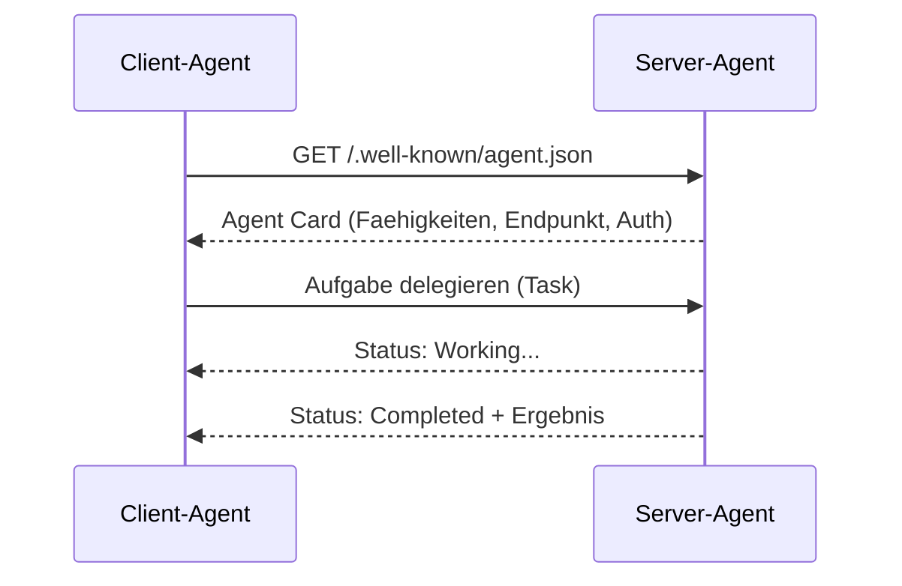
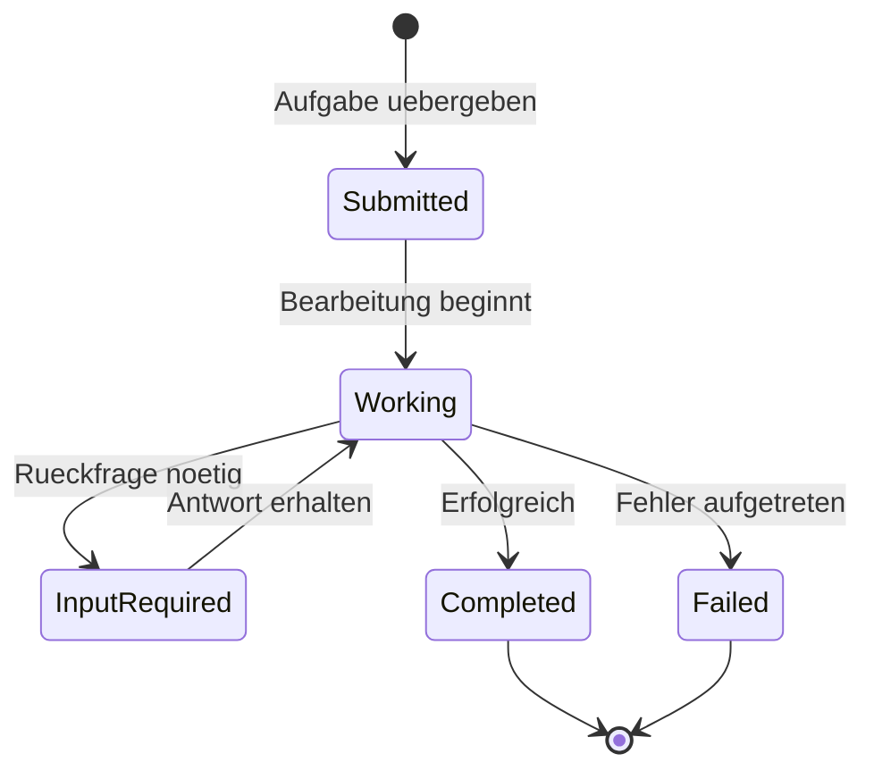
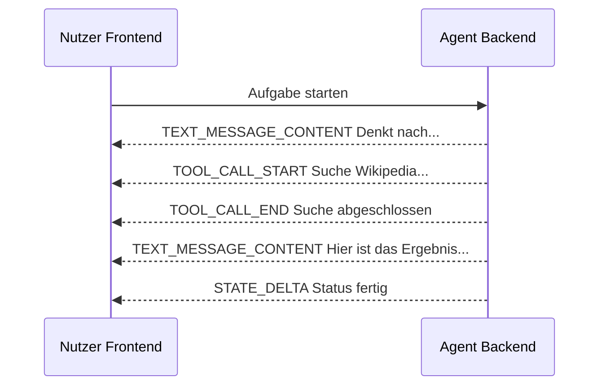
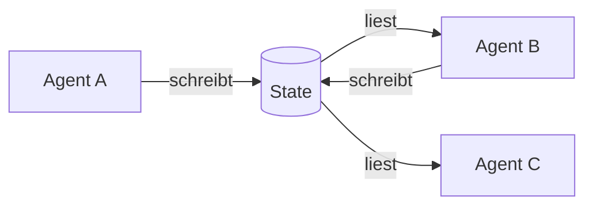
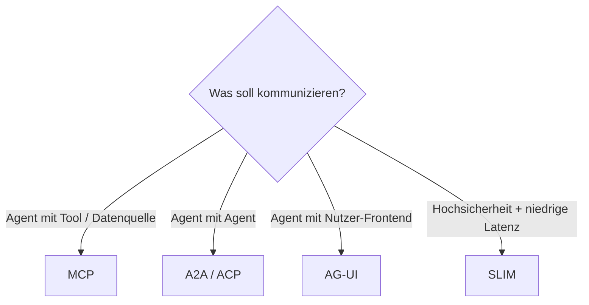
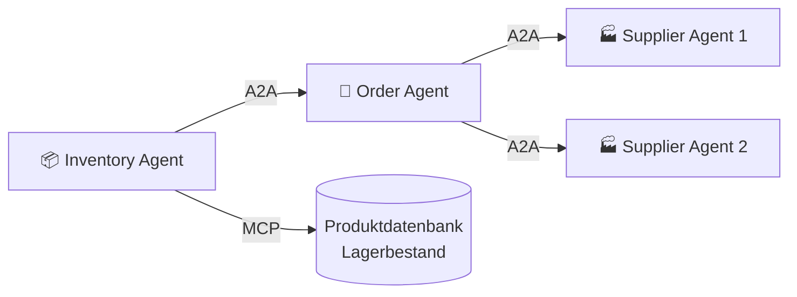
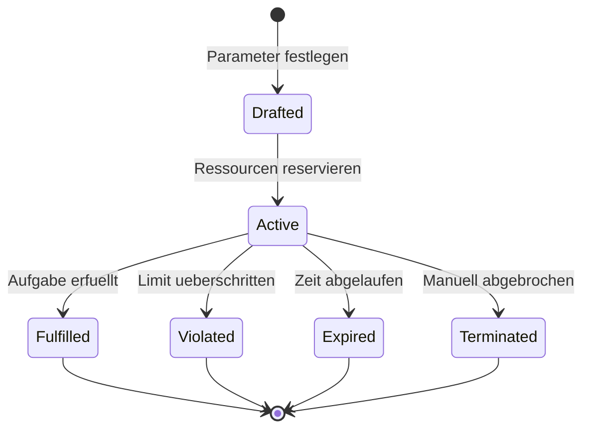

# Agenten-Kommunikation
{: .no_toc }

> **Wie KI-Agenten miteinander und mit Tools kommunizieren – MCP, A2A, ACP und AG-UI im Überblick**    

---

# Inhaltsverzeichnis
{: .no_toc .text-delta }

1. TOC
{:toc}

---

## Warum brauchen Agenten Protokolle?

Ein einzelner KI-Agent kann heute beeindruckende Dinge – aber kein einzelnes Modell kann alles. In der Praxis arbeiten spezialisierte Agenten zusammen: Ein Agent recherchiert, ein anderer analysiert, ein dritter schreibt den Bericht. Damit das funktioniert, brauchen sie eine gemeinsame Sprache.

**Protokolle sind genau das:** standardisierte Regeln, die festlegen, wie Nachrichten aufgebaut sind, was sie bedeuten und in welcher Reihenfolge sie ausgetauscht werden. Ohne solche Regeln wäre jede Verbindung zwischen Agenten eine aufwändige Einzelintegration.

Ein Vergleich aus der Netzwerktechnik hilft: TCP/IP hat das Internet möglich gemacht, indem es definierte, wie Datenpakete übertragen werden – unabhängig davon, welche Geräte kommunizieren. Agenten-Protokolle spielen heute eine ähnliche Rolle für die KI-Welt. Dieser „TCP/IP-Moment für KI“ markiert den Übergang von experimentellen Einzellösungen hin zu einer stabilen, skalierbaren Infrastruktur.

---

## Drei Kommunikationsebenen

Die Protokoll-Landschaft lässt sich in drei Schichten einteilen, je nachdem, wer mit wem kommuniziert:

| Ebene | Wer kommuniziert? | Protokoll |
|-------|-------------------|-----------|
| **Tool-Integration** | Agent mit Werkzeug / Datenquelle | MCP |
| **Agenten-Kooperation** | Agent mit Agent | A2A, ACP |
| **Nutzer-Interaktion** | Agent mit Mensch / Frontend | AG-UI |

---

## Kurze Geschichte: Von KQML zu MCP

Die Suche nach einer universellen Agentensprache ist nicht neu. Bereits in den 1990er Jahren entstanden erste Standards:

- **KQML** (1990er): Eines der ersten Protokolle für Agentenkommunikation. Führte das Konzept von „Facilitator-Agenten“ ein, die als Vermittler zwischen Agenten fungieren.
- **FIPA-ACL** (1997+): Vom FIPA-Konsortium entwickelt, mit stärkerer Standardisierung für industrielle Anwendungen.

Beide Protokolle basierten auf der **Sprechakttheorie**: Nachrichten sind nicht nur Daten, sondern Handlungen – ein Agent „fragt“, „befiehlt“ oder „informiert“. Das war ein kluger Ansatz, scheiterte aber an der damaligen Infrastruktur.

Erst mit dem Durchbruch großer Sprachmodelle (LLMs) wird diese Idee wieder relevant – denn LLMs können die Bedeutung strukturierter Nachrichten viel besser verarbeiten als frühere regelbasierte Systeme. Seit 2024 erleben Agenten-Protokolle daher eine Renaissance.

| Protokoll | Jahr | Besonderheit |
|-----------|------|-------------|
| KQML | ~1993 | Erster offener Standard, Facilitator-Konzept |
| FIPA-ACL | 1997 | Stärkere Standardisierung, industriell ausgerichtet |
| MCP | 2024 | Tool-Integration für LLM-Agenten, von Anthropic |
| A2A | 2025 | Agent-zu-Agent-Kommunikation, von Google / Linux Foundation |

---

## MCP – Model Context Protocol

### Was ist MCP?

Das **Model Context Protocol (MCP)** wurde von Anthropic im November 2024 eingeführt und hat sich schnell als Standard für die Verbindung von Agenten mit Tools und Datenquellen etabliert.

**Das Problem, das MCP löst:** Früher brauchte jede Verbindung zwischen einem Agenten und einem Tool (z. B. Slack, Google Drive, eine Datenbank) eine individuelle Integration. MCP definiert eine einheitliche Schnittstelle: Integration einmal schreiben, überall nutzen.

### Die drei MCP-Abstraktionen

MCP stellt drei Typen von Schnittstellen bereit:

| Typ | Beschreibung | Beispiel |
|-----|-------------|---------|
| **Resources** | Daten lesen (schreibgeschützt) | Dateiinhalt, API-Antwort |
| **Tools** | Aktionen ausführen | Datei schreiben, E-Mail senden |
| **Prompts** | Wiederverwendbare Vorlagen | Analyse-Prompt, Übersetzungs-Vorlage |

### MCP und traditionelle APIs

MCP und REST-APIs sind keine Konkurrenten — sie sind **Schichten im KI-Stack**:

| | MCP | REST API |
|---|---|---|
| **Zweck** | Speziell für LLM-Agenten entworfen | Allgemein, nicht KI-spezifisch |
| **Discovery** | Dynamisch — Agent fragt zur Laufzeit: „Was kannst du?" | Statisch — Client-Code muss bei Änderungen aktualisiert werden |
| **Standardisierung** | Jeder MCP-Server spricht dasselbe Protokoll | Jede API hat eigene Endpoints, Parameter, Auth-Schemas |
| **Integration** | 5 MCP-Server = dieselben Aufrufe | 5 REST-APIs = 5 individuelle Adapter |

In der Praxis **wrappen viele MCP-Server intern eine REST-API**. Der MCP-GitHub-Server etwa übersetzt `repository/list` intern in den entsprechenden GitHub-REST-Aufruf. MCP ist das KI-freundliche Interface oben — die bestehende API bleibt die Implementierung darunter. Beide Schichten koexistieren.

### Effizienz durch intelligentes Laden

Statt alle Tool-Definitionen vorab in das Kontextfenster des Modells zu laden (was bei hunderten Tools extrem teuer wäre), kann der Agent Tools bei Bedarf laden und Daten vorverarbeiten. In der Praxis konnte der Token-Verbrauch dadurch von 150.000 auf 2.000 Token gesenkt werden – eine Ersparnis von über 98 %.

**Dynamic Discovery** geht noch weiter: Der Agent holt bei jedem Verbindungsaufbau die aktuelle Capabilities-Liste vom Server (`tools/list`, `resources/list`, `prompts/list`). Neue Server-Features werden damit automatisch verfügbar — ohne Code-Redeployment auf der Agenten-Seite. Bei traditionellen REST-APIs müsste ein Entwickler den Client-Code manuell anpassen, wenn neue Endpoints hinzukommen.

### Sicherheit

Da MCP Zugriff auf Dateisysteme und die Ausführung von Code ermöglicht, ist Sicherheit zentral. Das Protokoll setzt auf **explizite Nutzer-Zustimmung**: Jeder Zugriff muss autorisiert werden. Trotzdem bleiben Bedrohungen wie Prompt-Injection aktive Forschungsfelder.

---

## A2A – Agent2Agent Protocol

### Was ist A2A?

Während MCP die Verbindung zwischen Agent und Tool regelt, löst **A2A (Agent2Agent Protocol)** die Kommunikation zwischen autonomen Agenten. Google Cloud startete das Projekt im April 2025, heute wird es unter der Linux Foundation als offener Standard weiterentwickelt.

Das Ziel: Agenten verschiedener Hersteller und Frameworks sollen eine „gemeinsame Sprache sprechen”, unabhängig davon, ob sie in LangGraph, AutoGen oder CrewAI implementiert sind.

**Modalitätsagnostische Kommunikation:** A2A-Nachrichten sind nicht auf Text beschränkt. Agenten können Bilder, Dateien und strukturierte Daten austauschen — unabhängig davon, welche Modalität jeder Agent primär verarbeitet. Ein Text-Agent und ein Bild-Agent können direkt zusammenarbeiten: einer generiert ein Design-Mockup, der nächste reviewt es, ein dritter holt die Kundenfreigabe ein. Alles im selben Flow.

### Drei Phasen einer A2A-Interaktion

Eine typische A2A-Kommunikation durchläuft drei explizite Phasen:

| Phase | Was passiert | Schlüsselelement |
|-------|-------------|-----------------|
| **1. Discovery** | Client-Agent findet den Remote-Agent und liest seine Fähigkeiten | Agent Card (`/.well-known/agent.json`) |
| **2. Authentication** | Client-Agent authentifiziert sich beim Remote-Agent | Security Scheme aus der Agent Card |
| **3. Communication** | Client-Agent delegiert den Task, Remote-Agent führt ihn aus | JSON-RPC 2.0 über HTTPS |

**Authentication vs. Authorization:**
Die Phase 2 umfasst zwei getrennte Schritte: Der Client-Agent **authentifiziert** sich (Wer bist du?) anhand des in der Agent Card definierten Security Schemes. Anschließend ist der Remote-Agent für die **Autorisierung** zuständig (Was darfst du?) und gewährt die entsprechenden Zugriffsrechte.

### Agent Cards: Wie Agenten sich vorstellen

**Agent Cards** sind maschinenlesbare Profile, über die ein Agent seine Fähigkeiten ankündigt. Über standardisierte Pfade wie `/.well-known/agent.json` können Agenten diese Karten autonom finden:

Eine Agent Card enthält:
- Name und Beschreibung der Fähigkeiten
- Unterstützte Eingabe-/Ausgabeformate (Text, Audio, Bild)
- Authentifizierungsanforderungen
- Endpunkt-URL und Versionsinformationen

### Aufgaben-Lebenszyklus

A2A ist für langlaufende, asynchrone Aufgaben konzipiert. Ein Task durchläuft folgende Zustände:

### Artifacts

Das Ergebnis einer abgeschlossenen Aufgabe ist kein einfacher String — A2A definiert dafür den Begriff **Artifact**: ein typisiertes, greifbares Ausgabeobjekt, das der Remote-Agent am Ende eines Tasks zurückliefert.

| Artifact-Typ | Beispiel |
|---|---|
| Dokument | Analyse-Report als Markdown oder PDF |
| Strukturierte Daten | JSON mit Suchergebnissen oder Datenbankabfragen |
| Bild | Generiertes Diagramm oder Screenshot |

Artifacts ermöglichen es, Agent-Outputs direkt weiterzuverarbeiten — z. B. als Input für den nächsten Agenten in einer Pipeline.

### Privacy und offene Standards

Ein oft übersehener Vorteil von A2A ist der eingebaute **Schutz der Privatsphäre**: Das Protokoll behandelt Agenten als **opake Einheiten**. Zwei Agenten können zusammenarbeiten, ohne dass einer dem anderen seine internen Abläufe offenlegen muss — kein Zugriff auf internes Memory, proprietäre Logik oder Tool-Implementierungen.

Das ist für Unternehmenseinsatz relevant: Ein externer Hotel-Agent kann mit einem eigenen Reise-Agenten kooperieren, ohne IP oder Kundendaten preiszugeben.

A2A baut konsequent auf etablierten Industriestandards auf (HTTP, JSON-RPC 2.0, SSE), was die Enterprise-Adoption erleichtert. Jeder bestehende Web-Server, API-Gateway oder Load Balancer kann einen A2A-Agenten hosten — wie einen normalen Web-Service. Routing, Security-Layers, Load Balancing und Logging funktionieren ohne Anpassungen, weil A2A auf denselben Mechanismen aufsetzt, die das Web bereits kennt.

---

## ACP – Agent Communication Protocol

### Was ist ACP?

Das **Agent Communication Protocol (ACP)**, ursprünglich von IBMs BeeAI-Projekt entwickelt, verfolgt einen pragmatischen Ansatz: Es nutzt konsequent **REST und Standard-HTTP** – die gleiche Technologie, auf der das gesamte Web aufgebaut ist.

ACP wird auch als „HTTP für KI-Agenten“ bezeichnet. Wer schon einmal eine REST-API genutzt hat, findet sich sofort zurecht.

### Kernmerkmale

| Merkmal | Beschreibung |
|---------|-------------|
| **REST-basiert** | Standard HTTP-Verben (GET, POST, ...) |
| **Kein SDK-Zwang** | Funktioniert mit cURL, Postman oder jedem HTTP-Client |
| **Multimodal** | Unterstützt Text, Audio, Bilder via MIME-Typen |
| **Zustandsbehaftet** | Sessions für mehrteilige Gespräche |

### ACP und A2A – gemeinsam stärker

Im August 2025 wurde ACP offiziell Teil des A2A-Projekts unter der Linux Foundation. Die beiden Protokolle ergänzen sich:

- **A2A** bietet robuste Aufgabensteuerung und Agenten-Discovery
- **ACP** bringt die weit verbreitete REST-Kompatibilität ein

Zusammen bilden sie einen starken Industriestandard, unterstützt von Google, IBM, Microsoft, AWS und Salesforce.

---

## AG-UI – Agent-User Interaction Protocol

### Was ist AG-UI?

**AG-UI** standardisiert die Kommunikation zwischen Agenten-Backends und Nutzer-Frontends. Agentische Aufgaben dauern oft Minuten – der Nutzer will aber nicht einfach warten, sondern sehen, was der Agent gerade tut.

AG-UI nutzt eine **ereignisbasierte Architektur**: Der Agent streamt seinen Fortschritt in Echtzeit an das Frontend.

### Standard-Events

AG-UI definiert ca. 16 Event-Typen, darunter:

| Event | Bedeutung |
|-------|-----------|
| `TEXT_MESSAGE_CONTENT` | Generierter Text wird übermittelt |
| `TOOL_CALL_START` | Agent beginnt Tool-Nutzung |
| `TOOL_CALL_END` | Tool-Ausführung abgeschlossen |
| `STATE_DELTA` | Frontend-Zustand wird synchronisiert |

AG-UI ist kompatibel mit LangGraph, CrewAI und Pydantic AI und unterstützt sowohl Server-Sent Events (SSE) als auch WebSockets.

---

## Kommunikationsmuster in LangGraph und AutoGen

Neben den universellen Protokollen haben populäre Frameworks eigene interne Kommunikationsmuster:

### LangGraph: Kommunikation über geteilten State

In LangGraph kommunizieren Agenten nicht direkt miteinander – sie lesen und schreiben einen **gemeinsamen Zustand (State)**. Jeder Knoten (Agent) empfängt den aktuellen State und gibt eine aktualisierte Version zurück.

**Vorteil:** Kein komplexes Nachrichten-Routing nötig.
**Anforderung:** Das State-Schema muss klar definiert sein.

### AutoGen: Direkte Nachrichten und Broadcast

AutoGen nutzt zwei Kommunikationsmuster:
- **Direct Messaging:** Agent A sendet direkt an Agent B (für Request/Response)
- **Broadcast:** Agent veröffentlicht an ein Thema, alle Abonnenten empfangen es (für Pub/Sub)

---

## Protokolle im Vergleich

### Wann welches Protokoll?

### Vergleichübersicht

| Protokoll | Einsatzbereich | Technologie | Stärke |
|-----------|---------------|-------------|--------|
| **MCP** | Agent mit Tool | JSON-RPC 2.0 | Universelle Tool-Integration |
| **A2A** | Agent mit Agent | JSON-RPC, SSE | Asynchrone Multi-Agent-Workflows |
| **ACP** | Agent mit Agent | REST / HTTP | Einfachste Integration, kein SDK nötig |
| **AG-UI** | Agent mit Frontend | SSE / WebSocket | Echtzeit-Streaming für UIs |
| **SLIM** | Infrastruktur | gRPC + MLS | Höchste Sicherheit und Performance |

### A2A und MCP im Zusammenspiel

A2A und MCP sind keine Konkurrenten — sie sind komplementäre Schichten:

- **MCP:** Agent ↔ Tool / Datenquelle
- **A2A:** Agent ↔ Agent

**Beispiel Retail:** Der Inventory-Agent nutzt MCP, um Produktdaten und Lagerbestände aus der Datenbank zu lesen und zu schreiben. Erkennt er einen kritischen Mindestbestand, benachrichtigt er per A2A einen Order-Agent — der seinerseits per A2A mit externen Supplier-Agenten kommuniziert, unabhängig von deren Framework oder Hersteller.

> A2A und MCP waren nie Konkurrenten. Sie ergänzen sich — MCP gibt Agenten Kontext, A2A gibt Agenten Kollegen.

---

## Ressourcensteuerung: Agent Contracts

Wenn Agenten autonom zusammenarbeiten, entsteht ein praktisches Problem: Wer stoppt einen Agenten, der in eine Endlosschleife gerät? Wer begrenzt die Kosten?

Das Konzept der **Agent Contracts** schlägt einen formalen Rahmen vor. Ein Vertrag definiert:

- **Eingabe- und Ausgabespezifikationen** – Was wird erwartet?
- **Ressourcenlimits** – Maximales Budget in USD, Token-Limit
- **Zeitgrenzen** – Timeout nach X Sekunden
- **Erfolgskriterien** – Wann gilt die Aufgabe als erledigt?

Für den Produktionseinsatz in Unternehmen ist diese Ebene essenziell – sie schafft Kostentransparenz und verhindert unkontrollierte Endlosläufe.

---

## Zusammenfassung

Agenten-Kommunikationsprotokolle sind das unsichtbare Rückgrat moderner KI-Systeme. Sie ermöglichen erst die Zusammenarbeit zwischen spezialisierten Agenten in komplexen Workflows.

**Die wichtigsten Protokolle auf einen Blick:**

| Protokoll | Merken als... |
|-----------|---------------|
| **MCP** | „Steckdose für Tools“ – universeller Anschluss an Werkzeuge und Daten |
| **A2A / ACP** | „Telefon zwischen Agenten“ – standardisierte Kommunikation in Multi-Agent-Systemen |
| **AG-UI** | „Fenster zum Nutzer“ – Echtzeit-Streaming von Agentenaktivität ins Frontend |

**Empfehlungen für den Einstieg:**

1. **MCP kennenlernen** – heute obligatorisch für jede Tool-Integration
2. **A2A/ACP verstehen** – der zukunftssicherste Standard für Multi-Agent-Workflows
3. **AG-UI einsetzen** – wenn Agenten in eigene Frontend-Anwendungen integriert werden sollen

Der Trend ist klar: Weg von monolithischen KI-Anwendungen, hin zu modularen Ökosystemen aus spezialisierten, vernetzten Agenten. Die hier vorgestellten Protokolle bilden die Grundlage für dieses „Internet der Agenten“.

---

**Version:** 1.0    
**Stand:** März 2026    
**Kurs:** KI-Agenten. Verstehen. Anwenden. Gestalten.     
