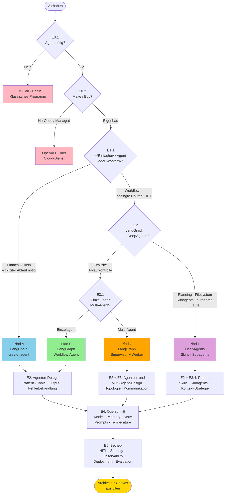

# Architekturentscheidungen – Katalog
{: .no_toc }

> **Vollständige, systematische Liste aller Entwurfsfragen beim Aufbau von KI-Agenten-Systemen mit LangChain / LangGraph / DeepAgents**

---

# Inhaltsverzeichnis
{: .no_toc .text-delta }

1. TOC
{:toc}

---

## Wie benutzt man diesen Katalog

Architekturentscheidungen bauen aufeinander auf. Die Reihenfolge der Abschnitte entspricht der typischen Entwurfsreihenfolge:

```
Ebene 0: Eignet sich ein Agent überhaupt?
Ebene 1: Welches Framework / welche Abstraktion?
Ebene 2: Einzelagent — Pattern, Routing, Tools, Output
Ebene 3: Multi-Agent — Topologie, Rollenarchitektur
Ebene 4: Querschnittsthemen — State, Memory, Kontext, Modell
Ebene 5: Betrieb — Security, HITL, Observability, Deployment
```

Jede Entscheidung folgt diesem Schema:

| Feld | Inhalt |
|------|--------|
| **Frage** | Die konkrete Entwurfsfrage |
| **Optionen** | Die Auswahlmöglichkeiten |
| **Entscheidungsfaktoren** | Was die Wahl bestimmt |

---

## Schnellpfade

Nicht alle Entscheidungen sind für jeden Anwendungsfall relevant. Wähle zuerst den Pfad, der deinem Vorhaben am nächsten kommt — dann bearbeite nur die markierten Abschnitte.

| Abschnitt | Pfad A · Einfacher Agent | Pfad B · Workflow-Agent | Pfad C · Multi-Agent | Pfad D · DeepAgents |
|-----------|:---:|:---:|:---:|:---:|
| **E0** Grundsatz | ✅ | ✅ | ✅ | ✅ |
| **E1.1** LangChain vs. LangGraph | ✅ | ✅ | ✅ | — |
| **E1.2** LangGraph vs. DeepAgents | — | — | — | ✅ |
| **E1.3** Abstraktionsniveau | — | ✅ | ✅ | ✅ |
| **E2** Einzelagent-Design | ✅ | ✅ | ✅ (je Worker) | E2.1, E2.6 |
| **E3** Multi-Agent-Design | — | — | ✅ | E3.4 |
| **E4.1** State-Design | — | ✅ | ✅ | — |
| **E4.2** Checkpointing | — | ✅ | ✅ | — |
| **E4.3** Memory | ✅ | ✅ | ✅ | ✅ |
| **E4.4** Kontext-Management | — | ✅ | ✅ | — |
| **E4.5** Globaler Kontext / Skills | — | — | — | ✅ |
| **E4.6–E4.8** Modell, Temperature, Prompts | ✅ | ✅ | ✅ | ✅ |
| **E5** Betrieb | ✅ | ✅ | ✅ | ✅ |

**Pfad A — Einfacher Agent:** LangChain `create_agent()`, ein Modell, 2–5 Tools, kein persistenter State. Typisch für Q&A, Assistenten, einfache Automatisierungen.

**Pfad B — Workflow-Agent:** LangGraph `StateGraph`, bedingte Kanten, Checkpointing, ggf. Human-in-the-Loop. Typisch für mehrstufige Prozesse mit expliziter Ablaufkontrolle.

**Pfad C — Multi-Agent-System:** Supervisor + spezialisierte Worker, eigener State pro Rolle, LangGraph. Typisch für komplexe Aufgaben mit klarer Rollentrennung (Research, Analyse, Schreiben).

**Pfad D — DeepAgents-Harness:** Planning, Filesystem, Skills on-demand, Subagents. Typisch für längere autonome Läufe mit dynamisch wechselndem Regelwerk.

---

## Entscheidungsbaum

Die folgende Grafik zeigt die fünf zentralen Verzweigungspunkte, die den Architekturpfad bestimmen. Alle Pfade laufen in E4 (Querschnittsthemen) und E5 (Betrieb) zusammen und enden im Canvas.



---

## Ebene 0: Grundsatzentscheidungen

### E0.1 — Eignet sich ein Agent für diese Aufgabe?

| | |
|---|---|
| **Frage** | Löst ein Agent das Problem besser als eine einfache Chain, ein klassisches Programm oder eine direkte API? |
| **Optionen** | Direkter LLM-Call · LCEL-Chain · Agent · Workflow · Klassisches Programm |
| **Entscheidungsfaktoren** | Agent sinnvoll wenn: Entscheidungsweg unbekannt, Tools nötig, mehrstufig, nicht-deterministischer Ablauf. Gegen Agent: klar definierter Ablauf, Latenz-kritisch, kein Tool-Bedarf. |

### E0.2 — Make vs. Buy vs. No-Code

| | |
|---|---|
| **Frage** | Eigener Agent (LangChain/LangGraph), verwalteter Agent (OpenAI Agent Builder) oder Drittlösung? |
| **Optionen** | LangChain/LangGraph (Open Source, maximale Kontrolle) · DeepAgents (Harness für komplexe Agenten) · OpenAI Agent Builder (No-Code) · Cloud-Dienst (Bedrock, Vertex AI Agents) |
| **Entscheidungsfaktoren** | Kontrolle und Anpassbarkeit · Provider-Lock-in · Debugging-Tiefe · Kosten · Deployment-Kontext |

### E0.3 — Provider-Strategie

| | |
|---|---|
| **Frage** | Wird das System an einen einzigen Modell-Provider gebunden oder modellabstrakt gebaut? |
| **Optionen** | Mono-Provider (z. B. nur OpenAI) · modellabstrakt via `init_chat_model()` (gilt für LangChain, LangGraph und DeepAgents) |
| **Entscheidungsfaktoren** | Kostenoptimierung · Ausfallsicherheit · Modellwechsel ohne Code-Änderungen |

---

## Ebene 1: Framework und Abstraktion

### E1.1 — LangChain vs. LangGraph

| | |
|---|---|
| **Frage** | Reicht ein einfacher LangChain-Agent oder brauche ich einen kontrollierten Workflow-Graphen? |
| **Optionen** | LangChain `create_agent()` (einfacher ReAct/Tool-Calling-Agent) · LangGraph `StateGraph` |
| **Entscheidungsfaktoren** | LangChain wenn: einfacher TAO-Loop, keine explizite Ablaufsteuerung nötig. LangGraph wenn: bedingte Routen, Human-in-the-Loop, Checkpointing, Multi-Agent, explizite Schleifenkontrolle. |

### E1.2 — LangGraph vs. DeepAgents

| | |
|---|---|
| **Frage** | Wird der Graph manuell modelliert oder nutze ich einen vorgefertigten Harness? |
| **Optionen** | LangGraph (explizite State Machine) · DeepAgents (Harness mit Planning, Filesystem, Subagents) |
| **Entscheidungsfaktoren** | DeepAgents wenn: Planning über Todo-Mechanismus, Filesystem-Zugriff, Subagents, längere autonome Läufe. LangGraph wenn: präzise Ablaufkontrolle, volle Transparenz, keine Harness-Abhängigkeit. |

### E1.3 — Abstraktionsniveau der Codebasis

| | |
|---|---|
| **Frage** | Sollen Framework-Aufrufe direkt im Anwendungscode stehen oder hinter einer eigenen Abstraktionsschicht? |
| **Optionen** | Direktnutzung (Framework-Aufrufe direkt im Code) · Wrapper/Hilfsmodul (Framework hinter eigener API) · Harness-Erweiterung (z. B. DeepAgents mit eigenen Modulen erweitern) |
| **Entscheidungsfaktoren** | Direktnutzung: einfach, wenig Overhead, Framework-Updates erfordern ggf. viele Stellen. Wrapper: Framework austauschbar, mehr Indirektion. Harness-Erweiterung: Wiederverwendung bei gleichzeitiger Spezialisierung. |

---

## Ebene 2: Einzelagent-Design

### E2.1 — Agenten-Pattern

| | |
|---|---|
| **Frage** | Welches Grundmuster liegt dem Agenten zugrunde? |
| **Optionen** | ReAct (Reasoning + Acting) · Tool-Calling · LCEL-Chain (deterministisch) · Custom StateGraph |
| **Entscheidungsfaktoren** | ReAct/Tool-Calling wenn: LLM soll selbst entscheiden, welche Tools es nutzt. Chain wenn: Ablauf fix. StateGraph wenn: explizite Kontrolle, bedingte Verzweigungen, HITL. |

### E2.2 — Routing-Strategie

| | |
|---|---|
| **Frage** | Wer entscheidet, welcher Pfad als nächstes ausgeführt wird? |
| **Optionen** | Hard-coded (Python if/else) · LLM-driven (Supervisor fragt Modell) · Regelbasiert (Keyword, Score, Threshold) · Kombiniert |
| **Entscheidungsfaktoren** | Hard-coded: deterministisch, wartbar, kein LLM-Aufruf. LLM-driven: flexibel, teurer, schwer testbar. Regelbasiert: schnell, kein LLM, nur für klar definierte Bedingungen. |

### E2.3 — Anzahl und Granularität der Tools

| | |
|---|---|
| **Frage** | Wie viele Tools soll der Agent haben, und wie fein- oder grobkörnig sollen sie sein? |
| **Optionen** | 1 Tool · 2–5 Tools (Standard) · 6+ Tools · Feingranular (je eine Aktion) · Grobgranular (zusammengefasste Operationen) |
| **Entscheidungsfaktoren** | Zu viele Tools = Auswahlfehler des LLM. Zu wenige = mangelnde Flexibilität. Feingranular = besser testbar. Grobgranular = weniger Koordinationsaufwand. |

### E2.4 — Tool-Sichtbarkeit

| | |
|---|---|
| **Frage** | Sieht der Agent immer alle Tools oder werden Tools kontextabhängig ein-/ausgeblendet? |
| **Optionen** | Alle Tools immer sichtbar · Rollenbasierte Tool-Auswahl · Dynamische Tool-Filterung |
| **Entscheidungsfaktoren** | Sicherheit (Tools nur wenn nötig) · Modell-Kontext (zu viele Tools = Rauschen) · Implementierungsaufwand |

### E2.5 — Synchron vs. asynchron

| | |
|---|---|
| **Frage** | Werden Tools und Agent-Calls synchron oder asynchron ausgeführt? |
| **Optionen** | Sync (`.invoke()`) · Async (`.ainvoke()`, `asyncio`) · Parallel (mehrere Tools gleichzeitig) |
| **Entscheidungsfaktoren** | Async wenn: externe APIs mit Wartezeit, mehrere unabhängige Tool-Calls parallelisierbar. Sync einfacher zu debuggen. |

### E2.6 — Ausgabeformat

| | |
|---|---|
| **Frage** | Gibt der Agent Freitext, strukturierten Output oder beides zurück? |
| **Optionen** | Freitext · Strukturiert via `with_structured_output(PydanticModel)` · Streaming · Mixed (Text + Artefakt) |
| **Entscheidungsfaktoren** | Strukturiert wenn: Output maschinell weiterverarbeitet wird, Validierung nötig. Streaming wenn: Echtzeit-Feedback für User. Freitext wenn: Flexibilität wichtiger als Parsing. |

### E2.7 — Fehlerbehandlung in Tools

| | |
|---|---|
| **Frage** | Was soll passieren, wenn ein Tool fehlschlägt? |
| **Optionen** | Exception weiterleiten · Fehler als String zurückgeben · Retry (exponential backoff) · Fallback-Tool · Agent eskaliert zu Mensch |
| **Entscheidungsfaktoren** | Kritikalität der Aktion · Wiederholbarkeit · User Experience (Fehlermeldung vs. stille Korrektur) |

### E2.8 — Iterationskontrolle

| | |
|---|---|
| **Frage** | Wie wird verhindert, dass der Agent in eine Endlosschleife gerät? |
| **Optionen** | `recursion_limit` (LangGraph) · Max-Steps im Prompt · Timeout · Expliziter Abbruchpfad im Graphen |
| **Entscheidungsfaktoren** | Zu niedrig = Agent bricht zu früh ab. Zu hoch = unkontrollierter Ressourcenverbrauch. |

---

## Ebene 3: Multi-Agent-Design

### E3.1 — Brauche ich mehrere Agenten?

| | |
|---|---|
| **Frage** | Wann ist ein einzelner Agent nicht mehr ausreichend? |
| **Optionen** | Einzelagent mit vielen Tools · Supervisor + Worker · Hierarchische Teams · Peer-to-Peer |
| **Entscheidungsfaktoren** | Multi-Agent wenn: Rollen klar trennbar, Kontextisolation nötig, parallele Bearbeitung gewünscht, verschiedene Modelle pro Rolle sinnvoll. |

### E3.2 — Multi-Agent-Topologie

| | |
|---|---|
| **Frage** | Wie sind die Agenten miteinander verbunden? |
| **Optionen** | Flacher Supervisor (1:N) · Hierarchisch (Supervisor-of-Supervisors) · Pipeline (A→B→C) · Peer-to-Peer (Agenten kommunizieren direkt) |
| **Entscheidungsfaktoren** | Flach: einfach, gut für 2–5 Worker. Hierarchisch: skaliert für komplexe Systeme. Pipeline: deterministisch, wenig Koordination. Peer-to-Peer: selten, schwer zu kontrollieren. |

### E3.3 — Supervisor-Implementierung

| | |
|---|---|
| **Frage** | Implementiere ich den Supervisor als StateGraph mit Nodes oder als Tool-calling-Agent? |
| **Optionen** | StateGraph (Supervisor als expliziter Node mit Routing-Funktion) · Tool-calling Supervisor (Worker als Tools des Supervisor-LLMs) |
| **Entscheidungsfaktoren** | StateGraph: mehr Kontrolle, explizite Kanten, besser für tiefe Hierarchien. Tool-calling: einfacher zu implementieren, skaliert besser für flache Systeme. |

### E3.4 — Skills vs. Subagents vs. Worker-Nodes

| | |
|---|---|
| **Frage** | Ist die spezialisierte Komponente ein Skill (Regelladung), ein Subagent (eigene Rolle) oder ein Worker-Node (Graph-Knoten)? |
| **Optionen** | Tool (deterministisch, kein LLM) · Skill (on-demand Regelladung via `SKILL.md`) · Subagent (`subagents=[...]`, eigenes Modell/Kontext) · Worker-Node (LangGraph-Knoten, Python-Funktion intern) |
| **Entscheidungsfaktoren** | Tool wenn: deterministische Funktion. Skill wenn: situativ nötiges Wissen, ein Agent bleibt Hauptsteuerung. Subagent wenn: Rollenarchitektur, eigenes Modell, Kontextisolation. Worker-Node wenn: LangGraph-Workflow, explizite Steuerung. |

### E3.5 — Kommunikationsprotokoll zwischen Agenten

| | |
|---|---|
| **Frage** | Wie kommunizieren Agenten miteinander — über SharedState, Messages oder direkte Rückgaben? |
| **Optionen** | Shared State (TypedDict, alle lesen/schreiben) · Message-basiert (Nachrichten im `messages`-Feld) · Direktrückgabe (Output eines Agents = Input des nächsten) · Handoffs (expliziter Rollenwechsel via `Command`) |
| **Entscheidungsfaktoren** | Shared State: einfach, aber Kollisionsgefahr. Messages: Standard für LangGraph-Agenten. Handoffs: für zustandsabhängige Rollenwechsel. |

### E3.6 — Parallelisierung

| | |
|---|---|
| **Frage** | Können Worker-Agenten parallel statt sequentiell ausgeführt werden? |
| **Optionen** | Sequentiell · Parallel (LangGraph `Send`-API) · Fan-out / Fan-in |
| **Entscheidungsfaktoren** | Parallel wenn: Worker sind voneinander unabhängig, Latenz-Optimierung wichtig. Erfordert Thread-sichere State-Reducer. |

---

## Ebene 4: Querschnittsthemen

### E4.1 — State-Design

| | |
|---|---|
| **Frage** | Welche Felder gehören in den Graph-State, und welche Reducer werden benötigt? |
| **Optionen** | Minimaler State (nur `messages`) · Erweiterter State (task-spezifische Felder) · Reducer `add_messages` · Reducer `overwrite` · Custom Reducer |
| **Entscheidungsfaktoren** | Nur speichern was tatsächlich benötigt wird. `add_messages` für akkumulierende Listen. Eigene Reducer für komplexe Merge-Logik. |

### E4.2 — Checkpointing und Session-Persistenz

| | |
|---|---|
| **Frage** | Soll der Agent-Zustand über Anfragen hinweg erhalten bleiben? |
| **Optionen** | Kein Checkpointing (zustandslos) · MemorySaver (In-Memory, Dev) · SQLiteSaver (Datei, Staging) · PostgresSaver (Produktion) |
| **Entscheidungsfaktoren** | MemorySaver reicht für Demo und Tests. SQLite für persistente Entwicklung. Postgres für Produktion mit mehreren Instanzen. |

### E4.3 — Memory-Architektur

| | |
|---|---|
| **Frage** | Was soll der Agent sich über eine Session hinaus merken? |
| **Optionen** | Kein Memory (zustandslos) · In-Context (Nachrichten-History) · InMemoryStore (Key-Value) · Vektordatenbank (semantische Suche) · Externes System (DB, CRM) |
| **Entscheidungsfaktoren** | Kurze Sessions: In-Context reicht. Nutzer-spezifische Präferenzen: Store. Wissensabfragen: Vektor-DB. Persistenz über Deployments: externe DB. |

### E4.4 — Kontext-Management im Langläufer

| | |
|---|---|
| **Frage** | Wie verhindert man Context-Window-Overflow bei langen Konversationen? |
| **Optionen** | Kein Management (riskant) · Trimming (älteste Nachrichten löschen) · Summarization (Zusammenfassung statt Rohtext) · RAG (externe Dokumente bei Bedarf laden) |
| **Entscheidungsfaktoren** | Trimming: einfach, aber Informationsverlust. Summarization: mehr Arbeit, besser für lange Workflows. RAG: für externes Wissen. |

### E4.5 — Globaler Kontext vs. Progressive Disclosure

| | |
|---|---|
| **Frage** | Sollen Regeln und Wissen immer geladen werden oder nur bei Bedarf? |
| **Optionen** | Globaler Kontext (immer im System-Prompt) · Skills on-demand (`SKILL.md`, `skills=[...]`) · Hybrid (globale Basis + selektive Skills) |
| **Entscheidungsfaktoren** | Global wenn: Regeln immer gelten müssen. Skills wenn: Spezialwissen situativ nötig, Kontext-Window schonen. Hybrid für komplexe Systeme. |

### E4.6 — Modellwahl pro Rolle

| | |
|---|---|
| **Frage** | Soll für alle Rollen dasselbe Modell verwendet werden oder verschiedene Modelle je nach Anforderung? |
| **Optionen** | Einheitsmodell · Spezialisierung: Router/Judge vs. Worker |

| Rolle | Empfehlung | Grund |
|-------|-----------|-------|
| Router / Supervisor / Judge | `o3` / `o3-mini` | Kritische Entscheidungen, kein `temperature` |
| Worker / Content / RAG | `gpt-5.4-mini` / `gpt-5.4` | Textqualität, Synthese |
| Demo / Grundlagen | `gpt-4o-mini` | Kosten, Einfachheit |

### E4.7 — Temperature und Determinismus

| | |
|---|---|
| **Frage** | Soll das Modell deterministisch oder kreativ antworten? |
| **Optionen** | `temperature=0.0` (deterministisch) · `temperature=0.7–1.0` (kreativ) · Kein Parameter (Reasoning-Modelle: o3, gpt-5.x) |
| **Entscheidungsfaktoren** | Routing/Klassifikation: immer deterministisch (`0.0`). Kreative Aufgaben: höhere Temperature. Reasoning-Modelle (o3, gpt-5.x): Temperature nicht setzen. |

### E4.8 — Prompt-Verwaltung

| | |
|---|---|
| **Frage** | Werden Prompts inline im Code, in externen Dateien oder in einem Prompt-Management-System verwaltet? |
| **Optionen** | Inline im Code · Externe `.md`-Datei (lokal oder GitHub) · `ChatPromptTemplate` · LangSmith Hub |
| **Entscheidungsfaktoren** | Inline: einfach, aber nicht wiederverwendbar. Externe Dateien: versionierbar, wiederverwendbar. LangSmith Hub: zentrale Verwaltung für Teams. |

---

## Ebene 5: Betrieb und Qualität

### E5.1 — Human-in-the-Loop

| | |
|---|---|
| **Frage** | Bei welchen Aktionen braucht es eine menschliche Freigabe? |
| **Optionen** | Kein HITL · Pre-Action-Interrupt (LangGraph: `interrupt()` vor Ausführung · DeepAgents: `interrupt_on`) · Post-Action-Review · Async Approval (asynchrone Freigabe) |
| **Entscheidungsfaktoren** | HITL bei: irreversiblen Aktionen (Löschen, Senden, Zahlen), hohen Kosten, externen Seiteneffekten, Compliance-Anforderungen. |

### E5.2 — Sicherheits-Architektur

| | |
|---|---|
| **Frage** | Welche Sicherheitsmechanismen sind notwendig? |

| Bedrohung | Maßnahme |
|-----------|----------|
| Prompt Injection | System-Prompt-Hardening, Input-Klassifikation |
| PII-Leak | Pre/Post-Processing-Redaktion |
| Tool-Missbrauch | Tool-Gating (HITL oder Rollenprüfung) |
| Endlosschleifen | `recursion_limit` |
| Kostenkontrolle | Token-Budget, Rate Limiting |
| Output-Manipulation | Output-Filtering, Guardrails |

### E5.3 — Observability-Strategie

| | |
|---|---|
| **Frage** | Was wird getrackt und wie? |
| **Optionen** | Kein Tracing · `print()`-Debugging · LangSmith (empfohlen) · Custom-Logging · Kombiniert |
| **Entscheidungsfaktoren** | LangSmith für alle Produktivsysteme. Print für schnelle Entwicklung. `LANGSMITH_PROJECT` pro Projekt. |

### E5.4 — Evaluations-Strategie

| | |
|---|---|
| **Frage** | Wie wird die Qualität des Agenten systematisch gemessen? |
| **Optionen** | Manuelles Testen · Eval-Dataset (LangSmith) · LLM-as-Judge · Unit-Tests für Tools · Regression-Test-Suite |
| **Entscheidungsfaktoren** | Tools immer unit-testen. Agenten-Output mit Eval-Dataset absichern. LLM-as-Judge für subjektive Qualitätskriterien. |

### E5.5 — Deployment-Form

| | |
|---|---|
| **Frage** | In welcher Form wird der Agent deployed? |
| **Optionen** | Skript/Notebook · FastAPI-Endpoint · LangServe · Gradio-UI · Streaming (SSE/WebSocket) · Docker-Container |
| **Entscheidungsfaktoren** | Skript/Notebook: Entwicklung/Demo. FastAPI: API-Integration. Gradio: User-Demo ohne Frontend-Kenntnisse. Streaming wenn Echtzeit-Feedback nötig. Docker für Reproduzierbarkeit. |

### E5.6 — Versionierungs-Strategie

| | |
|---|---|
| **Frage** | Wie werden Modelle, Dependencies und Prompts versioniert? |
| **Optionen** | Keine Pins (immer latest) · `requirements.txt` mit fixierten Versionen · Commit-SHA für GitHub-Skill-Quellen · LangSmith Hub für Prompt-Versionen |
| **Entscheidungsfaktoren** | Produktivsysteme immer mit fixierten Versionen. Commit-SHA für reproduzierbare Skill-Quellen. |

### E5.7 — Fehlerbehandlung auf System-Ebene

| | |
|---|---|
| **Frage** | Wie verhält sich das System bei Modell-Ausfällen, API-Timeouts oder unerwarteten Antworten? |
| **Optionen** | Kein Fallback (fail hard) · Retry mit exponential backoff · Fallback-Modell · Default-Antwort · Eskalation zu Mensch |
| **Entscheidungsfaktoren** | Kritische Systeme brauchen Fallback. Retry sinnvoll bei transienten API-Fehlern. Default-Antwort für Non-Critical-Paths. |

---

## Schnellreferenz: Entscheidungsmatrix

| Situation | Empfohlene Wahl |
|-----------|----------------|
| Einfacher Q&A mit Tool-Zugriff | LangChain `create_agent()` |
| Expliziter, kontrollierbarer Ablauf | LangGraph `StateGraph` |
| Planning, Filesystem, längere Aufgaben | DeepAgents |
| Multi-Skill on-demand | DeepAgents `skills=[...]` |
| Rollenarchitektur, verschiedene Modelle | DeepAgents `subagents=[...]` |
| Supervisor mit 2–5 Workern (flach) | Tool-calling Supervisor (LangGraph) |
| Supervisor mit tiefer Hierarchie | StateGraph Supervisor |
| Deterministische Ausgabe | `with_structured_output(PydanticModel)` |
| Langer Konversationsverlauf | Checkpointing + Memory-Store |
| Wissensabfragen aus Dokumenten | RAG + Vektor-DB |
| Kritische Aktionen | Human-in-the-Loop (LangGraph: `interrupt()` · DeepAgents: `interrupt_on`) |
| Produktionsdeployment | FastAPI + LangSmith + Docker |
| Kosten-Routing: kritisch vs. einfach | o3 für Judge/Router, gpt-5.4-mini für Worker |

---

## Architektur-Canvas

Trage hier deine Entscheidungen ein. Am Ende ergibt sich das Konzeptbild deiner Architektur.

---

### Grundsatz

| Frage | Entscheidung |
|-------|-------------|
| Aufgabentyp (E0.1) | |
| Eigenbau / Harness / No-Code (E0.2) | |
| Provider-Strategie (E0.3) | |

---

### Framework und Abstraktion

| Frage | Entscheidung |
|-------|-------------|
| LangChain vs. LangGraph (E1.1) | |
| LangGraph vs. DeepAgents (E1.2) | |
| Abstraktionsniveau der Codebasis (E1.3) | |

---

### Einzelagent-Design

| Frage | Entscheidung |
|-------|-------------|
| Agenten-Pattern (E2.1) | |
| Routing-Strategie (E2.2) | |
| Anzahl / Granularität Tools (E2.3) | |
| Tool-Sichtbarkeit (E2.4) | |
| Sync / Async (E2.5) | |
| Ausgabeformat (E2.6) | |
| Fehlerbehandlung Tools (E2.7) | |
| Iterationskontrolle (E2.8) | |

---

### Multi-Agent-Design *(nur ausfüllen wenn E3.1 = Multi-Agent)*

| Frage | Entscheidung |
|-------|-------------|
| Topologie (E3.2) | |
| Supervisor-Implementierung (E3.3) | |
| Skills / Subagents / Worker-Nodes (E3.4) | |
| Kommunikationsprotokoll (E3.5) | |
| Parallelisierung (E3.6) | |

---

### Querschnittsthemen

| Frage | Entscheidung |
|-------|-------------|
| State-Felder und Reducer (E4.1) | |
| Checkpointing / Session-Persistenz (E4.2) | |
| Memory-Architektur (E4.3) | |
| Kontext-Management (E4.4) | |
| Globaler Kontext vs. Skills on-demand (E4.5) | |
| Modell Router / Judge (E4.6) | |
| Modell Worker (E4.6) | |
| Temperature-Strategie (E4.7) | |
| Prompt-Verwaltung (E4.8) | |

---

### Betrieb

| Frage | Entscheidung |
|-------|-------------|
| Human-in-the-Loop — wann, wie (E5.1) | |
| Sicherheitsmaßnahmen (E5.2) | |
| Observability / Tracing (E5.3) | |
| Evaluations-Strategie (E5.4) | |
| Deployment-Form (E5.5) | |
| Versionierungs-Strategie (E5.6) | |
| Fehlerbehandlung System-Ebene (E5.7) | |

---

### Architektur-Zusammenfassung

*Kurzbeschreibung in 3–5 Sätzen: Was tut das System, welche Hauptkomponenten hat es, wie sind sie verbunden?*

>

*Skizze der Hauptkomponenten (optional):*

```
[Einstiegspunkt] → [Agent / Supervisor] → [Worker / Tools / Subagents]
                         ↓
                   [State / Memory]
                         ↓
                   [Ausgabe / Deployment]
```

---

## Abgrenzung zu verwandten Dokumenten

| Dokument | Inhalt |
|----------|--------|
| [Agent-Architekturen](https://ralf-42.github.io/Agenten/concepts/Agent_Architekturen.html) | Was die Architekturmuster (ReAct, Tool-Calling, StateGraph, Multi-Agent) sind |
| [DeepAgents Architekturleitlinie](https://ralf-42.github.io/Agenten/frameworks/DeepAgents_Architekturleitlinie.html) | Entscheidungen spezifisch für Skills, Subagents und Harness-Nutzung |
| [Modell-Auswahl Guide](https://ralf-42.github.io/Agenten/frameworks/Modell_Auswahl_Guide.html) | Welches Modell für welche Rolle |
| [Multi-Agent-Systeme](https://ralf-42.github.io/Agenten/concepts/Multi_Agent_Systeme.html) | Koordinationsmuster in Multi-Agent-Architekturen |
| [State Management](https://ralf-42.github.io/Agenten/concepts/State_Management.html) | TypedDict, Reducer, Checkpoint-Backends im Detail |

---

**Version:** 1.1
**Stand:** März 2026
