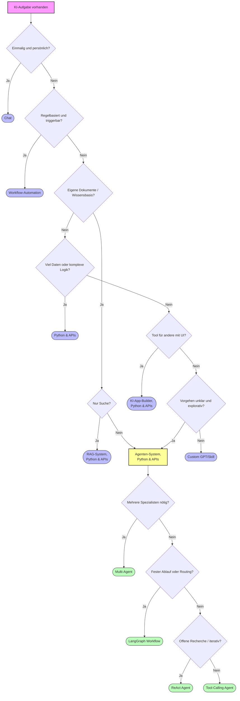

# Welches Werkzeug?
{: .no_toc }

> **Die Aufgabe bestimmt das Tool — und die Architektur.**      
> Erst Lösungsweg klären, dann Agentenarchitektur, dann Datenschutz und Betrieb.

---

# Inhaltsverzeichnis
{: .no_toc .text-delta }

1. TOC
{:toc}

---

## Ziel dieses Dokuments

Dieses Dokument bietet eine **zweistufige Entscheidungslogik**:

1. **Ebene 1 — Lösungsweg:** Braucht diese Aufgabe überhaupt ein Agenten-System, oder reicht ein einfacherer Ansatz?
2. **Ebene 2 — Agentenarchitektur:** Welche Architektur ist die richtige — ReAct, Tool-Calling, LangGraph-Workflow oder Multi-Agent?

Das verhindert Over-Engineering (Agent, obwohl ein Workflow reicht) und Under-Engineering (einfacher Chat, obwohl Autonomie nötig wäre).

---

## Ebene 1: Welcher Lösungsweg?

### Schnellentscheidung (60 Sekunden)

| Wenn die Aufgabe so aussieht | Dann starte hier |
|---|---|
| Einmalig, ad hoc, persönlich | **Chat-Anwendung** |
| Wiederkehrender Prozess mit Triggern | **Workflow-Automation** |
| Fragen über eigene Dokumente / Wissensbasis | **RAG-System** |
| Sehr viele Daten oder komplexe Datenverarbeitung | **Python & APIs** |
| Tool für andere Nutzer mit UI | **KI-App-Builder** |
| Vorgehen unklar, explorativ, mehrstufig, Tools nötig | **→ Agenten-System** |
| Wiederkehrende persönliche Chat-Hilfe | **Custom GPT/Skill** |

> Ausführliche Beschreibung aller Lösungswege: [Aufgabenklassen & Lösungswege (GenAI)](https://ralf-42.github.io/GenAI/concepts/Aufgabenklassen_und_Loesungswege.html)

### Wann ist ein Agenten-System die richtige Wahl?

Ein Agenten-System ist dann sinnvoll, wenn **mindestens zwei** der folgenden Bedingungen zutreffen:

- Das Vorgehen ist nicht vollständig im Voraus definierbar
- Die Aufgabe erfordert den Einsatz von Tools (Suche, Code, APIs, Dateien)
- Mehrere Arbeitsschritte müssen koordiniert werden
- Ergebnisse früherer Schritte beeinflussen den nächsten Schritt
- Fehler sollen erkannt und eigenständig korrigiert werden

**Warnsignale gegen Agenten:**
- Die Aufgabe hat immer denselben festen Ablauf → Workflow-Automation
- Es werden nur eigene Dokumente durchsucht → RAG-System reicht
- Es gibt keine echten Entscheidungspunkte → Python-Skript genügt

---

## Ebene 2: Welche Agentenarchitektur?

Wenn feststeht, dass ein Agenten-System die richtige Wahl ist, folgt die Architekturentscheidung.

### Schnellentscheidung Agentenarchitektur

| Wenn das Agenten-System so aussieht | Dann wähle |
|---|---|
| Einfache Aufgabe, definierte Tools, klarer Auftrag | **Tool-Calling Agent** |
| Offene Recherche, unbekannter Lösungsweg, iterativ | **ReAct Agent** |
| Mehrstufiger Prozess mit fester Reihenfolge oder Routing | **LangGraph Workflow** |
| Aufgabe braucht mehrere Spezialisten parallel oder sequenziell | **Multi-Agent System** |
| Wissensabfrage + Reasoning in einem System kombiniert | **RAG-Agent (Workflow + Retriever)** |

### Architekturdetails

#### Tool-Calling Agent
- **Kernidee:** Das LLM wählt aus einer definierten Tool-Liste und ruft Tools auf
- **Geeignet für:** Assistenten mit festen Fähigkeiten (Kalender, Datenbank, E-Mail)
- **Stärke:** Einfach erweiterbar durch neue Tools, schnell einsatzbereit
- **Grenze:** Kein eigenständiges Planen mehrerer Schritte
- **LangGraph:** `create_agent()` mit Tool-Liste

#### ReAct Agent
- **Kernidee:** Denken → Handeln → Beobachten, iterativer Zyklus bis Ziel erreicht
- **Geeignet für:** Offene Recherche, Debugging, Problemlösung mit unbekanntem Umfang
- **Stärke:** Transparenter Denkprozess, adaptiv bei unerwarteten Ergebnissen
- **Grenze:** Kann bei vielen Iterationen teuer und langsam werden
- **LangGraph:** `create_agent()` mit ReAct-Pattern

#### LangGraph Workflow
- **Kernidee:** Aufgabe als Graph modellieren — Knoten = Verarbeitung, Kanten = Ablauf
- **Geeignet für:** Mehrstufige Prozesse (Research → Analyse → Bericht), Routing nach Kategorie
- **Stärke:** Vorhersagbar, gut testbar, explizite Fehlerbehandlung möglich
- **Grenze:** Anforderungen müssen gut verstanden sein, Ablauf muss modellierbar sein
- **LangGraph:** `StateGraph`, `add_conditional_edges`, Checkpointing

#### Multi-Agent System
- **Kernidee:** Spezialisierte Agenten (Worker) unter Koordination eines Supervisors
- **Geeignet für:** Komplexe Aufgaben mit klarer Arbeitsteilung (Research, Writing, Code, Review)
- **Stärke:** Parallelisierung, Spezialisierung, Fehlertoleranz durch Redundanz
- **Grenze:** Koordination ist aufwändig, höhere Debugging-Komplexität, höhere Kosten
- **LangGraph:** `StateGraph` + Supervisor-Node + Worker-Subgraphen

#### RAG-Agent
- **Kernidee:** LangGraph-Workflow mit integriertem Retrieval aus Vektordatenbank
- **Geeignet für:** Wissensbasierte Fragen über eigene Dokumente + autonome Weiterverarbeitung
- **Stärke:** Kombiniert Wissenstiefe (RAG) mit Flexibilität (Agent)
- **Grenze:** Erhöhte Komplexität bei Chunking, Retrieval und Agent-Logik
- **LangGraph:** Workflow mit Retriever-Node + LLM-Synthese-Node

---

## Vollständiger Entscheidungsbaum

> Legende: **Blau** = Lösungsweg (Ebene 1) · **Grün** = Agentenarchitektur (Ebene 2) · **Gelb** = Verzweigungspunkt

---

## Praxisbeispiele

### Ebene 1 — Lösungsweg

1. **"E-Mail besser formulieren"** → Chat
2. **"Rechnungen automatisch erfassen"** → Workflow-Automation
3. **"Fragen über interne Handbücher"** → RAG-System, Python & APIs
4. **"50.000 Kundenbewertungen auswerten"** → Python & APIs
5. **"Interner HR-Assistent mit UI"** → KI-App-Builder, Python & APIs
6. **"Persönlicher Schreibassistent mit festem Stil"** → Custom GPT/Skill

### Ebene 2 — Agentenarchitektur (d.R. Python & APIs)

| Aufgabe | Begründung | Architektur |
|---|---|---|
| "Finde Informationen zu Thema X im Web" | Offene Recherche, iterativ, unbekannter Umfang | ReAct Agent |
| "Beantworte Kundenanfragen per Kalender und CRM" | Feste Tools, klarer Auftrag | Tool-Calling Agent |
| "Analysiere Code, schlage Refactoring vor, erstelle PR" | Feste Schritte: Analyse → Plan → Umsetzung | LangGraph Workflow |
| "Erstelle Marktanalyse-Report (Research + Text + Grafik)" | Drei Spezialisten, klare Arbeitsteilung | Multi-Agent (Supervisor) |
| "Beantworte Fragen über interne Docs + schlage Maßnahmen vor" | Wissen + Reasoning kombiniert | RAG-Agent |

---

## Häufige Fehlentscheidungen

- **Agenten für triviale Aufgaben:** Wenn der Ablauf immer gleich ist, reicht ein Workflow — Agenten sind teurer und schwerer zu debuggen
- **Multi-Agent zu früh:** Ein einzelner LangGraph-Workflow mit bedingten Kanten löst oft dasselbe Problem einfacher
- **ReAct ohne Kostenkontrolle:** ReAct-Agenten können bei unklaren Aufgaben viele Iterationen machen — immer `recursion_limit` und Budgetgrenzen setzen
- **Tool-Calling statt Workflow:** Wenn die Reihenfolge der Schritte fest ist, einen Workflow verwenden — das gibt mehr Kontrolle und ist besser testbar
- **Datenschutz zu spät bedacht:** Agenten mit Cloud-Modellen senden Daten nach außen — bei kritischen Daten lokale Modelle oder isolierte Umgebungen prüfen
- **Kein Human-in-the-Loop bei kritischen Aktionen:** Agenten, die Dateien löschen, E-Mails senden oder Buchungen vornehmen, müssen eine Bestätigungsstufe haben

---

## Checkliste vor dem Agentenbau

**Ebene 1 — Lösungsweg validiert:**
- [ ] Reicht ein einfacherer Ansatz (Chat, Workflow, RAG)?
- [ ] Ist das Vorgehen wirklich nicht vollständig vorher definierbar?
- [ ] Sind Tools oder Autonomie tatsächlich notwendig?

**Ebene 2 — Architektur gewählt:**
- [ ] Agentenarchitektur bewusst gewählt (nicht einfach Multi-Agent weil es beeindruckend klingt)?
- [ ] Komplexität der Architektur ist durch den Anwendungsfall gerechtfertigt?
- [ ] Gibt es einen Plan für Fehlerbehandlung und Fallbacks?

**Betrieb und Kontrolle:**
- [ ] `recursion_limit` für alle Agenten gesetzt?
- [ ] Kosten- und Tokenkontrolle eingebaut (LangSmith Tracing aktiv)?
- [ ] Human-in-the-Loop für kritische Aktionen definiert?
- [ ] Datenschutzanforderungen: Cloud vs. lokale Modelle entschieden?
- [ ] Monitoring und Alerting für Production-Deployments geplant?

---

## Abgrenzung zu verwandten Dokumenten

| Dokument | Inhalt |
|---|---|
| [Agent-Architekturen](./Agent_Architekturen.html) | Technische Details zu ReAct, Tool-Calling, Workflow, Multi-Agent |
| [Multi-Agent-Systeme](./Multi_Agent_Systeme.html) | Supervisor-Pattern, Hierarchical, Kollaborativ im Detail |
| [Human-in-the-Loop](./Human_in_the_Loop.html) | Wann und wie Menschen eingebunden werden |
| [Modell-Auswahl Guide](../frameworks/Modell_Auswahl_Guide.html) | Welches Modell für welche Rolle im Graph |

---

**Version:** 1.0    
**Stand:** März 2026    
**Kurs:** KI-Agenten. Verstehen. Anwenden. Gestalten.     
