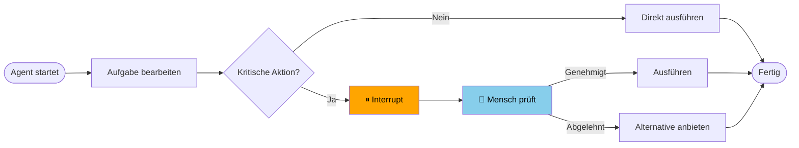
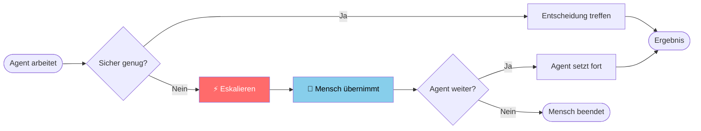

# Human-in-the-Loop
{: .no_toc }

> **Wann und warum KI-Agenten Menschen einbinden sollten**

---

# Inhaltsverzeichnis
{: .no_toc .text-delta }

1. TOC
{:toc}

---

## 1 Kurzüberblick

Ein KI-Agent kann viele Aufgaben eigenständig erledigen — aber nicht jede Entscheidung sollte er alleine treffen. **Human-in-the-Loop (HITL)** bezeichnet das bewusste Einbinden von Menschen in den Ablauf eines Agenten: an definierten Punkten pausiert das System, zeigt den aktuellen Stand und wartet auf eine menschliche Rückmeldung, bevor es weitermacht.

HITL ist kein Zeichen von Schwäche oder fehlender Reife eines Systems — es ist ein **Designprinzip**, das Vertrauen aufbaut und Fehlerkosten kontrolliert.

---

## 2 Das Autonomie-Spektrum

KI-Agenten lassen sich auf einem Spektrum zwischen vollständiger menschlicher Kontrolle und vollständiger Autonomie einordnen:

| Stufe | Beschreibung | Beispiel |
|-------|-------------|---------|
| **Manuell** | Mensch führt alle Schritte aus | Formular manuell ausfüllen |
| **Assistiert** | Agent schlägt vor, Mensch entscheidet | Entwurf generieren, Mensch sendet |
| **Überwacht** | Agent handelt, Mensch prüft kritische Schritte | Buchung vorbereiten, Mensch bestätigt |
| **Beaufsichtigt** | Agent handelt weitgehend autonom, Mensch greift bei Ausnahmen ein | Support-Agent eskaliert komplexe Fälle |
| **Autonom** | Agent handelt vollständig eigenständig | Vollautomatische Datenverarbeitung |

Die meisten produktiven Agenten-Systeme befinden sich bei Stufe 3 oder 4 — nicht weil Technologie fehlt, sondern weil vollständige Autonomie in vielen Kontexten **nicht erwünscht** ist.

{: .important }
> **HITL ist eine Designentscheidung, kein Notbehelf.** Die Frage ist nicht „Kann der Agent das alleine?", sondern „Soll er das alleine entscheiden dürfen?" Autonomie und Kontrolle sind keine Gegensätze — sie werden bewusst abgewogen.

---

## 3 Wann ist HITL sinnvoll?

### 3.1 Entscheidungskritikalität

Je höher die Konsequenzen einer falschen Entscheidung, desto stärker ist HITL gerechtfertigt:

| Aktion | Reversibel? | HITL empfohlen? |
|--------|------------|----------------|
| Textantwort generieren | ✅ ja | ❌ nein |
| E-Mail-Entwurf erstellen | ✅ ja | ⚠️ optional |
| E-Mail versenden | ❌ nein | ✅ ja |
| Daten aus Datenbank lesen | ✅ ja | ❌ nein |
| Datensatz löschen | ❌ nein | ✅ ja |
| Zahlung auslösen | ❌ nein | ✅ ja |
| Konfiguration ändern | ⚠️ bedingt | ✅ ja |

{: .highlight }
> **Faustregel:** Ist eine Aktion schwer oder unmöglich rückgängig zu machen, oder betrifft sie Dritte, braucht sie menschliche Freigabe.

### 3.2 Konfidenz des Agenten

Agenten können unsicher sein — entweder weil die Anfrage mehrdeutig ist, weil die Datenlage unvollständig ist, oder weil mehrere Optionen annähernd gleichwertig erscheinen. In solchen Fällen ist eine Rückfrage sinnvoller als eine zufällig gewählte Antwort.

### 3.3 Compliance und Nachvollziehbarkeit

In regulierten Bereichen (Finanzen, Medizin, Recht, HR) ist menschliche Beteiligung oft **gesetzlich vorgeschrieben** oder aus Haftungsgründen notwendig. HITL erzeugt dabei gleichzeitig einen Audit-Trail.

### 3.4 Vertrauensaufbau

Neue Systeme sollten enger überwacht werden als bewährte. HITL ermöglicht es, das Systemverhalten zu beobachten, bevor mehr Autonomie gewährt wird — ähnlich wie eine Probezeit.

---

## 4 Zwei Grundmuster

### 4.1 Approval-Pattern

Der Agent arbeitet bis zu einem Punkt, pausiert und **fragt um Erlaubnis**, bevor er eine kritische Aktion ausführt.

Typische Einsatzszenarien:
- Freigabe vor dem Versenden von Nachrichten
- Bestätigung vor dem Ausführen von Datenbankoperationen
- Genehmigung von Ausgaben oder Buchungen

### 4.2 Eskalations-Pattern

Der Agent erkennt, dass er an seine Grenzen stößt, und **übergibt den Fall** an einen Menschen, anstatt eine unsichere Entscheidung zu treffen.

Typische Einsatzszenarien:
- Support-Agent eskaliert emotionale oder komplexe Anfragen
- Research-Agent meldet unzureichende Datenlage
- Approval-Agent erkennt Sonderfall außerhalb definierter Regeln

---

## 5 HITL in der Praxis vs. im Debugging

HITL hat zwei verschiedene Einsatzkontexte, die nicht verwechselt werden sollten:

| | **Produktives HITL** | **Debugging-HITL** |
|--|---------------------|-------------------|
| **Zweck** | Sicherheit, Compliance, Vertrauen | Entwicklung, Fehlersuche |
| **Zielgruppe** | Endnutzer, Supervisoren | Entwickler |
| **Auslöser** | Definierte Geschäftsregeln | Manuell konfiguriert |
| **Dauerhaft?** | ✅ ja, Teil des Designs | ❌ nein, temporär |
| **Beispiel** | Zahlung bestätigen | State nach jedem Node inspizieren |

In LangGraph werden beide über denselben Mechanismus (`interrupt_before`) realisiert — aber mit unterschiedlicher Absicht.

---

## 6 Gestaltungsprinzipien

**Klare Interrupt-Punkte definieren**
Nicht jeder Schritt braucht HITL. Definieren Sie explizit, welche Aktionen eine Freigabe erfordern — und welche nicht. Zu viele Interrupts zerstören den Nutzen der Automatisierung.

**Den Menschen gut informieren**
Wer freigeben soll, braucht Kontext: Was hat der Agent bisher getan? Was plant er als nächstes? Welche Konsequenzen hat die Freigabe? Eine gute HITL-UI zeigt genau diese Information.

**Ablehnungen sinnvoll behandeln**
Was passiert, wenn der Mensch die Aktion ablehnt? Der Agent sollte eine Alternative anbieten, nach Erläuterung fragen oder den Prozess geordnet beenden — nicht einfach abstürzen.

**Timeouts berücksichtigen**
Wartet ein Agent zu lange auf menschliche Eingabe, kann das Prozesse blockieren. Produktive Systeme brauchen eine Timeout-Strategie: automatisch eskalieren, erinnern oder abbrechen.

---

## 7 Abgrenzung zu verwandten Konzepten

| Konzept | Unterschied zu HITL |
|---------|-------------------|
| **Checkpointing** | Technischer Mechanismus zur Zustandsspeicherung — ermöglicht HITL, ist aber nicht dasselbe |
| **Supervised Learning** | Menschliches Feedback für Modelltraining, nicht für Laufzeitentscheidungen |
| **Active Learning** | Modell fragt nach gelabelten Beispielen, nicht nach Aktionsgenehmigung |
| **Feedback Loop** | Nachträgliche Bewertung von Ergebnissen — kein Eingriff in den laufenden Prozess |

---

**Version:** 1.0    
**Stand:** März 2026    
**Kurs:** KI-Agenten. Verstehen. Anwenden. Gestalten.    
