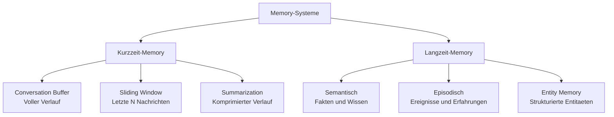
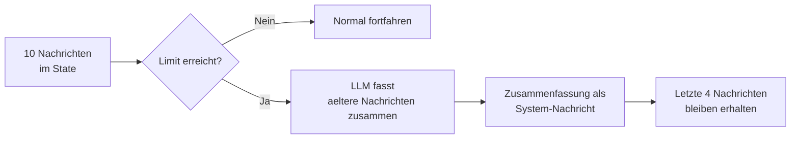
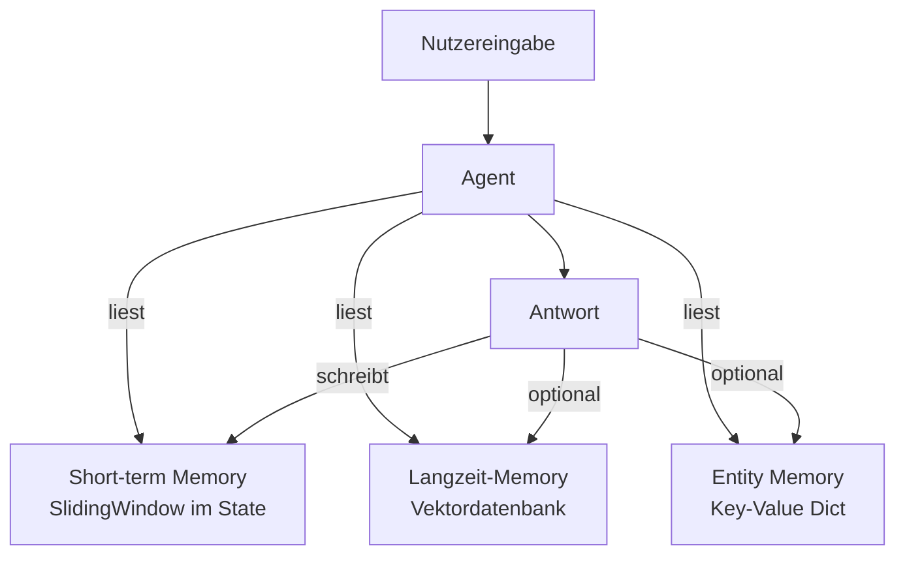

# Memory-Systeme
{: .no_toc }

> **Kurz- und Langzeitgedächtnis für persistente KI-Agenten**

---

# Inhaltsverzeichnis
{: .no_toc .text-delta }

1. TOC
{:toc}

---

## Überblick

Ein LLM hat kein inhärentes Gedächtnis. Ohne explizite Mechanismen vergisst es nach jeder Konversation alles – Nutzerpräferenzen, frühere Entscheidungen, gesammeltes Wissen. **Memory-Systeme** sind die Infrastruktur, die Agenten dauerhaftes Erinnern ermöglicht.

| Problem ohne Memory | Lösung |
|--------------------|--------|
| Jede Konversation beginnt von vorne | Kurzzeit-Memory: Gesprächsverlauf speichern |
| Nutzerpräferenzen gehen verloren | Langzeit-Memory: Fakten persistent ablegen |
| Kontext wächst unbegrenzt | Summarization: Kontext komprimieren |
| Kein Personalisierungspotenzial | Per-User-Memory: nutzerspezifisch speichern |

---

## Taxonomie der Memory-Typen

Aus der kognitiven Psychologie lassen sich verschiedene Gedächtnistypen ableiten – diese Analogie hilft, Agenten-Memory zu strukturieren:



| Memory-Typ | Analogie | Technische Umsetzung |
|-----------|---------|---------------------|
| **Conversation Buffer** | Kurzeitgedächtnis | Vollständige Message-Liste im State |
| **Sliding Window** | Arbeitsgedächtnis | Letzte N Nachrichten behalten |
| **Summarization** | Komprimiertes Gedächtnis | Ältere Nachrichten zusammenfassen |
| **Semantisches Memory** | Faktenwissen | Vektordatenbank (Embeddings) |
| **Episodisches Memory** | Erlebnisgedächtnis | Strukturierte Ereignis-Logs |
| **Entity Memory** | Personengedächtnis | Key-Value für Entitäten |

---

## Kurzzeit-Memory

### Conversation Buffer

Der einfachste Ansatz: alle Nachrichten im LangGraph-State speichern. Kein zusätzliches Setup nötig.

```python
from typing import TypedDict, Annotated
from langgraph.graph.message import add_messages

class ChatState(TypedDict):
    messages: Annotated[list, add_messages]  # Vollständiger Verlauf

def chat_node(state: ChatState) -> ChatState:
    # Das LLM empfängt alle bisherigen Nachrichten als Kontext
    response = llm.invoke(state["messages"])
    return {"messages": [response]}
```

**Grenze:** Das Kontextfenster des LLMs ist begrenzt. Bei langen Konversationen werden die Tokens teuer und irgendwann zu lang für das Modell.

### Sliding Window

Nur die letzten N Nachrichten behalten – ältere werden verworfen.

```python
from langchain_core.messages import trim_messages

def chat_node(state: ChatState) -> ChatState:
    # Nachrichten bis maximal 4000 Token
    trimmed = trim_messages(
        state["messages"],
        max_tokens=4000,
        strategy="last",        # Älteste verwerfen
        token_counter=llm,      # LLM zum Zählen verwenden
        include_system=True,    # System-Prompt immer behalten
        allow_partial=False,
    )
    response = llm.invoke(trimmed)
    return {"messages": [response]}
```

**Grenze:** Ältere Informationen gehen vollständig verloren – bei wichtigen frühen Inhalten problematisch.

### Summarization Memory

Statt ältere Nachrichten zu verwerfen, werden sie komprimiert. Der Kontext bleibt erhalten, der Token-Verbrauch wird begrenzt.

```python
from typing import Optional
from langchain_core.messages import RemoveMessage, SystemMessage

class SummaryState(TypedDict):
    messages: Annotated[list, add_messages]
    summary: str  # Komprimierter Verlauf älterer Nachrichten

def summarize_node(state: SummaryState) -> SummaryState:
    """Komprimiert ältere Nachrichten, wenn Verlauf zu lang wird."""
    messages = state["messages"]

    # Nur komprimieren, wenn mehr als 10 Nachrichten vorhanden
    if len(messages) < 10:
        return {}

    # Zusammenfassung erstellen
    existing_summary = state.get("summary", "Keine bisherige Zusammenfassung.")
    to_summarize = messages[:-4]  # Alle außer den letzten 4 behalten

    prompt = (
        f"Bestehende Zusammenfassung: {existing_summary}\n\n"
        f"Neue Nachrichten zum Einarbeiten:\n"
        + "\n".join(f"{m.type}: {m.content}" for m in to_summarize)
    )
    new_summary = llm.invoke(prompt).content

    # Alte Nachrichten entfernen, Zusammenfassung als System-Nachricht einfügen
    to_remove = [RemoveMessage(id=m.id) for m in to_summarize]
    summary_msg = SystemMessage(
        content=f"Bisheriger Gesprächsverlauf (komprimiert): {new_summary}"
    )

    return {
        "messages": [summary_msg] + to_remove,
        "summary": new_summary
    }
```



---

## Langzeit-Memory

Langzeit-Memory überlebt das Sitzungsende und steht in zukünftigen Gesprächen zur Verfügung.

### Semantisches Memory (Vektordatenbank)

Fakten und Wissen werden als Embeddings gespeichert und bei Bedarf semantisch abgerufen.

```python
from langchain_openai import OpenAIEmbeddings
from langchain_community.vectorstores import Chroma
from langchain_core.tools import tool

# Memory-Store einmalig aufbauen
embeddings = OpenAIEmbeddings(model="text-embedding-3-small")
memory_store = Chroma(
    collection_name="agent_memory",
    embedding_function=embeddings,
    persist_directory="./agent_memory_db"
)

@tool
def memory_speichern(information: str) -> str:
    """MEMORY SPEICHERN – Speichert eine wichtige Information dauerhaft.

    Verwende dieses Tool, wenn der Nutzer etwas Relevantes erwähnt:
    - Präferenzen ("Ich mag keine langen Antworten")
    - Persönliche Fakten ("Ich arbeite als Ärztin")
    - Ziele ("Ich lerne Python für Data Science")

    NICHT verwenden für: flüchtige Konversationsinhalte, kurze Bestätigungen.

    Args:
        information: Die zu speichernde Information in einem präzisen Satz

    Returns:
        Bestätigung der Speicherung
    """
    memory_store.add_texts([information])
    return f"Gespeichert: {information}"

@tool
def memory_abrufen(frage: str) -> str:
    """MEMORY ABRUFEN – Durchsucht das Gedächtnis nach relevanten Informationen.

    Args:
        frage: Suchanfrage in natürlicher Sprache

    Returns:
        Relevante gespeicherte Informationen, oder Hinweis wenn nichts gefunden
    """
    docs = memory_store.similarity_search(frage, k=3)
    if not docs:
        return "Keine relevanten Informationen im Gedächtnis gefunden."
    return "\n".join(f"- {doc.page_content}" for doc in docs)
```

### Entity Memory (Key-Value)

Strukturierte Informationen über Entitäten (Personen, Projekte, Orte) in einem Dictionary.

```python
from pydantic import BaseModel, Field

class EntityMemoryState(TypedDict):
    messages: Annotated[list, add_messages]
    entity_memory: dict  # {"Anna": "Entwicklerin bei Firma X", "Projekt Alpha": "..."}

class Entitaet(BaseModel):
    name: str = Field(description="Name der Entität")
    beschreibung: str = Field(description="Beschreibung in einem Satz")

class EntitaetListe(BaseModel):
    entitaeten: list[Entitaet] = Field(description="Extrahierte Entitäten")

FRAGE_PRAEFIXE = ("was ", "wer ", "wie ", "wo ", "wann ", "warum ", "welche", "kennst")

def entity_extractor_node(state: EntityMemoryState) -> EntityMemoryState:
    """Extrahiert und speichert Entitäten aus der letzten Nachricht."""
    letzte = state["messages"][-1].content.strip()

    # Fragen überspringen – sie enthalten keine neuen Fakten
    if letzte.endswith("?") or letzte.lower().startswith(FRAGE_PRAEFIXE):
        return {}

    extractor = llm.with_structured_output(EntitaetListe)
    result = extractor.invoke(
        f"Extrahiere wichtige Entitäten (Personen, Projekte, Orte) aus:\n{letzte}"
    )

    updated = dict(state.get("entity_memory", {}))
    for e in result.entitaeten:
        # Merge statt überschreiben – neue Info an vorhandene anhängen
        if e.name in updated and e.beschreibung not in updated[e.name]:
            updated[e.name] = updated[e.name] + "; " + e.beschreibung
        else:
            updated[e.name] = e.beschreibung

    return {"entity_memory": updated}
```

---

## Per-User Memory

In Multi-User-Systemen muss Memory nutzerspezifisch gespeichert werden. LangGraph's Checkpointing bildet den natürlichen Rahmen dafür.

```python
from langgraph.checkpoint.sqlite import SqliteSaver
import sqlite3

conn = sqlite3.connect("user_memory.db", check_same_thread=False)
checkpointer = SqliteSaver(conn)
app = graph.compile(checkpointer=checkpointer)

def get_user_config(user_id: str, session_id: str) -> dict:
    """Erstellt nutzerspezifische Konfiguration."""
    return {
        "configurable": {
            "thread_id": f"{user_id}:{session_id}"
        }
    }

# Nutzer A und B haben vollständig getrennten Kontext
result_a = app.invoke(inputs, config=get_user_config("alice", "2025-01"))
result_b = app.invoke(inputs, config=get_user_config("bob",   "2025-01"))
```

### Nutzer-übergreifendes Memory (sitzungsübergreifend)

Wenn ein Nutzer über mehrere Sitzungen hinweg erinnert werden soll:

```python
from langgraph.store.memory import InMemoryStore

# Persistenter Store für user-spezifische Fakten (unabhängig von Sessions)
user_store = InMemoryStore()

def save_user_fact(user_id: str, fact: str):
    """Speichert einen Fakt im nutzerspezifischen Profil."""
    namespace = ("user_profiles", user_id)
    existing = user_store.get(namespace, "facts") or {"facts": []}
    existing["facts"].append(fact)
    user_store.put(namespace, "facts", existing)

def get_user_facts(user_id: str) -> list[str]:
    """Lädt alle Fakten aus dem Nutzerprofil."""
    namespace = ("user_profiles", user_id)
    data = user_store.get(namespace, "facts")
    return data["facts"] if data else []
```

---

## Memory-Strategien kombinieren

In der Praxis kombiniert man verschiedene Memory-Typen je nach Anforderung:



```python
class HybridMemoryState(TypedDict):
    messages: Annotated[list, add_messages]  # Short-term: letzte Nachrichten
    summary: str                              # Short-term: komprimierter Verlauf
    entity_memory: dict                       # Long-term: Entitäten

def chat_with_memory(state: HybridMemoryState) -> HybridMemoryState:
    # Langzeit-Memory zu aktueller Frage abrufen
    long_term = memory_store.similarity_search(
        state["messages"][-1].content, k=2
    )
    memory_context = "\n".join(d.page_content for d in long_term)

    system_msg = (
        "Du bist ein hilfreicher Assistent.\n\n"
        f"Gespeicherte Fakten:\n{memory_context}\n\n"
        f"Bekannte Entitäten: {state.get('entity_memory', {})}\n\n"
        f"Bisheriger Verlauf (komprimiert): {state.get('summary', 'Kein Verlauf')}"
    )

    messages = [{"role": "system", "content": system_msg}] + state["messages"]
    response = llm.invoke(messages)
    return {"messages": [response]}
```

---

## Best Practices

### Strategie nach Anwendungsfall

| Anwendungsfall | Empfohlene Strategie |
|---------------|---------------------|
| Einfacher Chatbot | Conversation Buffer (Sliding Window) |
| Persönlicher Assistent | Buffer + Semantisches Memory |
| Support-Agent | Entity Memory für Kundendaten |
| Research-Agent | Semantisches Memory für Wissensaufbau |
| Multi-Session-Nutzer | Checkpointing + Langzeit-Store |

### Memory-Hygiene

```python
# Relevanzfilter beim Speichern
def sollte_gespeichert_werden(nachricht: str) -> bool:
    """Nur relevante Informationen speichern."""
    if len(nachricht) < 30:
        return False  # Zu kurz (OK, Danke, etc.)
    floskel_woerter = ["ok", "danke", "hallo", "tschüss", "ja", "nein"]
    return not all(w in nachricht.lower() for w in floskel_woerter)
```

### 7.3 Datenschutz beachten

| Empfehlung | Begründung |
|-----------|-----------|
| Keine PII in Vektordatenbank | Embeddings können in Sonderfällen invertiert werden |
| Nutzerkontrolle anbieten | DSGVO: Recht auf Vergessenwerden implementieren |
| Ablaufzeiten setzen | Memory nach definierten Tagen automatisch löschen |
| Verschlüsselung nutzen | Bei sensiblen Daten im persistenten Store |

---

## 8 Zusammenfassung

| Konzept | Beschreibung |
|---------|-------------|
| **Conversation Buffer** | Vollständiger Verlauf im State – einfach, aber begrenzt |
| **Sliding Window** | Letzte N Nachrichten – kontrollierte Größe |
| **Summarization** | Ältere Nachrichten komprimieren – Kontext erhalten |
| **Semantisches Memory** | Vektordatenbank – Faktenwissen über Sitzungen hinweg |
| **Entity Memory** | Key-Value für Entitäten – strukturierte Personalisierung |
| **Per-User Memory** | Thread-IDs + persistenter Store – Multi-User-Systeme |

**Faustregel:**

- **Kurzzeit-Memory** → immer (Conversation Buffer oder Sliding Window)
- **Langzeit-Memory** → bei Personalisierung und Multi-Session-Bedarf
- **Entity Memory** → bei strukturierten Entitäten (CRM-Agenten, Support)

**Verwandte Konzepte:**

- [State Management](./State_Management.html) – Grundlagen des LangGraph-States
- [Checkpointing & Persistenz](./Checkpointing_Persistenz.html) – Technische Basis für Persistenz
- [RAG-Konzepte](./RAG_Konzepte.html) – Vektordatenbanken für Wissensabruf

## Abgrenzung zu verwandten Dokumenten

| Dokument | Inhalt |
|---|---|
| [Checkpointing & Persistenz](https://ralf-42.github.io/Agenten/concepts/Checkpointing_Persistenz.html) | Technische Speicherung des Konversations-States (Kurzzeitgedächtnis im Graph) |
| [State Management](https://ralf-42.github.io/Agenten/concepts/State_Management.html) | Wie Memory-Einträge im Graph-State verankert sind |
| [Human-in-the-Loop](https://ralf-42.github.io/Agenten/concepts/Human_in_the_Loop.html) | Gedächtnis im Kontext menschlicher Kontrolle und Unterbrechungen |


---

**Version:** 1.0
**Stand:** März 2026
**Kurs:** KI-Agenten. Verstehen. Anwenden. Gestalten.
