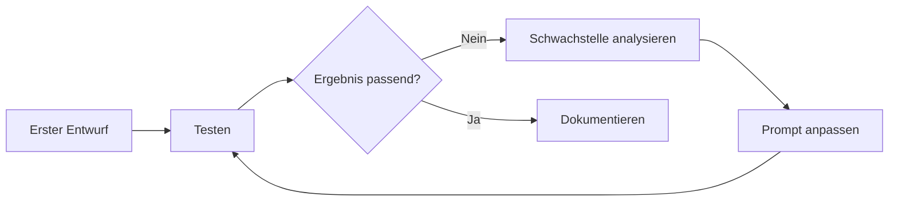

# Wie werden gute Prompts für Agenten aufgebaut?
{: .no_toc }

> **Ein guter Prompt steuert nicht nur Antworten, sondern Verhalten.**

---

# Inhaltsverzeichnis
{: .no_toc .text-delta }

1. TOC
{:toc}

---

## Warum Prompt Engineering für Agenten mehr ist als gutes Formulieren

Ein Prompt ist nicht nur eine Eingabeaufforderung, sondern die wichtigste Steuerungsschicht zwischen Mensch, System und Modell. Bei einem Agenten betrifft das nicht nur einzelne Antworten, sondern Rolle, Grenzen, Tool-Nutzung, Format und Verhalten über mehrere Schritte hinweg.

Genau deshalb ist Prompt Engineering in Agentensystemen wichtiger als in einfachen Chat-Szenarien. Ein unscharfer Prompt erzeugt nicht nur eine schwächere Antwort, sondern oft auch falsche Tool-Wahlen, unklare Eskalation oder inkonsistente Struktur.

Typischer Fehler: Prompts als reines Sprachgefühl zu behandeln. In Agentensystemen wirken sie eher wie leichtgewichtige Verhaltensverträge.

## Ein einfaches Beispiel

Ein Support-Agent soll technische Anfragen beantworten, bei Sicherheitsfragen eskalieren und für Produktfragen auf eine Wissenssuche zugreifen. Ohne klare Prompts bleibt unklar, wann der Agent welches Tool nutzt, wie er seine Rolle versteht und wo seine Grenzen liegen. Mit einem guten System-Prompt und guten Tool-Beschreibungen wird dieses Verhalten deutlich stabiler.

Dieses Beispiel zeigt den Kern: Prompt Engineering bedeutet nicht nur `besser fragen`, sondern `klare Rollen, Regeln und Entscheidungsräume formulieren`.

## Drei grundlegende Prompt-Muster

Zero-Shot bedeutet, dass das Modell ohne Beispiele direkt eine Aufgabe lösen soll. Das reicht für einfache und klare Aufgaben oft aus.

```python
prompt = ChatPromptTemplate.from_messages([
    ("system", "Du bist ein hilfreicher Assistent."),
    ("human", "Klassifiziere die folgende E-Mail als dringend oder normal: {email}")
])
```

Few-Shot ergänzt Beispiele, damit das gewünschte Muster sichtbarer wird. Das ist besonders nützlich, wenn Format oder domänenspezifische Unterscheidungen zuverlässig eingehalten werden sollen.

```python
few_shot_prompt = ChatPromptTemplate.from_messages([
    ("system", "Klassifiziere E-Mails nach Dringlichkeit."),
    ("human", "Betreff: Server ausgefallen"),
    ("assistant", "dringend"),
    ("human", "Betreff: Quartalsbericht verfügbar"),
    ("assistant", "normal"),
    ("human", "Betreff: {email_subject}")
])
```

Chain-of-Thought versucht, schrittweises Denken explizit zu fördern. Das kann bei komplexeren Analysen oder logischen Problemen helfen, sollte aber nicht reflexhaft überall eingesetzt werden.

## System-Prompts bestimmen die Rolle des Agenten

Der System-Prompt ist für Agenten meist wichtiger als der eigentliche Nutzerprompt. Er definiert Rolle, Aufgabenraum, gewünschtes Verhalten und Grenzen. Ein guter System-Prompt beantwortet vier Fragen: Wer ist der Agent, was darf er tun, wie soll er vorgehen und was soll er ausdrücklich nicht tun.

```python
system_prompt = """Du bist ein technischer Support-Agent.

ROLLE:
- Experte für die Produkte X, Y und Z
- Erste Anlaufstelle für technische Fragen

FÄHIGKEITEN:
- Wissenssuche
- Ticket-Erstellung
- Prüfung des Kundenstatus

VERHALTENSREGELN:
- antworte präzise
- frage nach, wenn Informationen fehlen
- eskaliere Sicherheitsfragen

EINSCHRÄNKUNGEN:
- keine Vertragsänderungen
- keine Preiszusagen
"""
```

In der Praxis relevant, wenn: Ein Agent über mehrere Sitzungen oder Aufgaben hinweg konsistent auftreten soll und sein Rollenverständnis nicht von der jeweiligen Nutzerformulierung abhängen darf.

## Schlechte System-Prompts sind oft zu vage oder zu überladen

Ein häufiger Fehler ist ein zu vager Prompt wie `Du bist hilfreich und kompetent`. Das klingt gut, liefert aber kaum belastbare Steuerung. Das Gegenproblem ist ein riesiger System-Prompt, in dem zentrale Regeln zwischen vielen Nebenanweisungen untergehen.

Grenze: Ein System-Prompt kann Verhalten stark prägen, ersetzt aber keine Architektur, kein Tool-Design und keine Sicherheitslogik.

## Tool-Beschreibungen sind Teil des Prompt Engineerings

In Agentensystemen endet Prompt Engineering nicht beim System-Prompt. Auch Tool-Beschreibungen steuern Verhalten. Das Modell entscheidet auf Basis von Name, Beschreibung und Parametern, welches Tool wann passt. Deshalb ist die Qualität der Tool-Dokumentation direkt mit der Qualität des Agentenverhaltens verbunden.

```python
@tool
def search_company_documents(query: str) -> str:
    """🔍 FIRMEN-DOKUMENTENSUCHE – Durchsucht interne Dokumente.

    Verwende dieses Tool für Fragen zu Richtlinien, Prozessen und Handbüchern.
    NICHT geeignet für: Allgemeinwissen, aktuelle Nachrichten, Berechnungen.
    """
    return document_retriever.search(query)
```

Typischer Fehler: Zu glauben, Tool-Design und Prompt Engineering seien getrennte Themen. Für das Modell sind Tool-Beschreibungen selbst Teil des Promptkontexts.

## Formatvorgaben machen Antworten verarbeitbar

Viele Agenten liefern Ergebnisse nicht nur für Menschen, sondern auch für weitere Verarbeitungsschritte. Deshalb ist Output-Formatierung ein zentrales Element von Prompt Engineering. Ein Modell sollte nicht nur inhaltlich antworten, sondern in einer Form, die weiterverarbeitet werden kann.

```python
format_prompt = ChatPromptTemplate.from_template(
    """Analysiere den Text.

Text: {text}

Antworte exakt in diesem Format:
HAUPTTHEMA: [Ein Satz]
KERNAUSSAGEN:
- [Punkt 1]
- [Punkt 2]
STIMMUNG: [positiv/neutral/negativ]
"""
)
```

Für robustere Strukturen ist typisierte Ausgabe oft besser als bloße Formatbitten.

```python
class Analyse(BaseModel):
    hauptthema: str
    kernaussagen: list[str]
    stimmung: str
    konfidenz: float
```

## Rollen helfen, aber ersetzen keine Regeln

Role Prompting kann nützlich sein. Ein Modell reagiert oft stabiler, wenn eine klare Perspektive vorgegeben wird, etwa `Du bist ein erfahrener Entwickler` oder `Du bist eine Fachperson für IT-Recht`. Das hilft besonders bei domänenspezifischen Aufgaben.

Trotzdem bleibt eine Grenze: Eine Rolle allein sagt noch nicht, welche Schritte nötig sind, welche Grenzen gelten oder wann eskaliert werden soll. Rollen helfen dem Ton und der Perspektive, aber sie ersetzen keine expliziten Regeln.

## Iteratives Prompt Design ist normal

Gute Prompts entstehen selten im ersten Versuch. Meist beginnt ein Projekt mit einem einfachen Baseline-Prompt, der getestet und dann schrittweise verfeinert wird.



Diese iterative Arbeit ist kein Zeichen von Unsicherheit, sondern normale Entwicklungspraxis. Entscheidend ist, pro Runde gezielt zu ändern und nicht mehrere Dinge gleichzeitig umzubauen.

## Häufige Fehler

Ambige Anweisungen sind einer der häufigsten Fehler. `Fasse das zusammen` ist weniger wirksam als eine klare Formatvorgabe mit Umfang und Fokus. Ebenso problematisch sind fehlende Beispiele bei komplexen Formaten oder widersprüchliche Anweisungen wie `erkläre kurz und detailliert`.

Typischer Fehler: Ein schlechter Prompt wird durch zusätzliche Länge repariert. Oft ist nicht mehr Text nötig, sondern klarere Priorisierung.

## Was für Einsteiger zuerst wichtig ist

Für Einsteiger reichen oft drei Regeln. Erstens: Rollen und Grenzen explizit formulieren. Zweitens: Ausgabeformate klar vorgeben, wenn Ergebnisse weiterverarbeitet werden sollen. Drittens: Tool-Beschreibungen und System-Prompts als zusammenhängende Steuerung betrachten.

Teilnehmende unterschätzen oft, dass ein guter Prompt nicht poetisch oder besonders clever wirken muss. Er muss verständlich, widerspruchsfrei und für den nächsten Verarbeitungsschritt nützlich sein.

## Abgrenzung zu verwandten Dokumenten

| Dokument | Frage |
|---|---|
| [Wie nutzen Agenten Werkzeuge?](./Tool_Use_Function_Calling.html) | Wie werden Tools technisch definiert und beschrieben, damit der Agent sie korrekt nutzt? |
| [Welche Architektur passt zu diesem Agenten?](./Agent_Architekturen.html) | Welche Agentenarchitekturen brauchen welche Prompt-Strategien? |
| [Skills](./Skills.html) | Wann wird aus einem guten Prompt ein wiederverwendbarer, regelgeleiteter Skill? |

---

**Version:** 1.1<br>
**Stand:** April 2026<br>
**Kurs:** KI-Agenten. Verstehen. Anwenden. Gestalten.
