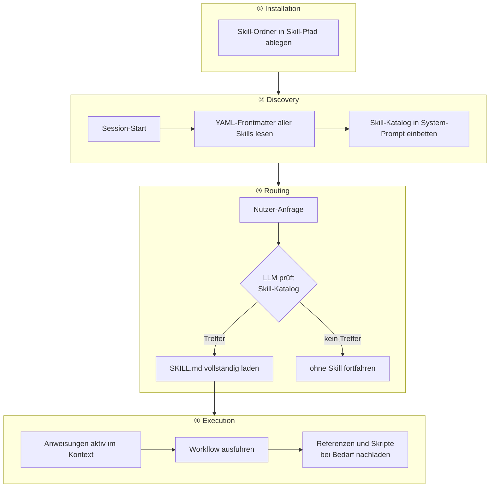

# Skills
{: .no_toc }

> **Wiederverwendbare Arbeitsrezepte für verlässlich gesteuerte KI-Agenten**

---

# Inhaltsverzeichnis
{: .no_toc .text-delta }

1. TOC
{:toc}

---

## Was ist ein Skill?

Ein Skill ist ein **wiederverwendbarer Ablaufbaustein** für einen Agenten. Er beschreibt nicht nur eine Aufgabe, sondern auch wann ein bestimmtes Vorgehen aktiviert wird, welche Schritte verpflichtend sind, welche Regeln und Hilfsmittel verwendet werden — und was der Agent nicht inferieren oder überspringen darf.

Ein Skill ist damit mehr als ein einzelner Prompt. Er operationalisiert Fachwissen als **strukturierte Handlungslogik**.

---

## Prompt vs. Skill

| | Prompt | Skill |
|---|---|---|
| **Zweck** | Einzelne Antwort oder Aufgabe | Wiederverwendbarer Workflow |
| **Struktur** | Freitext | Definierter Ablauf mit Pflichtschritten |
| **Guardrails** | Ad-hoc oder gar nicht | Explizit festgelegt |
| **Referenzen** | Im Prompt selbst | Ausgelagert und gezielt nachladbar |
| **Hilfslogik** | Meist keine | Optional über Skripte oder Tools |
| **Wiederverwendung** | Copy-Paste | Versionierbar und transportierbar |

**Faustregel:** Sobald ein Prozess Pflichtprüfungen, Eskalationsregeln oder dokumentierte Entscheidungen braucht, ist ein Skill meist geeigneter als ein freier Prompt.

---

## Warum sind Skills für Agenten wichtig?

Agenten arbeiten oft in offenen, mehrstufigen Situationen. Genau dort steigt das Risiko, dass wichtige Schritte ausgelassen, Regeln falsch angewendet oder Ergebnisse uneinheitlich formuliert werden.

Skills helfen, dieses Risiko zu reduzieren:

- **Workflow-Orchestrierung:** Der Agent folgt einem definierten Vorgehen statt nur freiem Reasoning.
- **Guardrails:** Kritische Informationen werden aktiv abgefragt und nicht stillschweigend angenommen.
- **Progressive Disclosure:** Detailwissen wird nur bei Bedarf geladen und überfüllt nicht den Kernkontext.
- **Wiederverwendung:** Fachlogik kann zwischen Projekten, Agenten oder Kursmodulen konsistent genutzt werden.
- **Auditierbarkeit:** Entscheidungen werden nachvollziehbarer, weil Regeln und Schritte dokumentiert sind.

Skills sind deshalb besonders nützlich in Bereichen wie **Compliance, Security, Review, Freigabe, Onboarding oder Support mit festen Prüfschritten**.

Zwei weitere Eigenschaften sind für den Praxiseinsatz relevant. **Composability:** Mehrere Skills können gleichzeitig aktiv sein — Claude lädt alle relevanten Skills einer Anfrage parallel, ohne dass sie voneinander wissen müssen. **Portability:** Skills folgen dem offenen [Agent Skills Standard](https://agentskills.io) (Apache 2.0), sodass ein Skill für Claude Code ohne Anpassung auch in VS Code mit Copilot, Cursor und anderen kompatiblen Agenten funktioniert.

---

## Typische Struktur eines Skills

Eine praxistaugliche Skill-Struktur trennt Kernlogik, Referenzwissen und deterministische Hilfslogik.

| Datei / Ordner | Rolle                                                        |
| -------------- | ------------------------------------------------------------ |
| `SKILL.md`     | Kernablauf, Trigger, Guardrails, Verweise — Pflichtdatei     |
| `references/`  | Detailwissen, Checklisten, Regeln, Beispiele — Stufe 3       |
| `scripts/`     | Deterministische Teilaufgaben oder Prüfungen (Py, Bash, JS)  |
| `assets/`      | Statische Ressourcen: Vorlagen, Konfigdateien, Beispielinput |

Beispielhafte Struktur:

```text
skill-name/
  SKILL.md
  references/
    checklist.md
    risk_rules.md
  scripts/
    assess_risk.py
    validate.sh
  assets/
    template.docx
    sample_input.md
```

---

## SKILL.md in Claude Code (Skills 2.0)

In **Claude Code** werden Skills als eigene Verzeichnisse abgelegt. Die `SKILL.md` ist der Einstiegspunkt; weitere Dateien werden nur bei Bedarf geladen.

**Installationspfade:**

| Scope | Pfad | Wann verwenden |
|---|---|---|
| Projektspezifisch | `.claude/skills/<name>/` | Empfohlen — nur für dieses Projekt |
| Global | `~/.claude/skills/<name>/` | Skill in allen Projekten verfügbar |
| Claude.ai | Settings → Features → Skill hochladen (ZIP) | Ohne Claude Code |

```text
.claude/skills/review-pr/
  SKILL.md          # Kernablauf (max. ~500 Zeilen)
  reference.md      # Detailregeln, nachladbar
  examples/
    sample.md
  scripts/
    validate.sh
```

Die `SKILL.md` besteht aus **YAML-Frontmatter** und **Markdown-Inhalt**:

```yaml
---
name: review-pr
description: Prüft Pull Requests auf Code-Qualität und Sicherheit.
             Use when the user asks for a PR review.
context: fork                      # isolierter Subagent-Kontext
agent: general-purpose             # Explore | Plan | general-purpose
disable-model-invocation: true     # nur manuell aufrufbar
allowed-tools: Read, Grep, Glob    # erlaubte Tools
---
```

**Wichtige Frontmatter-Felder:**

| Feld | Bedeutung |
|---|---|
| `description` | Wann Claude den Skill automatisch lädt — präzise formulieren |
| `context: fork` | Skill läuft in eigenem Kontextfenster (Hauptkontext bleibt sauber) |
| `agent` | Subagenten-Typ: `Explore`, `Plan` oder `general-purpose` |
| `disable-model-invocation: true` | Nur manuell per `/skill-name` aufrufbar (nicht durch Claude) |
| `user-invocable: false` | Nur Claude lädt diesen Skill (unsichtbar für Nutzer) |
| `allowed-tools` | Tool-Beschränkung während der Skill aktiv ist |
| `model` | Modell-Override für diesen Skill |
| `license` | Lizenzangabe (z.B. `Apache-2.0`, `MIT`) — Vertrauenssignal bei geteilten Skills |
| `compatibility` | Umgebungsanforderungen (max. 500 Zeichen), z.B. `"Requires Python 3.10+"` |
| `metadata` | Freie Key-Value-Map — empfohlene Keys: `version`, `author`, `last-updated` |

**Pflichtregeln:**

- `name`: 1–64 Zeichen, nur Kleinbuchstaben, Zahlen und Bindestriche — muss exakt dem Verzeichnisnamen entsprechen
- `description`: max. 1.024 Zeichen, keine XML-Tags (`<` oder `>`) — `claude` und `anthropic` im `name` sind reserviert
- Dateiname muss exakt `SKILL.md` lauten (case-sensitive), keine `README.md` im Skill-Verzeichnis

### Die `description` als Trigger-Bedingung

Das `description`-Feld ist **kein beschreibender Text für Menschen** — es ist die Bedingung, anhand derer der Agent entscheidet, ob er den Skill überhaupt aktiviert. Der häufigste Fehler: Man überarbeitet die Anweisungen im SKILL.md-Body, während das eigentliche Problem in diesen zwei Zeilen liegt.

**Formel für eine wirksame `description`:**

```
[Was der Skill tut] + [Wann er ausgelöst wird — mit konkreten Trigger-Formulierungen]
```

| | Beispiel |
|---|---|
| ❌ Zu vage | `Hilft mit Dokumenten.` |
| ❌ Was, aber nicht wann | `Erstellt mehrseitige, professionell formatierte Dokumentation.` |
| ✅ Was + konkrete Trigger | `Erstellt README.md-Dateien für Softwareprojekte. Use when user asks to "write a README", "create a readme", "document this project", "generate project documentation".` |

> [!TIP] Praktische Regel
> Wenn ein Skill nicht automatisch auslöst, zuerst die `description` überarbeiten — nicht die Anweisungen darunter.

**Negative Boundaries:** Eine wirksame `description` definiert auch, was der Skill *nicht* behandelt — z.B. `Do NOT use for: cover letters, job searching`. Ohne diese Abgrenzung aktiviert der Agent den Skill bei thematisch ähnlichen, aber unpassenden Anfragen (Overtriggering).

**Undertriggering:** LLM-basiertes Routing neigt dazu, einfache Anfragen nicht weiterzuleiten, wenn das Modell glaubt, sie direkt beantworten zu können. Komplexe, mehrstufige oder fachspezifische Aufgaben triggern zuverlässiger als einfache Einzelfragen.

**Dynamische Kontextinjektion:** Shell-Befehle mit `!` werden vor dem Laden ausgeführt und ersetzen den Platzhalter:

```markdown
## Aktueller Kontext
- Geänderte Dateien: !`git diff --name-only HEAD~1`
- Installierte Version: !`pip show langchain | grep Version`
```

**String-Substitution:** Argumente aus dem Aufruf werden injiziert:

```markdown
/migrate-component SearchBar React Vue
→ $0 = SearchBar, $1 = React, $2 = Vue
```

**Invocation-Matrix:**

| Einstellung | Wer ruft auf? | Im Kontext geladen? |
|---|---|---|
| Standard | Nutzer + Claude | immer |
| `disable-model-invocation: true` | nur Nutzer | nur bei manuellem Aufruf |
| `user-invocable: false` | nur Claude | immer (Hintergrundwissen) |

### Body Best Practices

Der Markdown-Body ist das Herzstück des Skills. Folgende Prinzipien erhöhen die Wirksamkeit:

| Prinzip | Umsetzung |
|---|---|
| **Quick Reference voran** | Tabelle oder Entscheidungsbaum am Anfang — orientiert den Agenten schnell |
| **Workflows statt Enzyklopädie** | Schritt-für-Schritt-Anleitungen für 90 % der Fälle; Detailwissen in `references/` |
| **Konkrete Beispiele** | ✅/❌-Markierungen für richtige und falsche Muster |
| **Gotchas dokumentieren** | Abschnitt mit bekannten Fallstricken: Symptom + Ursache + Fix |
| **Warum erklären** | LLMs generalisieren besser aus *warum* als aus starren *was*-Regeln |
| **Body unter 500 Zeilen** | Alles weitere in `references/` — wird nur bei Bedarf geladen |

Empfohlene Abschnitte: `## Schnellreferenz` → `## Workflow` (Checkliste) → `## Gotchas` → `## Kritische Regeln`.

> [!NOTE] context: fork nur für Aufgaben-Skills
> `context: fork` ist nur für Aufgaben-Skills sinnvoll (der Subagent braucht eine konkrete Aufgabe). Reine Richtlinien-Skills (z.B. Coding-Konventionen) sollten ohne `fork` laufen.

---

## Wie ein Agent einen Skill nutzt

Der Weg vom Skill-Ordner auf der Festplatte bis zur aktiven Anleitung im Agenten läuft in vier Phasen ab:



### Dreistufiges Ladesystem (Progressive Disclosure)

Skills werden nicht auf einmal geladen — der Agent zieht Inhalte nur bei Bedarf in den Kontext. Das hält den Token-Verbrauch gering, auch bei vielen installierten Skills.

| Stufe | Was wird geladen | Wann | Token-Kosten |
|---|---|---|---|
| **Stufe 1 – Metadaten** | Nur `name` + `description` aus dem YAML-Frontmatter | Immer beim Session-Start | ~100 Token pro Skill |
| **Stufe 2 – Body** | Vollständiger `SKILL.md`-Inhalt | Wenn der Agent den Skill für relevant hält | < 5.000 Token |
| **Stufe 3 – Referenzen & Skripte** | Verlinkte Dateien aus `references/`, ausführbare Skripte aus `scripts/` | Nur wenn der Body darauf verweist und sie gebraucht werden | Praktisch unbegrenzt |

**Konsequenz für die Struktur:** Der Body sollte schlank bleiben. Detailwissen (Checklisten, Regelwerke, API-Muster) gehört in `references/` — es wird nur bei tatsächlichem Bedarf geladen.

**Beispiel-Ablauf:**

```
1. Session startet
   → Agent lädt: name + description aller installierten Skills (~100 Token je)

2. Nutzer fragt: "Kannst du ein README für dieses Projekt schreiben?"
   → Agent lädt: readme-writer/SKILL.md vollständig (Stufe 2)

3. SKILL.md verweist auf references/style.md
   → Agent lädt: references/style.md (Stufe 3)

4. SKILL.md enthält ein Validierungsskript
   → Agent führt aus: scripts/validate.sh (ohne es in den Kontext zu lesen)
```

### Einbindung in den Agenten-Workflow

Die `SKILL.md` wird als steuernder Kontext geladen. Referenzdateien folgen nur bei Bedarf. Deterministische Teilaufgaben werden als Tool oder Skript ausgeführt — ihr Quellcode landet nicht im Kontext, nur ihr Ergebnis. Der Agent kombiniert abschließend Skill-Regeln, Tool-Ergebnisse und Nutzereingaben zu einer kontrollierten Entscheidung.

Das LLM ersetzt dabei nicht die Fachlogik vollständig. Fragile oder risikokritische Teilaufgaben sollten, wenn möglich, **deterministisch** umgesetzt werden.

### Debugging: Wenn ein Skill nicht auslöst

| Schritt | Prüfung |
|---|---|
| **1. `description` überarbeiten** | Enthält sie konkrete Trigger-Formulierungen, die zur Nutzeranfrage passen? Ist die Formel `[Was] + [Wann + Trigger-Phrasen]` erfüllt? |
| **2. Dateipfad prüfen** | Liegt `SKILL.md` exakt unter `.claude/skills/<name>/SKILL.md`? |
| **3. YAML-Syntax prüfen** | Beginnt das Frontmatter auf Zeile 1 mit `---`? Keine unescapten `<>` im Frontmatter? |
| **4. Live File Watching** | Claude Code erkennt Änderungen in Echtzeit — kein Neustart nötig. In anderen Umgebungen (Claude.ai) erst nach Seitenreload aktiv. |
| **5. Debug-Modus** | `claude --debug` zeigt, welche Skills geladen werden. |
| **6. Explizit aufrufen** | `/skill-name` — wenn es explizit funktioniert, aber nicht automatisch, liegt das Problem an der `description`. |

---

## Wann Skills sinnvoll sind und wann nicht

### Skills sind sinnvoll, wenn

- ein Vorgehen wiederholt in ähnlicher Form vorkommt
- Pflichtschritte nicht ausgelassen werden dürfen
- Regeln, Checklisten oder Eskalationen eingehalten werden müssen
- ein Agent auf Fachreferenzen zugreifen soll, ohne alles im System-Prompt zu tragen
- Entscheidungen dokumentierbar und nachvollziehbar sein sollen

### Skills sind meist nicht nötig, wenn

- nur eine einzelne, freie Antwort erzeugt werden soll
- keine festen Prüfschritte existieren
- die Aufgabe rein explorativ und nicht standardisierbar ist
- ein normaler System-Prompt oder Workflow bereits ausreicht

**Bekannte Grenzen:**

- Kein persistentes Memory — jeder Aufruf startet ohne Erinnerung an frühere Interaktionen
- Kein direkter API-Zugriff — externe Calls nur über Tools oder deterministische Skripte
- Modellabhängig — Skill-Effektivität variiert je nach LLM; kleinere Modelle folgen Anweisungen weniger zuverlässig
- Kontextbudget — viele installierte Skills erhöhen den Token-Verbrauch (Stufe 1: ~100 Token pro Skill)

> [!WARNING] Sicherheit bei Community-Skills
> Skills injizieren Instruktionen direkt in das Kontextfenster des Agenten. Ein bösartig gestalteter Skill kann das Verhalten des Agenten gezielt manipulieren (Prompt Injection). SKILL.md vor der Installation lesen, `allowed-tools` auf benötigte Tools beschränken, projektspezifische Installation (`.claude/skills/`) gegenüber globaler bevorzugen.

---

## Abgrenzung zu verwandten Dokumenten

| Dokument | Frage |
|---|---|
| [Prompt Engineering](./Prompt_Engineering.html) | Wie werden System-Prompts und Anweisungen aufgebaut? |
| [Tool Use & Function Calling](./Tool_Use_Function_Calling.html) | Wie rufen Agenten externe Werkzeuge auf? |
| [State Management](./State_Management.html) | Wie werden mehrstufige Abläufe kontrolliert ausgeführt? |
| [Multi-Agent-Systeme](./Multi_Agent_Systeme.html) | Wie arbeiten mehrere spezialisierte Agenten zusammen? |

Skills sind damit kein Ersatz für Tools, Workflows oder Graphen. Sie sind eine **fachliche Steuerungsschicht** darüber.

---

## Einordnung im Kurs

Im Kurs wird das Thema als **erweiterndes Muster** behandelt, nicht als Kernvoraussetzung für den Einstieg.

Für Einsteiger sind zunächst wichtiger:

- Tool Use & Function Calling
- Prompt Engineering
- State Management und Checkpointing
- Human-in-the-Loop

Skills werden dann relevant, wenn aus einem allgemeinen Agenten ein **verlässlicher, wiederverwendbarer Prozess** werden soll.

---

## Praxisbezug im Projekt

Im Projekt liegen drei fertige Skill-Beispiele unter `06_skill/`:

| Skill | Schwerpunkt | Demo-Notebook |
|---|---|---|
| `compliance/` | Risikoprüfung, deterministisches Scoring, Eskalationsregeln | `M31_Agent_Skill_Compliance.ipynb` |
| `research/` | Web-Recherche, Relevanz-Scoring, Report-Synthese | — |
| `meeting-briefing/` | Meeting-Vorbereitung, Agenda-Strukturierung, Action-Item-Extraktion | — |

Alle drei folgen demselben Muster: Ein steuernder Agent analysiert und strukturiert den Ablauf. Die Unterschiede liegen in den `references/`-Regelwerken und den deterministischen Skripten in `scripts/`.

Eine Vorlage für eigene Skills liegt unter `06_skill/README.md`.

---

## Weiterführende Verweise

| Dokument                                                          | Inhalt                                                     |
| ----------------------------------------------------------------- | ---------------------------------------------------------- |
| [Prompt Engineering](https://ralf-42.github.io/Agenten/concepts/Prompt_Engineering.html)                   | Wie System-Prompts und Anweisungen aufgebaut werden        |
| [Tool Use & Function Calling](https://ralf-42.github.io/Agenten/concepts/Tool_Use_Function_Calling.html)   | Wie Agenten deterministische Hilfsfunktionen aufrufen      |
| [State Management](https://ralf-42.github.io/Agenten/concepts/State_Management.html)                       | Wie mehrstufige Agenten kontrolliert ausgeführt werden     |
| [Human-in-the-Loop](https://ralf-42.github.io/Agenten/concepts/Human_in_the_Loop.html)                     | Wie kritische Entscheidungen menschlich abgesichert werden |
| [Aufgaben & Lösungswege](https://ralf-42.github.io/Agenten/concepts/Aufgabenklassen_und_Loesungswege.html) | Wann ein Skill, Workflow oder Agent sinnvoll ist           |

---

**Version:** 1.2    
**Stand:** März 2026      
**Kurs:** KI-Agenten. Verstehen. Anwenden. Gestalten.          
