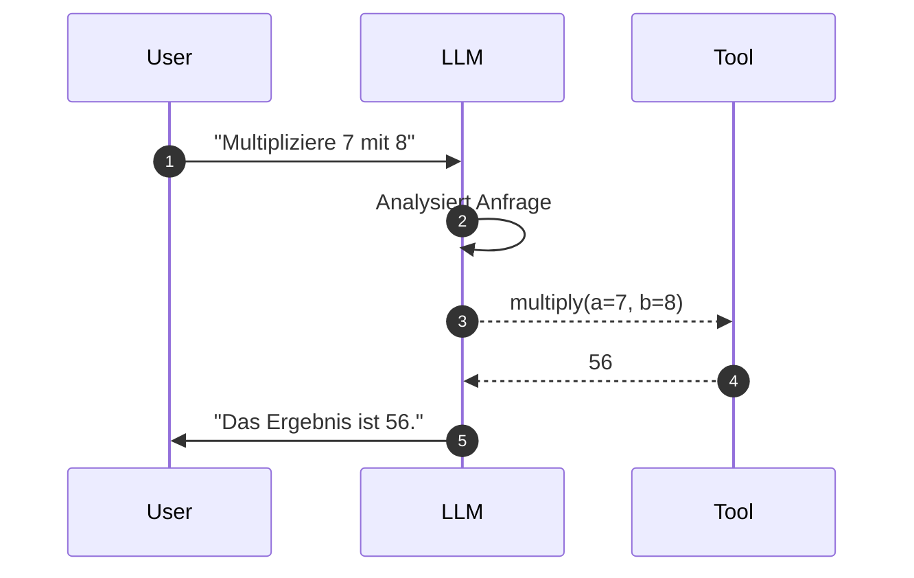
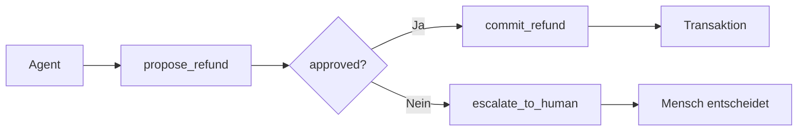

# Tool Use & Function Calling
{: .no_toc }

> **Wie KI-Agenten durch Werkzeuge ihre Fähigkeiten erweitern**

---

# Inhaltsverzeichnis
{: .no_toc .text-delta }

1. TOC
{:toc}

---

## Warum brauchen LLMs Werkzeuge?

Large Language Models sind beeindruckend in der Textverarbeitung – doch sie haben fundamentale Grenzen:

| Limitation | Beispiel | Lösung durch Tools |
|------------|----------|-------------------|
| **Kein aktuelles Wissen** | "Wie ist das Wetter heute?" | Wetter-API aufrufen |
| **Keine Berechnungen** | "Was ist 17 × 243?" | Taschenrechner-Tool |
| **Kein Dateizugriff** | "Lies die Datei report.pdf" | Datei-Loader-Tool |
| **Keine externen Systeme** | "Buche einen Termin" | Kalender-API |

**Kernidee:** Tools erweitern die Fähigkeiten eines LLMs über reines Textwissen hinaus. Das Modell entscheidet, **wann** und **wie** ein Tool aufgerufen wird – die eigentliche Ausführung übernimmt Python-Code.

> [!NOTE] Das LLM führt keine Tools aus — es erzeugt einen Aufruf-Intent.<br>
> Die Anwendung empfängt diesen Intent, validiert ihn und führt den eigentlichen Code aus. Diese Trennung ist entscheidend für Sicherheit und Kontrolle.

---

## Das Konzept: Function Calling

Function Calling ist der Mechanismus, durch den ein LLM strukturiert mitteilt, welches Tool mit welchen Parametern aufgerufen werden soll.

### Ablauf im Detail



**Wichtige Erkenntnis:** Das LLM führt das Tool nicht selbst aus – es generiert lediglich einen strukturierten Aufruf (JSON), den die Anwendung interpretiert und ausführt.

### Was das LLM "sieht"

Dem Modell werden verfügbare Tools als Schema übergeben:

```json
{
  "name": "multiply",
  "description": "Multipliziert zwei Zahlen.",
  "parameters": {
    "type": "object",
    "properties": {
      "a": {"type": "integer", "description": "Erste Zahl"},
      "b": {"type": "integer", "description": "Zweite Zahl"}
    },
    "required": ["a", "b"]
  }
}
```

Das Modell entscheidet anhand von **Name** und **Beschreibung**, ob und wie es das Tool einsetzt.

---

## Tools definieren mit dem `@tool` Decorator

In LangChain 1.0+ ist der `@tool` Decorator der Standard für Tool-Definitionen. Er generiert automatisch das Schema aus Docstring und Type Hints.

### Grundstruktur

```python
from langchain_core.tools import tool

@tool
def tool_name(parameter: type) -> return_type:
    """Kurze Beschreibung des Tools.
    
    Args:
        parameter: Beschreibung des Parameters
    
    Returns:
        Beschreibung des Rückgabewerts
    """
    # Tool-Logik
    return ergebnis
```

### Beispiel: Einfaches Rechen-Tool

```python
from langchain_core.tools import tool

@tool
def multiply(a: int, b: int) -> int:
    """Multipliziert zwei ganze Zahlen.
    
    Args:
        a: Erste Zahl
        b: Zweite Zahl
    
    Returns:
        Das Produkt von a und b
    """
    return a * b
```

### Beispiel: Tool mit Fehlerbehandlung

```python
@tool
def safe_divide(a: float, b: float) -> str:
    """Dividiert a durch b mit Fehlerbehandlung.
    
    Args:
        a: Dividend (Zähler)
        b: Divisor (Nenner)
    
    Returns:
        Das Ergebnis als Text oder eine Fehlermeldung
    """
    try:
        if b == 0:
            return "Fehler: Division durch Null ist nicht erlaubt."
        result = a / b
        return f"Ergebnis: {result:.4f}"
    except Exception as e:
        return f"Fehler bei der Berechnung: {str(e)}"
```

---

## Die Bedeutung guter Docstrings

Der Docstring ist **entscheidend** für die Tool-Nutzung. Das LLM trifft seine Entscheidung ausschließlich auf Basis von Name und Beschreibung.

> [!TIP] Docstring-Qualität entscheidet über Tool-Selektion<br>
> Das LLM wählt Tools **ausschließlich** anhand von Name und Beschreibung. Ein schlechter Docstring bedeutet falsche oder ausgebliebene Tool-Aufrufe — unabhängig davon, wie gut der Tool-Code ist.

### Schlechter Docstring

```python
@tool
def search(q: str) -> str:
    """Sucht etwas."""  # Zu vage!
    return do_search(q)
```

**Problem:** Das LLM weiß nicht, *was* gesucht wird, *wo* gesucht wird, oder *wann* dieses Tool sinnvoll ist.

### Guter Docstring

```python
@tool
def search_company_documents(query: str) -> str:
    """🔍 FIRMEN-DOKUMENTENSUCHE – Durchsucht interne Dokumente.
    
    Verwende dieses Tool für Fragen zu:
    - Unternehmensrichtlinien und Prozessen
    - Produktinformationen und Handbücher
    - Interne Regelwerke und Compliance
    
    NICHT geeignet für: Allgemeinwissen, aktuelle Nachrichten, Berechnungen.
    
    Args:
        query: Suchbegriff oder Frage in natürlicher Sprache
    
    Returns:
        Relevante Textpassagen aus den Firmendokumenten
    """
    return document_retriever.search(query)
```

**Merkmale eines guten Docstrings:**

| Element | Zweck |
|---------|-------|
| **Emoji** | Visuelle Identifikation im Debug-Output |
| **GROSSBUCHSTABEN-Name** | Schnelles Erkennen der Tool-Kategorie |
| **Anwendungsfälle** | Dem LLM zeigen, wann das Tool passt |
| **Negative Abgrenzung** | Verhindern falscher Tool-Aufrufe |
| **Parameter-Beschreibung** | Korrekte Werteübergabe sicherstellen |

---

## Negative-Bound Tool Descriptions

Wenn ein Agent mehrere ähnliche Tools verwaltet, entsteht *Tool-Overlap*: Das LLM kann nicht zuverlässig unterscheiden, welches Tool für eine Anfrage zuständig ist. Negative Bounding löst dieses Problem durch explizite Ausschlüsse im Docstring — das LLM erfährt nicht nur, **was** ein Tool tut, sondern auch, **was es nicht tut**.

### Das Problem: Überlappende Tools

```python
@tool
def search_products(query: str) -> str:
    """Sucht nach Produkten."""
    ...

@tool
def search_customers(query: str) -> str:
    """Sucht nach Kunden."""
    ...
```

**Problem:** Beide Tools "suchen" — das LLM trifft bei ambigen Anfragen wie "Suche nach Schmidt" eine unsichere Entscheidung.

### Die Lösung: Explizite Negativabgrenzung

```python
@tool
def search_products(query: str) -> str:
    """🛒 PRODUKTSUCHE – Durchsucht den Produktkatalog nach Name, SKU oder Kategorie.

    Verwende dieses Tool für Anfragen zu Artikeln, Preisen und Verfügbarkeit.

    NICHT geeignet für: Kundendaten, Bestellungen, Rechnungen.
    Verändert KEINE Daten. Schreibt NICHT in die Datenbank.

    Args:
        query: Suchbegriff (Name, SKU, Kategorie)

    Returns:
        Liste passender Produkte mit Preis und Bestand
    """
    ...

@tool
def search_customers(query: str) -> str:
    """👤 KUNDENSUCHE – Durchsucht die Kundendatenbank nach Name, E-Mail oder Kundennummer.

    Verwende dieses Tool für Anfragen zu Kontaktdaten und Konten.

    NICHT geeignet für: Produktinfos, Lagerbestand, Preise.
    Verändert KEINE Kundendaten. Sendet KEINE E-Mails.

    Args:
        query: Suchbegriff (Name, E-Mail, Kundennummer)

    Returns:
        Kundendatensatz mit Kontaktinformationen
    """
    ...
```

### Negative-Bound-Muster im Überblick

| Situation | Negativabgrenzung im Docstring |
|-----------|-------------------------------|
| Read-only Tool neben Write-Tool | `Verändert KEINE Daten.` |
| Tool mit ähnlichem Scope wie anderes | `NICHT geeignet für: [Alternativen]` |
| Tool ohne Seiteneffekte | `Sendet KEINE Benachrichtigungen.` |
| Scoped Access Tool | `Greift NUR auf [Bereich] zu, nicht auf [anderer Bereich].` |

> [!TIP] Negative Bounding als Architektur-Prinzip<br>
> Bei 4–5 Tools pro Agent reicht ein klarer Scope oft aus. Ab 6+ Tools steigt die Gefahr von Tool-Overlap deutlich — dann ist Negative Bounding kein Nice-to-have, sondern Pflicht.

---

## Pydantic als Contract-Schicht

In produktionsfähigen Agenten übernehmen Pydantic-Modelle drei Rollen gleichzeitig: **Laufzeitvalidierung**, **Tool-Schema-Generierung** und **typisierte Übergabestrukturen** zwischen Agenten. Das macht Pydantic zur "Single Source of Truth" — Schema und Validierungslogik leben an einem Ort und können nicht auseinanderdriften.

**Anti-Pattern:** Schema und Validierung getrennt pflegen

```python
# ❌ Tool-Beschreibung im Docstring, Validierung irgendwo anders — driftet auseinander
@tool
def process_refund(customer_id: str, amount: float) -> dict:
    """Verarbeitet eine Erstattung."""
    if amount < 0:   # Validierung dupliziert, nicht im Schema sichtbar
        raise ValueError("Negativer Betrag")
    ...
```

**Korrekt:** Pydantic-Modell als Contract für Schema + Validierung

```python
from pydantic import BaseModel, Field
from langchain_core.tools import tool

class RefundRequest(BaseModel):
    customer_id: str   = Field(description="Eindeutige Kunden-ID")
    amount:      float = Field(ge=0, description="Erstattungsbetrag in EUR (≥ 0)")
    reason:      str   = Field(description="Begründung der Erstattung")

@tool(args_schema=RefundRequest)
def process_refund(customer_id: str, amount: float, reason: str) -> dict:
    """💰 ERSTATTUNG – Verarbeitet eine geprüfte Rückerstattungsanfrage.

    NICHT geeignet für: Kontosperrungen, Kundendaten-Änderungen.
    Prüft KEINE Berechtigung — zuvor check_policy aufrufen.

    Returns:
        Erstattungsstatus mit Transaktions-ID
    """
    # amount >= 0 wurde bereits von Pydantic validiert — kein Duplikat nötig
    return {"status": "processed", "amount": amount}
```

**Drei Gewinne durch Pydantic als Contract:**

| Rolle | Mechanismus | Vorteil |
|-------|------------|---------|
| Laufzeitvalidierung | `ge=0` wirft `ValidationError` vor Tool-Ausführung | Ungültige Daten erreichen den Code nicht |
| Schema-Generierung | JSON-Schema direkt aus dem Modell | Keine Divergenz zwischen Beschreibung und Realität |
| Handoff-Struktur | Dasselbe Modell als typisierte Übergabe | Agenten sprechen denselben Datenvertrag |

> [!TIP] Pydantic-Schemas und `title`-Feld<br>
> Beim Generieren von Tool-Schemas aus Pydantic das Top-Level-`title`-Feld entfernen (`schema.pop("title", None)`), um Token zu sparen und Schema-Validierungsüberraschungen mit der Claude API zu vermeiden.

---

## Two-Step Veto und Forced tool_choice

### Two-Step Veto für hochrisikoreiche Operationen

Bei Operationen mit realen Konsequenzen (Rückerstattungen, Löschungen, Zahlungen) trennt das Two-Step Veto Pattern Prüfung und Ausführung in zwei separate Tools. Der Agent kann `propose` aufrufen, `commit` aber nur nach positivem Policy-Check.

```python
@tool
def propose_refund(customer_id: str, amount: float) -> dict:
    """💡 ERSTATTUNGSVORSCHLAG – Prüft Berechtigung, führt NICHT aus.

    Immer zuerst aufrufen, bevor commit_refund verwendet wird.
    Verändert KEINE Daten. Schreibt NICHTS in die Datenbank.

    Returns:
        {"approved": bool, "limit": float, "reason": str}
    """
    return PolicyEngine().check_policy(customer_id, amount)

@tool
def commit_refund(customer_id: str, amount: float) -> dict:
    """✅ ERSTATTUNG DURCHFÜHREN – Führt eine bereits geprüfte Erstattung aus.

    Nur aufrufen wenn propose_refund approved=True zurückgegeben hat.
    NICHT für ungeprüfte Erstattungen verwenden.

    Returns:
        Transaktionsstatus mit Transaktions-ID
    """
    return financial_system.process(customer_id, amount)
```

**Ablauf:**



### Forced tool_choice

Wenn ein Policy-Check eine Eskalation erfordert, kann das System Claude zwingen, ein bestimmtes Tool aufzurufen — unabhängig davon, was Claude selbst entscheiden würde:

```python
# Policy blockiert — Claude zum Eskalations-Tool zwingen
if tool_result.get("action_required") == "escalate_to_human":
    client.messages.create(
        model="claude-opus-4-6",
        messages=messages,
        tools=tools,
        tool_choice={"type": "tool", "name": "escalate_to_human"}
    )
```

> [!NOTE] Wann Forced tool_choice einsetzen<br>
> Nur wenn deterministisch feststeht, welches Tool als nächstes aufgerufen werden muss — z.B. nach einem negativen Policy-Check. Nicht als genereller Mechanismus zur Steuerung des Agenten verwenden.

---

## Type Hints: Pflicht, nicht Kür

Type Hints sind **zwingend erforderlich** für die automatische Schema-Generierung.

### Unterstützte Typen

```python
from typing import List, Optional, Dict

@tool
def process_data(
    text: str,                          # Einfacher String
    count: int,                         # Ganzzahl
    threshold: float,                   # Dezimalzahl
    enabled: bool,                      # Boolean
    items: List[str],                   # Liste von Strings
    config: Optional[Dict[str, str]] = None  # Optionales Dictionary
) -> str:
    """Verarbeitet Daten mit verschiedenen Parametertypen."""
    pass
```

### Häufiger Fehler: Fehlende Type Hints

```python
# ❌ FALSCH: Keine Type Hints
@tool
def add(a, b):
    """Addiert zwei Zahlen."""
    return a + b

# ✅ RICHTIG: Mit Type Hints
@tool
def add(a: int, b: int) -> int:
    """Addiert zwei ganze Zahlen."""
    return a + b
```

> [!WARNING] Fehlende Type Hints → unvollständiges Schema → LLM kann Parameter nicht füllen<br>
> Ohne Type Hints generiert der `@tool` Decorator ein unvollständiges JSON-Schema. Das LLM kann die Parameter dann nicht korrekt befüllen, was zu fehlgeschlagenen oder falschen Tool-Aufrufen führt.

---

## Tools direkt testen

Vor der Integration in einen Agenten sollten Tools isoliert getestet werden.

```python
# Tool-Objekt inspizieren
print(f"Name: {multiply.name}")
print(f"Beschreibung: {multiply.description}")
print(f"Schema: {multiply.args_schema.schema()}")

# Tool direkt aufrufen
result = multiply.invoke({"a": 7, "b": 8})
print(f"Ergebnis: {result}")
```

**Ausgabe:**

```
Name: multiply
Beschreibung: Multipliziert zwei ganze Zahlen.
Schema: {'properties': {'a': {'type': 'integer'}, 'b': {'type': 'integer'}}, 'required': ['a', 'b']}
Ergebnis: 56
```

---

## Tools an ein LLM binden

Ein LLM mit gebundenen Tools kann selbstständig entscheiden, welches Tool wann aufgerufen wird.

### Variante A: `bind_tools()`

```python
from langchain.chat_models import init_chat_model

llm = init_chat_model("openai:gpt-4o-mini", temperature=0.0)

# Tools an das Modell binden
tools = [multiply, safe_divide]
llm_with_tools = llm.bind_tools(tools)

# Aufruf – LLM entscheidet über Tool-Nutzung
response = llm_with_tools.invoke("Was ist 15 mal 23?")
print(response.tool_calls)
```

**Ausgabe:**

```python
[{'name': 'multiply', 'args': {'a': 15, 'b': 23}, 'id': 'call_abc123'}]
```

**Wichtig:** `bind_tools()` führt das Tool nicht aus – es gibt nur die Absicht des LLMs zurück.

### Variante B: Agent mit automatischer Ausführung

```python
from langchain.agents import create_agent

agent = create_agent(
    model=llm,
    tools=[multiply, safe_divide],
    system_prompt="Nutze die verfügbaren Tools für Berechnungen."
)

response = agent.invoke({
    "messages": [{"role": "user", "content": "Berechne 15 mal 23"}]
})

print(response["messages"][-1].content)
# Ausgabe: "Das Ergebnis von 15 × 23 ist 345."
```

---

## Praktische Tool-Beispiele

### Beispiel: Aktuelles Datum

```python
from datetime import datetime

@tool
def get_current_date() -> str:
    """📅 DATUM – Gibt das aktuelle Datum zurück.
    
    Verwende dieses Tool, wenn nach dem heutigen Datum,
    Wochentag oder aktuellen Zeitpunkt gefragt wird.
    
    Returns:
        Aktuelles Datum im Format "Wochentag, TT.MM.JJJJ"
    """
    now = datetime.now()
    weekdays = ["Montag", "Dienstag", "Mittwoch", "Donnerstag", 
                "Freitag", "Samstag", "Sonntag"]
    weekday = weekdays[now.weekday()]
    return f"{weekday}, {now.strftime('%d.%m.%Y')}"
```

### Beispiel: Websuche (Stub)

```python
@tool
def web_search(query: str, num_results: int = 3) -> str:
    """🌐 WEBSUCHE – Durchsucht das Internet nach aktuellen Informationen.
    
    Verwende dieses Tool für:
    - Aktuelle Nachrichten und Ereignisse
    - Fakten, die sich ändern können (Aktienkurse, Wetter)
    - Informationen nach dem Wissens-Cutoff des Modells
    
    Args:
        query: Suchbegriff oder Frage
        num_results: Anzahl der gewünschten Ergebnisse (Standard: 3)
    
    Returns:
        Zusammenfassung der Suchergebnisse
    """
    # Hier würde die tatsächliche Suche implementiert
    return f"Suchergebnisse für '{query}': [Platzhalter für echte Ergebnisse]"
```

### Beispiel: Dateioperationen

```python
from pathlib import Path

@tool
def read_file(filepath: str) -> str:
    """📄 DATEI LESEN – Liest den Inhalt einer Textdatei.
    
    Args:
        filepath: Pfad zur Datei (relativ oder absolut)
    
    Returns:
        Dateiinhalt als Text oder Fehlermeldung
    """
    try:
        path = Path(filepath)
        if not path.exists():
            return f"Fehler: Datei '{filepath}' nicht gefunden."
        if not path.is_file():
            return f"Fehler: '{filepath}' ist keine Datei."
        
        content = path.read_text(encoding="utf-8")
        if len(content) > 5000:
            return content[:5000] + "\n\n[... Datei gekürzt ...]"
        return content
    except Exception as e:
        return f"Fehler beim Lesen: {str(e)}"
```

---

## Fehlerbehandlung in Tools

Robuste Tools müssen mit Fehlern umgehen können. Ein Tool-Absturz kann den gesamten Agenten blockieren.

### Muster: Try-Except mit informativer Rückgabe

```python
@tool
def query_database(sql: str) -> str:
    """🗄️ DATENBANK – Führt eine SQL-Abfrage aus.
    
    Args:
        sql: SQL SELECT-Anweisung
    
    Returns:
        Abfrageergebnis oder Fehlermeldung
    """
    try:
        # Sicherheitsprüfung
        if not sql.strip().upper().startswith("SELECT"):
            return "Fehler: Nur SELECT-Anweisungen sind erlaubt."
        
        # Datenbankabfrage (Pseudocode)
        result = database.execute(sql)
        return f"Ergebnis: {result}"
    
    except ConnectionError:
        return "Fehler: Keine Verbindung zur Datenbank. Bitte später erneut versuchen."
    except TimeoutError:
        return "Fehler: Abfrage hat zu lange gedauert. Bitte die Anfrage vereinfachen."
    except Exception as e:
        return f"Unerwarteter Fehler: {str(e)}"
```

### Warum informative Fehlermeldungen?

Das LLM erhält die Rückgabe des Tools als Kontext. Eine gute Fehlermeldung ermöglicht dem Agenten:

- Den Fehler zu verstehen und dem Nutzer zu erklären
- Alternative Strategien zu versuchen
- Sinnvolle Rückfragen zu stellen

**Schlecht:** `return "Error"`
**Gut:** `return "Fehler: Die Datei 'report.pdf' existiert nicht. Verfügbare Dateien: budget.xlsx, notes.txt"`

---

## Best Practices

### Do's ✅

| Praxis | Begründung |
|--------|------------|
| **Docstrings mit Anwendungsfällen** | LLM trifft bessere Entscheidungen |
| **Type Hints für alle Parameter** | Automatische Schema-Generierung |
| **Fehlerbehandlung mit Try-Except** | Robuster Agent-Betrieb |
| **Informative Rückgabewerte** | LLM kann Fehler interpretieren |
| **Isolierte Tests vor Integration** | Frühzeitige Fehlererkennung |
| **Emojis für visuelle Identifikation** | Besseres Debugging |

### Don'ts ❌

| Anti-Pattern | Problem |
|--------------|---------|
| **Vage Docstrings** | LLM wählt falsche Tools |
| **Fehlende Type Hints** | Schema unvollständig |
| **Unbehandelte Exceptions** | Agent-Absturz |
| **Seiteneffekte ohne Warnung** | Unerwartetes Verhalten |
| **Zu viele Tools auf einmal** | Entscheidungsüberlastung |
| **Sensible Operationen ohne Schutz** | Sicherheitsrisiko |

---

## Zusammenfassung

**Tool Use** ermöglicht KI-Agenten, über reines Textwissen hinauszugehen:

- **Function Calling** ist der Mechanismus, durch den LLMs strukturiert Tools aufrufen
- Der **`@tool` Decorator** generiert automatisch das benötigte Schema
- **Docstrings** sind entscheidend – sie bestimmen, wann das LLM ein Tool wählt
- **Type Hints** sind Pflicht für korrekte Parameter-Übergabe
- **Fehlerbehandlung** macht Tools robust und Agent-freundlich

Im nächsten Schritt werden diese Tools in vollständige Agenten integriert, die selbstständig entscheiden, welche Werkzeuge sie für eine Aufgabe benötigen.

## Abgrenzung zu verwandten Dokumenten

| Dokument | Frage |
|---|---|
| [Agent-Architekturen](./Agent_Architekturen.html) | Wie werden Tools in Multi-Agent-Systeme und Graphen eingebettet? |
| [Agent Security](./Agent_Security.html) | Wie werden Tool-Aufrufe abgesichert und Missbrauch verhindert? |
| [RAG Konzepte](./RAG_Konzepte.html) | Wann ist Retrieval die bessere Alternative zu direkten Tool-Aufrufen? |

---

**Version:** 1.2<br>
**Stand:** April 2026<br>
**Kurs:** KI-Agenten. Verstehen. Anwenden. Gestalten.