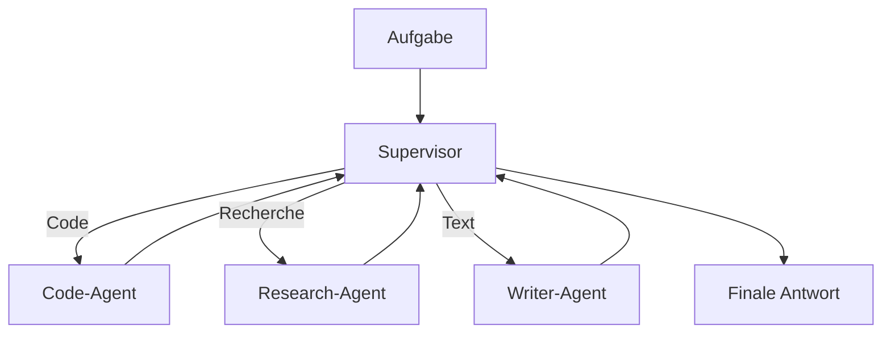
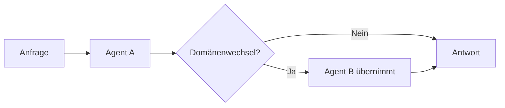
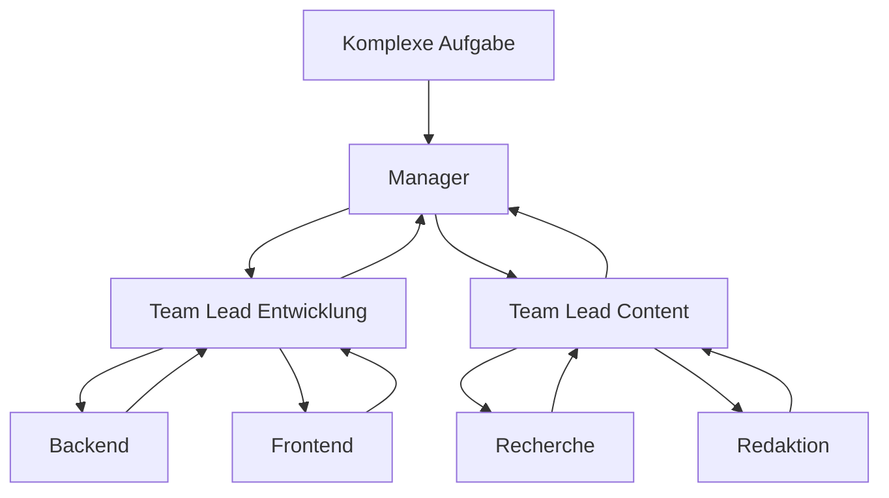
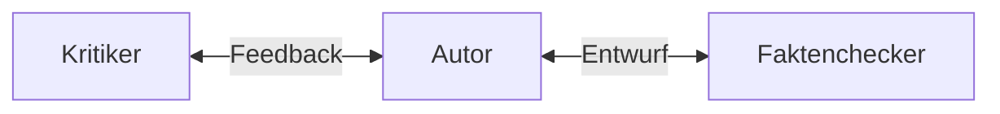
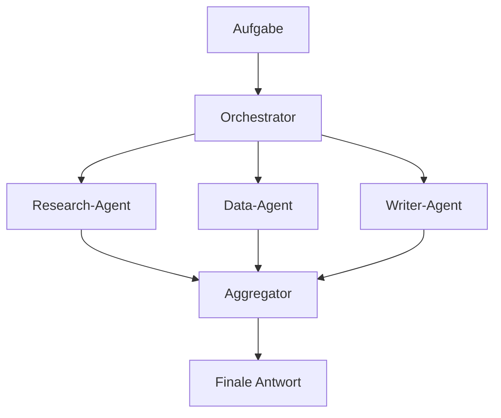

# Multi-Agent-Systeme
{: .no_toc }

> **Mehrere Agenten lohnen sich erst dann, wenn echte Spezialisierung einen erkennbaren Gewinn bringt.**

---

# Inhaltsverzeichnis
{: .no_toc .text-delta }

1. TOC
{:toc}

---

## Warum Multi-Agent nicht automatisch besser ist

Sobald ein einzelner Agent komplexe Aufgaben bearbeiten soll, entsteht schnell der Gedanke, die Arbeit auf mehrere spezialisierte Agenten zu verteilen. Das kann sinnvoll sein. Es kann aber auch unnötige Komplexität erzeugen. Multi-Agent-Systeme sind deshalb keine automatische Weiterentwicklung, sondern eine bewusste Architekturentscheidung.

Der Mehrwert liegt in Arbeitsteilung, Spezialisierung und möglicher Parallelität. Der Preis liegt in Koordination, zusätzlichem State, mehr Kommunikationsaufwand und schwierigerem Debugging. Genau deshalb sollte zuerst gefragt werden, ob ein einzelner Workflow mit klaren Knoten nicht bereits ausreicht.

Typischer Fehler: Multi-Agent zu wählen, weil es moderner oder „agentischer“ klingt, obwohl ein sauberer Workflow denselben Fall einfacher lösen würde.

## Ein einfaches Beispiel

Ein System soll einen Marktanalyse-Report erstellen. Eine Person oder ein einzelner Agent müsste recherchieren, ordnen, formulieren und prüfen. In einem Multi-Agent-System kann ein Recherche-Agent Quellen sammeln, ein Schreib-Agent den Bericht formulieren und ein Review-Agent auf Konsistenz und Qualität prüfen.

Dieses Beispiel zeigt den eigentlichen Nutzen: Nicht mehrere Agenten um ihrer selbst willen, sondern klar unterscheidbare Rollen mit echter Arbeitsteilung.

## Welche Grundmuster es gibt

Multi-Agent-Systeme unterscheiden sich weniger durch die Zahl der Agenten als durch ihre Koordination. Einige Muster sind für Einsteiger besonders wichtig: Supervisor, Handoff, Skill-orientierte Fähigkeitstrennung, hierarchische Koordination, direkte kollaborative Zusammenarbeit und parallele Bearbeitung unabhängiger Teilaufgaben.

| Muster | Grundidee |
|---|---|
| Supervisor | eine zentrale Rolle verteilt Aufgaben an Worker |
| Handoff | ein Agent erkennt während der Bearbeitung den Zuständigkeitswechsel |
| Skill-orientiert | Fähigkeiten werden gezielt nach Bedarf zugeladen |
| Hierarchisch | mehrere Ebenen aus Leitrollen und Workern |
| Kollaborativ | Agenten arbeiten direkt mit Feedbackschleifen zusammen |
| Parallel | unabhängige Teilaufgaben laufen gleichzeitig |

## Supervisor: der naheliegende Einstieg

Das Supervisor-Pattern ist für viele erste Multi-Agent-Projekte der verständlichste Einstieg. Ein zentraler Supervisor erhält die Aufgabe, bewertet sie und delegiert an einen passenden Spezialisten.



Der Vorteil liegt in klaren Verantwortlichkeiten. Der Nachteil ist, dass der Supervisor schnell zum Engpass wird, wenn er nicht nur routet, sondern selbst beginnt, die eigentliche Facharbeit zu erledigen.

```python
class TeamState(TypedDict):
    messages: Annotated[list, add_messages]
    next_worker: str
    task_complete: bool

def supervisor_node(state: TeamState) -> Command:
    last_message = state["messages"][-1].content.lower()
    if "code" in last_message:
        return Command(goto="code_agent")
    if "recherche" in last_message:
        return Command(goto="research_agent")
    return Command(goto="writer_agent")
```

In der Praxis relevant, wenn: Aufgaben vorab sauber klassifizierbar sind und Rollen klar voneinander getrennt bleiben.

## Handoff: wenn sich die Zuständigkeit erst unterwegs zeigt

Nicht immer ist die richtige Rolle schon am Anfang klar. Manchmal beginnt ein allgemeiner Agent mit einer Anfrage und erkennt erst während der Bearbeitung, dass eine andere Spezialisierung nötig ist. Genau dann passt das Handoff-Pattern.



Hier entscheidet also nicht ein externer Router vorab, sondern der bearbeitende Agent selbst. Das macht das System flexibler, erfordert aber sauberen Kontexttransfer.

Typischer Fehler: Beim Handoff den bisherigen Kontext nicht vollständig zu übergeben. Dann beginnt der übernehmende Agent praktisch blind.

## Skill- oder Capability-Loading statt dauerhaftem Spezialistentrupp

Manche Systeme brauchen kein volles Multi-Agent-Team, sondern nur einen Hauptagenten, der gezielt zusätzliche Fähigkeiten lädt. Dieses Muster ist besonders dann interessant, wenn Fachwissen umfangreich, aber nur sporadisch benötigt wird. Es verhindert Prompt Bloat und hält den aktiven Kontext schlanker.

```python
SKILL_REGISTRY = {
    "legal": [vertrag_pruefen, dsgvo_check],
    "finance": [budget_analysieren],
    "general": [],
}
```

Grenze: Dieses Muster ist keine echte arbeitsteilige Mehragenten-Koordination, sondern eher ein fokussierter Hauptagent mit temporären Capability-Sets.

## Hierarchische Systeme für größere Teams

Wenn ein Supervisor nicht mehr ausreicht, kann eine Hierarchie aus Leitrollen und Unterteams sinnvoll werden. Ein Manager verteilt Teilbereiche an Team Leads, diese koordinieren wiederum ihre eigenen Worker.



Dieses Muster lohnt sich erst, wenn Anzahl der Rollen, Aufgabenkomplexität und Abhängigkeiten hoch genug sind. Für kleine Kursbeispiele ist es meist schon die zweite oder dritte Ausbaustufe, nicht der Startpunkt.

## Kollaboration und Review-Schleifen

Ein anderes Muster entsteht, wenn Agenten sich nicht nur Aufträge zuschieben, sondern einander aktiv bewerten oder überarbeiten. Ein typischer Fall ist ein Autor-Kritiker-Zyklus.



Diese Form kann Qualität deutlich erhöhen, birgt aber das Risiko von Endlosschleifen oder instabilen Iterationen. Deshalb braucht sie klare Abbruchbedingungen und Iterationsgrenzen.

## Parallelität lohnt sich nur bei unabhängigen Teilaufgaben

Parallelität ist ein eigener Gewinn von Multi-Agent-Systemen, aber nur dann, wenn Teilaufgaben wirklich unabhängig voneinander bearbeitet werden können. Recherchen in mehreren Quellen, parallele Dokumentanalysen oder Arbeitspakete ohne gegenseitige Abhängigkeit sind gute Kandidaten.



Nicht geeignet, wenn: Schritt B inhaltlich vom Ergebnis aus Schritt A abhängt. Dann ist eine scheinbar parallele Architektur nur komplizierter, aber nicht schneller.

## Kommunikation und gemeinsamer State

In LangGraph erfolgt Zusammenarbeit meist über Shared State. Jeder Agent liest aus demselben oder aus kompatiblen State-Strukturen und gibt gezielt Änderungen zurück. Alternativ sind direkte Aufrufe oder asynchrone Nachrichten möglich, aber für den Kurskontext ist Shared State das zentrale Modell.

```python
class MultiAgentState(TypedDict):
    messages: Annotated[list, add_messages]
    current_task: str
    completed_tasks: list[str]
    next_agent: str
    iteration_count: int
    final_output: Optional[str]
```

Genau hier zeigt sich, wie eng Multi-Agent-Design und State Management zusammenhängen. Ohne sauberen gemeinsamen Zustand zerfällt die Koordination schnell.

## Was in der Praxis schnell schiefgeht

Deadlocks, Endlosschleifen, falsches Routing und unnötig komplizierte Übergaben gehören zu den häufigsten Problemen. Ebenso kritisch ist fehlende Fehlerbehandlung: Wenn ein Worker scheitert und es keinen Fallback gibt, wird aus modularer Architektur schnell ein fragiles System.

```python
def should_continue(state: TeamState) -> str:
    if state["iteration_count"] >= 10:
        return "timeout_handler"
    return "next_agent"
```

Typischer Fehler: Kommunikation zirkulär zu bauen, ohne Timeouts oder klare Richtung. Dann warten Agenten indirekt aufeinander und blockieren den Ablauf.

## Welche Wahl für Einsteiger meist sinnvoll ist

Für Einsteigerprojekte ist ein einfacher Supervisor meist der beste Startpunkt, wenn echte Arbeitsteilung gebraucht wird. Handoff lohnt sich, wenn Zuständigkeiten erst im Verlauf sichtbar werden. Parallele oder kollaborative Muster sollten erst eingesetzt werden, wenn der Mehrwert dafür klar erkennbar ist.

Teilnehmende unterschätzen oft, dass Multi-Agent nicht nur „mehr Agenten“, sondern vor allem mehr Koordinationslogik bedeutet. Genau deshalb ist die beste erste Frage nicht `Wie viele Rollen könnten existieren?`, sondern `Welche Rollen werden wirklich gebraucht?`

## Abgrenzung zu verwandten Dokumenten

| Dokument | Frage |
|---|---|
| [Welche Architektur passt zu diesem Agenten?](./agent-architekturen.html) | Wann ist Multi-Agent überhaupt die richtige Architekturklasse? |
| [Wie behalten Agenten zwischen Schritten den Überblick?](./state-management.html) | Wie wird der gemeinsame Zustand im Multi-Agent-Graph verwaltet? |
| [Wann sollten Menschen in den Ablauf eingreifen?](./human-in-the-loop.html) | Wann braucht ein Agententeam Freigabe, Eskalation oder menschliche Kontrolle? |
| [Wie sprechen Agenten mit Tools, anderen Agenten und Nutzern?](./agenten-kommunikationsprotokolle.html) | Welche Protokolle kommen bei agentenübergreifender Kommunikation ins Spiel? |

---

**Version:** 1.1<br>
**Stand:** April 2026<br>
**Kurs:** KI-Agenten. Verstehen. Anwenden. Gestalten.
