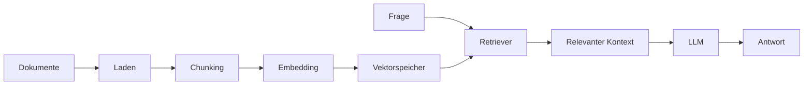

# RAG-Konzepte
{: .no_toc }

> **RAG verbindet Sprachmodelle mit einer eigenen Wissensbasis, ohne sie neu zu trainieren.**

---

# Inhaltsverzeichnis
{: .no_toc .text-delta }

1. TOC
{:toc}

---

## Warum RAG überhaupt gebraucht wird

Sprachmodelle wissen viel, aber nicht alles. Sie kennen nur Informationen bis zum Trainingszeitpunkt, besitzen kein internes Firmenwissen und neigen bei Wissenslücken zu plausiblen, aber falschen Aussagen. Genau hier setzt Retrieval Augmented Generation, kurz RAG, an.

Statt ein Modell neu zu trainieren, werden zur Laufzeit passende Dokumentteile gesucht und dem Modell als Kontext gegeben. Dadurch entsteht eine Architektur, in der aktuelles oder internes Wissen nutzbar wird, ohne dass das Modell selbst verändert werden muss.

Typischer Fehler: Zu glauben, dass mehr Modellgröße automatisch fehlendes Fachwissen ersetzt. Ohne Zugriff auf die relevanten Dokumente bleibt auch ein starkes Modell blind.

## Ein einfaches Beispiel

Ein interner Assistent soll Fragen über ein Mitarbeiterhandbuch beantworten. Ohne RAG kennt das Modell diese Richtlinien nicht zuverlässig. Mit RAG sucht das System die passenden Textstellen im Handbuch, fügt sie als Kontext hinzu und beantwortet dann die Frage auf dieser Grundlage.

Dieses Beispiel zeigt den Kern von RAG: nicht das ganze Wissen immer im Prompt tragen, sondern gezielt das abrufen, was für die aktuelle Frage gebraucht wird.

## Der Grundablauf von RAG

RAG besteht vereinfacht aus zwei Phasen. In der ersten Phase wird die Wissensbasis vorbereitet: Dokumente laden, zerlegen, als Vektoren repräsentieren und speichern. In der zweiten Phase wird bei jeder Anfrage relevantem Kontext nachgespürt und anschließend eine Antwort daraus erzeugt.



Genau diese Trennung ist didaktisch wichtig. Viele Probleme entstehen nicht beim Formulieren der Antwort, sondern schon viel früher in der Indexierung und beim Retrieval.

## Dokumente müssen sinnvoll vorbereitet werden

Die Indexierungsphase wirkt technisch, bestimmt aber maßgeblich die spätere Qualität. Dokumente werden zuerst geladen, dann in kleinere Einheiten zerlegt, anschließend eingebettet und schließlich in einem Vektorspeicher abgelegt.

Metadaten spielen dabei eine wichtige Rolle. Dateiname, Typ, Aktualisierungsdatum, Abteilung oder Vertraulichkeit helfen später beim Filtern und bei regulatorischen Anforderungen.

```python
doc = Document(
    page_content="Der Urlaubsantrag muss spätestens vier Wochen im Voraus...",
    metadata={
        "dateiname": "urlaubsrichtlinie_2024.pdf",
        "typ": "richtlinie",
        "aktualisiert_am": "2024-03-01",
        "vertraulichkeit": "intern",
        "abteilung": "HR",
    }
)
```

In der Praxis relevant, wenn: Nicht nur Ähnlichkeitssuche, sondern auch Filter wie Abteilung, Aktualität oder Vertraulichkeit eine Rolle spielen.

## Chunking entscheidet oft über gute oder schlechte Treffer

Ein Dokument kann nicht immer als Ganzes gesucht werden. Deshalb wird es in Chunks zerlegt. Sind diese zu groß, landet zu viel irrelevanter Kontext im Prompt. Sind sie zu klein, gehen Zusammenhänge verloren.

```python
from langchain_text_splitters import RecursiveCharacterTextSplitter

splitter = RecursiveCharacterTextSplitter(
    chunk_size=500,
    chunk_overlap=100,
    separators=["\n\n", "\n", ". ", " ", ""]
)
```

Der `RecursiveCharacterTextSplitter` versucht zunächst an natürlichen Grenzen wie Absätzen oder Zeilenumbrüchen zu schneiden. Erst wenn das nicht reicht, wird feiner getrennt. Genau das macht ihn für viele Dokumenttypen zu einem guten Standardstart.

Grenze: Es gibt keine perfekte Chunk-Größe für alle Dokumente. Richtlinien, FAQs, Handbücher und Code-Dokumentation verlangen oft unterschiedliche Werte.

## Embeddings machen semantische Suche möglich

Embeddings verwandeln Text in numerische Vektoren. Dadurch kann das System nicht nur nach exakten Wörtern, sondern nach inhaltlicher Nähe suchen. Zwei thematisch ähnliche Aussagen liegen dann im Vektorraum näher beieinander als zwei inhaltlich fremde.

```python
from langchain_openai import OpenAIEmbeddings

embedding_model = OpenAIEmbeddings(model="text-embedding-3-small")
query_vector = embedding_model.embed_query("Was ist ein KI-Agent?")
```

Für Einsteiger ist weniger die Mathematik entscheidend als die praktische Folge: Die Qualität des Retrievals hängt stark von der Qualität des Embedding-Modells und seiner konsistenten Verwendung ab.

Typischer Fehler: Ein Modell für die Dokumente und ein anderes für die Queries zu verwenden. Dann liegen beide nicht sauber im selben Suchraum.

## Retrieval ist mehr als eine einfache Suche

Sobald eine Frage eingeht, wird auch sie in den Suchraum übersetzt. Danach sucht ein Retriever die ähnlichsten Chunks oder Dokumente. Diese Treffer werden als Kontext an das Modell gegeben.

```python
vectorstore = Chroma.from_documents(chunks, embedding_model)
retriever = vectorstore.as_retriever(search_kwargs={"k": 3})
docs = retriever.invoke("Wie funktioniert RAG?")
```

Dabei gibt es unterschiedliche Strategien. Klassische Similarity Search ist schnell und einfach. MMR versucht zusätzlich, Vielfalt in den Treffern zu fördern. Threshold-Verfahren lassen nur Ergebnisse ab einem Mindestwert zu.

Nicht geeignet, wenn: Blind sehr viele Treffer in den Prompt geschoben werden. Mehr Kontext ist nicht automatisch besser. Oft steigt dadurch eher das Rauschen.

## Reranking verbessert die Trefferqualität

Die erste Vektorsuche ist schnell, aber nicht immer präzise genug. Reranking bewertet die gefundenen Kandidaten ein zweites Mal mit einem genaueren Modell und ordnet sie neu. Dadurch steigt oft die Relevanz der tatsächlich verwendeten Dokumente.

```python
base_retriever = vectorstore.as_retriever(search_kwargs={"k": 20})

reranker = CohereRerank(model="rerank-english-v3.0", top_n=5)

compression_retriever = ContextualCompressionRetriever(
    base_compressor=reranker,
    base_retriever=base_retriever
)
```

Für Einsteiger ist vor allem die Grundidee wichtig: Erst breit suchen, dann präziser auswählen.

## Gute Antworten entstehen erst durch einen guten RAG-Prompt

Auch mit gutem Retrieval bleibt die Antwortqualität vom Prompt abhängig. Das Modell muss klar angewiesen werden, auf Basis des Kontexts zu antworten und Wissenslücken ehrlich zu benennen.

```python
rag_prompt = ChatPromptTemplate.from_template(
    """Beantworte die Frage basierend auf dem folgenden Kontext.
Wenn die Antwort nicht im Kontext steht, sage das ehrlich.

Kontext:
{context}

Frage: {question}

Antwort:"""
)
```

Typischer Fehler: Dem Modell Kontext zu geben, ohne explizit zu sagen, dass es auf diesen Kontext beschränkt bleiben soll.

## Eine minimale RAG-Chain

Eine einfache RAG-Pipeline lässt sich in LangChain bereits mit wenigen Bausteinen zusammensetzen.

```python
llm = init_chat_model("openai:gpt-4o-mini", temperature=0.0)
embedding_model = OpenAIEmbeddings(model="text-embedding-3-small")
vectorstore = Chroma.from_documents(chunks, embedding_model)
retriever = vectorstore.as_retriever(search_kwargs={"k": 3})

def format_docs(docs):
    return "\n\n".join(doc.page_content for doc in docs)

rag_chain = (
    {
        "context": retriever | format_docs,
        "question": RunnablePassthrough()
    }
    | rag_prompt
    | llm
    | StrOutputParser()
)
```

Dieses Muster reicht schon, um den Grundgedanken im Kurs praktisch zu demonstrieren.

## RAG kann auch nur ein Tool in einem größeren Agenten sein

RAG muss nicht immer die ganze Architektur sein. Ein Agent kann auch ein RAG-gestütztes Wissens-Tool verwenden, wenn interne Dokumente nur ein Teil seiner Gesamtaufgabe sind.

```python
@tool
def firmenwissen_suchen(frage: str) -> str:
    """🔍 FIRMENWISSEN – Durchsucht interne Dokumente."""
    try:
        return rag_chain.invoke(frage)
    except Exception as e:
        return f"Fehler bei der Suche: {str(e)}"
```

Genau an dieser Stelle wird die Verbindung zu Agentenarchitektur sichtbar: Ein RAG-System kann allein stehen oder Teil eines größeren Agenten sein.

## Wie RAG bewertet wird

Ein RAG-System muss auf zwei Ebenen gemessen werden. Erstens muss geprüft werden, ob die richtigen Dokumente überhaupt gefunden werden. Zweitens muss geprüft werden, ob die generierte Antwort tatsächlich auf dem Kontext basiert.

Wichtige Fragen sind deshalb: Sind die Treffer relevant? Beantwortet die Antwort wirklich die Frage? Bleibt sie beim gegebenen Kontext oder halluziniert sie darüber hinaus?

In der Praxis relevant, wenn: Eine Antwort zwar plausibel klingt, aber unklar bleibt, ob der Fehler im Retrieval oder in der Generierung liegt.

## Was in der Praxis schnell schiefgeht

Eine leere oder falsch gebaute Collection, ungeeignete Chunk-Größen, ein zu kleines `k`, veraltete Dokumente oder unklare Prompts gehören zu den häufigsten Fehlerursachen. Besonders tückisch ist Silent Failure: Die richtige Information liegt irgendwo in der Wissensbasis, wird aber nie in den Prompt geholt.

Typischer Fehler: Das Modell für schlechte Antworten verantwortlich zu machen, obwohl eigentlich das Retrieval versagt hat.

## Was für Einsteiger zuerst wichtig ist

Für einen ersten RAG-Prototypen reichen wenige saubere Schritte: Dokumente sinnvoll laden, mit vernünftigen Chunk-Größen zerlegen, ein konsistentes Embedding-Modell verwenden, einen einfachen Retriever konfigurieren und dem Modell klare Antwortregeln geben.

Teilnehmende unterschätzen oft, wie stark Retrieval-Qualität und Chunking das Endergebnis prägen. Ein RAG-System ist nur zum kleineren Teil ein Modellproblem und zu einem großen Teil ein Wissens- und Retrievalproblem.

## Abgrenzung zu verwandten Dokumenten

| Dokument | Frage |
|---|---|
| [Lohnt es sich überhaupt?](./lohnt-es-sich.html) | Wann ist RAG der passende Lösungsweg und wann reicht etwas Einfacheres? |
| [Evaluation & Observability](./evaluation-observability.html) | Wie werden Retrieval, Faithfulness und Antwortqualität systematisch gemessen? |
| [Wie behalten Agenten zwischen Schritten den Überblick?](./state-management.html) | Wie werden Retrieval-Ergebnisse in mehrstufigen Graphen weitergereicht? |

---

**Version:** 1.1<br>
**Stand:** April 2026<br>
**Kurs:** KI-Agenten. Verstehen. Anwenden. Gestalten.
