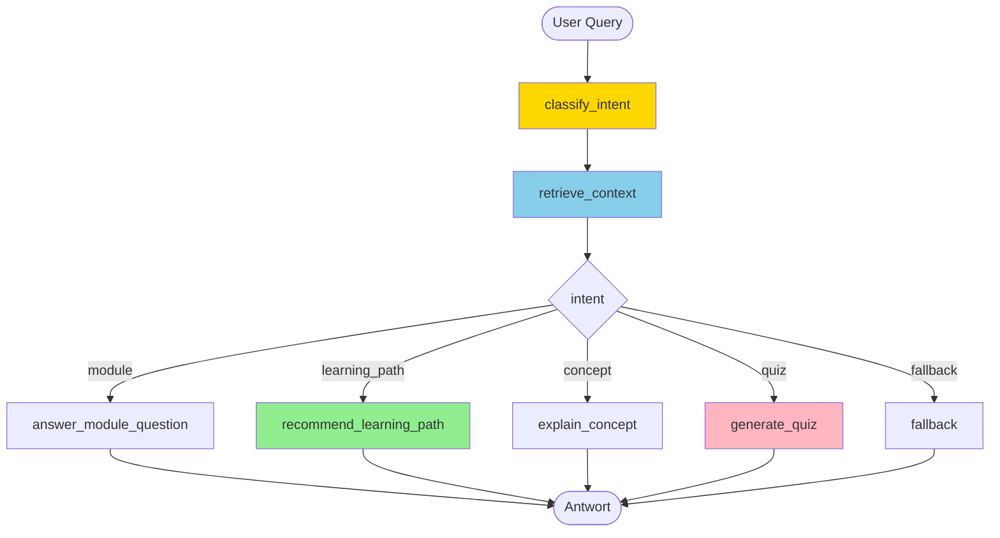

# Research Assistant Workshop
{: .no_toc }

> [!NOTE] Kernfrage<br>
> Wie entsteht schrittweise ein quellengebundener Research Assistant mit Routing, RAG, Sessions und optionaler Oberfläche?

---

# Inhaltsverzeichnis
{: .no_toc .text-delta }

1. TOC
{:toc}

---

## Projektübersicht

In dieser Übungsaufgabe entsteht schrittweise ein **Research Assistant**, der Fragen zu einem Fachartikel-Korpus beantwortet. Der Assistant priorisiert Quellen, fasst zentrale Befunde zusammen, nennt Citation-Hinweise und erzeugt bei Bedarf Kontrollfragen zu Quellen und Aussagen.

**Lernziele:**
- LangGraph State Machines von Grund auf verstehen
- Conditional Routing für verschiedene Anfragetypen einsetzen
- Research-Korpuswissen als kleine lokale Wissensbasis strukturieren
- Sessions und Verlauf mit Checkpointing speichern
- eine einfache Gradio-Oberfläche für den Agenten bereitstellen

**Arbeitsumgebung:** Google Colab, Jupyter Notebook oder lokales Python

**Voraussetzung:** Grundkenntnisse aus M01-M10; M16 und M28 hilfreich für Erweiterungen

---

## Notebook-Struktur

Zu erstellen ist **ein Notebook** mit **6 aufbauenden Kapiteln**:

```text
Research_Assistant_Workshop.ipynb
   ├── Kapitel 1: StateGraph Basics
   ├── Kapitel 2: Intent Routing
   ├── Kapitel 3: Wissensbasis & Retrieval-Light
   ├── Kapitel 4: Checkpointing & Sessions
   ├── Kapitel 5: Research-Synthese, Quellen und Selbsttest
   └── Kapitel 6: Gradio UI & Bonus Deployment
```

### Modul-Zuordnung

Jedes Kapitel baut auf den entsprechenden Kursmodulen auf. Das jeweilige Kapitel wird **nach** dem zugehörigen Modul bearbeitet:

| Workshop Kapitel | Kursmodul | Thema |
|-----------------|-----------|-------|
| Kapitel 1: StateGraph Basics | M08, M09 | Warum LangGraph? / StateGraph Basics |
| Kapitel 2: Intent Routing | M10 | Conditional Routing & Tool-Loop |
| Kapitel 3: Wissensbasis | M11–M14 (RAG) oder ab M10 | Research-Korpusdaten strukturieren, Retrieval-light (kein vollständiges RAG erforderlich) |
| Kapitel 4: Checkpointing & Sessions | M16 | Persistente Sitzungen |
| Kapitel 5: Research-Synthese, Quellen und Selbsttest | M04, M05, M24 | Prompting, Struktur, Tests |
| Kapitel 6: Gradio UI & Bonus Deployment | M28, M35 | UI und optional Hugging Face Spaces |

> [!NOTE] Didaktische Einordnung<br>
> Der Workshop startet fachlich ab M11 und verbindet RAG, Routing, Checkpointing, Evaluation und Security zu einem durchgehenden Anwendungsfall.

---

## Vorbereitung: Google Colab oder lokales Setup

### API-Key speichern

Beim Arbeiten mit einem externen Modell den `OPENAI_API_KEY` in Colab Secrets oder lokal in einer `.env` speichern.

### Basis-Pakete installieren

```python
# Installation

!uv pip install --system -q git+https://github.com/ralf-42/Agenten.git#subdirectory=04_modul
!uv pip install --system -q langgraph>=1.0.0 langgraph-checkpoint-sqlite gradio
```

### API-Key laden und Umgebung prüfen

```python
# API-Key Setup

from genai_lib.utilities import setup_api_keys, check_environment

setup_api_keys(['OPENAI_API_KEY'])
check_environment()
```

> [!TIP] Lokales Setup<br>
> API-Key vorab in `.env` oder per `os.environ["OPENAI_API_KEY"] = "sk-..."` setzen. `setup_api_keys()` liest beides automatisch.

---

## Kapitel 1: StateGraph Basics

> [!NOTE] Kursmodul<br>
> M08 – Warum LangGraph? | M09 – StateGraph Basics

**Lernziel:** Einen kleinen Graphen mit TypedDict-State und einfachen Nodes aufbauen

### Szenario

Ein Nutzer stellt eine Anfrage wie:

- "Welche Module brauche ich für RAG?"
- "Erkläre mir Checkpointing."
- "Gib mir eine Selbsttestfrage zu Tool Calling."

Der Graph soll die Anfrage zunächst entgegennehmen und den Typ der Anfrage erkennen.

### Aufgabe 1.1: State definieren

```python
# Kapitel 1: StateGraph Basics

from typing import TypedDict, Literal
from langgraph.graph import StateGraph, START, END

class NavigatorState(TypedDict):
    user_query: str
    intent: Literal["module", "learning_path", "concept", "quiz", "fallback"] | None
    retrieved_context: str
    answer: str
```

### Aufgabe 1.2: Erste Nodes erstellen

```python
from langchain.chat_models import init_chat_model
from genai_lib.model_config import WORKER

llm = init_chat_model(WORKER)

def classify_intent(state: NavigatorState) -> NavigatorState:
    """Erkennt, welche Art von Anfrage vorliegt."""
    query = state["user_query"]
    ...

def fallback_answer(state: NavigatorState) -> NavigatorState:
    """Gibt eine sichere Fallback-Antwort zurück."""
    ...
```

### Aufgabe 1.3: Minimalen Graphen bauen

```python
workflow = StateGraph(NavigatorState)

workflow.add_node("classify_intent", classify_intent)
workflow.add_node("fallback", fallback_answer)

workflow.add_edge(START, "classify_intent")
workflow.add_edge("classify_intent", "fallback")
workflow.add_edge("fallback", END)

graph = workflow.compile()
```

### Aufgabe 1.4: Minimaltest

```python
initial_state = {
    "user_query": "Welche Module brauche ich für RAG?",
    "intent": None,
    "retrieved_context": "",
    "answer": "",
}

result = graph.invoke(initial_state)
print(result["intent"])
print(result["answer"])
```

**Erfolgskriterium:**
- StateGraph läuft fehlerfrei
- State wird korrekt befüllt
- es gibt eine sichere Fallback-Antwort

---

## Kapitel 2: Intent Routing

> [!NOTE] Kursmodul<br>
> M10 – Conditional Routing & Tool-Loop

**Lernziel:** Verschiedene Anfragetypen über Conditional Edges zu spezialisierten Nodes leiten

### Aufgabe 2.1: Router-Funktion definieren

```python
# Kapitel 2: Intent Routing

from typing import Literal

def route_by_intent(state: NavigatorState) -> Literal["module", "learning_path", "concept", "quiz", "fallback"]:
    """Routet zur passenden Verarbeitung basierend auf intent."""
    return state["intent"] or "fallback"
```

### Aufgabe 2.2: Antwort-Nodes anlegen

```python
def answer_module_question(state: NavigatorState) -> NavigatorState:
    """Beantwortet Fragen zu Fachartikeln und Reihenfolge."""
    ...

def recommend_learning_path(state: NavigatorState) -> NavigatorState:
    """Empfiehlt einen Lernpfad passend zum Ziel."""
    ...

def explain_concept(state: NavigatorState) -> NavigatorState:
    """Erklärt einen Begriff aus dem Kurs."""
    ...

def generate_quiz(state: NavigatorState) -> NavigatorState:
    """Erzeugt Kontrollfragen zu Quellen und Aussagen."""
    ...
```

### Aufgabe 2.3: Graph mit Conditional Edge bauen

```python
workflow = StateGraph(NavigatorState)

workflow.add_node("classify_intent", classify_intent)
workflow.add_node("module", answer_module_question)
workflow.add_node("learning_path", recommend_learning_path)
workflow.add_node("concept", explain_concept)
workflow.add_node("quiz", generate_quiz)
workflow.add_node("fallback", fallback_answer)

workflow.add_edge(START, "classify_intent")
workflow.add_conditional_edges(
    "classify_intent",
    route_by_intent,
    {
        "module": "module",
        "learning_path": "learning_path",
        "concept": "concept",
        "quiz": "quiz",
        "fallback": "fallback",
    }
)
...
```

**Erfolgskriterium:**
- Router-Funktion entscheidet korrekt
- verschiedene Nutzerfragen landen in verschiedenen Nodes
- der Graph endet deterministisch

---

## Kapitel 3: Wissensbasis & Retrieval-Light

> [!NOTE] Kursmodul<br>
> M11-M14 oder als vereinfachte Research-Korpusdaten-Aufgabe ab M10

**Lernziel:** Research-Korpuswissen lokal strukturieren und gezielt in den Graphen einbinden

### Aufgabe 3.1: Wissensbasis laden

Eine vollständige Wissensbasis mit allen Kursmodulen (M01–M36) liegt unter `02_daten/05_sonstiges/modules.json` bereit. Diese Datei dient als Ausgangspunkt:

```python
# Kapitel 3: Wissensbasis & Retrieval-Light

import json

with open("../../02_daten/05_sonstiges/modules.json", encoding="utf-8") as f:
    modules = json.load(f)

# Überblick
print(f"{len(modules)} Module geladen")
print(modules[0])
```

Jeder Eintrag enthält: `module`, `title`, `topics`, `level`, `prerequisites`, `summary`.

> [!TIP] Erweiterung<br>
> Einträge können nach Bedarf ergänzt oder korrigiert werden. Die Datei ist ein Startpunkt, keine fertige Lösung.

### Aufgabe 3.2: Kontextsuche implementieren

```python
def retrieve_context(state: NavigatorState) -> NavigatorState:
    """Sucht passende Kursinformationen zur Anfrage."""
    query = state["user_query"].lower()
    ...
```

### Aufgabe 3.3: Retrieval in den Graphen einbauen

```python
workflow.add_node("retrieve_context", retrieve_context)

workflow.add_edge(START, "classify_intent")
workflow.add_edge("classify_intent", "retrieve_context")
workflow.add_conditional_edges(
    "retrieve_context",
    route_by_intent,
    ...
)
```

**Erfolgskriterium:**
- Kontext wird nicht frei erfunden, sondern aus Research-Korpusdaten gezogen
- Modulfragen und Konzeptfragen nutzen die Wissensbasis
- Antworten werden konkreter und nachvollziehbarer

---

## Kapitel 4: Checkpointing & Sessions

> [!NOTE] Kursmodul<br>
> M16 – Checkpointing & Sessions

**Lernziel:** Verlauf und Sitzungen für wiederholte Lernfragen speichern

### Aufgabe 4.1: Checkpointer einrichten

```python
# Kapitel 4: Checkpointing & Sessions

from langgraph.checkpoint.sqlite import SqliteSaver

checkpointer = SqliteSaver.from_conn_string("kursnavigator_sessions.db")
graph = workflow.compile(checkpointer=checkpointer)
```

### Aufgabe 4.2: Session-basierte Interaktion

```python
config = {"configurable": {"thread_id": "user_123"}}

result1 = graph.invoke(
    {
        "user_query": "Ich habe wenig Vorerfahrung. Wo startet der Lernpfad?",
        "intent": None,
        "retrieved_context": "",
        "answer": "",
    },
    config=config,
)

result2 = graph.invoke(
    {
        "user_query": "Und wann sollte ich RAG lernen?",
        "intent": None,
        "retrieved_context": "",
        "answer": "",
    },
    config=config,
)
```

### Aufgabe 4.3: Verlauf inspizieren

```python
def show_session_history(thread_id: str):
    config = {"configurable": {"thread_id": thread_id}}
    history = graph.get_state_history(config)
    ...
```

**Erfolgskriterium:**
- Sitzungen bleiben erhalten
- mehrere Anfragen können derselben Session zugeordnet werden
- Verlauf kann eingesehen oder zurückgesetzt werden

---

## Kapitel 5: Research-Synthese, Quellen und Selbsttest

> [!NOTE] Kursmodul<br>
> M04, M05, M19

**Lernziel:** Antwortqualität strukturieren und mit einfachen Tests absichern

### Aufgabe 5.1: Lernpfad-Logik präzisieren

Mindestens zwei betroffene Gruppen definieren:

- Entwickler mit wenig Vorerfahrung
- erfahrene Entwickler

Und mindestens drei Lernziele:

- Grundlagen
- RAG
- Multi-Agent

### Aufgabe 5.2: Selbsttest-Output strukturieren

```python
def generate_quiz(state: NavigatorState) -> NavigatorState:
    """Erzeugt 2-3 Selbsttestfragen in einem festen Format."""
    # Beispiel-Ausgabe:
    # 1. Frage
    # 2. Frage
    # 3. Frage
    ...
```

### Aufgabe 5.3: Testfragen definieren

Mindestens diese fünf Fragen testen:

- "Welche Module sollte ich für RAG bearbeiten?"
- "Was macht M14?"
- "Erkläre mir Checkpointing in zwei Sätzen."
- "Ich habe wenig Vorerfahrung und will Agenten verstehen. Wo startet der Lernpfad?"
- "Gib mir drei Selbsttestfragen zu Tool Use."

**Erfolgskriterium:**
- Antworten bleiben beim Kurskontext
- Lernpfade sind nachvollziehbar
- Selbsttestfragen passen thematisch
- Testfragen laufen reproduzierbar durch

---

## Kapitel 6: Gradio UI & Bonus Deployment

> [!NOTE] Kursmodul<br>
> M28 – Gradio UI für Agenten | M33 – Production Deployment

**Lernziel:** Den Research Assistant mit einer kleinen Oberfläche nutzbar machen

### Aufgabe 6.1: Chat-Handler schreiben

```python
# Kapitel 6: Gradio UI & Bonus Deployment

def chat_with_navigator(message, history, thread_id):
    """Verarbeitet eine Nutzeranfrage mit dem Research Assistant."""
    config = {"configurable": {"thread_id": thread_id}}
    result = graph.invoke(
        {
            "user_query": message,
            "intent": None,
            "retrieved_context": "",
            "answer": "",
        },
        config=config,
    )
    ...
```

### Aufgabe 6.2: Gradio-Oberfläche aufbauen

```python
import gradio as gr

with gr.Blocks() as demo:
    gr.Markdown("# Research Assistant")

    with gr.Row():
        thread_id = gr.Textbox(label="Session ID", value="user_001")

    chatbot = gr.Chatbot(height=450)
    msg = gr.Textbox(placeholder="Frage zum Kurs stellen ...")

    msg.submit(chat_with_navigator, [msg, chatbot, thread_id], [msg, chatbot])
```

### Aufgabe 6.3: Bonus Deployment

Optional kann die App als **Hugging Face Space** deployt werden. Dafür werden mindestens benötigt:

- `app.py`
- `requirements.txt`
- kleine Wissensbasis (`json` oder `md`)
- gesetzte Secrets für API-Keys

**Erfolgskriterium:**
- lokale UI funktioniert
- Sessions funktionieren auch über die UI
- optional: die App läuft als kleiner Hugging Face Space

### Hugging Face Spaces Deployment (Bonus)

Das Deployment auf **Hugging Face Spaces** ist ein freiwilliger Zusatzschritt. Es zeigt, wie aus der lokalen Übung eine kleine öffentlich oder privat nutzbare Web-App wird.

**Empfohlene Minimalstruktur:**

```text
kursnavigator-space/
  app.py
  requirements.txt
  modules.json
  README.md
```

**Typische Inhalte:**

- `app.py`: Gradio-App mit LangGraph-Workflow
- `requirements.txt`: benötigte Pakete wie `langgraph`, `langchain`, `langchain-openai`, `gradio`
- `modules.json`: kleine Wissensbasis für Module und Konzepte
- `README.md`: kurze Beschreibung und Nutzungshinweise

**Code-Anpassungen für Hugging Face Spaces:**

Hugging Face Spaces stellt Secrets automatisch als Umgebungsvariablen bereit — `setup_api_keys()` funktioniert dort **nicht** (kein Colab-Secret-Manager). Der Setup-Block in `app.py` wird ersetzt durch:

```python
# Hugging Face Spaces: API-Key aus Space Secrets laden
import os

openai_api_key = os.environ.get("OPENAI_API_KEY")
if not openai_api_key:
    raise ValueError("OPENAI_API_KEY nicht gesetzt. Bitte unter Space → Settings → Secrets hinterlegen.")

os.environ["OPENAI_API_KEY"] = openai_api_key
```

> [!NOTE] Space Secrets einrichten<br>
> Option A: im Browser über Space → Settings → Variables and secrets → New secret → Name: `OPENAI_API_KEY`, Value: `sk-...`.
>
> Option B: per Code, zum Beispiel aus einem lokalen Notebook.

```python
from huggingface_hub import HfApi
api = HfApi()
api.add_space_secret(repo_id="username/space-name", key="OPENAI_API_KEY", value="sk-...")
```

**Empfohlener Ablauf:**

1. Einen neuen **Gradio Space** auf Hugging Face erstellen.
2. `app.py`, `requirements.txt` und die Wissensbasis hochladen.
3. API-Keys unter den **Space Secrets** hinterlegen.
4. Den Space starten und Logs auf Import- oder Paketfehler prüfen.
5. Die Anwendung mit denselben Beispielanfragen wie lokal testen.

**Sinnvolle Secrets:**

- `OPENAI_API_KEY`

**Prüffragen nach dem Deployment:**

- Lädt der Space ohne Build-Fehler?
- Funktioniert die Gradio-Oberfläche im Browser?
- Gibt der Research Assistant sinnvolle Antworten wie in der lokalen Version?
- Werden Fehler im UI verständlich angezeigt?

> [!NOTE] Bonus-Deployment<br>
> Das Hugging-Face-Deployment ist ausdrücklich kein Pflichtbestandteil des Workshops. Die Kernleistung bleibt der lokale Research Assistant mit LangGraph.

---

## Bonusaufgaben (Optional)

### Bonus 1: Personalisierte Empfehlungen
- Entwickler mit wenig Vorerfahrung und erfahrene Entwickler getrennt berücksichtigen
- zwischen Interessen wie RAG, Multi-Agent oder Deployment unterscheiden

### Bonus 2: LangSmith Integration
- Graph-Läufe tracken
- mehrere Beispielanfragen vergleichen
- Fehlklassifikationen dokumentieren

### Bonus 3: Erweiterte Wissensbasis
- Inhalte aus `01_notebook/README.md` lesen
- ausgewählte Dateien aus den thematischen Dokumentationsbereichen ergänzen
- eine bessere Kontextsuche bauen

### Bonus 4: Mermaid-Visualisierung
- Graphen visualisieren
- Routing und Antwortpfade dokumentieren

---

## Bewertungskriterien

| Aufgabe | Punkte | Kriterien |
|---------|--------|-----------|
| 1: StateGraph Basics | 15 | TypedDict, State, Nodes, Grundgraph |
| 2: Intent Routing | 20 | Router-Funktion, Conditional Edges |
| 3: Wissensbasis | 20 | Research-Korpusdaten, Kontextsuche, nachvollziehbare Antworten |
| 4: Checkpointing & Sessions | 15 | SQLite-Checkpointer, Verlauf |
| 5: Research-Synthese, Quellen und Selbsttest | 20 | Antwortqualität, Selbsttest, Testfragen |
| 6: Gradio UI & Bonus Deployment | 10 | Nutzbare Oberfläche, optional HF Space |
| **Gesamt** | **100** | |

**Bestanden:** ≥ 60 Punkte

---

## Hilfreiche Ressourcen

**LangGraph Dokumentation:**
- [StateGraph Guide](https://langchain-ai.github.io/langgraph/concepts/low_level/)
- [Checkpointing](https://langchain-ai.github.io/langgraph/how-tos/persistence/)

**Projektinterne Quellen:**
- `Agenten/01_notebook/README.md`
- `Agenten/docs/orientierung/`
- `Agenten/docs/erste-agenten/`
- `Agenten/docs/orchestrierung/`

**Weiterführende Dokumente:**
- [Aufgaben & Lösungswege]({{ '/orientierung/aufgabenklassen-und-loesungswege.html' | relative_url }})
- [State Management]({{ '/orchestrierung/state-management.html' | relative_url }})
- [Checkpointing & Persistenz]({{ '/memory-hitl/checkpointing-persistenz.html' | relative_url }})

---

## Architektur-Übersicht



---

## Abgabe

**Format:**
- **Jupyter Notebook** (`Research_Assistant_Workshop.ipynb`)
  - mit allen 6 Kapiteln ausführbar
  - mit mindestens einer Graph-Visualisierung
  - mit Testfragen und Beispielausgaben
- optional: **SQLite-Datenbank** (`kursnavigator_sessions.db`)
- optional: **Gradio-App** (`app.py`)
- kurzes **README.md** mit:
  - Ziel des Navigators
  - kurzer Architekturübersicht
  - Setup-Anleitung
  - Beispielanfragen

**Deadline:** [Wird vom Dozenten festgelegt]

### Checkliste vor Abgabe
- [ ] Notebook läuft von oben bis unten fehlerfrei durch
- [ ] TypedDict-State ist definiert
- [ ] Intent-Routing funktioniert
- [ ] Wissensbasis ist eingebunden
- [ ] mindestens fünf Testfragen wurden ausgeführt
- [ ] Antworten bleiben beim Kursmaterial
- [ ] Checkpointing funktioniert (Kapitel 4, 15 Punkte)
- [ ] optional: Gradio-UI läuft (Kapitel 6)

---

## FAQ

**Q: Warum LangGraph statt einfachem `create_agent()`?**  
A: Weil der Research Assistant vor allem Routing, State und kontrollierte Antwortpfade zeigen soll. Genau dafür ist LangGraph didaktisch besser geeignet als ein freier Agenten-Loop.

**Q: Muss ich alle Kapitel implementieren?**  
A: Kapitel 1-3 sind Pflicht für eine brauchbare Basisversion. Kapitel 4-6 erweitern das Projekt sinnvoll und bringen die volle Punktzahl.

**Q: Brauche ich echtes RAG?**  
A: Nein. Für diese Übung reicht eine kleine lokale Wissensbasis mit einfacher Kontextsuche. Das Ziel ist Agentensteuerung, nicht ein vollständiges RAG-System.

**Q: Kann ich die Übung auch lokal statt in Colab machen?**  
A: Ja. Lokal reichen Jupyter oder ein Python-Skript plus `.env` für API-Keys.

**Q: Ist Hugging Face Spaces Pflicht?**  
A: Nein. Das Deployment ist ein Bonus. Der Kern der Aufgabe ist der LangGraph-Research Assistant selbst.

**Q: Was ist der Unterschied zur Agenten-Challenge?**  
A:
  - **Research Assistant Workshop**: Fokus auf LangGraph, Routing, RAG, State und Quellenbindung
  - **Agenten Challenge**: größeres End-to-End-Projekt mit höherer technischer Breite

## Abgrenzung zu verwandten Dokumenten

| Dokument | Frage |
|---|---|
| [LangGraph]({{ '/orchestrierung/einsteiger-langgraph.html' | relative_url }}) | Welche LangGraph-Grundlagen braucht der Workshop? |
| [Best Practices]({{ '/qualitaet-sicherheit/best-practices.html' | relative_url }}) | Welche Produktionsstandards gelten für Research-Assistant-Projekte? |

---

**Version:** 1.1<br>
**Stand:** Mai 2026<br>
**Kurs:** KI-Agenten. Verstehen. Anwenden. Gestalten.


