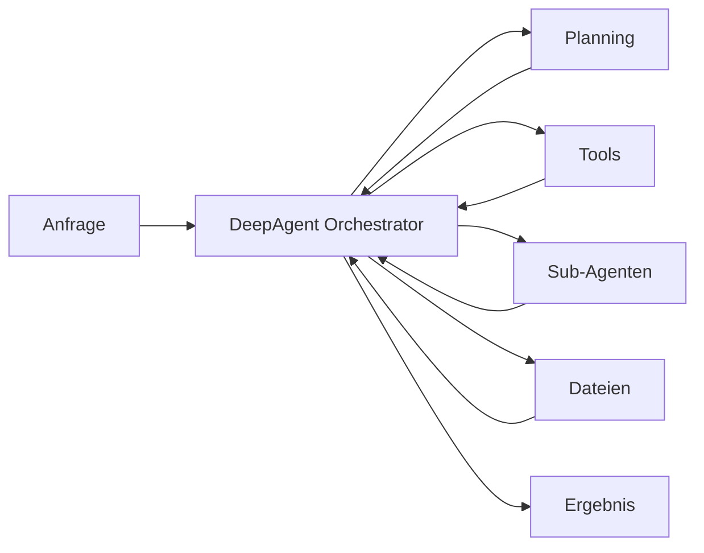
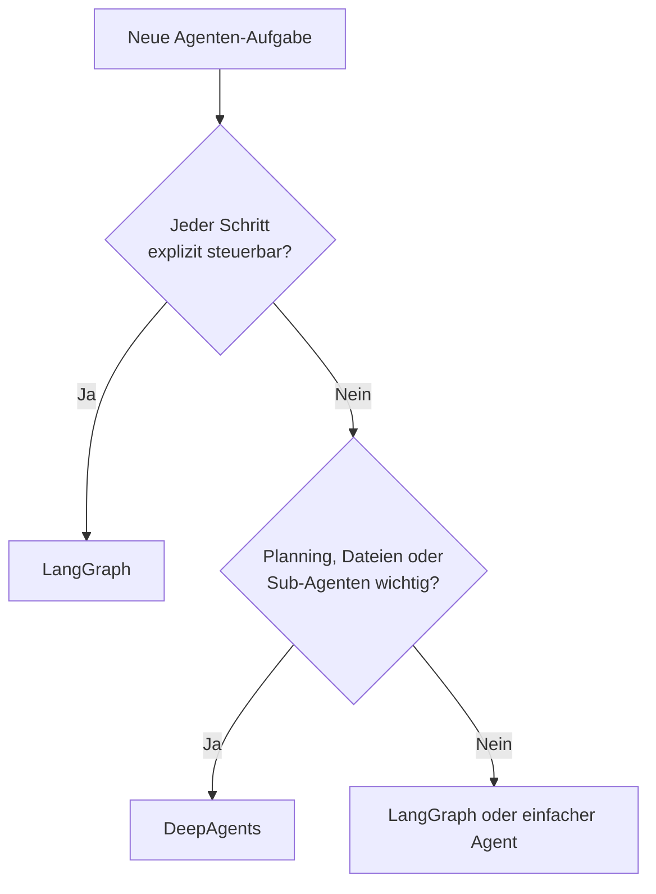
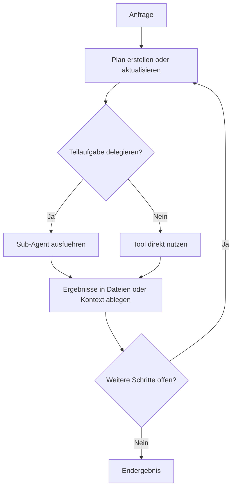

# DeepAgents Einsteiger
{: .no_toc }

> **Harness-Ansatz für Planning, Filesystem und Sub-Agenten**    

---

# Inhaltsverzeichnis
{: .no_toc .text-delta }

1. TOC
{:toc}

---

## 1 Kurzüberblick: Was ist DeepAgents?

DeepAgents ist eine zusätzliche Abstraktionsschicht im LangChain-Ökosystem.  
Während LangGraph Workflows explizit über **State**, **Nodes** und **Edges** modelliert, liefert DeepAgents ein bereits vorbereitetes **Harness** für typische agentische Langläufer-Aufgaben.

Typische Bausteine sind:

- **Planning** über eingebaute Todo-Mechanismen
- **Filesystem-Zugriff** über Lese-/Schreibwerkzeuge
- **Sub-Agenten** für delegierte Teilaufgaben
- **Tool-Integration** für Recherche, APIs oder Code

Kurz gesagt:

- **LangGraph** = maximale Kontrolle
- **DeepAgents** = weniger Boilerplate, mehr eingebaute Infrastruktur

Damit eignet sich DeepAgents besonders für Aufgaben wie:

- Recherche mit mehreren Zwischenschritten
- Sammeln und Ablegen von Notizen
- Delegation an spezialisierte Unteragenten
- längere Aufgaben mit Zwischenständen und Plananpassung

Ein kompakter Architektur-Blick:



---

## 2 Wann DeepAgents, wann LangGraph?

DeepAgents ist kein Ersatz für LangGraph, sondern eine bequeme Schicht darüber.

| Frage | Eher LangGraph | Eher DeepAgents |
|---|---|---|
| Muss jeder Schritt exakt kontrolliert werden? | Ja | Nein |
| Sollen Routing und State vollständig sichtbar sein? | Ja | Nur teilweise |
| Soll ein Agent autonom planen und Dateien nutzen? | Mit Eigenbau | Direkt eingebaut |
| Werden Sub-Agenten als Komfortfunktion gebraucht? | Aufwändiger | Direkt vorgesehen |
| Steht Lerntransparenz im Vordergrund? | Stärker geeignet | Nur bedingt |

**Faustregel:**  
Wenn Kontrolle und Nachvollziehbarkeit im Vordergrund stehen, ist LangGraph meist die bessere Wahl.  
Wenn ein autonomer Agent mit Planning, Dateien und Delegation schnell aufgebaut werden soll, ist DeepAgents oft der direktere Weg.

Als schnelle Orientierung:



---

## 3 Das kleinstmögliche funktionierende Beispiel

Der schnellste Zugang ist ein Minimalbeispiel mit einem Tool und einem DeepAgent.

### 3.1 Installation

```bash
pip install deepagents
```

Je nach eingesetztem Modellanbieter werden zusätzlich die passenden Provider-Pakete und API-Schlüssel benötigt.

### 3.2 Ein einfaches Tool

```python
from langchain_core.tools import tool

@tool
def begriff_erklaeren(begriff: str) -> str:
    """Erklärt einen KI-Begriff in einem Satz."""
    glossar = {
        "langgraph": "LangGraph ist ein Framework für zustandsbasierte Workflows mit Nodes und Edges.",
        "harness": "Ein Harness ist ein Rahmengerüst, das Planung, Dateien und Delegation bereitstellt.",
        "deepagents": "DeepAgents ist ein LangChain-Harness für planende, dateibasierte Agenten mit Sub-Agenten.",
    }
    return glossar.get(begriff.lower(), f"Kein Eintrag für: {begriff}")
```

### 3.3 Agent erzeugen

```python
from deepagents import create_deep_agent
from langchain.chat_models import init_chat_model

agent = create_deep_agent(
    model=init_chat_model("openai:gpt-4o-mini", temperature=0.0),
    tools=[begriff_erklaeren],
    system_prompt=(
        "Ein kompakter Kurs-Assistent für agentische Systeme. "
        "Werkzeuge gezielt nutzen und auf Deutsch antworten."
    ),
)
```

### 3.4 Agent ausführen

```python
result = agent.invoke({
    "messages": [
        {"role": "user", "content": "Was ist ein Harness und was ist DeepAgents?"}
    ]
})

print(result["messages"][-1].content)
```

**Ergebnis:** Ein lauffähiger Agent mit eingebauter Harness-Struktur, ohne dass StateGraph, Routing-Funktionen oder Schleifen manuell modelliert werden mussten.

---

## 4 Die Grundidee: Planning, Dateien, Delegation

DeepAgents wird leichter verständlich, wenn die drei Kernideen getrennt betrachtet werden.

### 4.1 Planning

Das Harness kann Aufgaben in Teilschritte zerlegen und diese intern als Arbeitsplan verwalten.

Typischer Nutzen:

- mehrstufige Aufgaben werden expliziter
- Zwischenschritte bleiben nachvollziehbarer
- neue Informationen können in den Plan zurückfließen

Merksatz: **Nicht nur reagieren, sondern Arbeitsschritte sichtbar organisieren.**

### 4.2 Dateien statt nur Chat-History

DeepAgents arbeitet nicht nur mit Nachrichten, sondern kann Informationen in Dateien ablegen und später wieder lesen.

Das ist besonders nützlich für:

- längere Recherchen
- Notizen und Zwischenstände
- strukturierte Ergebnisablage
- Entlastung des Chat-Kontexts

Merksatz: **Wissen wird ausgelagert, statt nur im Nachrichtenverlauf mitgeschleppt zu werden.**

### 4.3 Sub-Agenten

Teilaufgaben können an spezialisierte Sub-Agenten delegiert werden.  
Jeder Sub-Agent arbeitet mit eigener History und klarer Rolle.

Beispiele:

- Recherche-Agent
- Schreib-Agent
- Analyse-Agent

Merksatz: **Der Hauptagent koordiniert, Spezialisten bearbeiten Teilprobleme.**

---

## 5 Eigene Tools ergänzen

DeepAgents lebt von kleinen, klaren Werkzeugen.

Ein typisches Muster:

```python
@tool
def kurs_thema_info(thema: str) -> str:
    """Liefert Kurzinfos zu einem Kursthema."""
    daten = {
        "routing": "Bedingte Ablaufsteuerung in Graphen.",
        "checkpointing": "Speichern und Wiederaufnehmen von Sitzungen.",
        "supervisor": "Koordinator-Agent für mehrere spezialisierte Worker.",
    }
    return daten.get(thema.lower(), "Kein Eintrag gefunden.")
```

Anschließend wird das Tool einfach beim Agenten registriert:

```python
agent = create_deep_agent(
    model=init_chat_model("openai:gpt-4o-mini", temperature=0.0),
    tools=[begriff_erklaeren, kurs_thema_info],
    system_prompt="Ein deutschsprachiger Kurs-Assistent.",
)
```

Bewährte Regeln:

- pro Tool eine klar abgegrenzte Aufgabe
- präziser Docstring
- sprechende Parameternamen
- einfache, serialisierbare Rückgaben

---

## 6 Einfacher Sub-Agent

Sub-Agenten werden als Konfigurationsobjekte beschrieben und dem Hauptagenten übergeben.

```python
research_subagent = {
    "name": "recherche",
    "description": "Sammelt gezielt Fachinformationen zu agentischen Konzepten",
    "system_prompt": (
        "Spezialisierter Recherche-Agent. "
        "Knappe, saubere Fachzusammenfassungen auf Deutsch liefern."
    ),
    "tools": [begriff_erklaeren, kurs_thema_info],
}
```

Der Hauptagent erhält diesen Sub-Agenten beim Erstellen:

```python
agent = create_deep_agent(
    model=init_chat_model("openai:gpt-4o-mini", temperature=0.0),
    tools=[],
    subagents=[research_subagent],
    system_prompt=(
        "Ein Koordinator-Agent. "
        "Recherche-Aufgaben bei Bedarf an den Sub-Agenten delegieren."
    ),
)
```

Der wichtige Punkt:  
Der Hauptagent sieht am Ende vor allem das Ergebnis der Teilaufgabe, nicht jede interne Einzelaktion des Sub-Agenten.

---

## 7 Was intern passiert

Auch wenn das Harness viel Arbeit abnimmt, läuft darunter weiterhin ein agentischer Workflow ab:

1. Eine Anfrage trifft ein.
2. Das Harness plant oder verfeinert Teilschritte.
3. Tools oder Sub-Agenten werden aufgerufen.
4. Ergebnisse werden im Kontext oder in Dateien abgelegt.
5. Der Plan wird angepasst, bis ein Endergebnis vorliegt.

Das ist der zentrale Unterschied zu einfachen Loop-Agenten:

- **flacher Agent**: Anfrage → Tool-Call → Antwort
- **DeepAgent**: Anfrage → Plan → Teilaufgaben → Zwischenstände → Überarbeitung → Ergebnis



---

## 8 Grenzen und Debugging

DeepAgents spart Code, versteckt aber auch mehr Logik.

Typische Grenzen:

- weniger direkte Kontrolle als bei manuell gebautem LangGraph
- interne Abläufe sind nicht so transparent wie ein selbst definierter Graph
- frühe API-Versionen können sich schneller ändern
- Debugging setzt weiterhin LangGraph-Grundverständnis voraus

Deshalb gilt:

- Für **Lerntransparenz**, präzises Routing und kontrollierte Abläufe ist LangGraph oft besser.
- Für **autonome, längere Aufgaben mit Planning und Delegation** ist DeepAgents attraktiv.

Praktisch bewährt:

- Versionen pinnen
- kleine Tools statt Monolithen bauen
- System-Prompts klar halten
- Traces regelmäßig prüfen

---

## 9 Einordnung im Kurskontext

DeepAgents ist am nützlichsten, wenn bereits ein Fundament vorhanden ist:

- Tool-Nutzung
- strukturierte Ausgaben
- State-Denken
- Routing
- Multi-Agent-Muster

Dann wird klar, was das Harness tatsächlich leistet:

- Es ersetzt nicht das Verständnis der Mechanik.
- Es verpackt bekannte Mechaniken in ein schneller nutzbares Gerüst.

Kurzform:

- **LangGraph lernen**, um agentische Abläufe zu verstehen
- **DeepAgents nutzen**, um bestimmte komplexe Muster schneller aufzubauen

---

## 10 Zusammenfassung

DeepAgents ist ein komfortabler Harness-Ansatz für agentische Systeme mit:

- Planning
- dateibasiertem Arbeiten
- Sub-Agenten
- integrierter Tool-Nutzung

Die Stärke liegt in schneller Umsetzung komplexerer, langlaufender Aufgaben.  
Die Kehrseite ist geringere Transparenz gegenüber einem manuell modellierten LangGraph.

Für den Einstieg empfiehlt sich daher folgende Reihenfolge:

1. LangChain-Grundlagen
2. LangGraph-Grundlagen
3. Multi-Agent- und Kontrollmuster
4. erst dann DeepAgents

So bleibt sichtbar, wo das Harness vereinfacht und wo weiterhin LangGraph-Denken im Hintergrund wirkt.


---

**Version:** 1.0    
**Stand:** März 2026    
**Kurs:** KI-Agenten. Verstehen. Anwenden. Gestalten.  
