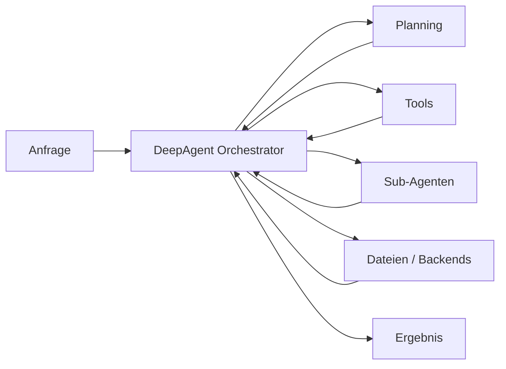
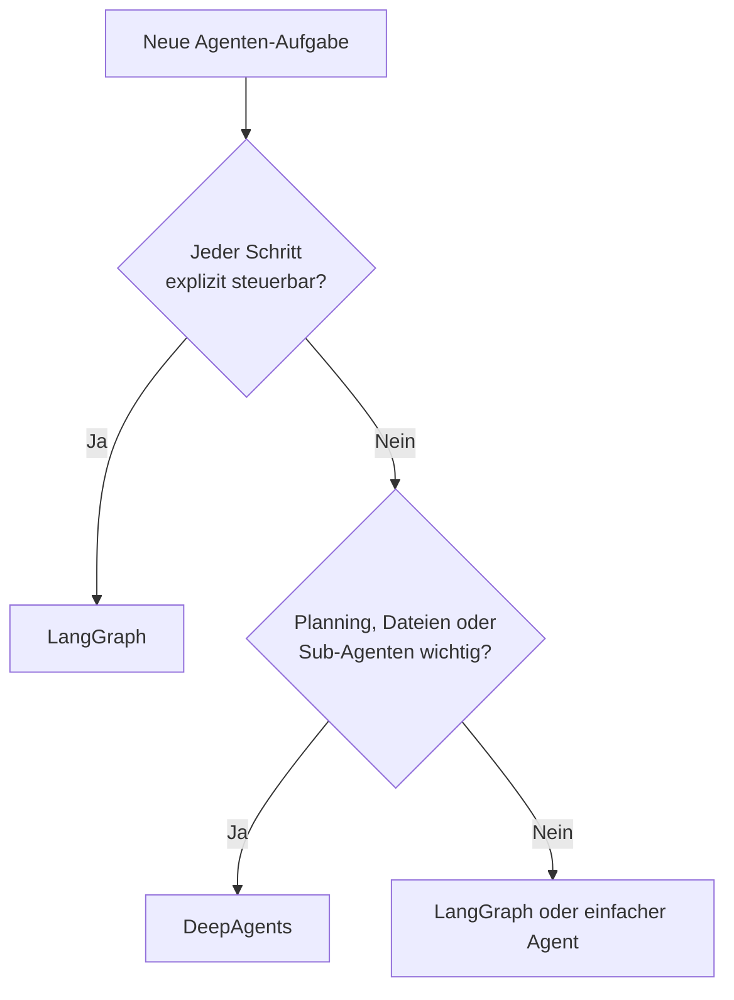
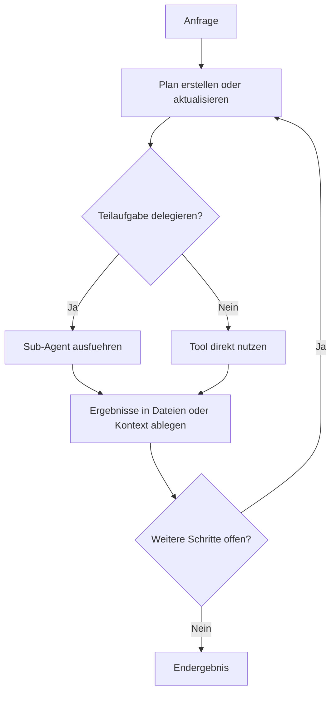

# DeepAgents Einsteiger
{: .no_toc }

> **Harness-Ansatz für Planning, Filesystem und Sub-Agenten — provider-agnostisch, MIT-lizenziert**

---

# Inhaltsverzeichnis
{: .no_toc .text-delta }

1. TOC
{:toc}

---

## Kurzüberblick: Was ist DeepAgents?

DeepAgents ist eine zusätzliche Abstraktionsschicht im LangChain-Ökosystem.
Während LangGraph Workflows explizit über **State**, **Nodes** und **Edges** modelliert, liefert DeepAgents ein bereits vorbereitetes **Harness** für typische agentische Langläufer-Aufgaben.

### Herkunft

LangChain hat DeepAgents explizit als Open-Source-Umsetzung der Claude-Code-Architektur veröffentlicht — aus dem README:

> *"This project was primarily inspired by Claude Code, and initially was largely an attempt to see what made Claude Code general purpose, and make it even more so."*

Ziel war nicht, Claude Code zu kopieren, sondern die Kernarchitektur zu verstehen, zu verallgemeinern und provider-agnostisch zugänglich zu machen. MIT-Lizenz. Kostenlos.

### Kernbausteine

- **Planning** über eingebaute Todo-Mechanismen
- **Filesystem-Zugriff** über Lese-/Schreibwerkzeuge mit austauschbaren Backends
- **Sub-Agenten** für delegierte Teilaufgaben
- **Tool-Integration** für Recherche, APIs oder Code
- **Persistentes Gedächtnis** über LangGraph Memory Store

Kurz gesagt:

- **LangGraph** = maximale Kontrolle
- **DeepAgents** = weniger Boilerplate, mehr eingebaute Infrastruktur

DeepAgents eignet sich besonders für:

- Recherche mit mehreren Zwischenschritten
- Sammeln und Ablegen von Notizen
- Delegation an spezialisierte Unteragenten
- Längere Aufgaben mit Zwischenständen und Plananpassung

Ein kompakter Architektur-Blick:



---

## Wann DeepAgents, wann LangGraph?

DeepAgents ist kein Ersatz für LangGraph, sondern eine bequeme Schicht darüber.

| Frage | Eher LangGraph | Eher DeepAgents |
|---|---|---|
| Muss jeder Schritt exakt kontrolliert werden? | Ja | Nein |
| Sollen Routing und State vollständig sichtbar sein? | Ja | Nur teilweise |
| Soll ein Agent autonom planen und Dateien nutzen? | Mit Eigenbau | Direkt eingebaut |
| Werden Sub-Agenten als Komfortfunktion gebraucht? | Aufwändiger | Direkt vorgesehen |
| Steht Lerntransparenz im Vordergrund? | Stärker geeignet | Nur bedingt |
| Müssen verschiedene Modellanbieter verglichen werden? | Aufwändig | Direkt unterstützt |

**Faustregel:**
Wenn Kontrolle und Nachvollziehbarkeit im Vordergrund stehen, ist LangGraph meist die bessere Wahl.
Wenn ein autonomer Agent mit Planning, Dateien und Delegation schnell aufgebaut werden soll, ist DeepAgents oft der direktere Weg.

Als schnelle Orientierung:



---

## Das kleinstmögliche funktionierende Beispiel

Der schnellste Zugang ist ein Minimalbeispiel mit einem Tool und einem DeepAgent.

### Installation

```bash
pip install deepagents
```

Je nach eingesetztem Modellanbieter werden zusätzlich die passenden Provider-Pakete und API-Schlüssel benötigt.

### Ein einfaches Tool

```python
from langchain_core.tools import tool

@tool
def begriff_erklaeren(begriff: str) -> str:
    """Erklärt einen KI-Begriff in einem Satz."""
    glossar = {
        "langgraph": "LangGraph ist ein Framework für zustandsbasierte Workflows mit Nodes und Edges.",
        "harness": "Ein Harness ist ein Rahmengerüst, das Planung, Dateien und Delegation bereitstellt.",
        "deepagents": "DeepAgents ist ein LangChain-Harness für planende, dateibasierte Agenten mit Sub-Agenten.",
    }
    return glossar.get(begriff.lower(), f"Kein Eintrag für: {begriff}")
```

### Agent erzeugen

```python
from deepagents import create_deep_agent
from langchain.chat_models import init_chat_model

agent = create_deep_agent(
    model=init_chat_model("openai:gpt-4o-mini", temperature=0.0),
    tools=[begriff_erklaeren],
    system_prompt=(
        "Ein kompakter Kurs-Assistent für agentische Systeme. "
        "Werkzeuge gezielt nutzen und auf Deutsch antworten."
    ),
)
```

### Agent ausführen

```python
result = agent.invoke({
    "messages": [
        {"role": "user", "content": "Was ist ein Harness und was ist DeepAgents?"}
    ]
})

print(result["messages"][-1].content)
```

**Ergebnis:** Ein lauffähiger Agent mit eingebauter Harness-Struktur, ohne dass StateGraph, Routing-Funktionen oder Schleifen manuell modelliert werden mussten.

`create_deep_agent()` gibt einen kompilierten LangGraph-Graphen zurück — Streaming, LangGraph Studio, Checkpointer und Persistenz funktionieren damit automatisch.

---

## Die Grundidee: Planning, Dateien, Delegation

DeepAgents wird leichter verständlich, wenn die drei Kernideen getrennt betrachtet werden.

### Planning — und die No-Op-Einsicht

Das Harness kann Aufgaben in Teilschritte zerlegen und diese intern als Arbeitsplan verwalten.

**Die wichtigste Erkenntnis:** Das eingebaute `write_todos`-Tool ist ein No-Op — es führt nichts aus. Es schreibt lediglich eine Aufgabenliste.

Das klingt zunächst trivial, ist aber das Herzstück der Architektur:

> Das Tool tut nichts. Aber **der Akt des Planens** hält den Agenten über viele Schritte auf Kurs.

Das ist kein Bug, sondern bewusstes **Context Engineering**: Das Modell formuliert einen Plan, hält ihn im Kontext und passt ihn bei neuen Informationen an. So bleiben auch lange Aufgaben fokussiert — nicht weil ein Mechanismus den Agenten zwingt, sondern weil das Niederschreiben des Plans bereits die Aufmerksamkeit lenkt.

Typischer Nutzen:

- Mehrstufige Aufgaben werden expliziter
- Zwischenschritte bleiben nachvollziehbarer
- Neue Informationen können in den Plan zurückfließen

Merksatz: **Nicht nur reagieren, sondern Arbeitsschritte sichtbar organisieren.**

### Dateien statt nur Chat-History — und austauschbare Backends

DeepAgents arbeitet nicht nur mit Nachrichten, sondern kann Informationen in Dateien ablegen und später wieder lesen.

Das ist besonders nützlich für:

- Längere Recherchen
- Notizen und Zwischenstände
- Strukturierte Ergebnisablage
- Entlastung des Chat-Kontexts

**Pluggable Filesystem Backends** — der Ablageort ist konfigurierbar:

| Backend | Verwendung |
|---------|-----------|
| In-Memory | Tests, kurzlebige Aufgaben |
| Local Disk | Lokale Entwicklung |
| LangGraph Store | Thread-übergreifende Persistenz |
| Sandboxes (Modal, Daytona, Deno) | Isolierte Code-Ausführung in der Cloud |
| Custom Backend | Eigenentwicklung für spezielle Anforderungen |

Das Backend lässt sich austauschen, ohne die Agent-Logik zu ändern.

Merksatz: **Wissen wird ausgelagert, statt nur im Nachrichtenverlauf mitgeschleppt zu werden.**

### Sub-Agenten

Teilaufgaben können an spezialisierte Sub-Agenten delegiert werden.
Jeder Sub-Agent arbeitet mit eigener History und klarer Rolle.

Beispiele:

- Recherche-Agent
- Schreib-Agent
- Analyse-Agent

Merksatz: **Der Hauptagent koordiniert, Spezialisten bearbeiten Teilprobleme.**

---

## Eigene Tools ergänzen

DeepAgents lebt von kleinen, klaren Werkzeugen.

Ein typisches Muster:

```python
@tool
def kurs_thema_info(thema: str) -> str:
    """Liefert Kurzinfos zu einem Kursthema."""
    daten = {
        "routing": "Bedingte Ablaufsteuerung in Graphen.",
        "checkpointing": "Speichern und Wiederaufnehmen von Sitzungen.",
        "supervisor": "Koordinator-Agent für mehrere spezialisierte Worker.",
    }
    return daten.get(thema.lower(), "Kein Eintrag gefunden.")
```

Anschließend wird das Tool einfach beim Agenten registriert:

```python
agent = create_deep_agent(
    model=init_chat_model("openai:gpt-4o-mini", temperature=0.0),
    tools=[begriff_erklaeren, kurs_thema_info],
    system_prompt="Ein deutschsprachiger Kurs-Assistent.",
)
```

Bewährte Regeln:

- Pro Tool eine klar abgegrenzte Aufgabe
- Präziser Docstring
- Sprechende Parameternamen
- Einfache, serialisierbare Rückgaben

---

## Einfacher Sub-Agent

Sub-Agenten werden als Konfigurationsobjekte beschrieben und dem Hauptagenten übergeben.

```python
research_subagent = {
    "name": "recherche",
    "description": "Sammelt gezielt Fachinformationen zu agentischen Konzepten",
    "system_prompt": (
        "Spezialisierter Recherche-Agent. "
        "Knappe, saubere Fachzusammenfassungen auf Deutsch liefern."
    ),
    "tools": [begriff_erklaeren, kurs_thema_info],
}
```

Der Hauptagent erhält diesen Sub-Agenten beim Erstellen:

```python
agent = create_deep_agent(
    model=init_chat_model("openai:gpt-4o-mini", temperature=0.0),
    tools=[],
    subagents=[research_subagent],
    system_prompt=(
        "Ein Koordinator-Agent. "
        "Recherche-Aufgaben bei Bedarf an den Sub-Agenten delegieren."
    ),
)
```

Der wichtige Punkt:
Der Hauptagent sieht am Ende vor allem das Ergebnis der Teilaufgabe, nicht jede interne Einzelaktion des Sub-Agenten.

---

## CLI und erweiterte Features

Neben dem Python-SDK gibt es eine eigenständige **DeepAgents CLI** — die interaktive Terminal-Variante für den direkten Einsatz.

### Installation der CLI

```bash
# Linux / Mac
curl -LsSf https://raw.githubusercontent.com/langchain-ai/deepagents/main/libs/cli/scripts/install.sh | bash
```

### Was die CLI hinzufügt

| Feature | SDK | CLI |
|---------|-----|-----|
| Tools registrieren | ✅ | ✅ |
| Sub-Agenten | ✅ | ✅ |
| Filesystem Backends | ✅ | ✅ |
| Web-Suche | — | ✅ |
| Remote-Sandboxes | — | ✅ |
| Persistentes Gedächtnis | — | ✅ |
| Human-in-the-Loop Approval | — | ✅ |
| Custom Skills | — | ✅ |

### MCP-Support

DeepAgents unterstützt das **Model Context Protocol (MCP)** via `langchain-mcp-adapters`.
Bereits konfigurierte MCP-Server (z. B. Google Workspace, Notion, Slack) können direkt verwendet werden.

### Langzeitgedächtnis

Über den LangGraph Memory Store kann der Agent Informationen **thread-übergreifend** speichern. Vorherige Gespräche und deren Kontext bleiben erhalten.

---

## 8 Provider-Agnostik: Das zentrale Versprechen

Der wichtigste Unterschied zu Claude Code oder Codex: **DeepAgents ist modellunabhängig.**

Dieselbe Harness-Architektur läuft mit jedem der 100+ LangChain-kompatiblen Modellanbieter.

```python
# OpenAI
agent = create_deep_agent(model=init_chat_model("openai:gpt-4o-mini", temperature=0.0), ...)

# Anthropic
agent = create_deep_agent(model=init_chat_model("anthropic:claude-3-5-sonnet"), ...)

# Google
agent = create_deep_agent(model=init_chat_model("google_vertexai:gemini-2.0-flash"), ...)
```

Der Wechsel erfordert nur eine Zeile — Planning, Tools, Sub-Agenten und Filesystem bleiben unverändert.

Das ist besonders relevant, wenn:

- Verschiedene Modelle für denselben Agenten verglichen werden sollen
- Organisationsrichtlinien Multi-Provider-Unterstützung erfordern
- Kosten zwischen Anbietern optimiert werden sollen

### 8.1 Vergleich: DeepAgents vs. Claude Agent SDK vs. Codex SDK

| Kriterium | DeepAgents | Claude Agent SDK | Codex SDK |
|---|---|---|---|
| Modellanbieter | 100+ (provider-agnostisch) | Anthropic (Claude) | OpenAI (GPT/Codex) |
| Lizenz | MIT | — | — |
| Planning / Filesystem | Eingebaut | Teils | Teils |
| Produktionsreife | Neu (2026) | Erprobt (>1 Jahr) | Erprobt |
| LangGraph-Integration | Nativ | — | — |
| MCP-Support | Ja | Ja | Nein |
| Human-in-the-Loop | Ja (CLI) | Ja | Nein |

**Wo Claude Agent SDK überlegen bleibt:**
Straffere Claude-Integration, native Permission-Modelle, Session-Management, und über ein Jahr Produktionsreife mit Millionen realer Interaktionen. Für exklusive Claude-Projekte ist der Agent SDK die erste Wahl.

**Wo DeepAgents gewinnt:**
Modellfreiheit, pluggable Backends, Unabhängigkeit von einem einzelnen Anbieter.

---

## 9 Was intern passiert

Auch wenn das Harness viel Arbeit abnimmt, läuft darunter weiterhin ein agentischer Workflow ab:

1. Eine Anfrage trifft ein.
2. Das Harness plant oder verfeinert Teilschritte (`write_todos` — No-Op).
3. Tools oder Sub-Agenten werden aufgerufen.
4. Ergebnisse werden im Kontext oder in Dateien abgelegt.
5. Der Plan wird angepasst, bis ein Endergebnis vorliegt.

Das ist der zentrale Unterschied zu einfachen Loop-Agenten:

- **flacher Agent**: Anfrage → Tool-Call → Antwort
- **DeepAgent**: Anfrage → Plan → Teilaufgaben → Zwischenstände → Überarbeitung → Ergebnis



---

## 10 Grenzen und Debugging

DeepAgents spart Code, versteckt aber auch mehr Logik.

### 10.1 Typische Grenzen

- Weniger direkte Kontrolle als bei manuell gebautem LangGraph
- Interne Abläufe sind nicht so transparent wie ein selbst definierter Graph
- Frühe API-Versionen können sich schneller ändern
- Debugging setzt weiterhin LangGraph-Grundverständnis voraus
- Noch keine Produktionsreife wie Claude Code (kein Jahr Praxiserfahrung)

### 10.2 Das "Trust the LLM"-Modell und Security

DeepAgents verfolgt eine bewusst offene Philosophie — aus dem README:

> *"Deep Agents follows a 'trust the LLM' model. The agent can do anything its tools allow. Enforce boundaries at the tool/sandbox level, not by expecting the model to self-police."*

Das bedeutet:

- Grenzen werden **nicht** durch Model-Prompts gesetzt
- Grenzen entstehen durch **Tool-Konfiguration** und **Sandbox-Wahl**
- Ein Agent mit breitem Filesystem-Zugriff und ohne Sandbox kann alles, was Tools erlauben

Das ist eine Designentscheidung, keine Schwäche — aber wer DeepAgents produktiv einsetzt, trägt die Verantwortung für saubere Tool-Grenzen.

### 10.3 Praktische Hinweise

- Versionen pinnen
- Kleine Tools statt Monolithen bauen
- System-Prompts klar halten
- Traces regelmäßig prüfen (LangSmith)
- In Produktion: Sandboxes für Code-Ausführung verwenden

Deshalb gilt:

- Für **Lerntransparenz**, präzises Routing und kontrollierte Abläufe ist LangGraph oft besser.
- Für **autonome, längere Aufgaben mit Planning und Delegation** ist DeepAgents attraktiv.

---

## 11 Einordnung im Kurskontext

DeepAgents ist am nützlichsten, wenn bereits ein Fundament vorhanden ist:

- Tool-Nutzung
- Strukturierte Ausgaben
- State-Denken
- Routing
- Multi-Agent-Muster

Dann wird klar, was das Harness tatsächlich leistet:

- Es ersetzt nicht das Verständnis der Mechanik.
- Es verpackt bekannte Mechaniken in ein schneller nutzbares Gerüst.

Kurzform:

- **LangGraph lernen**, um agentische Abläufe zu verstehen
- **DeepAgents nutzen**, um bestimmte komplexe Muster schneller aufzubauen

---

## 12 Zusammenfassung

DeepAgents ist ein komfortabler Harness-Ansatz für agentische Systeme mit:

- Planning (No-Op-Mechanismus als Context Engineering)
- Dateibasiertem Arbeiten mit austauschbaren Backends
- Sub-Agenten für parallele Delegation
- Integrierter Tool-Nutzung
- Provider-Agnostik (100+ Anbieter)
- CLI mit Web-Suche, HITL, MCP und persistentem Gedächtnis

Die Stärke liegt in schneller Umsetzung komplexerer, langlaufender Aufgaben — ohne Provider-Bindung.
Die Kehrseite ist geringere Transparenz gegenüber einem manuell modellierten LangGraph sowie fehlende Produktionsreife gegenüber spezialisierten SDKs wie dem Claude Agent SDK.

Für den Einstieg empfiehlt sich daher folgende Reihenfolge:

1. LangChain-Grundlagen
2. LangGraph-Grundlagen
3. Multi-Agent- und Kontrollmuster
4. Erst dann DeepAgents

So bleibt sichtbar, wo das Harness vereinfacht und wo weiterhin LangGraph-Denken im Hintergrund wirkt.


---

**Version:** 1.1    
**Stand:** März 2026    
**Kurs:** KI-Agenten. Verstehen. Anwenden. Gestalten.    
