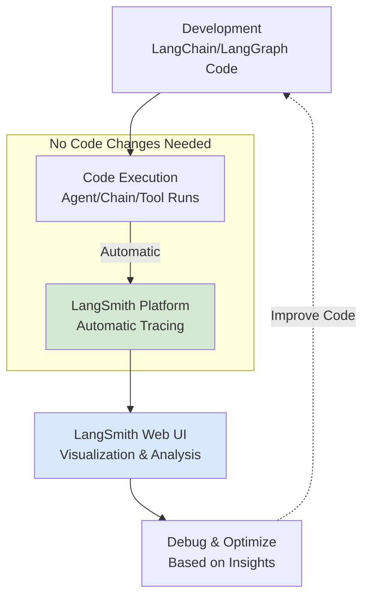
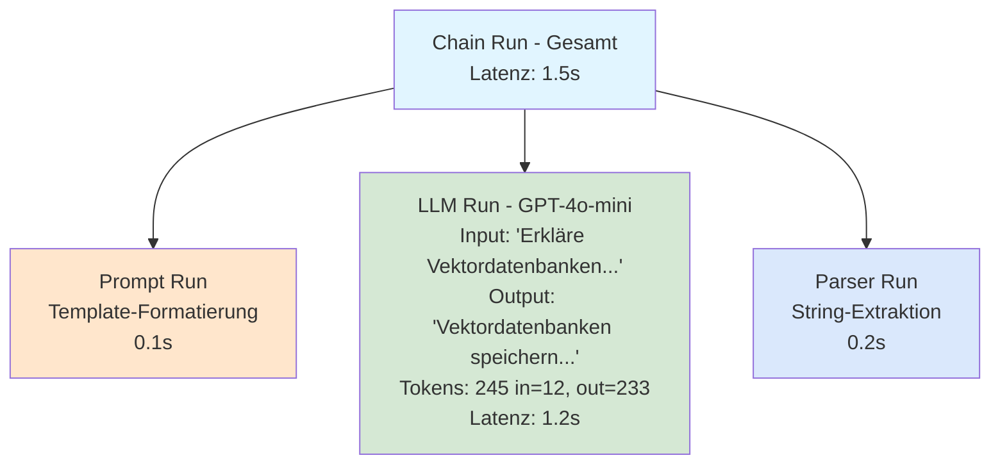
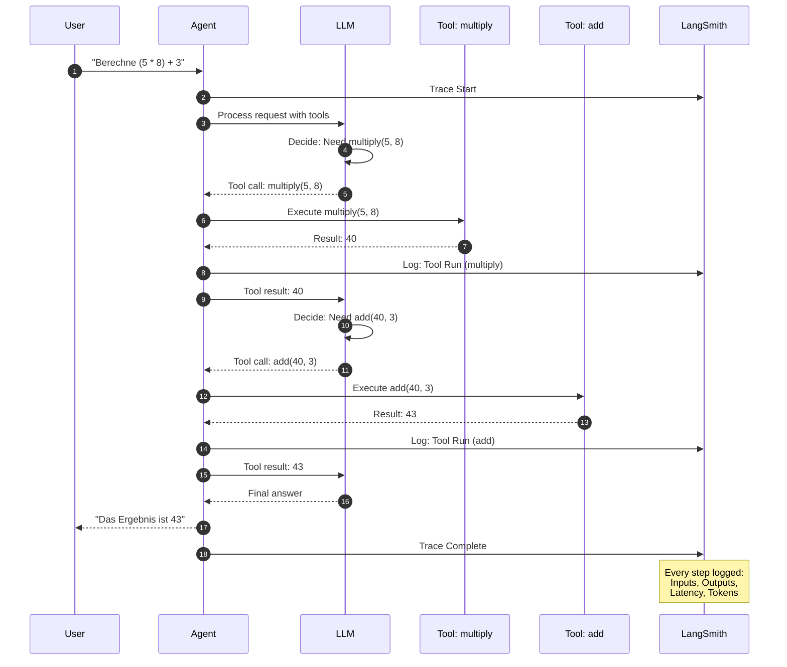
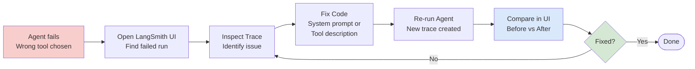

# LangSmith Einsteiger
{: .no_toc }

> **Monitoring & Debugging mit LangSmith**

---

# Inhaltsverzeichnis
{: .no_toc .text-delta }

1. TOC
{:toc}

---

## 1 Kurzüberblick: Warum LangSmith?

LangChain und LangGraph ermöglichen den Bau komplexer KI-Agenten. Doch bei der Entwicklung stellen sich schnell Fragen:
- **Warum** hat der Agent eine bestimmte Entscheidung getroffen?
- **Welche** Tools wurden in welcher Reihenfolge aufgerufen?
- **Wo** ist der Fehler in einer 10-Schritte-Chain?
- **Wie gut** funktioniert das System mit echten Nutzerfragen?

LangSmith beantwortet diese Fragen durch:
- **Vollständiges Tracing** aller LLM-Calls, Tool-Aufrufe und Chain-Schritte
- **Visuelle Darstellung** komplexer Agent-Workflows
- **Dataset-Management** für systematische Evaluierung
- **Performance-Monitoring** in Produktion
- **Feedback-Collection** von Nutzern

Kernprinzip: **Jede Ausführung wird automatisch protokolliert und kann nachvollzogen werden** – ohne zusätzlichen Code im Workflow selbst.

### 1.1 LangSmith im Entwicklungs-Workflow



---

## 2 Setup: API-Key und Umgebung

### 2.1 LangSmith-Account erstellen

1. Kostenlosen Account anlegen: [eu.smith.langchain.com](https://eu.smith.langchain.com/)
2. API-Key generieren: Settings → API Keys → Create API Key (im **EU-Workspace**)
3. Optional: Organisation und Projekte anlegen

{: .warning }
> **Wichtig (EU/US-Endpunkte):** Für diesen Kurs immer den **EU-Endpoint** verwenden: `https://eu.api.smith.langchain.com`.  
> Account und API-Key müssen ebenfalls im EU-Workspace erstellt werden, sonst erscheinen Traces nicht im erwarteten Projekt.

### 2.2 API-Keys in Google Colab Secrets hinterlegen

**Schritt 1: Secrets in Colab einrichten**
1. In Google Colab: Schlüssel-Symbol 🔑 in der linken Seitenleiste
2. Neue Secrets hinzufügen:
   - `OPENAI_API_KEY`: Eigener OpenAI-Key
   - `LANGSMITH_API_KEY`: LangSmith-Key (beginnt mit `lsv2_pt_...`)
   - Optional: `HF_TOKEN` für Hugging Face

**Schritt 2: Umgebung einrichten (Standard-Setup)**

{: .warning }
> ⚠️ **Reihenfolge-Regel:** LangSmith-Env-Vars müssen gesetzt sein, **bevor** `langchain`, `langsmith` oder `genai_lib` importiert werden. Der Tracer liest die Env-Vars beim ersten Import – späteres Setzen wird ignoriert. Deshalb: Env-Vars ganz oben in der Setup-Cell, vor allen Imports.

```python
#@title 🔧 Umgebung einrichten{ display-mode: "form" }
!uv pip install --system -q git+https://github.com/ralf-42/GenAI.git#subdirectory=04_modul

import os

# ✅ LangSmith Env-Vars ZUERST – vor allen Imports!
os.environ["LANGSMITH_TRACING"] = "true"
os.environ["LANGSMITH_PROJECT"]    = "M02-LangSmith-Setup"  # Konvention: "M##-Thema"
os.environ["LANGSMITH_ENDPOINT"]   = "https://eu.api.smith.langchain.com"

# Erst danach: genai_lib und weitere Imports
from genai_lib.utilities import check_environment, get_ipinfo, setup_api_keys, mprint

setup_api_keys(['OPENAI_API_KEY', 'LANGSMITH_API_KEY'], create_globals=False)
print()
check_environment()
print()
get_ipinfo()
```

**Wichtig:**
- Env-Vars stehen **vor** dem `genai_lib`-Import – das ist Pflicht laut Best Practices
- **Projektname-Konvention:** `"M##-Thema"` (z.B. `"M06-Structured-Output"`) – Traces sind sofort dem Modul zuzuordnen
- `create_globals=False` verhindert globale Variablen (Best Practice)
- Ab jetzt werden **alle** LangChain/LangGraph-Operationen automatisch getrackt

---

## 3 Das kleinstmögliche funktionierende Beispiel

Der schnellste Weg zum Verständnis: Ein einfacher LLM-Call mit automatischem Tracing.

```python
from langchain.chat_models import init_chat_model

# Normaler LLM-Setup (wie gewohnt)
llm = init_chat_model("openai:gpt-4o-mini", temperature=0.0)

# Einfacher Call - wird automatisch getrackt!
response = llm.invoke("Erkläre LangSmith in einem Satz.")
print(response.content)
```

**Was passiert im Hintergrund:**
1. LangSmith empfängt automatisch alle Daten (Input, Output, Latenz, Token)
2. Ein "Trace" wird erstellt und in der Web-UI angezeigt
3. Kein zusätzlicher Code nötig – funktioniert "out of the box"

**Nächster Schritt:** LangSmith-Dashboard öffnen und den Trace inspizieren
- URL: [eu.smith.langchain.com/projects](https://eu.smith.langchain.com/projects)
- Projekt auswählen: `"M02-LangSmith-Setup"`
- Ersten Trace anklicken → vollständige Details sehen

---

## 4 Traces verstehen: Die Grundstruktur

Ein **Trace** ist die vollständige Aufzeichnung einer Ausführung. Jeder Trace besteht aus einem oder mehreren **Runs**.

### 4.1 Run-Typen

| Run-Typ | Beschreibung | Beispiel |
|---------|-------------|----------|
| **LLM** | Direkter Modell-Call | `llm.invoke()` |
| **Chain** | LCEL-Pipeline | `prompt \| llm \| parser` |
| **Tool** | Tool-Ausführung | `@tool` Decorator |
| **Agent** | Agent-Entscheidungsloop | `create_agent()` |
| **Retriever** | Dokumenten-Abruf | `vectorstore.as_retriever()` |

### 4.2 Beispiel: Chain mit mehreren Runs

```python
from langchain_core.prompts import ChatPromptTemplate
from langchain_core.output_parsers import StrOutputParser

# LCEL-Chain (aus LangChain-Anleitung bekannt)
prompt = ChatPromptTemplate.from_template("Erkläre {topic} für Einsteiger.")
chain = prompt | llm | StrOutputParser()

result = chain.invoke({"topic": "Vektordatenbanken"})
```

**Im LangSmith-Trace sichtbar:**



**ASCII-Darstellung:**
```
Chain Run (Gesamt)
├─ Prompt Run (Template-Formatierung)
├─ LLM Run (GPT-4o-mini Call)
│  ├─ Input: "Erkläre Vektordatenbanken für Einsteiger."
│  ├─ Output: "Vektordatenbanken speichern..."
│  ├─ Tokens: 245 (Input: 12, Output: 233)
│  └─ Latenz: 1.2s
└─ Parser Run (String-Extraktion)
```

---

## 5 Praktisches Beispiel: Agent mit Tools tracken

Tools und Agents profitieren besonders von LangSmith, da ihre Entscheidungswege oft komplex sind.

```python
from langchain_core.tools import tool
from langchain.agents import create_agent

# Tool definieren (wie in LangChain-Anleitung)
@tool
def multiply(a: int, b: int) -> int:
    """Multipliziert zwei Zahlen."""
    return a * b

@tool
def add(a: int, b: int) -> int:
    """Addiert zwei Zahlen."""
    return a + b

# Agent erstellen
tools = [multiply, add]
agent = create_agent(
    model=llm,
    tools=tools,
    system_prompt="Du bist ein Rechen-Agent. Nutze Tools für Berechnungen.",
)

# Agent ausführen - komplexe Frage
response = agent.invoke({
    "messages": [{"role": "user", "content": "Berechne (5 * 8) + 3"}]
})
```

**Im LangSmith-Trace wird sichtbar:**



**Text-Version:**
1. Agent erhält Frage
2. Agent entscheidet: "Ich brauche multiply(5, 8)"
3. Tool wird ausgeführt → Ergebnis: 40
4. Agent erhält Tool-Output
5. Agent entscheidet: "Ich brauche add(40, 3)"
6. Tool wird ausgeführt → Ergebnis: 43
7. Agent formuliert finale Antwort: "Das Ergebnis ist 43."

**Wichtig:** Jeder Schritt ist einzeln inspizierbar – Input, Output, Latenz, Fehler.

---

## 6 Datasets: Systematisches Testen

Datasets ermöglichen wiederholbare Tests mit definierten Inputs und erwarteten Outputs.

### 6.1 Dataset erstellen (UI oder Code)

**Variante A: Über UI**
1. LangSmith → Datasets → Create Dataset
2. Beispiele hinzufügen (Input/Output-Paare)

**Variante B: Programmatisch**

```python
from langsmith import Client

client = Client(api_url=os.environ["LANGSMITH_ENDPOINT"])

# Dataset mit Beispielen
examples = [
    {"inputs": {"question": "Was ist 5 * 8?"}, "outputs": {"answer": "40"}},
    {"inputs": {"question": "Addiere 10 und 15"}, "outputs": {"answer": "25"}},
    {"inputs": {"question": "Was ist die Hauptstadt von Frankreich?"}, "outputs": {"answer": "Paris"}},
]

dataset_name = "Rechen-Agent-Tests"
dataset = client.create_dataset(dataset_name=dataset_name)

for example in examples:
    client.create_example(
        dataset_id=dataset.id,
        inputs=example["inputs"],
        outputs=example["outputs"],
    )
```

### 6.2 Agent gegen Dataset evaluieren

```python
from langsmith.evaluation import evaluate

def predict(inputs: dict) -> dict:
    """Wrapper für Agent-Aufruf"""
    response = agent.invoke({
        "messages": [{"role": "user", "content": inputs["question"]}]
    })
    # Antwort aus letzter Message extrahieren
    return {"answer": response["messages"][-1].content}

# Evaluierung starten
results = evaluate(
    predict,
    data=dataset_name,
    experiment_prefix="Agent-v1",
)
```

**Ergebnis:**
- Jeder Test-Case wird einzeln ausgeführt
- Traces für alle Runs werden automatisch gespeichert
- Vergleich über UI: Welche Fragen wurden korrekt beantwortet?

---

## 7 Feedback: Qualität messen

Feedback ermöglicht es, die Qualität von Antworten zu bewerten – manuell oder automatisch.

### 7.1 Manuelles Feedback (UI)

In der LangSmith-UI kann jeder Run bewertet werden:
- Daumen hoch/runter
- Sterne (1-5)
- Freitext-Kommentar

### 7.2 Programmatisches Feedback

```python
from langsmith import Client

client = Client(api_url=os.environ["LANGSMITH_ENDPOINT"])

# Nach Agent-Ausführung
run_id = response["__run"].id  # Run-ID aus Response

# Positives Feedback
client.create_feedback(
    run_id=run_id,
    key="user_satisfaction",
    score=1.0,  # 0.0 = schlecht, 1.0 = gut
    comment="Antwort war präzise und korrekt.",
)
```

### 7.3 Automatische Evaluierung mit LLM-as-Judge

```python
from langsmith.evaluation import evaluate, LangChainStringEvaluator

# Evaluator: Bewertet Antwort-Qualität mit LLM
qa_evaluator = LangChainStringEvaluator(
    "qa",
    config={
        "llm": llm,
        "criteria": "correctness",
    },
)

# Evaluierung mit automatischem Scoring
results = evaluate(
    predict,
    data=dataset_name,
    evaluators=[qa_evaluator],
    experiment_prefix="Agent-v1-auto-eval",
)
```

**Vorteile:**
- Skalierbar: 100+ Beispiele automatisch testen
- Konsistent: Gleiche Bewertungskriterien
- Nachvollziehbar: LLM-Begründungen werden gespeichert

---

## 8 Integration in LangGraph-Workflows

LangSmith trackt auch komplexe LangGraph-State-Machines automatisch.

```python
from langgraph.graph import StateGraph, START, END
from langgraph.checkpoint.memory import MemorySaver
from typing import TypedDict, Annotated
from langgraph.graph.message import add_messages

class ChatState(TypedDict):
    messages: Annotated[list, add_messages]

def agent_node(state: ChatState):
    response = llm.invoke(state["messages"])
    return {"messages": [response]}

# Graph bauen
graph = StateGraph(ChatState)
graph.add_node("agent", agent_node)
graph.add_edge(START, "agent")
graph.add_edge("agent", END)

# Mit Checkpointer kompilieren
checkpointer = MemorySaver()
compiled_graph = graph.compile(checkpointer=checkpointer)

# Ausführen - wird automatisch getrackt!
config = {"configurable": {"thread_id": "demo-session"}}
result = compiled_graph.invoke(
    {"messages": [{"role": "user", "content": "Hallo!"}]},
    config=config,
)
```

**Im LangSmith-Trace:**
- Vollständiger Graph-Ablauf sichtbar
- Jeden Node-Durchlauf einzeln inspizierbar
- State-Änderungen nachvollziehbar
- Checkpointing-Events protokolliert

---

## 9 Best Practices für den Kurs

> **Übersicht:** Konfiguration & Organisation (9.1–9.6) · Analyse & Debugging (9.7–9.9)

### 9.1 Projekt-Organisation

**Konvention: Modulname direkt in der Setup-Cell setzen**

```python
# ✅ Modulname in der Setup-Cell – vor allen Imports!
os.environ["LANGSMITH_PROJECT"] = "M06-Structured-Output"
```

**Wichtig:** `LANGSMITH_PROJECT` wird beim ersten Trace via `lru_cache` eingefroren. Spätere `os.environ`-Änderungen haben keinen Effekt. Daher den Modulnamen **einmal korrekt in der Setup-Cell** setzen – dann funktioniert es zuverlässig.

**Standard-Setup im Notebook-Header**
```python
#@title 🔧 Umgebung einrichten{ display-mode: "form" }
!uv pip install --system -q git+https://github.com/ralf-42/GenAI.git#subdirectory=04_modul

import os

# ✅ LangSmith Env-Vars ZUERST – vor allen Imports!
os.environ["LANGSMITH_TRACING"] = "true"
os.environ["LANGSMITH_PROJECT"]    = "M06-Structured-Output"  # Modulname anpassen
os.environ["LANGSMITH_ENDPOINT"]   = "https://eu.api.smith.langchain.com"

# Erst danach: genai_lib und weitere Imports
from genai_lib.utilities import setup_api_keys, check_environment, get_ipinfo

setup_api_keys(['OPENAI_API_KEY', 'LANGSMITH_API_KEY'], create_globals=False)
check_environment()
get_ipinfo()
```

**Modulspezifischer Abschnitt im Notebook (nach dem Setup):**
```python
# LangSmith: Aktives Projekt für diesen Abschnitt
import os
print(f"📊 LangSmith-Projekt: {os.environ['LANGSMITH_PROJECT']}")

# invoke() direkt – Projekt bereits korrekt in Setup-Cell gesetzt
run_cfg = {"run_name": "M06_Kap6_StructuredTrace", "tags": ["M06", "structured-output"]}
result = llm.with_structured_output(MyModel).with_config(**run_cfg).invoke("...")
```

**Konventionen:**

| Kontext | Projektname |
|---------|-------------|
| Kurs-Notebook | `"M##-Thema"` z.B. `"M06-Structured-Output"` |
| Produktion | `"chatbot-production"` |
| Experiment | `"rag-experiment-2026-03"` |

> 💡 **Edge Case:** Falls ein Projekt-Wechsel nach Notebook-Start nötig ist (z.B. kein Kernel-Neustart möglich), kann `ls.tracing_context(project_name=...)` als Workaround verwendet werden.

### 9.2 Tags für bessere Organisation

```python
from langsmith import traceable

@traceable(
    run_type="chain",
    tags=["rag", "produktiv", "version-2.0"],
)
def my_rag_chain(question: str):
    # RAG-Logik hier
    pass
```

### 9.3 Fehler debuggen



**Typischer Workflow:**
1. Agent schlägt fehl (z.B. falsches Tool gewählt)
2. LangSmith öffnen → Run finden
3. Trace inspizieren: An welcher Stelle ging es schief?
4. System-Prompt oder Tool-Description anpassen
5. Erneut testen → Vergleichen im UI

**Vorteil:** Direkter Vorher/Nachher-Vergleich im LangSmith-UI.

### 9.4 Performance-Monitoring

```python
# Metadaten hinzufügen für Filterung
from langsmith import traceable

@traceable(metadata={"user_id": "student_42", "environment": "colab"})
def process_query(query: str):
    return agent.invoke({"messages": [{"role": "user", "content": query}]})
```

**Nutzen:**
- Langsame Runs identifizieren (Latenz > 5s)
- Token-Verbrauch pro Student analysieren
- Fehlerraten nach Umgebung filtern

### 9.5 Einzelne Chains und Runs benennen mit `.with_config()`

Automatisches Tracing erfasst alle Runs – aber ohne explizite Namen sind sie im Dashboard schwer zu unterscheiden. `.with_config()` gibt einzelnen Chains, LLM-Aufrufen und Structured-Output-Chains einen eindeutigen Namen und Tags.

**Prinzip: Config-Parameter vorab in einer separaten Variable festlegen**

```python
# Config-Parameter in einer eigenen Variable definieren
run_cfg = {
    "run_name": "M05_Kap3_LCEL_Grundchain",  # Konvention: M##_Kap##_Typ
    "tags":     ["M05", "lcel", "chain"],     # Filterbar im LangSmith-Dashboard
}

chain = (
    ChatPromptTemplate.from_template("Erkläre {topic} für Einsteiger.")
    | llm
    | StrOutputParser()
).with_config(**run_cfg)

result = chain.invoke({"topic": "Vektordatenbanken"})
```

**Auf LLM-Aufrufe anwenden**

```python
run_cfg = {
    "run_name": "M03_Kap1_LLM_Basis",
    "tags":     ["M03", "llm"],
}

named_llm = llm.with_config(**run_cfg)
response  = named_llm.invoke("Was ist ein Sprachmodell?")
```

**Auf `with_structured_output()` anwenden**

```python
from pydantic import BaseModel, Field

class Person(BaseModel):
    name: str = Field(description="Vollständiger Name")
    alter: int = Field(description="Alter in Jahren")

run_cfg = {
    "run_name": "M06_Kap3_PersonExtraktion",
    "tags":     ["M06", "structured-output"],
}

structured_llm = llm.with_structured_output(Person).with_config(**run_cfg)
ergebnis = structured_llm.invoke("Emma Müller ist 34 Jahre alt.")
```

**Regeln für `run_cfg`:**

| Parameter | Konvention | Beispiel |
|-----------|-----------|---------|
| `run_name` | `"M##_Kap##_Typ"` (Modul, Kapitel, Kurzname) | `"M06_Kap3_PersonExtraktion"` |
| `tags` | Liste: `["M##", "typ", ...]` | `["M06", "structured-output"]` |

> ⚠️ **Regel:** `.with_config()` gehört in den Abschnitt, der Tracing *erklärt* – nicht pauschal auf jede Chain im Notebook. In Lehr-Notebooks einmalig pro Kapitel demonstrieren.

### 9.6 Tool-Tests ohne Tracing: `.func()`

Beim Testen einzelner `@tool`-Funktionen entsteht mit `.invoke()` immer ein Trace. Für isolierte Unit-Tests die Python-Funktion direkt über `.func()` aufrufen – komplett am Runnable-Framework vorbei.

```python
from langchain_core.tools import tool

@tool
def celsius_nach_fahrenheit(temperatur: float) -> float:
    """Rechnet Celsius in Fahrenheit um."""
    return round(temperatur * 9 / 5 + 32, 2)

# ✅ Kein Trace – direkte Python-Funktion
ergebnis = celsius_nach_fahrenheit.func(temperatur=37.0)
print(ergebnis)  # 98.6

# ⚠️ Mit Trace – geht durch das Runnable-Framework
ergebnis = celsius_nach_fahrenheit.invoke({"temperatur": 37.0})
```

**Wann `.func()` einsetzen:**
- ✅ Isolierte Unit-Tests von Tool-Funktionen (Kapitel vor der LangSmith-Demo)
- ✅ Wenn Tracing-Unterdrückung via Context Manager nicht zuverlässig funktioniert
- ❌ Nicht verwenden, wenn das Runnable-Verhalten (Schema-Validierung, Callbacks) getestet werden soll

> 💡 **Didaktischer Mehrwert:** Der Kontrast `.func()` vs. `.invoke()` macht sichtbar, was das Runnable-Framework zusätzlich leistet – ideal für Lehr-Notebooks.

---

**Analyse & Debugging**

### 9.7 Trace-Patterns erkennen

Traces sind mehr als ein Debug-Log — sie machen systematische Verhaltensmuster sichtbar.
Die folgenden Patterns treten immer wieder auf, quer durch alle Agenten-Typen:

| Pattern | Erkennungszeichen im Trace | Ursache / Gegenmittel |
|---------|---------------------------|----------------------|
| **Unexpected Tool Calls** | Agent ruft Tools auf, die für die Aufgabe nicht sinnvoll sind (z.B. `grep` bei reiner Wissensfrage) | Default-Bias im Harness oder System-Prompt zu vage → explizite Anweisung im System-Prompt |
| **Retry-Loop** | Gleicher Tool-Call mit identischen Args wiederholt, jeweils `error` | Fehlende Fehlerbehandlung im Tool oder Agent → Error-Handling im Tool ergänzen |
| **Over-Planning** | Viele `write_todos`-Steps, danach nur ein Tool-Call | Mismatch zwischen Aufgabenkomplexität und Planning-Tiefe → Aufgabe präziser formulieren |
| **Missing Tool Use** | Agent antwortet direkt ohne Tools, obwohl passende Tools verfügbar | Tool-Beschreibung unklar oder System-Prompt zu dominant → Tool-Docstring verbessern |
| **Token-Akkumulation** | LLM-Input wächst mit jedem Schritt stark an | Kein Context-Management → Sliding-Window oder Summarization (M16) |
| **Hohe Child-Run-Anzahl** | Viele Child-Runs pro Parent, obwohl Aufgabe einfach | Middleware-Overhead (z.B. DeepAgents) oder interne Loops → `recursion_limit` prüfen |

**Reales Beispiel — Filesystem-first-Bias (DeepAgents M32):**

```
User: "Beantworte in je einem Satz: Was ist LangGraph? Was ist LangSmith?"
→ AI: tool_call: grep(pattern="LangGraph")     ← Unexpected!
→ Tool: "No matches found"
→ AI: tool_call: grep(pattern="LangSmith")     ← Retry mit anderem Pattern
→ Tool: "No matches found"
→ AI: antwortet aus Modell-Wissen               ← erst jetzt
```

Ohne LangSmith-Trace wäre der Grund für die hohe Latenz nicht erkennbar gewesen.
**Gegenmittel:** System-Prompt mit `"Beantworte direkt aus deinem Wissen — keine Filesystem-Suche"`.

**Programmatische Pattern-Analyse mit `show_trace()`:**

```python
from genai_lib.utilities import show_trace

# Letzte 3 Runs anzeigen
show_trace("M32-DeepAgents-Harness", limit=3)

# Mit Step-Analyse des letzten Runs (zeigt alle Tool-Calls)
show_trace("M32-DeepAgents-Harness", show_steps=True)
```

`show_steps=True` listet alle Child-Runs (Typ, Name, Status, Dauer) — ideal um
Unexpected Tool Calls und Retry-Loops direkt im Notebook sichtbar zu machen.

### 9.8 Problembereiche systematisch finden (Quick Workflow)

Wenn ein Agent "irgendwie schlecht" wirkt, hilft eine feste Reihenfolge statt Ad-hoc-Debugging:

1. **Failed/Slow/Expensive Runs filtern** (Projekt + Tags + Zeitraum)
2. **Top-Pattern clustern** (z.B. Retry-Loop, Tool-Error, Token-Akkumulation — siehe 9.7)
3. **Einen Fix pro Pattern** umsetzen (Prompt, Tool-Description, Routing, Limits)
4. **Vorher/Nachher vergleichen** (gleiche Testfragen oder Dataset-Evals)

**Im Kurs** reichen Schritte 1–4 vollständig aus. Alerts und Production-Monitoring
(p95-Latenz, Kostenbudgets, automatische Schwellwerte) sind ab M29 relevant —
wenn Agenten außerhalb von Colab betrieben werden.

### 9.9 Web-UI Filter: Traces gezielt finden

Die LangSmith-Oberfläche unter [eu.smith.langchain.com](https://eu.smith.langchain.com/) bietet
leistungsstarke Filter — besonders nützlich, wenn das Projekt viele Runs enthält.

**Nützlichste Filter-Kombinationen für den Kurs:**

| Szenario | Filter | Wert |
|----------|--------|-------|
| Nur Fehler anzeigen | `Status` | `Error` |
| Langsame Runs finden | `Latency` | `> 10s` |
| Viele Tool-Calls | `Child Runs` | `> 5` |
| Spezifischer Agent | `Name` | `contains "coordinator"` |
| Experiment A vs. B | `Tags` | `experiment-A` / `experiment-B` |
| Zeitraum eingrenzen | `Start Time` | `Last 1 hour` / `Last 24 hours` |

**Drei Kern-Views für den Kurs:**

```
1. Debugging:    Status = Error  +  Project = M##-...
2. Latenz:       Latency > 5s   +  Child Runs > 3
3. Experiment:   Tag "experiment-A" vs. Tag "experiment-B" (Compare-View)
```

**Weitere Web-UI-Tipps:**

- **Playground direkt aus Trace:** Trace öffnen → *"Open in Playground"* — Prompt live editieren, Modell wechseln, sofort testen
- **Compare-Ansicht:** Zwei Runs auswählen → *"Compare"* — zeigt Input/Output/Latenz/Tokens nebeneinander; ideal für Vorher/Nachher nach einem Fix
- **Trace-Baum navigieren:** Linke Seitenleiste zeigt verschachtelte Child-Runs; Klick auf einen Child-Run öffnet Input/Output/Latenz direkt
- **Export:** Run-Tabelle (gefiltert) → *"Export"* → CSV (nur Tabellen-Spalten); einzelne Traces → JSON (natives Format, nicht änderbar). Für vollständige Daten: `client.list_runs()` + `pandas.DataFrame.to_csv()`

> 💡 **Tipp:** LangSmith-UI im zweiten Browser-Tab öffnen — so sind Traces direkt während der Entwicklung sichtbar, ohne den Notebook-Tab zu wechseln.

---

## 10 Vergleich: LangSmith vs. Alternatives

| Aspekt | LangSmith | Print/Logs | LangGraph Debug |
|--------|-----------|-----------|-----------------|
| **Setup** | 3 Zeilen Code | Immer verfügbar | Graph-spezifisch |
| **Visualisierung** | Interaktive UI | Terminal-Output | Stream-Modus |
| **Historie** | Persistent | Verloren nach Neustart | Session-basiert |
| **Datasets** | Integriert | Manuell verwalten | Nicht verfügbar |
| **Team-Kollaboration** | URL-Sharing | Screenshots | Nicht verfügbar |
| **Produktion** | Monitoring | Nicht skalierbar | Nur Development |

**Fazit für den Kurs:**
- **Tag 1-2:** LangSmith parallel zu Print-Debugging einführen
- **Tag 3-4:** LangSmith als primäres Debug-Tool etablieren
- **Tag 5:** LangSmith für Multi-Agent-Vergleiche und Evaluierung nutzen

---

## 11 Häufige Fragen (FAQ)

### 11.1 "Werden alle Daten an LangSmith gesendet?"

**Ja**, standardmäßig:
- Alle Inputs und Outputs
- Metadaten (Latenz, Tokens, etc.)
- Fehler und Stack-Traces

**Kontrolle:**
- Sensitive Daten vorher filtern/anonymisieren
- Selective Tracing mit `@traceable(enabled=False)`
- Self-Hosted LangSmith für vollständige Kontrolle

### 11.2 "Kostet LangSmith extra?"

**Free Tier:** 5.000 Traces/Monat kostenlos (ausreichend für Kurs)
**Paid Tiers:** Ab $39/Monat für Production-Nutzung

### 11.3 "Wie deaktiviere ich Tracing?"

```python
# Temporär deaktivieren
os.environ["LANGSMITH_TRACING"] = "false"

# Für einzelne Funktionen
from langsmith import traceable

@traceable(enabled=False)
def nicht_getrackt():
    pass
```

### 11.4 "Kann ich LangSmith ohne LangChain nutzen?"

**Ja**, mit dem `@traceable` Decorator:
```python
from langsmith import traceable

@traceable
def custom_function(input_data):
    # Beliebiger Python-Code
    return result
```

### 11.5 "Was passiert, wenn ich den API-Key vergesse?"

```python
# Setup prüft automatisch, ob Keys vorhanden sind
setup_api_keys(['OPENAI_API_KEY', 'LANGSMITH_API_KEY'], create_globals=False)

# Falls Key fehlt: Klare Fehlermeldung mit Hinweis auf Colab Secrets
```

**Best Practice:** Alle benötigten Keys zu Beginn im Setup-Block definieren.


> 💡 **Tipp:** LangSmith-UI immer im zweiten Browser-Tab öffnen – so können Traces direkt während der Entwicklung inspiziert werden!

> 🔑 **Wichtig:** Alle API-Keys werden sicher in Google Colab Secrets hinterlegt und niemals im Code sichtbar!

---

**Version:** 1.9    
**Stand:** März 2026    
**Kurs:** KI-Agenten. Verstehen. Anwenden. Gestalten.    
