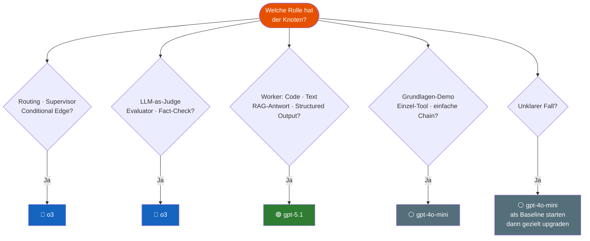

# Modell-Auswahl Guide
{: .no_toc }

> **Welches Modell für welche Aufgabe?**      
> Designregeln, Entscheidungsbaum und Modul-Mapping für den Agenten-Kurs.

---

# Inhaltsverzeichnis
{: .no_toc .text-delta }

1. TOC
{:toc}

---

## 1 Modelle im Kurs

| Modell               | Stärke                                                     | Typischer Einsatz                              |
| -------------------- | ---------------------------------------------------------- | ---------------------------------------------- |
| `gpt-4o-mini`        | Schnell, günstig                                           | Grundlagen, einfache Tool-Calls, Demos         |
| `gpt-4o`             | Ausgewogen                                                 | Mittlere Komplexität, strukturierte Ausgaben   |
| `o3-mini`            | Reasoning, kompakt                                         | Leichte Entscheidungslogik, Routing            |
| `o3`                 | Starkes Reasoning                                          | Supervisor, Judge, komplexes Routing, Security |
| `gpt-5.1` | Coding & Agentic Tasks, konfigurierbarer Reasoning-Aufwand | Worker-Agenten, Code-Generierung, RAG-Synthese |

> **Faustregel:** Nicht das stärkste Modell wählen — das *passende* für den Knoten.

---

## 2 Designregeln

Diese Regeln gelten für alle Module, in denen Modelle explizit zugewiesen werden:

### Regel 1 — Router und Supervisor: `o3`

Knoten, die **Entscheidungen treffen** (Routing, Supervisor-Logik, Conditional Edges), erhalten `o3`.
Begründung: Schwache Modelle treffen fehlerhafte Routing-Entscheidungen, die sich durch den gesamten Graphen fortpflanzen.

```python
from langchain.chat_models import init_chat_model

supervisor_llm = init_chat_model("openai:o3", temperature=0.0)
```

### Regel 2 — Worker und Content: `gpt-5.1`

Knoten, die **Inhalte erzeugen** (Texte, Code, RAG-Antworten, strukturierte Ausgaben), erhalten `gpt-5.1`.
Begründung: Optimiert für Coding und agentic Tasks mit konfigurierbarem Reasoning-Aufwand.

```python
worker_llm = init_chat_model("openai:gpt-5.1", temperature=0.2)
```

### Regel 3 — Judge und Evaluator: `o3`

LLM-as-Judge Evaluatoren erhalten `o3`.
Begründung: Qualitative Bewertung erfordert Urteilsvermögen, nicht nur Textgenerierung.

```python
judge_llm = init_chat_model("openai:o3", temperature=0.0)
```

### Regel 4 — Grundlagen und Demos: `gpt-4o-mini`

Alle Module, in denen das Konzept im Vordergrund steht (nicht die Ausgabequalität), verwenden `gpt-4o-mini`.
Begründung: Didaktik, Kosteneffizienz, schnelle Iteration.

```python
llm = init_chat_model("openai:gpt-4o-mini", temperature=0.0)
```

### Regel 5 — Baseline immer dokumentieren

Jeder Mixed-Model-Einsatz startet mit einem **Single-Model-Baseline-Run** auf `gpt-4o-mini`.
Vergleich mit 4 Kennzahlen: Ergebnisqualität · Schritte bis FINISH · Latenz · Kosten.

### Regel 6 — Einfache Aufgaben nicht hochheben

Extraktion, Formatierung, einfache Klassifikation: immer `gpt-4o-mini`.
Premium-Modelle für strukturierte Datenextraktion aus klar definierten Texten bringen keinen Mehrwert.

---

## 3 Entscheidungsbaum



---

## 4 Modul-Mapping

### Standard: `gpt-4o-mini` (Fokus Konzept, nicht Modellqualität)

| Module | Begründung |
|--------|-----------|
| M00–M11 | Grundlagen, Tool Use, RAG-Aufbau — Konzept > Qualität |
| M13–M16 | StateGraph, Checkpointing, HITL — Struktur lernen |
| M20 | Überblick Agent Builder — Vergleich, nicht Optimierung |
| M23–M26 | Evaluation, Security, Gradio — Rahmenbedingungen |
| M28 | Production Deployment — Kostenmodell verstehen |

### Mixed-Model: Lerninhalt im Modul verankert

| Modul | Supervisor / Router | Worker / Generator | Lernziel |
|-------|--------------------|--------------------|-----------|
| **M12** | Einführung Konzept | — | *Warum Routing-Knoten ein stärkeres Modell brauchen* |
| **M17 / M18** | `o3` | `gpt-4o-mini` | Supervisor-Pattern: Modell-Rollentrennung live erleben |
| **M21** | `o3` (Judge) | `gpt-4o-mini` (Candidate) | LLM-as-Judge: Warum der Judge stark sein muss |
| **M22** | `o3` (Planner) | `gpt-5.1` (Generator) | Agentic RAG: Retrieval-Steuerung vs. Antwortsynthese |

---

## 5 Code-Muster für Mixed-Model-Setup

### Supervisor + Worker (M17 / M18)

```python
from langchain.chat_models import init_chat_model

# Supervisor: trifft Routing-Entscheidungen
supervisor_llm = init_chat_model("openai:o3", temperature=0.0)

# Worker: erzeugt Inhalte
worker_llm = init_chat_model("openai:gpt-4o-mini", temperature=0.2)

# Baseline: alles auf gpt-4o-mini (immer zuerst!)
baseline_llm = init_chat_model("openai:gpt-4o-mini", temperature=0.0)
```

### Judge + Candidate (M21)

```python
# LLM-as-Judge: bewertet Antwortqualität
judge_llm   = init_chat_model("openai:o3",         temperature=0.0)

# Candidate: der evaluierte Agent
agent_llm   = init_chat_model("openai:gpt-4o-mini", temperature=0.0)
```

### Planner + Generator (M22 — Agentic RAG)

```python
# Planner/Router: entscheidet ob RAG nötig, welche Quellen
planner_llm   = init_chat_model("openai:o3",                  temperature=0.0)

# Generator: synthetisiert die finale Antwort aus Chunks
generator_llm = init_chat_model("openai:gpt-5.1",  temperature=0.2)
```

---

## 6 Kosten-Orientierung

> Wichtig für Kursteilnehmer: Das Kurs-Budget liegt bei ca. 5 EUR.
> Mixed-Model-Runs mit `o3` kosten deutlich mehr als `gpt-4o-mini`.

| Setup | Relatives Kostenniveau | Empfehlung |
|-------|----------------------|------------|
| Alles `gpt-4o-mini` | ⭐ (Baseline) | Standard für alle Lernschritte |
| Supervisor `o3` + Worker `gpt-4o-mini` | ⭐⭐⭐ | Nur für Mixed-Model-Demo-Zellen |
| Supervisor `o3` + Worker `gpt-5.1` | ⭐⭐⭐⭐⭐ | Nur als abschließender Qualitätsvergleich |

**Empfohlenes Vorgehen im Kurs:**

1. Konzept mit `gpt-4o-mini` verstehen und ausprobieren
2. Mixed-Model-Zellen als optionale Demo kennzeichnen (`# Optional: Mixed-Model`)
3. Vergleichstabelle (Qualität · Schritte · Latenz · Kosten) gemeinsam ausfüllen

---

## 7 Vergleichsstandard (Minimalformat)

Jeder Mixed-Model-Abschnitt in den Modulen dokumentiert den Vergleich in dieser Tabelle:

```python
# Vorlage Vergleichstabelle
vergleich = {
    "Modell-Setup":      ["Baseline (gpt-4o-mini)", "Mixed (o3 + gpt-4o-mini)"],
    "Ergebnisqualität":  ["...", "..."],   # subjektiv: schlecht / gut / sehr gut
    "Schritte":          [n1, n2],
    "Latenz (sek)":      [t1, t2],
    "Kosten (USD)":      [c1, c2],
}
```

---

## 8 Wo ist dieser Guide im Kurs verankert?

| Modul | Art der Verankerung |
|-------|---------------------|
| M12 | Markdown-Zelle: Konzept Modell-Rollentrennung + Link zu diesem Guide |
| M17 | Code-Zelle: Supervisor `o3` vs. `gpt-4o-mini` Baseline-Vergleich |
| M18 | Vergleichstabelle: Supervisor-Pattern mit Kennzahlen |
| M21 | Code-Zelle: Judge `o3` — Warum der Evaluator stark sein muss |
| M22 | Code-Zelle: Planner `o3` + Generator `gpt-5.1` |

---

**Version:** 1.0     
**Stand:** März 2026      
**Gilt für:** LangChain 1.0+, LangGraph 1.0+, OpenAI API     
