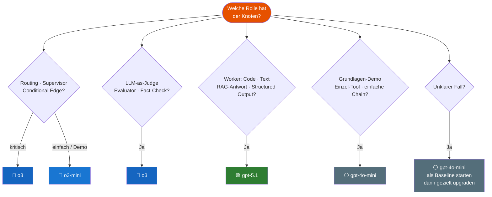

# Modell-Auswahl Guide
{: .no_toc }

> **Welches Modell für welche Aufgabe?**      
> Designregeln, Entscheidungsbaum und Modul-Mapping für den Agenten-Kurs.

> [!NOTE] OpenAI-Default im Kurs
> Dieser Guide beschreibt den aktuellen Kurs-Default mit OpenAI-Modellen.
> Für eine providerübergreifende Zuordnung zu Mistral und Anthropic siehe:
> [Provider-Modell-Mapping](https://ralf-42.github.io/Agenten/frameworks/Provider_Modell_Mapping.html)

---

# Inhaltsverzeichnis
{: .no_toc .text-delta }

1. TOC
{:toc}

---

## OpenAI-Default im Kurs

| Modell        | Stärke                                                      | Typischer Einsatz                              |
| ------------- | ----------------------------------------------------------- | ---------------------------------------------- |
| `gpt-4o-mini` | Schnell, günstig                                            | Grundlagen, einfache Tool-Calls, Demos         |
| `o3-mini`     | Reasoning, kompakt                                          | Leichte Entscheidungslogik, Routing            |
| `o3`          | Starkes Reasoning                                           | Supervisor, Judge, komplexes Routing, Security |
| `gpt-5.1`     | Coding & Agentic Tasks, konfigurierbarer Reasoning-Aufwand | Worker-Agenten, Code-Generierung, RAG-Synthese |

> [!TIP] Faustregel    
> Nicht das stärkste Modell wählen — das *passende* für den Knoten.


---

## Rollenlogik hinter der Modellwahl

Auch wenn im Kurs konkrete OpenAI-Modelle verwendet werden, steckt dahinter ein allgemeines Rollenmodell:

| Rolle | Bedeutung im Kurs |
|------|--------------------|
| **Baseline / Demo** | günstige, schnelle Läufe für Grundlagen und erste Tests |
| **Router / leichter Reasoner** | einfache Routing- und Auswahlentscheidungen |
| **Judge / starker Reasoner** | Supervisor, Security, Bewertung, Compliance |
| **Worker / Synthese** | hochwertige Text-, Code- oder RAG-Ausgabe |
| **Coding-Worker** | Code-Generierung, Refactoring, technische Agenten-Knoten |
| **Embeddings** | Vektorrepräsentationen für Retrieval und RAG — kein Chat-Modell |

Die nachfolgenden Regeln beschreiben also zwei Ebenen gleichzeitig:

1. **die Rolle im Agentensystem**
2. **den aktuellen OpenAI-Default im Kurs**

Wer dieselbe Rollenlogik auf Mistral oder Anthropic übertragen möchte, nutzt ergänzend das zentrale Mapping-Dokument.

---

## Designregeln

Diese Regeln gelten für alle Module, in denen Modelle explizit zugewiesen werden:

### Regel 1 — Router und Supervisor: `o3`

Knoten, die **Entscheidungen treffen** (Routing, Supervisor-Logik, Conditional Edges), erhalten im Kurs `o3`.

> [!WARNING] Schwaches Modell als Router → Fehler im gesamten Graph    
> Schwache Modelle treffen fehlerhafte Routing-Entscheidungen, die sich durch alle nachgelagerten Nodes fortpflanzen. Ein einzelner falscher Route-Entscheid kann den gesamten Workflow zum Scheitern bringen.

Begründung: Schwache Modelle treffen fehlerhafte Routing-Entscheidungen, die sich durch den gesamten Graphen fortpflanzen.

**Rollenbeschreibung:**  
Hier wird ein **starkes Reasoning-Modell** benötigt, nicht einfach nur ein allgemeines Chat-Modell.

```python
from langchain.chat_models import init_chat_model

supervisor_llm = init_chat_model("openai:o3")
```

### Regel 1b — Kostenbewusste Routing-Baseline: `o3-mini`

Für **einfache** Entscheidungslogik (2-3 Routen, geringe Fehlertoleranz, Demo/Prototyp) kann `o3-mini` als kostengünstige Baseline genutzt werden.
Bei kritischen Entscheidungen (Supervisor, Security, Evaluation) bleibt `o3` die Standardwahl.

**Rollenbeschreibung:**  
Das ist die Rolle **Router / leichter Reasoner**.

```python
router_llm = init_chat_model("openai:o3-mini")
```

> [!DANGER] o3 / o3-mini: kein temperature-Parameter    
> Beide Modelle unterstützen `temperature` nicht. Jeder Aufruf mit `temperature=...` führt zu einem API-Fehler. Parameter einfach weglassen — der API-Default wird automatisch verwendet.

### Regel 2 — Worker und Content: `gpt-5.1`

Knoten, die **Inhalte erzeugen** (Texte, Code, RAG-Antworten, strukturierte Ausgaben), erhalten im Kurs `gpt-5.1`.
Begründung: Optimiert für Coding und agentic Tasks mit konfigurierbarem Reasoning-Aufwand.

**Rollenbeschreibung:**  
Hier geht es um die Rolle **Worker / Synthese** beziehungsweise bei Entwicklungsaufgaben um einen **Coding-Worker**.

```python
worker_llm = init_chat_model("openai:gpt-5.1")
```

> [!DANGER] gpt-5.1 + temperature → API-Fehler     
> `temperature` ist nur mit `reasoning_effort="none"` gültig. Bei allen anderen Werten (`"low"`, `"medium"`, `"high"`) wirft die API sofort einen Fehler.
> **Empfehlung:** `temperature` bei gpt-5.1 weglassen und stattdessen `reasoning_effort` zur Qualitätssteuerung nutzen.
>
> ```python
> # Korrekt: ohne temperature
> worker_llm = init_chat_model("openai:gpt-5.1")
> ```

### Regel 3 — Judge und Evaluator: `o3`

LLM-as-Judge Evaluatoren erhalten im Kurs `o3`.
Begründung: Qualitative Bewertung erfordert Urteilsvermögen, nicht nur Textgenerierung.

**Rollenbeschreibung:**  
Das ist die Rolle **Judge / starker Reasoner**.

```python
judge_llm = init_chat_model("openai:o3")
```

### Regel 4 — Grundlagen und Demos: `gpt-4o-mini`

Alle Module, in denen das Konzept im Vordergrund steht (nicht die Ausgabequalität), verwenden im Kurs `gpt-4o-mini`.
Begründung: Didaktik, Kosteneffizienz, schnelle Iteration.

**Rollenbeschreibung:**  
Das ist die Rolle **Baseline / Demo**.

```python
llm = init_chat_model("openai:gpt-4o-mini", temperature=0.0)
```

### Regel 5 — Baseline immer dokumentieren

Jeder Mixed-Model-Einsatz startet mit einem **Single-Model-Baseline-Run** auf `gpt-4o-mini`.
Vergleich mit 4 Kennzahlen: Ergebnisqualität · Schritte bis FINISH · Latenz · Kosten.

### Regel 6 — Einfache Aufgaben nicht hochheben

Extraktion, Formatierung, einfache Klassifikation: immer `gpt-4o-mini`.
Premium-Modelle für strukturierte Datenextraktion aus klar definierten Texten bringen keinen Mehrwert.

---

## Entscheidungsbaum



---

## Modul-Mapping

### Standard: `gpt-4o-mini` (Fokus Konzept, nicht Modellqualität)

| Module | Begründung |
|--------|-----------|
| M01–M11 | Grundlagen, Tool Use, RAG-Aufbau — Konzept > Qualität |
| M13–M17 | StateGraph, Checkpointing, HITL — Struktur lernen |
| M29 | Überblick Agent Builder — Vergleich, nicht Optimierung |
| M28 | Gradio/UI-Fokus — Interaktionsdesign > Modellqualität |
| M34 | Production Deployment — Kostenmodell verstehen |

### Mixed-Model: Lerninhalt im Modul verankert

| Modul | Supervisor / Router | Worker / Generator | Lernziel |
|-------|--------------------|--------------------|-----------|
| **M12** | Einführung Konzept | — | *Warum Routing-Knoten ein stärkeres Modell brauchen* |
| **M21 / M22** | `o3` | `gpt-4o-mini` | Supervisor-Pattern: Modell-Rollentrennung live erleben |
| **M18** | `o3` (Judge) | `gpt-4o-mini` (Candidate) | LLM-as-Judge: Warum der Judge stark sein muss |
| **M26** | `o3` (Planner) | `gpt-5.1` (Generator) | Agentic RAG: Retrieval-Steuerung vs. Antwortsynthese |
| **M19** | `o3` (Judge, optional Demo) | `gpt-4o-mini` (Candidate) | Evaluation: Baseline vs. starker Evaluator |
| **M20** | `o3` (Policy/Risk) | `gpt-4o-mini` (Worker) | Security: robuste Gate-Entscheidungen |

---

## Code-Muster für Mixed-Model-Setup

### Supervisor + Worker (M21 / M22)

```python
from langchain.chat_models import init_chat_model

# Supervisor: trifft Routing-Entscheidungen
supervisor_llm = init_chat_model("openai:o3")

# Worker: erzeugt Inhalte
worker_llm = init_chat_model("openai:gpt-4o-mini", temperature=0.2)

# Baseline: alles auf gpt-4o-mini (immer zuerst!)
baseline_llm = init_chat_model("openai:gpt-4o-mini", temperature=0.0)
```

### Judge + Candidate (M18)

```python
# LLM-as-Judge: bewertet Antwortqualität
judge_llm   = init_chat_model("openai:o3")

# Candidate: der evaluierte Agent
agent_llm   = init_chat_model("openai:gpt-4o-mini", temperature=0.0)
```

### Planner + Generator (M26 — Agentic RAG)

```python
# Planner/Router: entscheidet ob RAG nötig, welche Quellen
planner_llm   = init_chat_model("openai:o3")

# Generator: synthetisiert die finale Antwort aus Chunks
# Hinweis: gpt-5.1 ohne temperature (Kompatibilität, siehe Regel 2)
generator_llm = init_chat_model("openai:gpt-5.1")
```

### Vollständiges Rollen-Setup (model_config.py — Production)

```python
from langchain.chat_models import init_chat_model
from langchain_openai import OpenAIEmbeddings

baseline_llm = init_chat_model("openai:gpt-4o-mini", temperature=0.0)  # Baseline / Demo
router_llm   = init_chat_model("openai:o3-mini")                        # Router / leichter Reasoner
judge_llm    = init_chat_model("openai:o3")                             # Judge / starker Reasoner
worker_llm   = init_chat_model("openai:gpt-5.1")                        # Worker / Synthese
coding_llm   = init_chat_model("openai:gpt-5.1")                        # Coding-Worker
embed_model  = OpenAIEmbeddings(model="text-embedding-3-small")         # Embeddings
```

---

## Kosten-Orientierung

> Wichtig für Kursteilnehmer: Das Kurs-Budget liegt bei ca. 5 EUR.
> Mixed-Model-Runs mit `o3` kosten deutlich mehr als `gpt-4o-mini`.

| Setup | Relatives Kostenniveau | Empfehlung |
|-------|----------------------|------------|
| Alles `gpt-4o-mini` | ⭐ (Baseline) | Standard für alle Lernschritte |
| Supervisor `o3` + Worker `gpt-4o-mini` | ⭐⭐⭐ | Nur für Mixed-Model-Demo-Zellen |
| Supervisor `o3` + Worker `gpt-5.1` | ⭐⭐⭐⭐⭐ | Nur als abschließender Qualitätsvergleich |

**Empfohlenes Vorgehen im Kurs:**

1. Konzept mit `gpt-4o-mini` verstehen und ausprobieren
2. Mixed-Model-Zellen als optionale Demo kennzeichnen (`# Optional: Mixed-Model`)
3. Vergleichstabelle (Qualität · Schritte · Latenz · Kosten) gemeinsam ausfüllen

---

## Vergleichsstandard (Minimalformat)

Jeder Mixed-Model-Abschnitt in den Modulen dokumentiert den Vergleich in dieser Tabelle:

```python
# Vorlage Vergleichstabelle
vergleich = {
    "Modell-Setup":      ["Baseline (gpt-4o-mini)", "Mixed (o3 + gpt-4o-mini)"],
    "Ergebnisqualität":  ["...", "..."],   # subjektiv: schlecht / gut / sehr gut
    "Schritte":          [n1, n2],
    "Latenz (sek)":      [t1, t2],
    "Kosten (USD)":      [c1, c2],
}
```

---

## Providerneutrale Lesart dieses Guides

Wenn nachfolgende Architektur- oder Migrationstexte providerneutral formuliert werden sollen, kann dieser Guide mit folgender Übersetzungsregel gelesen werden:

- `gpt-4o-mini` = **Baseline / Demo**
- `o3-mini` = **Router / leichter Reasoner**
- `o3` = **Judge / starker Reasoner**
- `gpt-5.1` = **Worker / Synthese**
- `gpt-5.1` = **Coding-Worker**
- `text-embedding-3-small` = **Embeddings**

Dadurch bleibt der Kurs konkret und die Beschreibung dennoch übertragbar.

Für die konkrete Zuordnung auf Mistral und Anthropic siehe:
[Provider-Modell-Mapping](https://ralf-42.github.io/Agenten/frameworks/Provider_Modell_Mapping.html)

---


**Version:** 1.3    
**Stand:** März 2026    
**Gilt für:** LangChain 1.0+, LangGraph 1.0+, OpenAI API    
