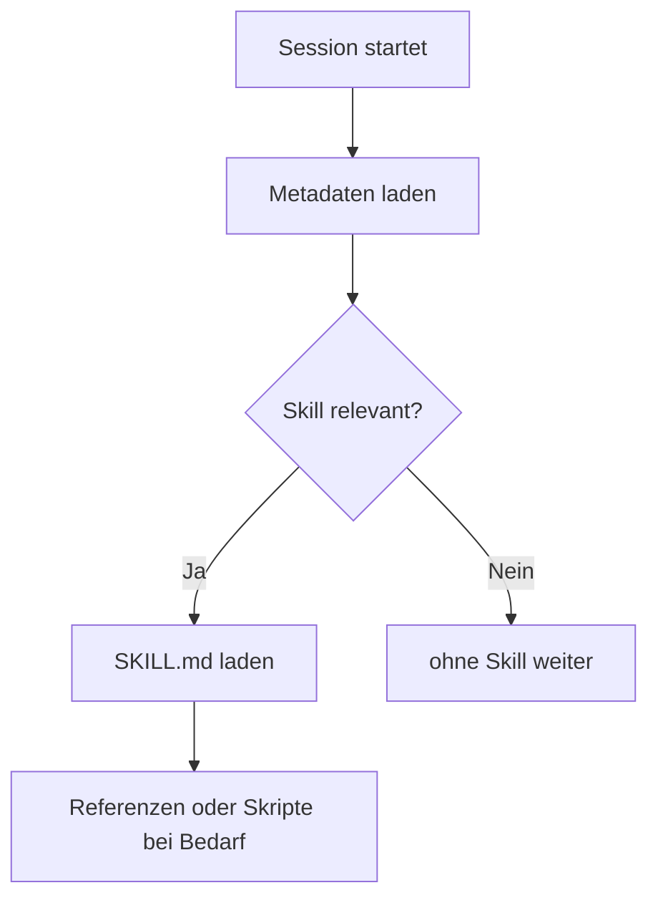

# Skills
{: .no_toc }

> [!NOTE] Kernfrage<br>
> Wann wird aus einem Prompt ein wiederverwendbarer Skill mit Regeln, Referenzen und Hilfslogik?

---

# Inhaltsverzeichnis
{: .no_toc .text-delta }

1. TOC
{:toc}

---

## Was ein Skill eigentlich ist

Ein Skill ist kein einzelner schöner Prompt, sondern ein wiederverwendbarer Ablaufbaustein. Er beschreibt, wann ein bestimmtes Vorgehen aktiviert werden soll, welche Schritte verpflichtend sind, welche Regeln gelten und welche Hilfsmittel oder Referenzen bei Bedarf nachgeladen werden dürfen.

Damit wird Fachwissen nicht nur formuliert, sondern operationalisiert. Ein Skill sagt also nicht nur, `was` beantwortet werden soll, sondern auch `wie` dabei vorzugehen ist.

Typischer Fehler: Einen langen Prompt automatisch als Skill zu betrachten. Ein Skill wird erst dort sinnvoll, wo Wiederholung, Guardrails und stabile Arbeitslogik nötig werden.

## Ein einfaches Beispiel

Ein Agent soll wiederholt README-Dateien für Projekte erstellen. Ein einzelner Prompt kann das einmalig leisten. Ein Skill wird dann interessant, wenn immer dieselben Abschnitte geprüft, dieselben Stilregeln eingehalten und vielleicht noch deterministische Linkprüfungen ausgeführt werden sollen.

Genau dort beginnt der Unterschied: Ein Prompt beantwortet eine Aufgabe. Ein Skill organisiert einen wiederholbaren Ablauf für diese Aufgabenkategorie.

## Prompt, Skill, Tool und MCP haben unterschiedliche Rollen

Ein Agentensystem wird verständlicher, wenn diese Ebenen sauber getrennt bleiben. Ein Skill beschreibt Fachlogik und Ablauf. Ein Tool führt eine konkrete Operation aus. MCP verbindet den Agenten mit externen Systemen. Ein Subagent übernimmt einen abgegrenzten Teilauftrag in eigenem Kontext.

| Baustein | Leitfrage | Rolle |
|---|---|---|
| Prompt | Wie soll diese einzelne Antwort formuliert werden? | konkrete Anweisung |
| Skill | Wie soll diese Aufgabenkategorie abgearbeitet werden? | Ablauf, Regeln, Guardrails |
| Tool | Welche konkrete Operation kann ausgeführt werden? | Funktion, API, Skript |
| MCP | Womit kann verbunden oder worauf zugegriffen werden? | externe Datenquellen und Systeme |

Gerade für Entwickler ist diese Trennung wichtig, weil sonst zu viel Fachlogik im falschen Baustein landet.

## Wann Skills überhaupt sinnvoll werden

Skills lohnen sich vor allem dort, wo derselbe fachliche Ablauf wiederkehrt, wo Pflichtschritte nicht ausgelassen werden dürfen oder wo Referenzen und Regeln regelmäßig in denselben Mustern gebraucht werden. Typische Bereiche sind Compliance, Review, strukturierte Analyse, Onboarding oder Dokumentation mit festen Anforderungen.

Weniger geeignet sind Skills für reine Einmalanfragen, hochkreative freie Aufgaben ohne feste Prüfkriterien oder sehr kleine Tätigkeiten, die ein normaler Prompt bereits zuverlässig löst.

In der Praxis relevant, wenn: Eine Aufgabe nicht nur beantwortet, sondern nach festen Regeln und mit wiederkehrenden Teilschritten ausgeführt werden soll.

## Wie ein Skill typischerweise aufgebaut ist

Ein praxistauglicher Skill trennt Kernlogik, Referenzwissen und deterministische Hilfslogik.

```text
skill-name/
  SKILL.md
  references/
    checklist.md
    risk_rules.md
  scripts/
    assess_risk.py
    validate.sh
  assets/
    template.docx
    sample_input.md
```

`SKILL.md` enthält den eigentlichen Einstiegspunkt. `references/` hält längere Regeln, Checklisten oder Beispiele außerhalb des Kernkontexts. `scripts/` übernimmt deterministische Teilaufgaben. `assets/` speichert Vorlagen und statische Ressourcen.

Typischer Fehler: Alles in eine einzige riesige `SKILL.md` zu schreiben. Dadurch wird der Skill schwerer zu pflegen und verliert den Vorteil gezielter Nachladung.

## Warum die `description` wichtiger ist als viele glauben

In Claude Code und ähnlichen Umgebungen entscheidet die `description` im Frontmatter oft darüber, ob ein Skill überhaupt automatisch aktiviert wird. Dieses Feld ist nicht nur Beschreibung für Menschen, sondern Trigger-Bedingung für das Routing.

```yaml
---
name: review-pr
description: Prüft Pull Requests auf Code-Qualität und Sicherheit.
             Use when the user asks for a PR review.
context: fork
agent: general-purpose
allowed-tools: Read, Grep, Glob
---
```

Eine gute `description` sagt nicht nur, was der Skill tut, sondern auch, wann er ausgelöst werden soll. Ebenso wichtig ist oft eine negative Grenze: wofür er gerade nicht gedacht ist.

## Skills werden schrittweise geladen

Skills werden nicht vollständig bei jedem Start in den Kontext gezogen. Stattdessen werden zuerst nur Metadaten gelesen, danach bei Bedarf der Body von `SKILL.md` und erst bei weiterer Relevanz Referenzen oder Skripte.



Genau dieses progressive Laden macht Skills praktisch. Fachlogik kann umfangreicher werden, ohne den Kernkontext jeder Anfrage dauerhaft zu überladen.

## Rules und Skills sind nicht dasselbe

Rules gelten dauerhaft im Hintergrund. Skills werden kontextbezogen aktiviert. Diese Unterscheidung ist für die Architektur wichtig.

| Aspekt | Rules | Skills |
|---|---|---|
| Geltung | immer im Projektkontext | nur bei passender Aufgabe |
| Inhalt | dauerhafte Projektregeln | wiederverwendbare Arbeitsabläufe |
| Beispiel | Namenskonventionen, verbotene Patterns | Review-Workflow, Dokumentationsablauf |

Wenn etwas in jeder Session gelten soll, gehört es eher in Rules. Wenn es nur bei bestimmten Aufgaben gebraucht wird, gehört es eher in einen Skill.

## Subagenten und `context: fork`

Ein Skill kann in einem eigenen Kontextfenster laufen, wenn die Aufgabe isoliert bearbeitet werden soll. Das ist besonders nützlich bei Recherche, Analyse oder komplexen Teilaufträgen. Für reine Richtlinien-Skills ist diese Trennung oft unnötig.

Grenze: Ein Skill wird nicht automatisch besser, nur weil er einen Subagenten verwendet. Isolation lohnt sich nur, wenn sie die eigentliche Aufgabe klarer oder sicherer macht.

## Wie ein Agent einen Skill tatsächlich nutzt

Der Ablauf ist in der Praxis einfacher als die vielen Begriffe vermuten lassen. Der Skill wird installiert, seine Metadaten werden beim Start sichtbar, das System prüft bei einer Anfrage, ob er relevant ist, lädt dann bei Bedarf den Body und danach nur die wirklich benötigten Zusatzdateien.

Genau deshalb sollten Body und Referenzen sauber getrennt bleiben. Der Body steuert, die Referenzen vertiefen.

## Wann aus einem Prompt ein Skill werden sollte

Ein Prompt sollte dann zu einem Skill werden, wenn dieselbe Fachlogik regelmäßig wiederkehrt, wenn Pflichtschritte oder Eskalationen eingehalten werden müssen, wenn Vorlagen oder Regeln nachgeladen werden sollen oder wenn deterministische Teilprüfungen dazugehören.

| Frage | Wenn ja, spricht das für einen Skill |
|---|---|
| Wird derselbe Ablauf wiederholt gebraucht? | Fachlogik aus dem Einzelprompt herauslösen |
| Gibt es Pflichtschritte oder Eskalationen? | Guardrails explizit im Skill verankern |
| Werden Regeln, Beispiele oder Vorlagen wiederverwendet? | Referenzen und Assets nutzen |
| Gibt es deterministische Teilaufgaben? | Skripte oder Tools anbinden |

Wenn diese Punkte nicht greifen, reicht oft ein normaler Prompt oder ein einfacher Workflow.

## Was in der Praxis schnell schiefgeht

Undertriggering und Overtriggering sind die häufigsten Probleme. Ein Skill lädt trotz passender Anfrage nicht, weil die `description` zu vage formuliert ist. Oder er lädt zu oft, weil die Abgrenzung gegen ähnliche, aber unpassende Fälle fehlt.

Ein weiterer häufiger Fehler ist zu viel Fachlogik direkt im Body und zu wenig Trennung in Referenzen. Dann wächst der Skill in eine schwer pflegbare Anweisungssammlung hinein.

## Was für Entwickler zuerst wichtig ist

Für Entwickler sind Skills kein Pflichtstartpunkt. Zunächst wichtiger sind Tool Use, gute Prompts, State Management und Checkpointing. Skills werden dann interessant, wenn aus einem einzelnen Agenten ein wiederverwendbarer, regelgeleiteter Prozess werden soll.

Entwickler unterschätzen oft, dass ein Skill nicht vor allem technische Komplexität, sondern organisatorische Klarheit bringt. Er macht sichtbar, welche Fachlogik immer wieder gleich laufen soll.

## Praxisbezug im Projekt

Im Projekt liegen fertige Beispiele unter `06_skill/`, etwa für Compliance, Recherche und Meeting-Briefings. Diese Beispiele zeigen denselben Grundgedanken: Kernlogik in `SKILL.md`, Detailwissen in `references/`, deterministische Teilaufgaben in `scripts/`.

Eine Vorlage für eigene Skills liegt lokal unter `06_skill/README.md`. Genau diese Beispiele eignen sich gut, um den Unterschied zwischen freiem Prompt und reproduzierbarem Skill direkt zu sehen.

## Abgrenzung zu verwandten Dokumenten

| Dokument | Frage |
|---|---|
| [Prompt Engineering]({{ '/tool-use-prompting-erste-agenten/prompt-engineering.html' | relative_url }}) | Wie werden einzelne Anweisungen und System-Prompts wirksam formuliert? |
| [Tool Use & Function Calling]({{ '/tool-use-prompting-erste-agenten/tool-use-function-calling.html' | relative_url }}) | Wie werden deterministische Hilfsoperationen eingebunden? |
| [State Management]({{ '/orchestrierung-state-langgraph/state-management.html' | relative_url }}) | Wie werden mehrstufige Abläufe kontrolliert ausgeführt? |
| [Multi-Agent-Systeme]({{ '/multi-agent-skills-protokolle/multi-agent-systeme.html' | relative_url }}) | Wann ist ein eigener Spezialagent sinnvoller als ein Skill? |

---

**Version:** 1.6<br>
**Stand:** Mai 2026<br>
**Kurs:** KI-Agenten. Verstehen. Anwenden. Gestalten.


