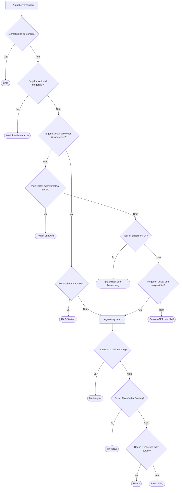

# Aufgaben & Lösungswege
{: .no_toc }

> **Erst den Lösungsweg wählen, dann die Agentenarchitektur.**

---

# Inhaltsverzeichnis
{: .no_toc .text-delta }

1. TOC
{:toc}

---

## Worum es in dieser Entscheidungshilfe geht

Viele KI-Projekte werden zu früh als Agentensystem gedacht. Das wirkt modern, führt aber oft zu unnötiger Komplexität. In anderen Fällen wird das Problem zu klein gedacht, obwohl mehrere Schritte, Werkzeugnutzung und Fehlerbehandlung eigentlich nach einem Agenten verlangen. Genau zwischen diesen beiden Fehlrichtungen hilft diese Seite.

Die Entscheidung verläuft in zwei Stufen. Zuerst wird geklärt, welcher Lösungsweg überhaupt passt. Nicht jede Aufgabe braucht einen Agenten. Erst wenn diese Frage beantwortet ist, folgt die zweite Stufe: Welche Agentenarchitektur ist für diesen Fall sinnvoll?

Typischer Fehler: Direkt über ReAct, Multi-Agent oder LangGraph zu sprechen, bevor klar ist, ob nicht schon Chat, Workflow, RAG oder klassischer Code genügen.

## Die erste Frage: Braucht die Aufgabe überhaupt einen Agenten?

Für Entwickler ist dies die wichtigste Unterscheidung im ganzen Kurs. Ein Agent lohnt sich erst dann, wenn die Aufgabe nicht vollständig im Voraus festgelegt werden kann und trotzdem eigenständig auf Daten, Tools oder Zwischenergebnisse reagieren muss. Wenn dagegen der Ablauf feststeht, ist ein einfacherer Lösungsweg fast immer robuster, günstiger und leichter zu testen.

Ein einmaliger persönlicher Textentwurf ist meist eine Chat-Aufgabe. Ein wiederkehrender, triggerbarer Prozess passt eher zu Workflow-Automation. Fragen über eine eigene Wissensbasis deuten oft auf ein RAG-System hin. Sehr datenintensive Verarbeitung gehört meist in Python und APIs. Ein Werkzeug für andere Nutzer mit Oberfläche kann ein App-Builder oder eine gezielte Anwendung sein. Erst wenn das Vorgehen explorativ wird, mehrere Schritte koordiniert werden müssen und Werkzeuge aktiv eingesetzt werden, wird ein Agentensystem plausibel.

## Eine grobe Schnellentscheidung

| Wenn die Aufgabe so aussieht | Naheliegender Startpunkt |
|---|---|
| Einmalig, ad hoc, persönlich | Chat-Anwendung |
| Wiederkehrender Prozess mit Triggern | Workflow-Automation |
| Fragen über eigene Dokumente oder Wissensbasis | RAG-System |
| Sehr viele Daten oder komplexe Berechnungen | Python und APIs |
| Werkzeug für andere Nutzer mit UI | KI-App-Builder oder Anwendung |
| Wiederkehrende persönliche Unterstützung | Custom GPT oder Skill |
| Vorgehen unklar, mehrstufig, toolgestützt | Agentensystem |

Wer tiefer in die allgemeine GenAI-Perspektive einsteigen will, findet eine ausführlichere Schwesterseite hier: [Aufgabenklassen & Lösungswege](https://ralf-42.github.io/GenAI/concepts/orientierung/aufgabenklassen-und-loesungswege.html).

## Woran sich ein echter Agentenfall erkennen lässt

Ein Agentensystem wird vor allem dann sinnvoll, wenn mehrere Bedingungen zusammenkommen. Dazu gehört, dass das Vorgehen nicht vollständig vordefiniert werden kann, dass Werkzeuge oder externe Systeme eingebunden werden müssen und dass spätere Schritte von früheren Ergebnissen abhängen. Häufig kommt noch hinzu, dass ein System Fehler nicht nur melden, sondern selbstständig darauf reagieren oder einen alternativen Weg wählen soll.

Ein guter Praxistest lautet deshalb: Würde ein fester Ablauf mit klaren Regeln dieselbe Aufgabe zuverlässig lösen? Wenn die Antwort ja lautet, spricht meist mehr für Workflow oder Code als für einen Agenten.

Grenze: Auch eine offene Formulierung in natürlicher Sprache macht aus einer Aufgabe noch keinen Agentenfall. Viele scheinbar agentische Anfragen lassen sich in Wahrheit mit klaren Pipelines lösen.

## Warnsignale gegen Agentensysteme

Wenn eine Aufgabe immer denselben festen Ablauf hat, ist Workflow-Automation meist die bessere Wahl. Wenn nur eigene Dokumente durchsucht und zusammengefasst werden sollen, reicht oft ein RAG-System. Wenn es überhaupt keine echten Entscheidungspunkte gibt, genügt häufig ein Skript oder eine API-Anwendung.

Entwickler unterschätzen oft, wie viel zusätzliche Kosten, Testaufwand und Fehlerdiagnose ein Agent mit sich bringt. Ein Agent ist kein Qualitätsmerkmal, sondern ein Werkzeug für einen bestimmten Aufgabentyp.

## Die zweite Frage: Welche Agentenarchitektur passt dann?

Wenn nach der ersten Stufe klar ist, dass ein Agent wirklich nötig ist, folgt die Architekturentscheidung. Auch hier gilt: Die einfachste Struktur, die die Aufgabe zuverlässig löst, ist meist die beste.

Für viele erste Projekte reicht ein Tool-Calling-Agent. Offene Recherche oder Problemlösung mit unbekanntem Weg spricht eher für ReAct. Feste Schritte, Routing oder Qualitätsgates sprechen für einen Workflow. Mehrere Spezialrollen lohnen sich erst dann, wenn die Arbeitsteilung wirklich einen erkennbaren Mehrwert erzeugt. Ein RAG-Agent ist im Kern ein Wissenszugriff mit zusätzlicher Agentenlogik und sollte nur gewählt werden, wenn Retrieval und eigenständige Weiterverarbeitung zusammen gebraucht werden.

## Eine grobe Schnellentscheidung für die Architektur

| Wenn das Agentensystem so aussieht | Naheliegende Architektur |
|---|---|
| Definierte Tools, klarer Auftrag, begrenzte Freiheit | Tool-Calling-Agent |
| Offene Recherche, unbekannter Lösungsweg, iterative Schleifen | ReAct-Agent |
| Mehrstufiger Prozess mit Reihenfolge, Routing oder Freigaben | Workflow |
| Mehrere Spezialisten mit klarer Arbeitsteilung | Multi-Agent-System |
| Wissenszugriff plus autonome Weiterverarbeitung | RAG-Agent |

## Tool-Calling: oft der beste Einstieg

Beim Tool-Calling wählt das Modell aus einer definierten Liste von Werkzeugen aus und ruft diese mit Parametern auf. Dieses Muster eignet sich gut für Assistenten mit klaren Fähigkeiten, etwa Kalenderzugriff, CRM-Abfragen oder E-Mail-Versand. Die Stärke liegt darin, dass das Modell flexibel formulieren kann, während die eigentliche Aktion in kontrollierten Tools stattfindet.

In der Praxis relevant, wenn: Werkzeuge klar benannt sind, der Auftrag begrenzt bleibt und kein komplexer mehrstufiger Plan nötig ist.

## ReAct: wenn der Weg zur Lösung noch offen ist

ReAct arbeitet in einem Zyklus aus Denken, Handeln und Beobachten. Der Agent prüft eine Lage, führt eine Aktion aus und reagiert auf das Ergebnis. Dieses Muster eignet sich für Recherche, Debugging oder offene Problemlösungen, bei denen der nächste Schritt erst nach Sichtung der bisherigen Ergebnisse feststeht.

Grenze: ReAct kann bei unklaren Aufgaben teuer und langsam werden. Ohne Begrenzung von Iterationen oder Budget verliert die Architektur schnell ihre Kontrolle.

## Workflow: wenn die Reihenfolge wichtiger ist als Freiheit

Workflow-basierte Agentensysteme eignen sich für Prozesse mit klaren Stufen. Dazu gehören Routing, Qualitätsprüfungen, Freigaben oder feste Verarbeitungsketten. Der Vorteil liegt in der Vorhersagbarkeit. Ein Workflow ist meist leichter zu testen und zu überwachen als ein frei planender Agent.

Nicht geeignet, wenn: Die Aufgabe stark explorativ ist und sich der Lösungsweg erst während der Bearbeitung ergibt.

## Multi-Agent: nur wenn Arbeitsteilung wirklich hilft

Ein Multi-Agent-System verteilt Aufgaben auf spezialisierte Rollen wie Recherche, Schreiben, Review oder Code. Das kann sinnvoll sein, wenn die Teilaufgaben fachlich so unterschiedlich sind, dass ein einzelner Agent an Grenzen stößt oder parallele Arbeit echten Nutzen bringt.

Typischer Fehler: Multi-Agent zu wählen, weil es eindrucksvoll klingt. In vielen Kurs- und Praxisfällen löst ein einzelner Workflow mit guten Knoten dieselbe Aufgabe einfacher.

## RAG-Agent: wenn Wissen und Handeln zusammenkommen

Ein RAG-Agent verbindet Wissenszugriff mit weiterer Agentenlogik. Das ist mehr als eine reine Such- oder Antwortmaschine. Ein solches System liest Informationen aus einer Wissensbasis, bewertet sie im Kontext der Aufgabe und leitet daraus weitere Schritte ab.

Ein Beispiel wäre ein interner Support-Agent, der nicht nur eine Richtlinie zitiert, sondern auf Basis dieser Richtlinie eine passende Maßnahme vorbereitet oder einen Folgeprozess startet. Genau dort entsteht der Mehrwert gegenüber einem reinen RAG-System.

## Ein vollständiger Entscheidungsbaum



## Praxisbeispiele für Ebene 1

Eine E-Mail besser zu formulieren ist typischerweise eine Chat-Aufgabe. Rechnungen automatisch zu erfassen spricht für Workflow-Automation. Fragen über interne Handbücher passen häufig zu RAG. Eine Auswertung von 50.000 Kundenbewertungen gehört meist eher in Python und APIs als in einen frei laufenden Agenten. Ein interner HR-Assistent mit Oberfläche deutet auf eine Anwendung mit UI hin. Ein persönlicher Schreibassistent mit festem Stil kann dagegen gut als Custom GPT oder Skill funktionieren.

## Praxisbeispiele für Ebene 2

| Aufgabe | Warum diese Wahl plausibel ist | Architektur |
|---|---|---|
| Informationen zu einem Thema im Web finden | offener, iterativer Rechercheweg | ReAct-Agent |
| Kundenanfragen per Kalender und CRM beantworten | klar definierte Tools, begrenzter Auftrag | Tool-Calling-Agent |
| Code analysieren, Refactoring vorschlagen und Umsetzung prüfen | feste Reihenfolge mit klaren Schritten | Workflow |
| Marktanalyse mit Recherche, Text und Visualisierung erzeugen | klare Spezialrollen und Arbeitsteilung | Multi-Agent-System |
| Fragen über interne Dokumente beantworten und Maßnahmen ableiten | Wissenszugriff plus eigenständige Weiterverarbeitung | RAG-Agent |

## Häufige Fehlentscheidungen

Agenten für triviale Aufgaben sind eine der häufigsten Fehlentscheidungen. Wenn der Ablauf immer gleich bleibt, ist ein Workflow günstiger und besser testbar. Fast ebenso häufig wird Multi-Agent zu früh gewählt, obwohl ein einzelner Workflow mit Routing genügt.

ReAct ohne Kostenkontrolle ist ein weiteres Risiko. Wenn keine Iterationsgrenzen und Budgets definiert werden, wächst die Schleife schnell unkontrolliert. Ebenso problematisch ist es, feste Schrittfolgen als Tool-Calling-Agent zu bauen. Dann wird ein frei entscheidendes System dort eingesetzt, wo eigentlich ein deterministischer Ablauf passender wäre.

Datenschutz und Human-in-the-Loop werden ebenfalls oft zu spät bedacht. Sobald sensible Daten, E-Mail-Versand, Löschaktionen oder Buchungen ins Spiel kommen, reicht eine gute Modellantwort nicht mehr aus. Dann braucht die Lösung klare Kontrollpunkte.

## Checkliste vor dem Agentenbau

Vor dem Bau sollte zuerst der Lösungsweg validiert werden. Reicht Chat, Workflow, RAG oder klassischer Code aus? Ist das Vorgehen wirklich nicht vollständig definierbar? Werden Tools oder Autonomie tatsächlich benötigt?

Danach folgt die Architekturfrage. Wurde die Struktur bewusst gewählt oder nur aus Faszination für Multi-Agent? Ist die Komplexität durch den Anwendungsfall gerechtfertigt? Gibt es einen Plan für Fehlerbehandlung, Fallbacks und Eskalation?

Schließlich zählt der Betrieb. Iterationsgrenzen, Kostenkontrolle, Human-in-the-Loop, Datenschutzentscheidungen und Monitoring gehören nicht ans Ende der Diskussion. Sie sind Teil der Architekturentscheidung.

```text
Kurzcheck:
- Reicht ein einfacherer Lösungsweg?
- Falls nein: Welche Agentenarchitektur löst das Problem mit der geringsten zusätzlichen Komplexität?
- Sind Kosten, Datenschutz und kritische Aktionen von Anfang an mitgedacht?
```

## Abgrenzung zu verwandten Dokumenten

| Dokument | Frage |
|---|---|
| [Agenten-Architekturen]({{ '/tool-use-prompting-erste-agenten/agent-architekturen.html' | relative_url }}) | Wie unterscheiden sich ReAct, Tool-Calling, Workflow und Multi-Agent im Detail? |
| [Multi-Agent-Systeme]({{ '/multi-agent-skills-protokolle/multi-agent-systeme.html' | relative_url }}) | Wann lohnt sich echte Arbeitsteilung zwischen mehreren Agenten? |
| [Human-in-the-Loop]({{ '/sessions-memory-hitl/human-in-the-loop.html' | relative_url }}) | An welchen Stellen müssen Menschen zur Kontrolle oder Freigabe eingebunden werden? |
| [Modell-Auswahl Guide]({{ '/orientierung-agentenverstaendnis/modell-auswahl-guide.html' | relative_url }}) | Welches Modell passt zu welcher Rolle im gewählten System? |

---

**Version:** 1.1<br>
**Stand:** April 2026<br>
**Kurs:** KI-Agenten. Verstehen. Anwenden. Gestalten.


