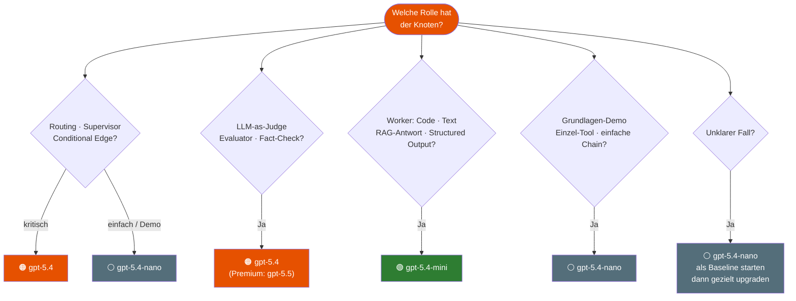

# Modell-Auswahl Guide
{: .no_toc }

> **Welches Modell für welche Aufgabe?**<br>
> Designregeln, Entscheidungsbaum und Modul-Mapping für den Agenten-Kurs.

Dieser Guide beschreibt den aktuellen Kurs-Default mit OpenAI-Modellen. Für eine providerübergreifende Zuordnung zu Mistral und Anthropic siehe: [Provider-Modell-Mapping]({{ '/orientierung-agentenverstaendnis/provider-modell-mapping.html' | relative_url }})

---

# Inhaltsverzeichnis
{: .no_toc .text-delta }

1. TOC
{:toc}

---

## OpenAI-Default im Kurs

| Modell         | Stärke                                             | Typischer Einsatz                                    |
| -------------- | -------------------------------------------------- | ---------------------------------------------------- |
| `gpt-5.4-nano` | Günstig, schnell, GPT-5.x-Basis                   | Grundlagen, Demos, einfaches Routing                 |
| `gpt-5.4-mini` | Coding & Agentic Tasks, kostengünstig              | Worker, Code-Generierung, RAG-Synthese               |
| `gpt-5.4`      | Starkes Reasoning, hohe Ausgabequalität            | Judge, Supervisor, Planner, komplexe RAG             |
| `gpt-5.5`      | Maximale Qualität (Premium)                        | Kritische Sicherheitsentscheidungen, finale Evaluation |

> [!TIP] Faustregel<br>
> Nicht das stärkste Modell wählen — das *passende* für den Knoten.

---

## Rollenlogik hinter der Modellwahl

Auch wenn im Kurs konkrete OpenAI-Modelle verwendet werden, steckt dahinter ein allgemeines Rollenmodell:

| Rolle | Modell | Bedeutung im Kurs |
|------|--------|-------------------|
| **Baseline / Demo** | `gpt-5.4-nano` | günstige, schnelle Läufe für Grundlagen und erste Tests |
| **Router / leichter Reasoner** | `gpt-5.4-nano` | einfache Routing- und Auswahlentscheidungen |
| **Supervisor / kritisches Routing** | `gpt-5.4` | komplexe Routing-Logik, Supervisor-Pattern |
| **Judge / starker Reasoner** | `gpt-5.4` | Bewertung, Evaluation, Compliance |
| **Judge Premium** | `gpt-5.5` | kritische Sicherheitsentscheidungen, finale Evaluation |
| **Worker / Synthese** | `gpt-5.4-mini` | hochwertige Text-, Code- oder RAG-Ausgabe |
| **Embeddings** | `text-embedding-3-small` | Vektorrepräsentationen für Retrieval und RAG |

Die nachfolgenden Regeln beschreiben also zwei Ebenen gleichzeitig:

1. **die Rolle im Agentensystem**
2. **den aktuellen OpenAI-Default im Kurs**

Wer dieselbe Rollenlogik auf Mistral, Gemini oder Anthropic übertragen möchte, nutzt ergänzend das zentrale Mapping-Dokument.

---

## Designregeln

Diese Regeln gelten für alle Module, in denen Modelle explizit zugewiesen werden:

### Regel 1 — Router (einfach): `gpt-5.4-nano`

Knoten, die **einfache Routing-Entscheidungen** treffen (2-3 Routen, Demos, Prototypen), erhalten `gpt-5.4-nano`.
Begründung: Günstigstes GPT-5.x-Modell, ausreichend für klare Entscheidungslogik.

**Rollenbeschreibung:**  
Das ist die Rolle **Router / leichter Reasoner**.

```python
from langchain.chat_models import init_chat_model

router_llm = init_chat_model("openai:gpt-5.4-nano")
# Qualitätssteuerung: model_kwargs={"reasoning": {"effort": "low"}}
```

### Regel 1b — Supervisor und kritisches Routing: `gpt-5.4`

Knoten, die **kritische Entscheidungen** treffen (Supervisor-Logik, Security, komplexe Conditional Edges), erhalten `gpt-5.4`.

> [!WARNING] Schwaches Modell als Supervisor → Fehler im gesamten Graph<br>
> Fehlerhafte Routing-Entscheidungen pflanzen sich durch alle nachgelagerten Nodes fort. Ein falscher Route-Entscheid kann den gesamten Workflow zum Scheitern bringen.

**Rollenbeschreibung:**  
Supervisor, komplexer Router — starkes Reasoning erforderlich.

```python
supervisor_llm = init_chat_model("openai:gpt-5.4")
# Qualitätssteuerung: model_kwargs={"reasoning": {"effort": "high"}}
```

> [!DANGER] Gesamte GPT-5.x-Serie: kein temperature-Parameter<br>
> `temperature` führt zu einem API-Fehler. Qualitätssteuerung über `reasoning.effort` und `text.verbosity`.

### Regel 2 — Worker und Content: `gpt-5.4-mini`

Knoten, die **Inhalte erzeugen** (Texte, Code, RAG-Antworten, strukturierte Ausgaben), erhalten im Kurs `gpt-5.4-mini`.
Begründung: Stärkstes Mini-Modell für Coding und Subagenten, aktuellerer Knowledge Cutoff (Aug 2025).

Für **maximale Ausgabequalität** (komplexe RAG, finale Reports) steht `gpt-5.4` als Upgrade zur Verfügung.

**Rollenbeschreibung:**
Hier geht es um die Rolle **Worker / Synthese** beziehungsweise bei Entwicklungsaufgaben um einen **Coding-Worker**.

```python
worker_llm        = init_chat_model("openai:gpt-5.4-mini")   # Standard-Worker
worker_premium_llm = init_chat_model("openai:gpt-5.4")        # Worker hochwertig
```

> [!DANGER] gpt-5.4-mini / gpt-5.4 + temperature → API-Fehler<br>
> Die gesamte GPT-5.x-Serie unterstützt `temperature` nicht. Parameter einfach weglassen.
>
> ```python
> # Korrekt: ohne temperature
> worker_llm = init_chat_model("openai:gpt-5.4-mini")
> ```

### Regel 3 — Judge und Evaluator: `gpt-5.4`

LLM-as-Judge Evaluatoren erhalten im Kurs `gpt-5.4`.
Begründung: Qualitative Bewertung erfordert starkes Reasoning. Für kritische Sicherheitsentscheidungen steht `gpt-5.5` als Premium-Option zur Verfügung.

**Rollenbeschreibung:**  
Das ist die Rolle **Judge / starker Reasoner** (Standard) bzw. **JUDGE_PREMIUM** (kritisch).

```python
judge_llm         = init_chat_model("openai:gpt-5.4")   # Standard
judge_premium_llm = init_chat_model("openai:gpt-5.5")   # nur wenn gpt-5.4 nicht ausreicht
# Qualitätssteuerung: model_kwargs={"reasoning": {"effort": "high"}}
```

### Regel 4 — Grundlagen und Demos: `gpt-5.4-nano`

Alle Module, in denen das Konzept im Vordergrund steht (nicht die Ausgabequalität), verwenden im Kurs `gpt-5.4-nano`.
Begründung: Günstigstes GPT-5.x-Modell — konsistent mit der gesamten Modell-Konfiguration, kein `temperature`.

**Rollenbeschreibung:**  
Das ist die Rolle **Baseline / Demo**.

```python
llm = init_chat_model("openai:gpt-5.4-nano")
```

> [!NOTE] temperature bei BASELINE<br>
> `temperature` ist bei der gesamten GPT-5.x-Serie (inkl. `gpt-5.4-nano`) outdated. Deterministische Ausgaben über präzise Prompts steuern, nicht über `temperature=0`.

### Regel 5 — Baseline immer dokumentieren

Jeder Mixed-Model-Einsatz startet mit einem **Single-Model-Baseline-Run** auf `gpt-5.4-nano`.
Vergleich mit 4 Kennzahlen: Ergebnisqualität · Schritte bis FINISH · Latenz · Kosten.

### Regel 6 — Einfache Aufgaben nicht hochheben

Extraktion, Formatierung, einfache Klassifikation: immer `gpt-5.4-nano`.
Premium-Modelle für strukturierte Datenextraktion aus klar definierten Texten bringen keinen Mehrwert.

---

## Entscheidungsbaum



---

## Modul-Mapping

### Standard: `gpt-5.4-nano` (Fokus Konzept, nicht Modellqualität)

| Module | Begründung |
|--------|-----------|
| M01–M11 | Grundlagen, Tool Use, RAG-Aufbau — Konzept > Qualität |
| M13–M17 | StateGraph, Checkpointing, HITL — Struktur lernen |
| M29 | Überblick Agent Builder — Vergleich, nicht Optimierung |
| M28 | Gradio/UI-Fokus — Interaktionsdesign > Modellqualität |
| M35 | Production Deployment — Kostenmodell verstehen |

### Mixed-Model: Lerninhalt im Modul verankert

| Modul         | Supervisor / Router              | Worker / Generator         | Lernziel                                                    |
| ------------- | -------------------------------- | -------------------------- | ----------------------------------------------------------- |
| **M12**       | Einführung Konzept               | —                          | *Warum Routing-Knoten ein stärkeres Modell brauchen*        |
| **M21 / M22** | `gpt-5.4` (Supervisor)          | `gpt-5.4-nano`             | Supervisor-Pattern: Modell-Rollentrennung live erleben      |
| **M18**       | `gpt-5.4` (Judge)               | `gpt-5.4-nano` (Candidate) | LLM-as-Judge: Warum der Judge stark sein muss               |
| **M26**       | `gpt-5.4` (Planner)             | `gpt-5.4-mini` (Generator) | Agentic RAG: Retrieval-Steuerung vs. Antwortsynthese        |
| **M19**       | `gpt-5.4` (Judge, optional Demo) | `gpt-5.4-nano` (Candidate) | Evaluation: Baseline vs. starker Evaluator                  |
| **M20**       | `gpt-5.5` (Policy/Risk)         | `gpt-5.4-nano` (Worker)    | Security: robuste Gate-Entscheidungen (Premium-Judge)       |

---

## Code-Muster für Mixed-Model-Setup

### Supervisor + Worker (M21 / M22)

```python
from langchain.chat_models import init_chat_model

# Supervisor: trifft Routing-Entscheidungen (Standard)
supervisor_llm = init_chat_model("openai:gpt-5.4")

# Worker: erzeugt Inhalte
worker_llm = init_chat_model("openai:gpt-5.4-mini")

# Baseline: alles auf gpt-5.4-nano (immer zuerst!)
baseline_llm = init_chat_model("openai:gpt-5.4-nano")
```

### Judge + Candidate (M18)

```python
# LLM-as-Judge: bewertet Antwortqualität
judge_llm   = init_chat_model("openai:gpt-5.4")

# Candidate: der evaluierte Agent
agent_llm   = init_chat_model("openai:gpt-5.4-nano")
```

### Planner + Generator (M26 — Agentic RAG)

```python
# Planner/Router: entscheidet ob RAG nötig, welche Quellen
planner_llm   = init_chat_model("openai:o3")

# Generator: synthetisiert die finale Antwort aus Chunks
# Hinweis: gpt-5.4-mini ohne temperature (GPT-5.x-Serie, siehe Regel 2)
generator_llm = init_chat_model("openai:gpt-5.4-mini")
```

### Vollständiges Rollen-Setup (`genai_lib/model_config.py`)

Modell-IDs sind in `model_config.py` als Konstanten definiert. Die Instanziierung
erfolgt im Notebook, damit der API Key bereits gesetzt ist.

**Installation (einmalig):**

```bash
pip install git+https://github.com/ralf-42/Agenten.git#subdirectory=04_modul
```

**Import & Instanziierung im Notebook (in "Umgebung einrichten"):**

```python
from langchain.chat_models import init_chat_model
from langchain_openai import OpenAIEmbeddings
from genai_lib.model_config import (
    BASELINE, ROUTER, TRANSLATOR,
    WORKER, CODING, TRANSLATOR_PREMIUM,
    JUDGE, PLANNER, WORKER_PREMIUM,
    JUDGE_PREMIUM, PLANNER_PREMIUM,
    EMBEDDINGS,
)

baseline_llm       = init_chat_model(BASELINE)        # gpt-5.4-nano — Baseline / Demo
router_llm         = init_chat_model(ROUTER)           # gpt-5.4-nano — Router / leichter Reasoner
worker_llm         = init_chat_model(WORKER)           # gpt-5.4-mini — Worker / Synthese
worker_premium_llm = init_chat_model(WORKER_PREMIUM)   # gpt-5.4     — Worker (hochwertig)
coding_llm         = init_chat_model(CODING)           # gpt-5.4-mini — Coding-Worker
judge_llm          = init_chat_model(JUDGE)            # gpt-5.4     — Judge / starker Reasoner
planner_llm        = init_chat_model(PLANNER)          # gpt-5.4     — Planner
judge_premium_llm  = init_chat_model(JUDGE_PREMIUM)    # gpt-5.5     — Judge (kritisch)
embed_model        = OpenAIEmbeddings(model=EMBEDDINGS)
```

**Beispiel-Aufrufe:**

```python
from langchain_core.messages import HumanMessage
from langgraph.prebuilt import create_react_agent

# Einfacher Modell-Aufruf (kein temperature — gesamte GPT-5.x-Serie)
route = judge_llm.invoke([HumanMessage(content="Bewerte diese Antwort: ...")])

# Worker als ReAct-Agent
worker_agent = create_react_agent(model=worker_llm, tools=[my_tool])
result = worker_agent.invoke({"messages": [("human", "Erstelle einen Report über ...")]})
output = result["messages"][-1].content

# Supervisor steuert Worker
supervisor_agent = create_react_agent(
    model=router_llm,
    tools=[worker_tool],
    prompt="Du bist Supervisor. Delegiere Aufgaben an den Worker-Agenten.",
)
```

---

## Kosten-Orientierung

> Wichtig für Kursteilnehmer: Das Kurs-Budget liegt bei ca. 5 EUR.
> Mixed-Model-Runs mit `o3` kosten deutlich mehr als `gpt-4o-mini`.

| Setup | Relatives Kostenniveau | Empfehlung |
|-------|----------------------|------------|
| Alles `gpt-4o-mini` | ⭐ (Baseline) | Standard für alle Lernschritte |
| Supervisor `o3` + Worker `gpt-4o-mini` | ⭐⭐⭐ | Nur für Mixed-Model-Demo-Zellen |
| Supervisor `o3` + Worker `gpt-5.4-mini` | ⭐⭐⭐⭐ | Mixed-Model mit starkem Worker |
| Supervisor `o3` + Worker `gpt-5.4` | ⭐⭐⭐⭐⭐ | Nur als abschließender Qualitätsvergleich |

**Empfohlenes Vorgehen im Kurs:**

1. Konzept mit `gpt-4o-mini` verstehen und ausprobieren
2. Mixed-Model-Zellen als optionale Demo kennzeichnen (`# Optional: Mixed-Model`)
3. Vergleichstabelle (Qualität · Schritte · Latenz · Kosten) gemeinsam ausfüllen

---

## Vergleichsstandard (Minimalformat)

Jeder Mixed-Model-Abschnitt in den Modulen dokumentiert den Vergleich in dieser Tabelle:

```python
# Vorlage Vergleichstabelle
vergleich = {
    "Modell-Setup":      ["Baseline (gpt-4o-mini)", "Mixed (o3 + gpt-4o-mini)"],
    "Ergebnisqualität":  ["...", "..."],   # subjektiv: schlecht / gut / sehr gut
    "Schritte":          [n1, n2],
    "Latenz (sek)":      [t1, t2],
    "Kosten (USD)":      [c1, c2],
}
```

---

## Providerneutrale Lesart dieses Guides

Wenn nachfolgende Architektur- oder Migrationstexte providerneutral formuliert werden sollen, kann dieser Guide mit folgender Übersetzungsregel gelesen werden:

- `BASELINE` → **Baseline / Demo** (`gpt-4o-mini`)
- `ROUTER` → **Router / leichter Reasoner** (`o3-mini`)
- `JUDGE` → **Judge / starker Reasoner** (`o3`)
- `WORKER` → **Worker / Synthese** (`gpt-5.4-mini`)
- `WORKER_PREMIUM` → **Worker / Synthese (hochwertig)** (`gpt-5.4`)
- `CODING` → **Coding-Worker** (`gpt-5.4-mini`)
- `EMBEDDINGS` → **Embeddings** (`text-embedding-3-small`)

Dadurch bleibt der Kurs konkret und die Beschreibung dennoch übertragbar.

Für die konkrete Zuordnung auf Mistral, Gemini und Anthropic siehe:
[Provider-Modell-Mapping]({{ '/orientierung-agentenverstaendnis/provider-modell-mapping.html' | relative_url }})

---

## LLM-Routing als Agenten-Auswahl

Im Supervisor-Pattern trägt jeder Worker ein festes Modell. Damit gilt:

> **Wer den Worker auswählt, wählt das Modell.**

Das ist **Variante A** des LLM-Routings — kein neues Konzept, sondern die konsequente Anwendung der Designregeln oben auf die Supervisor-Logik.

| Kriterium | Routing-Entscheid | Worker |
|---|---|---|
| Einfache Aufgabe, Latenz wichtig | → `fast_agent` | `BASELINE` (`gpt-4o-mini`) |
| Komplexe Analyse, Qualität wichtig | → `capable_agent` | `WORKER` (`gpt-5.4-mini`) |
| Kritische Entscheidung, Fehlertoleranz gering | → `judge_agent` | `JUDGE` (`o3`) |

```python
# Supervisor klassifiziert → Agenten-Auswahl = LLM-Auswahl
fast_agent    = create_agent(model=init_chat_model(BASELINE, temperature=0.0), ...)
capable_agent = create_agent(model=init_chat_model(WORKER), ...)

# routing_edge gibt Agenten-Namen zurück → bestimmt automatisch das Modell
builder.add_conditional_edges("supervisor", routing_edge,
    {"einfach": "fast_agent", "komplex": "capable_agent"})
```

**Variante B** — Modell als Laufzeit-Parameter — ist möglich, aber komplexer und erst in M35 (Production Deployment) relevant.

**Praxishinweis:** Den Supervisor-Knoten selbst immer mit `JUDGE` (`o3`) betreiben — eine falsche Routing-Entscheidung pflanzt sich durch den gesamten Graph fort.

> [!TIP] Vollständiges Beispiel<br>
> Implementierung mit `LLMRouterState`, `routing_edge` und Tests: M20 Kapitel 7.

---

## Abgrenzung zu verwandten Dokumenten

| Dokument | Frage |
|---|---|
| [Modellauswahl]({{ '/orientierung-agentenverstaendnis/modellauswahl.html' | relative_url }}) | Welche Grundlagen, Benchmarks und Evaluierungskriterien stehen hinter der Modellwahl? |
| [LangChain 1.0 Must-Haves]({{ '/tool-use-prompting-erste-agenten/langchain-best-practices.html' | relative_url }}) | Wie werden die gewählten Modelle in Chains und Agents eingesetzt? |
| [LangGraph 1.0 Must-Haves]({{ '/orchestrierung-state-langgraph/langgraph-best-practices.html' | relative_url }}) | Wie werden Multi-Agent-Workflows mit den empfohlenen Modellen aufgebaut? |
| [LangSmith Best Practices]({{ '/evaluation-security-reliability/langsmith-best-practices.html' | relative_url }}) | Wie werden Modellkosten und -qualität über LangSmith beobachtet? |
| [Provider & API-Keys]({{ '/ressourcen/api-keys-und-provider.html' | relative_url }}) | Wie werden die jeweiligen Provider-Zugänge eingerichtet? |

---

**Version:** 1.4<br>
**Stand:** März 2026<br>
**Kurs:** KI-Agenten. Verstehen. Anwenden. Gestalten.


