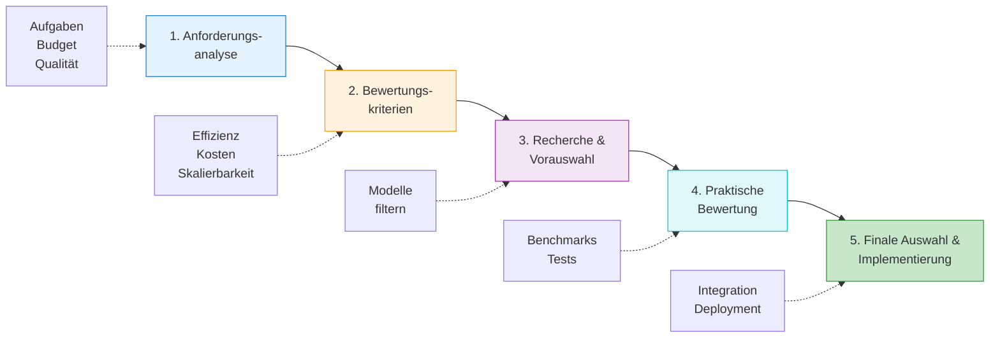

# Modellauswahl
{: .no_toc }

> [!NOTE] Kernfrage 
> Welches Modell passt zur Aufgabe, zum Risiko, zum Budget und zur Latenzanforderung?

---

# Inhaltsverzeichnis
{: .no_toc .text-delta }

1. TOC
{:toc}

---

## Modellrollen im Kurs
Die Kursunterlagen verwenden keine freie Modellrangliste, sondern eine rollenbasierte Konfiguration in `genai_lib.model_config.py`. Dort ist festgelegt, welches Modell für einfache Demos, Worker, Planung, Bewertung, Übersetzung und Embeddings verwendet wird.

Typischer Fehler: Das stärkste verfügbare Modell wird als Standard gewählt. Für viele Agentenschritte sind Kosten, Latenz, Tool-Zuverlässigkeit oder strukturierte Ausgabe wichtiger als maximale Benchmark-Leistung.

| Kursrolle | Konstante | Modell | Einsatz |
|---|---|---|---|
| Baseline / Demo | `BASELINE` | `openai:gpt-5.4-nano` | einfache Beispiele, erste Läufe, Kostenkontrolle |
| Router / leichter Reasoner | `ROUTER` | `openai:gpt-5.4-nano` | klare Auswahlentscheidungen mit wenigen Wegen |
| Worker / Synthese | `WORKER` | `openai:gpt-5.4-mini` | RAG-Synthese, strukturierte Ausgaben, Standard-Worker |
| Coding-Worker | `CODING` | `openai:gpt-5.4-mini` | Codegenerierung, Refactoring, technische Agenten |
| Judge / starker Reasoner | `JUDGE` | `openai:gpt-5.4` | Bewertung, Evaluation, Supervisor, Compliance |
| Planner | `PLANNER` | `openai:gpt-5.4` | Aufgabenzerlegung, Schrittplanung, Agentic RAG |
| Hochwertiger Worker | `WORKER_PREMIUM` | `openai:gpt-5.4` | komplexe Synthese, finale Reports |
| Premium Judge / Planner | `JUDGE_PREMIUM`, `PLANNER_PREMIUM` | `openai:gpt-5.5` | kritische Entscheidungen, maximale Qualität |
| Übersetzung | `TRANSLATOR_FAST`, `TRANSLATOR`, `TRANSLATOR_PREMIUM` | `openai:gpt-5.4-nano`, `openai:gpt-5.4-mini`, `openai:gpt-5.5` | Rohübersetzung, Kursmaterial, finale Veröffentlichung |
| Embeddings | `EMBEDDINGS` | `text-embedding-3-small` | Retrieval, Chunk-Suche, Vektorindizes |

Diese Rollen machen Modellwahl im Kurs überprüfbar. Entwickler vergleichen nicht beliebige Modellnamen, sondern entscheiden, ob ein Schritt Baseline, Worker, Planner oder Judge ist.

> [!IMPORTANT] GPT-5.x-Konfiguration 
> Modelle der GPT-5.x-Serie werden in den Kursmaterialien nicht pauschal mit `temperature` konfiguriert. Qualitätssteuerung erfolgt über präzise Prompts sowie bei Bedarf über `reasoning.effort` und `text.verbosity`.

## Modellauswahlprozess: Schritt für Schritt
Die Auswahl des optimalen KI-Modells erfordert einen strukturierten Prozess:

### Anforderungsanalyse
- **Definition der Aufgaben**: Festlegen, welche spezifischen Funktionen das Modell erfüllen soll (z. B. Textgenerierung, Fragebeantwortung).
- **Qualitätskriterien**: Bestimmen, welche Qualitätsstandards (Kohärenz, Genauigkeit) erfüllt werden müssen.
- **Domänenkenntnisse**: Identifizieren, welches Fachwissen für die Aufgabe notwendig ist.
- **Antwortgeschwindigkeit**: Definieren, welche Reaktionszeit akzeptabel ist.
- **Budget**: Einen finanziellen Rahmen für die KI-Lösung setzen.

### Bewertungskriterien
- **Verständlichkeit**: Wie klar und nachvollziehbar sind die Modellausgaben?
- **Effizienz**: Wie schnell verarbeitet das Modell Eingaben und liefert Ausgaben?
- **Skalierbarkeit**: Kann das Modell mit steigenden Anforderungen mitwachsen?
- **Kosten**: Wie hoch sind die Betriebs- und Nutzungskosten des Modells?

### Recherche und Vorauswahl
- Verfügbare Modelle anhand der festgelegten Kriterien analysieren und eine Vorauswahl geeigneter Kandidaten bilden.

### Praktische Modellbewertung
- **Quantitative Methoden**: Benchmarks und Metriken verwenden, um die Leistung objektiv zu messen.
- **Qualitative Verfahren**: Nutzerfeedback zur praktischen Verwendbarkeit sammeln.
- **Testphase**: Die Modelle in einer realistischen Umgebung erproben.

### Finale Auswahl und Implementierung
- Eine begründete Entscheidung für das am besten geeignete Modell treffen und es in die eigenen Systeme integrieren.

[Interaktive Modellauswahl](https://editor.p5js.org/ralf.bendig.rb/full/8BbTi8Ico)

## Modellkaskade: Mehrere Modelle klug kombinieren
Die Modellkaskade kombiniert mehrere KI-Modelle, um ihre jeweiligen Stärken zu nutzen und Schwächen auszugleichen:

### Beispiel für eine Modellkaskade
1. **Datenanalyse mit pandas**: Analysiert große Datensätze und erstellt statistische Zusammenfassungen
2. **Planung mit `PLANNER`**: Strukturiert die Ergebnisse und erstellt eine logische Gliederung
3. **Synthese mit `WORKER` oder `WORKER_PREMIUM`**: Verfasst den Ergebnistext auf Basis der Struktur
4. **Multimodale Präsentation**: Ergänzt den Text mit visuellen Elementen

### Vorteile einer Modellkaskade
1. **Effizienzsteigerung**: Jedes Modell wird für seine Stärken optimal eingesetzt
2. **Kostenoptimierung**: Ressourcenschonende Modelle für einfache Aufgaben, teurere nur wo nötig
3. **Flexibilität**: Bearbeitung unterschiedlichster Anforderungen durch spezialisierte Modelle

## Bewertungsmethoden für KI-Modelle
### Benchmarks richtig einordnen

Öffentliche Benchmarks wie MMLU können eine erste Orientierung geben, ersetzen aber keine Kursevaluation. Für Agentensysteme ist entscheidend, ob ein Modell die konkrete Rolle zuverlässig erfüllt: Routing, Tool-Aufruf, Planung, Synthese oder Bewertung. Ein hoher allgemeiner Benchmark-Wert hilft wenig, wenn strukturierte Ausgabe instabil ist oder ein Router zu teuer und zu langsam wird.

Grenze: Statische Benchmark-Tabellen altern schnell. In Kursunterlagen werden deshalb keine konkreten Ranglisten gepflegt; die praktische Bewertung erfolgt anhand der Rollen aus `model_config.py`.

### Bewertungsdimensionen

Die Bewertung von KI-Modellen umfasst verschiedene Aspekte:

1. **Rollenqualität**: Erfüllt das Modell die konkrete Aufgabe, etwa Routing, Planung, Synthese oder Bewertung?
2. **Werkzeugverhalten**: Nutzt das Modell externe Tools zuverlässig und mit stabilen Argumenten?
3. **Ausgabeformat**: Hält das Modell JSON, Tabellen, Checklisten oder andere Strukturvorgaben ein?
4. **Sicherheit**: Bleibt das Modell bei Störungen, Injection-Versuchen und unklaren Anforderungen kontrollierbar?
5. **Kosten und Latenz**: Passt das Modell zur erwarteten Nutzungshäufigkeit?

### Konkrete Bewertungsmethoden

### Automatisierte Metriken
- **BLEU**: Misst die Übereinstimmung zwischen generiertem und Referenztext durch Vergleich von Wortgruppen.
- **ROUGE**: Bewertet die Qualität von Zusammenfassungen durch Analyse übereinstimmender Wortsequenzen.

### Menschliche Bewertung
- Bewertung nach Kriterien wie Grammatik, Zusammenhang, Lesbarkeit und Relevanz
- Elo-System für den direkten Vergleich verschiedener Modelle (ähnlich wie bei Schach-Ratings)

### KI-basierte Bewertung
- Einsatz von `JUDGE` oder `JUDGE_PREMIUM` zur Bewertung anderer Modellrollen
- Automatische Erkennung von Fehlinformationen in KI-Antworten

## Praktische Anwendungsbereiche
Die Modellevaluierung und -auswahl findet in verschiedenen Szenarien Anwendung:

### Kundenservice-Chatbots
- Auswahl einer schnellen Baseline- oder Worker-Rolle mit guter Verständlichkeit und Mehrsprachigkeit
- Bewertung nach Kundenzufriedenheit und Lösungsrate

### Content-Erstellung
- Nutzung einer passenden Worker-Rolle für Marketing, Social Media und Blogbeiträge
- Bewertung nach Originalität, Engagement und Konversionsraten

### Technische Assistenz
- Einsatz von `CODING`, `PLANNER` oder `JUDGE` für Programmierung, Planung und Fehlerbewertung
- Bewertung nach Codequalität und Lösungsgeschwindigkeit

## Was für Entwickler zuerst wichtig ist

Modellauswahl ist keine Rangliste, sondern eine Architekturentscheidung. Ein günstiges Modell kann für Routing, Klassifikation oder einfache Tool-Auswahl besser passen als ein großes Reasoning-Modell; ein stärkeres Modell lohnt sich vor allem dort, wo Fehler teuer sind oder mehrere Teilschritte wirklich verstanden werden müssen.

In der Praxis relevant, wenn: Ein Agent mehrere Rollen kombiniert. Dann sollte nicht ein einziges Modell alles erledigen, sondern jede Rolle nach Qualitätsbedarf, Kosten und Latenz bewertet werden.

## Abgrenzung zu verwandten Dokumenten

| Dokument | Frage |
|---|---|
| [Modell-Auswahl Guide]({{ '/orientierung-agentenverstaendnis/modell-auswahl-guide.html' | relative_url }}) | Welche praktischen Designregeln gelten im Kurs für die Modellwahl? |
| [Fine-Tuning]({{ '/kontext-grounding-rag/fine-tuning.html' | relative_url }}) | Wann reicht Modellwahl nicht mehr und Training wird notwendig? |
| [Context Engineering]({{ '/kontext-grounding-rag/context-engineering.html' | relative_url }}) | Welche Kontextstrategie entscheidet mit darüber, ob ein Modell genügt? |

---

**Version:** 1.3 
**Stand:** Mai 2026 
**Kurs:** KI-Agenten. Verstehen. Anwenden. Gestalten.

