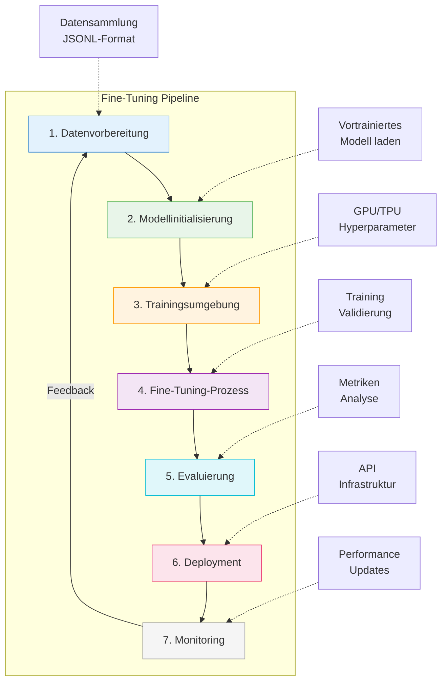

# Fine-Tuning
{: .no_toc }

> [!NOTE] Kernfrage<br>
> Wann lohnt sich Training gegenüber besserem Prompting, Retrieval oder Tool-Design?

---

# Inhaltsverzeichnis
{: .no_toc .text-delta }

1. TOC
{:toc}

---

## Intro
Fine-Tuning ist eine Technik, um ein vortrainiertes Modell auf eine engere Aufgabe oder einen klar umrissenen Datensatz anzupassen. Dabei werden bestehende Modellstrukturen weiterverwendet und gezielt verändert. Das spart im Vergleich zum Training von Grund auf Zeit und Rechenaufwand, ist aber kein Automatismus für bessere Ergebnisse.

In der Praxis lohnt sich Fine-Tuning nur in einem Teil der Fälle. Häufig reicht eine Kombination aus besserem Prompting, sauberem Retrieval und klarer Evaluation aus. Erst wenn sich ein wiederkehrendes Fehlermuster trotz guter Daten, guter Prompts und stabiler Systemarchitektur hält, wird Fine-Tuning zur realistischen Option.

Fine-Tuning ist deshalb am sinnvollsten als Teil eines größeren Optimierungsprozesses zu verstehen. **Evals**, **Prompt Engineering** und **Fine-Tuning** greifen ineinander. Ohne belastbare Evaluation ist kaum erkennbar, ob ein Training wirklich geholfen hat oder nur die Fehler an andere Stellen verschoben wurden.

Typischer Fehler: Fine-Tuning wird als erster Optimierungsschritt gewählt. In vielen Fällen ist zuerst zu prüfen, ob das Problem durch bessere Daten, klarere Prompts, RAG, Tool-Schemas oder ein anderes Basismodell gelöst werden kann.

## Fine-Tuning-Ansätze
### Transfer Learning

Transfer Learning verwendet ein vortrainiertes Modell als Ausgangspunkt. Die allgemeinen Merkmale der frühen Schichten bleiben erhalten; angepasst werden vor allem die Teile, die für die Zielaufgabe relevant sind. Dadurch braucht das Training deutlich weniger Daten und Rechenkapazität als ein Pre-Training von Grund auf.

In der Praxis ist Transfer Learning vor allem dann interessant, wenn eine Aufgabe stabil wiederkehrt und genügend Beispiele vorliegen. Typische Felder sind Bildklassifikation, Verarbeitung natürlicher Sprache und Computer Vision. Grenze: Transfer Learning löst kein Wissensproblem. Fehlende oder wechselnde Fakten gehören eher in Retrieval, Datenbankzugriffe oder Tool-Aufrufe.

### Parameter-effizientes Fine-Tuning (PEFT)

Parameter-effizientes Fine-Tuning verändert nicht das komplette Modell, sondern nur zusätzliche oder ausgewählte Parameter. Das Basismodell bleibt weitgehend unverändert. Dadurch sinken Speicherbedarf, Trainingskosten und Risiko, ein allgemein brauchbares Modell durch eine zu enge Anpassung zu verschlechtern.

Zu den wichtigsten Verfahren gehören LoRA, QLoRA, DoRA, Adapter und Prompt Tuning. LoRA arbeitet mit kompakten Low-Rank-Matrizen, QLoRA kombiniert diesen Ansatz mit quantisierten Gewichten, DoRA zerlegt Gewichte in Größen- und Richtungskomponenten. Adapter fügen zusätzliche Module zwischen bestehende Schichten ein. Prompt Tuning verändert trainierbare Prompt-Repräsentationen statt Modellgewichte im engeren Sinn.

In der Praxis relevant, wenn: mehrere Spezialisierungen mit demselben Basismodell benötigt werden oder nur begrenzte Rechenressourcen verfügbar sind.

### Instruction Fine-Tuning

Instruction Fine-Tuning trainiert ein Modell darauf, natürlichsprachliche Anweisungen verlässlich zu befolgen. Die Trainingsdaten bestehen aus Input-Output-Paaren mit expliziter Instruktion. Das ist besonders relevant für Sprachassistenten, automatisierte Kommunikation und LLM-basierte Werkzeuge, bei denen ein bestimmtes Antwortformat oder Verhalten immer wieder erwartet wird.

Ein einfaches Format kann so aussehen:
  
  ```
  "###Human: $<Input Query>$ ###Assistant: $<Generated Output>$"
  ```

### Supervised Fine-Tuning (SFT)

Supervised Fine-Tuning arbeitet mit handverlesenen Beispielen, die gewünschtes Verhalten direkt demonstrieren. Schon wenige Beispiele können für einen Test reichen; belastbarer wird der Ansatz meist erst mit mehreren Dutzend hochwertigen Demonstrationen. Die Qualität der Beispiele ist wichtiger als ihre Menge.

Der Prozess besteht aus Datenvorbereitung, Upload der Trainingsdaten, Erstellung eines Fine-Tuning-Jobs und anschließender Evaluierung. SFT kann mit Verfahren wie Reinforcement Learning from Human Feedback kombiniert werden, sollte im Kurskontext aber zuerst als kontrollierte Anpassung über kuratierte Beispiele verstanden werden.

## Weitere Ansätze OpenAI
### Direct Preference Optimization (DPO)

DPO trainiert mit bevorzugten und abgelehnten Antwortpaaren. Jedes Beispiel enthält einen Prompt, eine gewünschte Ausgabe und eine weniger gewünschte Ausgabe. Dadurch lassen sich Nuancen wie Stil, Tonalität, Ausdruck und Priorisierung verbessern, ohne den vollständigen RLHF-Prozess aufzubauen.

Der Beta-Parameter steuert, wie stark das neue Modell am vorherigen Verhalten festhält oder sich an den neuen Präferenzen orientiert. Für Kursunterlagen ist vor allem die Idee wichtig: DPO eignet sich nicht für neues Wissen, sondern für wiederkehrende Präferenzentscheidungen.

### Reinforcement Fine-Tuning (RFT)

RFT trainiert nicht gegen feste Zielantworten, sondern anhand von Bewertungssignalen. Grader bewerten Modellantworten und liefern ein numerisches Signal, zum Beispiel über String-Checks, Textähnlichkeit oder ein separates Bewertungsmodell.

Der Ansatz ist vor allem für Aufgaben geeignet, bei denen Experten in der Domäne sich über gute Antworten einig sind und die Qualität eindeutig bewertbar ist. Die konkrete Modellunterstützung ist provider- und zeitabhängig; im Kurs wird RFT deshalb als optionales Vertiefungsthema behandelt und nicht über `genai_lib.model_config.py` als Standardrolle abgebildet.

### Vision Fine-Tuning

Vision Fine-Tuning passt Modelle an Aufgaben mit visuellen Eingaben an, etwa Bildklassifikation, visuelle Beschreibungen oder Objektlokalisierung. Technisch werden Bilder typischerweise als URLs oder Base64-Daten eingebunden. Einschränkungen zu Format, Größe, Datenschutz und Bildinhalten hängen vom Anbieter und vom konkreten Trainingsverfahren ab.

Nicht geeignet, wenn: das Problem nur in einer besseren Bildbeschreibung oder einem klareren Prompt liegt. Dann ist zuerst zu prüfen, ob ein stärkeres Basismodell, bessere Beispiele oder ein anderes Ausgabeschema genügen.

### Modell-Distillation

Modell-Distillation nutzt Ausgaben eines größeren Modells, um ein kleineres Modell für einen begrenzten Aufgabenbereich zu trainieren. Der Nutzen liegt in geringeren Kosten und niedrigerer Latenz, nicht in maximaler allgemeiner Leistungsfähigkeit.

Typischer Ablauf: hochwertige Ausgaben eines starken Modells speichern, mit Evaluierungen prüfen, geeignete Beispiele auswählen, ein kleineres Modell darauf trainieren und anschließend gegen die Baseline vergleichen. Distillation lohnt sich erst, wenn die Aufgabe häufig genug vorkommt, um den Trainings- und Wartungsaufwand zu rechtfertigen.

## Fine-Tuning-Pipeline für LLMs


### Datenvorbereitung
- Datensammlung aus verschiedenen Quellen
- Vorverarbeitung und Formatierung (z.B. JSONL-Format)
- Umgang mit unausgeglichenen Daten (Oversampling, Undersampling)
- Datensatzaufteilung (Training/Validierung/Test)

### Modellinitialisierung
- Auswahl eines geeigneten vortrainierten Modells
- Einrichtung der Umgebung und Installation der Abhängigkeiten
- Laden des Modells in den Speicher

### Trainingsumgebung
- Konfiguration von Hardwareressourcen (GPU/TPU)
- Definition von Hyperparametern (Lernrate, Batch-Größe, Epochen)
- Initialisierung von Optimierern und Verlustfunktionen

### Fine-Tuning-Prozess
- Auswahl der Fine-Tuning-Technik (Voll, PEFT, etc.)
- Durchführung des Trainings mit regelmäßigen Validierungen
- Überwachung von Metriken und Verlustfunktionen

### Evaluierung und Validierung
- Aufsetzen von Evaluierungsmetriken
- Analyse der Trainingsverlaufskurve
- Überwachung und Interpretation der Ergebnisse

### Deployment
- Export des fine-getuned Modells
- Einrichtung der Infrastruktur
- API-Entwicklung für die Modellinteraktion

### Monitoring und Wartung
- Kontinuierliche Überwachung der Modellleistung
- Aktualisierung des LLM-Wissens bei Bedarf
- Wiederholte Feinabstimmung bei veränderter Datenlage

## Schlüsselkomponenten der Modelloptimierung
### Evaluierungen (Evals)

- **Nutzen**: Systematische Tests zur Bewertung von Modellantworten.
    
- **Formate**: Multiple Choice, Klassifikation, Stringvergleich etc.

- **Grader-Typen**:
  - **String-Check-Grader**: Einfache String-Operationen (gleich, ungleich, enthält)
  - **Text-Similarity-Grader**: Bewertung der Ähnlichkeit zwischen Modellantwort und Referenz
  - **Model-Grader**: Nutzung eines separaten Modells zur Bewertung der Ausgaben
  - **Python-Grader**: Ausführung von Python-Code zur Bewertung
  - **Multi-Grader**: Kombination mehrerer Grader für komplexe Bewertungskriterien

- **Integrierter Prozess**: Evals sollten vor dem Fine-Tuning erstellt werden, um eine Baseline zu etablieren und den Fortschritt zu messen.

### Prompt Engineering

- **Ziele**: Maximale Modellleistung ohne Training.
    
- **Methoden**: Klare Instruktionen, Kontextbereitstellung, Few-Shot-Beispiele.

- **Zusammenspiel mit Fine-Tuning**: Prompt Engineering kann Fine-Tuning ergänzen oder in manchen Fällen sogar ersetzen.

- **Beispiel**: Die Prompt-Konstruktion mit relevanten Beispielen (Few-Shot-Learning) kann die Leistung signifikant verbessern, ohne das Modell neu zu trainieren.

Embeddings spielen beim **Fine-Tuning eines Large Language Models (LLMs)** eine zentrale Rolle, da sie den **Ausgangspunkt der Verarbeitung von Eingabedaten** im Modell darstellen. Hier ist eine strukturierte Erklärung ihrer Rolle:

## Embeddings und Fine-Tuning
### Recap: Was sind Embeddings?

**Embeddings** sind **dichte, numerische Vektoren**, die Wörter, Tokens oder ganze Sätze in einem kontinuierlichen Vektorraum repräsentieren. Das Training ordnet **semantisch ähnliche Begriffe nahe beieinander** im Vektorraum an.

### Rolle beim Fine-Tuning eines LLMs

1. **Initiale Repräsentation der Eingabedaten:**
    
    - Bevor Text durch die Transformer-Schichten geht, wird er in Embeddings umgewandelt.
        
    - Diese Embeddings enthalten bereits **viele Informationen über die Bedeutung** der Tokens.
        
2. **Anpassung an die Zielaufgabe:**
    
    - Beim Fine-Tuning werden **nicht nur die oberen Schichten** (z. B. der Decoder oder der Klassifikator), sondern häufig auch die **Embedding-Schicht selbst angepasst**.
        
    - So kann sich das Modell an spezielle Fachterminologie oder Ausdrucksweisen der Zielanwendung gewöhnen.
        
3. **Transferlernen durch vortrainierte Embeddings:**
    
    - Das Modell startet mit **generischen Embeddings** aus dem Pretraining.
        
    - Beim Fine-Tuning lernen die Embeddings, sich besser an die neue Domäne anzupassen (z. B. Jura, Medizin, Technik).
        
4. **Spezialfall: Adapter-Fine-Tuning oder LoRA:**
    
    - In Methoden wie **LoRA** oder **Adapter Layers** werden die Embeddings oft **nicht direkt verändert**, sondern nur zusätzliche Parameter eingeführt.
        
    - Vorteil: Die ursprünglichen Embeddings bleiben erhalten → weniger Overfitting, kleinere Modelle.
        

### Warum sind sie so wichtig?

- Embeddings beeinflussen maßgeblich, **wie der Text semantisch verstanden wird**.
    
- Eine gute Embedding-Anpassung beim Fine-Tuning verbessert die Fähigkeit des Modells, **Aufgabenkontext korrekt zu erfassen** (z. B. bei Named Entity Recognition, Sentiment Analysis, RAG-Systemen usw.).
    

### Einordnung

Die Embeddings sind die **Brücke zwischen rohem Text und neuronaler Verarbeitung**. Beim Fine-Tuning werden sie oft (aber nicht immer) mitangepasst, um eine **bessere Domänenanpassung und höhere Genauigkeit** zu erzielen.

## Best Practices
### Datenstrategie

Datenqualität schlägt Datenmenge. Für einen ersten Test können wenige hochwertige Beispiele reichen; für belastbare Entscheidungen braucht es realistische Beispiele aus der Zielanwendung. Die Daten müssen repräsentativ sein, Randfälle enthalten und erkennbare Verzerrungen vermeiden. Ein Modell lernt sonst nicht die Aufgabe, sondern die Schieflage des Datensatzes.

Das Datenformat ist Teil der Qualität. JSONL-Dateien müssen vor dem Training validiert werden, jede Zeile braucht ein vollständiges Objekt und das Format muss zur gewählten Fine-Tuning-Methode passen. Fehler in der Datenstruktur sind besonders teuer, weil sie oft erst nach Upload oder Trainingsstart sichtbar werden.

### Trainingsstrategie

Training sollte konservativ starten. Kleine Lernraten, klare Validierungsdaten und ein schrittweises Vorgehen reduzieren das Risiko von Overfitting. Bei Verfahren, die Schichten direkt verändern, kann ein schrittweises Auftauen helfen: zuerst die oberen Schichten, später bei Bedarf tiefere Teile des Modells.

Evaluierungen werden vor dem Fine-Tuning definiert, nicht danach. Sonst fehlt die Baseline, gegen die das neue Modell verglichen wird. Trainings- und Validierungsmetriken sollten laufend beobachtet werden; Early Stopping ist sinnvoll, wenn sich die Validierungsqualität verschlechtert, während der Trainingsverlust weiter sinkt.

### Technische Exzellenz

Checkpoints und Modellversionierung machen Fine-Tuning nachvollziehbar. Zwischenstände sollten so dokumentiert werden, dass Regressionen erkennbar bleiben und ein älteres Modell wiederhergestellt werden kann. Hyperparameter werden nicht nebenbei verändert, sondern systematisch verglichen, besonders Lernrate, Batch-Größe und Epochenanzahl.

Für größere Experimente sind Tracking-Werkzeuge wie TensorBoard, W&B oder MLflow hilfreich. Diese Werkzeuge ersetzen aber nicht die fachliche Bewertung: Ein glatter Trainingsverlauf beweist noch nicht, dass das Modell im Anwendungskontext besser geworden ist.

### Sicherheit und Effizienz

Sensible Daten werden vor dem Training anonymisiert oder ausgeschlossen. Rechtliche Anforderungen gelten nicht erst beim Deployment, sondern bereits bei Datensammlung, Upload, Training und Evaluation. Zusätzlich braucht das feinabgestimmte Modell dieselben Sicherheitsprüfungen wie jedes andere produktive LLM-System.

Kosten entstehen nicht nur im Training, sondern auch in Evaluation, Wiederholungsläufen und späterer Nutzung. Token-Verbrauch, Ausgabelänge und Modellgröße sollten deshalb früh gemessen werden. Für sehr häufige, eng begrenzte Aufgaben kann Distillation günstiger sein als dauerhaft ein großes Modell zu verwenden.

### Spezifische Techniken für erweiterte Anwendungen

Erweiterte Verfahren lohnen sich erst, wenn der Basisprozess stabil ist. Multi-Task Learning kann verwandte Aufgaben bündeln, erhöht aber die Anforderungen an Datenbalance und Evaluation. Quantisierung reduziert Speicherbedarf und kann mit Verfahren wie QLoRA kombiniert werden, muss aber gegen Qualitätsverluste getestet werden. Multimodale Verfahren brauchen zusätzlich kontrollierte Bildqualität, klare Datenschutzgrenzen und eigene Evaluationsfälle.

## Herausforderungen & Perspektiven
### Skalierbarkeit

Fine-Tuning großer Modelle erfordert erhebliche Rechen- und Speicherkapazitäten. Parameter-effiziente Verfahren wie LoRA und QLoRA reduzieren diese Hürde, beseitigen sie aber nicht vollständig. Auch kleinere Trainingsläufe brauchen reproduzierbare Umgebungen, saubere Versionierung und ausreichend Zeit für Evaluation.

### Ethische Überlegungen

Trainingsdaten können Verzerrungen enthalten, die sich auf das Modell übertragen oder verstärken. Datenschutz ist besonders kritisch, weil Trainingsdaten nicht wie Prompt-Kontext einfach aus einer einzelnen Anfrage entfernt werden können. Deshalb müssen Datenherkunft, Auswahlkriterien und bekannte Einschränkungen dokumentiert werden.

### Integration mit neuen Technologien

Edge Computing, verteiltes Training und IoT-Szenarien können Fine-Tuning attraktiver machen, wenn Latenz, Datenschutz oder Offline-Fähigkeit wichtiger sind als maximale Modellgröße. Für den Kurs bleibt das eine Vertiefung: Zuerst muss klar sein, ob Fine-Tuning überhaupt das richtige Werkzeug ist.

## Was für Entwickler zuerst wichtig ist

Fine-Tuning lohnt sich erst, wenn ein wiederkehrendes Verhalten stabil verändert werden soll und genügend saubere Trainings- und Evaluationsdaten vorliegen. Einzelne Fakten, wechselndes Wissen oder schlecht beschriebene Tools sind dagegen keine guten Trainingsgründe.

Grenze: Fine-Tuning ersetzt keine Wissensanbindung. Wenn Antworten deshalb falsch sind, weil aktuelle oder proprietäre Informationen fehlen, ist RAG meist der passendere erste Schritt.

## Abgrenzung zu verwandten Dokumenten

| Dokument | Frage |
|---|---|
| [Prompt Engineering]({{ '/erste-agenten/prompt-engineering.html' | relative_url }}) | Was lässt sich noch über bessere Anweisungen statt über Training lösen? |
| [RAG-Konzepte]({{ '/rag-kontext/rag-konzepte.html' | relative_url }}) | Wann hilft externer Wissenszugriff mehr als Modellanpassung? |
| [Modellauswahl]({{ '/orientierung/modellauswahl.html' | relative_url }}) | Wie wird entschieden, ob ein anderes Basismodell genügt? |

---

**Version:** 1.3<br>
**Stand:** Mai 2026<br>
**Kurs:** KI-Agenten. Verstehen. Anwenden. Gestalten.


