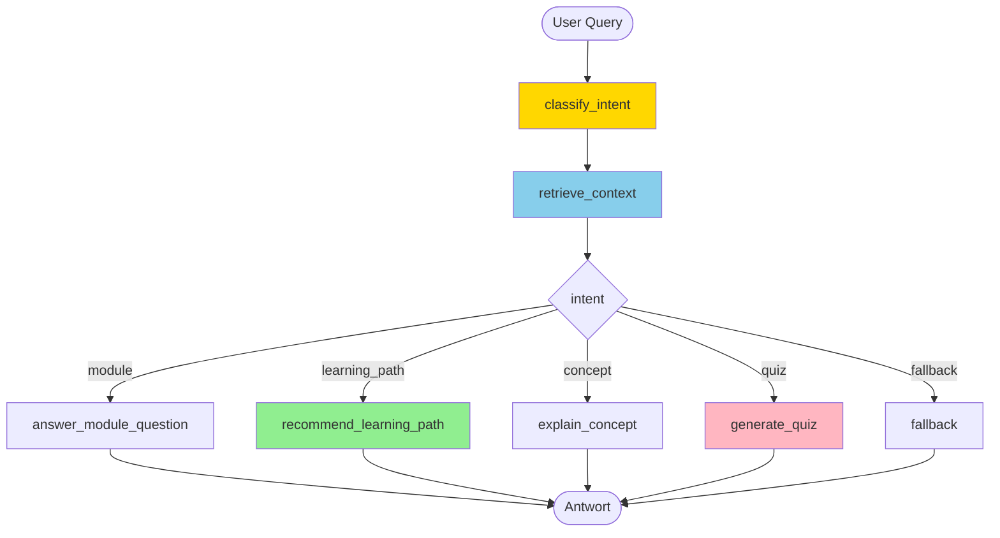

# Kursnavigator Workshop
{: .no_toc }

> **Einen kleinen LangGraph-Lernassistenten bauen**      
> Schrittweise Entwicklung vom einfachen Routing-Graphen zum nutzbaren Kursnavigator mit optionaler Web-Oberfläche

---

# Inhaltsverzeichnis
{: .no_toc .text-delta }

1. TOC
{:toc}

---

## 1 Projektübersicht

In dieser Übungsaufgabe bauen Sie schrittweise einen **Kursnavigator**, der Lernende durch den Agenten-Kurs führt. Der Navigator beantwortet Fragen zu Modulen, empfiehlt Lernpfade, erklärt zentrale Konzepte und erzeugt auf Wunsch kleine Quizfragen.

**Lernziele:**
- LangGraph State Machines von Grund auf verstehen
- Conditional Routing für verschiedene Anfragetypen einsetzen
- Kurswissen als kleine lokale Wissensbasis strukturieren
- Sessions und Verlauf mit Checkpointing speichern
- eine einfache Gradio-Oberfläche für den Agenten bereitstellen

**Arbeitsumgebung:** Google Colab, Jupyter Notebook oder lokales Python

**Voraussetzung:** Grundkenntnisse aus M01-M10; M16 und M28 hilfreich für Erweiterungen

---

## 2 Notebook-Struktur

Sie erstellen **ein Notebook** mit **6 aufbauenden Kapiteln**:

```text
📓 Kursnavigator_Workshop.ipynb
   ├── 🎯 Kapitel 1: StateGraph Basics
   ├── 🔀 Kapitel 2: Intent Routing
   ├── 📚 Kapitel 3: Wissensbasis & Retrieval-Light
   ├── 💾 Kapitel 4: Checkpointing & Sessions
   ├── 🧠 Kapitel 5: Lernpfade, Konzepte und Quiz
   └── 🚀 Kapitel 6: Gradio UI & Bonus Deployment
```

### 2.1 Modul-Zuordnung

Jedes Kapitel baut auf den entsprechenden Kursmodulen auf. Bearbeiten Sie das jeweilige Kapitel **nach** dem zugehörigen Modul:

| Workshop Kapitel | Kursmodul | Thema |
|-----------------|-----------|-------|
| Kapitel 1: StateGraph Basics | M08, M09 | Warum LangGraph? / StateGraph Basics |
| Kapitel 2: Intent Routing | M10 | Conditional Routing & Tool-Loop |
| Kapitel 3: Wissensbasis | M11–M14 (RAG) oder ab M10 | Kursdaten strukturieren, Retrieval-light (kein vollständiges RAG erforderlich) |
| Kapitel 4: Checkpointing & Sessions | M16 | Persistente Sitzungen |
| Kapitel 5: Lernpfade, Konzepte und Quiz | M04, M05, M24 | Prompting, Struktur, Tests |
| Kapitel 6: Gradio UI & Bonus Deployment | M28, M33 | UI und optional Hugging Face Spaces |

> **Didaktische Einordnung:** Der Kursnavigator startet fachlich in M10, eignet sich aber besonders gut als roter Faden über mehrere spätere Module hinweg.

---

## 3 Vorbereitung: Google Colab oder lokales Setup

### 3.1 API-Key speichern

Wenn Sie mit einem externen Modell arbeiten, speichern Sie Ihren `OPENAI_API_KEY` in Colab Secrets oder lokal in einer `.env`.

### 3.2 Basis-Pakete installieren

```python
# ═══════════════════════════════════════════════════
# 📦 INSTALLATION
# ═══════════════════════════════════════════════════

!uv pip install --system -q git+https://github.com/ralf-42/Agenten.git#subdirectory=04_modul
!uv pip install --system -q langgraph>=1.0.0 langgraph-checkpoint-sqlite gradio
```

### 3.3 API-Key laden und Umgebung prüfen

```python
# ═══════════════════════════════════════════════════
# 🔑 API-KEY SETUP
# ═══════════════════════════════════════════════════

from genai_lib.utilities import setup_api_keys, check_environment

setup_api_keys(['OPENAI_API_KEY'])
check_environment()
```

> **Lokal:** API-Key vorab in `.env` oder per `os.environ["OPENAI_API_KEY"] = "sk-..."` setzen — `setup_api_keys()` liest beides automatisch.

---

## 4 Kapitel 1: StateGraph Basics

> 📚 **Kursmodul:** M08 – Warum LangGraph? | M09 – StateGraph Basics

**Lernziel:** Einen kleinen Graphen mit TypedDict-State und einfachen Nodes aufbauen

### 4.1 Szenario

Ein Nutzer stellt eine Anfrage wie:

- "Welche Module brauche ich für RAG?"
- "Erkläre mir Checkpointing."
- "Gib mir eine Quizfrage zu Tool Calling."

Der Graph soll die Anfrage zunächst entgegennehmen und den Typ der Anfrage erkennen.

### 4.2 Aufgabe 1.1: State definieren

```python
# ═══════════════════════════════════════════════════
# 🎯 KAPITEL 1: STATEGRAPH BASICS
# ═══════════════════════════════════════════════════

from typing import TypedDict, Literal
from langgraph.graph import StateGraph, START, END

class NavigatorState(TypedDict):
    user_query: str
    intent: Literal["module", "learning_path", "concept", "quiz", "fallback"] | None
    retrieved_context: str
    answer: str
```

### 4.3 Aufgabe 1.2: Erste Nodes erstellen

```python
from langchain.chat_models import init_chat_model

llm = init_chat_model("openai:gpt-4o-mini", temperature=0.0)

def classify_intent(state: NavigatorState) -> NavigatorState:
    """Erkennt, welche Art von Anfrage vorliegt."""
    query = state["user_query"]
    ...

def fallback_answer(state: NavigatorState) -> NavigatorState:
    """Gibt eine sichere Fallback-Antwort zurück."""
    ...
```

### 4.4 Aufgabe 1.3: Minimalen Graphen bauen

```python
workflow = StateGraph(NavigatorState)

workflow.add_node("classify_intent", classify_intent)
workflow.add_node("fallback", fallback_answer)

workflow.add_edge(START, "classify_intent")
workflow.add_edge("classify_intent", "fallback")
workflow.add_edge("fallback", END)

graph = workflow.compile()
```

### 4.5 Aufgabe 1.4: Minimaltest

```python
initial_state = {
    "user_query": "Welche Module brauche ich für RAG?",
    "intent": None,
    "retrieved_context": "",
    "answer": "",
}

result = graph.invoke(initial_state)
print(result["intent"])
print(result["answer"])
```

**Erfolgskriterium:**
- ✅ StateGraph läuft fehlerfrei
- ✅ State wird korrekt befüllt
- ✅ es gibt eine sichere Fallback-Antwort

---

## 5 Kapitel 2: Intent Routing

> 📚 **Kursmodul:** M10 – Conditional Routing & Tool-Loop

**Lernziel:** Verschiedene Anfragetypen über Conditional Edges zu spezialisierten Nodes leiten

### 5.1 Aufgabe 2.1: Router-Funktion definieren

```python
# ═══════════════════════════════════════════════════
# 🔀 KAPITEL 2: INTENT ROUTING
# ═══════════════════════════════════════════════════

from typing import Literal

def route_by_intent(state: NavigatorState) -> Literal["module", "learning_path", "concept", "quiz", "fallback"]:
    """Routet zur passenden Verarbeitung basierend auf intent."""
    return state["intent"] or "fallback"
```

### 5.2 Aufgabe 2.2: Antwort-Nodes anlegen

```python
def answer_module_question(state: NavigatorState) -> NavigatorState:
    """Beantwortet Fragen zu Modulen und Reihenfolge."""
    ...

def recommend_learning_path(state: NavigatorState) -> NavigatorState:
    """Empfiehlt einen Lernpfad passend zum Ziel."""
    ...

def explain_concept(state: NavigatorState) -> NavigatorState:
    """Erklärt einen Begriff aus dem Kurs."""
    ...

def generate_quiz(state: NavigatorState) -> NavigatorState:
    """Erzeugt kleine Quizfragen."""
    ...
```

### 5.3 Aufgabe 2.3: Graph mit Conditional Edge bauen

```python
workflow = StateGraph(NavigatorState)

workflow.add_node("classify_intent", classify_intent)
workflow.add_node("module", answer_module_question)
workflow.add_node("learning_path", recommend_learning_path)
workflow.add_node("concept", explain_concept)
workflow.add_node("quiz", generate_quiz)
workflow.add_node("fallback", fallback_answer)

workflow.add_edge(START, "classify_intent")
workflow.add_conditional_edges(
    "classify_intent",
    route_by_intent,
    {
        "module": "module",
        "learning_path": "learning_path",
        "concept": "concept",
        "quiz": "quiz",
        "fallback": "fallback",
    }
)
...
```

**Erfolgskriterium:**
- ✅ Router-Funktion entscheidet korrekt
- ✅ verschiedene Nutzerfragen landen in verschiedenen Nodes
- ✅ der Graph endet deterministisch

---

## 6 Kapitel 3: Wissensbasis & Retrieval-Light

> 📚 **Kursmodul:** M11-M14 oder als vereinfachte Kursdaten-Aufgabe ab M10

**Lernziel:** Kurswissen lokal strukturieren und gezielt in den Graphen einbinden

### 6.1 Aufgabe 3.1: Wissensbasis laden

Eine vollständige Wissensbasis mit allen Kursmodulen (M01–M33) liegt unter `02_daten/modules.json` bereit. Laden Sie diese als Ausgangspunkt:

```python
# ═══════════════════════════════════════════════════
# 📚 KAPITEL 3: WISSENSBASIS & RETRIEVAL-LIGHT
# ═══════════════════════════════════════════════════

import json

with open("../../02_daten/05_sonstiges/modules.json", encoding="utf-8") as f:
    modules = json.load(f)

# Überblick
print(f"{len(modules)} Module geladen")
print(modules[0])
```

Jeder Eintrag enthält: `module`, `title`, `topics`, `level`, `prerequisites`, `summary`.

> **Erweiterung:** Ergänzen oder korrigieren Sie Einträge nach Bedarf — die Datei ist ein Startpunkt, keine fertige Lösung.

### 6.2 Aufgabe 3.2: Kontextsuche implementieren

```python
def retrieve_context(state: NavigatorState) -> NavigatorState:
    """Sucht passende Kursinformationen zur Anfrage."""
    query = state["user_query"].lower()
    ...
```

### 6.3 Aufgabe 3.3: Retrieval in den Graphen einbauen

```python
workflow.add_node("retrieve_context", retrieve_context)

workflow.add_edge(START, "classify_intent")
workflow.add_edge("classify_intent", "retrieve_context")
workflow.add_conditional_edges(
    "retrieve_context",
    route_by_intent,
    ...
)
```

**Erfolgskriterium:**
- ✅ Kontext wird nicht frei erfunden, sondern aus Kursdaten gezogen
- ✅ Modulfragen und Konzeptfragen nutzen die Wissensbasis
- ✅ Antworten werden konkreter und nachvollziehbarer

---

## 7 Kapitel 4: Checkpointing & Sessions

> 📚 **Kursmodul:** M16 – Checkpointing & Sessions

**Lernziel:** Verlauf und Sitzungen für wiederholte Lernfragen speichern

### 7.1 Aufgabe 4.1: Checkpointer einrichten

```python
# ═══════════════════════════════════════════════════
# 💾 KAPITEL 4: CHECKPOINTING & SESSIONS
# ═══════════════════════════════════════════════════

from langgraph.checkpoint.sqlite import SqliteSaver

checkpointer = SqliteSaver.from_conn_string("kursnavigator_sessions.db")
graph = workflow.compile(checkpointer=checkpointer)
```

### 7.2 Aufgabe 4.2: Session-basierte Interaktion

```python
config = {"configurable": {"thread_id": "user_123"}}

result1 = graph.invoke(
    {
        "user_query": "Ich bin Anfänger. Wo starte ich?",
        "intent": None,
        "retrieved_context": "",
        "answer": "",
    },
    config=config,
)

result2 = graph.invoke(
    {
        "user_query": "Und wann sollte ich RAG lernen?",
        "intent": None,
        "retrieved_context": "",
        "answer": "",
    },
    config=config,
)
```

### 7.3 Aufgabe 4.3: Verlauf inspizieren

```python
def show_session_history(thread_id: str):
    config = {"configurable": {"thread_id": thread_id}}
    history = graph.get_state_history(config)
    ...
```

**Erfolgskriterium:**
- ✅ Sitzungen bleiben erhalten
- ✅ mehrere Anfragen können derselben Session zugeordnet werden
- ✅ Verlauf kann eingesehen oder zurückgesetzt werden

---

## 8 Kapitel 5: Lernpfade, Konzepte und Quiz

> 📚 **Kursmodul:** M04, M05, M19

**Lernziel:** Antwortqualität strukturieren und mit einfachen Tests absichern

### 8.1 Aufgabe 5.1: Lernpfad-Logik präzisieren

Definieren Sie mindestens zwei Zielgruppen:

- Anfänger
- Fortgeschrittene

Und mindestens drei Lernziele:

- Grundlagen
- RAG
- Multi-Agent

### 8.2 Aufgabe 5.2: Quiz-Output strukturieren

```python
def generate_quiz(state: NavigatorState) -> NavigatorState:
    """Erzeugt 2-3 Quizfragen in einem festen Format."""
    # Beispiel-Ausgabe:
    # 1. Frage
    # 2. Frage
    # 3. Frage
    ...
```

### 8.3 Aufgabe 5.3: Testfragen definieren

Testen Sie Ihren Navigator mindestens mit diesen fünf Fragen:

- "Welche Module sollte ich für RAG bearbeiten?"
- "Was macht M14?"
- "Erkläre mir Checkpointing in zwei Sätzen."
- "Ich bin Anfänger und will Agenten verstehen. Wo starte ich?"
- "Gib mir drei Quizfragen zu Tool Use."

**Erfolgskriterium:**
- ✅ Antworten bleiben beim Kurskontext
- ✅ Lernpfade sind nachvollziehbar
- ✅ Quizfragen passen thematisch
- ✅ Testfragen laufen reproduzierbar durch

---

## 9 Kapitel 6: Gradio UI & Bonus Deployment

> 📚 **Kursmodul:** M28 – Gradio UI für Agenten | M33 – Production Deployment

**Lernziel:** Den Kursnavigator mit einer kleinen Oberfläche nutzbar machen

### 9.1 Aufgabe 6.1: Chat-Handler schreiben

```python
# ═══════════════════════════════════════════════════
# 🚀 KAPITEL 6: GRADIO UI & BONUS DEPLOYMENT
# ═══════════════════════════════════════════════════

def chat_with_navigator(message, history, thread_id):
    """Verarbeitet eine Nutzeranfrage mit dem Kursnavigator."""
    config = {"configurable": {"thread_id": thread_id}}
    result = graph.invoke(
        {
            "user_query": message,
            "intent": None,
            "retrieved_context": "",
            "answer": "",
        },
        config=config,
    )
    ...
```

### 9.2 Aufgabe 6.2: Gradio-Oberfläche aufbauen

```python
import gradio as gr

with gr.Blocks() as demo:
    gr.Markdown("# Kursnavigator")

    with gr.Row():
        thread_id = gr.Textbox(label="Session ID", value="user_001")

    chatbot = gr.Chatbot(height=450)
    msg = gr.Textbox(placeholder="Frage zum Kurs stellen ...")

    msg.submit(chat_with_navigator, [msg, chatbot, thread_id], [msg, chatbot])
```

### 9.3 Aufgabe 6.3: Bonus Deployment

Optional können Sie die App als **Hugging Face Space** deployen. Dafür benötigen Sie mindestens:

- `app.py`
- `requirements.txt`
- kleine Wissensbasis (`json` oder `md`)
- gesetzte Secrets für API-Keys

**Erfolgskriterium:**
- ✅ lokale UI funktioniert
- ✅ Sessions funktionieren auch über die UI
- ✅ optional: die App läuft als kleiner Hugging Face Space

### 9.4 Hugging Face Spaces Deployment (Bonus)

Das Deployment auf **Hugging Face Spaces** ist ein freiwilliger Zusatzschritt. Es zeigt, wie aus der lokalen Übung eine kleine öffentlich oder privat nutzbare Web-App wird.

**Empfohlene Minimalstruktur:**

```text
kursnavigator-space/
  app.py
  requirements.txt
  modules.json
  README.md
```

**Typische Inhalte:**

- `app.py`: Gradio-App mit LangGraph-Workflow
- `requirements.txt`: benötigte Pakete wie `langgraph`, `langchain`, `langchain-openai`, `gradio`
- `modules.json`: kleine Wissensbasis für Module und Konzepte
- `README.md`: kurze Beschreibung und Nutzungshinweise

**Code-Anpassungen für Hugging Face Spaces:**

Hugging Face Spaces stellt Secrets automatisch als Umgebungsvariablen bereit — `setup_api_keys()` funktioniert dort **nicht** (kein Colab-Secret-Manager). Ersetzen Sie den Setup-Block in `app.py` durch:

```python
# ✅ Hugging Face Spaces — API-Key aus Space Secrets laden
import os

openai_api_key = os.environ.get("OPENAI_API_KEY")
if not openai_api_key:
    raise ValueError("OPENAI_API_KEY nicht gesetzt. Bitte unter Space → Settings → Secrets hinterlegen.")

os.environ["OPENAI_API_KEY"] = openai_api_key
```

> **Space Secrets einrichten** — zwei Wege:
>
> **Option A: Im Browser** — Space → Settings → Variables and secrets → New secret → Name: `OPENAI_API_KEY`, Value: `sk-...`
>
> **Option B: Per Code** (z.B. aus einem lokalen Notebook):


```python
from huggingface_hub import HfApi
api = HfApi()
api.add_space_secret(repo_id="username/space-name", key="OPENAI_API_KEY", value="sk-...")
```


**Empfohlener Ablauf:**

1. Erstellen Sie einen neuen **Gradio Space** auf Hugging Face.
2. Laden Sie `app.py`, `requirements.txt` und Ihre Wissensbasis hoch.
3. Hinterlegen Sie benötigte API-Keys unter den **Space Secrets**.
4. Starten Sie den Space und prüfen Sie die Logs auf Import- oder Paketfehler.
5. Testen Sie die Anwendung mit denselben Beispielanfragen wie lokal.

**Sinnvolle Secrets:**

- `OPENAI_API_KEY`

**Prüffragen nach dem Deployment:**

- Lädt der Space ohne Build-Fehler?
- Funktioniert die Gradio-Oberfläche im Browser?
- Gibt der Kursnavigator sinnvolle Antworten wie in der lokalen Version?
- Werden Fehler im UI verständlich angezeigt?

> **Hinweis:** Das Hugging-Face-Deployment ist ausdrücklich **kein Pflichtbestandteil** des Workshops. Die Kernleistung bleibt der lokale Kursnavigator mit LangGraph.

---

## 10 Bonusaufgaben (Optional)

### 10.1 Bonus 1: Personalisierte Empfehlungen
- berücksichtigen Sie Anfänger vs. Fortgeschrittene
- unterscheiden Sie zwischen Interessen wie RAG, Multi-Agent oder Deployment

### 10.2 Bonus 2: LangSmith Integration
- tracken Sie die Graph-Läufe
- vergleichen Sie mehrere Beispielanfragen
- dokumentieren Sie Fehlklassifikationen

### 10.3 Bonus 3: Erweiterte Wissensbasis
- lesen Sie Inhalte aus `01_notebook/README.md`
- ergänzen Sie ausgewählte Dateien aus `docs/concepts/`
- bauen Sie eine bessere Kontextsuche

### 10.4 Bonus 4: Mermaid-Visualisierung
- visualisieren Sie den Graphen
- dokumentieren Sie Routing und Antwortpfade

---

## 11 Bewertungskriterien

| Aufgabe | Punkte | Kriterien |
|---------|--------|-----------|
| 1: StateGraph Basics | 15 | TypedDict, State, Nodes, Grundgraph |
| 2: Intent Routing | 20 | Router-Funktion, Conditional Edges |
| 3: Wissensbasis | 20 | Kursdaten, Kontextsuche, nachvollziehbare Antworten |
| 4: Checkpointing & Sessions | 15 | SQLite-Checkpointer, Verlauf |
| 5: Lernpfade, Konzepte und Quiz | 20 | Antwortqualität, Quiz, Testfragen |
| 6: Gradio UI & Bonus Deployment | 10 | Nutzbare Oberfläche, optional HF Space |
| **Gesamt** | **100** | |

**Bestanden:** ≥ 60 Punkte

---

## 12 Hilfreiche Ressourcen

**LangGraph Dokumentation:**
- [StateGraph Guide](https://langchain-ai.github.io/langgraph/concepts/low_level/)
- [Checkpointing](https://langchain-ai.github.io/langgraph/how-tos/persistence/)

**Projektinterne Quellen:**
- `Agenten/01_notebook/README.md`
- `Agenten/docs/concepts/`
- `Agenten/docs/frameworks/`

**Weiterführende Dokumente:**
- [Aufgaben & Lösungswege](../concepts/Aufgabenklassen_und_Loesungswege.html)
- [State Management](../concepts/State_Management.html)
- [Checkpointing & Persistenz](../concepts/Checkpointing_Persistenz.html)

---

## 13 Architektur-Übersicht



---

## 14 Abgabe

**Format:**
- **Jupyter Notebook** (`Kursnavigator_Workshop.ipynb`)
  - mit allen 6 Kapiteln ausführbar
  - mit mindestens einer Graph-Visualisierung
  - mit Testfragen und Beispielausgaben
- optional: **SQLite-Datenbank** (`kursnavigator_sessions.db`)
- optional: **Gradio-App** (`app.py`)
- kurzes **README.md** mit:
  - Ziel des Navigators
  - kurzer Architekturübersicht
  - Setup-Anleitung
  - Beispielanfragen

**Deadline:** [Wird vom Dozenten festgelegt]

### 14.1 Checkliste vor Abgabe
- [ ] Notebook läuft von oben bis unten fehlerfrei durch
- [ ] TypedDict-State ist definiert
- [ ] Intent-Routing funktioniert
- [ ] Wissensbasis ist eingebunden
- [ ] mindestens fünf Testfragen wurden ausgeführt
- [ ] Antworten bleiben beim Kursmaterial
- [ ] Checkpointing funktioniert (Kapitel 4, 15 Punkte)
- [ ] optional: Gradio-UI läuft (Kapitel 6)

---

## 15 FAQ

**Q: Warum LangGraph statt einfachem `create_agent()`?**  
A: Weil der Kursnavigator vor allem Routing, State und kontrollierte Antwortpfade zeigen soll. Genau dafür ist LangGraph didaktisch besser geeignet als ein freier Agenten-Loop.

**Q: Muss ich alle Kapitel implementieren?**  
A: Kapitel 1-3 sind Pflicht für eine brauchbare Basisversion. Kapitel 4-6 erweitern das Projekt sinnvoll und bringen die volle Punktzahl.

**Q: Brauche ich echtes RAG?**  
A: Nein. Für diese Übung reicht eine kleine lokale Wissensbasis mit einfacher Kontextsuche. Das Ziel ist Agentensteuerung, nicht ein vollständiges RAG-System.

**Q: Kann ich die Übung auch lokal statt in Colab machen?**  
A: Ja. Verwenden Sie lokal Jupyter oder ein Python-Skript plus `.env` für API-Keys.

**Q: Ist Hugging Face Spaces Pflicht?**  
A: Nein. Das Deployment ist ein Bonus. Der Kern der Aufgabe ist der LangGraph-Kursnavigator selbst.

**Q: Was ist der Unterschied zur Agenten-Challenge?**  
A:
  - **Kursnavigator Workshop**: Fokus auf LangGraph, Routing, State und kleine Kursanwendung
  - **Agenten Challenge**: größeres End-to-End-Projekt mit höherer technischer Breite

---

**Version**: 1.0     
**Stand**: März 2026    
**Kurs**: KI-Agenten. Verstehen. Anwenden. Gestalten.    
