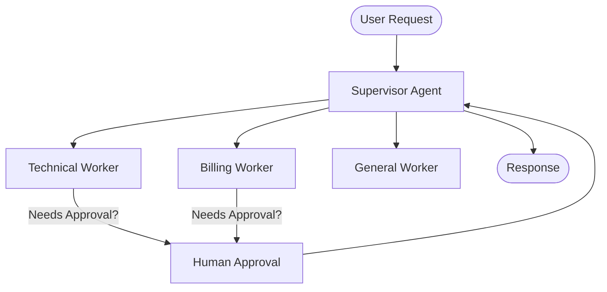
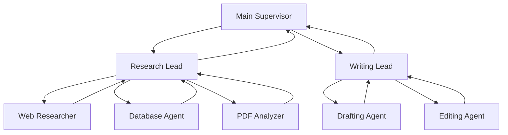
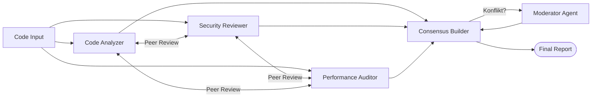
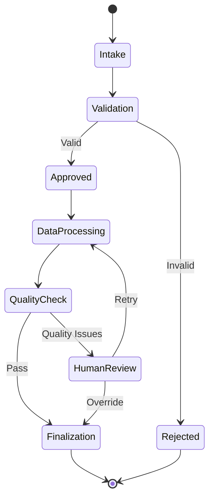
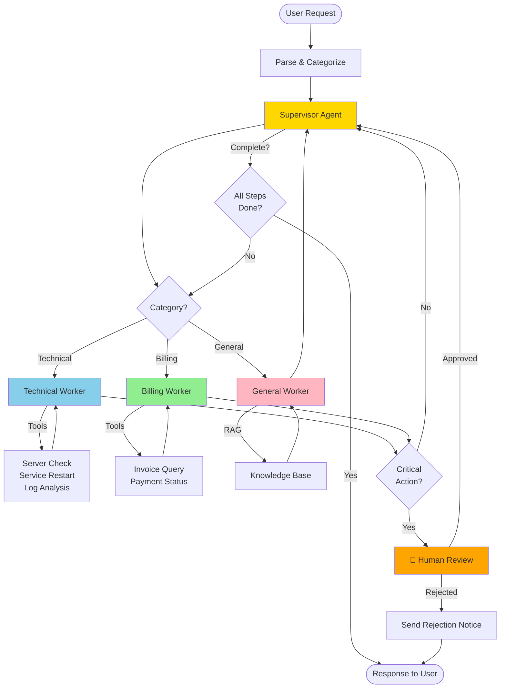

# Agenten-Challenge
{: .no_toc }

> **Praxisprojekt: Production-Ready Multi-Agent-System entwickeln**

---

# Inhaltsverzeichnis
{: .no_toc .text-delta }

1. TOC
{:toc}

---

# 1 | Überblick Agenten-Challenge

Die Agenten-Challenge dient als praktische Anwendung und Integration der in den Kursmodulen M00-M22 erlernten Konzepte. Ziel ist es, ein funktionsfähiges Multi-Agent-System zu entwickeln, das **LangGraph State Machines**, **Human-in-the-Loop** und **Checkpointing** kombiniert und einen praktischen Nutzen bietet.

## 1 Lernziele

- Integration von LangChain 1.0+ und LangGraph 1.0+ in einem Production-System
- Implementierung komplexer Multi-Agent-Architekturen (Supervisor, Hierarchical, Collaborative)
- Praktische Anwendung von State Machines und Conditional Routing
- Human-in-the-Loop Workflows für kritische Entscheidungen
- Deployment mit persistenter Session-Verwaltung
- Präsentation und Dokumentation der eigenen Lösung

## 2 Voraussetzungen

- Abschluss der Module M00-M22 (Tag 1-5)
- Kenntnisse in LangChain 1.0+ und LangGraph 1.0+
- Zugriff auf API-Keys (OpenAI)
- Grundlegende Vertrautheit mit Gradio für UI-Entwicklung
- Verständnis von State Machines und Checkpointing

## 3 Zeitrahmen & Umfang

- **Zeitaufwand:** 20-30 Stunden (verteilt über 2-3 Wochen)
- **Komplexität:** Production-Ready Multi-Agent-System mit State Management
- **Eigenständigkeit:** Freie Gestaltung innerhalb der gewählten Projektoption

## 4 Praxiseinblick: Von der State Machine zum Production-System

{: .highlight }
> "Ein Agent ist kein Chatbot – der Unterschied ist verstanden."
> — Modul M01 (Kursplan)

Die Agenten-Challenge bereitet Sie auf **realistische Herausforderungen** vor, die bei Production-Deployments von KI-Agenten auftreten:

### 4.1 Was unterscheidet einen einfachen Agent von einem Production-System?

| **Einfacher Agent** | **Production-System (Challenge-Ziel)** |
|---------------------|---------------------------------------|
| `create_agent()` mit Tools | LangGraph State Machine mit Kontrolle |
| Keine Session-Persistenz | Checkpointing (SQLite/PostgreSQL) |
| Keine Fehlerbehandlung | Graceful Error Handling + Retries |
| Linearer Flow | Conditional Routing, Verzweigungen |
| Kein Human-in-the-Loop | Interrupt/Resume für kritische Aktionen |
| Einzelner Agent | Multi-Agent-Koordination (Supervisor) |
| Keine Observability | LangSmith-Tracing + Monitoring |

### 4.2 Learnings aus der Praxis

**1. State Management ist Critical**
- Production-Agents müssen Sessions über Tage/Wochen persistieren
- **Ihr Projekt:** Implementieren Sie SQLite-Checkpointer für alle Sessions
- **Takeaway:** State ist die Foundation für Kontrolle

**2. Human-in-the-Loop für kritische Entscheidungen**
- Agenten sollten bei unsicheren Entscheidungen Menschen fragen
- **Ihr Projekt:** Mindestens 1 Interrupt-Point für Approval
- **Takeaway:** Autonomie ≠ keine menschliche Kontrolle

**3. Multi-Agent = Skalierung**
- Spezialisierte Worker-Agents > ein Generalist-Agent
- **Ihr Projekt:** Mindestens Supervisor + 2 Worker implementieren
- **Takeaway:** Arbeitsteilung macht Systeme robuster

**4. Observability von Anfang an**
- LangSmith-Tracing ist nicht optional für Production
- **Ihr Projekt:** Alle Agent-Entscheidungen nachvollziehbar machen
- **Takeaway:** Debugging ohne Traces ist unmöglich

{: .info }
> **Empfehlung:** Studieren Sie die [LangGraph 1.0 Must-Haves](../../_docs/LangGraph_Best_Practices.md) für Production-Best-Practices.

### 4.3 Konkrete Tipps für Ihre Challenge

✅ **Do's:**
- StateGraph VOR Code zeichnen (Visualisierung hilft!)
- Checkpointing von Anfang an einbauen (nicht nachträglich)
- Klein starten: 2 Worker besser als 5 halbfertige
- LangSmith-Tracing durchgängig nutzen
- Human-in-the-Loop für kritische Pfade

❌ **Don'ts:**
- Nicht `create_agent()` für Hauptlogik (nutze LangGraph!)
- Kein Overengineering: Supervisor-Pattern reicht meist
- Keine Hierarchical/Collaborative-Patterns ohne klaren Bedarf
- Kein Production-Deployment ohne Error-Handling
- Keine Sessions ohne Checkpointing

---

# 2 | Projektoptionen

Zur Auswahl stehen vier verschiedene Multi-Agent-Architekturen, die jeweils unterschiedliche Aspekte von LangGraph betonen. Wählen Sie eine Option aus oder kombinieren Sie Elemente.

## 1 Multi-Agent Support-System

**Beschreibung:** Ein Support-System mit Supervisor-Agent, der Kundenanfragen an spezialisierte Worker-Agents delegiert (Technical, Billing, General Support).

**Kernelemente:**
- Supervisor-Agent mit Routing-Logik
- 2-3 spezialisierte Worker-Agents
- Conditional Routing basierend auf Anfragekategorie
- Human-in-the-Loop für Eskalationen
- Session-Management mit Checkpointing

**Erwartete Module:**
- M03 (Erste Agenten)
- M07 (Multi-Tool Agents)
- M13 (StateGraph Basics)
- M14 (Conditional Routing)
- M15 (Checkpointing)
- M18 (Human-in-the-Loop)
- M20 (Supervisor-Pattern)

**Erweiterte Module (optional):**
- M25 (Agent Security & Best Practices)
- M27 (Gradio UI für Agenten)
- M29 (Production Deployment)

**Architektur:**


**Erfolgskriterien:**
- ✅ Supervisor routet korrekt zu 2+ Workers
- ✅ Sessions werden persistent gespeichert (SQLite)
- ✅ Mindestens 1 HITL-Interrupt implementiert
- ✅ LangSmith zeigt vollständigen Graph-Trace

---

## 2 Research-Team mit Hierarchical-Pattern

**Beschreibung:** Ein Research-Assistent mit hierarchischer Struktur: Main Supervisor → Research Lead + Writing Lead → Spezialisierte Worker.

**Kernelemente:**
- Hierarchical Multi-Agent-Pattern (3 Ebenen)
- Research-Agents (Web, Database, PDF)
- Writing-Agents (Drafting, Editing, Formatting)
- Subgraphs für Research und Writing
- Streaming für Fortschrittsanzeige

**Erwartete Module:**
- M05 (LCEL Chains)
- M08-M11 (RAG)
- M13-M14 (StateGraph, Routing)
- M19-M20 (Multi-Agent Patterns)

**Erweiterte Module (optional):**
- M23 (Agentic RAG)
- M26 (Advanced RAG – Pipeline-Patterns)
- M30 (Hierarchical Agent Teams)

**Architektur:**


**Erfolgskriterien:**
- ✅ 3-Ebenen-Hierarchie funktioniert
- ✅ Research + Writing als Subgraphs implementiert
- ✅ Streaming zeigt Fortschritt in Echtzeit
- ✅ RAG-Integration für Wissensrecherche

---

## 3 Collaborative Code-Review-System

**Beschreibung:** Ein System mit 3 Peer-Agents (Code Analyzer, Security Reviewer, Performance Auditor), die kollaborativ Code reviewen und Konsens finden.

**Kernelemente:**
- Collaborative Multi-Agent-Pattern
- 3 spezialisierte Review-Agents
- Konsens-Mechanismus (Voting, Weighted Scoring)
- Konflikt-Resolution durch Moderator-Agent
- Structured Output für Review-Reports

**Erwartete Module:**
- M03 (Erste Agenten)
- M06 (Structured Output)
- M07 (Multi-Tool Agents)
- M19 (Multi-Agent Patterns - Collaborative)

**Erweiterte Module (optional):**
- M24 (Agent Evaluation & Testing)

**Architektur:**


**Erfolgskriterien:**
- ✅ 3 Peer-Agents kommunizieren miteinander
- ✅ Konsens-Mechanismus funktioniert
- ✅ Moderator löst Konflikte
- ✅ Structured Output (Pydantic) für Reports

---

## 4 Workflow-Automation mit Tool-Integration

**Beschreibung:** Ein Workflow-Agent, der komplexe Business-Prozesse automatisiert (z.B. Onboarding, Approval-Workflows, Data Processing).

**Kernelemente:**
- LangGraph State Machine für Workflow-Steps
- Tool-Nodes für externe Integrationen (APIs, Datenbanken)
- Conditional Routing basierend auf Business-Logik
- Human-in-the-Loop für kritische Genehmigungen
- Checkpointing für langlebige Prozesse (Tage/Wochen)

**Erwartete Module:**
- M02 (Tool Use)
- M03 (Erste Agenten)
- M13-M14 (StateGraph, Routing)
- M15-M18 (Checkpointing, HITL)

**Erweiterte Module (optional):**
- M25 (Agent Security & Best Practices)
- M29 (Production Deployment)

**Architektur:**


**Erfolgskriterien:**
- ✅ Workflow läuft über mehrere Steps
- ✅ Conditional Routing entscheidet Pfade
- ✅ HITL-Interrupts für Genehmigungen
- ✅ Sessions persistent (können pausiert/resumed werden)

---

# 3 | Technische Anforderungen

## 1 PFLICHT-Features (Must-Have)

Jedes Projekt **MUSS** folgende Features implementieren:

### 1.1 StateGraph mit TypedDict
```python
from typing import TypedDict, Annotated
from langgraph.graph import StateGraph, START, END
from langgraph.graph.message import add_messages

class AgentState(TypedDict):
    """State-Definition (Type-Safe!)"""
    messages: Annotated[list, add_messages]
    current_agent: str | None
    session_id: str
    # Weitere Felder je nach Projekt
```

### 1.2 Checkpointing (SQLite)
```python
from langgraph.checkpoint.sqlite import SqliteSaver

checkpointer = SqliteSaver.from_conn_string("agent_sessions.db")
graph = workflow.compile(checkpointer=checkpointer)
```

### 1.3 Human-in-the-Loop (mindestens 1 Interrupt-Point)
```python
graph = workflow.compile(
    checkpointer=checkpointer,
    interrupt_before=["human_approval"]
)
```

### 1.4 LangSmith-Tracing
```python
import os
os.environ["LANGSMITH_TRACING"] = "true"
os.environ["LANGSMITH_PROJECT"] = "agenten-challenge"
os.environ["LANGSMITH_ENDPOINT"] = "https://eu.api.smith.langchain.com"
```

### 1.5 Multi-Agent-Architektur
- Minimum: **1 Supervisor + 2 Worker-Agents**
- Supervisor delegiert Aufgaben an Worker
- Workers haben spezialisierte Tools oder Prompts

---

## 2 Empfohlene Features (Should-Have)

### 2.1 Conditional Routing
```python
def route_by_category(state: AgentState) -> str:
    """Router-Funktion für Verzweigungen."""
    # Logik hier
    return "next_node_name"

workflow.add_conditional_edges(
    "supervisor",
    route_by_category,
    {
        "technical": "technical_worker",
        "billing": "billing_worker"
    }
)
```

### 2.2 Structured Output mit Pydantic
```python
from pydantic import BaseModel, Field

class AgentDecision(BaseModel):
    reasoning: str = Field(description="Warum diese Entscheidung?")
    next_action: str = Field(description="Nächster Schritt")
    confidence: float = Field(description="Konfidenz 0-1", ge=0, le=1)

structured_llm = llm.with_structured_output(AgentDecision)
```

### 2.3 Gradio-UI mit Session-Management
```python
import gradio as gr

def chat_handler(message, history, session_id):
    config = {"configurable": {"thread_id": session_id}}
    result = graph.invoke({"messages": [...]}, config=config)
    return result["messages"][-1].content

with gr.Blocks() as demo:
    session_id = gr.Textbox(label="Session ID")
    chatbot = gr.Chatbot()
    # ...
```

---

## 3 Optionale Features (Nice-to-Have)

- **Subgraphs** für modulare Workflows
- **Streaming** für Echtzeit-Fortschritt
- **Custom Middleware** für Logging/Metrics
- **PostgreSQL-Checkpointer** statt SQLite
- **Deployment** auf Hugging Face Spaces
- **Advanced HITL** mit Custom Approval-UI

---

# 4 | Projekt-Setup

## 1 Environment Setup

```python
# ═══════════════════════════════════════════════════
# 📦 INSTALLATION
# ═══════════════════════════════════════════════════

!pip install -q langchain>=1.1.0 langchain-openai>=1.0.0 langchain-community
!pip install -q langgraph>=1.0.0 langgraph-checkpoint-sqlite
!pip install -q tiktoken gradio

# Optional: genai_lib installieren
!uv pip install --system -q git+https://github.com/ralf-42/Agenten.git#subdirectory=04_modul
```

## 2 API-Keys Setup

**Wichtig:** LangSmith-Account und LangSmith-API-Key im EU-Workspace anlegen (`https://eu.smith.langchain.com/`) und für `LANGSMITH_ENDPOINT` den EU-API-Endpoint setzen: `https://eu.api.smith.langchain.com`

```python
# ═══════════════════════════════════════════════════
# 🔑 API-KEYS
# ═══════════════════════════════════════════════════

import os
from google.colab import userdata

# OpenAI API
os.environ["OPENAI_API_KEY"] = userdata.get('OPENAI_API_KEY')

# LangSmith (PFLICHT für Challenge!)
os.environ["LANGSMITH_TRACING"] = "true"
os.environ["LANGSMITH_PROJECT"] = "agenten-challenge-your-name"
os.environ["LANGSMITH_API_KEY"] = userdata.get('LANGSMITH_API_KEY')
os.environ["LANGSMITH_ENDPOINT"] = "https://eu.api.smith.langchain.com"
```

## 3 LangGraph Basis-Template

```python
# ═══════════════════════════════════════════════════
# 🎯 LANGGRAPH BASIS-SETUP
# ═══════════════════════════════════════════════════

from typing import TypedDict, Annotated, Literal
from langgraph.graph import StateGraph, START, END
from langgraph.graph.message import add_messages
from langgraph.checkpoint.sqlite import SqliteSaver
from langchain.chat_models import init_chat_model

# 1. State definieren
class MultiAgentState(TypedDict):
    messages: Annotated[list, add_messages]
    current_agent: str | None
    session_id: str
    approved: bool

# 2. LLM initialisieren
llm = init_chat_model("openai:gpt-4o-mini", temperature=0.0)

# 3. Checkpointer erstellen
checkpointer = SqliteSaver.from_conn_string("challenge_sessions.db")

# 4. StateGraph erstellen
workflow = StateGraph(MultiAgentState)

# 5. Nodes hinzufügen (Beispiel)
def supervisor_node(state: MultiAgentState) -> MultiAgentState:
    """Supervisor entscheidet nächsten Agent."""
    # Ihre Logik hier
    return state

workflow.add_node("supervisor", supervisor_node)
# ... weitere Nodes

# 6. Graph kompilieren
graph = workflow.compile(
    checkpointer=checkpointer,
    interrupt_before=["human_approval"]  # HITL
)
```

---

# 5 | Bewertungskriterien

| Kategorie | Punkte | Kriterien |
|-----------|--------|-----------|
| **Multi-Agent-Architektur** | 25 | Supervisor + 2+ Worker, klare Delegation, Routing-Logik |
| **State Management** | 20 | TypedDict State, Checkpointing, Sessions persistent |
| **Human-in-the-Loop** | 15 | Interrupt/Resume funktioniert, sinnvoller Einsatz |
| **Code-Qualität** | 15 | Sauber, dokumentiert, Error-Handling, Best Practices |
| **Funktionalität** | 10 | End-to-End-Flow funktioniert, Use Case gelöst |
| **Deployment & UI** | 10 | Gradio-UI vorhanden, lauffähig, benutzerfreundlich |
| **Dokumentation** | 5 | README.md, Architektur-Diagramm, Setup-Anleitung |
| **Gesamt** | **100** | |

**Bestanden:** ≥ 60 Punkte

---

# 6 | Abgabe

## 1 Abgabeformat

**Pflicht-Dateien:**
- **Jupyter Notebook** (`Agenten_Challenge.ipynb`)
  - Vollständig ausführbar von oben bis unten
  - Kommentierte Code-Zellen
  - Mermaid-Diagramme für Architektur
- **SQLite-Datenbank** (`challenge_sessions.db`) mit Beispiel-Sessions
- **README.md** mit:
  - Kurzbeschreibung des Projekts
  - Architektur-Übersicht (Mermaid-Diagramm)
  - Setup-Anleitung (API-Keys, Dependencies)
  - Screenshot der Gradio-UI
  - LangSmith-Project-Link (public)
- Optional: **Demo-Video** (max. 5 Min.)

**Einreichung:**
- Als **Colab-Link** (öffentlich freigegeben)
- ODER als **ZIP-Archiv** mit .ipynb + DB
- ODER als **Git-Repository-Link** (GitHub/GitLab)

## 2 Checkliste vor Abgabe

### 2.1 Code & Funktionalität
- [ ] Notebook läuft von oben bis unten fehlerfrei durch
- [ ] Alle API-Keys sind über Colab Secrets eingebunden (nicht hardcodiert!)
- [ ] StateGraph verwendet TypedDict (PFLICHT!)
- [ ] Checkpointing funktioniert (Sessions können geladen werden)
- [ ] Mindestens 1 HITL-Interrupt implementiert
- [ ] Multi-Agent-System funktioniert (Supervisor + 2+ Workers)
- [ ] LangSmith-Tracing aktiviert, Projekt öffentlich

### 2.2 Dokumentation
- [ ] README.md erklärt Projekt, Architektur und Setup
- [ ] Mermaid-Diagramm der Multi-Agent-Architektur vorhanden
- [ ] Code-Kommentare an kritischen Stellen
- [ ] Error-Handling implementiert

### 2.3 UI & Deployment
- [ ] Gradio-UI läuft und erstellt share-Link
- [ ] Session-Management in UI funktioniert
- [ ] UI ist benutzerfreundlich (nicht nur technisch)

---

# 7 | Hilfreiche Ressourcen

## 1 Dokumentation

**LangGraph:**
- [StateGraph Guide](https://langchain-ai.github.io/langgraph/concepts/low_level/)
- [Multi-Agent Systems](https://langchain-ai.github.io/langgraph/tutorials/multi_agent/)
- [Human-in-the-Loop](https://langchain-ai.github.io/langgraph/how-tos/human_in_the_loop/)
- [Checkpointing](https://langchain-ai.github.io/langgraph/how-tos/persistence/)

**Projekt-Ressourcen:**
- [LangGraph 1.0 Must-Haves](../../_docs/LangGraph_Best_Practices.md)
- [LangChain QuickRef](../../LangChain_QuickRef.md)
- [Einsteiger LangGraph](../frameworks/Einsteiger_LangGraph.md)

## 2 Code-Beispiele

**Referenz-Notebooks:**
- `M13_StateGraph_Basics.ipynb` - StateGraph Einführung
- `M14_Conditional_Routing_Tool_Loop.ipynb` - Routing
- `M19_Supervisor_Pattern.ipynb` - Multi-Agent-Beispiel
- `M20_Multi_Agent_Projekt.ipynb` - Vollständiges Projekt

## 3 Troubleshooting

| Problem | Ursache | Lösung |
|---------|---------|--------|
| `END is not defined` | Falscher Import | `from langgraph.graph import END` |
| Sessions nicht persistent | Kein Checkpointer | `checkpointer=SqliteSaver(...)` |
| Graph stoppt nicht bei HITL | Falscher Interrupt | `interrupt_before=["node_name"]` |
| Supervisor routet nicht | Conditional Edge fehlt | `add_conditional_edges()` verwenden |
| LangSmith zeigt nichts | Tracing nicht aktiviert oder falscher Endpoint | `LANGSMITH_TRACING="true"` und `LANGSMITH_ENDPOINT="https://eu.api.smith.langchain.com"` setzen |

---

# 8 | FAQ

**Q: Muss ich alle 4 Projektoptionen implementieren?**
A: Nein! Wählen Sie **eine** Option, die Sie vollständig implementieren. Qualität > Quantität.

**Q: Kann ich create_agent() statt LangGraph verwenden?**
A: **Nein!** LangGraph ist PFLICHT für die Challenge. `create_agent()` reicht nicht für die Bewertungskriterien.

**Q: Wie viele Worker-Agents brauche ich mindestens?**
A: Minimum **2 Worker + 1 Supervisor**. Für Bonuspunkte: 3-4 Worker.

**Q: Muss ich SQLite oder kann ich PostgreSQL nutzen?**
A: SQLite reicht für die Challenge. PostgreSQL ist optional (Bonuspunkte).

**Q: Wie lange sollen Sessions persistent bleiben?**
A: Mindestens über Notebook-Neustart hinweg. Test: Notebook schließen, neu öffnen, Session laden.

**Q: Mein Graph hat Endlos-Loops – was tun?**
A: Fügen Sie `recursion_limit=20` bei `compile()` hinzu. Prüfen Sie, ob Supervisor-Router immer zu END führen kann.

**Q: Brauche ich wirklich eine UI?**
A: Ja! Gradio-UI ist Teil der Bewertung (10 Punkte). Zeigt, dass System nutzbar ist.

**Q: Kann ich die Challenge lokal statt in Colab machen?**
A: Ja! Verwenden Sie dann:
  - Lokales Jupyter Notebook/Lab
  - `from dotenv import load_dotenv` für API-Keys
  - SQLite funktioniert identisch

**Q: Unterschied zur RAG_Workshop.md?**
A:
  - **RAG Workshop**: Fokus auf LangChain, RAG, Retrieval, Embeddings
  - **Agenten Workshop**: Fokus auf LangGraph, State Machines, Multi-Agent
  - **Agenten Challenge**: Production-Ready System mit allen 7 LangGraph Must-Haves

---

# 9 | Beispiel-Architektur: Support-System

Hier ein vollständiges Beispiel für Option 2.1 (Multi-Agent Support-System) als Inspiration:



**State-Definition:**
```python
class SupportState(TypedDict):
    messages: Annotated[list, add_messages]
    category: Literal["technical", "billing", "general"] | None
    current_worker: str | None
    requires_approval: bool
    approved: bool
    session_id: str
    tool_results: list[dict]
```

---

**Version:** 1.1
**Letzte Aktualisierung:** März 2026
**Kurs:** KI-Agenten. Verstehen. Anwenden. Gestalten.
**Basis:** Kursplan v4.5, Module M00-M31
**Framework-Versionen:** LangChain 1.0+, LangGraph 1.0+, LangSmith 0.4+    

