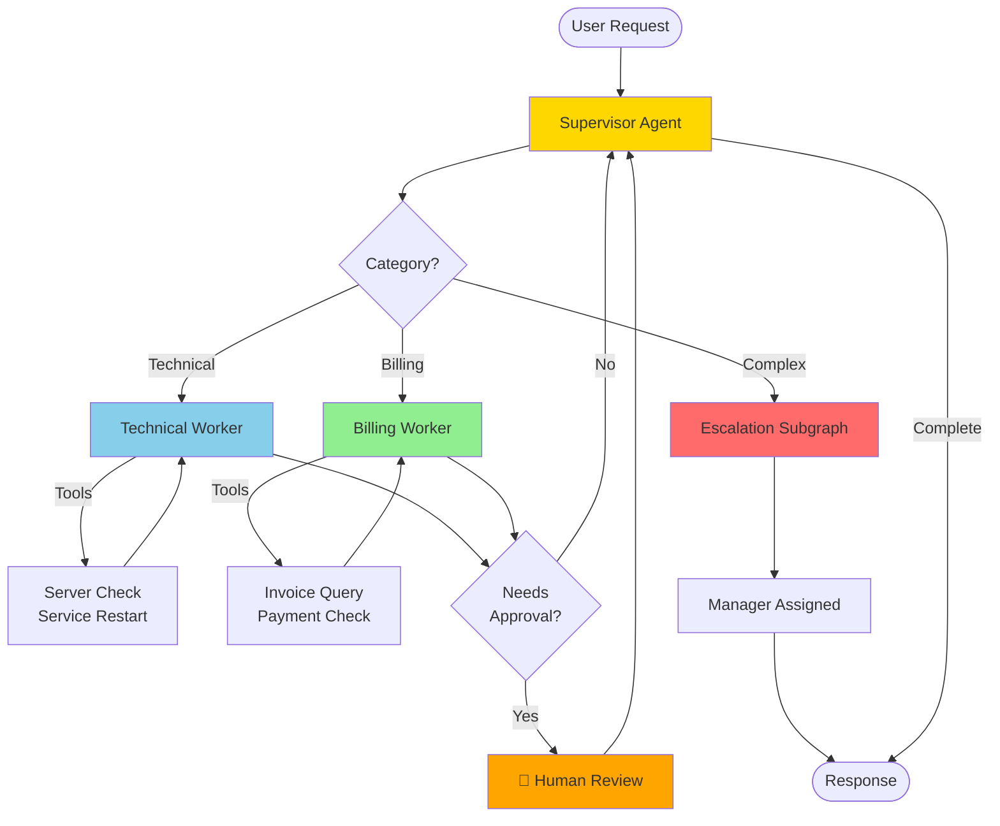

# Agenten Workshop
{: .no_toc }

> **Multi-Agent Support-System bauen**      
> Schrittweise Entwicklung vom einfachen State-basierten Agenten zum intelligenten Multi-Agent-System mit LangGraph

---

# Inhaltsverzeichnis
{: .no_toc .text-delta }

1. TOC
{:toc}

---

## 1 Projektübersicht

In dieser Übungsaufgabe bauen Sie schrittweise ein **Multi-Agent Support-System**, das komplexe Kundenanfragen intelligent routet und bearbeitet.

**Lernziele:**
- LangGraph State Machines von Grund auf verstehen
- Multi-Agent-Architekturen implementieren (Supervisor, Worker)
- Checkpointing und Session-Management nutzen
- Human-in-the-Loop Workflows bauen
- Production-Ready Agenten mit Monitoring deployen

**Zeitaufwand:** ca. 6-8 Stunden (je nach Vorkenntnissen)

**Arbeitsumgebung:** Google Colab oder Jupyter Notebook

**Voraussetzung:** LangChain 1.0+ Grundkenntnisse (Module M01-M11)

---

## 2 Notebook-Struktur

Sie erstellen **ein Notebook** mit **7 aufbauenden Kapiteln**:

```
📓 Multi_Agent_Support_System.ipynb
   ├── 🎯 Kapitel 1: StateGraph Basics
   ├── 🔀 Kapitel 2: Conditional Routing
   ├── 💾 Kapitel 3: Checkpointing & Memory
   ├── 🤖 Kapitel 4: Multi-Agent System (Supervisor)
   ├── 👤 Kapitel 5: Human-in-the-Loop
   ├── 📦 Kapitel 6: Subgraphs & Tool Nodes
   └── 🚀 Kapitel 7: Production Deployment
```

### 2.1 Modul-Zuordnung

Jedes Kapitel baut auf den entsprechenden Kursmodulen auf. Bearbeiten Sie das jeweilige Kapitel **nach** dem zugehörigen Modul:

| Workshop Kapitel | Kursmodul | Thema |
|-----------------|-----------|-------|
| Kapitel 1: StateGraph Basics | M12, M13 | Warum LangGraph? / StateGraph Basics |
| Kapitel 2: Conditional Routing | M14 | Conditional Routing & Tool-Loop |
| Kapitel 3: Checkpointing & Memory | M15 | Checkpointing & Sessions |
| Kapitel 4: Multi-Agent System | M21, M22 | Multi-Agent Patterns / Supervisor Pattern |
| Kapitel 5: Human-in-the-Loop | M17 | Human-in-the-Loop |
| Kapitel 6: Subgraphs & Tool Nodes | M22, M24 | Supervisor Pattern / Hierarchical Agent Teams |
| Kapitel 7: Production Deployment | M28, M31 | Gradio UI / Production Deployment |

> **Hinweis Reihenfolge:** Im Kurs kommt M17 (HITL) vor M21/M22 (Multi-Agent). Im Workshop wird HITL bewusst nach dem Multi-Agent-System eingeführt, um es in den bereits aufgebauten Supervisor-Graph zu integrieren.

---

## 3 Vorbereitung: Google Colab Setup

### 3.1 API-Key in Colab Secrets speichern

1. Klicken Sie in Colab auf das Schlüssel-Symbol 🔑 (linke Sidebar)
2. Fügen Sie `OPENAI_API_KEY` hinzu
3. Aktivieren Sie "Notebook access"

### 3.2 Basis-Pakete installieren

```python
# ═══════════════════════════════════════════════════
# 📦 INSTALLATION
# ═══════════════════════════════════════════════════

!pip install -q langchain>=1.1.0 langchain-openai>=1.0.0 langchain-community
!pip install -q langgraph>=1.0.0 langgraph-checkpoint-sqlite
!pip install -q tiktoken gradio
```

### 3.3 API-Key laden

```python
# ═══════════════════════════════════════════════════
# 🔑 API-KEY SETUP
# ═══════════════════════════════════════════════════

import os
from google.colab import userdata

os.environ["OPENAI_API_KEY"] = userdata.get('OPENAI_API_KEY')
```

---

## 4 Kapitel 1: StateGraph Basics

> 📚 **Kursmodul:** M12 – Warum LangGraph? | M13 – StateGraph Basics

**Lernziel:** StateGraph verstehen, TypedDict State, Nodes & Edges

### 4.1 Szenario
Ein Support-Bot soll Kundenanfragen entgegennehmen, kategorisieren und eine Antwort generieren.

### 4.2 Aufgabe 1.1: State definieren

```python
# ═══════════════════════════════════════════════════
# 🎯 KAPITEL 1: STATEGRAPH BASICS
# ═══════════════════════════════════════════════════

from typing import TypedDict, Annotated, Literal
from langgraph.graph import StateGraph, START, END
from langgraph.graph.message import add_messages
from langchain.chat_models import init_chat_model

# State Definition (TypedDict für Type-Safety)
class SupportState(TypedDict):
    """State für Support-Anfragen."""
    messages: Annotated[list, add_messages]  # Chat-Verlauf
    category: Literal["technical", "billing", "general"] | None
    priority: int  # 1-5
    ...
```

### 4.3 Aufgabe 1.2: Node-Funktionen erstellen

```python
# LLM initialisieren
llm = init_chat_model("openai:gpt-4o-mini", temperature=0.0)

# Node 1: Kategorisierung
def categorize_request(state: SupportState) -> SupportState:
    """Kategorisiert die Kundenanfrage."""
    messages = state["messages"]
    last_message = messages[-1].content
    ...

# Node 2: Antwort generieren
def generate_response(state: SupportState) -> SupportState:
    """Generiert eine passende Antwort."""
    category = state["category"]
    ...
```

### 4.4 Aufgabe 1.3: Graph bauen

```python
# StateGraph erstellen
workflow = StateGraph(SupportState)

# Nodes hinzufügen
workflow.add_node("categorize", categorize_request)
workflow.add_node("respond", generate_response)

# Edges definieren
workflow.add_edge(START, "categorize")
workflow.add_edge("categorize", "respond")
workflow.add_edge("respond", END)

# Graph kompilieren
graph = workflow.compile()
```

### 4.5 Aufgabe 1.4: Graph testen

```python
# Test-Input
initial_state = {
    "messages": [{"role": "user", "content": "Meine Rechnung ist falsch!"}],
    "category": None,
    "priority": 0
}

# Graph ausführen
result = graph.invoke(initial_state)
print(f"Kategorie: {result['category']}")
print(f"Priorität: {result['priority']}")
...
```

**Erfolgskriterium:**
- ✅ StateGraph läuft ohne Fehler durch
- ✅ Kategorisierung funktioniert
- ✅ State wird korrekt aktualisiert
- ✅ Messages werden akkumuliert

---

## 5 Kapitel 2: Conditional Routing

> 📚 **Kursmodul:** M14 – Conditional Routing & Tool-Loop

**Lernziel:** Verzweigte Workflows mit bedingten Edges

### 5.1 Aufgabe 2.1: Router-Funktion erstellen

```python
# ═══════════════════════════════════════════════════
# 🔀 KAPITEL 2: CONDITIONAL ROUTING
# ═══════════════════════════════════════════════════

from langgraph.graph import StateGraph, START, END

# Router-Funktion (entscheidet nächsten Schritt)
def route_by_category(state: SupportState) -> Literal["technical", "billing", "general"]:
    """Routet basierend auf Kategorie."""
    category = state["category"]
    ...
```

### 5.2 Aufgabe 2.2: Spezialisierte Handler

```python
# Technical Support Handler
def handle_technical(state: SupportState) -> SupportState:
    """Behandelt technische Anfragen."""
    ...

# Billing Support Handler
def handle_billing(state: SupportState) -> SupportState:
    """Behandelt Abrechnungsfragen."""
    ...

# General Support Handler
def handle_general(state: SupportState) -> SupportState:
    """Behandelt allgemeine Fragen."""
    ...
```

### 5.3 Aufgabe 2.3: Graph mit Conditional Edge

```python
# Graph mit Verzweigung bauen
workflow = StateGraph(SupportState)

workflow.add_node("categorize", categorize_request)
workflow.add_node("technical", handle_technical)
workflow.add_node("billing", handle_billing)
workflow.add_node("general", handle_general)

# Conditional Edge (verzweigt basierend auf Router)
workflow.add_edge(START, "categorize")
workflow.add_conditional_edges(
    "categorize",
    route_by_category,  # Router-Funktion
    {
        "technical": "technical",
        "billing": "billing",
        "general": "general"
    }
)
...
```

**Erfolgskriterium:**
- ✅ Router-Funktion entscheidet korrekt
- ✅ Verschiedene Kategorien → verschiedene Nodes
- ✅ State enthält richtige Antwort pro Kategorie

---

## 6 Kapitel 3: Checkpointing & Memory

> 📚 **Kursmodul:** M15 – Checkpointing & Sessions

**Lernziel:** Persistente Sessions mit SQLite-Checkpointer

### 6.1 Aufgabe 3.1: Checkpointer einrichten

```python
# ═══════════════════════════════════════════════════
# 💾 KAPITEL 3: CHECKPOINTING & MEMORY
# ═══════════════════════════════════════════════════

from langgraph.checkpoint.sqlite import SqliteSaver

# SQLite-Checkpointer (speichert State persistent)
checkpointer = SqliteSaver.from_conn_string("support_sessions.db")

# Graph mit Checkpointer kompilieren
graph = workflow.compile(checkpointer=checkpointer)
...
```

### 6.2 Aufgabe 3.2: Session-basierte Interaktion

```python
# Thread-Config für Session-Tracking
config = {"configurable": {"thread_id": "user_123"}}

# Erste Nachricht
result1 = graph.invoke({
    "messages": [{"role": "user", "content": "Meine Rechnung ist zu hoch"}]
}, config=config)

# Zweite Nachricht (gleiche Session!)
result2 = graph.invoke({
    "messages": [{"role": "user", "content": "Können Sie das genauer erklären?"}]
}, config=config)
...
```

### 6.3 Aufgabe 3.3: Session-History anzeigen

```python
# History einer Session abrufen
def show_session_history(thread_id: str):
    """Zeigt komplette Session-History."""
    config = {"configurable": {"thread_id": thread_id}}
    history = graph.get_state_history(config)
    ...
```

**Erfolgskriterium:**
- ✅ Sessions werden in SQLite gespeichert
- ✅ Kontext bleibt über mehrere Anfragen erhalten
- ✅ History kann abgerufen werden
- ✅ Sessions können zurückgesetzt werden

---

## 7 Kapitel 4: Multi-Agent System (Supervisor)

> 📚 **Kursmodul:** M21 – Multi-Agent Patterns | M22 – Supervisor Pattern

**Lernziel:** Supervisor-Pattern mit Worker-Agents

### 7.1 Aufgabe 4.1: Worker-Agents definieren

```python
# ═══════════════════════════════════════════════════
# 🤖 KAPITEL 4: MULTI-AGENT SYSTEM
# ═══════════════════════════════════════════════════

from langchain.agents import create_agent
from langchain_core.tools import tool

# Tools für Technical Agent
@tool
def check_server_status(server_id: str) -> str:
    """Prüft Server-Status."""
    ...

@tool
def restart_service(service_name: str) -> str:
    """Startet Service neu."""
    ...

# Technical Worker Agent
technical_agent = create_agent(
    model="openai:gpt-4o-mini",
    tools=[check_server_status, restart_service],
    system_prompt="Du bist ein Technical Support Specialist.",
    ...
)
```

### 7.2 Aufgabe 4.2: Supervisor-Node implementieren

```python
# Supervisor State (erweitert SupportState)
class MultiAgentState(SupportState):
    next_agent: Literal["technical_agent", "billing_agent", "FINISH"] | None
    ...

# Supervisor-Node (entscheidet welcher Agent)
def supervisor_node(state: MultiAgentState) -> MultiAgentState:
    """Supervisor entscheidet, welcher Worker-Agent arbeitet."""
    messages = state["messages"]
    ...
```

### 7.3 Aufgabe 4.3: Multi-Agent Graph bauen

```python
# Multi-Agent Workflow
workflow = StateGraph(MultiAgentState)

# Supervisor & Workers
workflow.add_node("supervisor", supervisor_node)
workflow.add_node("technical_agent", technical_worker_node)
workflow.add_node("billing_agent", billing_worker_node)

# Routing: Supervisor → Workers → Supervisor (Loop)
workflow.add_edge(START, "supervisor")
workflow.add_conditional_edges(
    "supervisor",
    lambda state: state["next_agent"],
    {
        "technical_agent": "technical_agent",
        "billing_agent": "billing_agent",
        "FINISH": END
    }
)
...
```

**Erfolgskriterium:**
- ✅ Supervisor delegiert an Worker-Agents
- ✅ Workers nutzen spezialisierte Tools
- ✅ Ergebnisse werden an Supervisor zurückgemeldet
- ✅ Loop funktioniert (Worker → Supervisor → Worker)

---

## 8 Kapitel 5: Human-in-the-Loop

> 📚 **Kursmodul:** M17 – Human-in-the-Loop

**Lernziel:** Interrupt & Resume für kritische Entscheidungen

### 8.1 Aufgabe 5.1: Interrupt-Point definieren

```python
# ═══════════════════════════════════════════════════
# 👤 KAPITEL 5: HUMAN-IN-THE-LOOP
# ═══════════════════════════════════════════════════

# Graph mit Interrupt kompilieren
graph = workflow.compile(
    checkpointer=checkpointer,
    interrupt_before=["human_approval"]  # Stoppt vor diesem Node
)
```

### 8.2 Aufgabe 5.2: Approval-Node erstellen

```python
# Human Approval Node
def human_approval_node(state: MultiAgentState) -> MultiAgentState:
    """Wartet auf menschliche Genehmigung."""
    # Dieser Node wird NIE ausgeführt (Interrupt davor)
    # Dient nur als Marker
    return state
...
```

### 8.3 Aufgabe 5.3: Interrupt & Resume Workflow

```python
# Schritt 1: Start bis Interrupt
config = {"configurable": {"thread_id": "session_456"}}
result = graph.invoke(initial_state, config=config)

# Graph stoppt bei "human_approval" → Zeige State
print(f"Wartet auf Approval: {result['pending_action']}")

# Schritt 2: Manuelle Genehmigung (in UI oder Console)
approval = input("Approve? (yes/no): ")

# Schritt 3: State updaten & Resume
if approval == "yes":
    graph.update_state(
        config,
        {"approved": True}
    )
    # Resume
    result = graph.invoke(None, config=config)
    ...
```

**Erfolgskriterium:**
- ✅ Graph stoppt bei Interrupt-Point
- ✅ State kann manuell inspiziert werden
- ✅ State kann aktualisiert werden
- ✅ Graph kann resumed werden

---

## 9 Kapitel 6: Subgraphs & Tool Nodes

> 📚 **Kursmodul:** M22 – Supervisor Pattern | M24 – Hierarchical Agent Teams (optional)

**Lernziel:** Modulare Workflows mit Subgraphs

### 9.1 Aufgabe 6.1: Subgraph für Eskalation

```python
# ═══════════════════════════════════════════════════
# 📦 KAPITEL 6: SUBGRAPHS & TOOL NODES
# ═══════════════════════════════════════════════════

# Eskalations-Subgraph (eigener Workflow)
class EscalationState(TypedDict):
    messages: Annotated[list, add_messages]
    escalation_reason: str
    manager_assigned: str | None
    ...

# Subgraph bauen
escalation_workflow = StateGraph(EscalationState)
escalation_workflow.add_node("notify_manager", notify_manager_node)
escalation_workflow.add_node("create_ticket", create_ticket_node)
...

# Subgraph kompilieren
escalation_graph = escalation_workflow.compile()
```

### 9.2 Aufgabe 6.2: Subgraph in Hauptgraph integrieren

```python
# Hauptgraph mit Subgraph
workflow = StateGraph(MultiAgentState)

# Subgraph als Node hinzufügen
workflow.add_node("escalation", escalation_graph)

# Routing zu Subgraph
workflow.add_conditional_edges(
    "supervisor",
    route_decision,
    {
        "escalate": "escalation",
        "continue": "technical_agent"
    }
)
...
```

**Erfolgskriterium:**
- ✅ Subgraph läuft eigenständig
- ✅ Subgraph wird korrekt aufgerufen
- ✅ State wird zwischen Graphs übertragen
- ✅ Modularer, wiederverwendbarer Code

---

## 10 Kapitel 7: Production Deployment

> 📚 **Kursmodul:** M28 – Gradio UI für Agenten | M31 – Production Deployment (optional)

**Lernziel:** Streaming, Monitoring, Gradio-UI

### 10.1 Aufgabe 7.1: Streaming implementieren

```python
# ═══════════════════════════════════════════════════
# 🚀 KAPITEL 7: PRODUCTION DEPLOYMENT
# ═══════════════════════════════════════════════════

# Stream-Mode: Zeigt jeden Node-Übergang
for event in graph.stream(initial_state, config=config, stream_mode="values"):
    print(f"Event: {event}")
    ...

# Debug-Streaming (zeigt alle Zwischenschritte)
for event in graph.stream(initial_state, config=config, stream_mode="debug"):
    print(f"Debug: {event}")
    ...
```

### 10.2 Aufgabe 7.2: Gradio-UI mit LangGraph

```python
import gradio as gr

# Chat-Handler mit LangGraph
def chat_with_agent(message, history, thread_id):
    """Verarbeitet Chat mit Multi-Agent-System."""
    config = {"configurable": {"thread_id": thread_id}}

    # Invoke Graph
    result = graph.invoke({
        "messages": [{"role": "user", "content": message}]
    }, config=config)
    ...

# Gradio Interface
with gr.Blocks() as demo:
    gr.Markdown("# 🤖 Multi-Agent Support System")

    with gr.Row():
        thread_id = gr.Textbox(label="Session ID", value="user_001")

    chatbot = gr.Chatbot(height=500)
    msg = gr.Textbox(placeholder="Ihre Frage...")

    # Event Handler
    msg.submit(chat_with_agent, [msg, chatbot, thread_id], [msg, chatbot])
    ...
```

### 10.3 Aufgabe 7.3: Monitoring & Metrics

```python
# Custom Callback für Metrics
class MetricsCallback:
    def __init__(self):
        self.node_executions = {}
        self.total_tokens = 0
        ...

    def on_node_start(self, node_name: str):
        """Trackt Node-Starts."""
        ...

    def on_node_end(self, node_name: str, duration: float):
        """Trackt Node-Dauer."""
        ...

# Callback in Graph integrieren
graph = workflow.compile(
    checkpointer=checkpointer,
    callbacks=[MetricsCallback()]
)
```

**Erfolgskriterium:**
- ✅ Streaming zeigt Zwischenschritte
- ✅ Gradio-UI funktioniert mit Sessions
- ✅ Metrics werden erfasst
- ✅ Production-ready mit Error-Handling

---

## 11 Bonusaufgaben (Optional)

### 11.1 Bonus 1: LangSmith Integration
- Tracke alle Agent-Aufrufe in LangSmith
- Evaluiere Antwortqualität
- Erstelle Custom-Evaluatoren
- Verwende den EU-API-Endpoint `https://eu.api.smith.langchain.com` (Account + API-Key im EU-Workspace: `https://eu.smith.langchain.com/`)

### 11.2 Bonus 2: Erweiterte Multi-Agent-Patterns
- Hierarchical Agent (3 Ebenen)
- Collaborative Agents (arbeiten zusammen)
- Competitive Agents (wählen beste Lösung)

### 11.3 Bonus 3: Advanced Checkpointing
- PostgreSQL-Checkpointer für Production
- Checkpoint-Branching (Alternative Pfade)
- Time-Travel Debugging

### 11.4 Bonus 4: Mermaid-Visualisierung
- Automatische Graph-Visualisierung mit Mermaid
- State-Transition-Diagramme
- Agent-Interaktions-Diagramme

---

## 12 Bewertungskriterien

| Phase | Punkte | Kriterien |
|-------|--------|-----------|
| 1: StateGraph Basics | 10 | TypedDict, Nodes, Edges, State-Management |
| 2: Conditional Routing | 15 | Router-Funktion, Verzweigungen |
| 3: Checkpointing & Memory | 15 | SQLite-Checkpointer, Session-Management |
| 4: Multi-Agent System | 25 | Supervisor-Pattern, Worker-Agents, Tools |
| 5: Human-in-the-Loop | 10 | Interrupt, Resume, State-Update |
| 6: Subgraphs & Tool Nodes | 15 | Modulare Workflows, Subgraph-Integration |
| 7: Production Deployment | 10 | Streaming, UI, Monitoring |
| **Gesamt** | **100** | |

**Bestanden:** ≥ 60 Punkte

---

## 13 Hilfreiche Ressourcen

**LangGraph Dokumentation:**
- [StateGraph Guide](https://langchain-ai.github.io/langgraph/concepts/low_level/)
- [Multi-Agent Systems](https://langchain-ai.github.io/langgraph/tutorials/multi_agent/)
- [Human-in-the-Loop](https://langchain-ai.github.io/langgraph/how-tos/human_in_the_loop/)

**Code-Vorlagen:**
- [LangGraph 1.0 Must-Haves](../../_docs/LangGraph_Best_Practices.md)
- [LangChain Standards](../LangChain_Standards.md)

**Projekt-Beispiele:**
- Mermaid-Diagramme: `Agenten/Mermaid_Diagramme.ipynb`
- Multi-Agent Patterns: `docs/frameworks/Einsteiger_LangGraph.md`

---

## 14 Architektur-Übersicht



---

## 15 Abgabe

**Format:**
- **Jupyter Notebook** (`Multi_Agent_Support_System.ipynb`)
  - Mit allen 7 Kapiteln ausführbar
  - Mermaid-Diagramme für Workflows
  - Code-Zellen mit Kommentaren
- **SQLite-Datenbank** (`support_sessions.db`) mit Beispiel-Sessions
- **README.md** mit:
  - Kurzbeschreibung des Multi-Agent-Systems
  - Architektur-Diagramm
  - Setup-Anleitung
  - Screenshot des Gradio-UI
- Optional: **Demo-Video** (max. 5 Min.)

**Deadline:** [Wird vom Dozenten festgelegt]

### 15.1 Checkliste vor Abgabe
- [ ] Notebook läuft von oben bis unten fehlerfrei durch
- [ ] Alle API-Keys sind über Colab Secrets eingebunden
- [ ] Alle 7 Kapitel sind implementiert
- [ ] StateGraph verwendet TypedDict (PFLICHT!)
- [ ] Checkpointing funktioniert (Sessions persistent)
- [ ] Multi-Agent-System funktioniert (Supervisor + Workers)
- [ ] Human-in-the-Loop zeigt Interrupt/Resume
- [ ] Gradio-UI läuft und erstellt share-Link
- [ ] README.md erklärt Architektur

---

## 16 FAQ

**Q: Warum LangGraph statt einfachem create_agent()?**
A: `create_agent()` ist für einfache, lineare Agent-Tasks perfekt. LangGraph benötigen Sie für:
  - Multi-Agent-Systeme (Supervisor, Hierarchie)
  - Komplexe Workflows mit Verzweigungen
  - Persistente Sessions über Tage/Wochen
  - Human-in-the-Loop mit Interrupt/Resume

**Q: Muss ich alle Kapitel implementieren?**
A: Kapitel 1-4 sind Pflicht (70 Punkte). Kapitel 5-7 sind optional (30 Bonuspunkte).

**Q: Kann ich PostgreSQL statt SQLite nutzen?**
A: Ja! Für Production ist PostgreSQL empfohlen. In Colab ist SQLite jedoch einfacher.

**Q: Wie viele Worker-Agents soll ich erstellen?**
A: Minimum 2 (Technical + Billing). Für Bonuspunkte: 3-4 spezialisierte Agents.

**Q: Mein Graph führt Endlos-Loops aus**
A: Häufige Ursachen:
  - Supervisor routet nie zu "FINISH"
  - Conditional Edge hat keinen END-Pfad
  - → Fügen Sie `recursion_limit=10` bei compile() hinzu

**Q: Kann ich die Übung auch lokal machen?**
A: Ja! Verwenden Sie dann Jupyter Notebook/Lab lokal und:
  - `from dotenv import load_dotenv` statt Colab Secrets
  - Lokales SQLite funktioniert identisch
  - `share=False` für Gradio

**Q: Was ist der Unterschied zu RAG_Workshop.md?**
A:
  - **RAG Workshop**: Fokus auf LangChain, RAG, Retrieval
  - **Agenten Workshop**: Fokus auf LangGraph, Multi-Agent, State Machines

---

**Version**: 1.1     
**Stand**: März 2026    
**Kurs**: KI-Agenten. Verstehen. Anwenden. Gestalten.        


